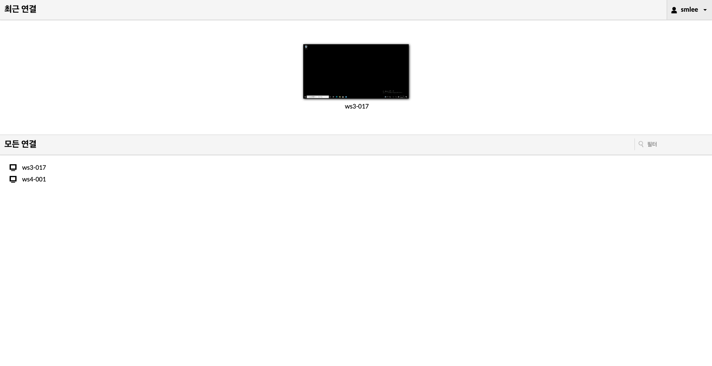
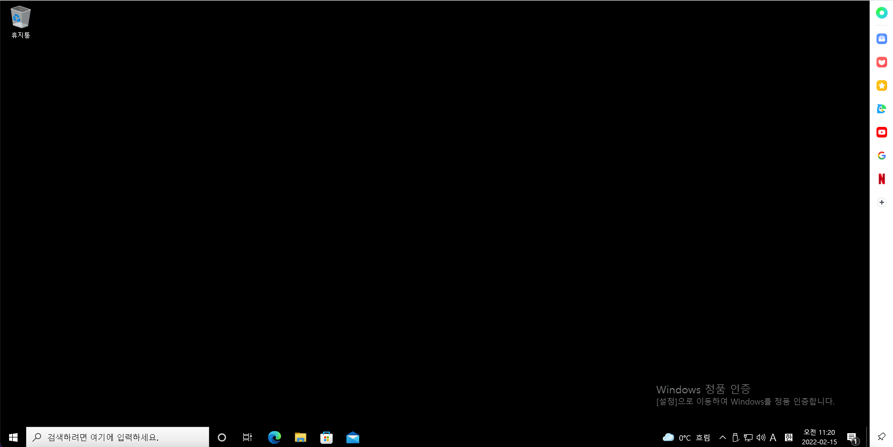
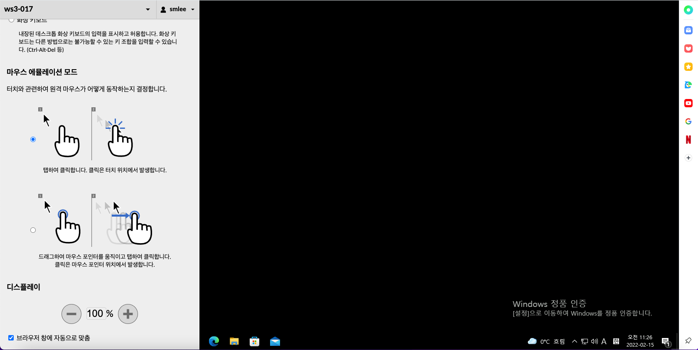
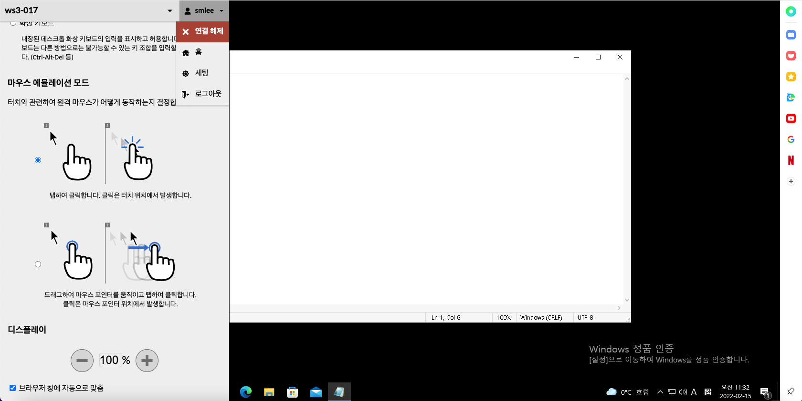

# Works 데스크탑
사용자는 할당된 데스크탑에 로그인 후 할당된 데스크탑에 접속을 할 수 있습니다.

## Works 데스크탑 접속

Works 사용자는 해당 페이지에서 사용자에게 할당 된 모든 연결 리스트에서 연결 할려고 하는 Desktop 을 클릭하여 접속을 할 수 있습니다.

## Works 데스크탑 액션
!!! info
    - 윈도우에서는 **Ctrl + Alt + Shift** 버튼을 동시에 누르면 액션 창을 열 수 있습니다.
    - 맥 OS 에서는 **Control + Option + Shift** 버튼을 동시에 누르면 액션 창을 열 수 있습니다.

- **클립보드** : 클립보드에 내용일 입력 후 데스크탑 화면에서 붙여넣기 진행시 클립보드에 입력된 내용이 붙여넣기가 됩니다.
- **입력방법** : 데스크탑의 입력 방법을 선택 할 수 있습니다.
- **마우스 에뮬레이션 모드** : 터치와 관련하여 원격 마우스가 어떻게 동작하는지 설정 할 수 있습니다.
- **디스플레이** : 디스플레이 확장 또는 축소 설정을 할 수 있습니다.
- **브라우저 창에 자동으로 맞춤** : 해당 기능을 체크하면 데스크탑의 화면이 브라우저에 사이즈에 맞춰서 변경이 됩니다.
- 

- 사용자에게 할당된 데스크탑을 해당 화면에서 선택하여 데스크탑 전환이 가능합니다.

- **연결해제** : 현재 접속 중인 데스크탑의 연결을 해제 합니다.
- **홈** : 데스크탑 선택 화면으로 전환이 됩니다.
- **세팅** : 데스크탑 연결과 관련된 세팅 화면으로 이동 됩니다.
- **로그아웃** : 사용자가 로그아웃 됩니다.
