# Works 데스크톱

사용자가 로그인 후 관리자가 사용자에서 할당한 데스크톱 목록을 확인할 수 있습니다.

## Works 데스크톱 목록

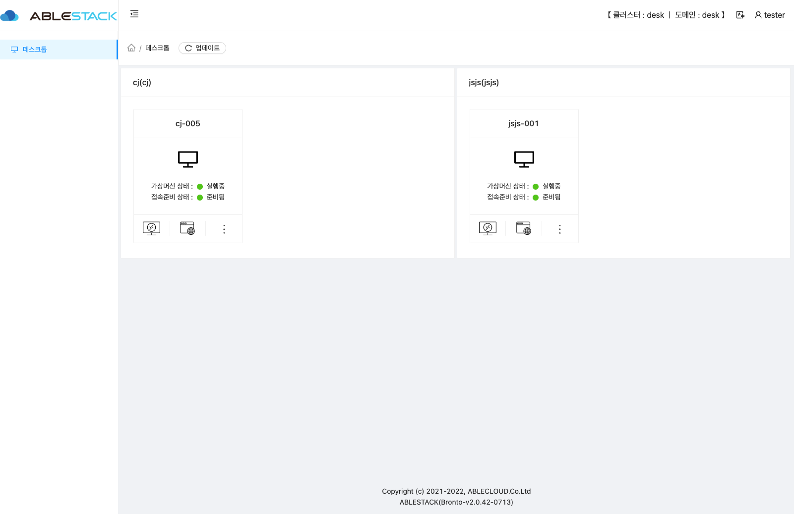
할당 된 데스크톱 목록을 확인하는 화면입니다.

- 워크스페이스별 데스크톱 목록을 확인
- 데스크톱 접속준비 상태 및 가상머신 상태 확인
- 전용 클라이언트 접속
- 웹 클라이언트 접속

## 전용 클라이언트 접속

RDP 접속을 위해 클라이언트를 설치 한 후 데스크톱에 접속하는 기능을 제공합니다.

!!! info
    가상머신 상태 : **실행중**, 접속준비 상태 : **준비됨** 상태가 되어야 정상접으로 접속이 가능합니다.  
    브라우저의 새로운 탭으로 연결이 됩니다.

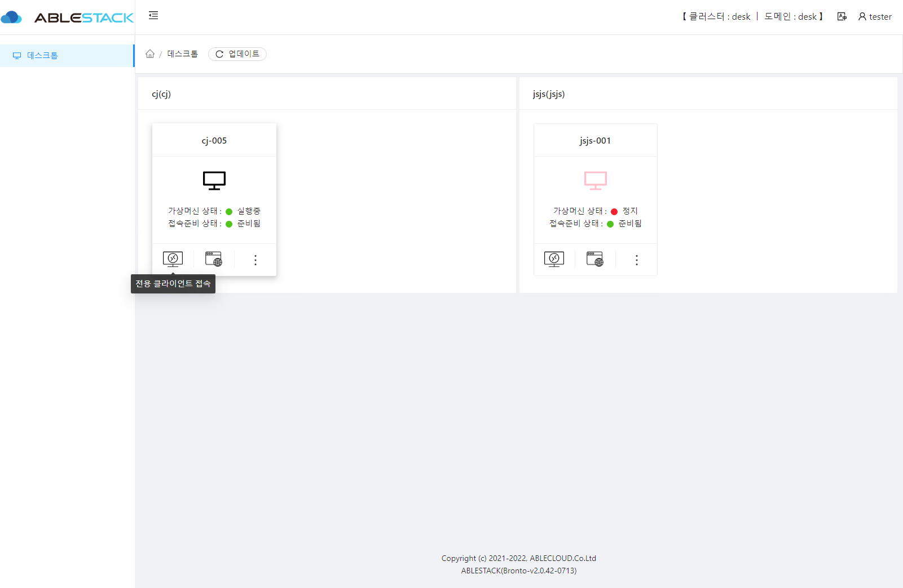
전용 클라이언트 접속을 위한 화면입니다.

- **전용 클라이언트 접속** 버튼 클릭


전용 클라이언트가 설치가 되지 않았을 경우 안내문구 확인 후 설치 진행을 합니다.

```
1. 다운받은 압축 파일을 압축해제 합니다.
2. 압축 해제된 폴더로 이동하여 관리자 권한으로 Cert.exe 파일실행 후 압축을 해제 합니다.
3. 이후 Ablecloud works client.msix 파일을 설치하세요.
4. 2가지 프로그램이 정상적으로 설치 된 후 전용 클라이언트 접속을 진행해주세요.
```

### 전용 클라이언트를 설치하려면 :

1. 다운로드 파일을 압축해제
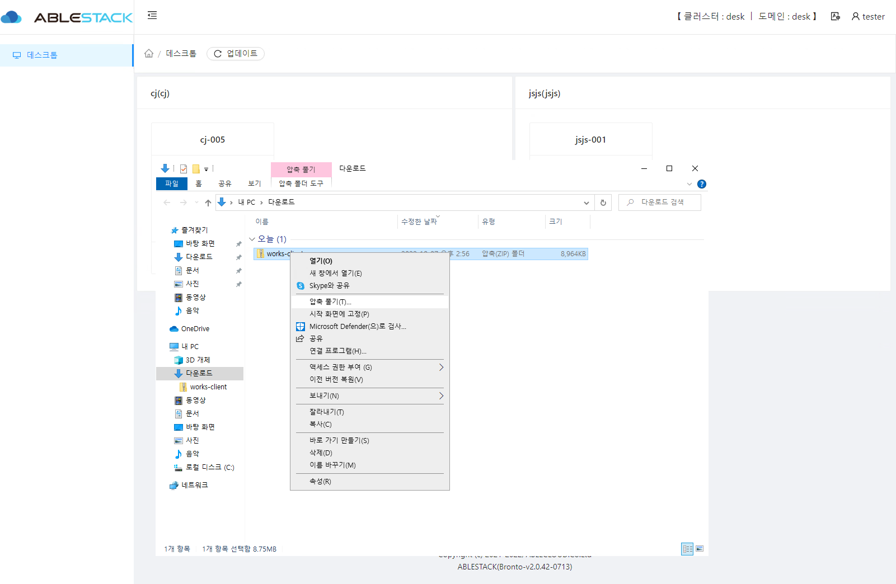

2. Cert.exe 파일을 관리자 권한으로 실행
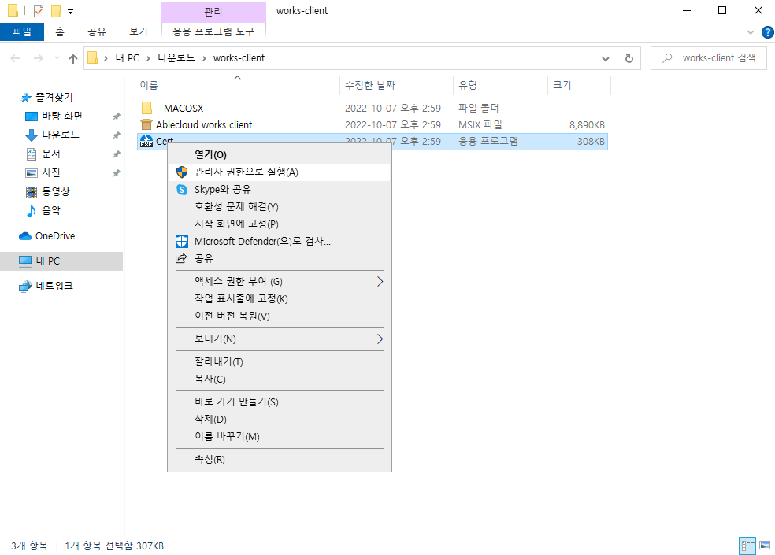

3. Cert.exe 파일 설치
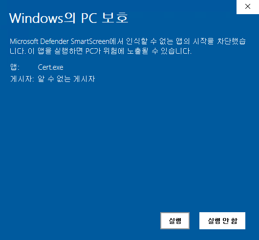

4. 압축 풀기
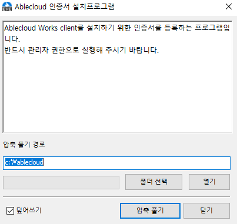

5. Ablecloud works client.msix 파일 설치
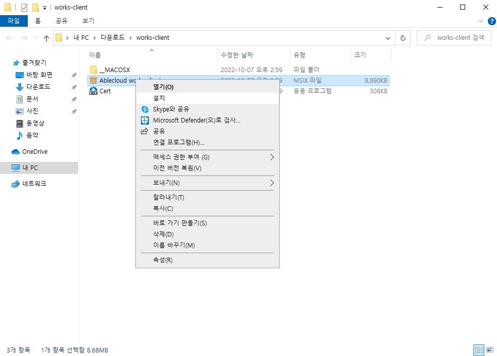

6. 파일 설치
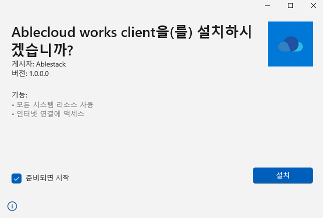

7. 전용 클라이언트 접속
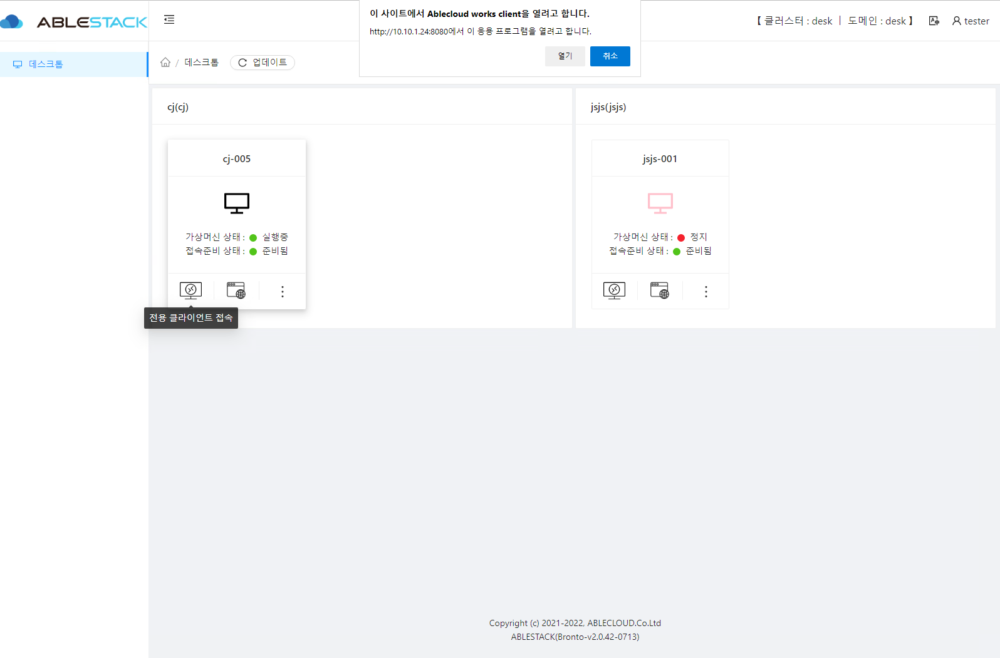

8. RDP 접속 확인


## 데스크톱 접속

웹 브라우저를 통해 데스크톱 윈도우에 접속하는 기능을 제공합니다.

!!! info
    가상머신 상태 : **실행중**, 접속준비 상태 : **준비됨** 상태가 되어야 정상접으로 접속이 가능합니다.  
    브라우저의 새로운 탭으로 연결이 됩니다.

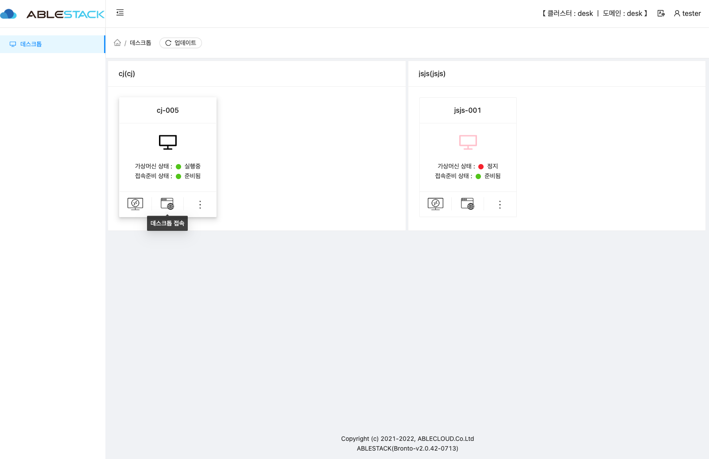
데스크톱에 웹 브라우저로 접속하기 위한 화면입니다.

- 접속 하려는 데스크톱의 **데스크톱 접속** 버튼을 클릭합니다.

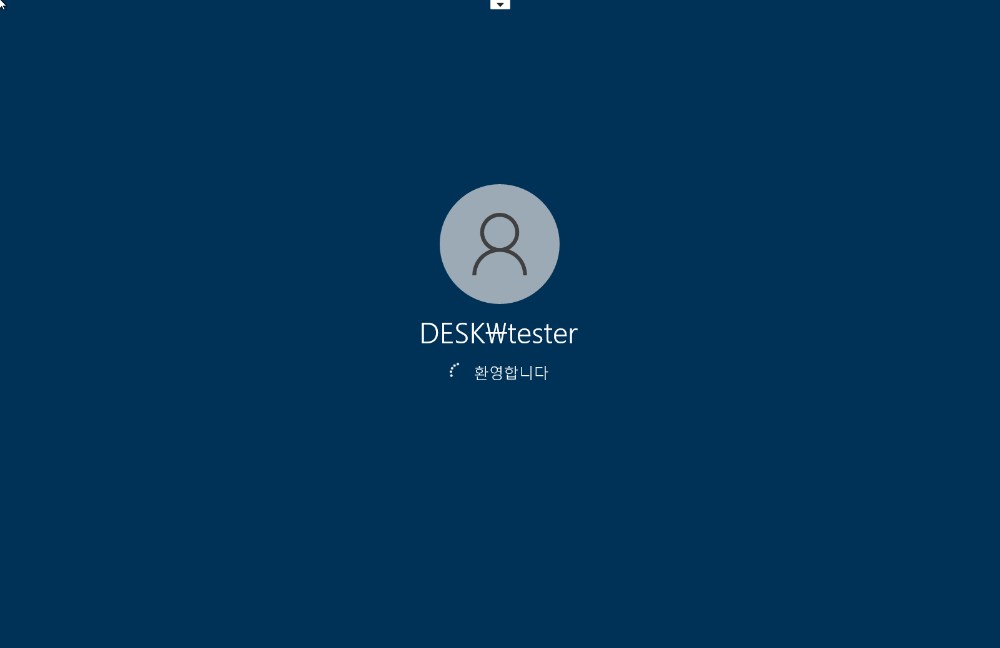
데스크톱에 접속 중인 화면입니다.

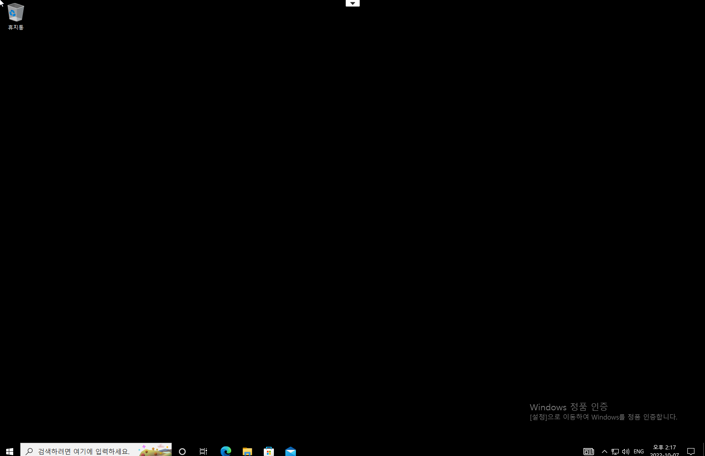
데스크톱에 접속 성공한 화면입니다.

### 브라우저 디스플레이 세팅

데스크톱에 접속한 후 사용자 편의에 맞도록 세팅값을 변경하는 기능을 제공합니다.
화면 상단 중앙에 **화살표** 버튼을 클릭 합니다.

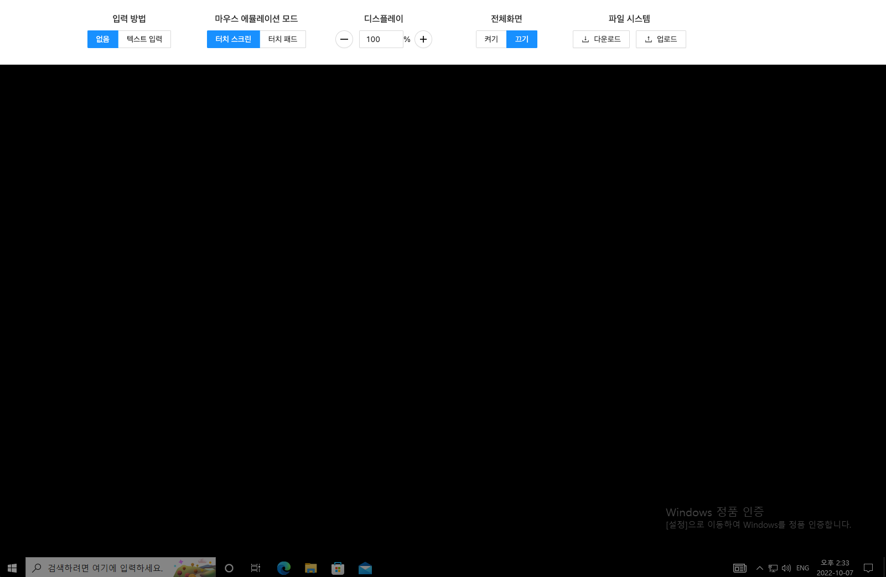

- 입력 방법 : 모바일, 태블릿 사용의 경우 화면으로 키보드 입력을 전달하는 방법을 선택합니다.
  - 없음
  - 텍스트 입력 : 화면 아래에 텍스트입력 박스가 생성이 됩니다.
!!! info
    PC로 접속한 경우 해당사항이 아닙니다.

- 마우스 에뮬레이션 모드 : 모바일, 태블릿 사용의 경우 마우스포인트의 이동 방식을 선택 할수 있습니다.
  - 터치스크린 : 마우스 포인터가 터치하는 곳으로 이동합니다.
  - 터치패드 : 터치 드래그 하면 원하는 방향으로 포인터가 이동합니다.
!!! info
    PC로 접속한 경우 해당사항이 아닙니다.

- 디스플레이 : 디스플레이의 크기(배율)를 조절할수 있습니다.
  - -, + 크기 조절 (10% 단위로 조절)
- 전체화면 : 현재 브라우저를 전체 화면 또는 전체 화면 해제할수 있습니다.
  - 켜기
  - 끄기
- 파일 시스템 : 권한이 있는 사용자라면 다운로드 모달, 업로드 모달을 이용한 공유파일 접근기능을 제공합니다.
  - 다운르도
  - 업로드
!!! info
    파일 다운, 업로드 기능의 정책이 적용된 워크스페이스의 데스크톱 사용자라면 해당기능이 활성화 됩니다.  
    권한이 없다면 해당 기능은 비활성화 됩니다.

#### 파일 다운로드


파일 다운로드 모달화면입니다.

- 파일 목록을 확인 후 **다운로드** 버튼을 클릭합니다.
- 해당 파일이 브라우저를 통해 다운로드 됩니다.

#### 파일 업로드

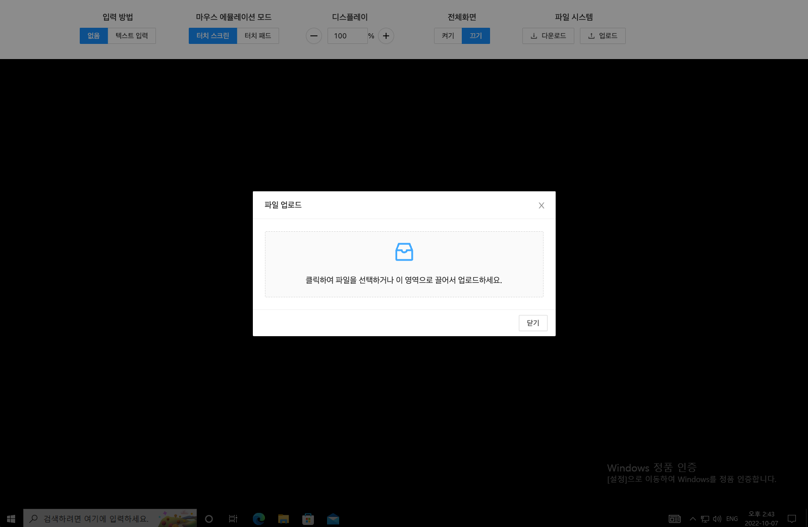
파일 업로드 모달 화면입니다.

- 사용자의 로컬 PC에서 접속한 데스크톱 으로 파일을 업로드 하기위해 모달을 이용할수 있습니다.
- 드래그 앤 드랍 방식으로 브라우저에 파일을 이동하는 방식도 제공합니다.

## 데스크톱 액션

### 데스크톱 시작


!!! info
    정지된 가상머신에서만 **데스크톱 시작** 버튼이 보여집니다.

- 시작하려는 데스크톱 더보기 버튼의 **데스크톱 시작** 버튼을 클릭 합니다.
- Tooltip 안내 문구를 확인 후 **확인** 버튼을 클릭하면 정지된 가상머신이 시작 됩니다.

### 데스크톱 정지

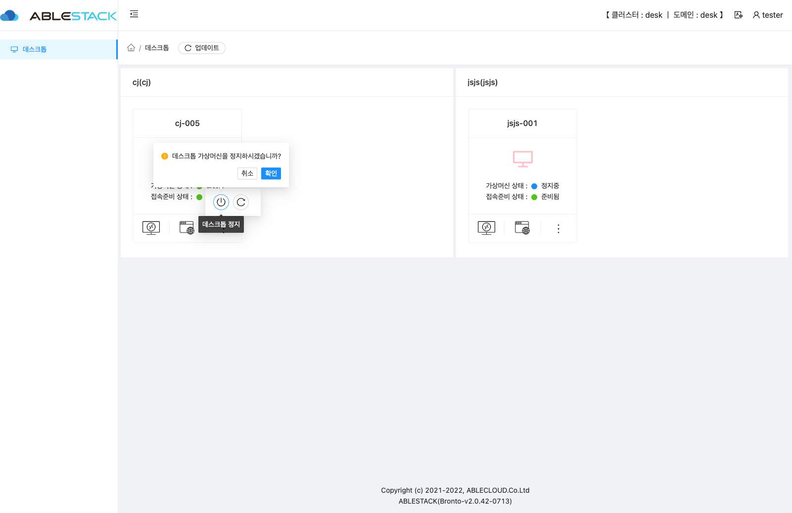

!!! info
    시작된 데스크톱에서만 **데스크톱 정지** 버튼이 보여집니다.

- 시작하려는 데스크톱 더보기 버튼의 **데스크톱 정지** 버튼을 클릭 합니다.
- Tooltip 안내 문구를 확인 후 **확인** 버튼을 클릭하면 시작된 가상머신이 정지 됩니다.

### 데스크톱 재시작


!!! info
    시작된 데스크톱에서만 **데스크톱 재시작** 버튼이 보여집니다.

- 시작하려는 데스크톱 더보기 버튼의 **데스크톱 재시작** 버튼을 클릭 합니다.
- Tooltip 안내 문구를 확인 후 **확인** 버튼을 클릭하면 시작된 가상머신이 정지 됩니다.

## 사용자 비밀번호 변경

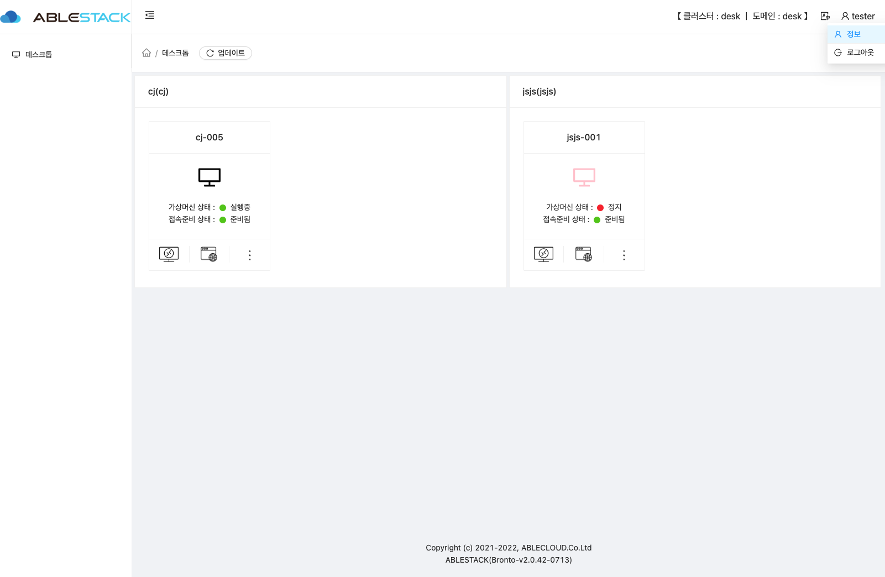
사용자 계정 정보의 상세 화면입니다.

- 화면 우측 상단 사용자 아이콘에서 **정보** 버튼을 클릭합니다.

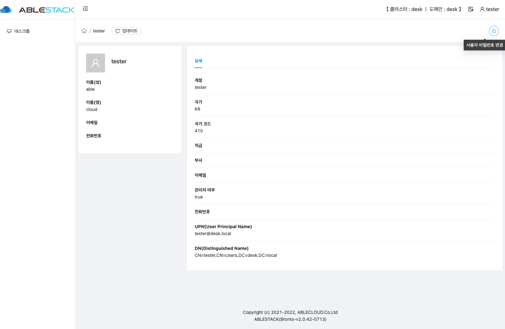
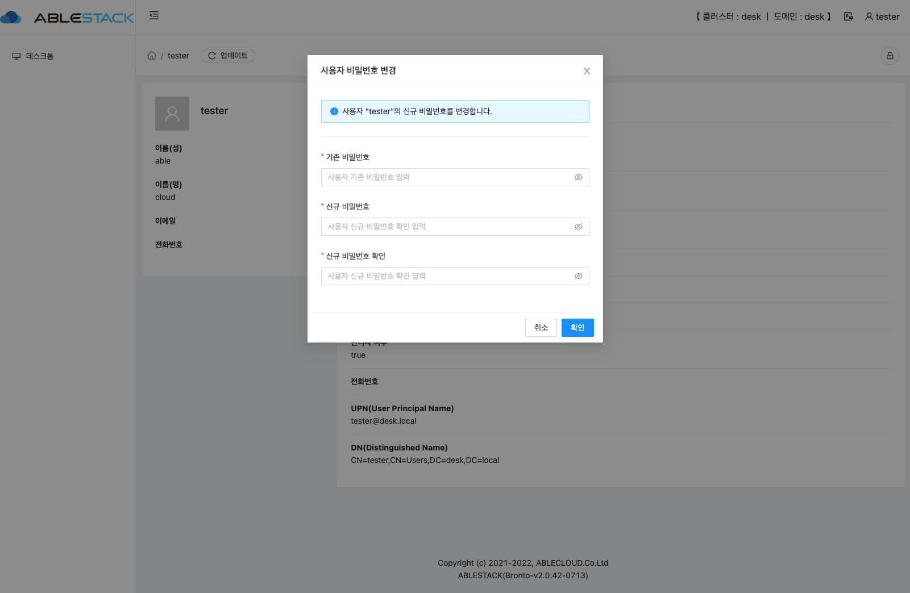
사용자 계정의 비민번호를 변경하기 위한 모달 화면입니다.

- 사용자 상세화면에 우측 상단 **사용자 비밀번호 변경** 버튼을 클릭합니다.
- 기존 비밀번호, 변경할 비밀번호, 비밀번호 확인 값을 입력한 후 **확인** 버튼을 클릭하면 비밀번호가 변경됩니다.
