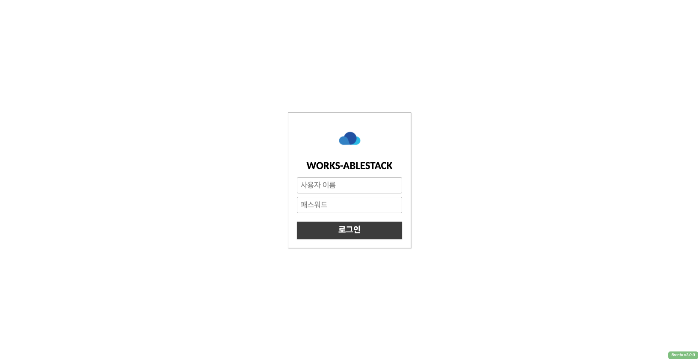

# Works 사용자

[//]: # (사용자는 생성된 데스크탑 서비스의 해당 버튼을 눌러 사용자 로그인 페이지로 이동이 가능합니다.)

[//]: # ()
[//]: # (![works-user-portal-move-button]&#40;../../assets/images/works-user-portal-move-button.png&#41;)
Works 사용자 포털은 사용자가 로그인을 통하여 웹 브라우저를 통하여 데스크탑 서비스를 이용 할 수 있습니다.

!!! info
    사용자 포털 접속은 관리자에게 접속 정보를 전달받아 접속 해야 합니다.

## Works 사용자 로그인

Works 사용자는 해당 페이지에 **사용자 이름** 및 **패스워드** 를 입력하여 사용자 로그인을 할 수 있습니다.
