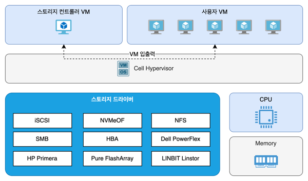
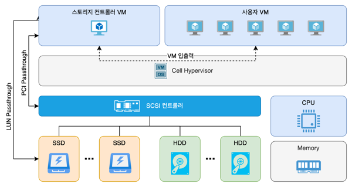
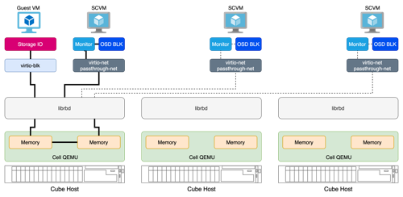
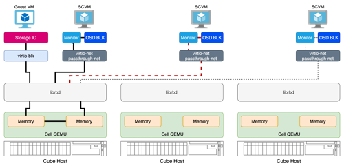

Cell은 '세포, 방' 등의 의미를 가진 명사로,  하나의 개체를 구성하기 위한 요소가 각자의 역할을 수행하는 상태를 묘사합니다. ABLESTACK은 호스트 내에서 구역을 정해 실행되는 가상머신 또는 컨테이너를 실행하기 위한 하이퍼바이저에 이 이름을 붙였습니다. 말 그대로 하나의 호스트의 자원을 쪼개서 각각의 역할을 수행하는 작은 단위의 세포 또는 방인 가상머신을 실행하기 위한 환경을 제공하는 플랫폼입니다. 

Cell은 ABLESTACK에 내장된 하이퍼바이저이며, KVM을 기반으로 합니다. 기본적인 KVM에 스토리지 컨트롤, HA, 라이브 마이그레이션, 네트워크 자동화 및 격리 등의 기능이 ABLESTACK에 맞게 작동하도록 기본 기능을 확장하였습니다. Cell은 리눅스 뿐 아니라, Windows 및 관련 응용 프로그램이 실행되는 것에 대해 검증되어 있으며, 다양한 형태의 드라이버 지원을 통해 유연하게 관련 애플리케이션을 실행하도록 설계되어 있습니다. 

본 문서에서는 Cell의 아키텍처 및 기능을 설명합니다. 

## 아키텍처

Cell의 가상화 환경 제공 방식을 이해하고, 효과적으로 가상머신을 운영하기 위해서는 가상화 아키텍처를 이해하는 것이 필요합니다. 본 문서에서는 가상화 환경을 제공하기 위한 ABLESTACK의 호스트 아키텍처와, 하이퍼바이저의 아키텍처를 설명하고, 개별 가상머신의 구성요소의 구성 시 최대로 할당 가능한 자원의 제한값, 그리고 네트워크의 구성 아키텍처에 대해 설명합니다. 

### VM 호스트 아키텍처

ABLESTACK VM 구성을 위한 호스트에 Cube OS를 설치하면 표준 스토리지를 연결하기 위한 구성요소와 특정 벤더의 소프트웨어 정의 스토리지 연결을 위한 드라이버가 설치됩니다. 지원되는 스토리지는 다음과 같습니다. 

- 표준 iSCSI, NVMeOF 패브릭 스토리지
- NFS, SMB 네트워크 액세스 스토리지
- HBA 카드를 이용한 표준 SAN 스토리지
- Dell PowerFlex
- HP Primera
- Pure FlashArray
- LINBIT Linstor

Cell은 Cube OS가 설치되면 자동으로 설치되며, KVM 하이퍼바이저를 기반으로 사용자가 생성한 게스트 VM에 스토리지 드라이버를 이용해 가상머신용 볼륨을 연결하여 가상머신 IO를 처리합니다. 

다음의 그림은 ABLESTACK VM 구성에서의 Cell 하이퍼바이저의 호스트 관점에서 본 아키텍처를 묘사합니다. 

### HCI 호스트 아키텍처

ABLESTACK HCI 구성을 위한 호스트에 Cube OS를 설치하고 스토리지 컨트롤러를 배포하면 컨트롤러는 가상머신으로 실행됩니다. 그리고 해당 가상머신에는 Glue 스토리지를 구성하기 위한 디스크 인벤토리로 SCSI 컨트롤러를 패스스루해서 전체 디스크를 컨트롤러 가상머신에 할당하거나, LUN 패스스루를 이용해 호스트의 특정 디스크를 가상머신에 할당합니다. 이를 통해 호스트에 있는 디스크는 하이퍼바이저를 우회하여 컨트롤러 가상머신에 직접 전달됩니다. 즉, 하이퍼바이저는 Glue를 구성하기 위해 설치된 호스트의 디스크를 컨트롤하지 않습니다. 

Cell은 전체 디스크 중 호스트의 OS 영역으로 할당된 디스크만 컨트롤하며 각각의 가상머신의 루트디스크 등의 볼륨으로 사용합니다. Cell은 KVM 하이퍼바이저를 기반으로 하며 사용자가 생성한 게스트 VM을 위해 베어메탈 하드웨어 가상화를 사용합니다. 

다음의 그림은 Cell 하이퍼바이저의 호스트 관점에서의 아키텍처를 묘사합니다. 

### 하이퍼바이저 아키텍처

Cell은 Linux KVM을 기반으로 ABLESTACK 운영에 최적화된 기능을 추가한 내장된 하이퍼바이저입니다. Cell 하이퍼바이저는 다음과 같은 주요 컴포넌트로 구성됩니다. 

* KVM Kernel Module : Linux Kernel을 베어메탈 하이퍼바이저로 전환하기 위한 커널 모듈
* libvirtd : KVM 및 QEMU 관리를 위한 API, 데몬 및 관리 도구. Cube/Mold와 KVM/QEMU 간의 통신은 libvirtd를 통해 이루어짐
* qemu-kvm : 가상머신 실행을 위해 유저 스페이스에서 실행되는 하드웨어 에뮬레이터 및 가상화 프로세스이며, 하드웨어 지원 가상화 등에 사용됨

다음의 그림은 Cell 하이퍼바이저의 아키텍처를 묘사합니다. 

!!! info "CPU 세대 호환성"
    호스트의 CPU가 서로 모델이 다르고 세대가 다른 경우, 각 호스트에서 실행 중인 가상머신이 다른 호스트로 마이그레이션 되는 것이 불가능할 수 있는데, 이러한 문제를 해결하고 가상머신의 마이그레이션 및 호환성을 보장하는 기술이 Cell에 적용되어 있습니다. 

    Cell은 CPU 세대 호환성을 적용할 것인지를 사용자가 선택할 수 있으며, 호환성을 적용하는 경우 클러스터 내에서 가장 세대가 낮은 프로세서를 이용해 가상머신의 CPU를 QEMU로 에뮬레이트하여 각 가상머신의 프로세서 호환성을 보장합니다.  

## Cell 제한 사항 

가상화된 시스템, 즉 Cell에 의해 만들어진 가상머신은 물리적인 서버와 거의 비슷하게 작동하지만 몇 가지 제한 사항이 적용됩니다. 이는 가상머신과 호스트 서버 시스템 모두에 영향을 미칩니다. 

### 일반 제한 사항

Cell 사용 시 다음과 같은 일반 제한 사항이 적용됩니다. 

**Over Commit**

Cell은 메모리와 디스크 공간 Over Commit을 모두 허용합니다. Over Commit을 명시적으로 허용하는 경우 이 기술을 사용해서 발생할 수 있는 예기치 않은 자원의 부족이나 성능의 저하 등에 대한 이슈의 여부를 사용자가 이해해야 합니다 만약 사용가능한 리소스를 초과하여 발생하는 하드웨어 오류는 가상머신 오류로 이어집니다. CPU 오버커밋을 성능에 영향을 미치므로 테스트 후 필요한 경우 사용해야 합니다.  

**시간동기화**

대부분의 가상머신은 정확한 시간 기록을 위해 몇가지 추가 지원이 필요합니다. 기본적으로 가상머신에 게스트 에이전트가 사용되는 경우 kvm-clock을 사용합니다. 별도로 안정적인 시간 유지를 위해 NTP 또는 유사한 네트워크 기반 시간 유지 프로토콜 사용을 권장합니다. 

**MAC 주소**

NIC에 MAC 주소를 명시적으로 지정하지 않은 경우 기본적으로 난수 발생된 MAC 주소가 할당됩니다. 매우 드물게 이러한 자동 할당에 의해 둘 이상의 NIC가 동일한 MAC 주소를 수신하면 네트워크 문제가 발생하고 모든 가상머신에 영향을 줄 수 있습니다. 따라서 각 NIC에 대해 고유한 MAC 주소가 할당되었는지 확인해야 합니다.(Mold는 MAC 주소를 자동할당하고 이를 관리하기 때문에 자동할당에 의한 동일 MAC 주소 문제가 발생하지 않습니다.)

**라이브 마이그레이션**

라이브 마이그레이션은 동일한 CPU 기능을 가진 Cube 호스트 간에만 가능합니다. Cell은 CPU를 가상화할 때 3가지 가상화 모드(custom, host-mode, host-passthrough)를 지원합니다. 각 가상화 모드와 호스트 CPU 모델에 따라 라이브 마이그레이션의 가능 여부가 결정되며, 높은 성능을 제공하면서 가장 호환성이 높은 설정은 host-mode이고, 자동으로 마이그레이션 시 CPU의 기능을 조정합니다. host-passthrough는 가장 높은 성능을 제공하지만, 클러스터를 구성하는 CPU가 모두 동일 모델인 경우에만 마이그레이션이 허용됩니다. custom은 Mold가 직접 CPU의 기능을 클러스터 내의 호스트 중 가장 낮은 기능으로 설정하게 됩니다.

**호스트 일시중단/최대절전모드**

가상머신이 실행되는 동안에는 Cube 호스트 서버 시스템을 일시 중단하거나 최대 절전 모드로 전환하는 것은 지원되지 않습니다. 

### 하드웨어 구성 제한 사항

Cell은 가상머신에 대해 다음의 구성 제한에 대해 테스트 되었습니다. 가상머신 및 호스트가 다음의 한계에 도달하여 구성되고, 운영되더라도 성능에 영향 없이 동작하는 것을 보장합니다. 

| 구분                   | 구성 제한값       |
| --------------------- | --------------- |
| 최대 가상머신 메모리 크기  | 16TB             |  
| 가상머신 당 최대 가상CPU  | 710 Core        |
| 가상머신 당 최대 NIC 수   | 8개             |  
| 가상머신 당 최대 가상디스크 수  | 4개 IDE, 20개 SCSI (virtio-blk)             |
| 호스트 당 최대 가상머신  | 가상머신은 호스트의 총 CPU 코어 수의 8배까지 가상머신 CPU를 생성할 수 있으며 가상머신의 수는 이 제한의 영향을 받음 |  

가상화를 위한 호스트 서버에 대해서는 다음의 하드웨어 제한이 테스트 되었습니다. 

| 구분                   | 구성 제한값       |
| --------------------- | --------------- |
| 최대 물리적 CPU         | 4096 Core       |  
| 최대 물리적 메모리       | 16TB            |

### 성능 제한

기본적으로 물리적인 환경에서 설치되고 실행되도록 디자인된 워크로드는 최신의 가상화 기술을 통해 그 기능이 상속되어 실행될 수 있으며, 여러가지 이점을 누릴 수 있습니다. 그럼에도 불구하고, 가상화는 물리적인 호스트에 비해 약간의 성능 감소를 가져올 수 있습니다. 따라서 사용자는 실행하고자 하는 워크로드의 최대 요구 성능을 가상머신이 만족하는지 테스트해야 하며, 이를 통해 가상화를 적용해야 합니다. 우리는 모든 워크로드가 Cell 가상화 환경에서 실행되도록 테스트하고 설계하지만, 경우에 따라 사용자가 설계한 워크로드가 가상화 환경에 적합하지 않을 수 있습니다. 

따라서 우리는 사용자가 워크로드를 실행할 때 참고할 수 있도록 가상머신에서 기대할 수 있는 성능을 테스트하여 제안합니다. 아래의 표에 표시된 백분율은 동일한 워크로드가 가상화 되지 않은 상황에서 얻을 수 있는 성능에 대한 비교치이며, 100%에 가까울 수록 좋은 성능입니다. 제시된 값을 일반적인 워크로드에 대한 대략적인 값이므로 모든 환경에서 동일하다고 보장할 수는 없습니다. 

| 구분                   | 전가상화          | 반 가상화        | 호스트 패스스루       |
| --------------------- | --------------- | --------------- | ------------------ |
| CPU, MMU              | 7%             | 해당없음           | 97% (Intel/AMD CPU), 85% (ARM CPU) |
| 네트워크 입출력          | 60% (e1000 에뮬레이트) | 75% (virtio-net) | 95%          |
| 디스크 입출력            | 40% (IDE 에뮬레이트) | 85% (virtio-blk) | 95%            |
| 그래픽 (비가속)          | 50% (Cirrus)       | 85% (virtio-gpu)     | 95%            |

## 네트워크

ABLESTACK은 모든 가상머신 네트워킹에 Native Bridge를 사용합니다. Native Bridge는 또 다른 브릿지 플랫폼인 Open vSwitch에 비해 다루기 어렵지만, 높은 성능을 제공합니다. 

다음의 그림은 Cell의 Native Bridge 기반의 네트워킹 개념을 묘사합니다. 

### Bridge

브릿지는 물리적 및 가상 네트워크 인터페이스 간의 네트워크 트래픽을 관리하는 가상 스위치 역할을 합니다. 

기본 Cell 설정에는 br-MGMT라고 불리는 관리 네트워크 브릿지, br-VM 이라고 불리는 게스트 네트워크, br-PN, br-CN이라고 불리는 스토리지 네트워크 브릿지가 구성됩니다. br-MGMT는 호스트와 컨트롤 VM 사이의 연결을 제공합니다. br-PN, br-CN은 스토리지 컨트롤 VM(SCVM) 간의 연결을 제공합니다. 

또한 Cell은 cloud0라고 하는 특별한 내부 브릿지를 포함합니다. 이 브릿지는 시스템 VM과 호스트 사이의 보안 연결을 제공하여 시스템 VM의 내부 접속 시 반드시 호스트를 통해서만 보안 접속하도록 강제합니다. 

### VLAN

브릿지는 가상머신의 트래픽을 분리하기 위해 VLAN으로 격리합니다. 브릿지는 VLAN 태깅을 통해 액세스 포트를 생성합니다. 예를 들어 VLAN ID가 101인 네트워크 브릿지를 만드는 경우 br-VM.101 이라는 브릿지를 만들고 해당 브릿지의 vnet 포트를 이용해 가상머신이 해당 VLAN으로 통신할 수 있도록 연결합니다. 

### Port

포트는 가상머신과 가상스위치인 브릿지와의 연결을 제공하는 논리적 구성요소이며, vnet 이라고 표시됩니다. 가상머신이 특정 브릿지에 연결할 때에는 반드시 vnet으로 시작하는 이름의 포트를 만들게 되며, 각 vnet은 만들어진 순서로 일련번호가 생성됩니다. 

### Bond

본드된 포트는 Cell이 설치된 Cube 호스트의 물리적 인터페이스를 통합합니다. 기본적으로 bond로 시작되는 이름의 본드가 만들어지며, MGMT 트래픽을 담당하는 본드는 bond-MGMT의 형식으로 생성됩니다. 생성된 본드는 다양한 트래픽 로드밸런싱을 제공합니다. 

### 업링크 로드밸런싱

위에서 언급한 바와 같이 Bond는 트래픽을 로드밸런싱을 사용할 수 있습니다. 다음과 같은 본드 모드를 사용할 수 있습니다. 

* round-robin : active-active 방식의 본딩으로 네트워크 트래픽을 본딩된 네트워크 인트페이스에 번갈아가며 분산합니다. 트래픽 처리량은 한 개의 NIC 대역폭으로 제한됩니다.
* active-backup : 하나의 액티브 어댑터를 통해 모든 트래픽을 전송하는 것으로 기본 설정입니다. 액티브 어댑터를 사용할 수 없게 되면 본드 내의 다른 어댑터가 액티브로 전환되며 트래픽 처리량은 한 개의 NIC 대역폭으로 제한됩니다.
* balance-xor : XOR 연산을 이용해 목적지 MAC과 소스 MAC을 이용한 분배를 하게 됩니다. 목적지 MAC으로의 트래픽이 본드된 인터페이스 중 하나를 선택하면 해당 트래픽은 그 동안 해당 인터페이스로 트래픽이 전송됩니다.
* broadcast : 특정한 규칙 없이 모든 슬레이브 인터페이스에 트래픽을 전송합니다. 
* 802.3ad LACP : Ling Aggregation으로 스위치에서 해당 설정이 지원되어야 합니다. 모든 인터페이스로 트래픽이 전송되며 트래픽 처리량은 2개의 NIC 대역폭을 제공합니다. 

## 동작 방식

본 문서에서는 ABLESTACK의 Glue 스토리지 연결 방식과 고가용성 동작 방식 등 다양한 내부 동작 방식에 대해 설명합니다. 

### 스토리지 I/O 경로

Cell은 Glue 스토리지와의 연결, 가상머신에의 할당, 마이그레이션 및 고가용성 처리 등을 위한 최적화된 경로 선택 방식을 활용합니다. 모든 디스크는 RAW 타입의 블록 디바이스로 가상머신에 전달됩니다. 

!!! warning "libvirt, virsh 명령 사용 금지"
    Cell은 기본적으로 KVM을 기반으로 하고 있기 때문에 kvm, qemu, libvirt의 스토리지 드라이버를 추상화하여 모든 백엔드 설정을 처리합니다. 이는 사용자가 Mold를 통해 편리하게 가상머신 사용에 집중할 수 있게 도와줍니다.

    다음의 동작방식 설명은 아키텍처의 이해를 돕기 위한 설명이며, 이러한 구성을 이해했다고 해서 virsh 명령이나 kvm 명령을 직접 사용해서 작업하는 것을 허용하는 것은 아닙니다. 

Cell은 Glue 스토리지 연결을 위해서 커스터마이징 된 librbd를 사용합니다. librbd는 Glue 스토리지의 블록 이미지를 Cell 하이버파이저가 인식할 수 있도록 도와주는 라이브러리 입니다. 다음의 그림은 Cell 하이퍼바이저가 Glue 스토리지를 이용해 가상머신 블록 디스크를 연결하는 경로를 묘사합니다. 

가상머신에 블록 디스크를 연결할 때 가장 권장하는 컨트롤러는 virtio-blk입니다. 그리고 다음으로 권장하는 컨트롤러는 virtio-scsi 입니다. ide 컨트롤러의 사용이 가능하지만 대부분의 환경에서 권장되지 않습니다. IO 성능이 매우 저하되기 때문입니다. virtio-blk 또는 virtio-scsi를 Windows 가상머신에서 사용하기 위해서는 virtio 드라이버와 에이전트를 반드시 설치해야 합니다. 최신 Linux 배포판에는 virtio 드라이버가 기본적으로 설치되어 있습니다. 

Cell의 librbd는 주기적으로 Glue 컨트롤 VM의 모니터 데몬의 실행 여부를 확인하고 최적의 경로를 선택하여 스토리지 IO가 발생하도록 관리합니다. 기본적으로 스토리지 연결은 가상머신이 실행 중인 호스트의 Glue 컨트롤러의 모니터 데몬에 연결합니다. 다음의 그림은 호스트가 3대 있는 경우 가상머신의 IO가 어떻게 발생하는지를 묘사합니다. 

만약 가상머신이 실행 중인 호스트의 스토리지 컨트롤러가 중지된 경우, librbd는 자동으로 다음으로 가까운 Glue 컨트롤러의 모니터 데몬에 연결하여 지속적인 IO가 발생하도록 처리합니다. 다음의 그림은 가상머신이 실행 중인 호스트의 스토리지 컨트롤러가 응답이 없는 경우의 IO 경로를 묘사합니다. 

만약 응답이 없던 스토리지 컨트롤러가 되살아 나는 경우 librbd는 바로 이를 인식하고, 다시 가상머신이 실행 중인 로컬 스토리지 컨트롤러로 IO가 발생하도록 설정합니다. 다음의 그림은 스토리지 컨트롤러의 장애가 해결되어 다시 스토리지 IO 경로가 복구되는 상황을 묘사합니다. 

이와 같이 Cell은 librbd를 통해 Glue Storage와 연결하여, 최적의 IO Path를 탐색하고, 일부 Glue Storage 컨트롤러에 문제가 발생하는 경우에도 지속적으로 IO가 발생하도록 경로를 재설정하는 기능을 제공하도록 설계되어 있습니다. 

### 고가용성

Cell은 호스트 고가용성을 제공하기 위해 libvirt의 상태를 확인하여 호스트의 이상 유무를 확인하고 호스트에 장애가 발생 시 해당 호스트에서 실행 중인 가상머신을 다른 호스트로 이관하는 고가용성을 제공합니다. 

호스트 고가용성은 어떠한 스토리지를 사용하든 동일한 고가용성 아키텍처를 제공합니다. 다음의 그림은 Cell의 고가용성 아키텍처를 설명합니다. 

각 호스트에는 Cell HA Helper 데몬이 실행됩니다. 해당 데몬은 libvirt를 이용해 스토리지의 연결상태 및 가상머신의 실행상태를 점검하는 Heartbeat 프로세스를 실행합니다. 그리고 이러한 점검을 자신만 하는 것이 아니라, 클러스터 내에 있는 이웃 호스트에도 요청하여 호스트가 정상적인지를 주기적으로 확인합니다. 

만약 호스트에 장애가 발생하면 Cell HA Helper는 자기 자신의 이상유무를 파악할 수 없게 되고, 이웃에 있는 Cell HA Helper가 이상이 발생한 호스트를 식별하게 되며, 이러한 이상을 전달 받은 Mold는 해당 호스트의 ipmitool을 이용해 전원명령을 전달하여 Fencing을 하고, 해당 호스트에서 실행 중인 가상머신을 다른 호스트에서 실행하도록 처리하게 됩니다. 

### 라이브 마이그레이션

!!! info "마이그레이션 성능"
    가상머신 마이그레이션 성능은 관리 네트워크의 대역폭에 매우 의존적입니다. 마이그레이션 성능을 높이려면 관리 네트워크를 10Gb 이상의 대역폭 제공하여 구성하는 것을 권장합니다. 1Gb 네트워크를 사용하는 경우 가상머신 마이그레이션에 많은 시간이 소요됩니다. 
    
Cell은 가상머신의 라이브 마이그레이션을 지원합니다. 라이브 마이그레이션을 하는 경우 가상머신의 메모리 데이터와 디스크 데이터를 마이그레이션 하고자 하는 호스트로 복사한 후 가상머신을 이동하게 됩니다. 이 때 데이터 복사에 사용하는 네트워크는 관리 네트워크이며, 관리 네트워크의 49152 포트를 사용하게 됩니다. 

다음의 그림은 Cell의 가상머신 라이브 마이그레이션의 처리 아키텍처를 묘사합니다.

