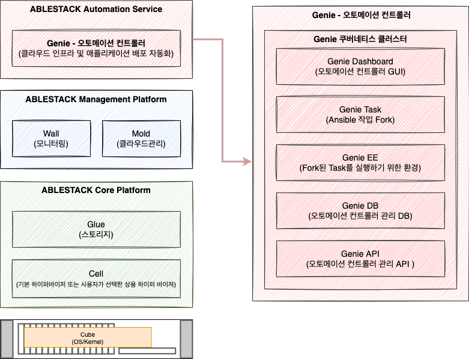
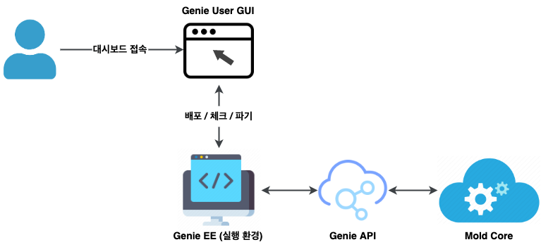
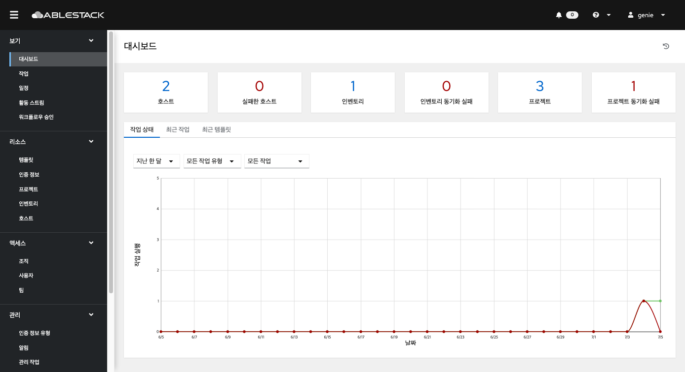

Genie는 개발형 하이브리드 클라우드 배포 자동화 플랫폼으로, ABLESTACK에 대한 자동화 뿐 아니라 퍼블릭/프라이빗 클라우드 환경에 대한 자동화 기능을 제공합니다.

Genie는 범용 언어를 기반으로 수행되는 자동화 도구로, 어려운 작업을 반복적으로 수행할 수 있도록 미리 생성한 플레이북을 기반으로 에이전트 없이 버튼 하나만 누르면 전사적으로 가상머신, 컨테이너, 네트워크, 애플리케이션 등을 배포할 수 있습니다.

## Genie의 설계 목표

Genie는 IT 자동화 툴인 Ansible의 엔터프라이즈 버전으로써 Mold와 연동되어 가상머신, 컨테이너, 네트워크, 애플리케이션 등을 전사적으로 배포하고 사용할 수 있도록 합니다. 이러한 자동화 과정에는 UI(사용자 인터페이스), RBAC(역할 기반 액세스 제어), 워크플로, CI/CD(지속적 통합 및 지속적 전달)가 포함되어 있어 보다 효율적이고 유연하게 자동화 기능을 사용할 수 있습니다. Genie는 조직 전반에서 자동화를 구축하고 운영하기 위한 기반으로, 전사적 자동화를 구현을 목표로 지속적으로 서비스를 개발하여 사용자에게 제공합니다.

본 문서에서는 이러한 설계 목표를 달성하기 위한 Genie의 아키텍처 및 각종 기능, 사용법 등에 대한 간단한 소개를 제공합니다.

## 주요 특징 및 기능

Genie는 다음과 같은 주요 특징을 보유하고 있습니다.

- 직관적인 레이아웃의 그래픽 사용자 인터페이스(GUI) 대시보드
- 강화되고 간소화된 역할 기반 액세스 제어(RBAC) 및 감사
- 모든 작업을 수행할 수 있는 RESTful API
- 자동화 상태를 쉽게 파악할 수 있는 통합 알림
- 정기적인 작업이 가능한 작업 스케줄링
- 시각화 도구를 지원하는 멀티 플레이북 워크플로
- 외부 로깅 통합
- 실시간 작업 상태 업데이트

## 아키텍처

Genie는 자동화 플랫폼으로, ABLESTACK Mold로 구성된 가상화 서비스에서 오토메이션 서비스를 제공할 수 있습니다. Mold에서 오토메이션 서비스를 활성화 시키고, Mold를 통하여 오토메이션 컨트롤러를 계정별로 배포할 수 있습니다. 배포된 오토메이션 컨트롤러에 내장된 Genie 대시보드를 이용하여 ABLESTACK의 자동화 기능을 이용할 수 있습니다.

Genie의 아키텍처는 다음과 같습니다.

### Genie 대시보드

Genie 사용자는 Mold에서 생성한 오토메이션 컨트롤러의 대시보드에 접속하여 서비스를 이용할 수 있습니다. 해당 대시보드에 접속하면 클릭 한 번으로 ABLESTACK에서 제공하는 가상머신, 컨테이너, 네트워크, 애플리케이션을 배포, 체크, 삭제할 수 있습니다.

