Glue는 접착제, 풀을 뜻하는 단어로, ABLESTACK HCI의 스토리지 플랫폼의 이름입니다. 호스트에 있는 디스크를 이용해 통합된 저장공간을 제공하고, 다양한 형태로 스토리지 서비스를 제공하는 HCI 스토리지의 특성을 잘 설명할 수 있는 단어로, 통합 스토리지라는 의미를 담고 있습니다. 

Glue는 ABLESTACK HCI를 구성함으로써 데이터센터에서 필요로 하는 모든 스토리지 서비스를 제공하는 것을 목표로 설계, 개발되었습니다. 

## Glue의 설계 목표

Glue는 ABLESTACK HCI를 실현하기 위한 핵심 구성요소로, ABLESTACK 가상머신에 가상머신용 볼륨 스토리지, 클러스터 HA 지원을 위한 Heartbeat 스토리지, 외부 연결을 위한 파일시스템, 오브젝트 스토리지 등 다양한 저장소를 제공하는 구성요소입니다. 사용자는 실제로는 Mold를 사용하지만, 이 Mold가 일할 수 있는 기반을 외장스토리지 대신 제공해주는 플랫폼입니다. 즉, 사용자는 Glue가 어떻게 서비스 되는지에 대한 관심이 크게 없다는 것입니다. 따라서 이러한 관점에서 Glue는 다음과 같은 목표로 지속적인 플랫폼 개발 및 업그레이드를 계획하고 실행합니다. 

- 사용자 관점에서 투명한 스토리지 환경을 제공 (스토리지 아키텍처가 사용자 환경에 영향을 미치지 않음)
- 간결하고 직관적인 웹 기반 관리 환경 제공
- 다양한 스토리지 게이트웨이를 통해 높은 활용성 제공
- 고성능, 고효율 스토리지 제공
- 신뢰도 높은 모니터링 및 자가 복구를 통한 안정성 제공

본 문서에서는 이러한 설계 목표를 달성하기 위한 ABLESTACK Glue의 아키텍처 및 각종 기능, 사용법 등에 대한 간단한 소개를 제공합니다. 

## 아키텍처 개요

Glue는 ABLESTACK HCI의 핵심 구성요소로 HCI의 스토리지를 제공하기 위한 플랫폼입니다. 

다음의 그림은 ABLESTACK HCI의 전체 구성요소 중 Glue가 제공하는 기능을 아키텍처로 표현합니다. 

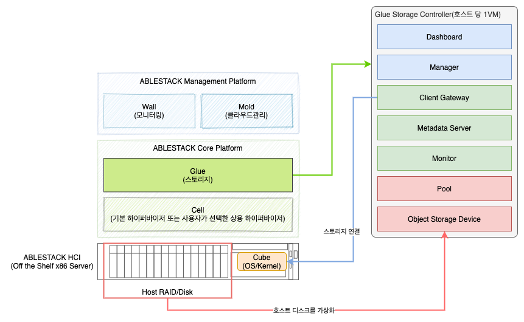

Glue는 분산 아키텍처를 가진 오브젝트 스토리지를 기반으로 다양한 스토리지 게이트웨이를 지원하는 스토리지 플랫폼입니다. Glue의 아키텍처 특징을 몇 가지로 정리해 보면 다음과 같습니다. 

- 분산 아키텍처 기반의 오브젝트 스토리지
- 가상머신 기반 분산 스토리지 컨트롤러
- 무중단 확장 및 고가용성 제공
- 동적 클러스터 관리
- 복제 방식 및 삭제 코딩 방식
- 압축, 중복제거를 통한 고효율 스토리지
- 데이터로컬리티, 오토티어링을 통한 고성능 스토리지
- 다양한 스토리지 게이트웨이 제공

## 분산 오브젝트 스토리지

Glue 스토리지 클러스터는 신뢰성 있는 자동화 분산 오브젝트 저장소(RADOS)를 기반으로 무한 확장을 제공합니다. 

Glue 스토리지 클러스터는 다수의 데몬으로 서비스를 제공하며 다음과 같습니다. 

- Monitor 데몬
- Object Storage Device 데몬
- Manager 데몬
- Metadata Server 데몬

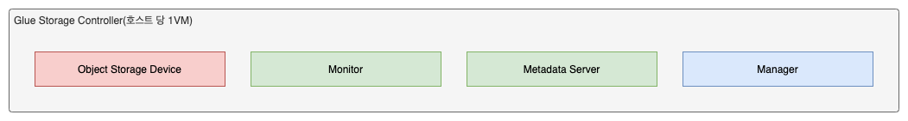

Monitor 데몬은 클러스터 맵, 즉 Glue 스토리지가 어떻게 클러스터링 되어 있고, 데이터가 어떻게 분산되어 있는지를 나타내는 맵의 마스터 복사본을 관리하며, 클라이언트에게 이 맵을 통해 클라이언트가 요청하는 데이터를 알려주고 전송하는 일을 수행합니다. Monitor 데몬은 클러스터링 기술에 의해 고가용성을 보장합니다. 따라서 클러스터링 된 모니터 중 일부 데몬이 중지되는 등의 장애가 발생하는 경우에도 클라이언트는 다른 모니터 데몬에게 클러스터 맵 정보를 요청할 수 있습니다. 

Object Storage Device(OSD) 데몬은 모니터 데몬을 통해 클라이언트가 전송한 데이터를 실제 물리적인 디바이스에 저장합니다. 또한 자신이 관리하는 저장 장치의 상태와 다른 OSD 데몬의 상태를 상호 확인하고 이 결과를 모니터에 보고합니다. 

Manager 데몬은 모니터링, 오케스트레이션, 플러그인 관리 등을 위한 엔드포인트 역할을 하며, 사용자에게 CLI, REST API, Web Dashboard를 제공하는 기반 환경이 됩니다. 

Metadata Server 데몬은 Glue File System을 사용해 클라이언트에 파일 서비스를 제공할 때 파일에 대한 메타 데이터를 관리합니다. 

Glue 스토리지 클러스터는 클라이언트가 어떤 방식으로 Glue 스토리지에 연결되는지와 관계없이, 클라이언트로부터 데이터를 수신하여 신뢰성 있는 자동화된 분산 오브젝트 저장소(RADOS)에 데이터를 저장합니다. 이 분산 오브젝트 저장소는 여러 개의 오브젝트 저장 장치 데몬들을 이용해 구성됩니다. 

각 오브젝트는 오브젝트 저장 장치(Object Storage Device; OSD)에 분산되어 저장됩니다. Glue는 일반적으로 호스트에 있는 물리적 디스크 1개를 하나의 OSD로 설정합니다. 즉 물리적 디바이스와 논리적 디바이스를 1:1로 구성합니다. 이 OSD 데몬은 매핑 되어 있는 디스크 디바이스에 사용자가 전송하는 데이터를 최대 4MB 크기의 오브젝트로 나누어 복제 작업, 그리고 쓰기 작업 및 읽기 작업을 처리합니다. 오브젝트를 디스크에 기록할 때는 데이터를 전통적인 DB 저장과 유사한 방식으로 저장하게 됩니다. 

OSD 데몬은 계층구조가 없는 1차원적 네임스페이스 상에 오브젝트를 저장합니다. 각 오브젝트는 ID와 바이너리 데이터, 그리고 이름/값의 구조로 되어 있는 메타데이터로 구성됩니다. 메타데이터의 의미는 전적으로 Glue에 연결되어 있는 클라이언트에 의해 결정됩니다. 예를 들어, 파일 시스템을 연결한 클라이언트가 만든 파일의 Owner가 파일의 생성 일자, 최종 수정 일자 등의 속성을 저장하면 해당 데이터가 메타데이터로 저장됩니다. 

다음의 그림은 이러한 데이터 저장 구조를 묘사합니다. 

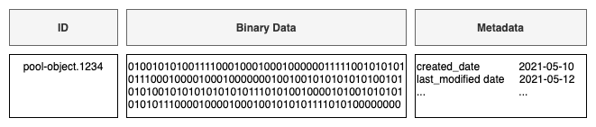

## 가상머신 스토리지 컨트롤러

Glue는 분산 오브젝트 스토리지를 제공하고, 고가용성을 원할하게 제공하기 위해 스토리지 컨트롤러를 가상머신 기반으로 제공합니다. 

다음의 그림은 Glue 스토리지의 가상머신 기반 스토리지 컨트롤러의 구조를 묘사합니다. 

스토리지 컨트롤러는 ABLESTACK HCI 클러스터를 구성하는 호스트에 1대씩 만들어집니다. 가상머신에는 Glue의 컨테이너 이미지가 내장되어 있습니다. 그리고 각 데몬은 컨테이너 이미지를 실행하여 컨테이너로 실행됩니다. 

OSD(Object Storage Device) 데몬은 호스트에 있는 디스크의 수만큼 만들어집니다. 즉 물리적인 디스크와 OSD가 1:1 매핑되므로 루트 디스크를 제외하고 6개의 디스크가 있는 경우 6개의 OSD 데몬이 실행됩니다. 

OSD 데몬은 각 호스트에서 실행 중인 OSD와 Heartbeat를 교환하여 각 OSD 데몬이 정상적으로 실행 중인지를 확인하게 됩니다. 

Monitor 데몬은 각 가상머신에서 1개씩 컨테이너로 실행됩니다. Monitor 데몬은 기본적으로 Glue의 Block Storage의 게이트웨이 역할을 하기 때문에 스토리지 서버와 유사하게 동작합니다. 

Manager 데몬은 Glue 스토리지를 관리하기 위한 데몬으로, 1개의 Active 데몬과 또 다른 하나의 Active 데몬으로 최소 두 대의 가상머신에 실행됩니다. 

## 확장성 및 고가용성

전통적인 아키텍처에서는 클라이언트는 복잡한 하위 시스템에 대한 단일 연결 지점으로 동작하는 중앙화된 게이트웨이 또는 브로커, API와 상호작용합니다. 이러한 단일 게이트웨이는 성능과 확장성이 모두 제한되는 동시에 단일 장애 지점(Single Point of Failure)이 발생하게 되어 중앙화된 게이트웨이가 다운되면 전체 시스템도 다운되게 됩니다. 

이러한 단일 게이트웨이 시스템 중 대표적인 것이 바로 스토리지입니다. 스토리지 서버가 중앙화 되어 있는 단일 게이트웨이를 통해 클라이언트와 연결되면 해당 게이트웨이의 단절만으로 해당 스토리지와 연결된 모든 서비스가 중단됩니다. 

Glue는 이러한 중앙 집중식 게이트웨이를 제거하여 클라이언트가 Glue의 OSD 데몬과 직접 상호 작용할 수 있도록 합니다. OSD 데몬은 데이터 안정성과 고가용성을 보장하기 위해 다른 Glue 노드에 데이터의 복제본을 생성하여 저장합니다. 또한 Glue는 고가용성을 보장하기 위해 Monitor 데몬을 클러스터로 구성하여 제공합니다. 중앙 집중화를 제거하기 위해 Glue는 자체적으로 복제된 데이터의 제어, 확장, 분산 배치를 위한 알고리즘인 CRUSH 알고리즘을 사용합니다.  

### 데이터 복제 및 분산 배치

Glue 스토리지를 연결하는 클라이언트와 Object Storage Device(OSD) 데몬은 모두 CRUSH 알고리즘을 사용해, 객체 위치에 대한 정보를 중앙 조회 테이블에 의존하지 않고, 효율적으로 계산합니다. 

CRUSH 알고리즘은 기존의 데이터 탐색, 유실 데이터의 복제본 참조 등의 접근 방식 등에 비해 더 좋은 데이터 관리 메커니즘을 제공하며, 클러스터 내의 모든 클라이언트 및 OSD 데몬에 작업을 깔끕하게 배포하여 안정적인 서비스 제공 및 대규모 확장을 가능하게 합니다. 

CRUSH는 지능형 데이터 복제를 사용하여 복원력을 보장하며, 이는 하이퍼 스케일 스토리지에 훨씬 적합합니다. 이후의 설명은 Glue가 이러한 CRUSH 알고리즘을 사용해 어떻게 효율적인 데이터 복제 및 분산, 그리고 고가용성을 제공할 수 있는지를 설명합니다. 

### 클러스터 맵

Glue 스토리지는 "클러스터 맵"이라고 총칭하는 5개의 맵으로 이루어진 클러스터 토콜로지에 대한 정보를 갖고 있는 Glue 클라이언트 및 OSD 데몬에 의해 서비스를 제공합니다. 클러스터 맵을 구성하는 5가지의 맵은 다음과 같습니다. 

1. Monitor Map : 클러스터의 `fsid`를 포함하여, 위치, 이름 주소와 각 모니터의 포트 등의 정보를 포함합니다. 현재의 데이터 세대, 맵이 생성된 시간, 마지막으로 수정된 시간 등이 포함됩니다. Monitor Map을 보고자 하는 경우 터미널에서 `ceph mon dump`를 실행합니다. 
2. OSD Map : 클러스터의 `fsid`를 포함하여, 맵이 생성된 시간과 최근에 수정된 시간, 스토리지 풀의 목록, 복제수, PG(배치 그룹) 수, 디바이스의 목록과 디바이스의 상태 등의 정보가 포함됩니다. OSD Map을 보고자 하는 경우 터미널에서 `ceph osd dump`를 실행합니다. 
3. PG Map : PG의 버전과 시간, 최신의 OSD Map 세대 정보, 최대 저장 비율과 각 배치 그룹(Placement Group)에 대한 상세 정보, PG의 상태, 각 스토리지 풀에 대한 데이터 사용량 통계 등의 정보가 포함됩니다. 
4. CRUSH Map : 스토리지 디바이스에 대한 목록을 비롯해, 장애 처리 도메인에 대한 계층구조, 데이터를 저장할 때의 계층 통과 규칙 등의 정보가 포함됩니다. CRUSH Map을 보고자 하는 경우, `ceph osd getcrushmap -o {filename}`을 실행한 후, `crushtool -d {comp-crushmap-filename} -o {decomp-crushmap-filename}` 명령을 실행합니다. 디컴파일된 맵은 텍스트 편집기 등으로 확인할 수 있습니다. 
5. MDS Map : 현 세대의 Metadata Server의 맵 정보를 비롯하여, 맵이 생성된 시간과 최근에 수정된 시간 등을 포함합니다. 또한 메타 데이터를 저장하기 위한 스토리지 풀 정보와 메타데이터 서버의 목록, 그리고 메타데이터 서버의 상태 등을 포함합니다. MDS Map을 보고자 하는 경우 `ceph fs dump` 명령을 실행합니다. 

각 맵은 해당 맵의 운영 상태의 변경사항에 대한 반본적인 기록을 유지합니다. Glue의 Monitor는 클러스터 멤버와 상태, 변경사항 및 Glue 스토리지 클러스터의 전반적인 상태를 포함하고 있는 클러스터 맵의 마스터 복사본을 관리합니다. 

!!! info "클러스터 맵 세대"
    Glue 스토리지는 클래스터 맵의 정보를 빠르게 검색하고, 유지관리하기 위해 Map에 대한 세대를 관리합니다. 각 세대는 이전 세대의 증분 정보를 가져 오며, 기본값으로 500개의 세대를 유지하고, 그 이전의 세대는 제거하여 효율적으로 맵 히스토리지를 관리하도록 설계되어 있습니다. 

### 고가용성 Monitor 데몬

Glue 스토리지에 연결하는 클라이언트는 데이터를 읽거나 쓰기 전에 Glue Monitor에 연결하여 클러스터 맵의 최신 복사본을 가져와야 합니다. Glue 스토리지 클러스터는 단일 모니터로 작동할 수 있습니다. 그러나 이로 인해 단일 장애 지점이 발생합니다. 즉, 모니터가 다운되면 Glue 클라이언트가 데이터를 읽거나 쓸 수 없습니다. 

안정성과 내결함성을 높이기 위해 Glue는 모니터 클러스터를 지원합니다. 모니터 클러스터에서 대기 시간 및 기타 결함으로 인해 하나 이상의 모니터가 클러스터의 최신 상태보다 뒤처질 수 있습니다. 이러한 문제를 해결하기 위해 Glue는 클러스터 상태와 관련하여 다수의 모니터 인스턴스 간의 무결성에 대한 동의를 얻어야 합니다. Glue는 모니터 클러스터를 구성하는 구성원(1, 2:3, 3:5, 4:6)의 Paxos 알고리즘을 사용하여 클러스터의 현재 상태에 대한 모니터 간의 합의를 이루어내고 무결성을 유지합니다. 

### 고가용성 인증

사용자를 식별하고, 중간자 공격으로부터 보호하기 위해 Glue는 `cephx` 프로토콜을 사용하여 사용자와 데몬 간의 인증을 제공합니다. 

!!! note
    `cephx` 프로토콜은 인증 데이터 전송 시 별도의 주소 전송 암호화(예를 들어 SSL/TLS(를 사용하지 않고, 별도의 비밀 키 인증 방식에 의해 데이터를 전송합니다.

Cephx 프로토콜은 인증을 위해서 공유 비밀 키를 사용합니다. 즉, 클라이언트와 모니터 클러스터 모두 클라이언트의 비밀 키 사본이 있어야 합니다. 인증 프로토콜은 두 당사자가 실제로 키를 공개하지 않고 키의 사본을 가지고 있음을 서로 증명할 수 있도록 합니다. 이것은 상호 인증을 제공합니다. 즉, 클러스터는 사용자가 비밀 키를 소유하고 있음을 확인하고, 사용자는 클러스터에 비밀 키의 사본이 있음을 확신하는 것입니다. 

Glue의 주요 확장성 기능은 Glue의 오브젝트 스토리지에 대한 중앙 집중식의 접근 인터페이스를 피하는 것입니다. 이는 Glue 클라이언트가 OSD와 상호 작용할 수 있어야 함을 의미합니다. Cephx 프로토콜과 유사항 방식으로 작동하는 인승 매커니즘은 Kerberos입니다. 

사용자/액터가 Glue 클라이넡느를 호출하여 모니터에 연결합니다. Kerberos와 달리 각 모니터는 사용자를 인증하고 키를 배포할 수 있기 때문에 사용 시 단일 실패 지점이나 병목 현상이 없습니다. 모니터는 Glue 서비스를 얻는 데 사용할 세션 키가 포함된 Kerberos 티켓과 유사한 인증 데이터 구조를 반환합니다. 이 세션 키는 사용자의 영구 비밀키로 자체적으로 암호화 됩니다. 그런 다음 클라이언트는 세션 키를 사용해 모니터에서 원하는 서비스를 요청하고, 모니터는 실제로 데이터를 처리하는 OSD에 클라이언트를 인증하는 티켓을 제공합니다. 

Kerberos와 같이 Cephx 티켓은 시간이 지나면 만료됩니다. 따라서 공격자는 은밀하게 얻은 만료된 티켓 또는 세션 키를 사용할 수 없습니다. 이러한 인증 방식은 사용자의 비밀 키가 만료되기 전에 누설되지 않는 한 중간 공격자가 다른 사용자의 신원으로 가짜 메시지를 생성하거나 다른 사용자의 정상적인 메시지를 변조하는 것을 방지합니다. 

Cephx를 사용하기 위해서는, 먼저 관리자가 사용자를 설정해야 합니다. 다음의 그림은 client.admin 사용자가 `ceph auth get-or-create-key` 명령을 이용해 사용자의 이름과 비밀 키를 생성하는 순서를 보여줍니다. 

!!! warning
    client.admin 사용자는 모든 권한을 가진 사용자입니다. 따라서 해당 사용자의 user ID와 비밀 키를 제공할 때에는 안전한 방법을 고안하여 적용해야 합니다. ABLESTACK HCI는 내부적으로 안전하게 이러한 키를 암호화 하여 보관하도록 설계되어 있기 때문에 공격자가 호스트를 공격하는 경우에도 직접 사용자 정보 및 비밀 키를 획득할 수 없습니다. 

모니터로 인증하기 위해 클라이언트는 사용자 이름을 모니터에 전달하고 모니터는 세션 키를 생성하고 사용자 이름과 연결된 비밀키로 암호화합니다. 그런 다음 모니터는 암호화된 티켓을 클라이언트로 다시 전송합니다. 클라이언트는 공유 비밀키로 페이로드를 해독하여 세션 키를 검색합니다. 세션 키는 현재 세션의 사용자를 식별합니다. 클라이언트는 세션 키로 서명된 사용자를 대신하여 티켓을 요청합니다. 모니터는 티켓을 생성하고 사용자의 비밀키로 암호화 한 다음 다시 클라이언트로 전송합니다. 클라이언트는 티켓을 해독하고 이를 사용하여 클러스터 전체의 OSD 및 메타 데이터 서버에 대한 요청에 서명합니다. 

다음의 그림은 클라이언트와 모니터 사이의 사용자 인증 프로세스를 나타냅니다. 

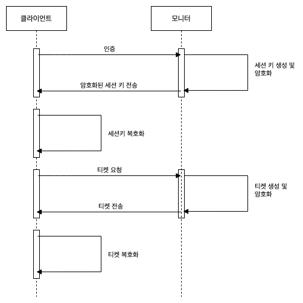

이 `cephx` 프로토콜은 클라이언트 시스템과 Glue 서버 간의 지속적인 통신을 인증합니다. 초기 인증 이후 클라이언트와 서버 간에 전송되는 각 메시지는 모니터, OSD, 메타 데이터 서버가 공유 암호로 확인할 수 있는 티켓을 사용하여 정보를 송수신하게 됩니다. 

다음의 그림은 사용자 인증 및 각 데몬과 클라이언트 간의 데이터 송수신 프로세스를 전반적으로 나타냅니다. 

이러한 인증체계 기반의 보안은 Glue 클라이언트와 Glue 서버 호스트들 사이에서 제공됩니다. 인증체계는 Glue 클라이언트 이상으로 확장되지 않습니다. 만약 원격 호스트로부터 Glue Client 호스트에 사용자가 접근하고자 하는 경우, Glue 인증 체계는 사용자의 호스트와 클라이언트 호스트 사이의 연결에는 적용되지 않습니다. 예를 들어, 사용자의 호스트에서 Glue 스토리지를 기반으로 하여 디스크를 마운트해 사용한다고 했을 때, Glue 스토리지 서버와 클라이언트 연결 사이에서는 인증체계가 적용되지만, 디스크가 마운트 되어 있는 호스트에서는 더 이상 이러한 인증체계에 영향을 받지 않고, 일반적인 운영체제의 사용자 접근 방식을 사용하게 됩니다. 

!!! info
    위의 그림에서 메타 데이터 서버(MSD)에 요청을 보내는 경우는 Glue를 File System으로 연결하는 경우에만 호출됩니다. 예를 들어 Glue를 NFS로 접속하거나 일반적인 POSIX FS로 접근할 때 데이터의 메타데이터를 읽어오는 용도로 사용됩니다. 

    즉, MDS는 Glue를 파일 시스템으로 연결할 때만 사용되며, 그전에는 생성되지 않습니다.

### 대규모 스토리지 스케일 지원

대부분의 클러스터형 아키텍처에서 클러스터 멤버십의 주요 목적은 중앙 집중식 인터페이스가 어떤 노드에 액세스 할 수 있는지의 정보를 제공하기 위함입니다. 이러한 중앙 집중식 인터페이스는 Double Dispatch에 의해 노드를 지정하여 클라이언트에 서비스하게 되고, 이러한 방식은 페타바이트에서 엑사바이트 규모에서의 극심한 병목의 원인이 됩니다. 

Glue는 기본적으로 이러한 병목 현상을 제거합니다. Glue의 OSD 데몬과 Glue 클라이언트는 클러스터를 인식합니다. Glue 클라이언트와 마찬가지로 Glue OSD 데몬은 클러스터의 다른 Glue OSD 데몬에 대해 알고 있습니다. 이를 통해 OSD 데몬이 다른 OSD 데몬 및 모니터와 직접 상호 작용할 수 있습니다. 또한 클라이언트가 OSD 데몬과 직접 상호 작용할 수 있습니다. 

Glue 클라이언트, 모니터 및 OSD가 서로 상호작용할 수 있다는 것은 OSD 데몬이 ABLESTACK Glue 노드의 CPU 및 RAM을 활용하여 중앙 집중식 서버 방식을 탈피한 작업을 수행할 수 있게 합니다. 이렇게 컴퓨팅 성능을 활용하는 기술은 다음과 같은 몇 가지 주요 이점을 제공합니다. 

1. OSD 서비스를 클라이언트에 직접 제공 : 모든 네트워크 장치는 지원할 수 있는 동시 연결 수 및 전송 데이터의 크기에 제한이 있기 때문에 중앙 집중식 인터페이스는 큰 규모의 데이터 전송에서 물리적 제한을 받습니다. Glue 클라이언트가 OSD 데몬에 직접 연결할 수 있도록 하게 되면 각 호스트에서 디스크 단위로 실행 중인 OSD 데몬에 다중으로 연결하게 되어, 단일 장애 지점을 제거하면서 동시에 성능과 전체 시스템 용량을 모두 증가시킵니다. Glue 클라이언트는 필요할 때 중앙 집중식 서버 대신 특정 OSD 데몬을 사용하여 세션을 유지할 수 있습니다. 
2. OSD 멤버십 및 상태 : OSD 데몬이 클러스터에 참여하여 상태를 보고합니다. 기본적으로 OSD는 자신의 상태를 Up, Down으로 표시하여 클라이언트의 요청을 처리할 수 있는지의 여부를 나타냅니다. OSD 데몬이 클러스터 내에서 Down 상태이며 In인 상태라면, 이 상태는 OSD 데몬이 장애 상태임을 나타냅니다. 만약 OSD 데몬이 실행 중이 아니라면 모니터에게 자신이 Down 상태임을 알리지 못할 것입니다. 하지만 OSD끼리 상호 작용하고 있기 때문에 주변에 있는 다른 OSD들이 상호 작용 중인 OSD의 상태를 늘 확인하기 때문에 모니터에 해당 데몬의 실행 여부를 바로 알려줄 수 있습니다. 그리고 모니터는 이러한 상태를 확인하여 클라이언트의 요청에 응답할 수 있는 다른 OSD를 바로 찾아내 알려주게 됩니다. 이러한 메커니즘은 장애에 안전하게 서비스를 제공할 수 있게 합니다. 
3. 데이터 스크럽 : 데이터의 일관성 및 무결성 유지를 위해 OSD 데몬은 저장된 오브젝트를 스크럽합니다. 즉, OSD 데몬은 다른 OSD에 저장된 데이터 복제본과 메타데이터 및 실제 데이터를 배치 그룹(Placement Group) 단위로 비교합니다. 데이터 및 메타데이터의 불일치가 발견되거나 체크섬을 이용한 비교에서의 불일치가 발견되면 데이터를 스크럽하고 이러한 스크럽을 통해 물리적인 디스크의 불량 섹터도 식별하게 됩니다. 
4. 데이터 복제 : 클라이언트 및 OSD는 데이터 배치를 위해 CRUSH 알고리즘을 사용하여 오브젝트 데이터의 원본과 복제본이 저장되어야 하는 위치를 계산합니다. 일반적인 쓰기 시나리오에서 클라이언트는 CRUSH 알고리즘을 사용하여 오브젝트를 저장할 위치를 계산하고 오브젝트를 풀 및 배치 그룹에 매핑한 다음 CRUSH 맵을 확인하여 각 배치 그룹에 대한 Primary OSD, 즉 원본을 기록할 OSD를 식별합니다. 그리고 클라이언트는 Primary OSD의 배치 그룹에 오브젝트를 기록합니다. 그런 다음 CRUSH 맵의 자체 복사본이 있는 Secondary, Tertiary OSD로 오브젝트를 복제하고 쓰기 요청에 대한 응답을 전송합니다. 

다음의 그림은 데이터 쓰기 요청에 대한 응답 과정을 나타냅니다. 

데이터 복제를 수행할 수 있는 기능을 가진 OSD 데몬은 높은 데이터 가용성과 안정성을 보장하면서 클라이언트의 장애 극복에 대한 작업을 경감시켜줍니다. 

## 동적 클러스터 관리

앞서 소개한 확장성 및 고가용성 섹션에서, Glue가 CRUSH 알고리즘을 어떻게 사용하는지 설명하고, 이러한 알고리즘이 어떻게 지능적으로 데몬을 확장하며, 고가용성을 제공하는지를 알아봤습니다. Glue 스토리지의 핵심 설계 목표는 마도 자동화된 자가 복구 및 지능화된 데몬 구성입니다. 다음에 설명할 내용은 CRUSH 알고리즘이 어떻게 현대적인 클라우드 스토리지 인프라를 가능하게 하고, 데이터를 배치하며, 재조정하는지, 그리고 클러스터의 장애로부터 어떻게 동적으로 복구하게 되는지를 알아봅니다. 

### POOL이란 무엇인가?

Glue 스토리지 시스템은 오브젝트를 저장하기 위한 논리적 파티션인 "POOL"이라는 개념을 지원합니다. 

클라이언트는 모니터에서 클러스터 맵을 검색하고 오브젝트를 POOL에 기록합니다. POOL의 복제본 수 (`size`라고 부름), CRUSH 규칙 및 배치 그룹 수에 따라 Glue가 데이터를 배치하는 방법이 결정됩니다. 

다음의 그림은 클라이언트가 오브젝트를 POOL에 기록하는 절차를 묘사합니다. 

POOL은 최소한 다음의 매개 변수를 설정합니다. 

- 오브젝트에 대한 소유권과 접근 권한
- 배치 그룹의 수
- 사용할 CRUSH 룰

### 배치 그룹 매핑

각각의 POOL은 다수의 배치 그룹을 가집니다. CRUSH는 동적으로 OSD에 배치 그룹을 매핑합니다. Glue 클라이언트가 오브젝트를 저장할 때 CRUSH는 배치 그룹에 각 오브젝트를 매핑하게 됩니다. 

배치 그룹에 대한 오브젝트 매핑을 하게 되면 OSD 데몬과 클라이언트 사이에 간접 계층이 생성됩니다. Glue 스토리지 클러스터는 오브젝트를 저장하는 위치를 동적으로 확장하고, 축소하고, 재조정할 수 있어야 합니다. 클라이언트가 OSD 데몬이 어떤 오브젝트를 갖고 있는지 "알았다"라면 클라이언트와 OSD 데몬 사이에 긴밀한 결합이 형성됩니다. 대신 CRUSH 알고리즘은 각 오브젝트를 배치 그룹에 매핑한 다음 각 배치 그룹을 하나 이상의 OSD 데몬에 매핑합니다. 이 간접 계층은 새로운 OSD 데몬과 Primary OSD가 온라인 상태가 될 때 동적으로 재조정 됩니다. 다음의 그림은 CRUSH가 오브젝트를 배치 그룹에 매핑하고, 배치 그룹을 OSD에 매핑하는 방법을 묘사합니다. 

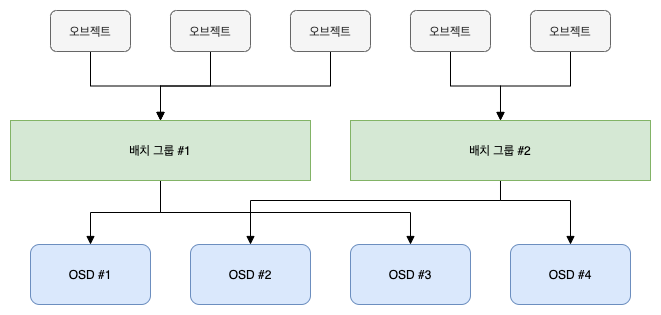

클라이언트는 클러스터 맵과 CRUSH 알고리즘의 복사본을 사용하여 특정 오브젝트를 읽거나 쓸 때 사용할 OSD를 정확하게 계산할 수 있습니다. 

### 배치 그룹 ID 계산

Glue 클라이언트가 Monitor에 바인딩 되면 클러스터맵의 최신 사본을 검색합니다. 클러스터 맵을 통해 클라이언트는 클러스터의 모든 모니터, OSD 및 메타데이터 서버에 대해 알 수 있게 됩니다. 하지만 오브젝트가 어디에 있는지는 아직 모릅니다. 

오브젝트의 위치는 계산하여 알게 됩니다. 

클라이언트에 필요한 유일한 입력은 오브젝트 ID와 POOL입니다. 매우 간단합니다. Glue는 이름이 지정된 풀(예를 들어 as-pool)에 데이터를 저장합니다. 클라이언트가 이름이 붙은 오브젝트(예를 들어 as-pool.obj01, as-pool.obj02)를 저장하려는 경우 개체 이름, 해시 코드, Pool 안에 있는 PG 수, POOL 이름을 사용하여 배치 그룹을 계산합니다. 클라이언트는 다음 단계를 사용하여 배치 그룹 ID를 계산합니다. 

1. 클라이언트는 POOL 이름과 오브젝트 ID를 입력합니다. (예 : POOL='as-pool', OBJ-ID='as-pool.obj01')
2. Glue는 오브젝트 ID를 가져와서 해시합니다.
3. 해시 모듈을 이용해 배치 그룹의 수를 계산합니다. 그리고 배치 그룹 ID를 얻어옵니다. (예 : 58)
4. POOL 이름을 이용해 POOL ID를 얻어옵니다. (예 : 'as-pool' = 4)
5. Glue는 POOL ID와 배치 그룹의 ID를 붙여 오브젝트의 위치를 알아냅니다. (예 : 4.58)

오브젝트의 위치를 계산하는 것은 세션이 위치를 알아내기 위해 쿼리를 수행하는 것보다 훨씬 빠릅니다. CRUSH 알고리즘은 오브젝트가 저장되어야 할 위치를 계산할 수 있도록 해주고, 오브젝트를 저장하거나 읽어오기 위한 Primary OSD에 접근 가능하게 해 줍니다. 

### 피어링과 세트

이미 앞에서 언급했지만, OSD 데몬은 서로에 hearbeat를 확인하고, 다시 모니터에 보고하는 과정을 반복하여 상태를 관리한다고 언급했습니다. OSD 데몬이 수행하는 또 다른 작업은 '피어링'입니다. 이 작업은 OSD끼리 배치 그룹 안에 있는 모든 오브젝트와 메타데이터의 상태에 대해 동의를 구하기 위한 프로세스입니다. 실제적으로는 OSD 데몬은 모니터에게 피어링 실패 보고를 합니다. 피어링 이슈는 일반적으로 스스로 해결하지만, 이러한 문제가 해결되지 않고 지속된다면 "피어링 장애 기술지원"을 통해 문제를 해결해야 합니다. 

!!! note
    피어링을 통해 상태를 동의한다는 것이 배치 그룹의 오브젝트 데이터가 최신의 상태라는 것을 보증한다는 의미는 아닙니다.

스토리지 클러스터는 데이터 안전을 위한 최소 요구사항으로 오브잭트의 복사본을 두개 이상 저장하도록 설계되어 있습니다.(예 : `size=2`) 고가용성을 위해 Glue 스토리지 클러스터는 반드시 2개 이상의 오브젝트에 대한 복사본을 유지해야 하고(예 `size=3, min_size=2`), 이러한 경우 일부 데이터가 장애로 접근 불가능한 상황이 되는 `degraded` 상황이 되어도 안전하게 데이터를 관리할 수 있게 됩니다. 

'대규모 스토리지 스케일 지원'의 그림을 다시 참조해 보면 Primary OSD는 오브젝트와 그 복제본을 기록하기 위한 활성 '세트'의 첫번째 OSD이며, 각 배치 그룹에 대한 피어링 프로세스를 조정하는 역할을 할 뿐 아니라, 클라이언트가 오브젝트를 쓰도록 허용하는 유일한 OSD입니다. 세트의 나머지는 Primary OSD와 상호 작용할 뿐입니다. 

이렇게 오브젝트를 기록하고 복제할 때 사용되는 배치 그룹에 대한 응답을 담당하는 일련의 OSD들을 '활성 세트'라고 부릅니다. 활성 세트는 배치 그룹에 대해 현재 응답 가능한 OSD 데몬에 대한 정보를 참조하거나, 반대로 OSD 데몬이 가신이 응답 가능한 배치 그룹에 대한 요청을 참조할 수 있는 정보입니다. 

활성 세트의 일부분으로써 OSD 데몬이 항상 `up` 상태가 아닐 수 있습니다. 활성 세트의 OSD가 `up` 일때, 이 것은 Up 세트의 일부분이 됩니다. Up 세트는 Glue가 OSD 데몬에 장애가 발생했을 때 다른 OSD 데몬으로 배치 그룹을 재배치할 수 있도록 하는데 사용됩니다. 

!!! note
    활성 세트가 3개의 복제본을 유지하는 배치 그룹으로 이루어져 있고, 이 배치 그룹이 각각 `osd.25`, `osd.32`, `osd.61`로 구성될 때 첫번째 OSD인 `osd.25`가 Primary OSD입니다. 만약 Primary OSD에 장애가 발생하면, `osd.32`가 Primary OSD로 변경되고, `osd.25`는 Up 세트에서 제거됩니다. 

### 재배치(리밸런싱)

Glue 스토리지 클러스터에 OSD 데몬을 새로 추가하면 클러스터 맵이 새로운 OSD로 업데이트 됩니다. 위에서 설명한 배치 그룹 ID를 계산 하는 방법을 다시 참조하면 클러스터 맵이 변경됩니다. 결과적으로 계산에 의해 입력 값이 변경되기 때문에 오브젝트의 배치가 변경됩니다. 리밸런싱을 해도 CRUSH는 안정적임이 보장됩니다. 대부분의 배치 그룹은 원래 구성으로 유지되고, 각 OSD는 약간의 추가 용량을 가지기 때문에 리밸런싱이 완료된 후 새 OSD에 로드 스파이크가 발생하는 일은 없습니다. 

다음의 그림은 일부 배치 그룹(Placement Group; PG)이 새로운 OSD가 추가될 때 리밸런싱 되는 프로세스를 보여줍니다. 

!!! info
    CRUSH 알고리즘을 이용해 위치를 계산하여 자동으로 리밸런싱이 이루어지기 때문에 디스크 및 호스트 추가에 의한 리밸런싱에 쓸데 없는 쿼리에 의한 로드 스파이크가 발생하지 않습니다. 
    
    디스크 등이 추가되면 내부 연산에 의해 바로 데이터가 마이그레이션 되기 때문에 Glue 스토리지가 운영되는 상황에서 디스크를 추가하거나 호스트를 추가하는 것이 언제든 가능합니다. 

### 데이터 일관성

데이터 일관성과 무결성을 유지하는 일환으로 OSD는 배치 그룹 내의 오브젝트로 제거하는 작업을 합니다. 즉, OSD는 한 배치 그룹의 오브젝트 메타 데이터를 다른 OSD에 자장된 배치 그룹의 복제본과 비교합니다. 스크러빙(Scrubbing, 일반적으로 매일 수행)은 종종 하드웨어 문제로 인해 OSD 버그 또는 파일 시스템의 오류를 포착합니다. OSD는 또한 오브젝트의 데이터를 비트 단위로 비교하여 더 깊은 스크러빙(Deep Scrubbing, 기본적으로 매주 수행)을 수행합니다. 깊은 스크러빙은 가벼운 스크러빙에서 분명하게 식별되지 않은 드라이브의 불량 블록을 찾습니다. 

이러한 반복적 스크러빙을 통해 배치 그룹 내의 오브젝트의 일관성을 지속적으로 유지하고, 불량 섹터에 배치되어 있는 오브젝트를 다른 장치로 이동 시키는 등의 작업을 지속적으로 수행하여 무결성을 유지하게 됩니다. 
## 삭제 코딩

Glue는 스토리지의 안정성을 제공하는 방식으로 복제 방식과 함께 삭제 코딩을 지원합니다. 안정성 제공 방식을 POOL 단위로 설정할 수 있으며 복제 방식에 비해 용량을 절약하면서 안정성을 유지할 수 있는 방법이 바로 삭제 코딩 방식입니다. 

삭제 코딩된 POOL은 각 오브젝트를 `K+M` 청크로 저장합니다. 즉, `K`개의 데이터 청크와, `M`개의 코딩 청크로 저장한다는 의미입니다. POOL은 `K+M` 만큼의 사이즈를 갖도록 구성되며 각 청크는 활성 세트에 있는 OSD에 저장됩니다. 각 청크의 순위는 오브젝트의 속성값으로서 저장됩니다. 

예를 들어, `K+M = 5`, `M = 2`로 설정된 POOL은 5개의 OSD로 구성되며, 이 중 2개의 OSD를 잃어도 스토리지가 유지됩니다. 

### 인코딩된 청크 입출력

ABLESTACK이라는 이름의 오브젝트는 "ABCDEFGHI"라는 데이터를 갖고 있습니다. 이 데이터를 POOL에 기록합니다. 이 POOL은 5+2 청크로 기록되는 삭제 코딩 POOL입니다. 삭제 코딩 함수에 의해 데이터는 먼저 세 개로 나눠집니다. 첫 번째는 `ABC`, 두 번째는 `DEF`, 세 번째는 `GHI` 입니다. 오브젝트의 컨텐츠의 길이가 `K`의 배수가 아닌 경우 컨텐츠가 공백으로 채워집니다. 삭제 코딩 함수는 동시에 두 개의 코딩 청크를 생성합니다. 예를 들어 코딩청크는 네 번째는 `YXY`, 다섯 번째는 `QGC`로 만들어집니다. 각 청크는 OSD의 활성 세트에 저장됩니다. 각 청크는 오브젝트의 이름인 `ABLESTACK`이라는 이름으로 저장되지만 각각의 청크는 서로 다른 OSD에 저장됩니다. 청크의 순서는 오브젝트의 속성인 `shard_t`에 저장됩니다. 

다음의 그림은 `ABLESTACK` 오브젝트가 삭제 코딩 POOL에 저장되는 방식을 묘사합니다. 

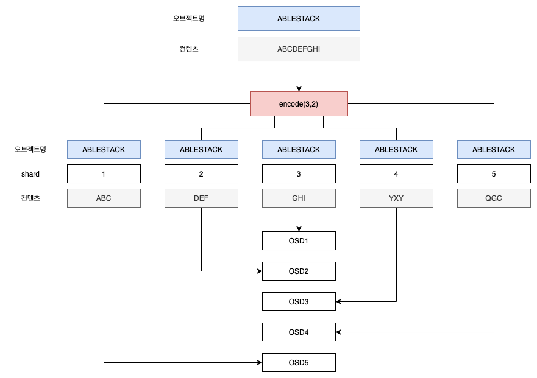

오브젝트 `ABLESTACK`을 삭제 코딩 POOL에서 읽어올 때, 삭제 코딩의 디코딩 함수가 3개의 청크로부터 데이터를 읽어옵니다. 1번 청크는 `ABC`를, 3번 청크는 `GHI`, 4번 청크는 `YXY`를 갖고 있습니다. 그리고 이 데이터를 이용해 원래 컨텐츠인 `ABCDEFGHI`를 다시 만들어냅니다. 디코딩 함수는 2번과 5번 청크가 누락되었음을 알려줍니다. 누락된 청크를 우리는 삭제청크라고 부릅니다. 5번 청크는 OSD4에 장애가 발생한 이유로 Out 되어서 읽어올 수 없습니다. 2번 청크는 읽어오는데 다른 3개의 청크보다 너무 늦게 응답하여 무시되었습니다. 즉, 디코딩 함수는 전체 청크의 응답을 기다리지 않고 가장 먼저 읽어온 3개의 청크만 이용해서 원래 컨텐츠를 생성하게 됩니다. 

아래의 그림은 위에서 설명한 삭제 코딩 POOL에서 오브젝트를 읽어오는 과정을 묘사합니다. 

### 상세한 쓰기 처리 절차 

삭제 코딩 POOL에서 Up 세트 내의 Primary OSD가 모든 쓰기 작업에 응답합니다. Primary OSD는 컨텐츠 페이로드를 K+M 청크로 인코딩하고, 다른 OSD로 청크를 보냅니다. 또한 배치 그룹 로그의 신뢰할 수 있는 버전을 유지관리합니다. 

예를 들어 삭제 코드 배치 그룹은 `K = 2`, `M = 1` 구성으로 생성되었습니다. 즉 3개의 OSD가 청크에 참여합니다(데이터 청크용 2개, 코드 청크용 1개). 배치 그룹의 활성 세트는 OSD1, OSD2, OSD3로 구성됩니다. 오브젝트는 인코딩 되어 3개의 청크로 만들어지고 각각의 OSD에 저장됩니다.  예를 들어 청크 `D1v1`(데이터 1번청크, 버전 1)는 OSD1에, `D2v1`은 OSD2에, `C1v1`(코딩 1번 청크, 버전 1)는 OSD3에 저장됩니다. 각각의 OSD 상에 있는 배치 그룹 로그는 동일 데이터에 대한 쓰기 작업이기 때문에 동일하게(`1,1`, 1세대 버전 1) 기록됩니다. 

다음의 그림은 예시적으로 설명한 쓰기 작업에 대해 묘사합니다. 

모든 쓰기가 완료되면 OSD1은 클라이언트에게 기록이 완료되었음을 알립니다. 이제 해당 오브젝트의 수정 버전(v2)가 생성되어 버전 1을 재정의하게 됩니다. 어떤 상황이 생길지 이제 예상될 것입니다. 인코더는 오브젝트의 페이로드를 3개의 청크로 나눕니다. 1번 청크는 `D1v2`이고 OSD1에 기록되며, 2번 청크는 `D2v2`이고 OSD2에 기록됩니다. 3번 청크는 `C1v2`이고 OSD3에 기록됩니다. 각 청크는 타겟 OSD로 전송됩니다. 그리고 로그(`1,2`)를 기록합니다. 이 때 기록은 비동기식으로 이루어집니다 즉, 저장되는 순서가 있는 것이 아니라 동시에 데이터를 보내기 때문에 순서에 상관없이 기록되는 것입니다. 예를 들어, OSD3에 `C1v2`는 기록이 완료되었지만, OSD2에 `D2v2`를 기록하는 작업은 아직 완료되지 않았을 수 있습니다(In flight IO). 이 때 OSD3에는 로그 `1,2`가 기록되지 않은 상태가 될 것입니다. 

다음의 그림은 In flight 상태의 IO가 있는 예시를 묘사합니다. 

In flight 상태의 데이터, 즉 OSD2에 `D2v2`의 기록이 완료되면 활성 세트에 있는 각 OSD 상에 완료 여부가 인식되고, `last_complete` 포인터를 `1,1`dptj `1,2`로 이동할 수 있게 됩니다. 

다음의 그림은 버전 2의 데이터 기록이 완료된 후의 상태를 묘사합니다. 

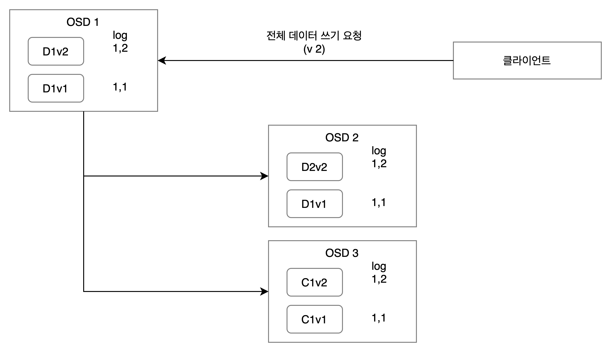

최종적으로, 최신 버전의 청크 데이터가 모두 기록되면 이전 버전의 오브젝트를 삭제할 수 있게 됩니다. 즉, OSD1에 있는 `D1v1`, OSD2에 있는 `D2v1`, OSD3에 있는 `C1v1`을 삭제하여 데이터를 최신 상태로 유지합니다.

다음의 그림은 모든 데이터가 최신 데이터로 기록된 후의 상태를 묘사합니다. 

그런데, 장애가 발생했습니다. 만약 OSD1이 `D2v2`가 아직 In flight 상태에서 다운되었다면, 버전 2의 오브젝트는 아직 기록이 완료되지 않고, 일부 OSD에만 기록된 상태가 됩니다. 이때 OSD3에는 새로운 버전의 청크가 기록되었지만 OSD2에는 아직 청크가 기록되지 않은 상태입니다. 따라서 OSD1에 장애가 발생한 상태에서 버전 2의 데이터를 복구하는데에는 충분한 데이터가 존재하지 않습니다. 

이러한 상태에서는 먼저 OSD4가 새로운 Primary OSD가 됩니다. 그리고 `last_complete` 로그를 확인하고, 현재 로그가 `1,1`이라는 것을 확인합니다. 그리고 해당 로그를 신뢰할 수 있는 로그로 선정합니다. 

다음의 그림은 OSD1에 장애가 발생하고 일부 데이터가 기록이 완료되지 않은 상황을 확인하기 위해 로그를 확인하는 과정을 묘사합니다. 

신뢰할 수 있는 로그가 `1,1`로 선정 되었기 때문에 OSD3에 기록된 `1,2`와 이에 대한 청크 데이터인 `C1v2`를 제거하게 됩니다. `D1v1` 청크는 디코드 함수에 의해 새로운 Primary OSD인 OSD4에 저장하게 됩니다. 

다음의 그림은 새로운 Primary OSD가 세워지고, 로그를 확인하여 In Flight 청크를 확인하고, 기존 데이터로 복구하는 절차를 묘사합니다.

## 캐시 티어링

캐시 티어링은 클라이언트에게 보다 더 좋은 I/O 성능을 제공하기 위한 Glue 스토리지 클러스터의 서브넷 기능입니다. 캐시 티어링은 SSD와 같은 고성능 스토리지 디바이스를 사용해 POOL을 생성하여 캐시 티어로 참여시키고, 속도가 느린 스토리지 디바이스로 생성된 POOL 또는 삭제 코딩으로 만들어진 POOL을 콜드 티어(스토리지 티어)로 참여시켜, 보다 저렴하게 고성능의 스토리지 클러스터를 구성하기 위해 사용합니다. 

Glue 오브젝트 핸들러는 오브젝트를 저장할 때 어떻게 캐시 티어에 데이터를 저장하고, 또 언제 캐시 티어에 있는 데이터를 콜드 티어로 플러시 할지를 자동으로 결정합니다. 클라이언트는 Glue 스토리지가 캐시 티어링으로 구성되어 있는지, 또는 어떻게 데이터가 콜드 티어와 캐시 티어 간에 전송되는지를 신경 쓰지 않는 투명한 구조를 제공합니다. 

다음의 그림은 Glue 스토리지의 캐시 티어가 어떻게 작동하는지를 나타냅니다. 

## 중복제거 및 압축

Glue는 스토리지 용량의 효율적 사용을 위해, 저장되는 스토리지 용량을 줄일 수 있도록 중복제거 및 압축 기술을 사용할 수 있습니다. 

중복제거는 입력되는 데이터를 분석하여 블록 단위로 분할한 후, 동일 블록을 식별하여 해당 블록을 한번만 기록하도록 하는 기술입니다. 압축은 저장될 블록 내의 데이터 중에 동일한 중복 데이터를 제거하여 용량을 줄이는 기술입니다. 일반적으로 중복제거와 압축은 서로 다른 관점에서 데이터의 효율성을 높여주는 기술이기 때문에 모두 데이터 저장에 필요한 공간의 양을 줄이는 데 기여하게 됩니다. 

Glue는 스토리지를 클러스터링 하는 시점, 그리고 POOL을 생성하는 시점에 각각 중복제거 및 압축 여부를 적용할 수 있으며, 실제 적용 시에는 두 가지 방법 중 한 가지 방법을 적용해야 합니다. 중복제거 및 압축의 궁극적인 목표는 물리적인 디스크에 원래 저장되어야 하는 용량보다 적은 용량을 저장하도록 하는 것입니다. 

Glue는 기본적으로 다음과 같은 절차에 의해 중복제거 및 압축을 제공합니다. 

1. 입력된 데이터를 일정한 크기의 블록으로 분할하고 각 블록의 제로 블록을 제거합니다.
2. 모든 블록을 분석하여 동일한 내용의 블록을 식별하고, 중복을 제거합니다. 
3. 중복 제거된 블록을 압축하여 용량을 줄입니다. 
4. Thin 프로비저닝으로 만들어진 물리적인 디스크 영역에 데이터를 기록합니다.

다음의 그림은 중복제거 및 압축 절차를 묘사합니다. 

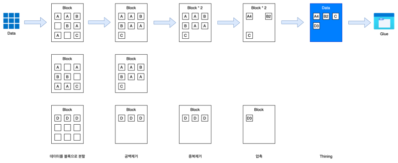

### 디스크 수준 관리

Glue 스토리지 클러스터를 구성할 때, 각각의 Glue 스토리지 컨트롤러에 디스크를 할당하는 시점에서 해당 디스크에 중복제거 및 압축을 적용할 수 있습니다. 디스크 수준에서 중복제거 및 압축을 적용하게 되면 Glue 스토리지 클러스터의 POOL 단위가 아니라, 전체 스토리지 클러스터 자원에 대한 중복제거 및 압축이 적용됩니다. 

다음의 그림은 호스트의 디스크 수준에서 중복제거 및 압축 기능을 적용하여 스토리지 용량을 효율적으로 관리하는 구성을 묘사합니다. 

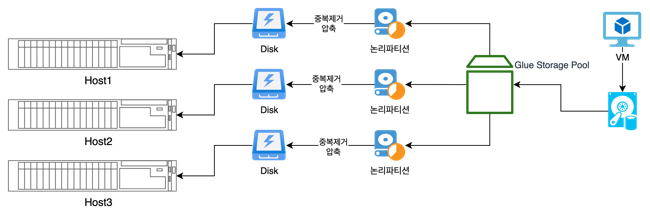

### POOL 수준 관리

디스크 수준에서의 중복제거 및 압축을 적용하지 않고, POOL을 생성하는 단계에서 중복제거 및 압축을 적용하는 POOL 수준 관리 기능을 사용할 수 있습니다. POOL 수준에서 중복제거 및 압축을 적용하게 되면 Glue 스토리지 전체가 아니라, 일부 POOL에 대해서만 중복제거 및 압축을 적용할 수 있게 되어 목적에 따라 효율적으로 POOL을 관리할 수 있습니다. 

다음의 그림은 Glue 스토리지의 POOL 수준에서 중복제거 및 압축 기능을 적용하여 스토리지 용량을 효율적으로 관리하는 구성을 묘사합니다. 

### 포스트 방식 지원

중복제거 또는 압축을 어떤 시점에 하느냐에 따라 Inline 방식과 Post 방식으로 구분합니다. Inline 방식은 데이터가 스토리지에 저장되기 전에 중복제거 또는 압축을 수행하는 방식으로 한 번에 저장되는 데이터에 대한 처리를 하기 때문에 효율성이 떨어지고, 또 실시간으로 연산을 해야 하기 때문에 CPU 및 Memory에 많은 부담을 주게 됩니다. 

Glue 스토리지 클러스터는 Post 방식으로 데이터를 중복 제거하고 압축합니다. 데이터가 저장될 수 있는 별도의 티어가 있고, 해당 티어에 데이터를 먼저 저장합니다. 그리고 비동기적으로 해당 데이터를 분석하여 중복제거와 압축을 수행합니다. 이러한 방식을 사용하면 중복제거 및 압축 효율성이 높아지고, 또 CPU 및 Memory의 사용량에 따라 효율적으로 백그라인운드에서 중복제거 및 압축 작업을 하기 때문에 자원 부담을 줄일 수 있는 효과가 있습니다 

다음의 그림은 Glue 스토리지가 Post 방식으로 중복제거 및 압축을 수행하는 과정을 묘사합니다. 

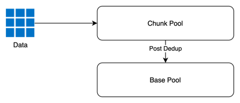

### 글로벌 중복제거

중복제거 또는 압축을 적용하는 단계에 따라 글로벌 방식과 로컬 방식으로 나눌 수 있습니다. 로컬 중복 제거는 특정 가상머신 또는 특정 호스트 내의 장비 내에서만 중복제거 및 압축을 수행하는 방식으로 다루는 데이터의 종류에 따라 낮은 중복제거율을 보입니다. 

Glue 스토리지 클러스터는 전체 클러스터에 대한 중복제거 및 압축을 수행합니다. 즉, 각각의 가상머신이 전체적으로 입력하는 데이터를 모아놓고, 중복제거를 하기 때문에 높은 중복제거 효과를 거둘 수 있습니다. 

다음의 그림은 Glue 스토리지가 글로벌 방식으로 중복제거 및 압축을 수행하는 것을 묘사합니다. 

## 데이터 로컬리티

Glue는 기본적으로 각 호스트의 디스크를 네트워크로 클러스터링하여 하나의 스토리지로 사용할 수 있도록 하는 분산 스토리지 컨트롤러입니다. 따라서 모든 IO의 요청과 응답은 네트워크를 통해서 이루어집니다. 

네트워크를 통해서 이루어지는 IO의 흐름은 네트워크의 상태와 품질에 따라 성능에 많은 영향을 받습니다. NIC의 드라이버 최적화 여부, Latency, 스위치의 상태와 포트별 Latency 등 다양하게 성능에 영향을 미치는 요소들이 있고, 이러한 문제는 실제 디스크의 성능보다 더 많은 영향을 끼칩니다. 

이러한 네트워크 성능 요소가 특히 스토리지 성능에 악영향을 끼치는 것은 작은 데이터의 전송, 즉 Random 4k 또는 8k 전송입니다. 따라서 대부분의 가상머신 IO에 중대한 성능 이슈를 발생시키는 이유가 됩니다. 

Glue는 이러한 네트워크의 문제를 해결하기 위해 데이터 로컬리티 기술을 적용하여 스토리지 IO의 성능을 높이고, 또한 일관된 성능이 유지되도록 합니다. 

데이터 로컬리티란 가상머신의 IO가 가상머신이 실행 중인 호스트의 고성능 디스크를 사용해 발생하도록 처리하는 기술입니다. 즉, 데이터를 읽거나 쓸 때 가상머신이 실행 중인 호스트의 PMEM 또는 SSD 같은 고성능 디스크를 사용하도록 하여, 데이터가 네트워크의 영향을 받지 않고 빠르게 전송될 수 있도록 하는 기술입니다. 

Glue는 두 가지 방식으로 데이터 로컬리티를 제공합니다. 

### Write Back 로컬리티

Glue의 Write Back 로컬리티는 가상머신에 대해 영구적인 고속 매체를 이용한 Write Back 캐시를 제공하여 가상머신 IO의 데이터 로컬리티를 제공합니다. 

이 캐시는 내부적으로 순서화된 Write Back 로그(PWL)를 사용하여, 클러스터에 Flush된 데이터에 대해서는 항상 CRASH 일관성을 유지하도록 설계되어 있습니다. 만약, 가상머신이 실행 중인 호스트가 셧다운되어 캐시의 데이터가 Flush 되지 못한 경우에도 실제 Glue 클러스터에 저장된 디스크의 이미지는 여전히 일관성을 유지합니다. 하지만 해당 데이터는 캐시에 있던 최신의 데이터보다는 좀 더 오래된 데이터가 될 것입니다.

이 로컬리티 캐시는 Persistent Memory 또는 SSD를 사용합니다. 

다음의 그림은 Glue 스토리지가 PMEM 또는 SSD를 이용해 어떻게 데이터 로컬리티를 제공하는지를 묘사합니다. 

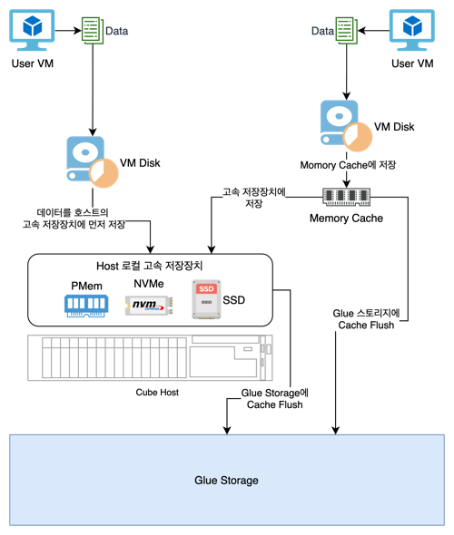

### VM 이미지 로컬리티

ABLESTACK은 가상머신을 만들 때 Glue에 있는 가상머신 이미지를 사용합니다. 이 가상머신 이미지를 우리는 베이스 이미지라고 부르며, 베이스 이미지를 이용해 만들어진 가상머신의 디스크는 부모 이미지의 작은 변경 사항만 갖고 있게 됩니다. 

예를 들어, 가상 데스크톱 환경에서, 가상머신들은 동일한 베이스 이미지로부터 복제되어 생성됩니다. 그리고 이 가상머신에서 베이스 이미지와 다른 부분은 가상머신의 호스트 이름, IP 주소, 도메인 정보 정도만 다를 뿐입니다. 가상머신이 부팅되는 동안, 이러한 모든 가상머신들은 동일한 베이스 이미지 데이터를 읽어옵니다. 따라서 해당 베이스 이미지에 과다한 부하가 발생하게 됩니다. 

만약, 이러한 베이스 이미지에 대한 호스트 측의 로컬 캐시가 있다면 가상머신의 데이터를 읽어오는 속도를 높일 수 있을 것입니다. 그리고 한번 베이스 이미지를 호스트 캐시에 복사하면 더 이상 Glue 클러스터로부터 데이터를 읽어올 필요가 없기 때문에 클라이언트에서 클러스터 간의 네트워크 트래픽이 획기적으로 줄어듭니다. 이러한 아키텍처를 통해 가상머신의 동시 부팅 부하(부트스톰), 바이러스 검사 부하(안티 바이러스 스톰) 등을 효과적으로 대응할 수 있습니다.

Glue는 베이스 이미지를 로컬 디스크로 가져오기 위해 별도의 데몬을 호스트별로 실행합니다. 그리고 이 데몬이 각각의 베이스 이미지에 대한 캐시 저장, 제공 등의 작업을 수행합니다. 

다음의 그림은 Glue 스토리지의 가상머신 베이스 이미지를 로컬 디스크에 어떻게 가져오고 가상머신의 부하를 분산하는지를 묘사합니다. 

## 클라이언트 게이트웨이

Glue는 스토리지에 다양한 클라이언트들이 연결되어 스토리지 서비스를 받을 수 있도록 다양한 형식의 게이트웨이를 제공합니다.

다음의 그림은 Glue 스토리지가 제공하는 클라이언트 게이트웨이의 종류와 방식을 설명합니다. 

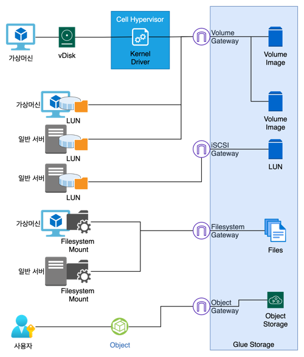

### 블록스토리지

가상머신에 블록 기반의 디스크를 제공합니다. 사용자가 지정한 크기의 블록 디바이스를 Glue 스토리지에 만들고, 해당 디바이스를 가상머신의 디스크로 연결하여 사용할 수 있도록 합니다. 

### 파일시스템

파일시스템은 모든 클라이언트가 동일한 저장소 공간을 공유하고 사용해야 할 때 필요합니다. 즉 다양한 가상머신 또는 서버가 동일한 공간을 연결하여 파일을 저장하고, 읽어오는 데 사용합니다. 

일반적으로 이중화된 웹 서버의 컨텐츠 영역, 영상 저장/감시 시스템의 통합 저장 공간 등으로 해당 영역을 사용할 수 있습니다.

### 오브젝트스토리지

Glue 스토리지는 오브젝트스토리지 게이트웨이를 지원하여, 비정형 데이터를 저장할 수 있도록 서비스를 제공합니다. 

오브젝트스토리지는 데이터를 오브젝트라 불리는 개별 단위로 나누어 저장하며, 단일 리포지토리에 보관합니다. 데이터는 블록이나 디렉토리에 저장하는 파일과 달리 고유 식별자와 메타데이터와 함께 플랫한 구조로 저장하기 때문에 초대용량 스토리지를 제공하고, 애플리케이션이 신속하게 데이터를 검색하고 사용할 수 있습니다. 

오브젝트스토리지는 비정형의 대용량 데이터 저장에 적합합니다. 예를 들어 빅데이터 구성, 영상 데이트의 저장 및 분석, 이미지 데이터의 저장 및 분석 등에 용이합니다.

### NFS

Glue 스토리지는 대부분의 운영체제가 지원하는 파일 시스템 드라이버와의 연결을 위해 NFS 게이트웨이를 지원합니다. 

### SMB

Glue 스토리지는 일반 서버, Windows 서버, XenServer 등에서 스토리지로 연결하여 사용할 수 있는 SMB 게이트웨이를 지원합니다. 

### iSCSI

Glue 스토리지는 가상머신 또는 베어메탈 서버에 멀티패스 블록스토리지를 제공하기 위해 iSCSI 게이트웨이를 제공합니다. 

이 게이트웨이를 이용해 Linux, Windows 등의 운영체제에서 Failover Cluster를 구성하기 위한 스토리지로 사용할 수 있습니다. 

### NVMeOF

Glue 스토리지는 가상머신 또는 베어메탈 서버에 고성능의 멀티패스 블록스토리지를 제공하기 위해 NVMeOF 게이트웨이를 제공합니다. 

이 게이트웨이를 이용해 Linux, Windows 등의 운영체제에서 사용할 수 있으며, VMWare용 스토리지로 사용할 수 있습니다. 

## 관리 인터페이스

Glue 관리 인터페이스는 Glue 클러스터 내의 리소스를 관리하고 모니터링하기 위한 애플리케이션입니다. 

Glue 관리 인터페이스는 CherryPy 프레임워크를 사용하고, Angular/TypeScript를 기반으로 개발되어 있으며 다음의 기능을 제공합니다. 

- 멀티유저 및 롤 관리
- 싱글 사인 온
- SSL/TLS 지원
- 감사
- 국제화
- 클러스터 상태 및 로그 관리
- 클러스터 실시간 모니터링
- 풀, 디스크, 디바이스 관리
- 블록, 파일시스템, 오브젝트 게이트웨이 관리
- NFS, iSCSI 게이트웨이 관리

다음의 그림은 Glue 관리 인터페이스에 대한 아키텍처를 묘사합니다. 

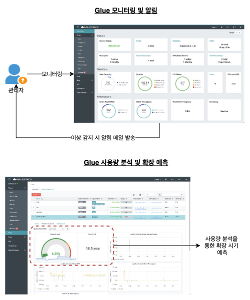

