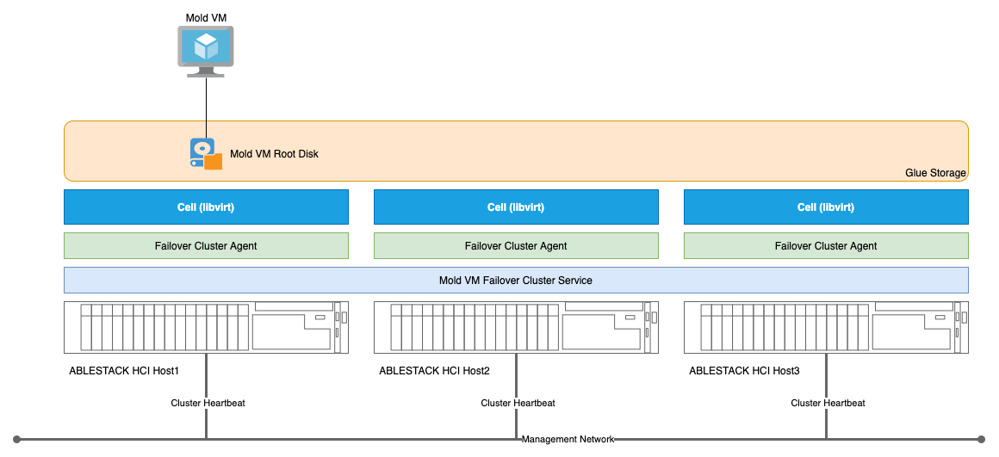
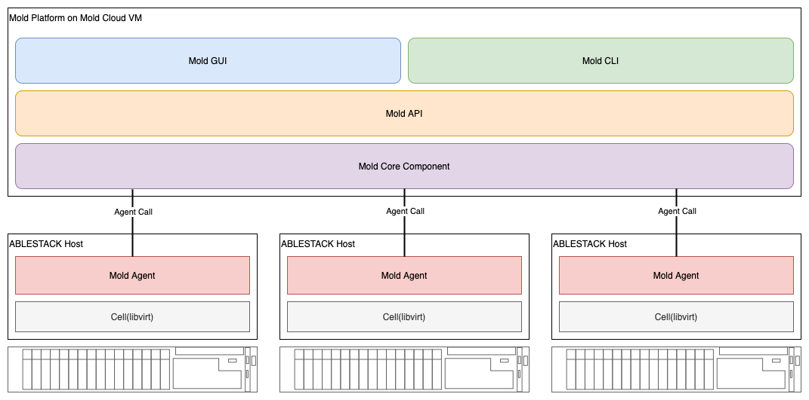
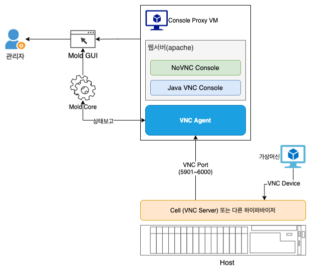
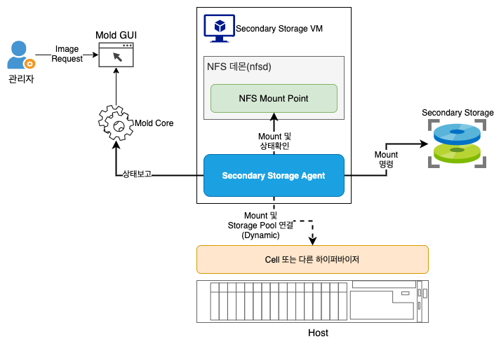
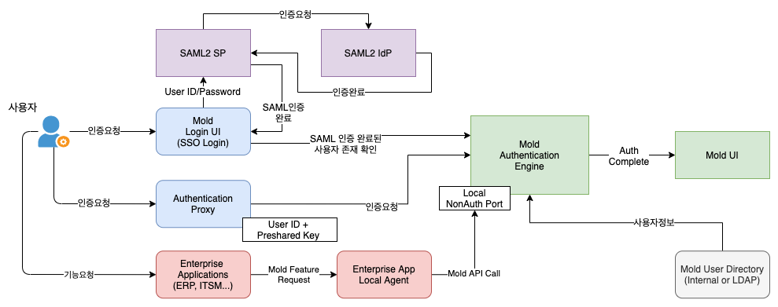
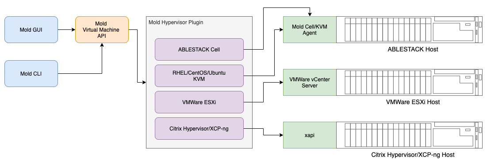
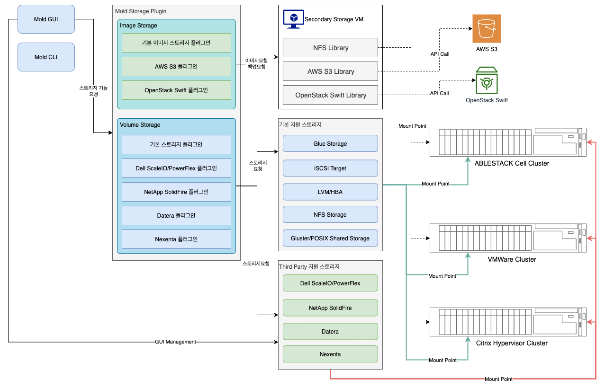

Mold는 '주형, 뼈대' 등의 의미를 가진 명사로, 틀에 부어 만드는 것을 가리키는 단어입니다. ABLESTACK은 이러한 단어의 의미를 이용해 Cloud 관리 플랫폼에 Mold 라는 이름을 붙였습니다. 말 그대로 사용자에게 자동화 또는 오케스트레이션 등을 통해 일정한 틀을 만들어 제공하고, 사용자는 그 틀 안에서 가상자원을 생성하고 사용하도록 하는 플랫폼입니다. 

Mold는 이러한 클라우드의 기본적인 사상과 ABLESTACK HCI의 특성을 조합하여, 사용자에게 최상의 클라우드 환경을 제공하기 위해 개발되었습니다. 

## Mold의 설계 목표

Mold는 실제 사용자의 입장에서 ABLESTACK HCI를 사용해 가상머신과 네트워크를 만들고, 서비스를 배포하기 위한 핵심 플랫폼입니다. 즉, 사용자가 가장 많이 사용하는 플랫폼입니다. 따라서 사용자가 편리하게 사용할 수 있는 사용자 환경을 제공해야 하는데, 이를 실현하기 위해 다음과 같은 목표로 지속적인 플랫폼 개발 및 업그레이드를 계획하고 실행합니다. 

- 간결하고 직관적인 웹 기반, 멀티 플랫폼, 완벽한 모바일 환경 대응 제품
- 완벽한 Private Cloud 환경 제공을 위해 다양한 가상화 플랫폼을 통합하여 관리
- 다양한 환경에 대한 자동화, 오케스트레이션 제공
- 가상머신 및 컨테이너 환경에 능동적으로 대응할 뿐 아니라, 지속적으로 다양한 가상화 환경 대응
- 높은 확장성과 유연성, 안정성 제공

본 문서에서는 이러한 설계 목표를 달성하기 위한 ABLESTACK Mold의 아키텍처 및 각종 기능, 사용법 등에 대한 간단한 소개를 제공합니다. 

## 아키텍처

Mold는 클라우드 플랫폼으로, ABLESTACK으로 구성된 HCI 클러스터 및 로컬 또는 외부에서 호스팅 되는 또 다른 ABLESTACK HCI 클러스터, VMWare/Citrix Hypervisor/Hyper-V 클러스터의 개체 및 서비스를 관리하고 모니터링 할 수 있습니다. 이러한 기능은 ABLESTACK HCI 클러스터 상에서 실행되는 Mold Cloud VM에 의해 서비스 됩니다. 

### Mold Cloud VM

Mold는 ABLESTACK HCI 내에서 실행되는 Mold Cloud VM에 의해서 서비스 됩니다. 해당 가상머신은 Mold 서비스가 모두 내장되어 있는 가상 어플라이언스 입니다., Mold Cloud VM은 ABLESTACK HCI 클러스터를 구성하는 호스트 상에 고가용성 클러스터를 구성하고, 해당 클러스터 내에 1개의 가상머신을 이용해 구성됩니다. 

최소 3대로 구성된 ABLESTACK HCI 호스트는 각각에 Failover Cluster를 구성할 수 있는 Agent가 설치되어 있습니다. 이를 통해 Mold VM에 대한 장애조치 클러스터 서비스를 운영합니다.

장애조치 클러스터는 Management Network를 통해 각각의 Failover Cluster Agent에게 Cluster Heartbeat 신호를 보내서 해당 호스트가 정상적으로 동작하고 있는지 계속 확인합니다. 

Failover Cluster Agent는 ABLESTACK Cell의 libvirt를 이용해 Mold VM을 시작합니다. 이 때 Failover Cluster Service 관리자에게 Mold VM 자원을 시작한다고 알리고, 어떤 호스트에 해당 가상머신을 실행할 수 있는지 확인하여 Failover Cluster Service 관리자의 통제에 따라 가상머신 시작이 가능한 호스트에서 Mold VM을 시작합니다. 

Mold VM은 Glue Storage에 루트 디스크 볼륨을 저장하여 관리합니다. 따라서 Mold VM은 어떤 호스트에서 가상머신이 실행 중이어도 동일한 데이터를 바라볼 수 있게 됩니다. 

호스트에 장애가 발생하게 되면 Failover Cluster Service는 해당 장애를 인식하게 되고, 해당 호스트에서 Mold VM이 실행 중이었다면 바로 다른 호스트에서 Mold VM을 시작하여 Mold 애플리케이션 서비스의 연속성을 보장합니다. 

### Mold Platform

Mold Cloud VM은 Mold 소프트웨어 플랫폼을 모두 포함하고 있기 때문에 사용자는 별도의 설치 절차 등의 복잡한 과정 없이 바로 Mold를 사용할 수 있습니다. 

Mold Platform은 크게 5가지의 구성요소로 이루어지며 각각의 구성요소의 상관관계를 그려보면 다음과 같습니다. 

각각의 구성요소를 설명하면 다음과 같습니다. 

- Mold Agent : 각각의 ABLESTACK HCI Host에 설치됩니다. 이 에이전트는 Cell 하이퍼바이저의 libvirt 라이브러리를 이용해 가상머신과 관련된 모든 명령을 실제적으로 Cell에 전달하는 역할과 호스트의 상태를 모니터링 하는 역할을 수행합니다. 
- Mold Core Component : 인프라(호스트, 스토리지 등) 관리, 가상머신 관리, 볼륨 관리, 네트워크 관리 등의 핵심 기능을 처리하는 모듈과 플러그인을 제공합니다. 
- Mold API : REST형식의 API를 제공하여 가상머신 등을 관리하는 인터페이스를 제공합니다. 
- Mold CLI : Mold API를 호출하여 명령행 환경에서 사용자가 직접 명령을 전달하고, 가상자원을 관리할 수 있도록 지원합니다. 
- Mold GUI : Mold API를 호출하여 웹 기반 환경에서 화면을 통해 사용자에게 기능을 사용할 수 있도록 관리 기능을 제공합니다. 

## Infra 구성

Mold는 완벽한 클라우드 환경을 구성하기 위해 다양한 개념의 인프라스트럭트 관리 체계를 제공합니다. 이러한 Full Scope Cloud 기능을 제공하기 위한 인프라 구성을 개념정으로 그려보면 다음과 같습니다. 

각각의 인프라 구성요소의 의미 및 역할은 다음과 같습니다. 

- Zone : 물리적인 데이터센터를 의미합니다. 수많은 Rack과 ABLESTACK HCI 서버, 네트워크 장비 등으로 구성되어 있는 공간을 생각할 수 있습니다. 네트워크 토폴로지 상에 여러 North-West Traffic과 East-West Traffic을 포함합니다. 
- Pod : 물리적으로 여러 개의 Rack으로 구성된 인프라 전체를 나타냅니다. 네트워크 토폴로지 상에 동일 East-West Traffic을 사용하는 서버와 네트워크 장비가 하나의 Pod입니다. 
- Cluster : 물리적으로 여러 개의 Host로 구성된 인프라를 나타냅니다. 일반적으로 동일 ToR 스위치 상에 연결되어 있는 호스트의 집합으로 구성됩니다. 
- Host : ABLESTACK Cube가 설치된 단일 서버를 나타내거나, VMWare ESXi, Citrix Hypervisor 등이 설치된 호스트 일 수 있습니다. 클러스터 내의 Host는 반드시 동일한 클러스터 스위치(ToR 스위치)에 연결되 있어야 합니다.
- Primary Storage : Mold가 가상머신을 만들 때 가상머신의 디스크로 사용하기 위해 연결하는 주스토리지입니다. ABLESTACK HCI는 기본적으로 Glue 스토리지를 사용하며, 이 때 Glue의 Block Storage GW를 사용합니다. 
- Secondary Storage : 가상머신을 생성하기 위한 ISO 및 템플릿 이미지 파일을 관리하거나, 스냅샷 백업을 저장하는 백업스토리지입니다. ABLESTACK HCI는 이미지만을 관리하는 목적으로 Glue 스토리지를 사용하며, 이 때 Glue의 Filesystem GW를 사용합니다. 만약 스냅샷 백업을 저장하는 백업 용도인 경우 반드시 NFS를 지원하는 별도의 외장 백업 스토리지를 사용해야 합니다. 
- Console Proxy VM : 가상머신의 콘솔을 표시하기 위한 시스템 가상머신입니다.
- Secondary Storage VM : 백업스토리지를 호스트에 연결하거나 백업을 처리하기 위한 에이전트를 포함하는 이미지/백업 서비스 가상머신입니다. 

## System VM

Mold는 Multi Hypervisor를 지원하는 클라우드 플랫폼으로 ABLESTACK HCI 클러스터를 다양한 하이퍼바이저로 구성하거나 별도로 구성된 하이퍼바이저 클러스터를 통합관리할 수 있습니다. 

이러한 멀티 하이퍼바이저 환경 속에서 Mold는 다양한 하이퍼바이저에서 실행되는 가상머신의 콘솔을 확인하거나 가상머신의 스냅샷을 백업하고, ISO 이미지를 제공하는 등의 기능 지원할 수 있어야 합니다. 이런 기능을 통합해서 지원하도록 설계된 가상머신을 System VM이라고 부릅니다. System VM은 위에서 소개한 Mold Infra를 구성하면 자동으로 배포되며 역할에 따라 Console Proxy VM과 Secondary Storage VM으로 나눌 수 있습니다. 

### Console Proxy VM

Console Proxy VM은 이름 그대로, 가상머신의 콘솔을 사용자에게 표시하는 역할을 하는 시스템 가상머신입니다. 

윈도우즈 또는 리눅스 가상머신은 처음 시작한 후 가상머신에 앱을 설치하거나, 여러가지 설정을 적용하기 위해 가상머신에 접속해야 합니다. 각각의 하이퍼바이저는 VNC 등의 콘솔 포트를 이용해 자체적으로 가상머신의 콘솔을 볼 수 있는 기능을 지원합니다. 

멀티 하이퍼바이저를 지원하는 ABLESTACK Mold는 이러한 다양한 하이퍼바이저의 콘솔 기능을 통합하여 제공하기 위해 통합해서 모든 하이퍼바이저의 콘솔을 보여줄 수 있는 콘솔 프록시가 필요합니다. 이러한 기능을 지원하기 위해 Console Proxy Server를 VM 형태로 제공합니다. 

Console Proxy VM의 구조를 그림으로 표현하면 다음과 같습니다. 

Console Proxy VM은 내부에 크게 2개의 구성요소를 포함하고 있습니다. 살펴보면 다음과 같습니다. 

- 웹 서버 : 별도의 웹 서버를 포함하고 있으며, Mold GUI에서 콘솔을 표시할 때 해당 웹서버의 화면을 호출합니다.
    - NoVNC Console : 가상머신의 콘솔을 표시하기 위해 NoVNC를 이용해 표시하기 위한 구성요소입니다. HTML5 기술을 이용해 콘솔을 표시합니다.
    - Java VNC Console : 가상머신의 콘솔을 표시하기 위해 Java Applet으로 만들어진 구성요소입니다.
- VNC Agent : Cell 또는 다른 하이퍼바이저의 VNC 서버에 접속하여 원하는 가상머신의 VNC 데이터를 가져오기 위한 에이전트입니다. 

Console Proxy VM의 에이전트는 Cell 또는 하이퍼바이저의 VNC 서버에 연결하여 정상인지 확인한 후, Mold Core 엔진에 Agent 상태를 보고하여 Mold가 가상머신의 콘솔을 표시할 수 있는 상태인지를 항상 확인할 수 있도록 합니다. 

사용자는 이러한 매커니즘을 통해 하이퍼바이저의 종류와 상관없이, 투명하게 가상머신의 콘솔을 Mold를 통해 일관성 있게 확인할 수 있게 됩니다. 

### Secondary Storage VM

Secondary Storage VM은 이미지를 저장하거나 스냅샷을 백업하기 위한 에이전트를 포함하는 시스템 가상머신 입니다. 

멀티 하이퍼바이저를 지원하는 ABLESTACK Mold는 하이퍼바이저별로 서로 다른 스냅샷 생성 방식 및 백업 방식을 조정하여 통합하고 투명하게 백업 등을 처리할 수 있도록 하기 위해서는 이러한 중간 프록시가 필요합니다. 이러한 기능을 지원하기 위해 Image/Snapshot Backup Agent를 가상머신 형태로 제공합니다. 

Secondary Storage VM의 구조를 그림으로 표현하면 다음과 같습니다. 

Secondary Storage VM은 2개의 구성요소를 포함하고 있습니다. 살펴보면 다음과 같습니다. 

- NFS 데몬 : Secondary Storage를 NFS 방식으로 마운트하고, 스토리지의 상태 및 용량 등을 확인하여 이미지 스토리지가 정상적인지 확인하게 됩니다.
- Secondary Storage Agent : 스토리지의 마운트 상태를 확인하여 Mold Core에 상태를 보고하고, Image 요청에 따라 동적으로 ABLESTACK HCI 서버에 Secondary Storage를 연결하는 작업을 수행합니다.

사용자가 ISO 연결을 요청하면 Secondary Storage를 호스트에 연결하고, 연결이 이루어지면 요청한 이미지를 가상머신에 연결해 주는 일련의 작업을 수행하여 사용자가 GUI 상에서 간단한 버튼 액션만으로도 모든 작업이 이루어질 수 있도록 기능을 제공합니다.

!!! info "Secondary Storage 구성"
    Secondary Storage VM은 스토리지 연결을 위해 NFS 프로토콜을 사용합니다. 따라서 Secondary Storage는 반드시 NFS 프로토콜을 지원해야 합니다. 

## 사용자 관리 및 인증

Mold는 사용자 인증의 안정성 및 조직 내에서의 효율적인 인증체계 지원을 위해 다양한 방식의 인증체계를 지원합니다. 

Mold가 지원하는 인증 방법은 다음과 같습니다. 

- Mold가 자체적으로 지원하는 Cookie 기반 인증 (SSL 사용 시 Secured Cookie 지원)
- Signature/HMAC 기반의 인증 (API Key/Secret Key)
- 사전에 정의되어 정의된 단일 Pre-shared Key 기반 인증
- 기업의 기능 통합 등을 지원하기 위한 비인증 통합 포트 사용 (기본 : Disable)

본 문서에서는 이러한 인증 방법을 사용하기 위한 아키텍처를 설명합니다. 

### 조직 및 사용자 관리

Mold는 사용자의 조직 내에서 다양한 사용자가 접속하여 자신만의 가상 인프라 환경을 구성할 수 있는 Multi Tenant 환경을 제공합니다. 

다음의 그림은 Mold가 어떤 체계로 사용자의 정보를 관리하는지를 표현합니다. 

Mold는 자체적으로 User Directory를 관리합니다. Mold의 User Directory는 다음과 같이 구성됩니다. 

- Domain : 사용자 정보의 최상위 디렉토리입니다. 도메인의 이름과 해당 도메인이 가지는 네트워크 도메인 정보를 포함합니다. 
- Account : 도메인은 여러 사용자 계정을 포함합니다. 사용자 계정은 사용자의 역할과, 사용자명, 비밀번호, 이메일 주소, 사용자 성명, 사용자가 속한 도메인, 타임존, 계정이 사용할 네트워크 도메인, 그리고 SAML SSO를 사용하는 사용자인지의 여부 등의 정보를 포함합니다. 
- Users : 사용자는 Account의 Alias(별칭)입니다. 계정은 여러 개의 사용자 Alias를 만들 수 있고, 목적에 따라 다양하게 사용할 수 있습니다. 사용자명, 비밀번호, Email, 사용자 성명, 타임존, SSO 사용 여부 등의 정보를 포함합니다. 
- Role : 각각의 계정은 역할을 지정해야 합니다. 이 역할은 Mold의 수많은 API에 대한 권한 여부의 집합입니다. 즉, 가상머신에 대한 권한, 사용자 정보에 대한 권한 등의 집합체입니다. 

!!! info "외부 디렉토리 서비스 연결"
    Mold는 자체적으로 User Directory를 관리하지만, 조직에 따라 해당 조직이 기존에 사용하는 디렉토리 서비스를 사용하고 연동해야 할 수 있습니다. Mold는 LDAP 표준을 지원하는 외부 Directory Service와 연동하여 해당 서비스에서 사용자 정보를 가져와 동기화 할 수 있습니다. 

!!! info "사전 정의된 Role"
    Mold는 초기 사용자의 사용 편의성을 제공하기 위해 사전에 정의된 Role을 제공합니다. 사전 정의 Role은 다음과 같습니다. 

    - Root Admin : 초기 인프라 구성부터 모든 관리 작업을 수행할 수 있습니다.
    - Resource Admin : 인프라 구성이 되어 있는 상태에서 모든 리소스를 관리할 수 있습니다.
    - Domain Admin : 특정 도메인 내에 포함된 리소스를 관리할 수 있습니다. 
    - User : 특정 계정 내에 포함된 리소스를 관리할 수 있습니다. 
    - Read-Only Admin : 물리적인 인프라 및 자원을 모두 조회할 수 있습니다.
    - Read-Only User : 특정 계정 내의 리소스에 대해 조회할 수 있습니다.
    - Support Admin : 자원을 생성할 수 없고, 서비스를 제공하기 위한 정책 등을 관리할 수 있습니다. 
    - Support User : 이미 생성된 자원에 대한 관리(시작, 정지) 만 가능하며, 자원을 생성하거나 삭제할 수는 없습니다. 

### 통합 인증 아키텍처

Mold는 자체적인 사용자 디렉토리 서비스를 이용해 Mold GUI에서 사용자의 아이디 및 패스워드를 이용해 로그인 하는 방법 외에 다양한 통합 인증 아키텍처를 지원합니다. 

지원하는 통합 인증 아키텍처는 다음과 같습니다. 

- SAML2 SSO Authentication : SAML2 표준을 지원하는 SP/IdP를 이용해 통합 인증을 제공합니다.
- Pre-shared Key Based Proxy Authentication : 사용자 인증을 위한 Proxy Server를 만들고, 사전에 정의된 키를 이용해 특정 사용자에 대한 인증을 제공합니다.
- Localhost Admin Port Based Non-Auth Integration : 기업의 기존 시스템과의 통합을 위해 Localhost 내에서만 비인증으로 모든 API를 호출할 수 있습니다. 

다음의 그림은 Mold가 제공하는 통합 인증 체계를 개념적으로 표현합니다. 

SSO 지원은 SAML2 표준을 기반으로 지원합니다. 해당 기능은 Mold UI에서 SSO 로그인 탭을 이용해 서비스 제공자를 선택하여 해당 서비스 제공자의 인증 페이지를 통해 인증을 수행합니다. SAML2를 지원하는 Google, Microsoft 등의 환경을 이용할 수 있으며, 최종적으로 Mold의 사용자 정보와 일치하면 로그인이 이루어집니다. 

SAML2 표준을 이용하는 방법 외에, Mold는 별도의 Proxy Server를 구성하여 인증하는 방법을 지원합니다. Proxy Server는 사용자가 직접 구축해야 하며, 로그인 시 별도의 로그인 절차를 사용하지 않고, 사전에 공유된 키를 Mold 인증 엔진에 전송하여 인증을 처리하게 됩니다. 

사용자의 조직 내에 이미 여러 애플리케이션이 존재하고, 이러한 애플리케이션에 Mold의 기능을 포함하고자 하는 경우, 해당 기능을 호출하는 에이전트를 Mold Server에 배포하고, 이 에이전트가 Mold의 로컬 비인증 포트를 이용해 직접 API를 호출하는 방식을 사용할 수 있습니다. 

!!! warning "비인증 포트의 사용"
    조직 내 애플리케이션과의 통합 등의 목적을 위해 비인증 로컬 포트를 사용하는 경우 보안에 유의해야 합니다. 기본적으로 Mold는 해당 기능을 비활성화 하고 있으며, 이 기능을 활성화 하고자 하는 경우 '글로벌 설정'의 integration.api.port 속성(기본값 0)에서 연결할 port를 설정해야 합니다. 

## 가상머신 관리

Mold는 관리자가 하이퍼바이저 및 HCI 구성 여부와 관계 없이, Mold가 관리하는 모든 클라우드 인프라 상에서 실행되는 모든 가상머신의 생명주기를 완벽하게 제어할 수 있는 기능을 제공합니다. Mold의 가상머신 관리 기능의 특징은 다음과 같습니다. 

- 가상머신의 생명주기를 웹 기반 UI 및 API를 통해 완벽하게 관리
- Multi Hypervisor 지원 : Cell, KVM (CentOS, Ubuntu, RHEL), VMWare ESXi, Citrix Hypervisor, XCP-ng 등

Mold의 가장 강력한 기능을 바로 ABLESTACK HCI로 구성된 클러스터 외에도, 일반 가상화 구성까지 폭넓게 가상화를 지원한다는 것입니다. 이러한 기능을 통해 ABLESTACK HCI를 도입하게 되면 현재 운영 중인 모든 가상화 환경을 클라우드로 전환하고, 통합할 수 있게 됩니다. 

다음의 그림은 Mold가 어떻게 다양한 하이퍼바이저 환경에서 동일한 가상머신 생명주기 관리를 제공할 수 있는지를 나타냅니다. 

Mold는 GUI 및 CLI와 같은 사용자 인터페이스에서 모두 Mold API를 호출합니다. 그리고 이 API는 Mold의 하이퍼바이저 플러그인을 사용해 가상머신과 관련된 관리를 실행합니다. 

Mold의 하이퍼바이저 플러그인은 Cell/KVM, Linux KVM, VMWare, Citrix 등의 다양한 하이퍼바이저를 지원할 수 있도록 각각의 하이퍼바이저에 대한 플러그인이 포함되어 있습니다. 

Cell 및 KVM 하이퍼바이저의 경우에는 플러그인과 상호작용을 위해 각각의 호스트에 Mold Agent가 설치되고 해당 Agent가 libvirt 명령을 호출하여 사용자가 원하는 작업을 실행하도록 설계되어 있습니다. 

VMWare ESXi 하이퍼바이저의 경우는 ESXi 호스트 클러스터를 관리하는 vCenter의 Web Service API를 이용해 가상머신 작업을 실행합니다. 

Citrix Hypervisor의 경우는 XenServer 클러스터의 마스터 호스트의 xapi를 이용해 가상머신 작업을 실행합니다. 사용자는 이러한 플러그인과 각 하이퍼바이저의 API 호출의 내부 동작에 의해 복잡한 과정을 신경쓰지 않고 투명하게 가상머신 관리 기능을 사용할 수 있게 됩니다. 

!!! info "하이퍼바이저 측 방화벽"
    Mold가 각각의 하이퍼바이저 호스트와 연결되어 가상머신 작업을 수행하기 위해서는 반드시 관련된 서비스 포트가 방화벽에 의해 열려 있어야 합니다. 
    호스트가 Mold에 연결되지 않는 경우 해당 호스트의 방화벽 상태를 확인해야 합니다.

## 스토리지 관리

Mold는 ABLESTACK Glue 스토리지 외에도 다양한 외장 스토리지의 연결을 지원하고, Mold가 컨트롤하는 하이퍼바이저 클러스터에 따라 하이퍼바이저가 지원하는 모든 스토리지 형식을 지원합니다. Mold의 스토리지 관리 기능의 특징은 다음과 같습니다. 

- ABLESTACK Glue 외의 다양한 외장 스토리지를 지원하여 높은 유연성을 제공합니다.
- iSCSI, Clustered LVM, Posix Compliant Storage, NFS 등 거의 대부분의 외장 스토리지 연결이 가능합니다. 
- Thin Provisioning 및 Overprovisioning을 지원하여 스토리지 용량을 효율적으로 사용할 수 있습니다. 

Mold를 통해 ABLESTACK HCI 또는 다른 하이퍼바이저 클러스터의 스토리지를 연결하고 관리하면 높은 유연성과 용량 효율성을 보장 받을 수 있습니다. 

다음의 그림은 Mold가 어떻게 다양한 스토리지를 연결하고 볼륨 서비스를 제공하는지를 나타냅니다. 

Mold GUI 또는 CLI를 이용해 ABLESTACK Cell, VMWare, Citrix Hypervisor 등의 호스트에 스토리지를 연결하고, 가상머신을 위한 볼륨을 만들거나, 가상머신의 데이터를 백업하는 등의 스토리지 요청을 플러그인에 요청하게 됩니다. 

스토리지 플러그인은 크게 다음과 같이 구성됩니다. 

- 이미지 스토리지 플러그인 : ISO, Template 등의 이미지와 가상머신 디스크의 스냅샷 백업 등을 저장하고 관리하기 위한 플러그인
- 볼륨 스토리지 플러그인 : 가상머신용 디스크를 제공하기 위한 스토리지 플러그인

이미지 스토리지 플러그인은 이미지 및 백업 파일을 저장하기 위해 기본적으로 NFS 스토리지를 스테이징 스토리지로 사용합니다. 그리고 부수적으로 NFS 스토리지의 장애에 대비하고, 원격지에 이미지를 최종적으로 저장하기 위해 AWS S3에 데이터를 복제하거나 OpenStack Swift에 데이터를 복제하여 관리할 수 있습니다. 

!!! warning "NFS Staging Storage"
    Mold는 이미지 및 백업 파일을 저장하고 관리하기 위해 반드시 1개 이상의 NFS 스토리지를 필요로 합니다. 불의의 사고에도 신속하게 시스템을 복구하기 위해 백업 파일은 HCI 클러스터와는 별도로 구성하는 것이 좋습니다. 

    여러 개의 NFS Storage를 백업 스토리지로 사용하는 경우에도 실제 스테이징 스토리지는 1개로 구성되며, 나머지는 복제본을 저장하기 위한 역할을 하게 됩니다. 

    AWS S3, OpenStack Swift 등은 Staging Storage의 역할을 수행할 수 없으며, NFS 스토리지가 모두 불능 상태인 경우 원격지에 백업 이미지를 복제하고, 복구하기 위한 수단으로 사용합니다. 

볼륨 스토리지 플러그인은 가상머신에 블록 디스크를 제공하기 위한 플러그인입니다. 기본적으로 Mold는 Glue 스토리지 외에 NFS, iSCSI, LVM, GlusterFS 등의 다양한 표준 스토리지를 지원합니다. 또한 써드파티 플러그인으로 Dell의 PowerFlex, NetApp의 SolidFire 등의 다양한 소프트웨어 정의 스토리지를 지원할 뿐 아니라, Mold 내에서 GUI를 통해 해당 스토리지를 관리할 수 있는 기능도 제공합니다. 

이미지 스토리지 및 볼륨 스토리지는 모두 호스트에 마운트 될 수 있어야 합니다. 예를 들어 NFS를 이미지 또는 볼륨 스토리지로 사용하는 경우 해당 스토리지가 각각의 호스트에 마운트 되어 경로로 표시될 수 있어야 하며, NFS에 대한 각종 명령이 실행될 수 있어야 합니다. 

!!! info "볼륨 스토리지 마운트 포인트의 중요성"
    HCI 기반, 또는 일반 가상화 기반 환경에서 볼륨 스토리지는 매우 중요합니다. 이미 등록된 볼륨 스토리지는 항상 가상화 호스트에 마운트 되어 있어야 하며, 만약 마운트가 비정상적인 경우 호스트가 비정상으로 표시됩니다. 

    또한 마운트 포인트에 Hang이 발생하는 경우 해당 호스트에서 실행 중인 모든 가상머신의 IO가 중단되고, 설정에 따라 호스트가 자동으로 재시작될 수 있습니다. 호스트에서 비정상적인 상태가 모니터링 되는 경우 반드시 스토리지의 상태를 확인해야 합니다. 

## 네트워크 관리

Mold는 다양한 형식의 가상 네트워크를 지원할 뿐 아니라, 다양한 하드웨어와의 연동을 통해 물리적인 네트워크 영역(Underlay Network) 및 가상 네트워크 영역(Overlay Network)을 GUI에서 모두 관리할 수 있도록 기능을 지원합니다. 

Mold는 Zone 단위로 물리적인 네트워크 구성을 지원하며 물리적인 네트워크 형식은 다음과 같습니다. 

- Basic Network : 사용자의 네트워크가 물리적으로 단일 네트워크로 구성되어 있는 경우 사용
- Advanced Network : 사용자의 네트워크가 물리적으로 다수의 네트워크로 구성되어 있는 경우 사용

## 백업 관리

## 고가용성 제공

## Kubernetes 관리

## 호스트 롤링 업데이트

## 용량 계획

## API 및 인터페이스
