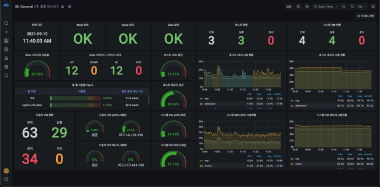
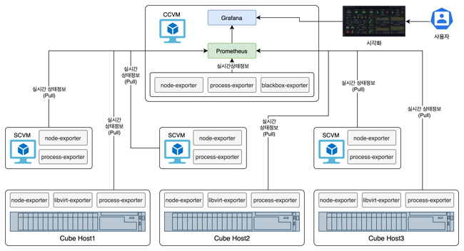

Wall은 '벽', '성벽' 등의 뜻을 가진 단어로 건물 또는 도시의 내부에 있는 사람, 건물 등을 감시하고, 보호하는 목적으로 만들어집니다. ABLESTACK의 Wall은 HCI 인프라와 가상머신, 그리고 각종 애플리케이션을 모니터링하고, 필요시 알람을 제공하는 등의 감시 및 보호를 위한 모니터링 플랫폼입니다.

Wall은 ABLESTACK 설치 시 마법사에 의해 설치되는 모니터링 플랫폼으로, ABLESTACK을 구성하는 호스트 및 호스트에서 실행되는 서비스, 그리고 가상머신에 대한 실시간 모니터링 및 알람을 제공합니다.

## Wall의 설계 목표

Wall은 오픈소스 대시보드 프로젝트인 Grafana를 커스터마이징 하여 제공됩니다.

Wall은 시계열 데이터베이스인 Prometheus를 기반으로 데이터를 쿼리하고, 시각화 하고, 경고하는 모니터링 플랫폼입니다. Wall은 유연한 대시보드를 통해 모든 데이터를 생성, 탐색 및 공유할 수 있습니다.

### 플랫폼 제공 목적

Wall은 ABLESTACK을 기반으로 클라우드 서비스를 제공하는 관리자 및 해당 서비스를 사용해 가상자원을 배포하는 사용자에 대해 다음과 같은 목적을 위해 제공됩니다.

* **관리자**
    * 전반적인 ABLESTACK 인프라에 대한 대시보드 제공
    * ABLESTACK을 구성하는 Cube Host에 대한 실시간 모니터링 및 알람
    * ABLESTACK을 구성하는 각종 컨트롤 가상머신에 대한 실시간 모니터링 및 알람
    * ABLESTACK 상에서 실행 중인 가상머신의 실행 상태에 대한 모니터링 및 알람
    * 관리자 레벨에서 실행 중인 각종 애플리케이션에 대한 모니터링

* **사용자**
    * 사용자가 생성한 가상머신에 대한 실시간 모니터링
    * 사용자 레벨에서 실행 중인 각종 애플리케이션에 대한 모니터링

Wall은 위와 같은 관리자 및 사용자에 대한 모니터링 제공을 위해 ABLESTACK을 설치하면서 기본적으로 구성되는 플랫폼과 서비스 형식으로 실행되는 사용자의 요청에 의해서 실행되는 플랫폼으로 나누어 제공됩니다.

### 주요 특징 및 기능

Wall은 효과적인 모니터링 및 알람 제공을 위해 다음과 같은 주요 특징을 보유하고 있습니다.

* 패널 단위의 데이터 통합 : 다양한 모니터링 요소를 데이터소스로부터 가여와 시각화하고, 원하는대로 커스터마이징 할 수 있습니다.
* 조직별 모니터링 관리 : 조직별로 모니터링 영역을 관리할 수 있으며, 누구나 볼 수 있도록 권한을 조정할 수 있습니다.
* 유연성 및 다용성 : 다양한 데이터소스로 시각화를 할 수 있고, 다양한 대시보드를 사용자가 직접 만들 수 있습니다.
* 다양한 플러그인 : 다양한 애플리케이션에 대한 모니터링을 위한 플러그인을 제공합니다.

Wall은 배포와 동시에 다음과 같은 모니터링 기능을 지원합니다.

* 대시보드 : ABLESTACK을 구성하는 모든 구성요소에 대한 통합 현황을 보여줍니다.
* 호스트 종합 현황 : ABLESTACK을 구성하는 호스트에 대한 정보를 요약하여 보여줍니다.
* 호스트별 상세 현황 : 각각의 호스트에 대한 상세 현황을 보여줍니다.
* 스토리지센터 가상머신 상세 현황 : 스토리지 컨트롤러 가상머신의 상세 현황을 보여줍니다.
* 클라우드센터 가상머신 상세 현황 : 클라우드센터 가상머신의 상세 현황을 보여줍니다.
* 사용자 가상머신 종합 현황 : 사용자 가상머신의 현황을 요약하여 보여줍니다.
* 사용자 가상머신별 상세 현황 : 각각의 사용자 가상머신의 현황을 상세하게 보여줍니다.

## 아키텍처

Wall은 ABLESTACK을 구성하는 호스트와 가상머신, 스토리지 등에 대한 전반적인 실시간 모니터링 및 알람을 제공하기 위해 각각의 구성요소와의 상호작용을 하게 됩니다. 각 호스트 및 가상머신 등에는 필요한 에이전트가 설치되어 있고 해당 에이전트를 통해 자원의 상태를 모니터링합니다. 

Wall의 아키텍처는 다음과 같습니다. 

### 소프트웨어 구성

Wall은 각각의 호스트 및 가상머신의 실시간 상태 값을 가져오는 에이전트, 해당 데이터를 Pull 방식으로 가져오는 시계열 데이터베이스, 그리고 이 데이터를 시각화 하는 시각화 소프트웨어로 구성되며, 모두 Wall을 위해 커스터마이징된 오픈소스 프로젝트를 기반으로 하며 사용된 오픈소스 프로젝트는 다음과 같습니다. 

* 모니터링 에이전트
    * node-exporter : 호스트 실시간 정보 수집
    * libvirt-exporter : 가상화 및 가상머신 실시간 정보 수집
    * process-exporter : 호스트 및 가상머신 내의 프로세스 실시간 정보 수집
    * blackbox-exporter : 각종 서비스의 실시간 정보 수집
* 시계열 데이터베이스
    * Prometheus : 시계열 데이터 관리
* 시각화
    * Grafana : 시계열 데이터에 대한 시각화 도구

각각의 구성요소는 ABLESTACK을 구성하는 각 호스트 및 가상머신 등에 필요에 따라 자동으로 배포되어 모니터링 됩니다. 다음의 그림은 Wall의 소프트웨어의 구성을 묘사합니다. 

node-exporter는 호스트 또는 SCVM, CCVM의 CPU, Memory 등의 자원의 상태를 수집하기 위해 사용됩니다. libvirt-exporter는 호스트에서 실행 중인 가상머신의 상태를 수집하기 위해 사용됩니다. process-exporter는 호스트 및 SCVM, CCVM에서 실행 중인 필수적인 프로세스의 실행 상태를 확인하기 위해 사용됩니다. blackbox-exporter는 CCVM에서 다른 호스트 및 SCVM에서 실행 중인 에이전트 및 서버 등이 정상적으로 실행되고, 접근할 수 있는지를 확인하기 위해 사용됩니다. 

Prometheus는 실시간 시계열 데이터를 축적하고, 이를 관리하기 위한 실시간 데이터베이스로써 각각의 exporter에 Pull 방식으로 필요한 데이터를 수집하고 저장합니다. 

Grafana는 Prometheus에서 데이터를 가져와 이를 다양한 그래프 형식으로 시각화 하는 역할을 합니다. 

### 네트워크 구성

Wall의 각 구성요소는 관리 네트워크를 통해 필요한 데이터를 전송하고, 사용자에게 시각화된 정보를 제공합니다. 

따라서 원활한 데이터 수집 및 시각화를 위해서는 호스트 및 SCVM, CCVM에 대한 구성요소에 대한 네트워크 포트의 방화벽 설정을 적용해야 합니다. 해당 방화벽 설정은 Wall을 초기 구성할 때 자동 구성됩니다. 아래의 표는 각각의 Wall을 구성하는 각각의 구성요소가 사용하는 네트워크 포트를 나타냅니다. 

| 자원구분       | 구성요소             | 사용 포트                |
| -----------  | -------------      | -----------------       |
| Cube 호스트    | node-exporter      |                        |
|              | libvirt-exporter   |                         |
|              | process-exporter   |                         |
| SCVM         | node-exporter      |                         |
|              | process-exporter   |                         |
| CCVM         | node-exporter      |                         |
|              | process-exporter   |                         |
|              | blackbox-exporter  |                         |
|              | Prometheus         |                         |
|              | Grafana            |                         |

!!! warning "임의의 포트 변경 금지"
    시스템 모니터링의 안정성 및 보안성을 위해 Wall은 사전에 정의된 포트를 이용해 상호 데이터를 수집하고 관리하게 됩니다. 임의로 포트를 변경하는 경우 정상적인 모니터링이 불가능할 수 있습니다.

### 사용자 서비스 구성

## 동작 방식

### 관리자 모니터링

### 임계치 알람

Wall은 다음의 자원에 대한 이메일 알람을 기본적으로 제공합니다. 알람 기능을 사용하기 위해서는 Wall을 배포하고 구성할 때 SMTP 서버 및 보내는 사람 메일 주소 등의 정보를 등록해야 합니다. 

Wall을 설정되어 있는 임계치를 검사하여 일정 시간 이상 임계치 초과 상태를 유지하는 자원에 대한 알람을 이메일로 제공합니다. 기본값으로 설정되어 있는 알람 임계치는 다음과 같습니다.

| 자원구분       | 항목             | 알람 임계치                |
| -----------  | -------------   | -----------------        |
| 호스트        | CPU 사용률        | 5분 동안 평균 75% 초과      |
|              | Memory 사용률     | 5분 동안 평균 75% 초과      |
|              | 네트워크 트래픽    | 5분 동안 100Mbps 초과      |
|              | 디스크 쓰기 지연   | 5분 동안 지연시간 100ms 초과 |
|              | 디스크 읽기 지연   | 5분 동안 지연시간 100ms 초과 |
|              | ROOT 디스크 사용률 | 5분 동안 전체 용량의 75% 초과 사용 |
|              | CPU 온도         | 5분 동안 섭씨 70도 초과 |
|              | Cube 상태        | 5분 동안 1회 이상 Cube UI 데몬이 중지된 경우 |
|              | Mold 에이전트 상태 | 5분 동안 1회 이상 Mold Agent 데몬이 중지된 경우 |
|              | 가상화 데몬 상태   | 5분 동안 1회 이상 libvirt 데몬이 중지된 경우|
|              | 가상화 모니터링 에이전트 상태 | 5분 동안 1회 이상 모니터링 에이전트 데몬이 중지된 경우 |
|              | 호스트 모니터링 에이전트 상태 | 5분 동안 1회 이상 모니터링 에이전트 데몬이 중지된 경우 |
|              | 프로세스 모니터링 에이전트 상태 | 5분 동안 1회 이상 모니터링 에이전트 데몬이 중지된 경우 |
|              | 호스트 실행 상태             | 5분 동안 호스트 연결이 중지된 경우 |
|              | 가상머신 모니터링 에이전트 상태 | 5분 동안 1회 이상 모니터링 에이전트 데몬이 중지된 경우 |
| 스토리지센터 VM | CPU 사용률        | 5분 동안 평균 75% 초과      |
|              | Memory 사용률     | 5분 동안 평균 75% 초과      |
|              | 네트워크 트래픽    | 5분 동안 1Gbps 초과      |
|              | 디스크 쓰기 지연   | 5분 동안 지연시간 100ms 초과 |
|              | 디스크 읽기 지연   | 5분 동안 지연시간 100ms 초과 |
|              | ROOT 디스크 사용률 | 5분 동안 전체 용량의 75% 초과 사용 |
|              | Glue 스토리지 사용률 | 5분 동안 전체 용량의 75% 초과 사용 |
|              | Glue 상태          | 5분 동안 1회 이상 Glue Health 상태가 OK가 아닌 경우 |
|              | Glue Monitor 데몬  | 5분 동안 1회 이상 Glue Monitor 데몬이 중지된 경우 |
|              | Glue Manager 데몬  | 5분 동안 1회 이상 Glue Manager 데몬이 중지된 경우 |
|              | Glue Metadata 데몬 | 5분 동안 1회 이상 Glue Metadata 데몬이 중지된 경우 |
|              | Glue Object GW 데몬| 5분 동안 1회 이상 Glue Object GW 데몬이 중지된 경우 |
|              | Glue NFS GW 데몬   | 5분 동안 1회 이상 Glue NFS GW 데몬이 중지된 경우 |
|              | Glue iSCSI GW 데몬 | 5분 동안 1회 이상 Glue iSCSI GW 데몬이 중지된 경우 |
|              | 가상머신 모니터링 에이전트 상태 | 5분 동안 1회 이상 모니터링 에이전트 데몬이 중지된 경우 |
|              | 프로세스 모니터링 에이전트 상태 | 5분 동안 1회 이상 모니터링 에이전트 데몬이 중지된 경우 |
|              | 가상머신 운영 상태  | 5분 동안 가상머신 연결이 중지된 경우 |
| 클라우드센터 VM | CPU 사용률        | 5분 동안 평균 75% 초과      |
|              | Memory 사용률     | 5분 동안 평균 75% 초과      |
|              | 네트워크 트래픽    | 5분 동안 1Gbps 초과      |
|              | 디스크 쓰기 지연   | 5분 동안 지연시간 100ms 초과 |
|              | 디스크 읽기 지연   | 5분 동안 지연시간 100ms 초과 |
|              | ROOT 디스크 사용률 | 5분 동안 전체 용량의 75% 초과 사용 |
|              | Mold 상태         | 5분 동안 1회 이상 Glue UI 데몬이 중지된 경우 |
|              | 가상머신 모니터링 에이전트 상태 | 5분 동안 1회 이상 모니터링 에이전트 데몬이 중지된 경우 |
|              | 프로세스 모니터링 에이전트 상태 | 5분 동안 1회 이상 모니터링 에이전트 데몬이 중지된 경우 |
|              | 가상머신 운영 상태  | 5분 동안 가상머신 연결이 중지된 경우 |
| 사용자 가상머신 | CPU 사용률        | 5분 동안 평균 75% 초과      |
|              | Memory 사용률     | 5분 동안 평균 75% 초과      |
|              | 네트워크 트래픽    | 5분 동안 100Mbps 초과      |
|              | 디스크 읽기/쓰기 지연   | 5분 동안 지연시간 100ms 초과 |
|              | 디스크 사용률 | 5분 동안 전체 용량의 75% 초과 사용 |

### 사용자 애플리케이션 모니터링