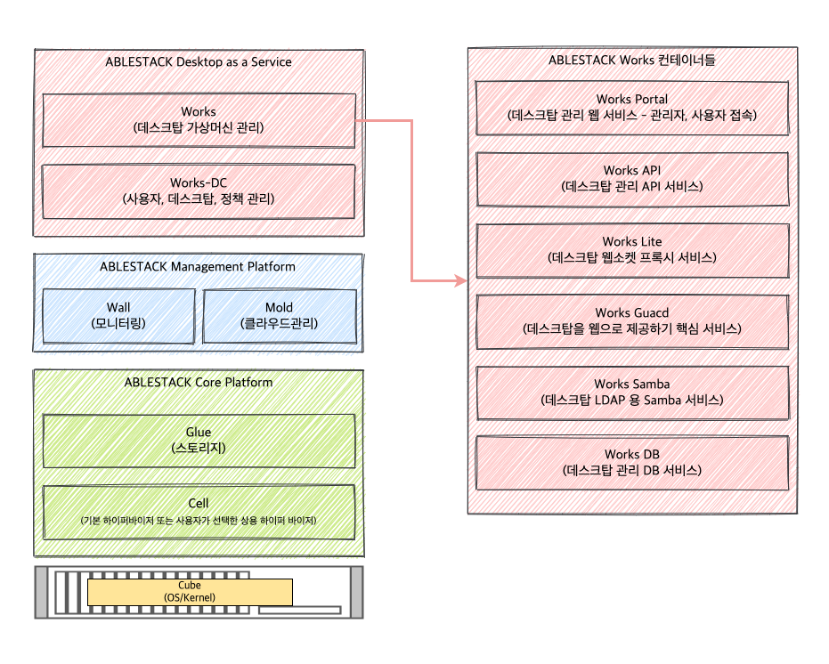
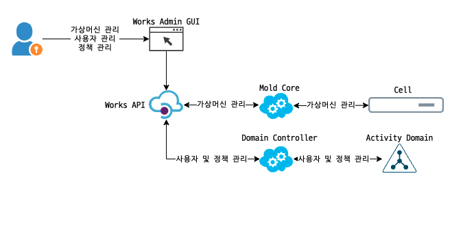
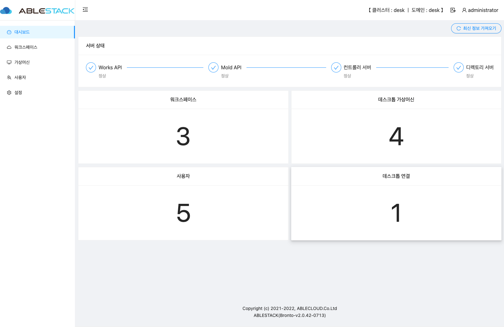
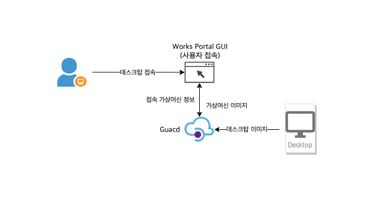

ABLESTACK의 Works는 Mold상에서 DaaS(Desktop As a Service)를 제공하는 플랫폼 입니다.

Works는 Mold 에서 구성되는 DaaS 플랫폼이여, Mold 에서 Works 와 관련된 System 가상머신을 배포하여 DaaS를  제공하며, Works 의 관리자 Portal 을 이용하여 사용자용 Desktop 을 제작 및 배포하며, Desktop 사용자는 사용자 Portal을 이용하여,
서비스를 이용 할 수 있습니다.

## Works 의 설계 목표

Works는 Windows 의 RDP 서비스를 이용하여 사용자의 RDP 클라이언트 또는 사용자 PC의 웹 브라우저를 이용하여 언제 어디서든 같은 Desktop을 사용 할 수 있는 서비스를 제공합니다.

Works는 AD(Activity Domain) 서비스를 이용하지 않고 Samba 의 LDAP 서비스를 이용하여 추가적인 Windows Server 라이센스 구입을 필요하지 않으며, 사용자용 Windows 라이센스의 비용만을 투자하여 구성이 가능하도록 서비스 제공합니다.

### 플랫폼 제공 목적

Works는 플랫폼 제공 목적은 아래와 같습니다.

* ABLESTACK의 Mold 서비스에서 Mold의 계정 별로 DaaS 를 제공
* 데스크탑 가상머신은 Private Network 에서 생성이 되나, 외부에서 동일한 데스크탑 가상머신에 접속 및 사용 가능

### 주요 특징 및 기능

Works 는 사용자에게 효과적인 DaaS 서비스 제공을 위해 다음과 같은 주요 특징을 보유하고 있습니다.

* 사용자별 데스크탑 클러스터 : Mold 의 사용자별 DaaS 를 제공 할 수 있습니다.
* 비용 절감 : Linux 의 LDAP 서비스인 Samba 서비스를 이용하여 별도의 윈도우 서버가 없이도 AD(Activity Domain) 서비스를 제공 할 수 있습니다.
* 모든 디바이스 대응 : 데스크탑 가상머신 접속을 웹 브라우저에서 접속을 할 수 있어 디바이스에 상관없이 동일한 데스크탑 가상머신을 사용 할 수 있습니다.

## 아키텍처

Works는 DaaS(Desktop as a Service) 플랫폼으로, ABLESTACK Mold로 구성된 가상화 서비스에서 데스크탑 가상머신을 제공할 수 있습니다.
Mold에서 데스크톱 서비스를 활성화 시키고, Mold를 통하여 데스크톱 클러스터를 계정별로 배포할 수 있습니다. 배포된 데스크톱 클러스터에서 관리자 웹 서비스를 제공하며
해당 웹 서비스를 이용하여 사용자용 데스크톱 가상머신을 생성 및 배포 할수 있습니다.

{ .imgCenter .imgBorder }

### 관리자 포털

Works 관리자는 워크스페이스, 데스크탑 가상머신, 데스크탑 사용자, 그룹 정책 등을 관리하며 모든 행위는 웹 서비스인 Works 관리자 포털 서비스를 이용하게 됩니다.

{ .imgCenter .imgBorder }

### 사용자 포털

Works 사용자는 관리자가 생성하고 할당한 데스크탑 가상머신에 접속하기 위해 해당 포털을 이용하여 접근 합니다.
해당 포털에 접속 하면 사용자에게 할당된 데스크탑 가상머신 리스트를 확인 할 수 있으며, 해당 포털을 이용하여 웹 브라우저에서 데스크탑 가상머신을 사용 할 수 있습니다.

{ .imgCenter .imgBorder }

