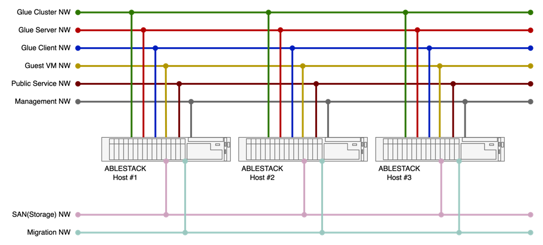
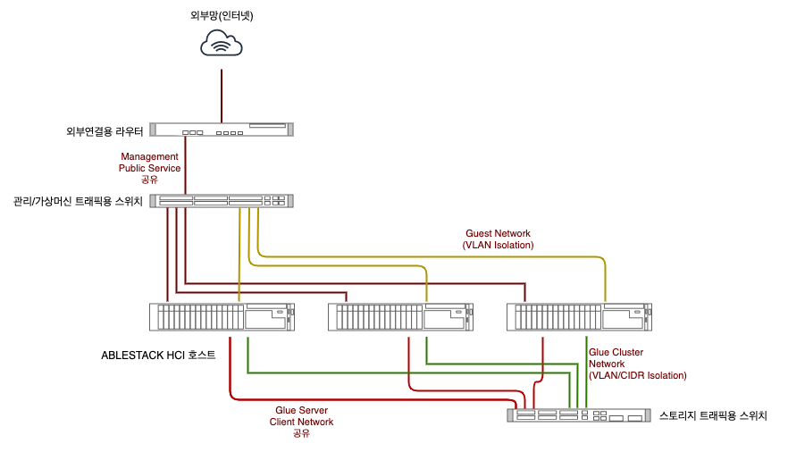

ABLESTACK HCI를 구성하기 위해서는 최소 3대의 호스트가 필요합니다. 그리고 이 호스트가 서로 유기적으로 묶여서 동작하기 위해서는 물리적인 네트워크 구성이 필요합니다. 

ABLESTACK HCI의 클러스터 구성을 위한 네트워크 트래픽과 호스트 구성을 개념적으로 도식화하면 다음과 같습니다. 

{ align=center }

HCI는 가상화기술 및 소프트웨어 정의 스토리지, 소프트웨어 정의 네트워크 등 다양한 기술이 융합되어 있고, 또한 고가용성 클러스터링까지 포함되어 있기 때문에 다양한 트래픽이 네트워크를 통해 전송되고 처리됩니다. 위의 그림과 같이 트래픽을 큰 단위로 세분화하면 총 6개의 트래픽이 존재합니다. 

!!! tip "실제 네트워크 구성 팁"
    위의 구성도는 네트워크 흐름을 구분하여 도식화 한 것입니다. 실제 물리적인 네트워크를 구성할 때는 위의 그림을 참고하여, 트래픽이 구분되어 흐를 수 있도록 구성하되 물리적으로는 케이블의 수를 줄일 수 있습니다.  

    일반적으로 스토리지 트래픽은 Glue 트래픽을 하나의 물리 네트워크로 케이블링하고 게스트용 케이블, 관리용 케이블로 구분하여 케이블링하는 것을 권장합니다. 만약 물리적으로 모든 트래픽을 구분하기 어렵다면 VLAN 등으로 트래픽을 격리하여 트래픽을 처리하도록 구성할 수 있습니다. 이때 스토리지 트래픽은 반드시 물리적으로 분리되도록 설계해야 합니다. 

각각의 트래픽을 처리하는 네트워크와 해당 네트워크의 구성 방법, 내부 아키텍처를 소개하면 다음과 같습니다. 

## Glue 네트워크

Glue 네트워크는 ABLESTACK HCI로 구성된 스토리지에서 발생하는 트래픽을 처리하기 위한 네트워크 입니다. 스토리지를 서비스하고, 데이터를 저장, 복제하며, 복구하기 위한 트래픽을 처리하고, 다양한 클라이언트에 의해 발생하는 IO 트래픽을 효과적으로 처리합니다. 따라서 각각의 트래픽을 효과적으로 격리하고 분산할 수 있는 아키텍처와 성능을 높이기 위한 고려가 반드시 필요합니다. 

ABLESTACK Glue는 대량으로 발생하는 트래픽을 효과적으로 격리하고 분산하기 위해 3가지의 네트워크를 구성하는 것을 권장합니다. 각각의 네트워크의 역할과 포트 구성은 다음과 같습니다. 

### Cluster 네트워크

!!! info "네트워크 포트 속성"
    &nbsp;&nbsp;:octicons-key-16:{ style="color: #4287B2;" }&nbsp;&nbsp;필수네트워크&nbsp;&nbsp;&nbsp; :octicons-plug-16:{ style="color: #00AB6C" }&nbsp;&nbsp;물리 구성 필요&nbsp;&nbsp;&nbsp;:octicons-rocket-16:{ style="color: #1DA1F2" }&nbsp;&nbsp;10GbE/10Gb SFP+ 이상, MTU 9000

ABLESTACK Host 들에 있는 디스크들을 클러스터링하고, 해당 디스크에 데이터를 복제하거나, 장애가 발생하는 경우 장애가 발생한 위치의 데이터를 다른 장치에 복제하고 복구하는 데 사용되는 트래픽을 처리합니다. 

일반적으로 가상머신을 운영하기 위한 데이터를 기록할 때 데이터를 복제하는 경우에는 많은 자원이 필요 없지만, 가상머신을 복제하거나 장애가 발생하여 특정 디스크의 데이터 전체를 복구하는 작업이 일어나면 네트워크에 높은 IO 처리를 요구합니다. 따라서 ABLESTACK은 복제 및 복구 네트워크를 물리적으로 반드시 분리해서 구성해야 합니다. 스토리지 트래픽의 Throughput을 좋게 하기 위해 해당 포트의 MTU를 9000으로 설정해야 합니다. 

### Server 네트워크

!!! info "네트워크 포트 속성"
    &nbsp;&nbsp;:octicons-key-16:{ style="color: #4287B2;" }&nbsp;&nbsp;필수네트워크&nbsp;&nbsp;&nbsp; :octicons-plug-16:{ style="color: #00AB6C" }&nbsp;&nbsp;물리구성 필요&nbsp;&nbsp;&nbsp;:octicons-rocket-16:{ style="color: #1DA1F2" }&nbsp;&nbsp;10GbE/10Gb SFP+ 이상, MTU 9000

호스트에 있는 디스크를 클러스터링 하여 Glue 스토리지를 생성하게 되면 해당 스토리지를 다양한 방식으로 서비스 하게 됩니다. 일반적인 블록 스토리지 서버를 제공할 뿐 아니라, iSCSI Initiator, NFS Gateway, POSIX 파일서버, Object Storage Gateway 등 다양한 서비스 서버를 제공합니다. 

ABLESTACK Glue 스토리지는 이러한 다양한 서비스의 트래픽을 단일 물리 포트를 이용해 제공합니다. 다양한 스토리지 서비스를 필요로 하거나 가상머신과 같이 다수의 스토리지 클라이언트 연결이 필요한 HCI의 특성 상 Glue Server 네트워크는 반드시 10Gb 이상의 물리적인 네트워크를 독립적으로 구성해야 합니다. 스토리지 트래픽의 Throughput을 좋게 하기 위해 해당 포트의 MTU를 9000으로 설정해야 합니다. 

### Client 네트워크

!!! info "네트워크 포트 속성"
    &nbsp;&nbsp;:octicons-key-16:{ style="color: #4287B2;" }&nbsp;&nbsp;필수네트워크&nbsp;&nbsp;&nbsp; :octicons-plug-16:{ style="color: #00AB6C" }&nbsp;&nbsp;물리구성 권장/Glue Server 네트워크와 포트 공유 가능&nbsp;&nbsp;&nbsp;:octicons-rocket-16:{ style="color: #1DA1F2" }&nbsp;&nbsp;10GbE/10Gb SFP+ 이상, MTU 9000

ABLESTACK Glue는 가상머신이 스토리지 컨트롤러로 실행됩니다. 가상머신은 위에서 설명한 Glue Cluster와 Server 용 NIC를 사용합니다. 그리고 각 호스트는 스토리지에 연결하는 클라이언트이기 때문에 별도의 클라이언트 네트워크 구성이 필요합니다. 따라서 가장 좋은 방법은 클라이언트용 포트를 물리적으로 분리하는 것입니다. 

하지만 스토리지에 연결하는 클라이언트를 위해 물리적으로 네트워크를 분리하는 것이 어려울 경우 클라이언트 네트워크를 Glue의 서버 네트워크와 통합하여 사용할 수 있으며 MTU는 9000으로 설정해야 합니다. 

## Cell 네트워크

Cell 네트워크는 ABLESTACK HCI로 구성된 호스크 클러스터에서 가상화를 관리하고, 생성된 가상머신 간의 네트워크 통신을 처리하고, 외부 사용자를 위한 서비스를 제공하기 위한 트래픽을 처리합니다. 그리고 가상머신을 다른 호스트로 마이그레이션하거나, 호스트 간의 상태를 확인하고, 장애를 인식하여 처리하는 등의 작업을 위한 트래픽도 처리합니다. 

ABLESTACK Cell은 가상화 호스트 및 가상머신에서 발생하는 트래픽을 효과적으로 격리하고 분산하여 처리하기 위해 크게 3가지의 네트워크를 구분하여 구성하는 것을 권장합니다. 각각의 네트워크의 역할과 포트 구성은 다음과 같습니다. 

### Guest VM 네트워크

!!! info "네트워크 포트 속성"
    &nbsp;&nbsp;:octicons-key-16:{ style="color: #4287B2;" }&nbsp;&nbsp;필수네트워크&nbsp;&nbsp;&nbsp; :octicons-plug-16:{ style="color: #00AB6C" }&nbsp;&nbsp;물리구성 필요&nbsp;&nbsp;&nbsp;:octicons-rocket-16:{ style="color: #1DA1F2" }&nbsp;&nbsp;1GbE/1Gb SFP 이상

Guest VM 네트워크는 가상머신에서 발생하는 트래픽을 처리하기 위한 네트워크 입니다. 가상머신 네트워크 구성 방법에 따라 상이하지만, 일반적으로는 가상머신 간의 트래픽을 의미합니다. Web 서버 가상머신과 WAS 서버 가상머신 간의 상호 작용을 위한 트래픽이 좋은 예가 될 것입니다. 만약 Web Server가 별도의 라우터를 거치지 않고 바로 외부와 연결된다면 이러한 트래픽도 Guest VM 네트워크에서 처리됩니다. 

Guest VM 네트워크는 트래픽의 경합을 방지하기 위해 물리적으로 분리하여 구성해야 합니다. 그리고 최소 1GbE 이상의 네트워크에 연결되야 합니다. 각각의 가상머신의 네트워크 격리는 VLAN을 이용합니다. 

### Public Service 네트워크

!!! info "네트워크 포트 속성"
    &nbsp;&nbsp;:octicons-key-16:{ style="color: #4287B2;" }&nbsp;&nbsp;필수네트워크&nbsp;&nbsp;&nbsp; :octicons-plug-16:{ style="color: #00AB6C" }&nbsp;&nbsp;물리구성 권장/Management 네트워크와 포트 공유 가능&nbsp;&nbsp;&nbsp;:octicons-rocket-16:{ style="color: #1DA1F2" }&nbsp;&nbsp;1GbE/1Gb SFP 이상

Public Service 네트워크는 가상머신 네트워크 중 외부 서비스를 위한 전용 네트워크 입니다. 일반적으로 가상머신 네트워크를 NAT으로 구성한 후 라우터를 이용해 외부와 통신할 때 라우터가 사용하는 네트워크가 Public Service 네트워크 입니다. 보안을 위해 일반적으로 Guest VM 네트워크는 외부로부터 격리하는 것을 권장합니다. 그리고 외부 서비스의 연결은 라우터를 이용해서 처리하는 것이 좋습니다. 

Public Service 네트워크를 물리적으로 구성하는 것이 어려울 경우 1Gb 이상의 성능을 가진 Management 네트워크를 공유하여 구성할 수 있습니다. 만약 Public Service 네트워크 대역이 Management 네트워크와 동일하지 않은 경우에는 VLAN을 이용해 트래픽을 격리해야 합니다. 

### Management 네트워크

!!! info "네트워크 포트 속성"
    &nbsp;&nbsp;:octicons-key-16:{ style="color: #4287B2;" }&nbsp;&nbsp;필수네트워크&nbsp;&nbsp;&nbsp; :octicons-plug-16:{ style="color: #00AB6C" }&nbsp;&nbsp;물리구성 필요&nbsp;&nbsp;&nbsp;물리구성 필요&nbsp;&nbsp;:octicons-rocket-16:{ style="color: #1DA1F2" }&nbsp;&nbsp;1GbE/1Gb SFP 이상

Management 네트워크는 ABLESTACK 호스트를 클러스터링하고, 가상화 명령을 전달하기 위한 트래픽을 처리합니다. 관리 트래픽은 클러스터링, HA Heartbeat, 라이브마이그레이션, 스토리지 마이그레이션, 데이터 백업 등의 작업과 관련됩니다. 

Management 네트워크를 물리적으로 분리해야 하며, 1Gb 이상의 네트워크로 구성해야 합니다. 단 라이브마이그레이션, 데이터 백업 등의 성능을 높이려면 10Gb 이상의 네트워크 구성을 권장합니다. 

## 물리적 구성 예시

ABLESTACK을 구성하기 위해 다수의 네트워크를 구성해야 하고 이러한 네트워크를 물리적으로 구성하는 것이 가장 좋은 방법이지만, 실제 네트워크를 물리적으로 구성한다는 것은 많은 자원을 필요로 합니다. 호스트 상에 다수의 NIC가 있어야 할 뿐 아니라 해당 네트워크의 트래픽을 처리하는 스위치도 있어야 합니다. 따라서 현실 환경에서 이러한 구성을 제공하는데에는 많은 어려움이 있습니다. 따라서 한정된 자원 내에서 효과적으로 물리적인 구성을 할 수 있는 방법이 필요합니다. 

ABLESTACK HCI를 물리적으로 구성하려면 다음과 같은 준비가 필요합니다. 

- ABLESTACK HCI용 상용 x86 서버 3대
- 외부 네트워크 연결용 라우터
- 관리 및 가상머신 트래픽용 스위치
- 스토리지 트래픽용 스위치

예시를 위해 사용하는 장비의 기본적인 사양을 예시적으로 정의하면 다음과 같습니다. 

!!! 장비사양예시

    === "HCI용 서버"

        * CPU : Intel Xeon Silver 4215 Processor (8Core, 2.5GHz), 2 Socket
        * Memory : 256GB DDR4-ECC
        * Disk : Single SAS RAID, 960GB SAS MU SSD 8개
        * NIC : 1GbE 4Port Onboard, 10Gb SFP+ 2Port 1개

    === "외부연결용 라우터"

        * Type : L3
        * 주요 지원 사양 : VLAN Routing, Inter VLAN Routing, VLAN Support, PVLAN, STP 등
        * Speed/Port : 1GbE/24Port

    === "관리/가상머신 트래픽용 스위치"

        * Type : L2
        * 주요 지원 사양 : VLAN Support, PVLAN, STP 등
        * Speed/Port : 1GbE/24Port

    === "스토리지 트래픽용 스위치"

        * Type : L2
        * 주요 지원 사양 : VLAN Support, PVLAN, STP 등
        * Speed/Port : 10Gb SFP+/16Port

!!! warning "장비사양 참고 시 주의"
    위에서 제시한 장비 사양은 물리적 구성의 예시를 위해 편의적으로 구성한 사양입니다. 실제 환경에서 구성 시에는 해당 사용자 환경에 맞게 서버 및 스위치 등을 구성해야 합니다. 

이렇게 준비한 장비를 이용해서 ABLESTACK HCI를 물리적으로 구성한 구성도는 다음과 같습니다. 

{ align=center }

Public, Guest VM용 네트워크가 하나의 스위치를 통해 처리됩니다. 스위치는 하나이지만, 스위치에서 호스트로 연결되는 선은 Management/Public이 하나, 그리고 Guest가 하나씩 별도로 연결됩니다. Guest VM 트래픽은 보안 및 가상머신 네트워크 간 격리를 위해서 VLAN을 사용합니다. 

스토리지 네트워크는 별도의 스위치로 구성됩니다. 해당 스위치는 스토리지 트래픽만 독립적으로 처리하기 때문에 다른 외부 네트워크와 연결하지 않습니다.

스토리지 네트워크를 처리하는 스위치에서는 각 호스트로 Server/Client 트래픽 처리를 위한 케이블, 그리고 Cluster 트래픽을 처리하기 위한 케이블이 연결됩니다. 스토리지 트래픽을 분리 또는 격리하는 방법은 CIDR를 이용하는 방법 또는 VLAN을 이용하는 방법을 사용하여 각 트래픽이 스위치 내에서 독립적으로 처리되도록 하는 것이 좋습니다. 