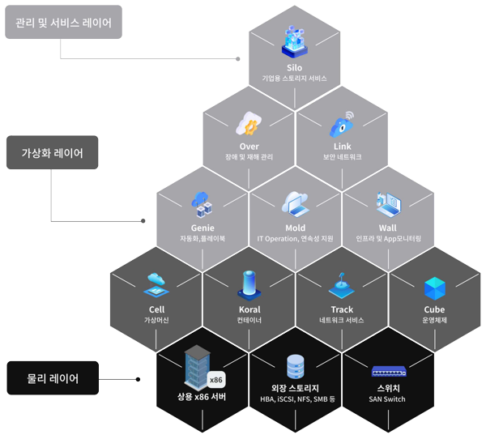
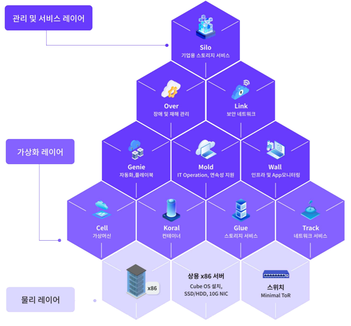

ABLESTACK은 기업의 데이터센터 운영 효율성을 높여주고, 데이터센터가 직면한 문제를 해결해 주기 위해 크게 두가지 형식의 제품을 제공합니다. 사용자는 기업의 인프라 환경에 따라 제품을 선택하여 가상화 인프라 또는 클라우드 데이터센터를 구성할 수 있습니다. 

## ABLESTACK VM

ABLESTACK VM은 일반적인 서버가상화, 클라우드 플랫폼입니다. 기업의 데이터센터는 전통적인 인프라 구성에 익숙합니다. 기업 데이터센터의 일반적인 인프라 구성은 스위치, 서버, 스토리지를 물리적으로 구성하는 구성입니다. ABLESTACK VM은 다음의 요구가 있는 데이터센터에서 선택하여 사용할 수 있습니다. 

- 서버, 스토리지 구성의 일반적 구성 선호
- 기존의 일반적 서버 가상화를 새로운 제품으로 교체
- 대용량의 스토리지가 필요하여 필수적으로 스토리지를 사용해야 하는 경우

ABLESTACK VM은 상용서버와 외장 스토리지, 물리 스위치를 이용해 가상화 및 클라우드 서비스를 구성하는 제품으로 다음의 구성요소로 이루어져 있습니다. 

## ABLESTACK HCI

ABLESTACK HCI는 별도의 외장스토리지 없이 서버가상화 및 클라우드 서비스를 제공하는 혁신적인 플랫폼입니다. 기업의 데이터센터를 혁신하고자 할 때, 인프라를 단순화 하고, 통합 관리를 하고자 하는 경우 적합한 구성입니다. ABLESTACK HCI는 다음의 요구가 있는 데이텃네터에서 선택하여 사용할 수 있습니다. 

- 기존의 서버, 스토리지 구성을 단일플랫폼으로 혁신하고자 하는 경우
- 인프라 관리 편의성을 높여 효율적인 데이터센터 관리를 원하는 경우
- 단일 실패 지점을 없애고 스토리지 장애를 근본적으로 해결하고자 하는 경우

ABLESTACK HCI는 서버의 내장 디스크만으로 고가용성 스토리지를 구성하고, 외장 스토리지가 가지는 단일 실패 지점 문제를 해결하여 서버에 장애가 발생하여도 서비스 연속성을 보장하는 혁신적인 가상화 플랫폼입니다. 별도의 외장 스토리지가 필요 없이 다음의 구성요소로 가상화 및 클라우드 인프라를 제공합니다. 

