# ABLESTACK 구성확인 가이드

## 개요

본 문서는 ABLESTACK 설치 완료 후 주요 구성요소가 정상적으로 구성되었는지 확인하기 위한 가이드입니다. Mold에서는 Zone, 클러스터, 호스트, 시스템 VM, 스토리지 및 네트워크 상태를 확인하고, Cube에서는 주요 서비스, 스토리지 연결 상태, 네트워크 구성, 가상머신 실행 상태를 점검합니다.

이를 통해 서비스 운영 전 구성 누락, 서비스 비정상, 스토리지 연결 오류, 네트워크 구성 오류, 가상머신 실행 문제를 사전에 확인할 수 있습니다.

## 클라우드 대시보드(Mold)

클라우드 대시보드(Mold)에서는 ABLESTACK 클라우드 환경의 주요 구성 상태를 확인할 수 있습니다.
시스템 가상머신, Zone, 클러스터, 호스트의 정상 동작 여부를 점검하고, 구성된 기본 스토리지와 2차 스토리지가 정상적으로 연결되어 있는지 확인합니다.

이를 통해 설치 완료 후 클라우드 관리 영역, 컴퓨트 자원, 스토리지 자원이 정상적으로 구성되었는지 확인할 수 있습니다.

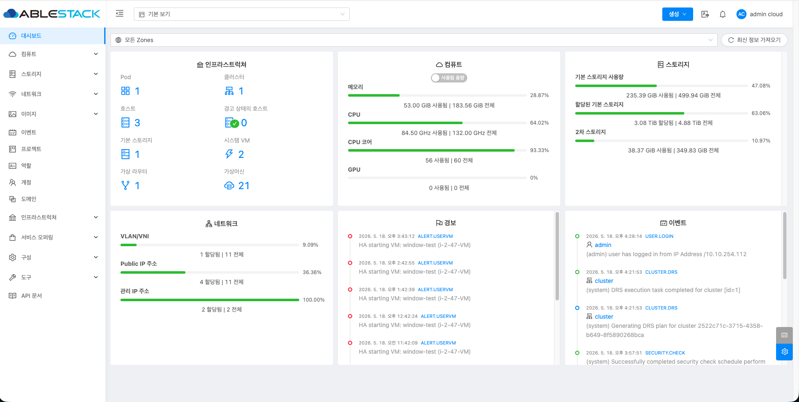{ .imgCenter .imgBorder }

### Zone 확인

Zone은 ABLESTACK 클라우드 환경의 최상위 인프라 관리 단위로, 클러스터, 호스트, 스토리지, 네트워크 등의 주요 자원을 포함합니다.
Mold 대시보드에서 설치 과정에서 생성한 Zone이 정상적으로 표시되고 사용 가능한 상태인지 확인합니다. Zone이 비정상 상태이거나 비활성화되어 있으면 가상머신 생성, 스토리지 연결, 네트워크 구성 등 클라우드 서비스 운영에 문제가 발생할 수 있습니다.

따라서 구성확인 단계에서는 Zone이 정상적으로 표시되는지, 사용 가능한 상태인지, 그리고 Zone에 연결된 하위 자원이 정상적으로 구성되어 있는지 확인합니다.

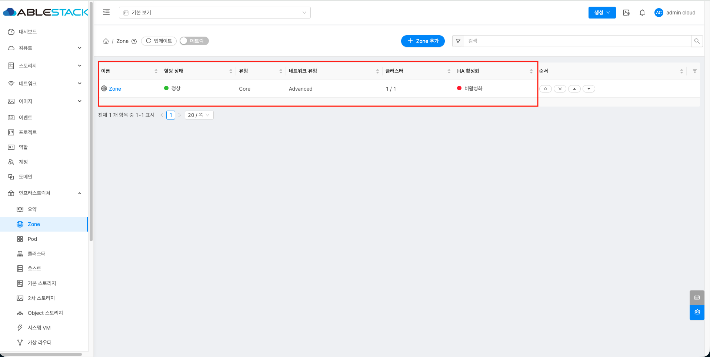{ .imgCenter .imgBorder }
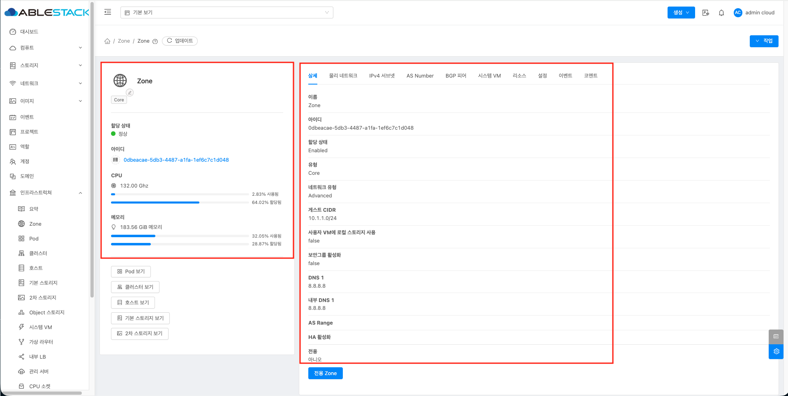{ .imgCenter .imgBorder }

### 클러스터 확인

클러스터는 Zone 내에서 여러 호스트를 하나의 컴퓨트 자원 그룹으로 묶어 관리하는 단위입니다. 클러스터에는 가상머신이 실행되는 호스트들이 포함되며, 동일한 클러스터 내의 호스트는 가상머신 배치, 마이그레이션, 리소스 관리 등에 사용됩니다.
Mold 대시보드에서 설치 과정에서 구성한 클러스터가 정상적으로 표시되고 사용 가능한 상태인지 확인합니다. 클러스터가 비정상 상태이거나 하위 호스트가 정상적으로 연결되어 있지 않으면 가상머신 생성, 시작, 마이그레이션 등 컴퓨트 자원 사용에 문제가 발생할 수 있습니다.

따라서 구성확인 단계에서는 클러스터가 정상적으로 표시되는지, 클러스터에 포함된 호스트가 정상 상태인지, 그리고 컴퓨트 자원이 정상적으로 인식되고 있는지 확인합니다.

아래 화면과 같이 클러스터 목록에서 구성된 클러스터의 상태를 확인합니다.

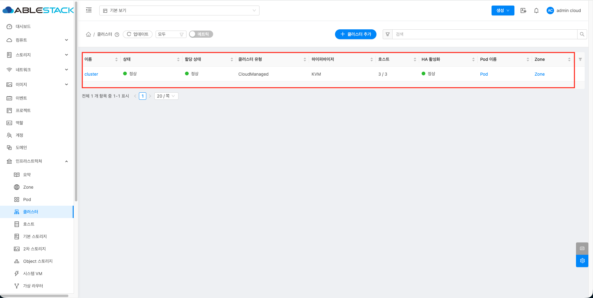{ .imgCenter .imgBorder }
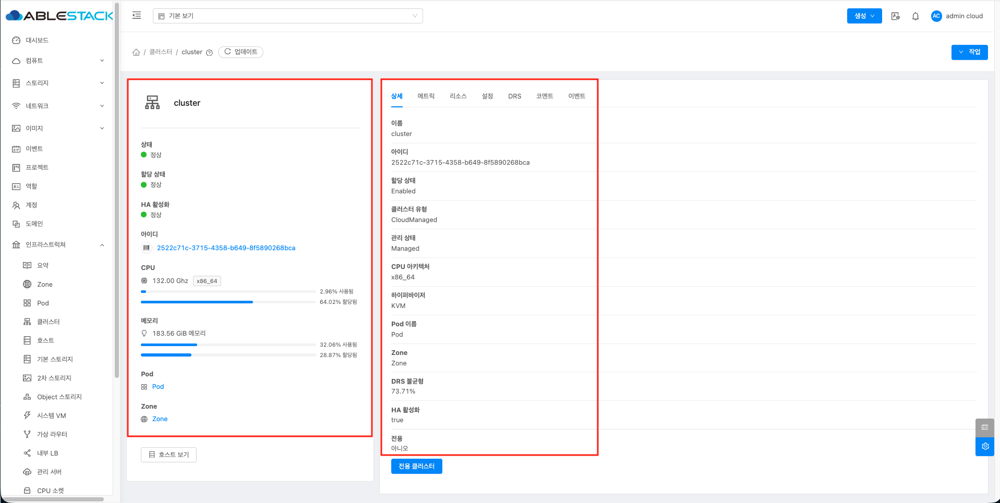{ .imgCenter .imgBorder }

### 호스트 확인

호스트는 가상머신이 실제로 실행되는 물리 서버로, Cluster 내에서 CPU, Memory, 네트워크, 스토리지 자원을 제공합니다.
Mold 대시보드에서 설치 과정에서 추가한 호스트가 정상적으로 표시되고 사용 가능한 상태인지 확인합니다. 호스트가 비정상 상태이거나 Mold와의 연결이 끊어진 경우 가상머신 생성, 실행, 마이그레이션 등 컴퓨트 자원 사용에 문제가 발생할 수 있습니다.

따라서 호스트 확인 단계에서는 호스트 상태, 리소스 상태, 라이선스 상태, CPU 및 Memory 자원 인식 여부를 함께 점검합니다.

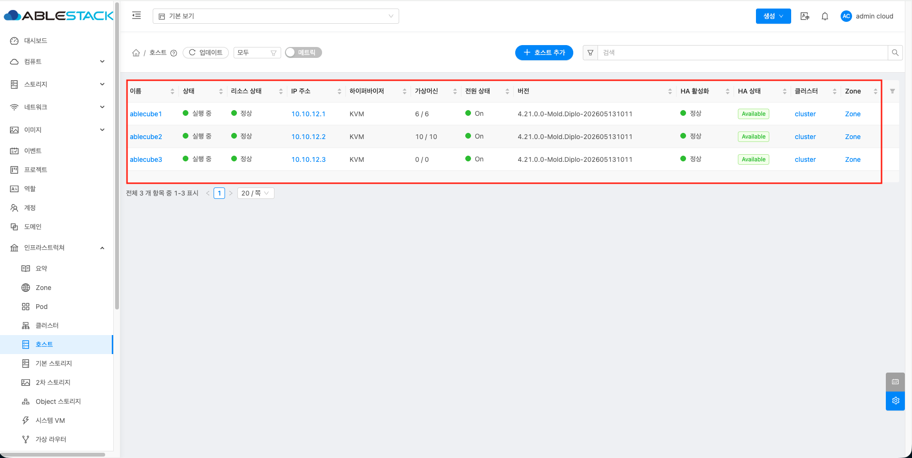{ .imgCenter .imgBorder }
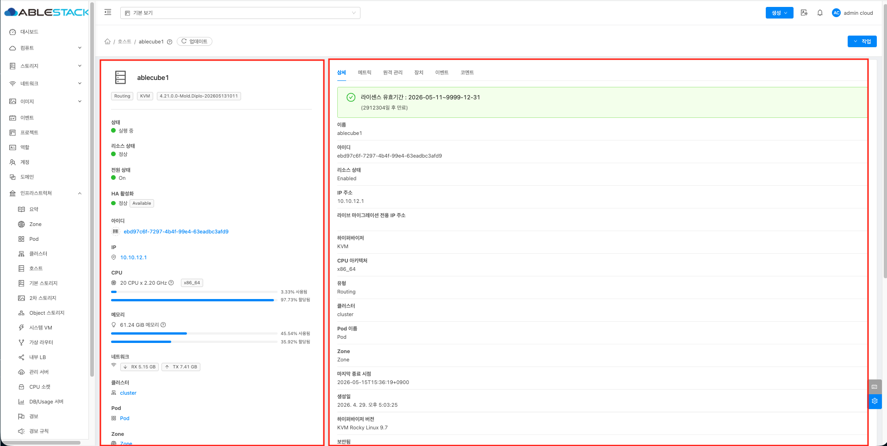{ .imgCenter .imgBorder }

### 시스템 VM 확인

시스템 VM은 ABLESTACK 클라우드 서비스 운영에 필요한 내부 기능을 제공하는 시스템 가상머신입니다. Console Proxy VM, Secondary Storage VM, Virtual Router 등이 포함되며, 가상머신 콘솔 접속, 템플릿 및 ISO 관리, 네트워크 서비스 제공 등에 사용됩니다.
Mold 대시보드에서 시스템 VM이 정상적으로 생성되고 실행 중인지 확인합니다. 시스템 VM이 비정상 상태이거나 실행되지 않는 경우 가상머신 콘솔 접속, 템플릿 다운로드, ISO 연결, 네트워크 통신 등 클라우드 서비스 사용에 문제가 발생할 수 있습니다.

따라서 구성확인 단계에서는 시스템 VM의 상태가 Running인지, Agent 상태가 정상인지, Console Proxy VM과 Secondary Storage VM이 정상적으로 동작하는지 확인합니다.

아래 화면과 같이 시스템 VM 목록에서 구성된 시스템 VM의 상태를 확인합니다.

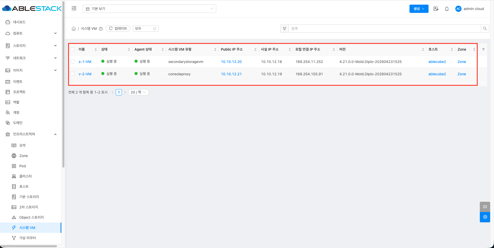{ .imgCenter .imgBorder }

#### 기본 스토리지 확인

기본 스토리지는 가상머신의 루트 디스크와 데이터 디스크가 저장되는 기본 스토리지입니다.
가상머신 생성, 시작, 중지, 마이그레이션, 디스크 추가 등의 작업은 기본 스토리지 상태에 직접적인 영향을 받습니다.

Mold 대시보드에서 기본 스토리지가 정상적으로 등록되어 있고, 사용 가능한 상태인지 확인합니다. 기본 스토리지가 비정상 상태이거나 호스트와의 연결이 불안정하면 가상머신 생성 실패, 디스크 연결 실패, 가상머신 시작 지연 등의 문제가 발생할 수 있습니다.

따라서 구성확인 단계에서는 기본 스토리지의 상태뿐만 아니라, 연결된 클러스터와 호스트에서 정상적으로 접근 가능한지 함께 점검합니다.

확인 항목은 다음과 같습니다.

- 기본 스토리지가 목록에 정상적으로 표시되는지 확인합니다.
- 기본 스토리지 상태가 **"실행 중"** 상태인지 확인합니다.
- 기본 스토리지가 올바른 Zone, Pod, Cluster에 연결되어 있는지 확인합니다.
- 전체 용량, 사용 용량, 여유 용량이 정상적으로 표시되는지 확인합니다.
- 연결된 호스트에서 스토리지 경로가 정상적으로 마운트되어 있는지 확인합니다.
- 가상머신 디스크가 생성될 수 있는 상태인지 확인합니다.
- 스토리지 관련 경고나 오류 이벤트가 발생하지 않았는지 확인합니다.

아래 화면과 같이 기본 스토리지 목록에서 구성된 기본 스토리지의 상태를 확인합니다.

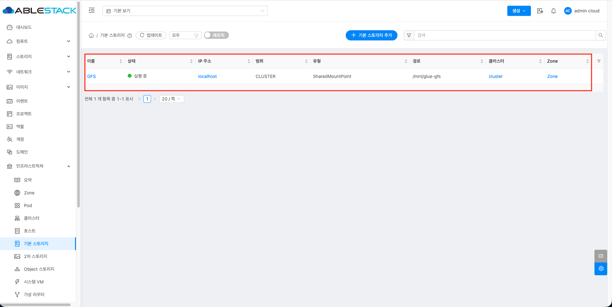{ .imgCenter .imgBorder }
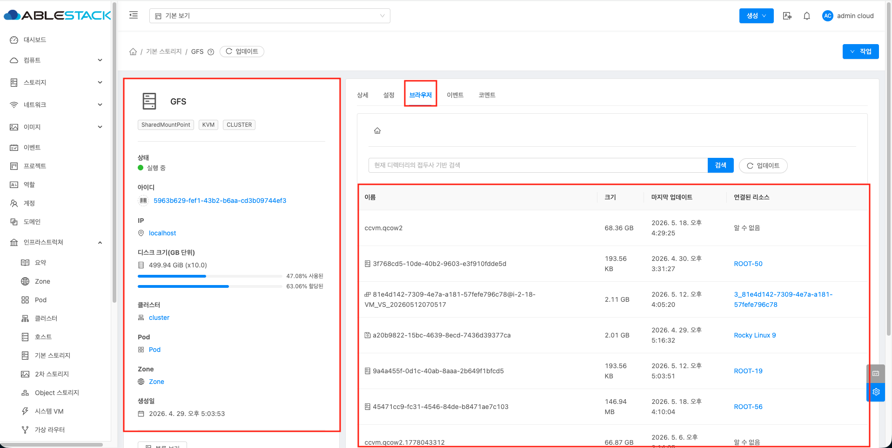{ .imgCenter .imgBorder }

#### 2차 스토리지 확인

2차 스토리지는 템플릿, ISO, 스냅샷, 볼륨 백업 등 보조 데이터를 저장하는 스토리지입니다.
가상머신 생성 시 템플릿을 내려받거나 ISO를 연결하는 과정에서 사용되며, 스냅샷 및 백업 기능과도 연관됩니다.

Mold 대시보드에서 2차 스토리지가 정상적으로 등록되어 있고, 사용 가능한 상태인지 확인합니다. 2차 스토리지가 비정상 상태이면 템플릿 다운로드 실패, ISO 연결 실패, 스냅샷 생성 실패, 시스템 VM 기능 오류 등이 발생할 수 있습니다.

따라서 구성확인 단계에서는 2차 스토리지의 상태와 용량뿐만 아니라, Secondary Storage VM과의 연결 상태 및 브라우저를 통한 접근 가능 여부를 함께 점검합니다.

확인 항목은 다음과 같습니다.

- 2차 스토리지가 목록에 정상적으로 표시되는지 확인합니다.
- 2차 스토리지의 액세스 상태가 **"읽기/쓰기"** 상태인지 확인합니다.
- 2차 스토리지가 올바른 Zone에 연결되어 있는지 확인합니다.
- 전체 용량, 사용 용량, 여유 용량이 정상적으로 표시되는지 확인합니다.
- Secondary Storage VM이 Running 상태인지 확인합니다.
- 템플릿 또는 ISO가 정상적으로 표시되고 Ready 상태인지 확인합니다.
- 2차 스토리지 관련 경고나 오류 이벤트가 발생하지 않았는지 확인합니다.
- 브라우저에서 2차 스토리지 접근 URL 또는 관련 상태 페이지에 접속 가능한지 확인합니다.

아래 화면과 같이 2차 스토리지 목록에서 구성된 2차 스토리지의 상태를 확인합니다.

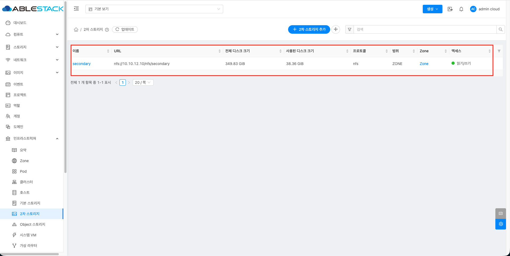{ .imgCenter .imgBorder }
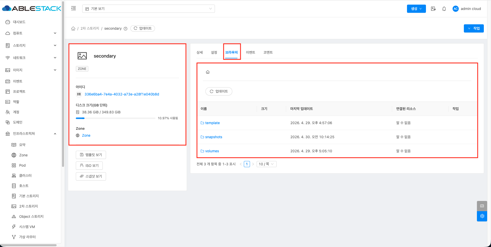{ .imgCenter .imgBorder }

## 인프라 대시보드(Cube)

인프라 대시보드(Cube)에서는 ABLESTACK을 구성하는 물리 호스트와 가상 어플라이언스의 상태를 확인할 수 있습니다.
Cube 대시보드는 설치 구성 방식에 따라 표시되는 항목이 달라지며, ABLESTACK-HCI, ABLESTACK-VM, ABLESTACK-STANDALONE 구성에 맞는 상태 정보를 제공합니다.

ABLESTACK-HCI 구성에서는 스토리지센터 클러스터, 클라우드센터 클러스터, 스토리지센터 가상머신, 클라우드센터 가상머신 상태를 확인할 수 있습니다.
ABLESTACK-VM 구성에서는 GFS 리소스 상태, GFS 디스크 상태, 클라우드센터 클러스터, 클라우드센터 가상머신 상태를 확인할 수 있습니다.
ABLESTACK-STANDALONE 구성에서는 로컬 디스크 상태, 클라우드센터 가상머신 상태를 확인할 수 있습니다.

이를 통해 설치 구성 방식에 따라 스토리지, 클러스터, 가상 어플라이언스, 디스크 상태가 정상적으로 구성되었는지 확인할 수 있습니다.

### ABLESTACK-HCI
ABLESTACK-HCI는 클라우드 관리 기능과 분산 스토리지 기능을 함께 제공하는 HCI 구성 방식입니다.
Cube 대시보드에서는 Glue 기반 스토리지센터 클러스터와 Mold 기반 클라우드센터 클러스터의 상태를 함께 확인할 수 있습니다.

구성확인 단계에서는 스토리지센터 클러스터가 정상적으로 구성되었는지, 클라우드센터 클러스터가 정상적으로 동작하는지, 그리고 각 센터 가상머신이 정상적으로 배포되어 실행 중인지 점검합니다.

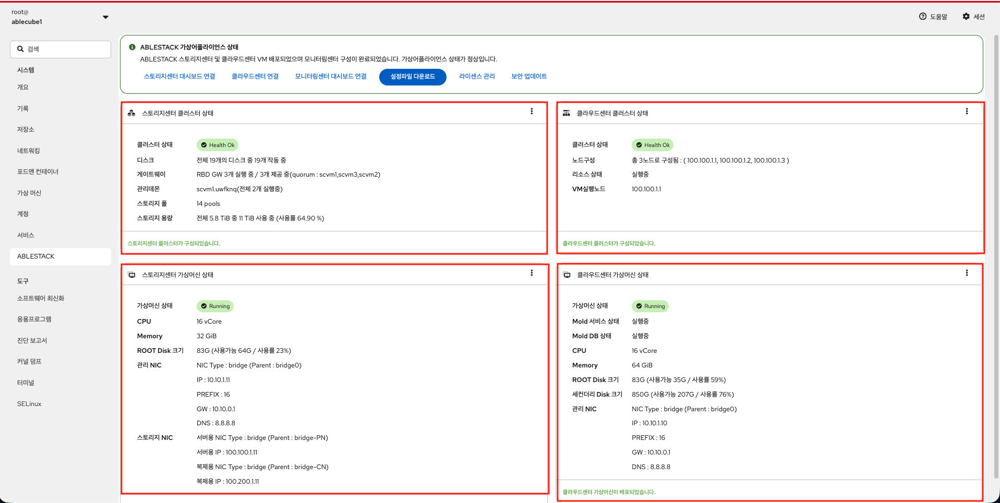{ .imgCenter .imgBorder }

#### 스토리지센터 클러스터 상태 확인

스토리지센터 클러스터는 ABLESTACK의 스토리지 기능을 제공하는 Glue 기반 클러스터입니다.
디스크, 게이트웨이, 관리 데몬, 스토리지 풀, 스토리지 용량 등의 상태를 확인하여 스토리지 서비스가 정상적으로 구성되었는지 점검합니다.

스토리지센터 클러스터가 비정상 상태이면 가상머신 디스크 생성, 스토리지 접근, 데이터 저장, 스토리지 고가용성 구성에 문제가 발생할 수 있습니다.

따라서 구성확인 단계에서는 클러스터 상태가 정상인지, 전체 디스크가 정상적으로 동작 중인지, 게이트웨이와 관리 데몬이 실행 중인지, 스토리지 풀과 용량 정보가 정상적으로 표시되는지 확인합니다.

인프라 대시보드의 스토리지센터 클러스터 상태 영역에서 클러스터 상태, 디스크, 게이트웨이, 관리 데몬, 스토리지 풀, 스토리지 용량 정보를 확인합니다.

#### 스토리지센터 가상머신 상태 확인

스토리지센터 가상머신은 ABLESTACK의 스토리지 기능을 제공하기 위해 배포되는 가상 어플라이언스입니다.
CPU, Memory, ROOT Disk, 관리 NIC, 스토리지 NIC 등의 정보를 확인하여 스토리지센터 가상머신이 정상적으로 실행 중인지 점검합니다.

스토리지센터 가상머신이 비정상 상태이거나 네트워크 설정이 올바르지 않으면 스토리지 서비스 접근, 스토리지 관리, 데이터 복제 및 저장 기능에 문제가 발생할 수 있습니다.

따라서 구성확인 단계에서는 가상머신 상태가 Running인지, CPU와 Memory가 정상적으로 할당되었는지, ROOT Disk 사용량이 과도하지 않은지, 관리 NIC와 스토리지 NIC 정보가 정상적으로 표시되는지 확인합니다.

인프라 대시보드의 스토리지센터 가상머신 상태 영역에서 가상머신 실행 상태와 자원 및 네트워크 정보를 확인합니다.

#### 클라우드센터 클러스터 상태 확인

클라우드센터 클러스터는 ABLESTACK의 클라우드 관리 기능을 제공하는 Mold 기반 클러스터입니다.
클러스터 노드 구성, 리소스 상태, VM 실행 노드 정보를 확인하여 클라우드센터가 정상적으로 구성되었는지 점검합니다.

클라우드센터 클러스터가 비정상 상태이면 Mold 관리 서비스, 가상머신 관리, 리소스 제어, 클라우드 대시보드 기능에 문제가 발생할 수 있습니다.

따라서 구성확인 단계에서는 클러스터 상태가 정상인지, 구성된 노드가 모두 표시되는지, 리소스가 실행 중인지, VM 실행 노드가 정상적으로 인식되는지 확인합니다.

인프라 대시보드의 클라우드센터 클러스터 상태 영역에서 클러스터 상태, 노드 구성, 리소스 상태, VM 실행 노드 정보를 확인합니다.

#### 클라우드센터 가상머신 상태 확인

클라우드센터 가상머신은 ABLESTACK의 클라우드 관리 기능을 제공하는 Mold 가상 어플라이언스입니다.
Mold 서비스, Mold DB, CPU, Memory, ROOT Disk, 세컨더리 Disk, 관리 NIC 등의 정보를 확인하여 클라우드센터 가상머신이 정상적으로 실행 중인지 점검합니다.

클라우드센터 가상머신이 비정상 상태이면 클라우드 대시보드 접속, 가상머신 관리, 네트워크 관리, 스토리지 연동, API 호출 등 주요 관리 기능에 문제가 발생할 수 있습니다.

따라서 구성확인 단계에서는 가상머신 상태가 Running인지, Mold 서비스와 Mold DB가 실행 중인지, 디스크 사용량이 과도하지 않은지, 관리 NIC 정보가 정상적으로 표시되는지 확인합니다.

인프라 대시보드의 클라우드센터 가상머신 상태 영역에서 가상머신 실행 상태, Mold 서비스 상태, Mold DB 상태, 자원 및 네트워크 정보를 확인합니다.

### ABLESTACK-VM

ABLESTACK-VM은 외부 또는 공유 스토리지 기반으로 클라우드센터를 구성하는 방식입니다.
Cube 대시보드에서는 GFS 리소스 상태, GFS 디스크 상태, 클라우드센터 클러스터 상태, 클라우드센터 가상머신 상태를 확인할 수 있습니다.

구성확인 단계에서는 GFS 리소스가 정상적으로 동작하는지, GFS 디스크가 정상적으로 연결되어 있는지, 그리고 클라우드센터 클러스터와 클라우드센터 가상머신이 정상적으로 실행 중인지 점검합니다.

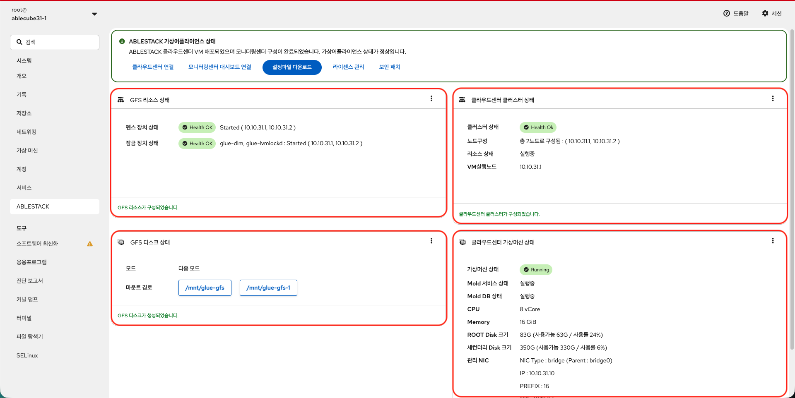{ .imgCenter .imgBorder }

#### GFS 리소스 상태 확인

GFS 리소스는 ABLESTACK-VM 구성에서 공유 파일시스템을 안정적으로 사용하기 위해 필요한 클러스터 리소스입니다.
여러 호스트가 동일한 스토리지 영역을 함께 사용하므로, 데이터 정합성을 유지하기 위해 펜스 장치와 잠금 장치가 정상적으로 동작해야 합니다.

펜스 장치는 장애가 발생한 호스트를 클러스터에서 안전하게 격리하기 위해 사용되며, 잠금 장치는 여러 호스트가 공유 스토리지에 동시에 접근할 때 데이터 충돌을 방지하기 위해 사용됩니다.

GFS 리소스가 비정상 상태이면 공유 파일시스템 마운트, 가상머신 디스크 접근, 가상머신 생성 및 실행에 문제가 발생할 수 있습니다. 특히 펜스 장치 또는 잠금 장치가 정상적으로 실행되지 않으면 클러스터 안정성과 스토리지 데이터 정합성에 영향을 줄 수 있습니다.

따라서 구성확인 단계에서는 펜스 장치 상태와 잠금 장치 상태가 정상인지, 관련 리소스가 각 호스트에서 Started 상태로 실행 중인지 확인합니다.

인프라 대시보드의 GFS 리소스 상태 영역에서 펜스 장치 상태, 잠금 장치 상태, 실행 중인 호스트 정보를 확인합니다.

정상 상태에서는 펜스 장치 상태와 잠금 장치 상태가 **Health OK** 로 표시되고, 관련 리소스가 구성된 호스트에서 **Started** 상태로 표시되어야 합니다.

#### GFS 디스크 상태 확인

GFS 디스크는 ABLESTACK-VM 구성에서 공유 파일시스템으로 사용되는 디스크 영역입니다.
가상머신 디스크 저장, 공유 스토리지 접근, 클라우드센터 서비스 운영에 필요한 데이터 저장 공간으로 사용됩니다.

GFS 디스크가 비정상 상태이거나 사용량이 과도하게 높으면 가상머신 생성, 디스크 쓰기, 스토리지 접근, 서비스 운영에 문제가 발생할 수 있습니다.

따라서 구성확인 단계에서는 GFS 디스크가 정상적으로 인식되는지, 마운트 상태가 정상인지, 전체 용량과 사용 용량이 정상적으로 표시되는지 확인합니다.

인프라 대시보드의 GFS 디스크 상태 영역에서 디스크 연결 상태, 마운트 상태, 전체 용량, 사용 용량, 여유 용량 정보를 확인합니다.

#### 클라우드센터 클러스터 상태 확인

클라우드센터 클러스터는 ABLESTACK의 클라우드 관리 기능을 제공하는 Mold 기반 클러스터입니다.
클러스터 노드 구성, 리소스 상태, VM 실행 노드 정보를 확인하여 클라우드센터가 정상적으로 구성되었는지 점검합니다.

클라우드센터 클러스터가 비정상 상태이면 Mold 관리 서비스, 가상머신 관리, 리소스 제어, 클라우드 대시보드 기능에 문제가 발생할 수 있습니다.

따라서 구성확인 단계에서는 클러스터 상태가 정상인지, 구성된 노드가 모두 표시되는지, 리소스가 실행 중인지, VM 실행 노드가 정상적으로 인식되는지 확인합니다.

인프라 대시보드의 클라우드센터 클러스터 상태 영역에서 클러스터 상태, 노드 구성, 리소스 상태, VM 실행 노드 정보를 확인합니다.

#### 클라우드센터 가상머신 상태 확인

클라우드센터 가상머신은 ABLESTACK의 클라우드 관리 기능을 제공하는 Mold 가상 어플라이언스입니다.
Mold 서비스, Mold DB, CPU, Memory, ROOT Disk, 세컨더리 Disk, 관리 NIC 등의 정보를 확인하여 클라우드센터 가상머신이 정상적으로 실행 중인지 점검합니다.

클라우드센터 가상머신이 비정상 상태이면 클라우드 대시보드 접속, 가상머신 관리, 네트워크 관리, 스토리지 연동, API 호출 등 주요 관리 기능에 문제가 발생할 수 있습니다.

따라서 구성확인 단계에서는 가상머신 상태가 Running인지, Mold 서비스와 Mold DB가 실행 중인지, 디스크 사용량이 과도하지 않은지, 관리 NIC 정보가 정상적으로 표시되는지 확인합니다.

인프라 대시보드의 클라우드센터 가상머신 상태 영역에서 가상머신 실행 상태, Mold 서비스 상태, Mold DB 상태, 자원 및 네트워크 정보를 확인합니다.

### ABLESTACK-STANDALONE

ABLESTACK-STANDALONE은 단일 노드 기반으로 클라우드센터를 구성하는 방식입니다.
Cube 대시보드에서는 로컬 디스크 상태와 클라우드센터 가상머신 상태를 확인할 수 있습니다.

구성확인 단계에서는 로컬 디스크가 정상적으로 인식되고 사용 가능한지, 그리고 클라우드센터 가상머신이 정상적으로 실행 중인지 점검합니다.

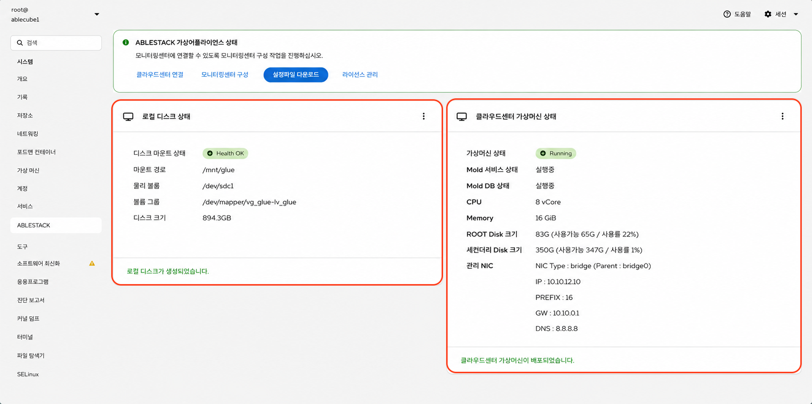{ .imgCenter .imgBorder }

#### 로컬 디스크 상태 확인

로컬 디스크는 ABLESTACK-STANDALONE 구성에서 가상머신 디스크와 서비스 데이터를 저장하는 기본 디스크 영역입니다.
단일 노드 구성에서는 로컬 디스크 상태가 가상머신 생성, 실행, 디스크 쓰기, 서비스 운영에 직접적인 영향을 줍니다.

로컬 디스크가 비정상 상태이거나 사용량이 과도하게 높으면 가상머신 생성 실패, 디스크 쓰기 오류, 서비스 지연 등의 문제가 발생할 수 있습니다.

따라서 구성확인 단계에서는 로컬 디스크가 정상적으로 인식되는지, 마운트 상태가 정상인지, 전체 용량과 사용 용량이 정상적으로 표시되는지 확인합니다.

인프라 대시보드의 로컬 디스크 상태 영역에서 디스크 연결 상태, 마운트 상태, 전체 용량, 사용 용량, 여유 용량 정보를 확인합니다.

#### 클라우드센터 가상머신 상태 확인

클라우드센터 가상머신은 ABLESTACK의 클라우드 관리 기능을 제공하는 Mold 가상 어플라이언스입니다.
Mold 서비스, Mold DB, CPU, Memory, ROOT Disk, 세컨더리 Disk, 관리 NIC 등의 정보를 확인하여 클라우드센터 가상머신이 정상적으로 실행 중인지 점검합니다.

클라우드센터 가상머신이 비정상 상태이면 클라우드 대시보드 접속, 가상머신 관리, 네트워크 관리, 스토리지 연동, API 호출 등 주요 관리 기능에 문제가 발생할 수 있습니다.

따라서 구성확인 단계에서는 가상머신 상태가 Running인지, Mold 서비스와 Mold DB가 실행 중인지, 디스크 사용량이 과도하지 않은지, 관리 NIC 정보가 정상적으로 표시되는지 확인합니다.

인프라 대시보드의 클라우드센터 가상머신 상태 영역에서 가상머신 실행 상태, Mold 서비스 상태, Mold DB 상태, 자원 및 네트워크 정보를 확인합니다.

## 구성확인 체크리스트

ABLESTACK 설치 완료 후 서비스 운영 전 아래 항목을 최종 확인합니다.
각 항목이 정상 상태로 확인되면 기본적인 클라우드 관리, 가상머신 실행, 스토리지 사용, 모니터링 구성이 정상적으로 완료된 것으로 판단할 수 있습니다.

### 1. Cube 구성 확인

- 주요 서비스가 정상적으로 실행 중인지 확인합니다.
- 네트워크 인터페이스, Bond, Bridge 구성이 정상인지 확인합니다.
- 스토리지, multipath, LVM 상태가 정상인지 확인합니다.
- GFS2 또는 CLVM 마운트 상태가 정상인지 확인합니다.
- 가상머신이 정상적으로 실행 중인지 확인합니다.
- 시스템 로그에서 주요 오류가 발생하지 않았는지 확인합니다.

### 2. Mold 구성 확인

- Zone이 정상적으로 표시되고 사용 가능한 상태인지 확인합니다.
- 클러스터와 호스트가 정상 상태인지 확인합니다.
- 시스템 VM이 Running 상태인지 확인합니다.
- 기본 스토리지가 정상적으로 연결되어 있는지 확인합니다.
- 2차 스토리지가 정상적으로 연결되어 있고 읽기/쓰기 가능한 상태인지 확인합니다.
- 네트워크 구성이 정상적으로 표시되는지 확인합니다.
- 템플릿과 ISO가 정상적으로 등록되어 사용 가능한 상태인지 확인합니다.

### 3. Wall 구성 확인

- Grafana 대시보드에 정상적으로 접속되는지 확인합니다.
- Prometheus Target이 정상 상태인지 확인합니다.
- Exporter 수집 상태가 정상인지 확인합니다.
- 주요 알림 룰이 정상적으로 동작하는지 확인합니다.

### 4. 최종 정상 기준

- 가상머신 생성이 정상적으로 수행됩니다.
- 가상머신 콘솔 접속이 정상적으로 수행됩니다.
- 가상머신 네트워크 통신이 정상적으로 수행됩니다.
- 스토리지 읽기 및 쓰기 작업이 정상적으로 수행됩니다.
- 모니터링 데이터가 정상적으로 수집됩니다.
