!!! danger
    이 문서는 기술지원 용도의 문서입니다. 기술지원 엔지니어가 아닌 사용자가 조작할 때 시스템에 문제가 발생할 수 있습니다.
    해당 설치과정에 사용되는 IP 및 입력 정보는 예시이며, 현장에 맞게 수정하시기 바랍니다.

# ABLESTACK 호스트 추가 작업진행
ABLESTACK 호스트 추가 설치 진행 가이드 입니다.
이 문서에서는 기구축된 ABLESTACK 환경에 추가적으로 ABLESTACK 호스트를 추가하기 위한 절차를 가이드 하고 있습니다.
ABLESTACK Cube 의 웹콘솔, ABLESTACK Glue 웹콘솔, ABLESTACK Mold 웹콘솔을 이용하여 진행이 되며 웹 접속 IP는 별도의 표시를 하지 않고 진행됩니다.
기존에 구성된 IP 정보에 맞게 웹콘솔을 접속 하시면 됩니다.

## ABLESTACK Cube 메인 화면
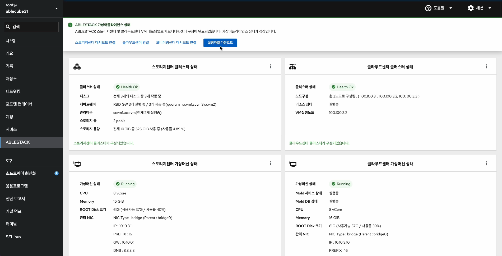{ align=center }
- 왼쪽 ABLESTACK 메뉴 클릭시 보이는 화면입니다.

!!! note
    ABLESTACK Cube 호스트 추가는 기 구축된 클러스터 정보를 이용하여 추가 구축합니다.

    여러 대를 추가 시 해당 작업을 반복하십시오.

    ABLESTACK Cube 호스트 추가 작업은 반드시 모든 구성요소(Cube 호스트, 스토리지센터 가상머신, 클라우드센터 가상머신)가 정상(Running) 동작 상태에서만 진행하십시오.

## 클러스터 설정파일 다운로드
1. 설정파일 다운로드
    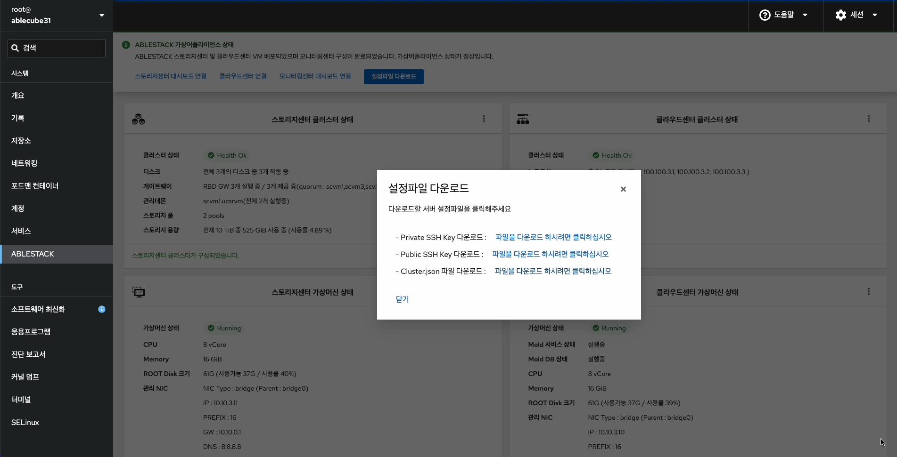{ align=center }
    - 상단 리본의 **설정파일 다운로드** 버튼을 클릭하면 보이는 화면입니다.
    - **Private SSH Key 다운로드** 버튼을 클릭하여 **id_rsa** 파일을 다운로드합니다.
    - **Public SSH Key 다운로드** 버튼을 클릭하여 **id_rsa.pub** 파일을 다운로드합니다.
    - **Cluster.json 다운로드** 버튼을 클릭하여 **cluster.json** 파일을 다운로드합니다.
    - 다운로드한 id_rsa, id_rsa.pub, cluster.json을 이용하여 클러스터 구성 준비를 진행합니다.

## 클러스터 구성 준비(추가 호스트)

1. 개요
    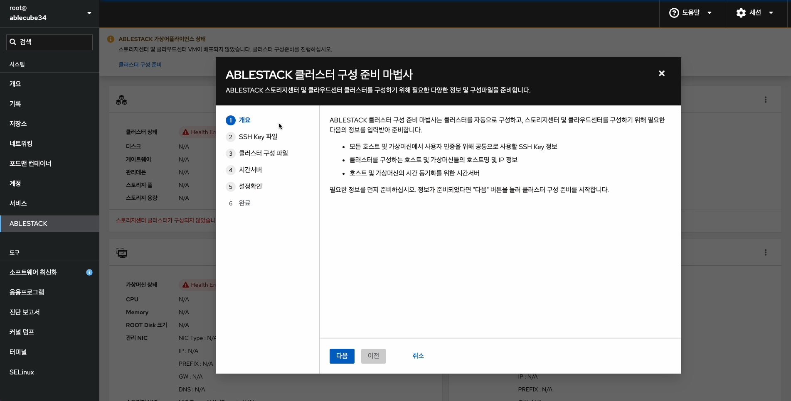{ align=center }
    - 상단 리본의 **클러스터 구성 준비** 링크를 클릭하면 보이는 화면입니다.
    - ABLESTACK 구성을 하는데 필요한 정보를 입력 받아 클러스터 구성을 준비하는 마법사 화면입니다.
    - **다음** 버튼을 눌러 클러스터 구성 준비를 시작합니다.

2. SSH Key 파일(신규생성)
    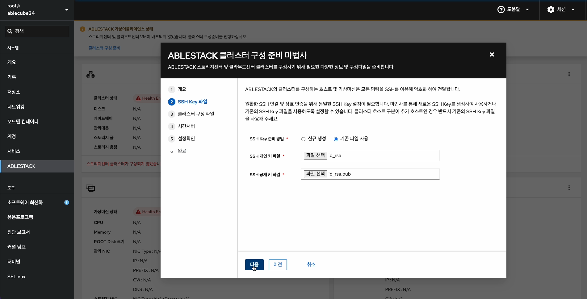{ align=center }
    - 클러스터 설정파일 다운로드 작업에서 받은 id_rsa, id_rsa.pub 파일을 이용하여 등록합니다.
    - **SSH Key 준비 방법** 에서 **기존 파일 사용** 을 선택하고 **SSH 개인 Key** 와 **SSH 공개 Key** 를 **파일 선택** 버튼을 눌러 추가 호스트 다운로드한 SSH Key 를 등록합니다.

    !!! info
        SSH 개인 Key 파일 명은 **id_rsa**, SSH 공개 Key 파일명은 **id_rsa.pub** 으로 고정되어 있습니다.
        다운로드한 Key 의 파일 명을 수정할 경우 등록이 불가능 합니다.

3. 클러스터 구성 파일
    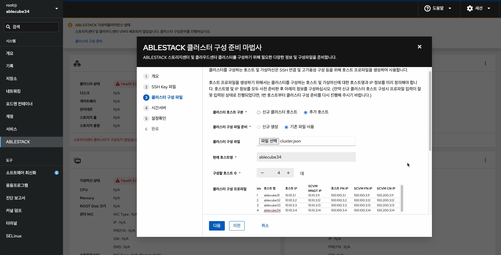{ align=center }
    - 클러스터 구성 설정하는 화면입니다. **클러스터 호스트 구분** 을 **추가 호스트** 로 선택한다.
    - 추가 호스트 인경우 **클러스터 구성 파일 준비** 는 **기존 파일 사용** 이 자동 선택됩니다.
    - **클러스터 구성 파일** 을 클러스터 설정파일 다운로드 작업에서 받은 cluster.json 파일을 이용하여 등록합니다.
    - **현재 호스트명** 은 해당 호스트의 이름을 자동으로 불러옵니다.
    - **구성 호스트 수** 자동으로 계산되어 입력합니다.
    - **클러스터 구성 프로파일** 추가 호스트 명 및 IP 정보를 입력 합니다.
    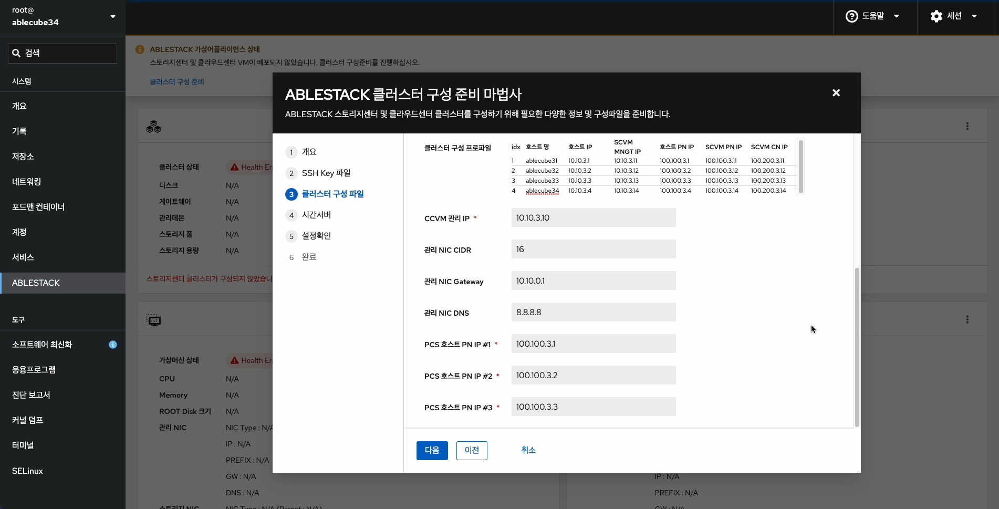{ align=center }
    - **CCVM 관리 IP** 정보를 확인 합니다.
    - **관리 NIC CIDR** 정보를 확인 합니다.
    - **관리 NIC Gateway** 정보를 확인 합니다.
    - **관리 NIC DNS** 정보를 확인 합니다.
    - **PCS 호스트명 PN IP #1** 정보를 확인 합니다.
    - **PCS 호스트명 PN IP #2** 정보를 확인 합니다.
    - **PCS 호스트명 PN IP #3** 정보를 확인 합니다.
    - 위 항목을 입력 및 확인 후에 **다음** 버튼을 클릭합니다.

    !!! info
        현재 호스트명을 자동으로 불러오며, 클러스터 구성 프로파일에 현재 호스트명과 동일한 호스트 명이 존재해야 합니다. 
        기존 구성 정보를 수정할 수 없으며 추가 호스트의 정보만 입력가능 합니다. 

    !!! example
        - 호스트 프로파일 예제

        idx | 호스트 명 | 호스트 IP | SCVM MNGT IP | 호스트 PN IP | SCVM PN IP | SCVM CN IP
        :---: | :-------: | :-------: | :-------: | :-------: | :-------: | :-------:
        1 | ablecube31 | 10.10.3.1 | 10.10.3.11 | 100.100.3.1 | 100.100.3.11 | 100.200.3.11
        2 | ablecube32 | 10.10.3.2 | 10.10.3.12 | 100.100.3.2 | 100.100.3.12 | 100.200.3.12
        3 | ablecube33 | 10.10.3.3 | 10.10.3.13 | 100.100.3.3 | 100.100.3.13 | 100.200.3.13
        4 | ablecube34 | 10.10.3.4 | 10.10.3.14 | 100.100.3.4 | 100.100.3.14 | 100.200.3.14

4. 시간서버

    !!! info
        ABLESTACK에서 시간서버는 매우 중요한 역할을 합니다.  
        시간동기화가 맞지 않으면 스토리지 데이터들의 무결성 확보에 치명적일 수 있습니다. 
        따라서 시간서버는 반드시 구성해야하며 시간서버 구성에는 두가지 방식이 있습니다. 
        인터넷등 외부 통신이 가능한 환경이어서 외부 공인된 시간서버(NTP)에 접속이 가능하거나 내부에 별도의 시간서버(NTP)가 존재하는 경우에는 "외부시간서버"를 선택하여 진행하고, 
        폐쇄적인 네트워크 환경으로 외부 공인된 시간서버와 통신이 불가하고 내부에 별도의 시간서버가 없을 경우에는 ABLESTACK에서 자체적으로 시간서버를 구성합니다. 이때에는 "로컬 시간서버"를 선택하여 진행하면 됩니다.

        기존 클러스터의 구성방식과 동일한 방법으로 시간서버를 구성해 주세요.

        이 문서는 "로컬 시간서버"로 구성하는 방식에 대하여 설명되어 있습니다.

    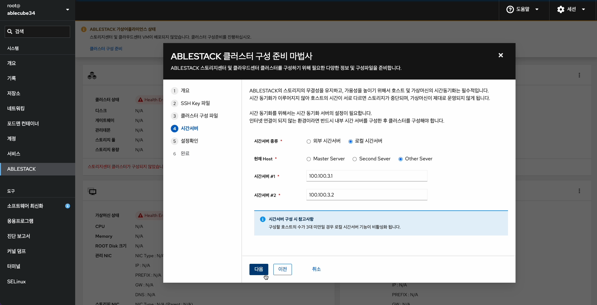{ align=center }

    - 시간 서버 구성하는 화면입니다.
    - 클러스터 구성 정보를 토대로 시간 서버 입력값을 기본 세팅합니다.
    - **시간서버 종류** 에서 **로컬 시간서버** 를 선택하고 **현재 Host** 를 **Master Server** 를 선택합니다.
    - 기본적으로 idx1 = Master Server, idx2 = Second Server, idx3 이상 = Other Server로 설정 됩니다.
    - **시간서버 1** 에는 **1번 호스트의 Public Storage IP**, **시간서버 2** 에는 **2번 호스트의 Public Storage IP** 을 입력하고 **다음** 버튼을 클릭합니다.

5. 설정확인
    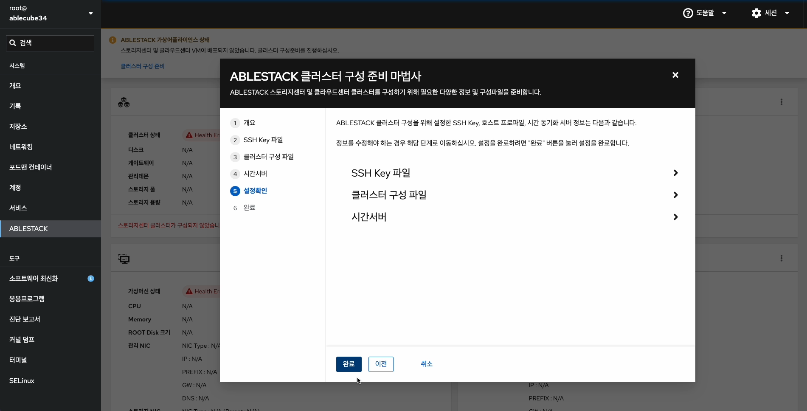{ align=center }
    - 구성 준비에 입력값에 대한 설정을 확인하는 화면입니다.
    - 설정된 값을 확인 후 이상이 없는 경우 **완료** 버튼을 클릭합니다.

6. 완료
    { align=center }
    - 클러스터 구성 준비 3단계 진행상황을 확인합니다.
    - 정상적으로 끝날 경우 완료 화면이 호출 됩니다.

    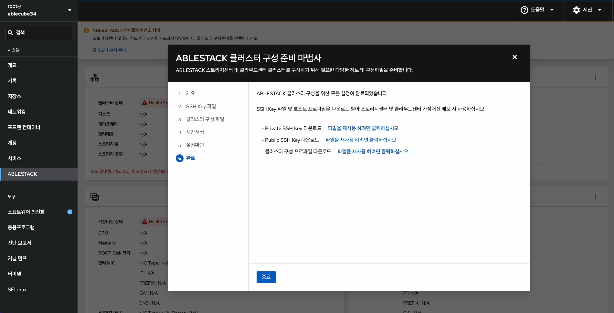{ align=center }

    - 추가 호스트의 경우 설정파일을 다운로드할 필요는 없습니다.

## 스토리지센터 가상머신 배포
1. 개요
    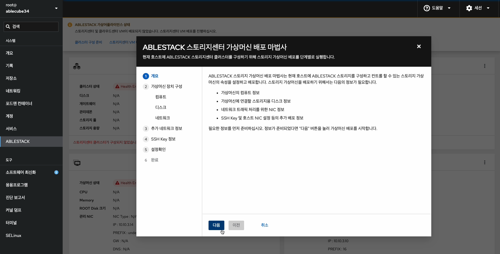{ align=center }
    - ABLESTACK 스토리지센터 가상머신 배포 마법사 화면입니다.

2. 가상머신 장치 구성 - 컴퓨트
    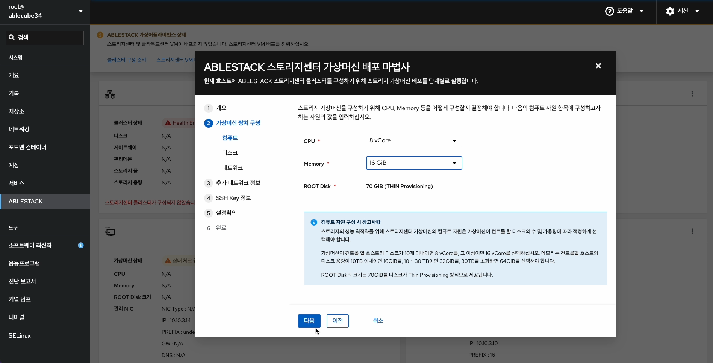{ align=center }
    - 스토리지센터 가상머신 장치 구성의 CPU, Memory 구성 화면입니다.
    - **CPU** 는 **8 vCore** 를 선택 하고, **Memory** 는 **16GiB** 를 선택 하고 **다음** 버튼을 클릭합니다.

    !!! tip
        스토리지의 성능 최적화를 위해 스토리지센터 가상머신의 컴퓨트 자원은 가상머신이 컨트롤 할 디스크의 수 및 가용량에 따라 적정하게 선택해야 합니다.
        CPU 는 컨트롤 할 호스트의 디스크가 **10개** 이내이면, **8 vCore** 를 그이상이면 **16 vCore** 를 선택히시면 됩니다.
        Memory 는 컨트롤 할 호스트의 디스크 용량이 **10 TB** 이내이면, **16 GiB**, **10 ~ 30 TB** 이면 **32 GiB**, **30 TB** 를 초과하면 **64 Gib**
        를 선택하시면 됩니다.
        ROOT Disk의 크기는 **70GiB** 를 디스크가 **Thin Provisioning** 방식으로 제공됩니다.

3. 가상머신 장치구성 - 디스크

    !!! info
        스토리지 센터 가상머신의 디스크로 스토리지 클러스터를 구성하게 됩니다. 
        구성 방법에 따라 Raid-Passthrough와 LUN-Passthrough를 선택하게 됩니다. 
        Raid-Passthrough는 Raid 카드를 스토리지 센터 가성머신에 할당할 경우이며, 해당 항목을 선택하면 Raid 카드 목록이 출력됩니다. 
        LUN-Passthrough는 기 구성된 LUN을 스토리지 센터 가상머신에 할당하는 경우이며, 해당 항목을 선택하면 LUN 목록이 출력됩니다.

        이 문서는 "LUN Passthrough"로 구성하는 방식에 대하여 설명되어 있습니다.

    { align=center }

    - 스토리지 센터 가상머신 장치의 디스크 구성 화면입니다.
    - **디스크 구성 방식** 은 **LUN Passthrough** 를 선택하고 **Glue 스토리지로 사용할 디스크** 를 선택하고 **다음** 버튼을 클릭 합니다.

    !!! warning
        가상머신 장치션 구성 - 디스크 구성시 파티션이 구성된 디스크의 선택을 하시면 안됩니다.
        만약에 파티션이 구성된 디스크를 선택을 하고 가상 머신을 구성하시면 ABLESTACK Cube 가 삭제가 될 수 있습니다.

4. 가상머신 장치구성 - 네트워크

    !!! info
        스토리지 센터 가상머신의 관리 및 스토리지 전용 네트워크를 구성하게 됩니다. 
        구성 방법에 따라 NIC-Passthrough, NIC-Passthrough-Bonding, Bridge-Network를 선택하게 됩니다. 
        NIC-Passthrough 및 NIC-Passthrough-Bonding 일 경우에는 물리적인 NIC 디바이스 목록이 출력됩니다. 
        서버용 NIC, 복제용 NIC를 선택하시면 됩니다. 
        NIC-Passthrough-Bonding 경우에는 NIC 별로 2개씩 디바이스 목록을 선택하게 됩니다. 실제로 본딩 구성이 되는것은 아니며 스토리지센터 가상머신 배포 후에 해당 관리화면(Cube)에서 본딩 구성을 완료하셔야 합니다. 
        Bridge-Network는 Cube 구성 시 생성했던 Bridge 목록이 출력됩니다.

        이 문서는 "NIC-Passthrough"로 구성하는 방식에 대하여 설명되어 있습니다.

    { align=center }

    - 스토리지 센터 가상머신 장치의 네트워크 구성 화면입니다.
    - **관리 NIC 용 Bridge** 선택 박스에서 **관리용 Bridge 네트워크** 를 선택합니다.
    - **스토리지 NIC 구성 방식** 에서 **NIC Passthrough** 를 선택하고 **서버용 NIC** 선택 박스에서는 **서버용으로 사용할 NIC** 를 **복제용 NIC**
    선택 박스에서는 **복제용으로 사용할 NIC** 을 선택하고 **다음** 버튼을 클릭합니다.

5. 추가 네트워크 정보
    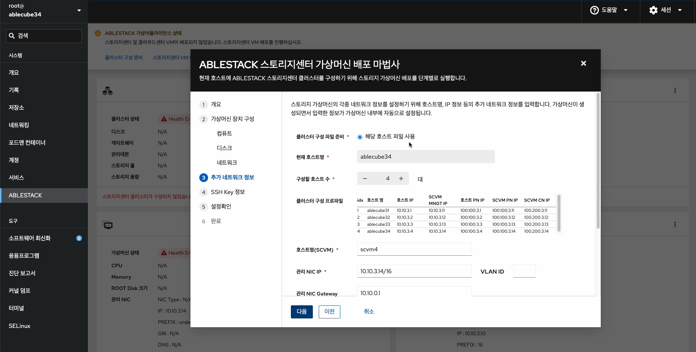{ align=center }
    - **클러스터 구성 파일 준비** 해당 호스트 파일 사용으로 자동 선택되며, ablecube 호스트 설정 정보를 자동으로 읽어와 클러스터 구성 정보 및 네트워크 IP 정보를 세팅합니다.
    - **호스트명(SCVM)** 을 입력 및 확인합니다.
    - **관리 NIC IP** 를 입력 및 확인합니다.

    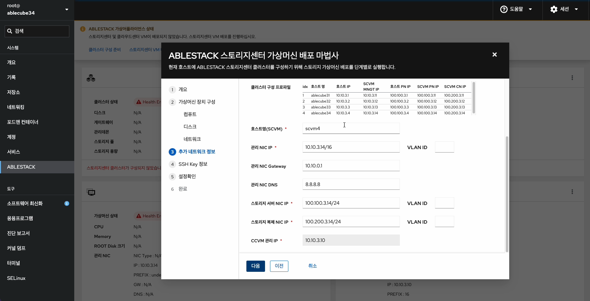{ align=center }

    - **관리 NIC Gateway** 를 입력 및 확인합니다.
    - **관리 NIC DNS** 를 입력 및 확인합니다.
    - **스토리지 서버 NIC IP** 를 입력 및 확인합니다.
    - **스토리지 복제 NIC IP** 를 입력 및 확인합니다.
    - **CCVM 관리 IP** 를 확인합니다.

    !!! info
        스토리지센터 가상머신 배포시 ablecube 호스트에서 설정파일 읽어와 일부 정보를 자동세팅되며 입력 정보를 정확히 확인해야 합니다.
        해당 화면의 IP 정보 는 예제 입니다. IP 정보는 사이트 정보에 맞춰서 수정해야 합니다.

6. SSH Key 정보
    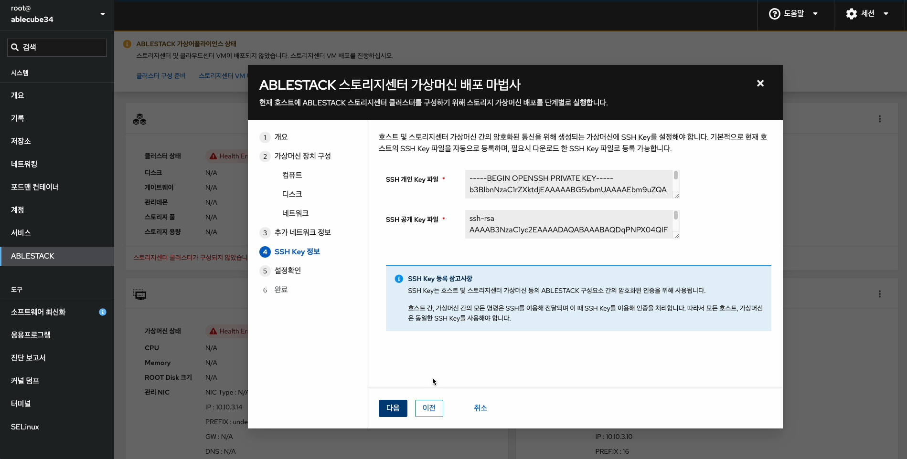{ align=center }
    - SSH Key 정보를 확인하는 화면입니다.
    - 클러스터 구성시 호스트에 등록된 호스트의 키 정보로 자동세팅됩니다.

    !!! info
        SSH 개인 Key 파일 명은 **id_rsa**, SSH 공개 Key 파일명은 **id_rsa.pub** 으로 고정되어 있습니다.
        키 파일명을 변경할 경우 등록이 불가능 합니다.

7. 설정확인
    { align=center }
    - 스토리지센터 가상머신 배포를 위한 구성정보 확인하는 화면입니다.
    - **배포** 버튼을 클릭하면 확인창이 보이며 **실행** 버튼을 눌러 스토리지 가상머신을 배포 합니다.

8. 배포
    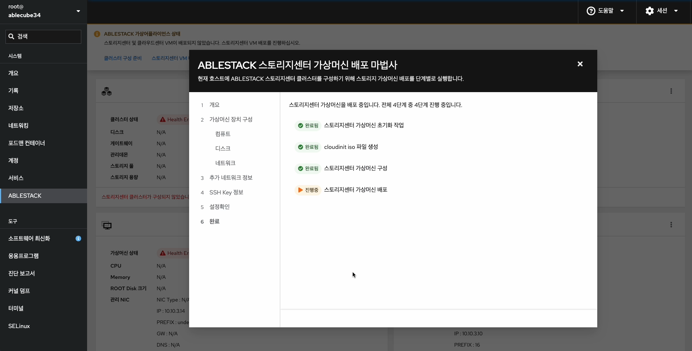{ align=center }
    - 스토리지센터 가상머신 배포 진행상황을 확인 할 수 있는 화면입니다.

9.  완료
    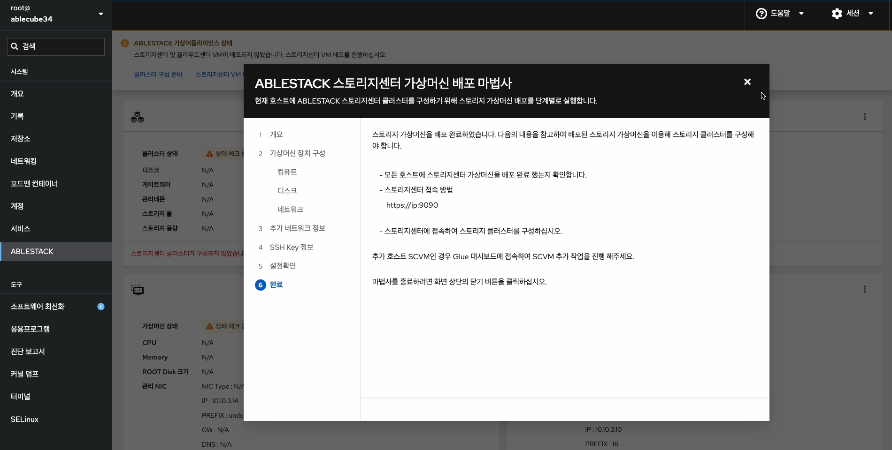{ align=center }
    - 스토리지센터 가상머신 배포 완료 후 화면입니다.

10. 스토리지센터 가상머신 상태 확인
    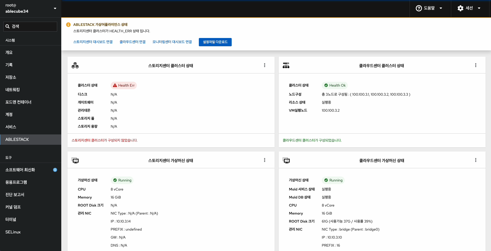{ align=center }
    - 스토리지센터 가상머신 상태 카드에서 가상머신 상태가 **Running** 인지 확인합니다.

## Glue에 스토리지센터 가상머신 추가

1. Glue 대시보드 연결
    { align=center }
    - 기 구축된 1번 Cube 로 이동하여 로그인 합니다.
    - 상단 리본의 **스토리지센터 대시보드 연결** 링크를 클릭하여 Glue 대시보드로 연결합니다.

2. 스토리지센터 가상머신 추가
    { align=center }
    - Glue 대시보드에 로그인하여, 클러스터 > 호스트 메뉴에서 추가버튼을 클릭하면 보이는 화면입니다.
    - **호스트 이름** 항목에 추가되는 스토리지센터 가상머신의 **호스트 명**을 입력합니다.
    - **Network address** 항목에 추가되는 스토리지센터 가상머신의 **scvm pn ip**을 입력합니다.
    - **추가 호스트** 버튼을 클릭하여 Glue 스토리지 클러스터에 추가합니다.

3. 스토리지센터 가상머신 추가 완료
    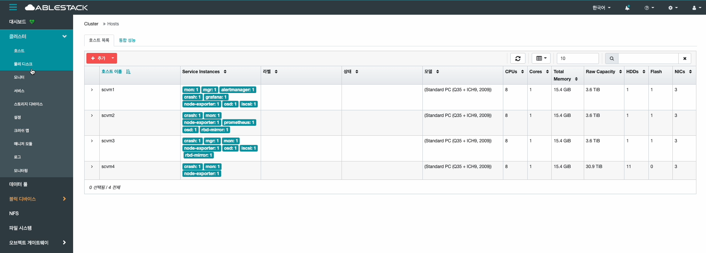{ align=center }
    - 호스트 목록에 추가된 스토리지센터 가상머신을 확인합니다.

4. 전체 호스트 Glue 설정정보 업데이트
    { align=center }
    - 1번 Cube에서 ABLESTCK > 스토리지센터 클러스터 상태 카드 메뉴의 **전체 호스트 Glue 설정 업데이트** 를 클릭합니다.

    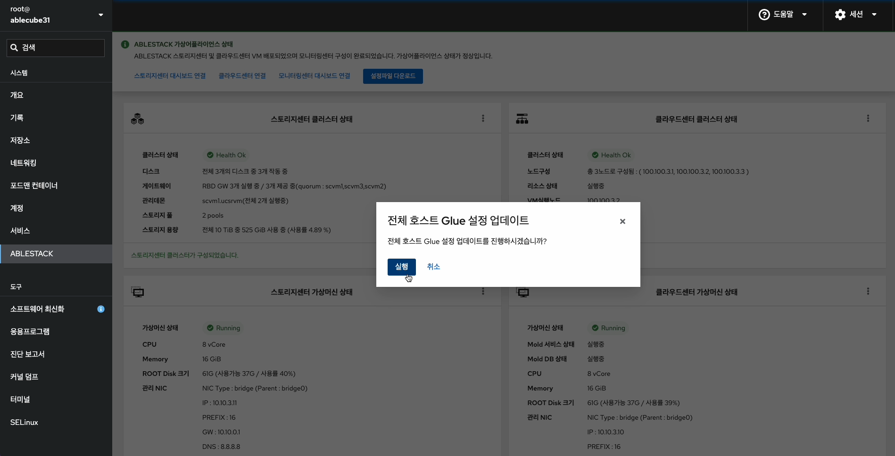{ align=center }
    - **실행** 버튼을 클릭하여 모든 호스트에 Glue 설정정보를 업데이트 합니다.

## Mold에 호스트 추가

1. Mold 대시보드 연결
    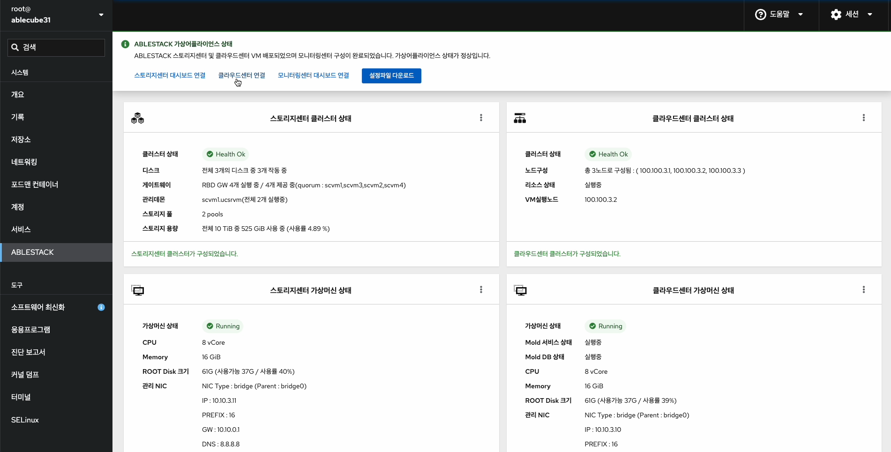{ align=center }
    - 1번 Cube 로 이동하여 로그인 합니다.
    - 상단 리본의 **클라우드센터 대시보드 연결** 링크를 클릭하여 Mold 대시보드로 연결합니다.

    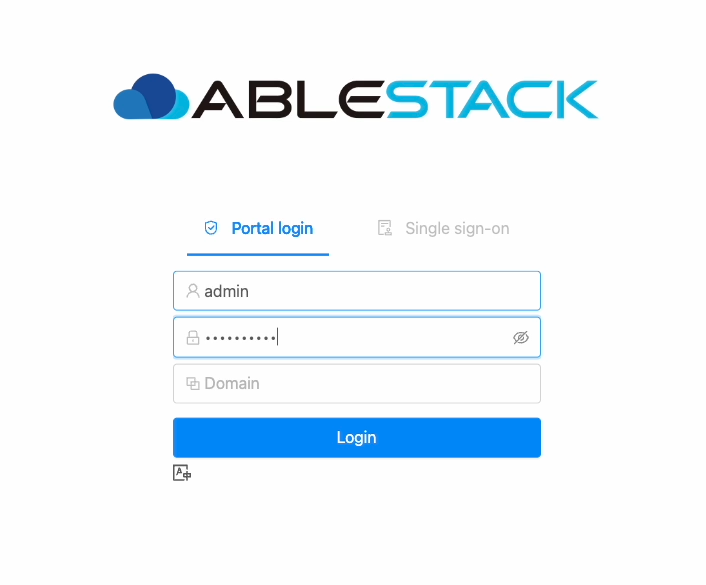{ align=center }
    - IP, Password를 입력하여 로그인합니다.

2. Mold 호스트 추가
    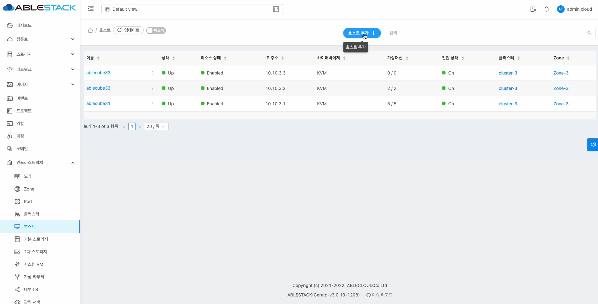{ align=center }
    - Mold 대시보드에 로그인하여, 인프라스트럭쳐 > 호스트 메뉴에서 **호스트 추가** 버튼을 클릭합니다.

    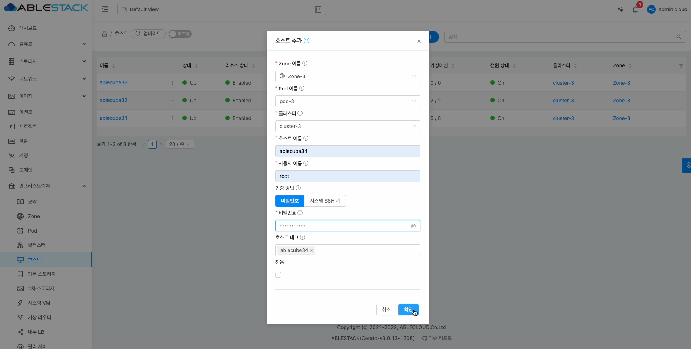{ align=center }

    - **Zone 이름** 을 입력합니다.
    - **Pod 이름** 을 입력합니다.
    - **클러스터** 를 입력합니다.
    - **호스트 이름** 을 입력합니다.
    - **사용자 이름** 을 입력합니다.
    - **비밀번호** 를 입력합니다.
    - **호스트 태그** 를 입력합니다.
    - 위 정보를 입력후 **확인** 버튼을 클릭하여 Mold에 컴퓨팅 호스트를 추가합니다.

3. Mold 호스트 추가 완료
    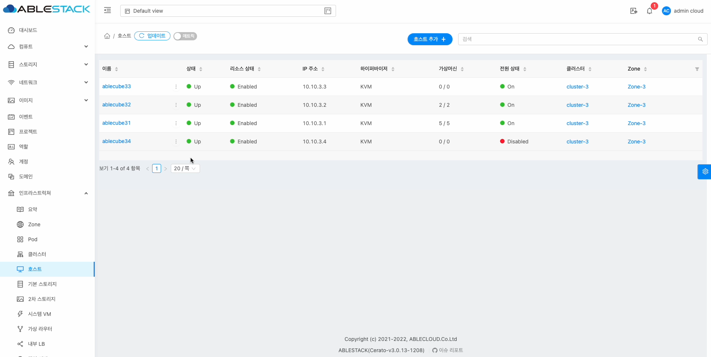{ align=center }
    - 호스트 목록에 추가된 호스트 정보를 확인할 수 있습니다.

## 모니터링 정보 업데이트

1. 모니터링 정보 업데이트
    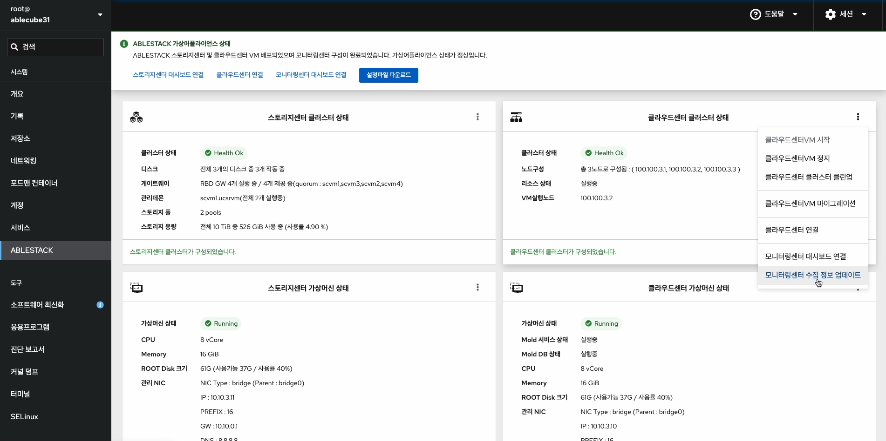{ align=center }
    - 1번 Cube 로 이동하여 로그인 합니다.
    - Cube에서 ABLESTCK > 클라우드센터 클러스터 상태 카드 메뉴의 **모니터링센터 수집 정보 업데이트** 를 클릭합니다.

2. 모니터링센터 수집 정보 업데이트
    { align=center }
    - **실행** 버튼을 클릭하여 모니터링 센터에 모든 호스트의 수집정보를 업데이트 합니다.

3. 모니터링센터 수집 정보 업데이트 완료
    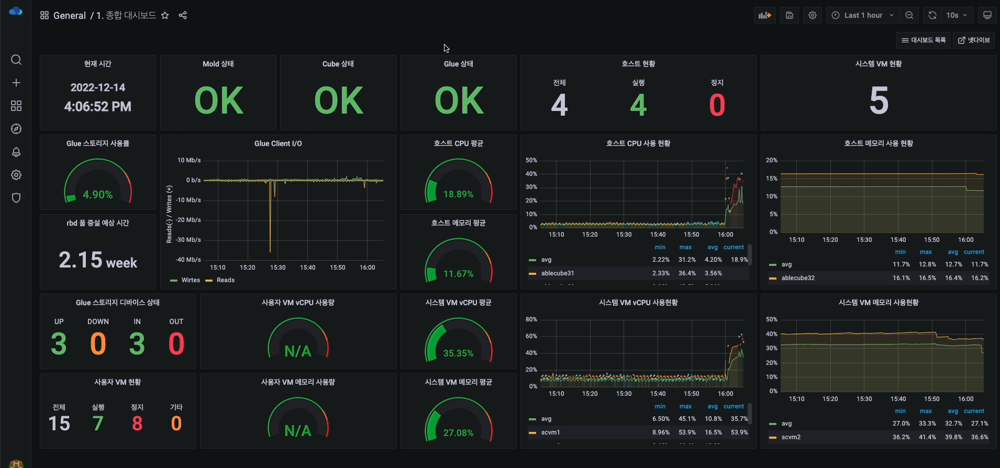{ align=center }
    - Wall 대시보드로 이동하여 로그인 합니다.
    - **1. 종합현황대시보드** 에서 호스트 현황에 호스트가 추가되었는지 확인합니다.

!!! info
    호스트 추가에 대한 작업이 마무리 되었습니다.

추가 호스트가 여러대인경우 해당 작업을 반복하십시오.
