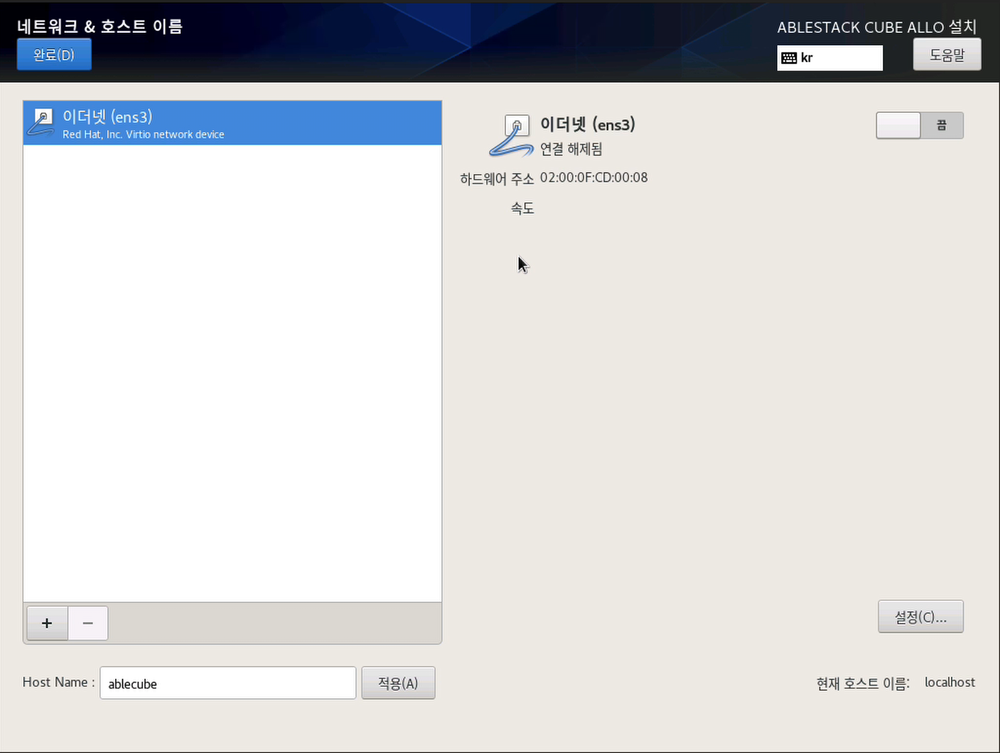
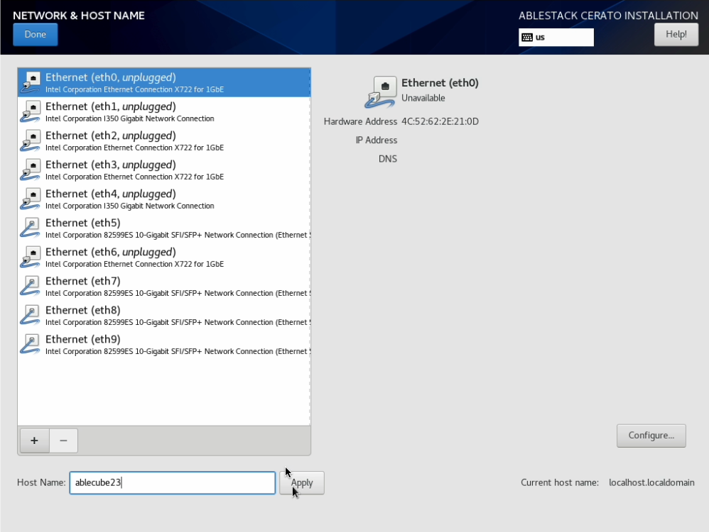
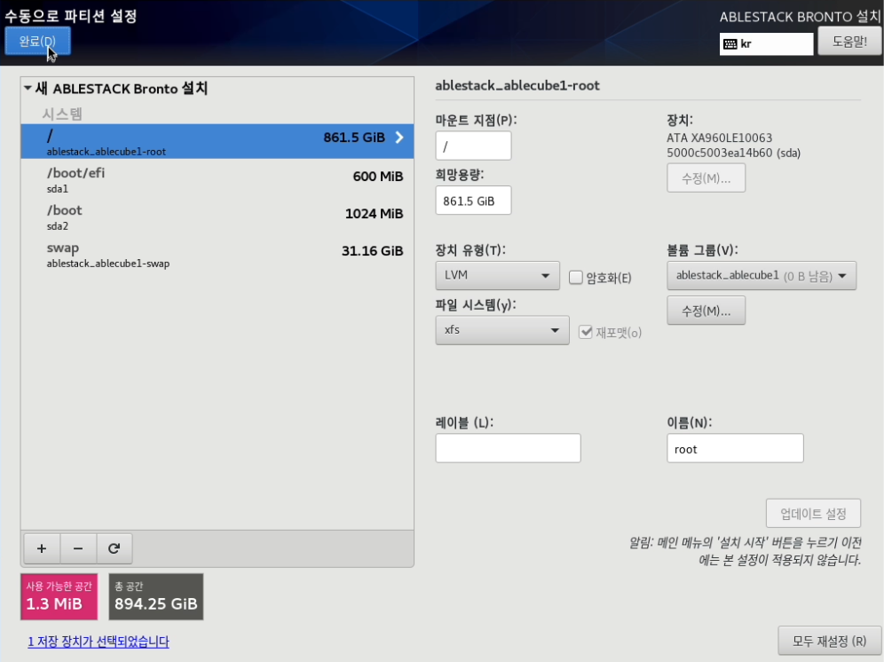
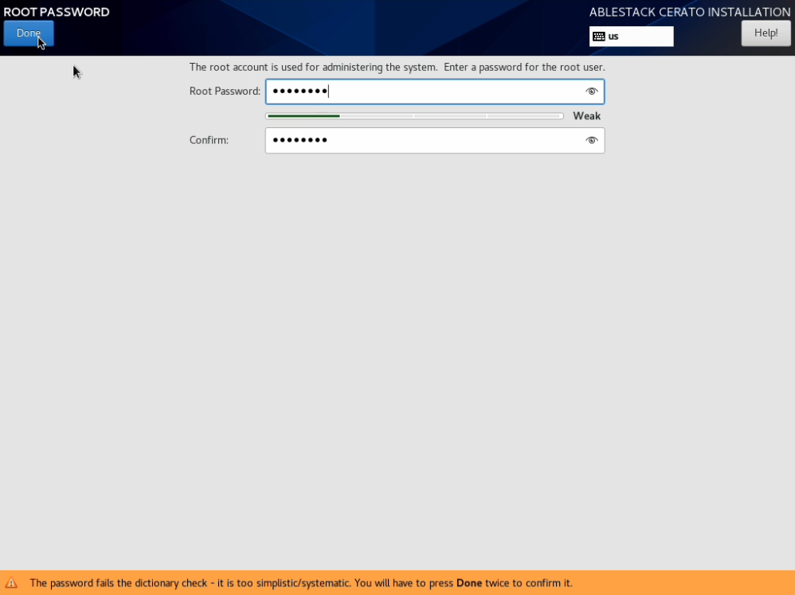
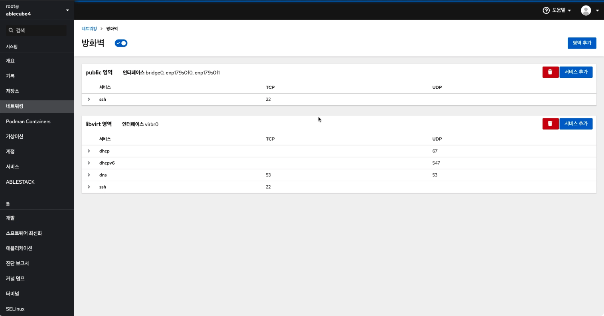

!!! danger
    이 문서는 기술지원 용도의 문서입니다. 기술지원 엔지니어가 아닌 사용자가 조작할 때 시스템에 문제가 발생할 수 있습니다.

# ABLESTACK Cube 설치진행
ABLESTACK Cube를 설치 진행 가이드 입니다.  
해당 가이드는 기본적으로 Linux 계열의 OS 설치 경험이 없어도 설치 할 수 있는 쉬운 사용자 경험을 제공 하나 기본적인 Linux 계열의 OS 이해도를 가지고 있으면 조금더 쉽게 설치가 가능합니다. 

!!! info
    - 해당 문서는 사용자의 네트워크 환경 및 설정 정보를 고려하지 않고 작성된 문서 입니다. 이 문서를 기준으로 활용을 하셔야 하며 수정 및 변경 할 부분은 **강조** 표시를 해두었습니다.
    - ABLESTACK Cube 설치시 ABLESTACK Cell이 동시에 설치가 진행되며, ABLESTACK Cell의 설치가이드는 따로 제공 되고 있지 않습니다.. 

!!! 사전준비내용 info
    - ABLESTACK 설치용 ISO 또는 ABLESTACK 설치용 USB  
    - 호스트의 Manage Network 대역에 접근 가능한 Desktop 또는 Notebook
    - Manage Network IP(ABLESTACK은 Manage Network IP를 호스트 1대당 3개의 IP를 필요로 하고 있습니다.)

!!! tip
    ABLESTACK 설치용 ISO파일을 노트북이나 데스크탑에 가지고 있는 상태에서 호스트의 IPMI Port에 통신이 가능하면 IPMI Console을 이용하여 3대의 호스트에 ABLESTACK Cube를 동시에 설치 가능합니다.

## ABLESTACK Cube 설치 진행 가이드

1. ABLESTACK ISO 또는 USB를 이용한 부팅 화면 입니다.
    { align=center }
   
2. 부팅 완료 후 ABLESTACK 설치 메뉴 화면 입니다.  
    정상적으로 ISO 또는 USB를 이용하여 정상적으로 부팅되면 아래와 같은 이미지의 화면으로 전환됩니다.
    { align=center }
   
    !!! Check
        화면에서 **Install ABLESTACK Allo (v1.0.0)** 메뉴가 보이는지 확인해야합니다. 해당 메뉴가 보이면 ABLESTACK Cube 정상적으로 설치를 하실 수 있습니다.
        만약에 해당 메뉴가 보이지 않는다면 정상적으로 부팅이 안된경우 이므로 다시한번 부팅을 진행하셔야 합니다.
        다시 한번 부팅해도 해당 메뉴가 보이지 않는다면 ISO의 손상을 의심하셔야 합니다.
   
3. ABLESTACK Cube 구성 화면 입니다.
    { align=center }  

    !!! info
        ABLESTACK Cube는 기본적인 정보는 자동으로 입력이 되여 있습니다. 수정이 불필요한 메뉴는 아래와 같습니다.  
        - Keyboard, 언어 지원, 시간 및 날짜, 설치 소스, 소프트웨어 선택, KDUMP, 보안 정책  
        추가적으로 변경 해야 할 부분은 아래와 같습니다.  
        - 설치 대상, 네트워크 및 호스트 이름, Root 암호
   
    !!! Tip
        설정정보 입력시 '네트워크 및 호스트 이름' > '설치 대상' > 'Root 암호' 순서대로 설정하시는것을 추천드립니다.  
        이유는 설치 대상의 파티션 구성시 호스트의 이름이 설정 정보에 입력이 되기 때문입니다.
   
4. 네트워크 및 호스트 이름 구성변경 화면
    { align=center }
    - ABLESTACK Cube 구성화면에서 **네트워크 및 호스트 이름** 을 클릭하면 해당 화면으로 이동됩니다.  
   
    !!! info    
        아래 설정은 순서는 상관없이 진행이 가능합니다.
    1. 호스트 이름 설정  
        { align=center }
        * Host name에 **ablecube1** 을 입력합니다.
        * 적용 버튼을 클릭하여 Host name을 적용합니다.
        * 적용된 Host name이 정상적으로 현재 호스트 이름에 표시 되는지 확인합니다.
    2. NIC enable  
        { align=center }
        * 이더넷 (ens3) **켬** 으로 변경 후 **설정** 버튼을 클릭하여 IP 설정 화면으로 들어갑니다.
    3. IP 셋팅 
        { align=center }
        * **ens3** 편집 화면에서 **IPv4** 설정탭으로 이동합니다.
        * **Method** 선택박스에서 **수동** 으로 변경합니다.
        * **Add** 버튼 클릭하여 주소에 **192.168.0.200** , 넷마스크에 **24** , 게이트웨이에 **192.168.0.1** 입력하고 DNS server에는 **8.8.8.8** 을 입력 후 **저장(S)**버튼을 클립합니다.  
        * 저장 후 **완료** 버튼을 클릭하여 네트워크 및 호스트 이름 구성을 완료 합니다.
    !!! note
          위 이미지 및 IP 정보는 예제 입니다.  
          해당 IP 셋팅은 ABLESTACK을 구성하는 사이트 환경에 맞춰서 IP를 변경해야 하며 사이트에서 사용하는 DNS server가 별도로 있을경우 해당 DNS server로 변경가능합니다.
          
5. 설치 대상 구성 화면
    { align=center }
    - ABLESTACK Cube 구성화면에서 **설치 대상** 을 클릭하면 해당 화면으로 이동됩니다.  
    
     

    1. 파티션 구성 화면 1-2
        { align=center }
        * **설치 대상** 화면에 **여기를 클릭하여 자동으로 생성합니다. (C)** 을 클릭하면 해당화면으로 이동됩니다.
        * 해당 화면은 파티션을 구성하는 화면입니다.  
    2. 파티션 구성 화면 2-2
        { align=center }
        * **/home** 파티션 선택 후 아래 **-** 버튼을 클릭하여 home 파티션을 삭제합니다.
        * **/(root파티션)** 파티션 선택 후 **희망 용량 (C):** 의 입력 값에 1023 KiB를 입력 후 **설정 업데이트 (U)** 버튼을 클릭하여 파티션 용량 재설정 합니다.
        * 파티션 구성 완료 후 **완료(D)** 버튼을 클릭하여 파티션 설정을 마무리 합니다.
    
    !!! Tip
        **/(root파티션)** 파티션의 **희망 용량** 입력시 하단 왼쪽에 나와있는 **사용 가능한 공간** 의 용량을 입력하면 필수 구성 파티션을 제외한 나머지 용량이 **/(root파티션)** 에 할당이 됩니다.

6. Root 암호 설정 화면
    { align=center }
    - ABLESTACK Cube 구성화면에서 **Root 암호** 를 클릭하면 해당 화면으로 이동됩니다.
    
    !!! caution
        root의 암호를 잊어버리게 되면 시스템에 로그인을 할 수가 없습니다. 해당 암호를 잊어버리면 별도의 절차를 이용하여 암호를 복구하셔야 합니다.  
        또한 해당 암호는 ABLESTACK Cube 웹콘솔에 로그인시 사용됩니다.

    - Root 암호 설정
        { align=center }
        - **Root 암호 (R):** 입력 창에 암호를 입력 하고 동일한 암호를 **확인 (C)** 입력 창에 입력합니다.
        - 암호를 입력하고 **완료(D)** 버튼을 눌러 Root 암호 설정을 마무리 합니다.
    
7. ABLESTACK Cube 구성 마무리
    { align=center }
    - ABLESTACK Cube 설정 완료 후 **설치 시작(B)** 버튼을 클릭하여 ABLESTACK 설치를 진행 합니다.
    - 설치가 완료가 되면 자동으로 재부팅 절차가 진행되며 연결되여 있는 ABLESTACK ISO 또는 USB를 제거 한 후에 ABLESTACK Cube설치를 마무리 합니다.
  
## ABLESTACK Cube Network 셋팅

1. ABLESTACK Cube 로그인
    { align=center }
    - ABLESTACK Cube 로그인 화면입니다. 사용자 이름은 **root** 를 암호는 ABLESTACK Cube 설치시 입력한 암호를 입력하고 **로그인** 버튼을 클릭하면 로그인 하실수 있습니다.
    
2. ABLESTACK Cube 메인 화면
    { align=center }
    - ABLESTACK Cube 로그인 후 화면입니다.
    
    !!! info
        이 문서는 설치와 관련된 정보만 작성되여 있습니다. 다른 메뉴의 정보는 다른 문서를 참조하시기 바랍니다.

3. ABLESTACK Cube 네트워킹 구성
    { align=center }
    - ABLESTACK Cube 네트워킹 구성 화면입니다. 해당 화면에서 방화벽 설정 및 본드(bond), 브릿지(bridge), VLAN 구성을 진행합니다.
    
    !!! info
        해당 문서의 네트워크 구성은 기본적인 네트워크 구성입니다. 이 문서를 바탕으로 설치 사이트에 맞게 구성을 변경 및 IP 주소를 입력 하셔야 합니다.
        그리고 본드(bond) 구성이 필요한 경우 본드(bond)구성 완료 후 진행하셔야 합니다.
   
    1. Management Network 브릿지 설정
        { align=center }
        - 네트워킹 화면에서 브릿지 추가 버튼을 클릭하면 보이는 화면이며, 브릿지를 설정하는 화면입니다.
        - 브릿지 이름을 **bridge0** 을 입력해주고, 포트는 **enp179s0f0** 를 선택하고 **적용** 버튼을 클릭합니다.
        
        !!! info
            브릿지의 IP 설정은 ABLESTACK Cube 구성하면서 입력된 IP 정보가 상속되여 자동으로 설정됩니다.
    
    2. Public Storage Network 설정
        { align=center }
        - Public Storage Network 설정하기 위한 절차 입니다. 네트워킹 화면에서 **enp179s0f1** NIC를 클릭하여 들어온 화면입니다.
    
         
   
        1. Public Storage Network IP 설정
            { align=center }
            - 네트워킹 > enp179s0f1 화면에서 IPv4 행의 **편집** 버튼을 눌러 들어온 IPv4 설정 화면입니다.
            - 주소 입력 창의 오른쪽에 있는 **자동(DHCP)** 선택 박스를 눌러 **수동** 으로 변경을 합니다.
            - **Adress** 입력창에 **100.100.10.1** 을 입력하고, **접두 길이 또는 넷마스크** 입력창에 **24**를 입력하고 **적용** 버튼을 클릭합니다.

        2. Public Storage Network MTU 설정
            { align=center }
            - 네트워킹 > enp179s0f1 화면에서 MTU 행의 **편집** 버튼을 눌러 들어온 MTU 설정 화면입니다.
            - 라디오 버튼을 **설정** 으로 선택하고 입력값을 **9000** 으로 입력 후에 **적용** 버튼을 클릭합니다.
    
        3. Public Storage 자동연결 및 활성화 설정
            { align=center }
            - **자동으로 연결** 체크박스 체크 및 NIC 활성화 라디오 버튼 활성화

    3. 방화벽 설정
        { align=center }
        - 방화벽을 설정하기 위한 절차 입니다. 네트워킹 화면에서 방화벽 세션에서 **규칙 및 영역 편집** 을 클릭하여 들어온 화면입니다.
    
         

        1. ABLESTACK 방화벽 설정
            { align=center }
            - 방화벽 설정 화면에서 **서비스 추가** 버튼을 클릭하여 들어온 화면 입니다.
            - 서비스 목록에서 **Ablestack** 체크를 선택하고 **서비스 추가** 버튼을 클릭하여 방화벽을 추가합니다.
    
!!! check
    ABLESTACK Cube 및 ABLESTACK Cell의 설치 및 구성이 끝났습니다.
    ABLESTACK Glue 및 ABLESTACK Mold는 ABLESTACK 메뉴에서 구성이 가능하며, 다음 설치 가이드를 보고 따라가시면 됩니다.