# 일반 가상화 GFS 디스크 관리
!!! danger
    이 문서는 기술지원 용도의 문서입니다. 기술지원 엔지니어가 아닌 사용자가 조작할 때 시스템에 문제가 발생할 수 있습니다.

일반 가상화 GFS 디스크 관리 가이드입니다.이 문서에서는 구축된 일반 가상화 환경에서 추가적인 GFS 디스크 생성, 삭제, 조회로 관리를 위한 절차를 가이드 하고 있습니다.
ABLESTACK Cube의 웹콘솔 및 Mold의 웹콘솔을 이용하여 진행이 되며, 웹 접속 IP는 별도의 표시를 하지 않고 진행됩니다. 기존에 구성된 IP 정보에 맞게 웹콘솔을 접속 하시면 됩니다.

## ABLESTACK Cube 메인 화면
{ .imgCenter .imgBorder }
- 왼쪽 ABLESTACK 메뉴 클릭시 보이는 화면입니다.

## 일반 가상화 GFS 디스크 관리

### GFS 디스크 추가
!!! info
    GFS 디스크를 추가하려면, 사용되는 디스크를 연결이 선행 되어야 합니다.

    wwn으로 해당 디스크를 찾아 선택하시면 됩니다.

1. ABLESTACK Cube 화면
    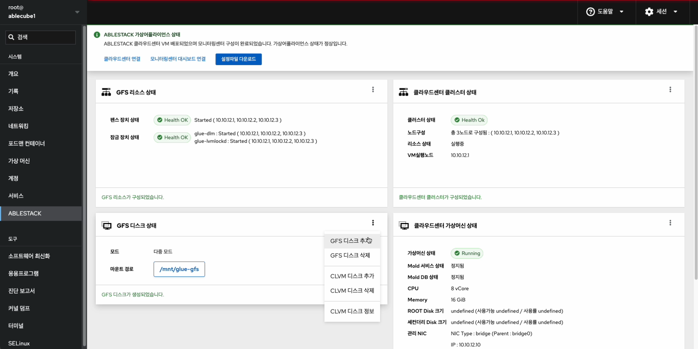{ .imgCenter .imgBorder }
    - GFS 디스크 상태란의 GFS 디스크 추가를 클릭합니다.
2. GFS 디스크 추가 화면
    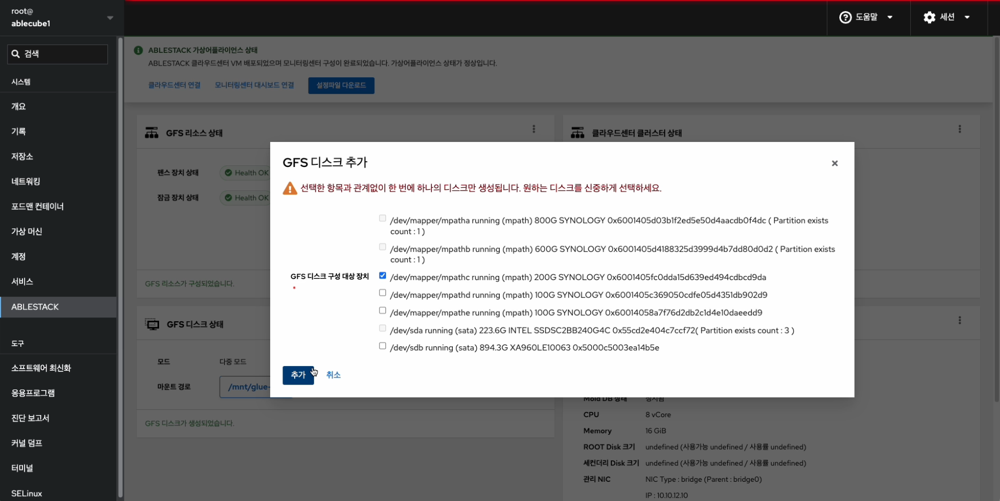{ .imgCenter .imgBorder }
    - 사용할 디스크를 선택합니다.
    !!! warning
        선택한 항목과 관계없이 한 번에 하나의 GFS 디스크만 생성됩니다. 여러 개를 선택하더라도 하나의 디스크만 만들어지니, 이 점을 확인하신 후 선택해 주세요.
    !!! tip
        디스크 이름, 디스크 상태, 디스크 종류, 용량, 디스크 정보, 디스크 wwn 으로 구분 되어 있습니다.

3. GFS 디스크 추가 진행 화면
    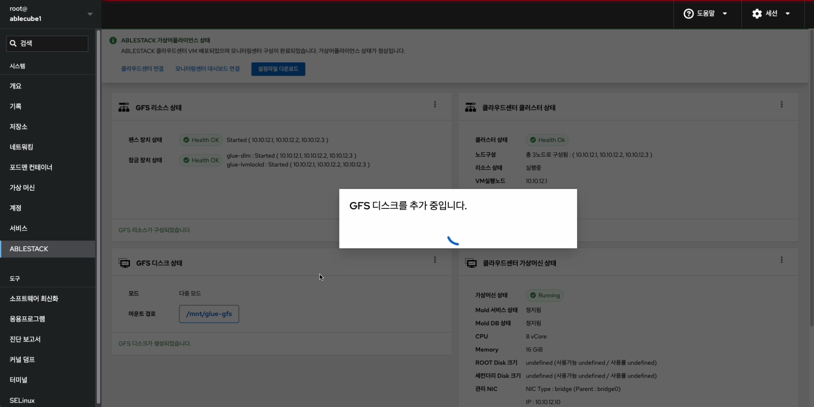{ .imgCenter .imgBorder }
    - 선택한 디스크를 GFS 디스크로 추가하는 과정입니다.
4. GFS 디스크 추가 완료 화면
    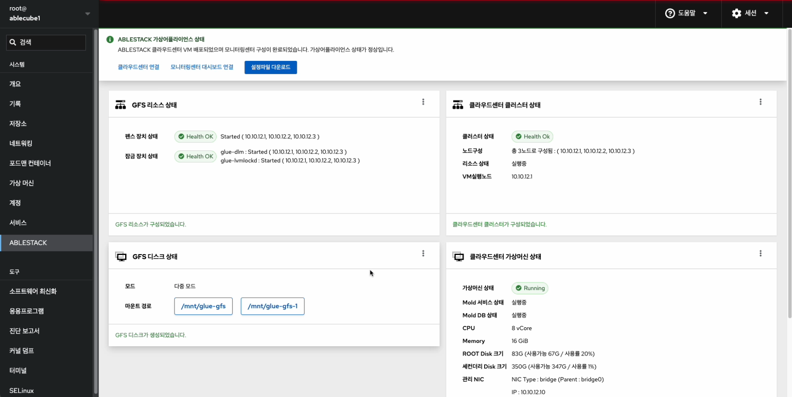{ .imgCenter .imgBorder }
    - 추가가 완료되면 Cube 메인 화면에서 GFS 디스크가 자동으로 이름이 지정되어 표시됩니다.

!!! info
    Mold에서 사용 하기 전 먼저 Cube에서 선행 되어야 할 작업을 완료했습니다. 다음 단계는 Mold에서 가상머신으로 붙이는 작업입니다.

5. Mold 기본 스토리지 화면
    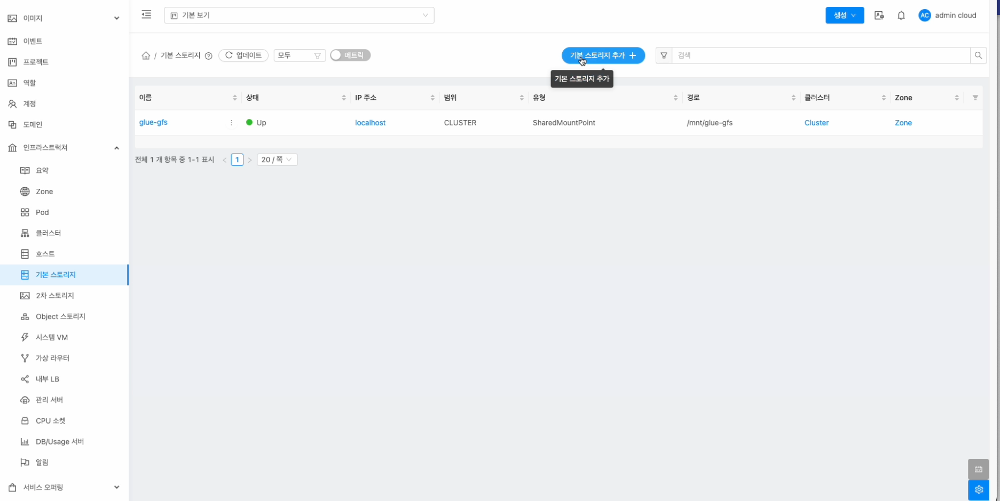{ .imgCenter .imgBorder }
    - ccvm_mngt_ip:8080 으로 접속하여 로그인 후, **인프라스트럭쳐** 에 **기본 스토리지** 를 클릭합니다.
    - 기본 스토리지 추가 버튼을 클릭합니다.
6. Mold 기본 스토리지 추가 진행 화면
    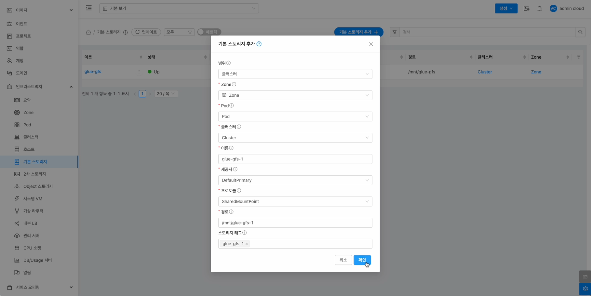{ .imgCenter .imgBorder }
    - **범위** 항목에는 **클러스터** 를 선택합니다.
    - **Zone** 항목에는 **Zone** 을 선택합니다.
    - **Pod** 항목에는 **Pod** 를 선택합니다.
    - **클러스터** 항목에는 **Cluster** 를 선택합니다.
    - **이름** 항목에는 Cube에서 선행 작업된 마운트 경로인 **glue-gfs-1** 를 입력합니다.
    - **제공자** 항목에는 **DefaultPrimary** 를 선택합니다.
    - **프로토콜** 항목에는 **SharedMountPoint** 를 선택합니다.
    - **경로** 항목에는 Cube에서 선행 작업된 마운트 경로인 **/mnt/glue-gfs-1** 를 입력합니다.
    - **스토리지 태그** 항목에는 이름 항목과 동일하게 **glue-gfs-1** 를 입력하여 선택합니다.
7. Mold 기본 스토리지 추가 완료 화면
    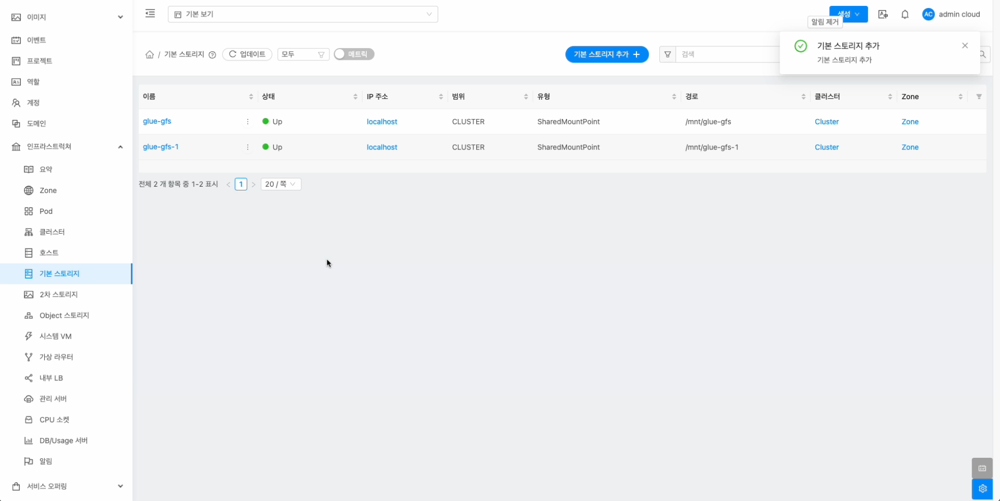{ .imgCenter .imgBorder }
    - 추가 완료가 되면, 해당 하는 마운트 경로의 컬럼이 생겨나며, 상태가 **UP** 으로 나타납니다.

8. Mold 디스크 오퍼링 화면
    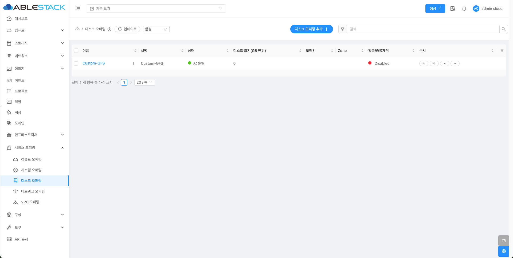{ .imgCenter .imgBorder }
    - **서비스 오퍼링** 에서 **디스크 오퍼링** 을 클릭한 화면입니다.

9. Mold 디스크 오퍼링 추가 진행 화면
    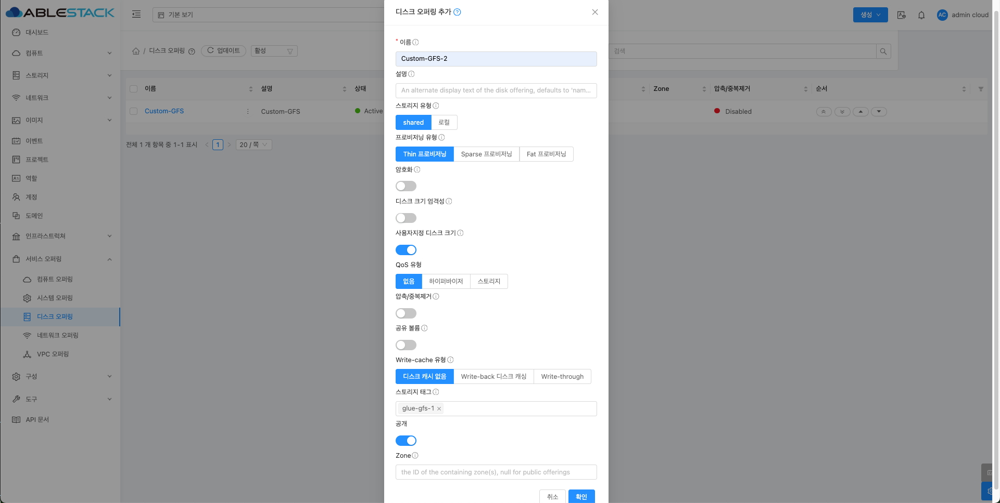{ .imgCenter .imgBorder }
    - **디스크 오퍼링 추가** 버튼을 클릭합니다.
    - **이름** 을 입력합니다.
    - **스토리지 유형** 은 **shared** 로 클릭합니다.
    - **프로비저닝 유형** 은 **Thin 프로비저닝** 을 클릭합니다.
    - **사용자지정 디스크 크기** 버튼을 활성화 합니다.
    - **Qos 유형** 에서 **없음** 을 클릭합니다.
    - **Write-cache 유형** 은 **디스크 캐시 없음** 을 클릭합니다.
    - **스토리지 태그** 는 **glue-gfs-1** 으로 기본 스토리지에서 추가된 스토리지 태그를 선택합니다.

10. Mold 디스크 오퍼링 추가 완료 화면
    { .imgCenter .imgBorder }
    - 사용 할 수 있는 디스크 오퍼링이 추가 완료된 화면입니다.

11. Mold 컴퓨터 오퍼링 화면
    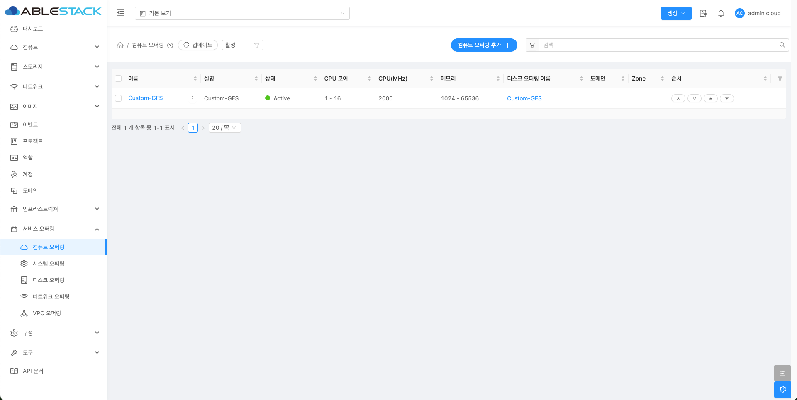{ .imgCenter .imgBorder }
    - **서비스 오퍼링** 에서 **컴퓨트 오퍼링** 을 클릭한 화면입니다.

12. Mold 컴퓨터 오퍼링 추가 진행 화면
    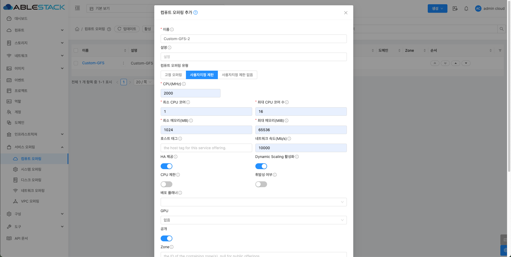{ .imgCenter .imgBorder }
    - **컴퓨트 오퍼링 추가** 버튼을 클릭한 화면입니다.
    - **이름** 을 입력합니다.
    - **컴퓨트 오퍼링 유형** 에서 **사용자 지정 제한** 을 선택합니다.
    - **CPU(MHz)** 를 **2000** 으로 입력합니다.
    - **최소 CPU 코어, 최대 CPU 코어 수** 를 입력합니다.
    - **최소 메모리(MB), 최대 메모리(MiB)** 를 입력합니다.
    - **네트워크 속도(Mb/s)** 를 입력합니다.
    - **HA 제공, Dynamic Scaling 활성화** 버튼을 활성화합니다.
    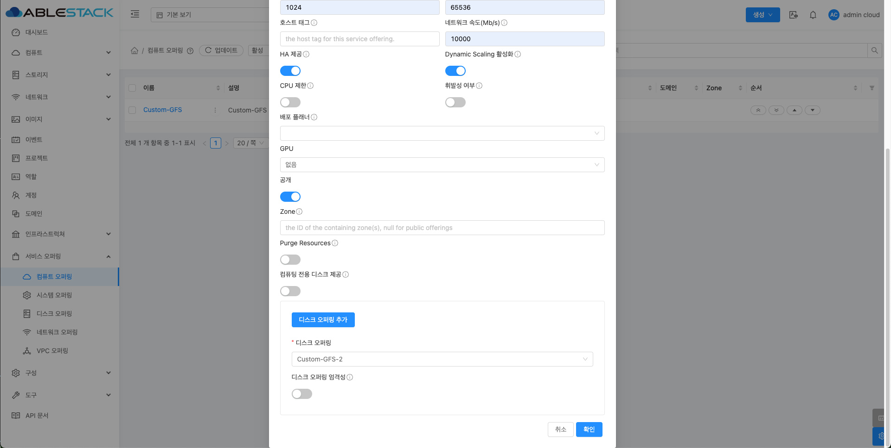{ .imgCenter .imgBorder }
    - **컴퓨팅 전용 디스크 제공** 버튼을 비활성화합니다.
    - 해당 하는 **디스크 오퍼링** 을 선택합니다.
    - 정보를 확인한 후, **확인** 버튼으로 추가를 진행합니다.

13. Mold 컴퓨터 오퍼링 추가 완료 화면
    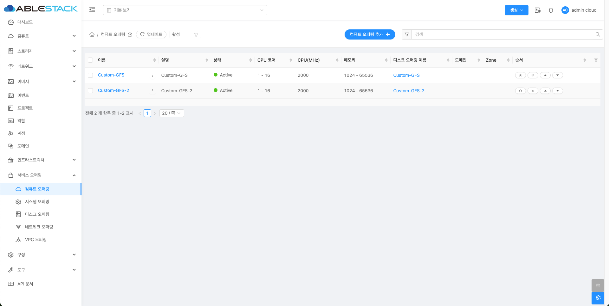{ .imgCenter .imgBorder }
    - 사용 할 수 있는 컴퓨터 오퍼링이 추가 완료된 화면입니다.

### GFS 디스크 삭제
!!! check
    GFS 디스크를 삭제하려면, Mold에서 사용중인 기본 스토리지, 컴퓨트 오퍼링, 디스크 오퍼링을 먼저 삭제가 선행되어야 합니다.

!!! warning
    Mold에서 사용중인 기본 스토리지, 컴퓨트 오퍼링, 디스크 오퍼링을 삭제하기 전, 해당 장치들을 사용중인 가상머신의 데이터를 백업 및 복구를 선행 한 후, 삭제하시길 바랍니다.

1. Mold 디스크 오퍼링 화면
    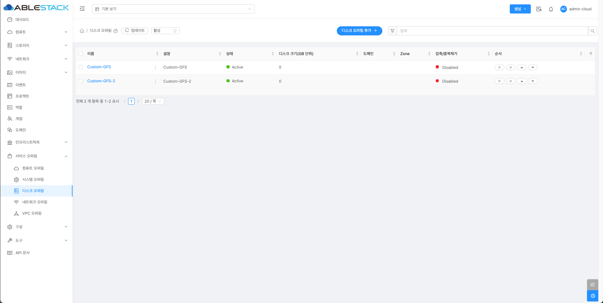{ .imgCenter .imgBorder }
    - **서비스 오퍼링** 에서 **디스크 오퍼링** 을 클릭한 화면입니다.

2. Mold 디스크 오퍼링 삭제 진행 화면
    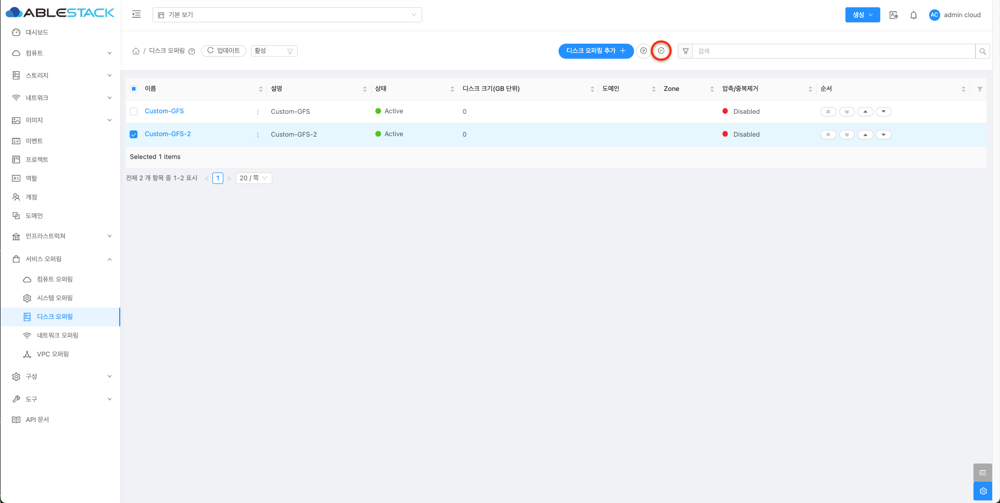{ .imgCenter .imgBorder }
    - 해당 하는 디스크 오퍼링을 선택한 후, 빨간색 칸의 **디스크 오퍼링 비활성화** 버튼을 클릭합니다.
    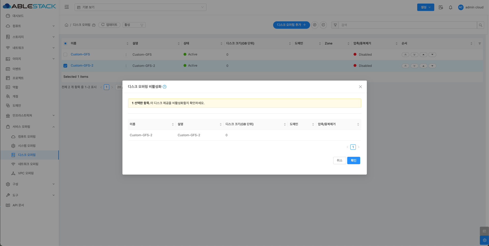{ .imgCenter .imgBorder }
    - 비활성화할 디스크 오퍼링을 재확인 후, **확인** 버튼을 클릭합니다.

3. Mold 디스크 오퍼링 삭제 완료 화면
    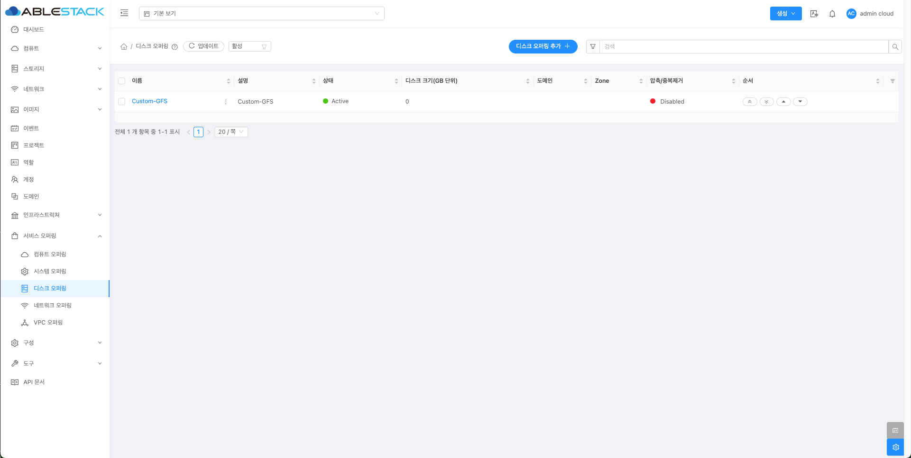{ .imgCenter .imgBorder }
    - 해당 디스크 오퍼링을 삭제한 화면입니다.

4. Mold 컴퓨트 오퍼링 화면
    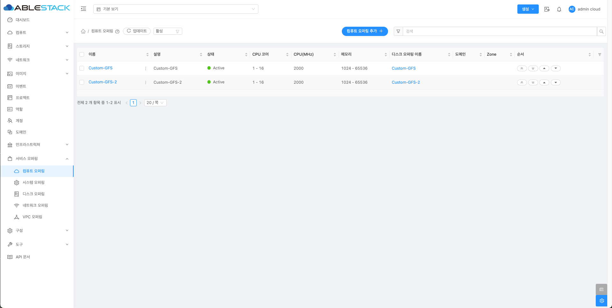{ .imgCenter .imgBorder }
    - **서비스 오퍼링** 에서 **컴퓨트 오퍼링** 을 클릭한 화면입니다.

5. Mold 컴퓨트 오퍼링 삭제 진행 화면
    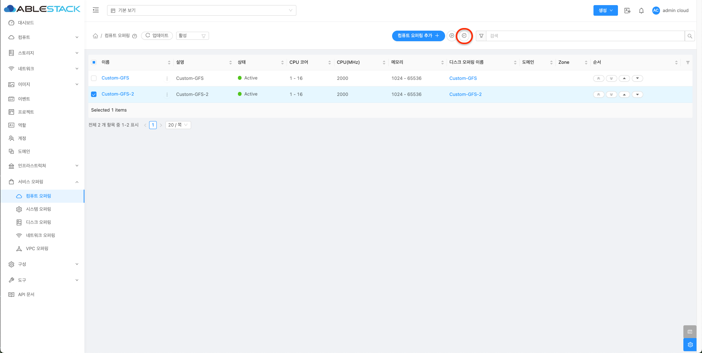{ .imgCenter .imgBorder }
    - 해당 하는 컴퓨트 오퍼링을 선택한 후, 빨간색 칸의 **컴퓨트 오퍼링 비활성화** 버튼을 클릭합니다.
    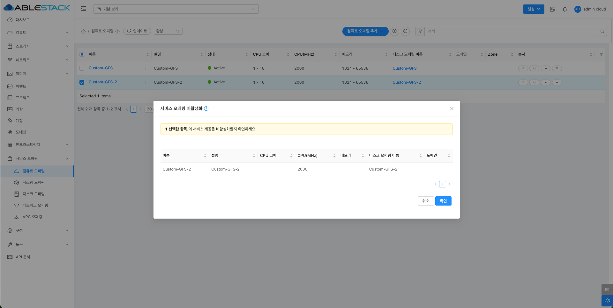{ .imgCenter .imgBorder }
    - 비활성화할 컴퓨트 오퍼링을 재확인 후, **확인** 버튼을 클릭합니다.

6. Mold 컴퓨트 오퍼링 삭제 완료 화면
    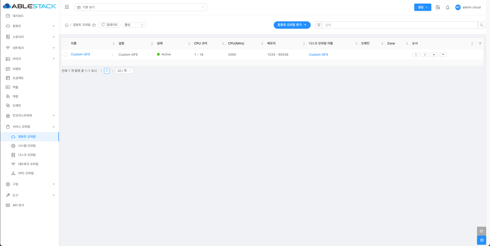{ .imgCenter .imgBorder }
    - 해당 컴퓨트 오퍼링을 삭제한 화면입니다.

7. Mold 기본 스토리지 화면
    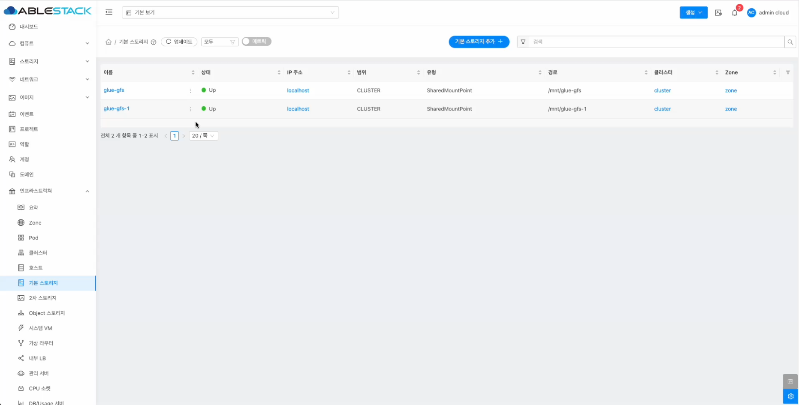{ .imgCenter .imgBorder }
    - **인프라스트럭쳐** 에서 **기본 스토리지** 를 클릭한 화면입니다.

8. Mold 기본 스토리지 삭제 진행 화면
    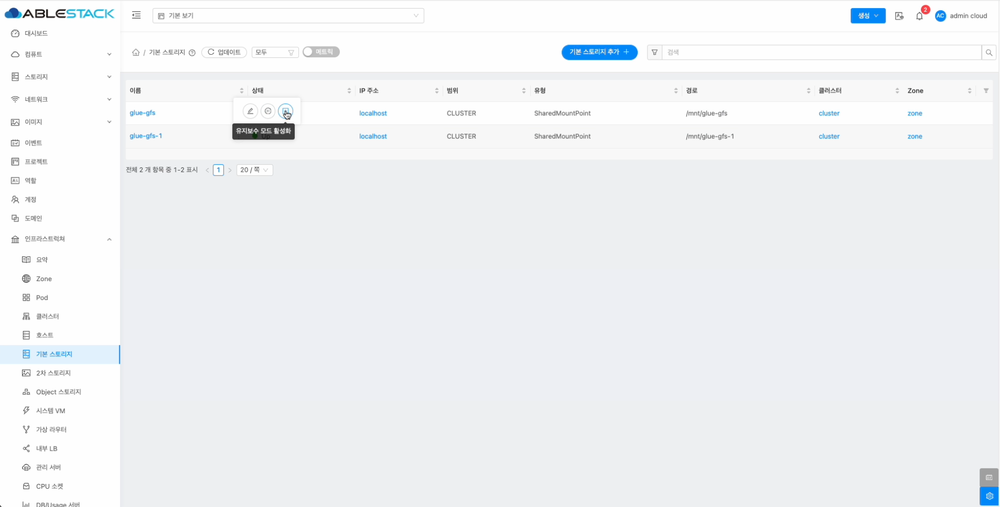{ .imgCenter .imgBorder }
    - 해당 하는 기본 스토리지의 옵션을 선택한 후, **유지보수 모드 활성화** 를 클릭합니다.
    { .imgCenter .imgBorder }
    - **확인** 을 클릭합니다.
    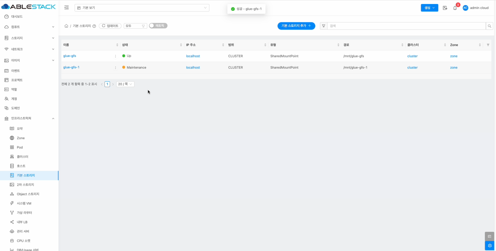{ .imgCenter .imgBorder }
    - 해당 하는 기본 스토리지의 상태가 **Maintenance** 인 걸 확인합니다.
    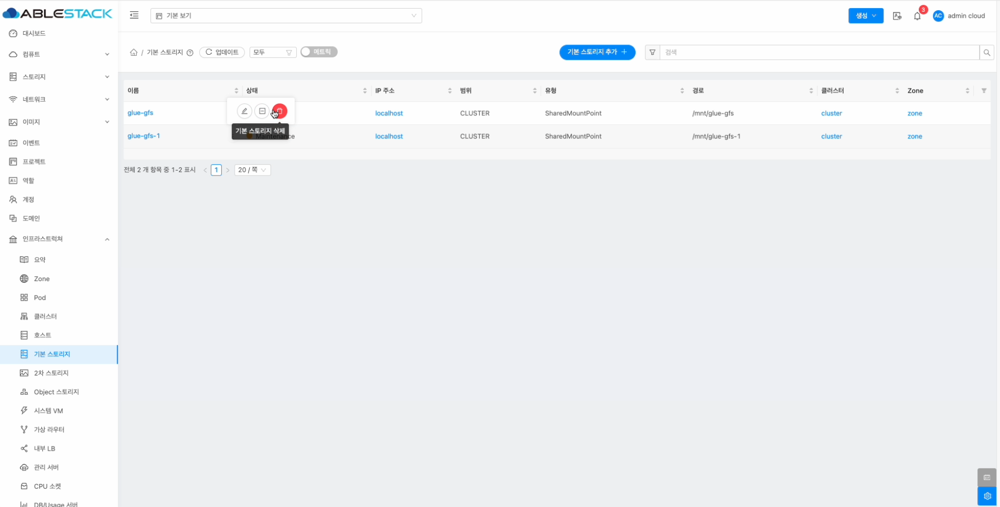{ .imgCenter .imgBorder }
    - 해당 하는 기본 스토리지의 옵션을 선택한 후, **기본 스토리지 삭제** 를 클릭합니다.
    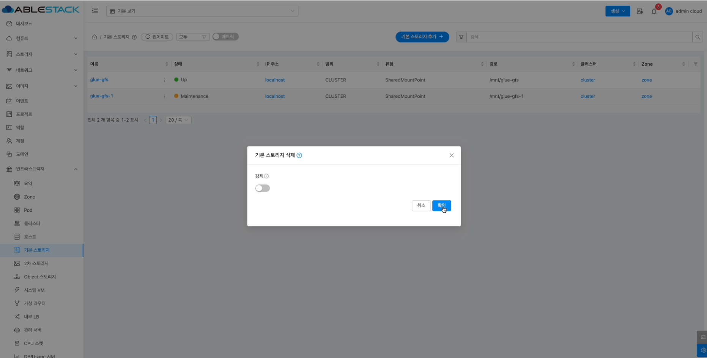{ .imgCenter .imgBorder }
    - **확인** 을 클릭합니다.

9. Mold 기본 스토리지 삭제 완료 화면
    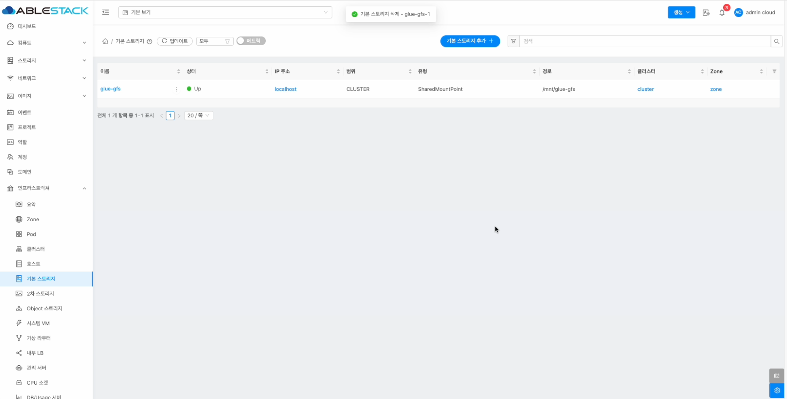{ .imgCenter .imgBorder }
    - 해당 기본 스토리지를 삭제한 화면입니다.

10. ABLESTACK Cube 화면
    { .imgCenter .imgBorder }
    - GFS 디스크 상태란의 GFS 디스크 삭제 클릭합니다.

11. GFS 디스크 삭제 화면
    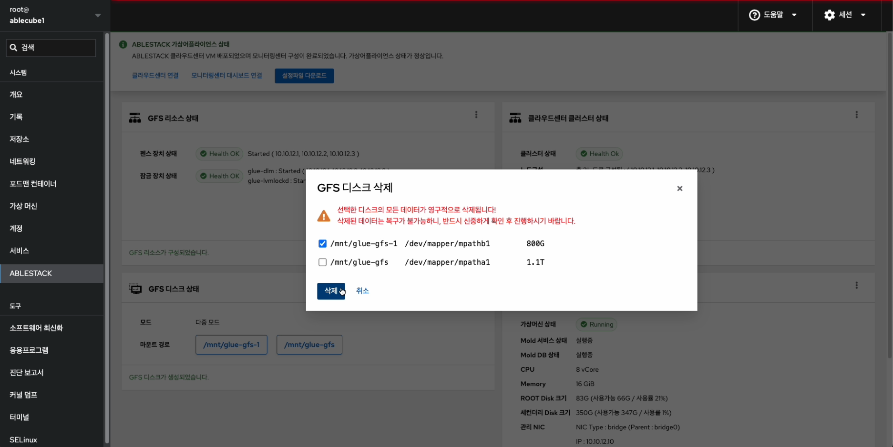{ .imgCenter .imgBorder }
    - 사용할 디스크를 선택합니다.
    !!! warning
        선택한 디스크의 모든 데이터가 영구적으로 삭제됩니다. 삭제된 데이터는 복구가 불가능하니, 반드시 신중하게 확인 후 진행하시기 바랍니다.

12. GFS 디스크 삭제 진행 화면
    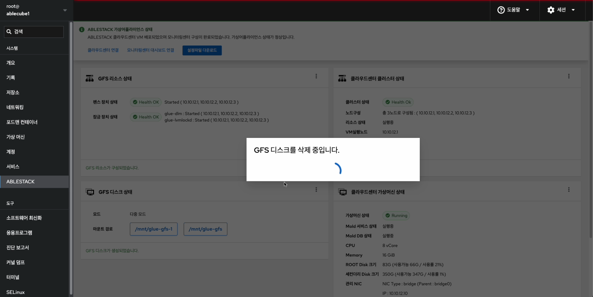{ .imgCenter .imgBorder }
    - 선택한 GFS 디스크를 삭제하는 과정입니다.

13. GFS 디스크 삭제 완료 화면
    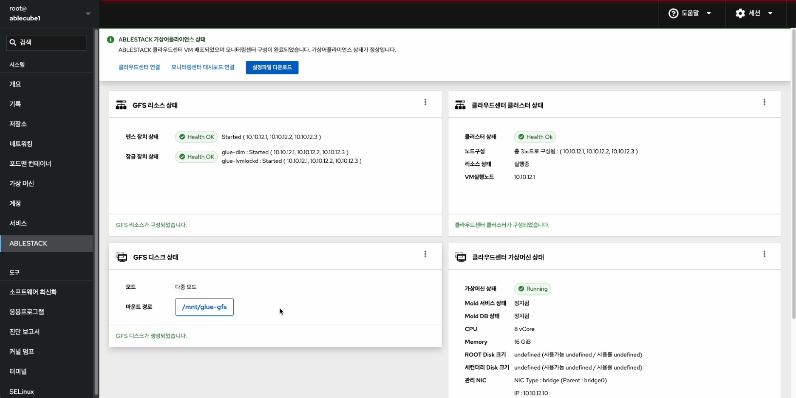{ .imgCenter .imgBorder }
    - 삭제가 완료되면 Cube 메인 화면에서 GFS 디스크 상태의 마운트 경로에서 자동으로 삭제됩니다.

### GFS 디스크 확장
1. ABLESTACK Cube 화면
    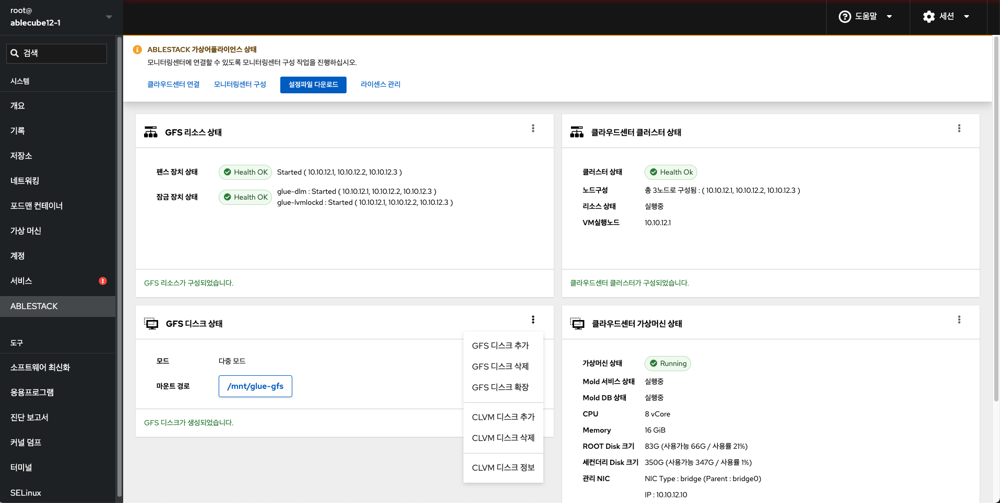{ .imgCenter .imgBorder }
    - ABLESTACK Cube 화면 입니다.
2. GFS 디스크 확장 화면
    1. 확장할 GFS 디스크 및 마운트 이름 선택
        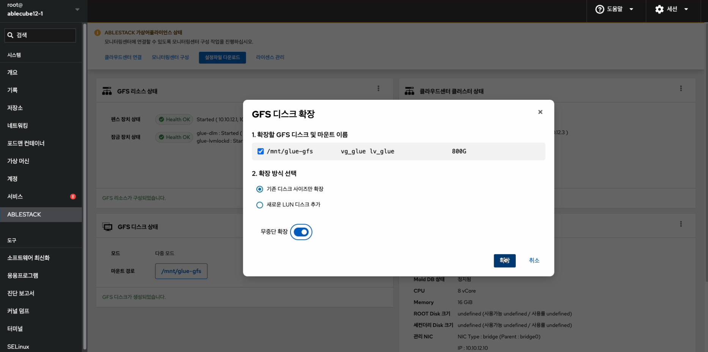{ .imgCenter .imgBorder }
        - 확장할 GFS 디스크 및 마운트 이름을 선택합니다.

        !!! check
            스토리지 측에서 디스크 사이즈를 변경하셨다면, 해당 변경 사항이 실제로 반영되었는지 스토리지 시스템에서 기존 디스크 크기와 변경된 크기를 다시 한 번 확인해 주시기 바랍니다.

            또한, 새로운 디스크를 추가하는 경우에는 디스크 이름 및 wwn명이 정확한지 다시 한 번 확인해 주시기 바랍니다.

    2. 확장 방식 선택
        1. 기존 디스크 사이즈만 확장
            { .imgCenter .imgBorder }
            - 해당 디스크의 사이즈만 확장할 경우, **기존 디스크 사이즈만 확장** 을 선택합니다.
        2. 새로운 LUN 디스크 추가
            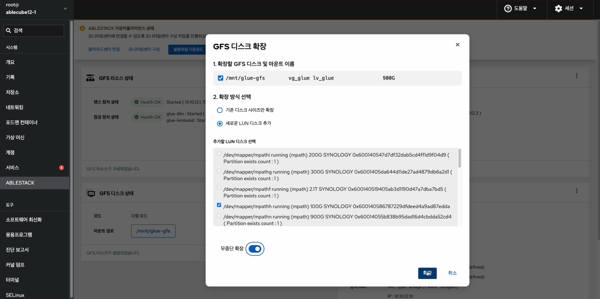{ .imgCenter .imgBorder }
            - 새로운 디스크를 추가할 경우, **새로운 LUN 디스크 추가** 를 선택합니다.
            - 추가된 디스크를 선택합니다.

    3. 무중단 확장
        { .imgCenter .imgBorder }

        !!! info
            무중단 확장을 진행하는 동안, 클러스터는 자원 상태를 감시하거나 자동으로 조치하지 않습니다.

            서비스는 정상적으로 유지되며 중단되지 않지만, 이 기간 동안 자원 장애 발생 시 자동 복구나 페일오버가 동작하지 않으므로 주의가 필요합니다.

3. GFS 디스크 확장 진행 화면
    1. GFS 디스크 스캔
        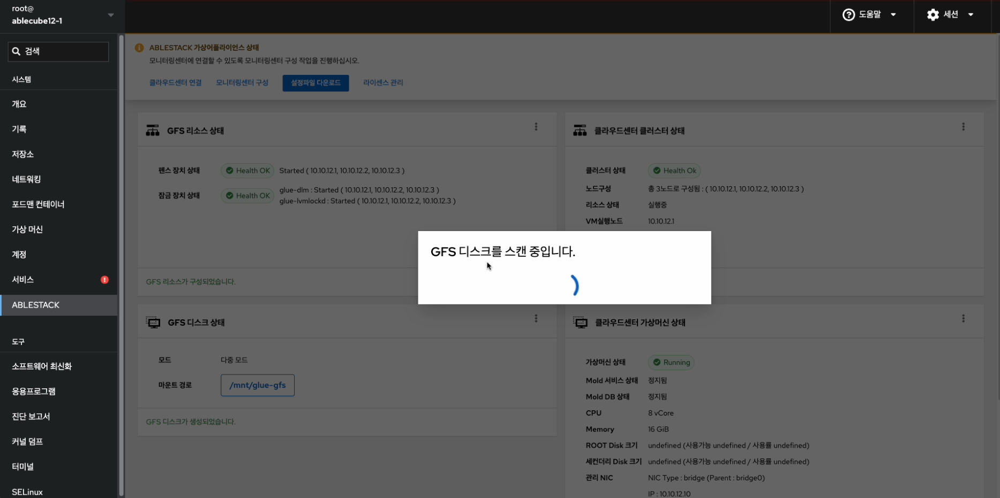{ .imgCenter .imgBorder }
        - 변경된 GFS 디스크를 OS 영역에서 스캔합니다.
    2. GFS 디스크 논리 볼륨 확장
        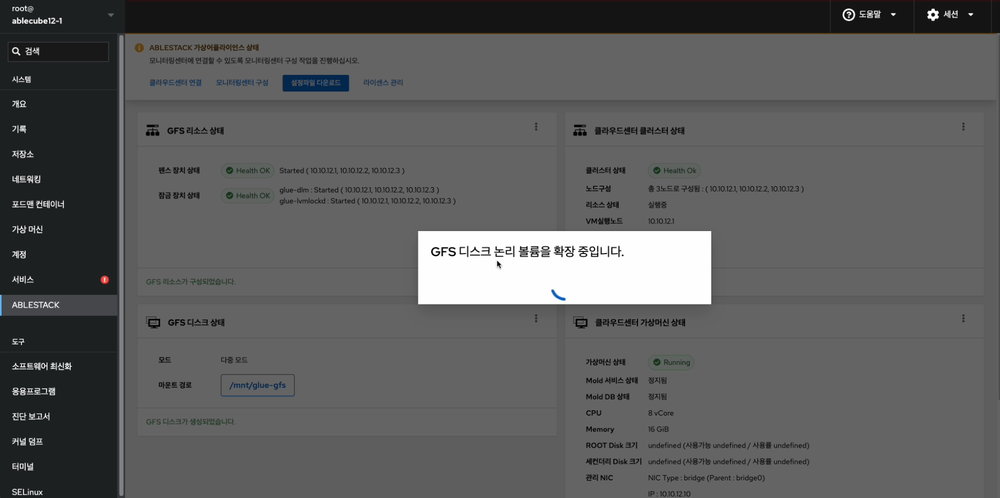{ .imgCenter .imgBorder }
        - GFS 디스크를 확장합니다.

    !!! info
        확장하려는 GFS 디스크의 크기에 따라 작업 시간이 달라질 수 있습니다.

        디스크 용량이 클수록 확장 완료까지 더 많은 시간이 소요될 수 있습니다.

4. GFS 디스크 확장 완료 화면
    1. Cube 대시보드 화면
        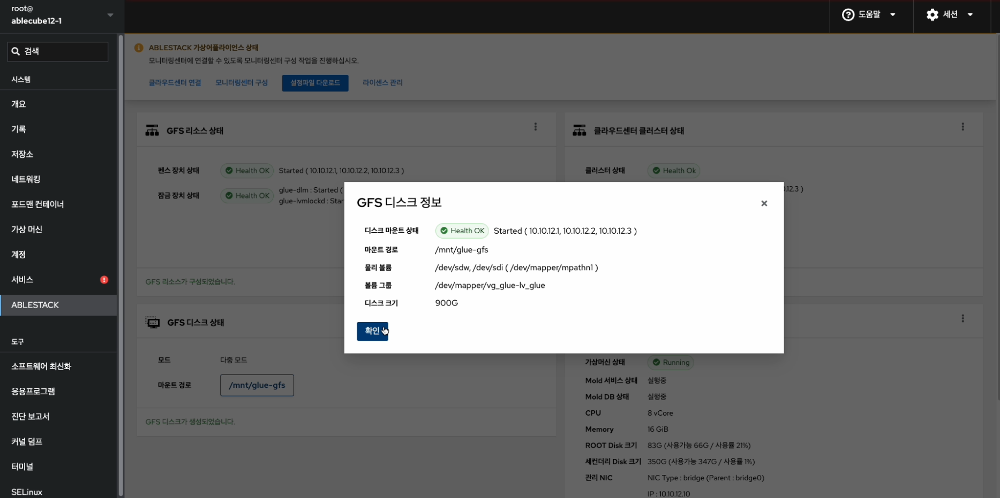{ .imgCenter .imgBorder }
        - 확장이 완료된 GFS 디스크를 Cube 대시보드 화면에서 확인하실 수 있습니다.
    2. Mold 기본 스토리지 화면
        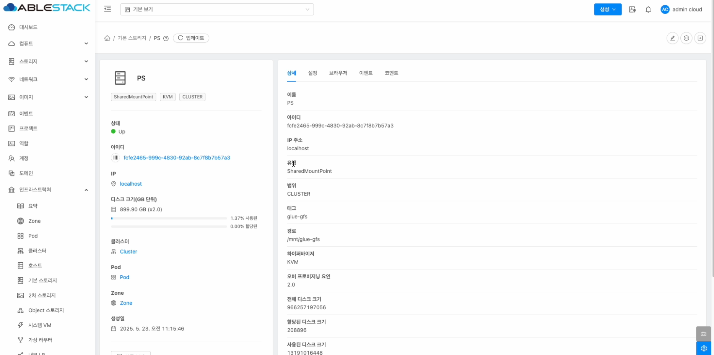{ .imgCenter .imgBorder }
        - 확장이 완료된 GFS 디스크를 Mold 기본 스토리지 화면에서 확인하실 수 있습니다.

### GFS 디스크 조회
1. ABLESTACK Cube 화면
    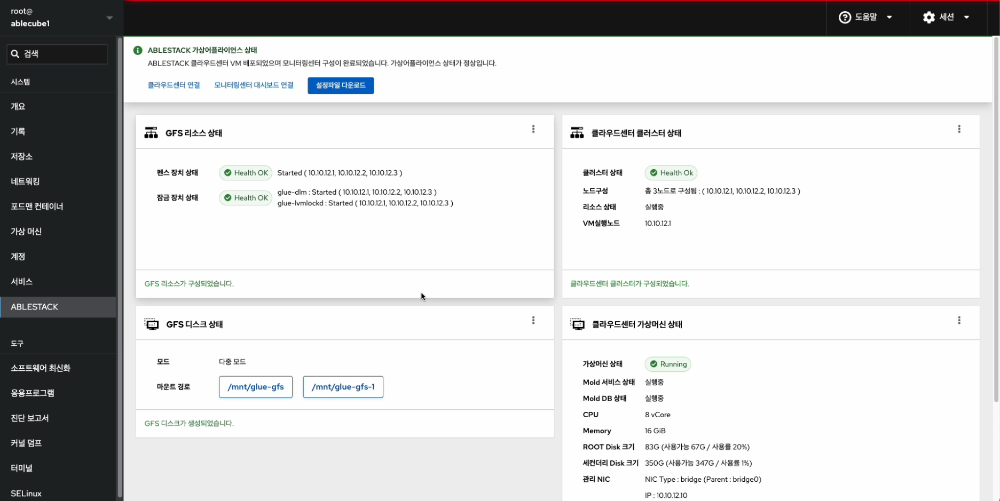{ .imgCenter .imgBorder }
    - ABLESTACK Cube 화면 입니다.
2. GFS 디스크 조회 화면
    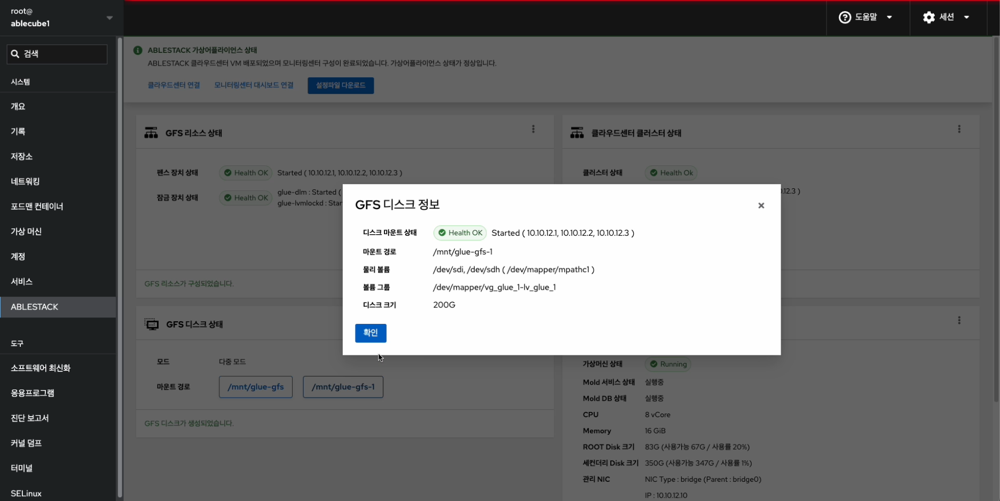{ .imgCenter .imgBorder }
    - GFS 디스크 상태 카드에서 확인할 디스크의 마운트 경로를 선택하여 클릭합니다.
    - 디스크 마운트 상태, 마운트 경로, 물리 볼륨, 볼륨 그룹, 디스크 크기 정보를 확인하실 수 있습니다.
