# ABLESTACK VM 호스트 추가 작업진행

!!! danger
    이 문서는 기술지원 용도의 문서입니다. 기술지원 엔지니어가 아닌 사용자가 조작할 때 시스템에 문제가 발생할 수 있습니다.
    해당 설치과정에 사용되는 IP 및 입력 정보는 예시이며, 현장에 맞게 수정하시기 바랍니다.

ABLESTACK VM 호스트 추가 설치 진행 가이드 입니다.
이 문서에서는 기구축된 ABLESTACK 환경에 추가적으로 ABLESTACK 호스트를 추가하기 위한 절차를 가이드 하고 있습니다.
ABLESTACK Cube 의 웹콘솔, ABLESTACK Mold 웹콘솔을 이용하여 진행이 되며 웹 접속 IP는 별도의 표시를 하지 않고 진행됩니다.
기존에 구성된 IP 정보에 맞게 웹콘솔을 접속 하시면 됩니다.

## ABLESTACK Cube 메인 화면
1. ABLESTACK 메인 화면
    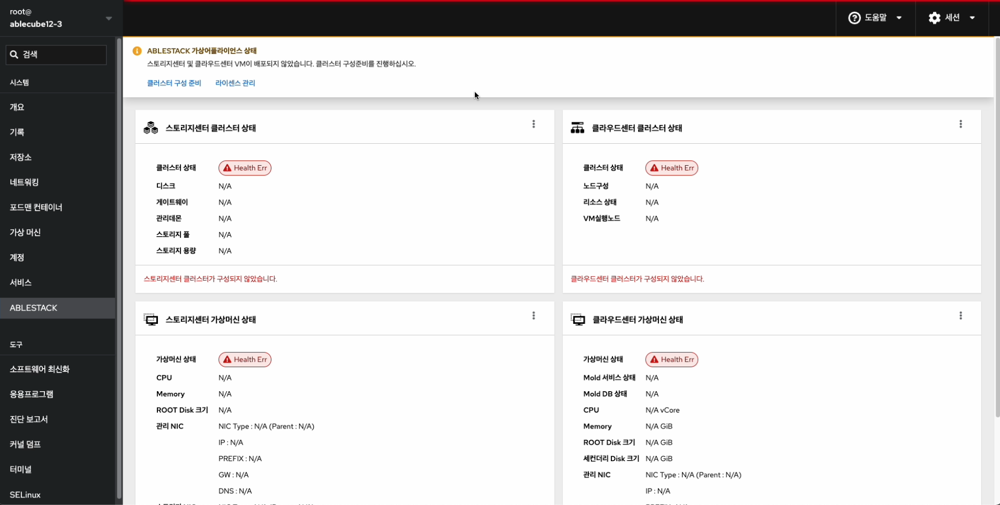{ .imgCenter .imgBorder }
    - 왼쪽 ABLESTACK 메뉴 클릭시 보이는 화면입니다.

!!! note
    ABLESTACK Cube 호스트 추가는 기 구축된 클러스터 정보를 이용하여 추가 구축합니다.

    여러 대를 추가 시 해당 작업을 반복하십시오.

    ABLESTACK Cube 호스트 추가 작업은 반드시 모든 구성요소(Cube 호스트, GFS 리소스 및 디스크 상태, 클라우드센터 가상머신)가 정상(Running) 동작 상태에서만 진행하십시오.

## 네트워크 설정
1. 네트워크 설정
    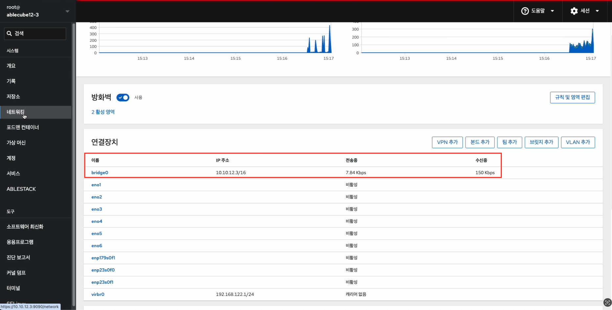{ .imgCenter .imgBorder }
    - Management 대역으로 사용할 NIC는 브릿지(bridge) 형태로 생성합니다.

!!! check
    본드(bond) 구성이 필요할 경우에는 먼저 본드(bond) 구성을 완료한 뒤, 해당 본드를 기반으로 브릿지(bridge)를 생성해야 합니다.

## 외부 스토리지 확인
1. 외부 스토리지 확인
    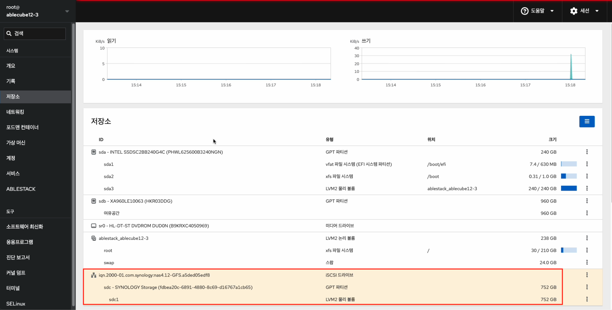{ .imgCenter .imgBorder }
    - 기존 GFS(공유 파일 시스템)으로 사용 중인 스토리지(iSCSI 드라이브, Fibre channel 등 외부 스토리지)가 추가되는 호스트에도 정상적으로 설정되어 있는지 확인합니다.

!!! check
    스토리지를 추가했는데도 목록에 보이지 않으면, 해당 호스트는 아직 클러스터링이 완료되지 않은 상태이므로 호스트를 재부팅합니다.

## 라이선스 등록
1. 라이선스 등록
    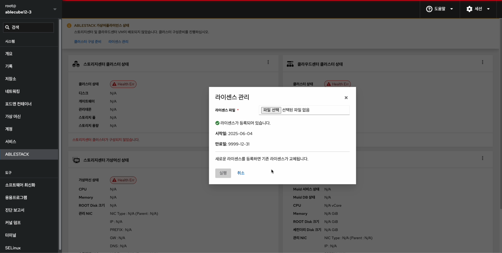{ .imgCenter .imgBorder }
    - 추가되는 호스트에 발급받은 라이선스를 등록합니다.

## 클러스터 설정파일 다운로드
1. 설정파일 다운로드
    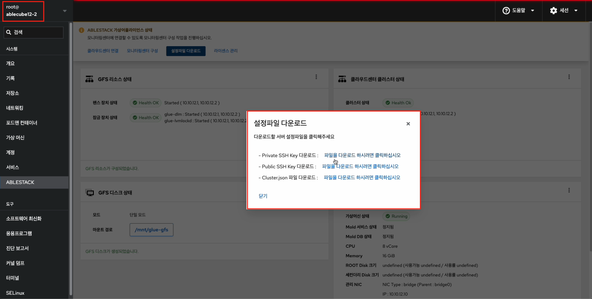{ .imgCenter .imgBorder }
    - 새로 추가하는 호스트가 아니라, 이미 클러스터링이 완료된 기존 호스트의 ABLESTACK 메뉴에서 **설정파일 다운로드** 를 실행하여 설정 파일을 다운로드합니다.
    - 상단 리본의 **설정파일 다운로드** 버튼을 클릭하면 보이는 화면입니다.
    - **Private SSH Key 다운로드** 버튼을 클릭하여 **id_rsa** 파일을 다운로드합니다.
    - **Public SSH Key 다운로드** 버튼을 클릭하여 **id_rsa.pub** 파일을 다운로드합니다.
    - **Cluster.json 다운로드** 버튼을 클릭하여 **cluster.json** 파일을 다운로드합니다.
    - 다운로드한 id_rsa, id_rsa.pub, cluster.json을 이용하여 클러스터 구성 준비를 진행합니다.

## 클러스터 구성 준비(추가 호스트)

1. 개요
    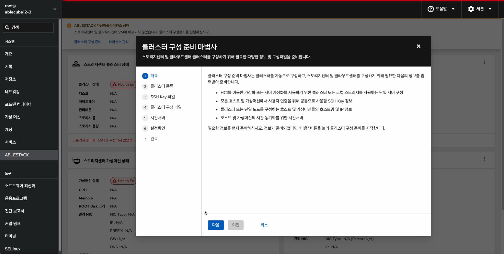{ .imgCenter .imgBorder }
    - 상단 리본의 **클러스터 구성 준비** 링크를 클릭하면 보이는 화면입니다.
    - ABLESTACK 구성을 하는데 필요한 정보를 입력 받아 클러스터 구성을 준비하는 마법사 화면입니다.
    - **다음** 버튼을 눌러 클러스터 구성 준비를 시작합니다.

2. 클러스터 종류
    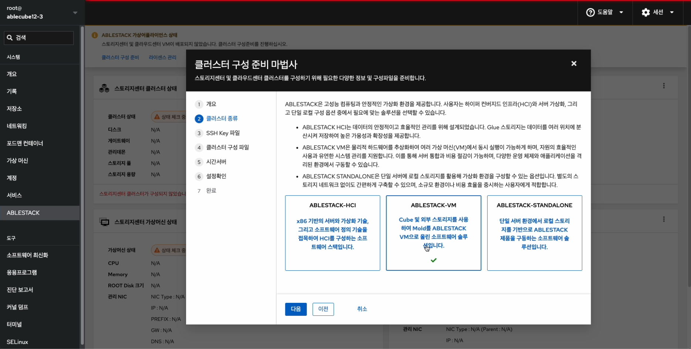{ .imgCenter .imgBorder }
    - **ABLESTACK-VM** 을 선택합니다.
    - **다음** 버튼을 눌러 다음 단계를 진행합니다.

3. SSH Key 파일(기존 파일 사용)
    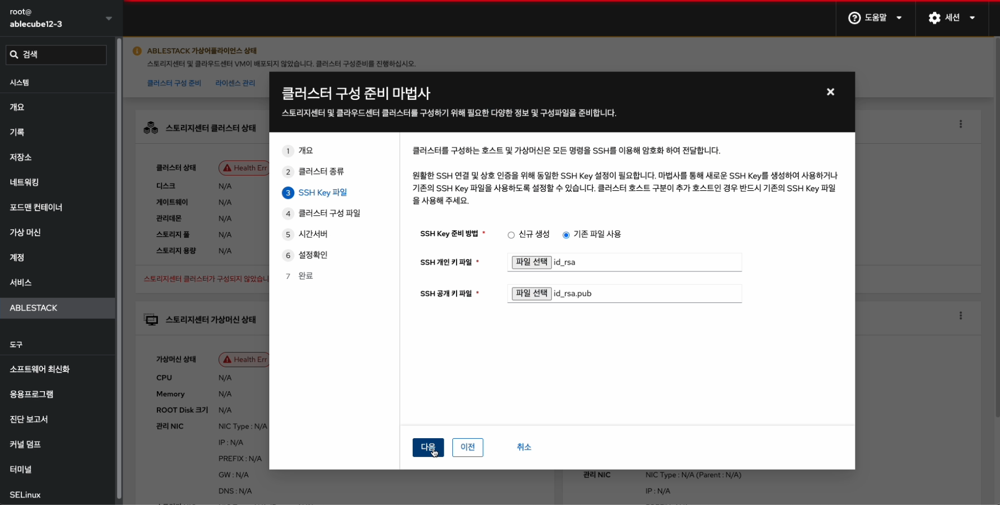{ .imgCenter .imgBorder }
    - 클러스터 설정파일 다운로드 작업에서 받은 id_rsa, id_rsa.pub 파일을 이용하여 등록합니다.
    - **SSH Key 준비 방법** 에서 **기존 파일 사용** 을 선택하고 **SSH 개인 Key** 와 **SSH 공개 Key** 를 **파일 선택** 버튼을 눌러 추가 호스트 다운로드한 SSH Key 를 등록합니다.

    !!! info
        SSH 개인 Key 파일 명은 **id_rsa**, SSH 공개 Key 파일명은 **id_rsa.pub** 으로 고정되어 있습니다.
        다운로드한 Key 의 파일 명을 수정할 경우 등록이 불가능 합니다.

3. 클러스터 구성 파일
    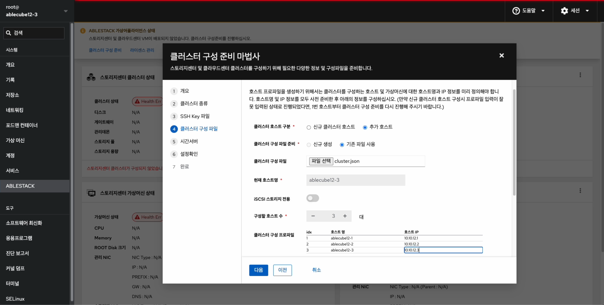{ .imgCenter .imgBorder }
    - 클러스터 구성 설정하는 화면입니다. **클러스터 호스트 구분** 을 **추가 호스트** 로 선택한다.
    - 추가 호스트 인경우 **클러스터 구성 파일 준비** 는 **기존 파일 사용** 이 자동 선택됩니다.
    - **클러스터 구성 파일** 을 클러스터 설정파일 다운로드 작업에서 받은 cluster.json 파일을 이용하여 등록합니다.
    - **현재 호스트명** 은 해당 호스트의 이름을 자동으로 불러옵니다.
    - **구성 호스트 수** 자동으로 계산되어 입력합니다.
    - **클러스터 구성 프로파일** 추가 호스트 명 및 IP 정보를 입력 합니다.
    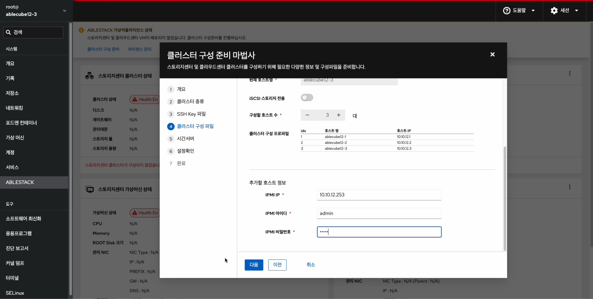{ .imgCenter .imgBorder }
    - **IPMI IP** 정보를 입력 합니다.
    - **IPMI 아이디** 정보를 입력 합니다.
    - **IPMI 비밀번호** 정보를 입력 합니다.
    - 위 항목을 입력 및 확인 후에 **다음** 버튼을 클릭합니다.

    !!! info
        현재 호스트명을 자동으로 불러오며, 클러스터 구성 프로파일에 현재 호스트명과 동일한 호스트 명이 존재해야 합니다. 
        기존 구성 정보를 수정할 수 없으며 추가 호스트의 정보만 입력가능 합니다. 

    !!! example
        - 호스트 프로파일 예제

        idx | 호스트 명 | 호스트 IP |
        :---: | :-------: | :-------: |
        1 | ablecube12-1 | 10.10.12.1 |
        2 | ablecube12-2 | 10.10.12.2 |
        3 | ablecube12-3 | 10.10.12.3 |

4. 시간서버

    !!! info
        기존에 클러스터링된 시간 서버(NTP) 정보를 가져와 자동으로 설정합니다.

    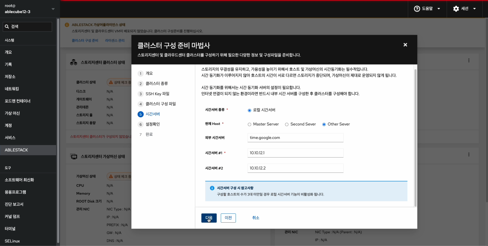{ .imgCenter .imgBorder }

    - 시간 서버 구성하는 화면입니다.
    - 클러스터 구성 정보를 토대로 시간 서버 입력값을 기본 세팅합니다.
    - 기본적으로 idx1 = Master Server, idx2 = Second Server, idx3 이상 = Other Server로 설정 됩니다.
    - **외부 시간 서버** 및 **시간서버 1** 에는 **1번 호스트의 Management IP**, **시간서버 2** 에는 **2번 호스트의 Management IP** 를 확인하고 **다음** 버튼을 클릭합니다.

5. 설정확인
    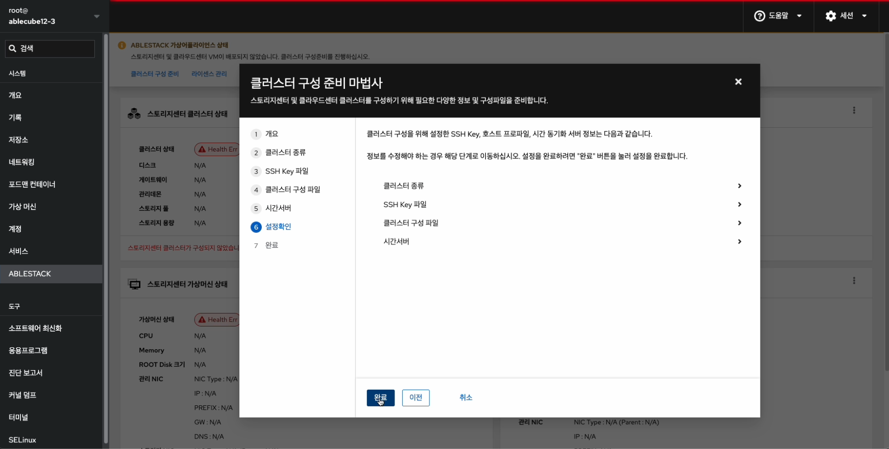{ .imgCenter .imgBorder }
    - 구성 준비에 입력값에 대한 설정을 확인하는 화면입니다.
    - 설정된 값을 확인 후 이상이 없는 경우 **완료** 버튼을 클릭합니다.

6. 완료
    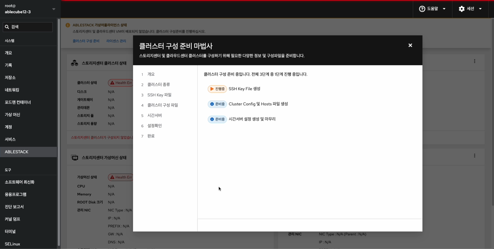{ .imgCenter .imgBorder }
    - 클러스터 구성 준비 3단계 진행상황을 확인합니다.
    - 정상적으로 끝날 경우 완료 화면이 호출 됩니다.
    { .imgCenter .imgBorder }
    - 추가 호스트의 경우 설정파일을 다운로드할 필요는 없습니다.
    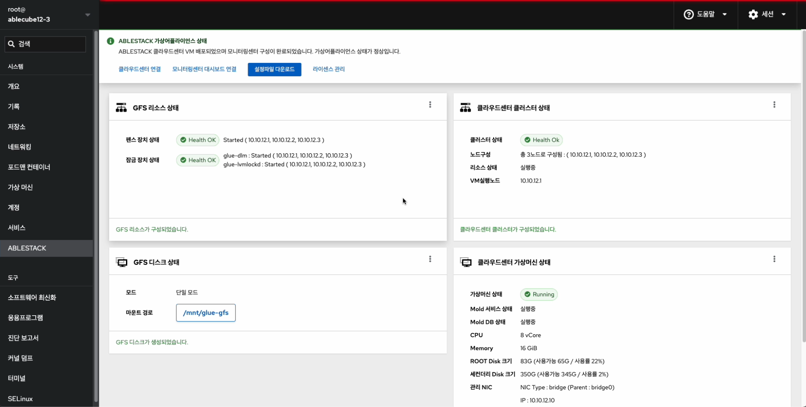{ .imgCenter .imgBorder }
    - 추가된 호스트의 Cube 대시보드 화면입니다.

## Mold에 호스트 추가

1. Mold 대시보드 연결
    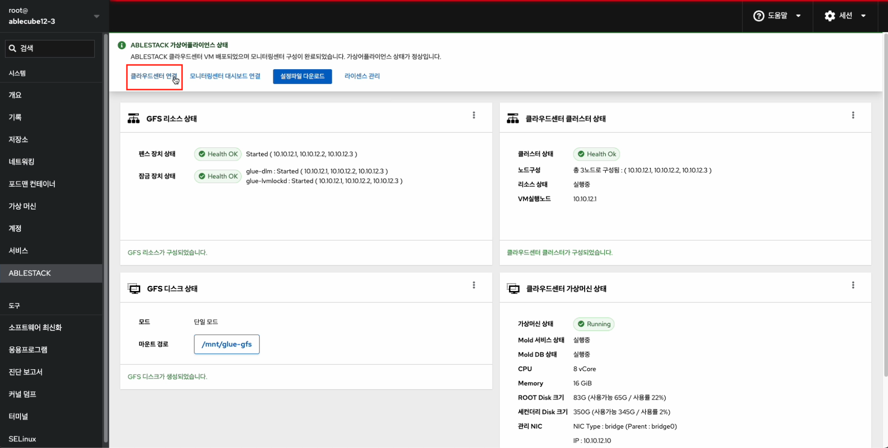{ .imgCenter .imgBorder }
    - 상단 리본의 **클라우드센터 대시보드 연결** 링크를 클릭하여 Mold 대시보드로 연결합니다.

    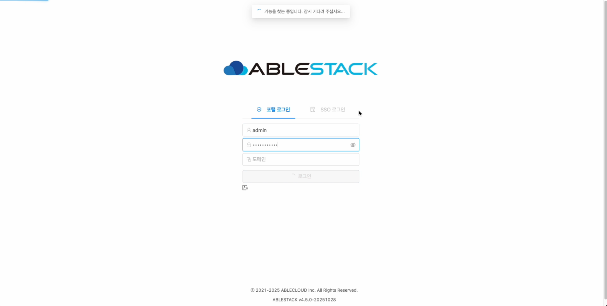{ .imgCenter .imgBorder }
    - ID, Password를 입력하여 로그인합니다.

2. Mold 호스트 추가
    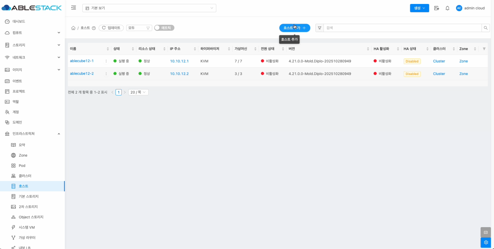{ .imgCenter .imgBorder }
    - Mold 대시보드에 로그인하여, 인프라스트럭쳐 > 호스트 메뉴에서 **호스트 추가** 버튼을 클릭합니다.

    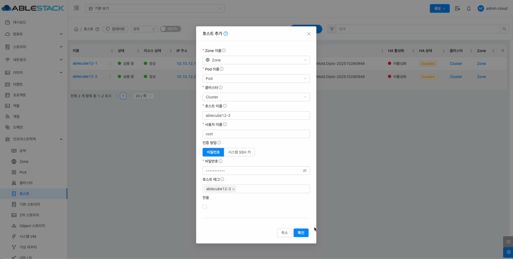{ .imgCenter .imgBorder }

    - **Zone 이름** 을 입력합니다.
    - **Pod 이름** 을 입력합니다.
    - **클러스터** 를 입력합니다.
    - **호스트 이름** 을 입력합니다.
    - **사용자 이름** 을 입력합니다.
    - **비밀번호** 를 입력합니다.
    - **호스트 태그** 를 입력합니다.
    - 위 정보를 입력후 **확인** 버튼을 클릭하여 등록합니다.

3. Mold 호스트 추가 완료
    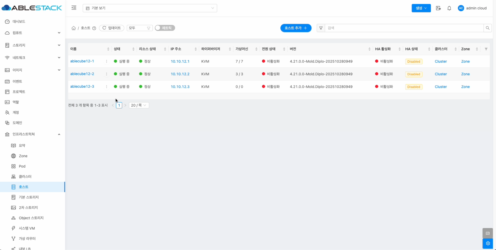{ .imgCenter .imgBorder }
    - 호스트 목록에 추가된 호스트 정보를 확인할 수 있습니다.

4. 원격 관리 구성 및 활성화
    { .imgCenter .imgBorder }
    - 호스트에 대한 원격 관리 구성을 설정합니다.
    - **주소** 를 입력합니다.
    - **포트** 를 **623** 으로 입력합니다.
    - **사용자 이름** 을 입력합니다.
    - **비밀번호** 를 입력합니다.
    - **드라이버** 를 **ipmitool** 로 선택합니다.
    - **관리콘솔 프로토콜** 을 **https** 를 선택합니다.
    - **관리 콘솔 포트** 는 비우고 넘어갑니다.
    - **확인** 을 눌러 구성합니다.

    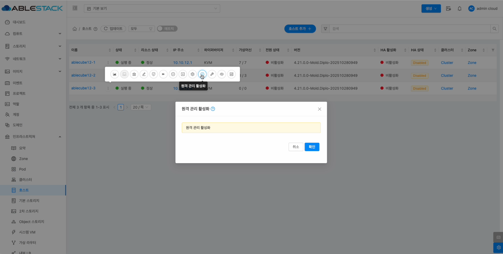{ .imgCenter .imgBorder }
    - 원격 관리 활성화하여 전원 상태가 **활성화** 인지 확인합니다.

## 모니터링 정보 업데이트

1. 모니터링 정보 업데이트
    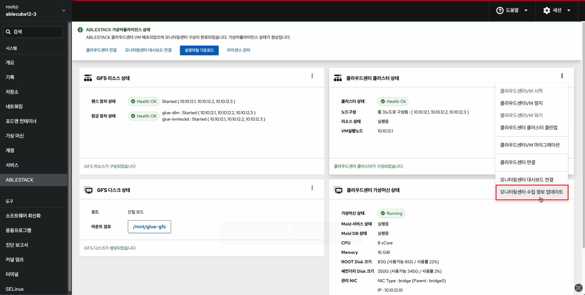{ .imgCenter .imgBorder }
    - Cube에서 ABLESTCK > 클라우드센터 클러스터 상태 카드 메뉴의 **모니터링센터 수집 정보 업데이트** 를 클릭합니다.

2. 모니터링센터 수집 정보 업데이트
    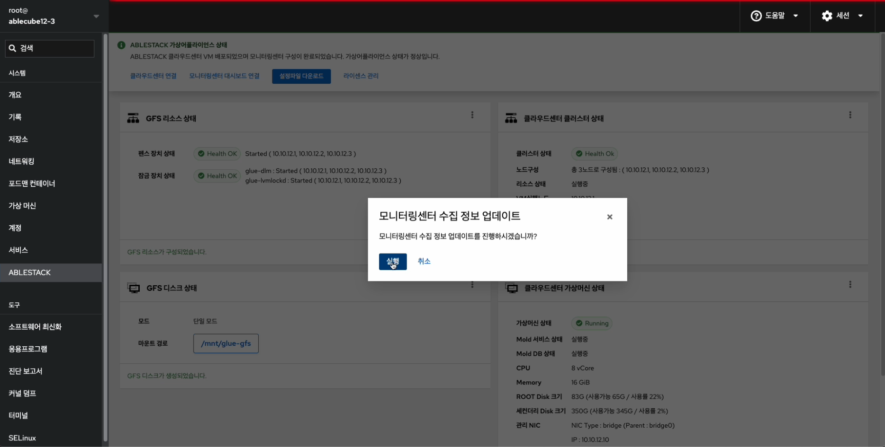{ .imgCenter .imgBorder }
    - **실행** 버튼을 클릭하여 모니터링 센터에 모든 호스트의 수집정보를 업데이트 합니다.

3. 모니터링센터 수집 정보 업데이트 완료
    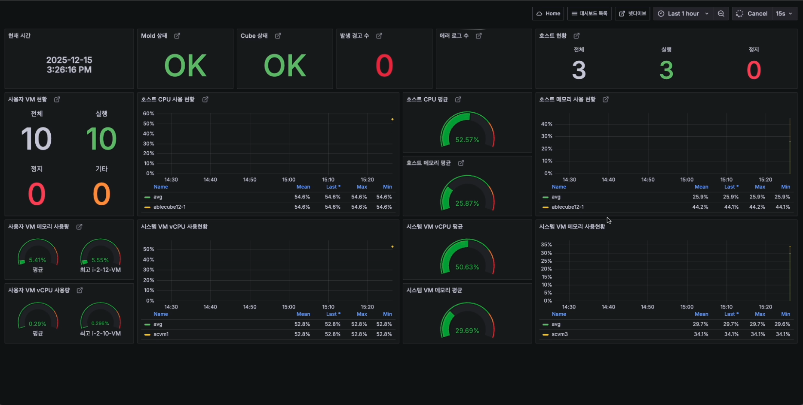{ .imgCenter .imgBorder }
    - Wall 대시보드로 이동하여 로그인 합니다.
    - **1. 종합현황대시보드** 에서 호스트 현황에 호스트가 추가되었는지 확인합니다.

!!! info
    호스트 추가에 대한 작업이 마무리 되었습니다.

추가 호스트가 여러대인경우 해당 작업을 반복하십시오.
