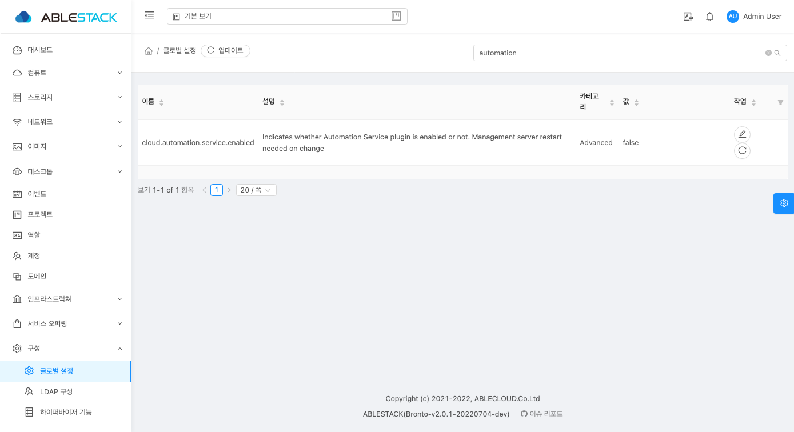
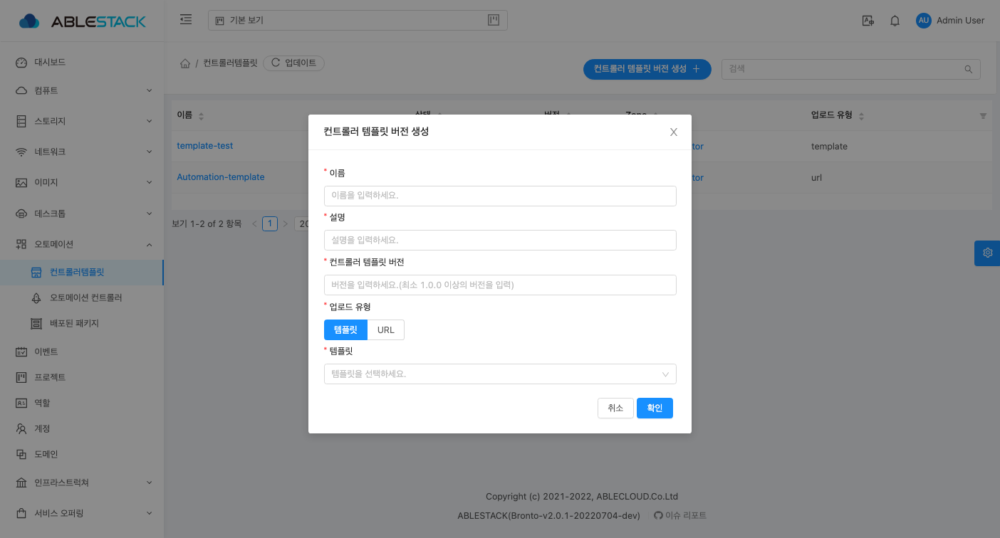
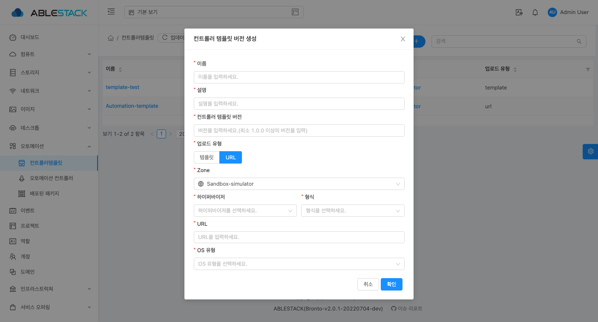
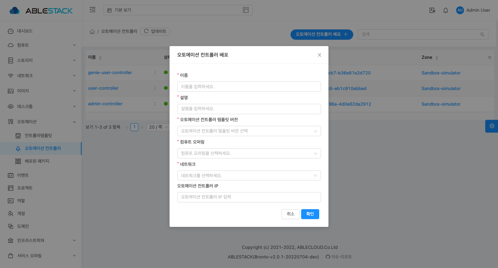

!!! danger
    이 문서는 기술지원 용도의 문서입니다. 기술지원 엔지니어가 아닌 사용자가 조작할 때 시스템에 문제가 발생할 수 있습니다.

# ABLESTACK Genie 구성진행

ABLESTACK Genie 설치 진행 가이드 입니다.  
ABLESTACK Mold 의 **오토메이션** 을 이용하여 진행이 되며 **오토메이션** 메뉴는 **Mold > 구성 > 글로벌 설정** 에서 **cloud.automation.service.enabled** 항목을 **true** 로 값을 변경 하고 ABLESTACK Mold 를 재시작 하면 **오토메이션** 메뉴가 활성화 됩니다. 

## Mold 에서의 오토메이션 서비스 배포

### Mold 글로벌 설정 변경  

{ align=center }  

- 구성 > 글로벌 설정 화면에서 **cloud.automation.service.enabled** 검색하여나오는 항목의 값을 false 에서 true 로 변경
- ABLECLOUD Mold 재기동 진행  

{ align=center }

- 오토메이션 서비스 메뉴 활성화 화면

### 컨트롤러 템플릿 생성

{ align=center }  

{ align=center }
!!! info
    오토메이션 컨트롤러 템플릿 생성은 관리자 계정으로만 가능합니다.
- **이름** 입력창에는 컨트롤러 템플릿 이름을 입력 합니다.
- **설명** 입력창에는 컨트롤러 템플릿 설명을 입력 합니다.
- **버전** 입력창에는 컨트롤러 템플릿 버전을 입력 합니다.
- **업로드 유형** 선택창에서는 템플릿 또는 URL 을 선택 합니다.
    - **템플릿** 선택은 기존에 Mold 에 등록된 템플릿에서 컨트롤러 템플릿을 선택 할 수 있습니다.
        - **Genie 템플릿** 선택창에서는 Mold 에서 등록된 Genie 용 템플릿을 선택 할 수 있습니다.
    - **URL** 선택은 웹에서 컨트롤러 템플릿을 다운로드 하여 등록 할 수 있습니다.
        - **Zone** 선택은 Mold 인프라스트럭쳐에서 구성된 Zone 을 선택 할 수 있습니다.
        - **하이퍼바이저** 선택은 Mold 인프라스트럭쳐에서 구성된 Zone 의 하이퍼 바이저를 선택 할 수 있습니다.
        - **형식** 등록 하는 템플릿의 형식을 선택 할 수 있습니다.
        - **URL** 입력창에는 Genie 용 템플릿 다운로드 URL 을 입력 할 수 있습니다.
        - **OS 유형** 선택창은 Genie 용 템플릿의 OS 타입을 선택 할 수 있습니다.
- 입력 및 선택 항목을 확인 후 에 **다음** 버튼을 클릭하여 컨트롤러 템플릿을 등록 합니다.

### 오토메이션 컨트롤러 배포
{ align=center }

- **이름** 입력창에는 배포할 오토메이션 컨트롤러의 이름을 입력 합니다.
- **설명** 입력창에는 배포할 오토메이션 컨트롤러의 설명을 입력 합니다.
- **컨트롤러 템플릿 버전** 선택창에는 컨트롤러 템플릿 메뉴에서 등록한 템플릿을 선택 합니다.
- **컴퓨트 오퍼링** 선택창에는 배포할 클러스터의 오퍼링을 선택 합니다.
!!! info
    오토메이션 컨트롤러가 동작하기 위한 **최소 오퍼링** 은 CPU(4Core), Memory(4GB)입니다.
- **네트워크** 선택창에는 클러스터를 배포할 네트워크를 선택 합니다.
!!! info
    오토메이션 컨트롤러는 **isolated** 네트워크에서만 배포가 가능하며 해당 네트워크의 **송신 규칙** 은 제거된 상태여야 합니다. 추가적으로 1개의 네트워크에는 1개의 오토메이션 컨트롤러만 배포 할 수 있습니다.
- **오토메이션 컨트롤러 IP** 입력창에는 오토메이션 컨트롤러의 IP를 입력 합니다.
!!! info
    오토메이션 컨트롤러의 IP는 위에서 선택한 네트워크 선택창에서 선택한 네트워크의 CIDR 의 범위안에 IP 를 입력 해야합니다.
    입력하지 않을 경우, IP 주소가 자동으로 할당됩니다.
- 입력 및 선택 항목을 확인 후에 **다음** 버튼을 클릭하여 오토메이션 컨트롤러 배포를 진행 합니다.
!!! info
    오토메이션 컨트롤러가 생성되고 Genie 대시보드에 접속하기 위해서는 약 2분정도의 시간이 소요됩니다.

