# ABLESTACK Glue 설치진행
!!! danger
    이 문서는 기술지원 용도의 문서입니다. 기술지원 엔지니어가 아닌 사용자가 조작할 때 시스템에 문제가 발생할 수 있습니다.
    해당 설치과정에 사용되는 IP 및 입력 정보는 예시이며, 현장에 맞게 수정하시기 바랍니다.

ABLESTACK Glue 설치 진행 가이드 입니다.
이 문서에서는 ABLESTACK Glue 용 가상머신 생성 및 해당 가상머신에서 공용 스토리지 생성절차를 가이드 하고 있습니다.
ABLESTACK Cube 의 웹콘솔과 ABLESTACK Glue 웹콘솔을 이용하여 진행이 되며 웹 접속 IP는 별도의 표시를 하지 않고 진행됩니다.
기존에 구성된 IP 정보에 맞게 웹콘솔을 접속 하시면 됩니다.

## ABLESTACK 메인 화면
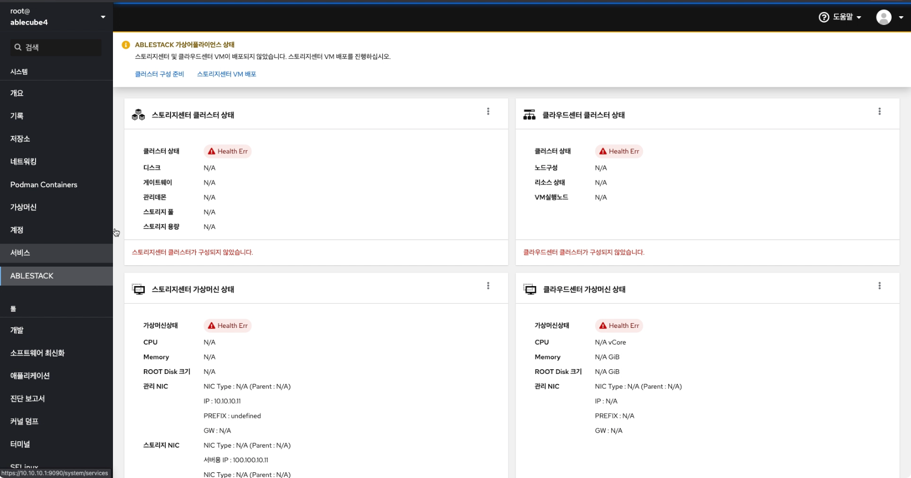{ align=center }
- 왼쪽 ABLESTACK 메뉴 클릭시 보이는 화면입니다.

!!! note
    ABLESTACK 클러스터는 최소 3식이상의 호스트로 구성되어야 합니다.

    이 문서에서는 3식의 호스트를 기준으로 가이드가 되어있으며 만약 4식이상의 호스트로 구성된다면 호스트 구성 작업을 반복하면 됩니다.

## 클러스터 구성 준비(1번 호스트)

1. 개요
    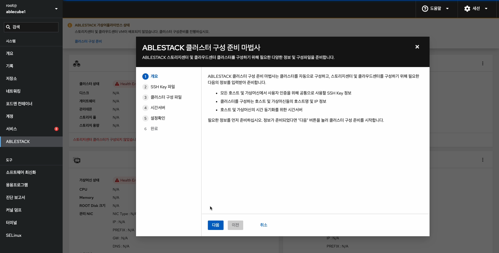{ align=center }
    - 상단 리본의 **클러스터 구성 준비** 링크를 클릭하면 보이는 화면입니다.
    - ABLESTACK 구성을 하는데 필요한 정보를 입력 받아 클러스터 구성을 준비하는 마법사 화면입니다.
    - **다음** 버튼을 눌러 클러스터 구성 준비를 시작합니다.

2. 클러스터 종류
    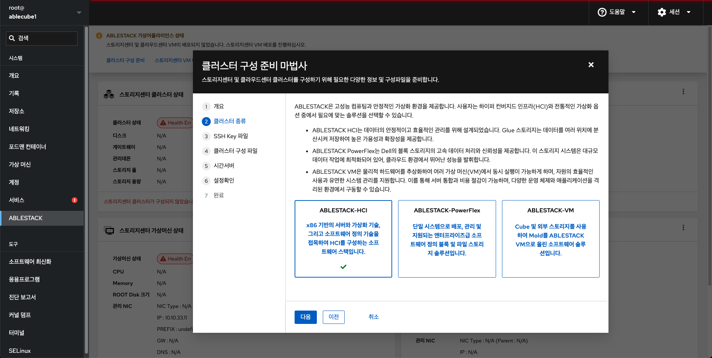{ align=center }
    - 클러스터 종류를 설정하는 화면입니다.
    - **ABLESTACK-HCI** 를 선택합니다.
    - **다음** 버튼을 클릭하여 클러스터 종류를 선택합니다.

3. SSH Key 파일(신규생성)
    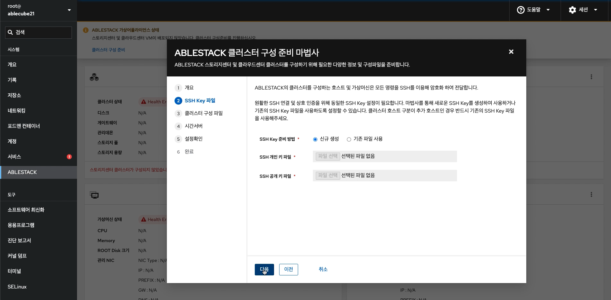{ align=center }
    - 모든 호스트 및 가상 머신은 동일한 SSH Key 를 공유하고 있어야 구성이 가능합니다.
    - **SSH Key 준비 방법** 에서 **신규 생성** 을 선택하고 **다음** 버튼을 클릭하여 신규 SSH Key 를 생성합니다.

4. 클러스터 구성 파일
    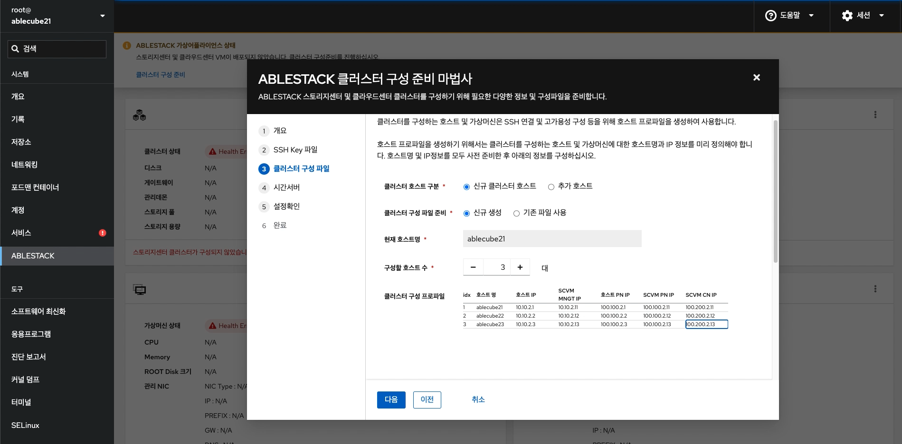{ align=center }
    - 클러스터 구성 설정하는 화면입니다. **클러스터 호스트 구분** 을 **신규 클러스터 호스트** 로 선택한다.
    - **클러스터 구성 파일 준비** 에서 **신규 생성** 을 선택합니다.
    - **현재 호스트명** 은 해당 호스트의 이름을 자동으로 불러옵니다.
    - **구성 호스트 수** 3대로 입력합니다.
    - **클러스터 구성 프로파일** 호스트 명 및 IP 정보를 입력 합니다.
    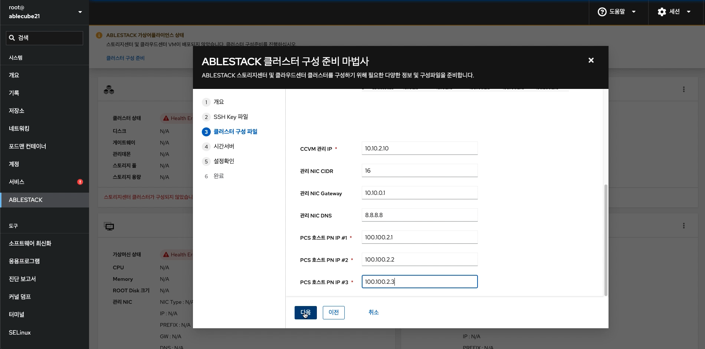{ align=center }
    - **CCVM 관리 IP** 정보를 입력 합니다.
    - **관리 NIC CIDR** 정보를 입력 합니다.
    - **관리 NIC Gateway** 정보를 입력 합니다.
    - **관리 NIC DNS** 정보를 입력 합니다.
    - **PCS 호스트명 PN IP #1** 정보를 입력 합니다.
    - **PCS 호스트명 PN IP #2** 정보를 입력 합니다.
    - **PCS 호스트명 PN IP #3** 정보를 입력 합니다.
    - 위 항목을 입력 및 확인 후에 **다음** 버튼을 클릭합니다.

    !!! info
        idx 순서에 맞게 호스트 명과 ip 정보를 입력해야 합니다. 
        현재 호스트명을 자동으로 불러오며, 클러스터 구성 프로파일에 현재 호스트명과 동일한 호스트 명이 존재해야 합니다. 
        호스트 파일을 신규로 구성 호스트 수를 선택하면 하단의 호스트 파일에 호스트 수 만큼의 예제 항목이 생성됩니다. 

    !!! example
        - 호스트 프로파일 예제

        idx | 호스트 명 | 호스트 IP | SCVM MNGT IP | 호스트 PN IP | SCVM PN IP | SCVM CN IP
        :---: | :-------: | :-------: | :-------: | :-------: | :-------: | :-------:
        1 | ablecube1 | 10.10.2.1 | 10.10.2.11 | 100.100.2.1 | 100.100.2.11 | 100.200.2.11
        2 | ablecube2 | 10.10.2.2 | 10.10.2.12 | 100.100.2.2 | 100.100.2.12 | 100.200.2.12
        3 | ablecube3 | 10.10.2.3 | 10.10.2.13 | 100.100.2.3 | 100.100.2.13 | 100.200.2.13

5. 시간서버

    !!! info
        ABLESTACK에서 시간서버는 매우 중요한 역할을 합니다.  
        시간동기화가 맞지 않으면 스토리지 데이터들의 무결성 확보에 치명적일 수 있습니다. 
        따라서 시간서버는 반드시 구성해야합니다. 
        인터넷등 외부 통신이 가능한 환경이어서 외부 공인된 시간서버(NTP)에 접속이 가능하거나 내부에 별도의 시간서버(NTP)가 존재하는 경우에는 "외부시간서버"를 입력하셔서 진행하고, 
        폐쇄적인 네트워크 환경으로 외부 공인된 시간서버와 통신이 불가하고 내부에 별도의 시간서버가 없을 경우에는 ABLESTACK에서 자체적으로 시간서버를 구성합니다.

    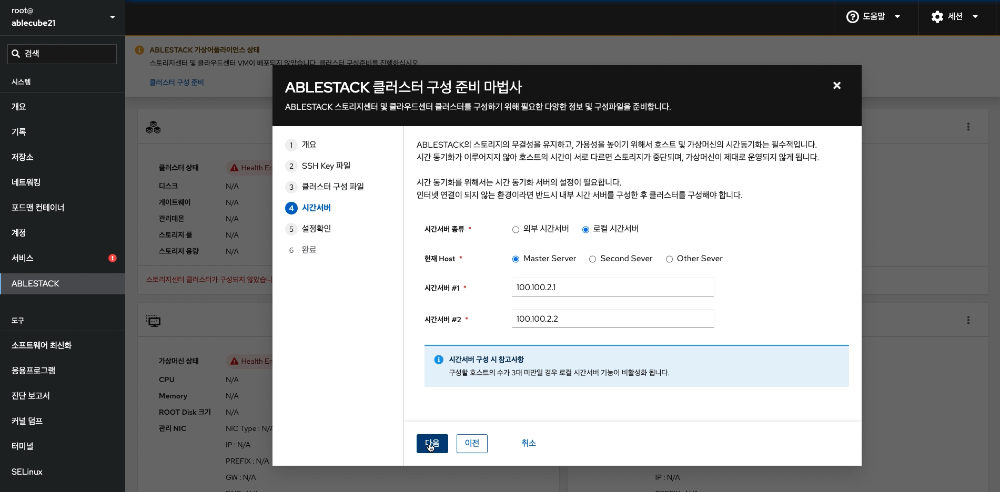{ align=center }

    - 시간 서버 구성하는 화면입니다.
    - 클러스터 구성 정보를 토대로 시간 서버 입력값을 기본 세팅합니다.
    - 별도로 **외부시간서버(NTP)** 가 존재한다면, 외부 시간서버 입력란에 입력합니다.
    - 기본적으로 idx1 = Master Server, idx2 = Second Server, idx3 이상 = Other Server로 설정 됩니다.
    - 설정된 값을 확인한 후, **다음** 버튼을 클릭합니다.

6. 설정확인
    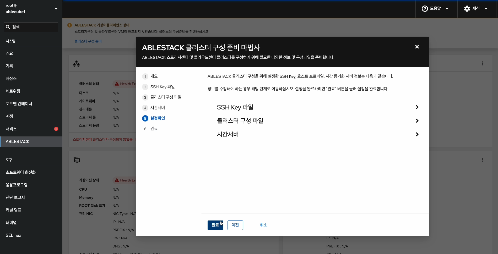{ align=center }
    - 구성 준비에 입력값에 대한 설정을 확인하는 화면입니다.
    - 설정된 값을 확인 후 이상이 없는 경우 **완료** 버튼을 클릭합니다.

7. 완료
    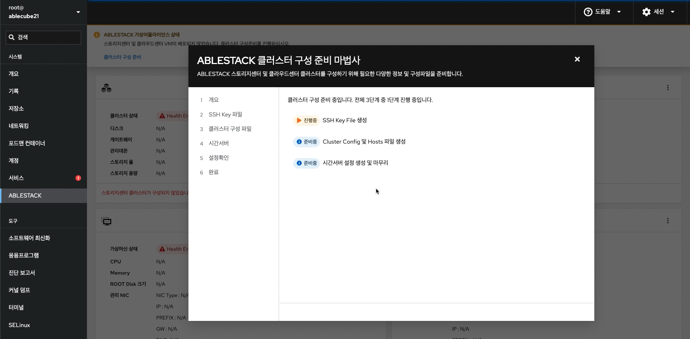{ align=center }
    - 클러스터 구성 준비 3단계 진행상황을 확인합니다.
    - 정상적으로 끝날 경우 완료 화면이 호출 됩니다.

    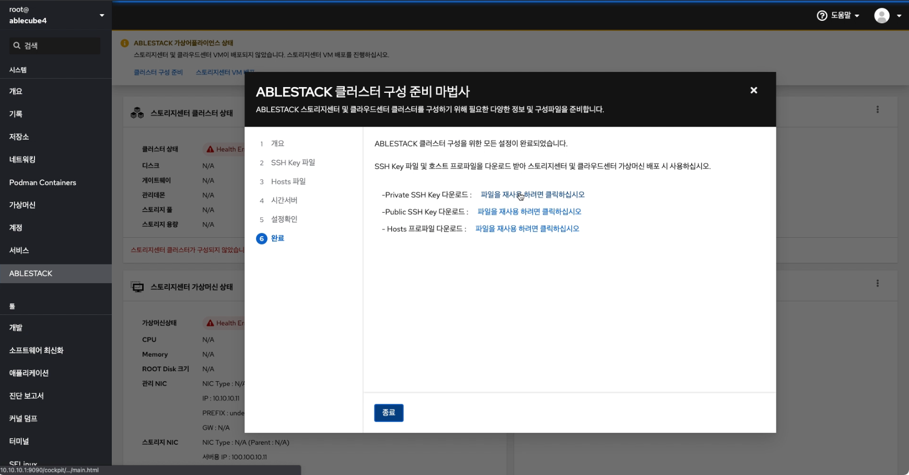{ align=center }

    - 1번 호스트의 사전구성 완료 화면입니다.
    - **Private SSH Key**, **Public SSH Key**, **클러스터 구성 프로파일** 을 재사용하기 위하여 링크를 클릭하여 다운로드 합니다.

!!! info
    SSH Key 및 클러스터 구성 프로파일을 다운로드 한 후에 2번 호스트, 3번 호스트 구성시 다운로드한 파일을 재사용 해야 정상적으로 구성이 됩니다.

## 스토리지센터 가상머신 배포(1번 호스트)
1. 개요
    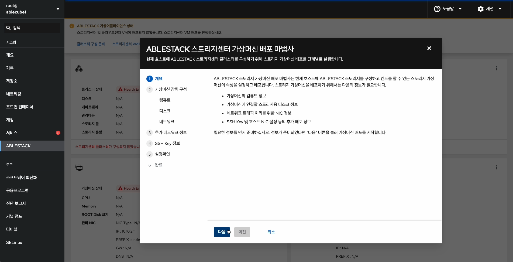{ align=center }
    - ABLESTACK 스토리지센터 가상머신 배포 마법사 화면입니다.

2. 가상머신 장치 구성 - 컴퓨트
    { align=center }
    - 스토리지센터 가상머신 장치 구성의 CPU, Memory 구성 화면입니다.
    - **CPU** 는 **8 vCore** 를 선택 하고, **Memory** 는 **16GiB** 를 선택 하고 **다음** 버튼을 클릭합니다.

    !!! tip
        스토리지의 성능 최적화를 위해 스토리지센터 가상머신의 컴퓨트 자원은 가상머신이 컨트롤 할 디스크의 수 및 가용량에 따라 적정하게 선택해야 합니다.
        CPU 는 컨트롤 할 호스트의 디스크가 **10개** 이내이면, **8 vCore** 를 그이상이면 **16 vCore** 를 선택히시면 됩니다.
        Memory 는 컨트롤 할 호스트의 디스크 용량이 **10 TB** 이내이면, **16 GiB**, **10 ~ 30 TB** 이면 **32 GiB**, **30 TB** 를 초과하면 **64 Gib**
        를 선택하시면 됩니다.
        ROOT Disk의 크기는 **70GiB** 를 디스크가 **Thin Provisioning** 방식으로 제공됩니다.

3. 가상머신 장치구성 - 디스크

    !!! info
        스토리지 센터 가상머신의 디스크로 스토리지 클러스터를 구성하게 됩니다. 
        구성 방법에 따라 Raid-Passthrough와 LUN-Passthrough를 선택하게 됩니다. 
        Raid-Passthrough는 Raid 카드를 스토리지 센터 가성머신에 할당할 경우이며, 해당 항목을 선택하면 Raid 카드 목록이 출력됩니다. 
        LUN-Passthrough는 기 구성된 LUN을 스토리지 센터 가상머신에 할당하는 경우이며, 해당 항목을 선택하면 LUN 목록이 출력됩니다.

        이 문서는 "LUN Passthrough"로 구성하는 방식에 대하여 설명되어 있습니다.

    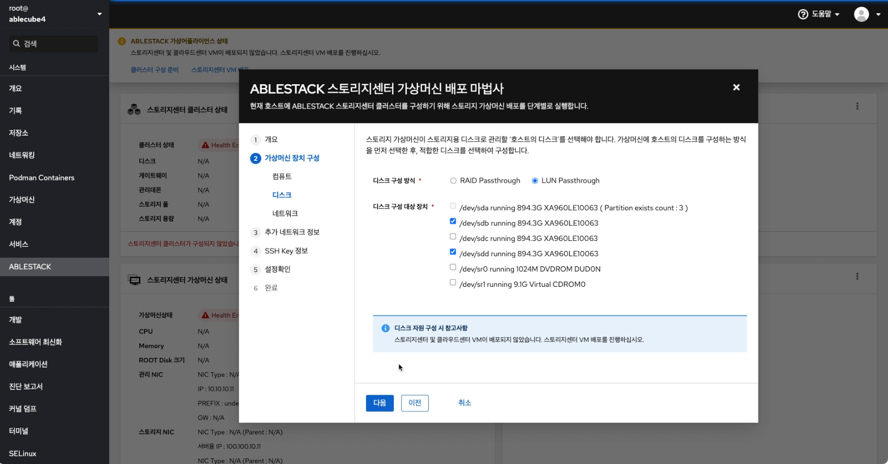{ align=center }

    - 스토리지 센터 가상머신 장치의 디스크 구성 화면입니다.
    - **디스크 구성 방식** 은 **LUN Passthrough** 를 선택하고 **Glue 스토리지로 사용할 디스크** 를 선택하고 **다음** 버튼을 클릭 합니다.

    !!! warning
        가상머신 장치 구성 - 디스크 구성시 파티션이 구성된 디스크의 선택을 하시면 안됩니다.
        만약에 파티션이 구성된 디스크를 선택을 하고 가상 머신을 구성하시면 ABLESTACK Cube 가 삭제가 될 수 있습니다.

4. 가상머신 장치구성 - 네트워크

    !!! info
        스토리지 센터 가상머신의 관리 및 스토리지 전용 네트워크를 구성하게 됩니다. 
        구성 방법에 따라 NIC-Passthrough, NIC-Passthrough-Bonding, Bridge-Network를 선택하게 됩니다. 
        NIC-Passthrough 및 NIC-Passthrough-Bonding 일 경우에는 물리적인 NIC 디바이스 목록이 출력됩니다. 
        서버용 NIC, 복제용 NIC를 선택하시면 됩니다. 
        NIC-Passthrough-Bonding 경우에는 NIC 별로 2개씩 디바이스 목록을 선택하게 됩니다. 실제로 본딩 구성이 되는것은 아니며 스토리지센터 가상머신 배포 후에 해당 관리화면(Cube)에서 본딩 구성을 완료하셔야 합니다. 
        Bridge-Network는 Cube 구성 시 생성했던 Bridge 목록이 출력됩니다.

        이 문서는 "NIC-Passthrough"로 구성하는 방식에 대하여 설명되어 있습니다.

    { align=center }

    - 스토리지 센터 가상머신 장치의 네트워크 구성 화면입니다.
    - **관리 NIC 용 Bridge** 선택 박스에서 **관리용 Bridge 네트워크** 를 선택합니다.
    - **스토리지 NIC 구성 방식** 에서 **NIC Passthrough** 를 선택하고 **서버용 NIC** 선택 박스에서는 **서버용으로 사용할 NIC** 를 **복제용 NIC**
    선택 박스에서는 **복제용으로 사용할 NIC** 을 선택하고 **다음** 버튼을 클릭합니다.

5. 추가 네트워크 정보
    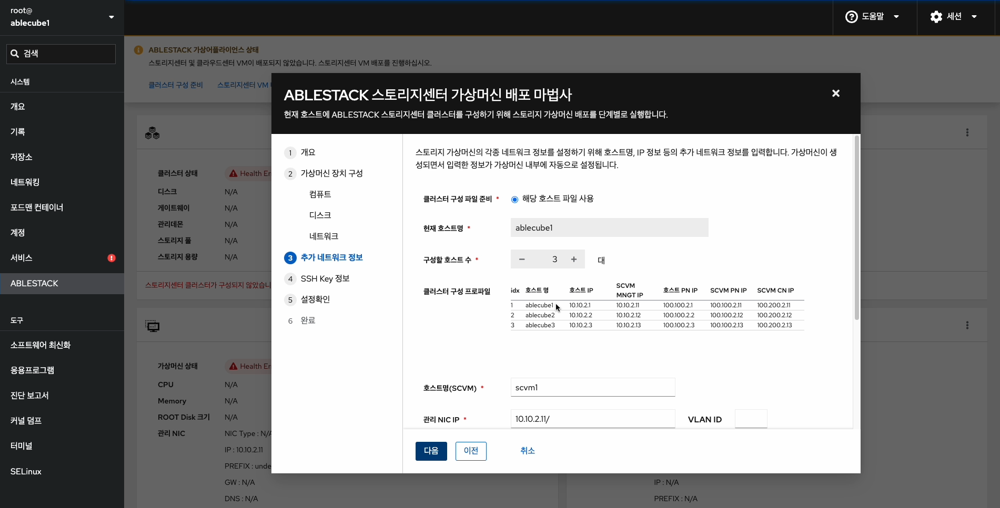{ align=center }
    - **클러스터 구성 파일 준비** 해당 호스트 파일 사용으로 자동 선택되며, ablecube 호스트 설정 정보를 자동으로 읽어와 클러스터 구성 정보 및 네트워크 IP 정보를 세팅합니다.
    - **호스트명(SCVM)** 을 입력 및 확인합니다.
    - **관리 NIC IP** 를 입력 및 확인합니다.

    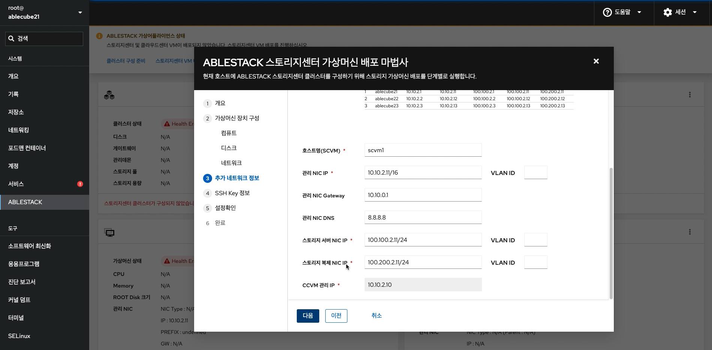{ align=center }

    - **관리 NIC Gateway** 를 입력 및 확인합니다.
    - **관리 NIC DNS** 를 입력 및 확인합니다.
    - **스토리지 서버 NIC IP** 를 입력 및 확인합니다.
    - **스토리지 복제 NIC IP** 를 입력 및 확인합니다.
    - **CCVM 관리 IP** 를 확인합니다.

    !!! info
        스토리지센터 가상머신 배포시 ablecube 호스트에서 설정파일 읽어와 일부 정보를 자동세팅되며 입력 정보를 정확히 확인해야 합니다.
        해당 화면의 IP 정보 는 예제 입니다. IP 정보는 사이트 정보에 맞춰서 수정해야 합니다.

6. SSH Key 정보
    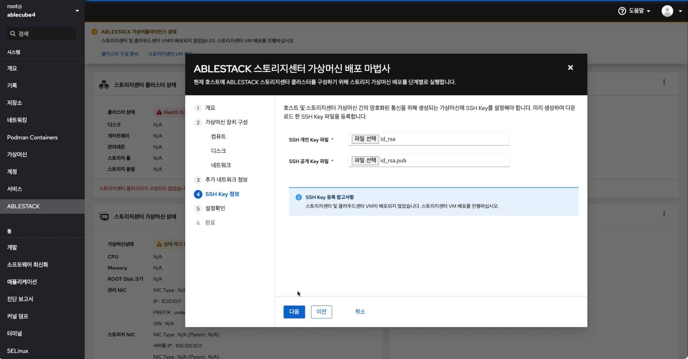{ align=center }
    - SSH Key 정보를 확인하는 화면입니다.
    - 클러스터 구성시 호스트에 등록된 호스트의 키 정보로 자동세팅됩니다.

    !!! info
        SSH 개인 Key 파일 명은 **id_rsa**, SSH 공개 Key 파일명은 **id_rsa.pub** 으로 고정되어 있습니다.
        키 파일명을 변경할 경우 등록이 불가능 합니다.

7. 설정확인
    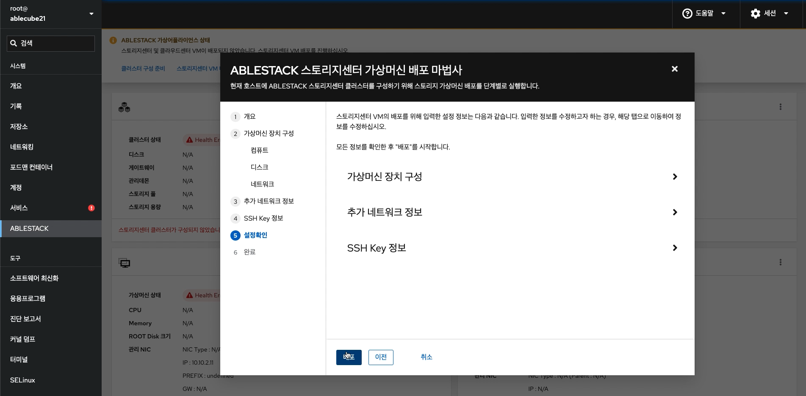{ align=center }
    - 스토리지센터 가상머신 배포를 위한 구성정보 확인하는 화면입니다.
    - **배포** 버튼을 클릭하면 확인창이 보이며 **실행** 버튼을 눌러 스토리지 가상머신을 배포 합니다.

8. 배포
    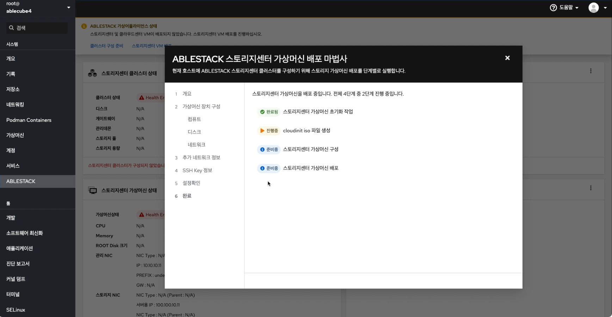{ align=center }
    - 스토리지센터 가상머신 배포 진행상황을 확인 할 수 있는 화면입니다.

9.  완료
    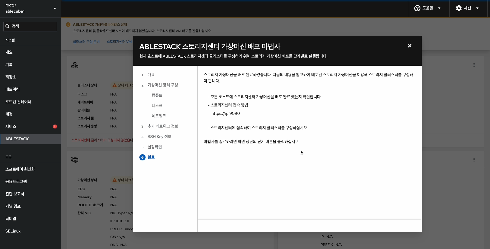{ align=center }
    - 스토리지센터 가상머신 배포 완료 후 화면입니다.

10. 스토리지센터 가상머신 상태 확인
    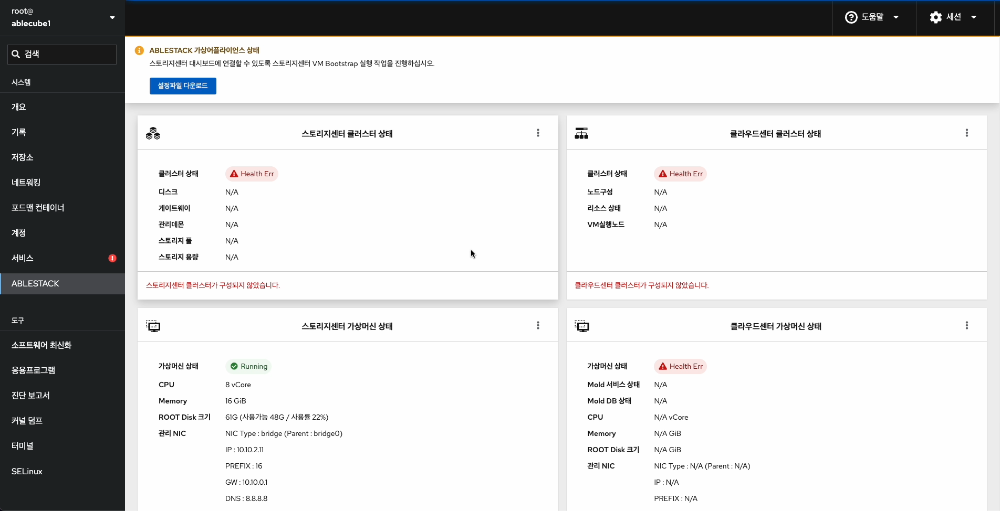{ align=center }
    - 스토리지센터 가상머신 상태 카드에서 가상머신 상태가 **Running** 인지 확인합니다.

## 클러스터 구성 준비(2번  호스트)

!!! info
    2번 호스트 구성 방법 입니다. (기본적인 절차는 1번 호스트와 동일합니다)

1. 개요
   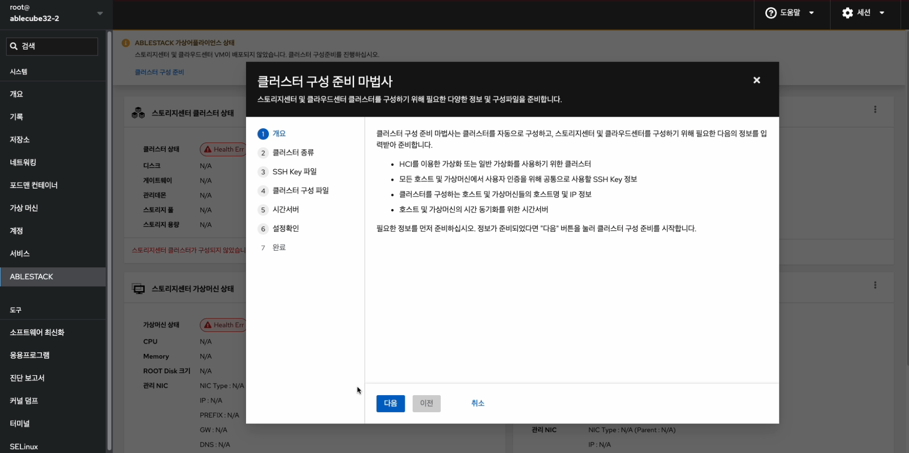{ align=center }
    - 상단 리본의 **클러스터 구성 준비** 링크를 클릭하면 보이는 화면입니다.
    - ABLESTACK 구성을 하는데 필요한 정보를 입력 받아 클러스터 구성을 준비하는 마법사 화면입니다.
    - **다음** 버튼을 눌러 클러스터 구성 준비를 시작합니다.

2. 클러스터 종류
    { align=center }
    - 클러스터 종류를 설정하는 화면입니다.
    - **ABLESTACK-HCI** 를 선택합니다.
    - **다음** 버튼을 클릭하여 클러스터 종류를 선택합니다.

2. SSH Key 파일(기존파일사용)
   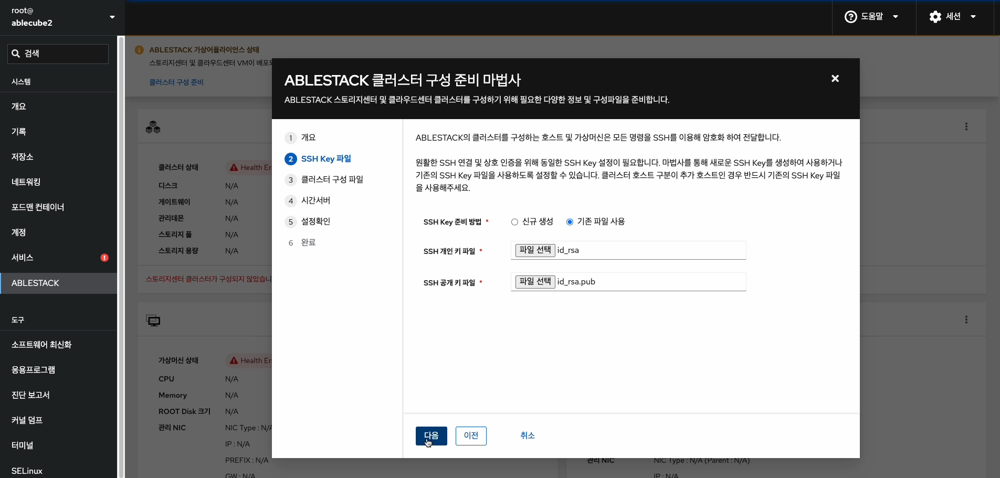{ align=center }
    - 모든 호스트 및 가상 머신은 동일한 SSH Key 를 공유하고 있어야 구성이 가능합니다.
    - **SSH Key 준비 방법** 에서 **기존 파일 사용** 을 선택하고 **SSH 개인 Key** 와 **SSH 공개 Key** 를 **파일 선택** 버튼을 눌러 1번 호스트 클러스터 구성 준비 단계에서
    다운로드한 SSH Key 를 등록합니다.

    !!! info
        SSH 개인 Key 파일 명은 **id_rsa**, SSH 공개 Key 파일명은 **id_rsa.pub** 으로 고정되어 있습니다.
        다운로드한 Key 의 파일 명을 수정할 경우 등록이 불가능 합니다.

3. 클러스터 구성 파일
    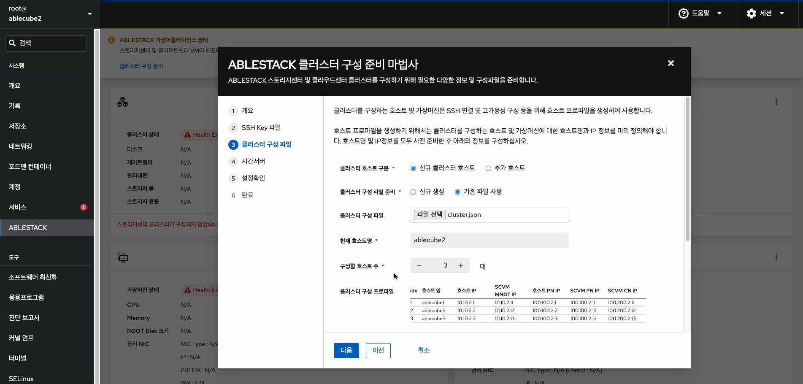{ align=center }
    - 클러스터 구성 설정하는 화면입니다. **클러스터 호스트 구분** 을 **신규 클러스터 호스트** 로 선택한다.
    - **클러스터 구성 파일 준비** 에서 **기존 파일 사용** 을 선택합니다.
    - **클러스터 구성 파일** 에서 cluster.json 파일을 업로드 클러스터 정보를 자동입력 합니다.
    - **현재 호스트명** 은 해당 호스트의 이름을 자동으로 불러옵니다.
    - **구성 호스트 수** 는 기존 파일 사용 선택시 수정 불가능 상태가 됩니다.
    - **클러스터 구성 프로파일** 정보를 확인합니다.
    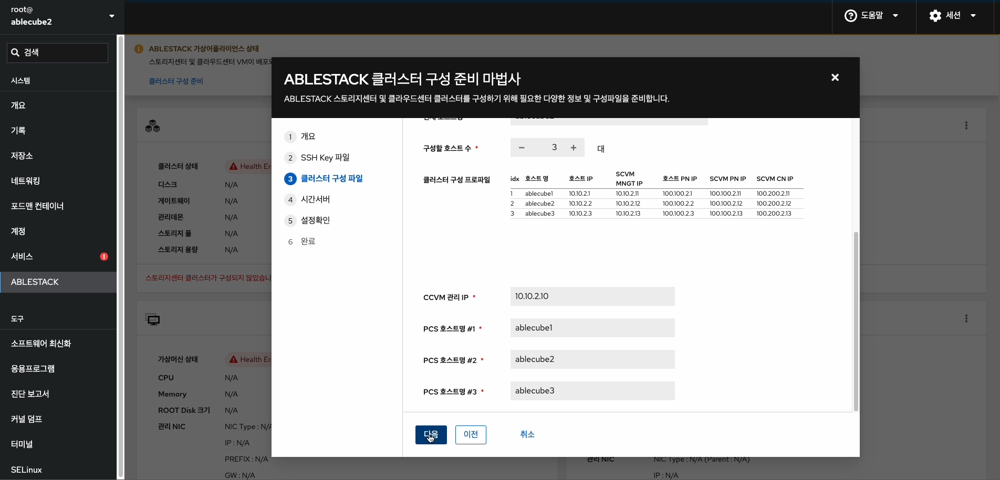{ align=center }
    - **CCVM 관리 IP** 정보를 입력 합니다.
    - **관리 NIC CIDR** 정보를 입력 합니다.
    - **관리 NIC Gateway** 정보를 입력 합니다.
    - **관리 NIC DNS** 정보를 입력 합니다.
    - **PCS 호스트명 PN IP #1** 정보를 입력 합니다.
    - **PCS 호스트명 PN IP #2** 정보를 입력 합니다.
    - **PCS 호스트명 PN IP #3** 정보를 입력 합니다.
    - 위 항목을 입력 및 확인 후에 **다음** 버튼을 클릭합니다.

    !!! info
        idx 순서에 맞게 호스트 명과 ip 정보를 입력해야 합니다. 
        현재 호스트명을 자동으로 불러오며, 클러스터 구성 프로파일에 현재 호스트명과 동일한 호스트 명이 존재해야 합니다. 
        호스트 파일을 신규로 구성 호스트 수를 선택하면 하단의 호스트 파일에 호스트 수 만큼의 예제 항목이 생성됩니다. 

    !!! example
        - 호스트 프로파일 예제

        idx | 호스트 명 | 호스트 IP | SCVM MNGT IP | 호스트 PN IP | SCVM PN IP | SCVM CN IP
        :---: | :-------: | :-------: | :-------: | :-------: | :-------: | :-------:
        1 | ablecube1 | 10.10.2.1 | 10.10.2.11 | 100.100.2.1 | 100.100.2.11 | 100.200.2.11
        2 | ablecube2 | 10.10.2.2 | 10.10.2.12 | 100.100.2.2 | 100.100.2.12 | 100.200.2.12
        3 | ablecube3 | 10.10.2.3 | 10.10.2.13 | 100.100.2.3 | 100.100.2.13 | 100.200.2.13

4. 시간서버
   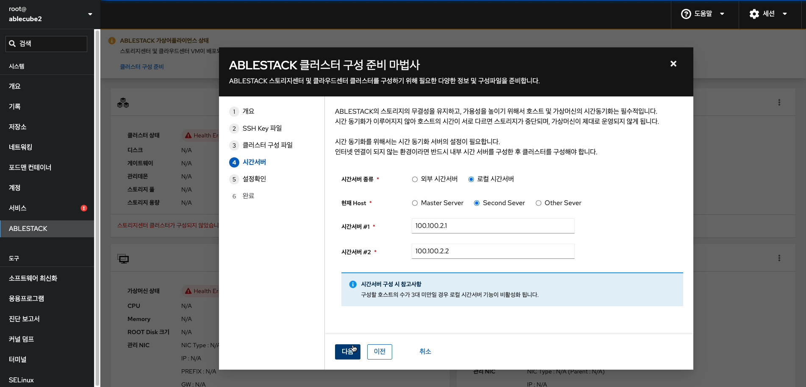{ align=center }
    - 시간 서버 구성하는 화면입니다.
    - 클러스터 구성 정보를 토대로 시간 서버 입력값을 기본 세팅합니다.
    - 기본적으로 idx1 = Master Server, idx2 = Second Server, idx3 이상 = Other Server로 설정 됩니다.
    - 설정된 값을 확인한 후, **다음** 버튼을 클릭합니다.

5. 설정확인
   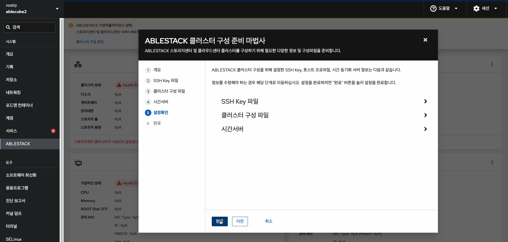{ align=center }
    - 구성 준비에 입력값에 대한 설정을 확인하는 화면입니다.
    - 설정된 값을 확인 후 이상이 없는경우 **완료** 버튼을 클릭합니다.

6. 완료
    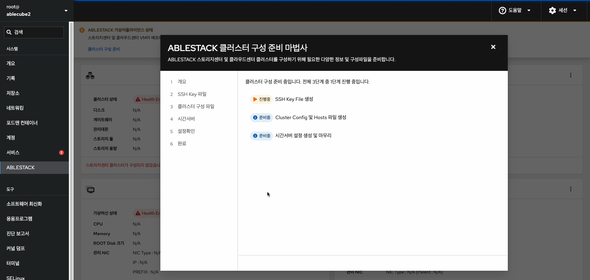{ align=center }
    - 클러스터 구성 준비 3단계 진행상황을 확인합니다.
    - 정상적으로 끝날 경우 완료 화면이 호출 됩니다.

    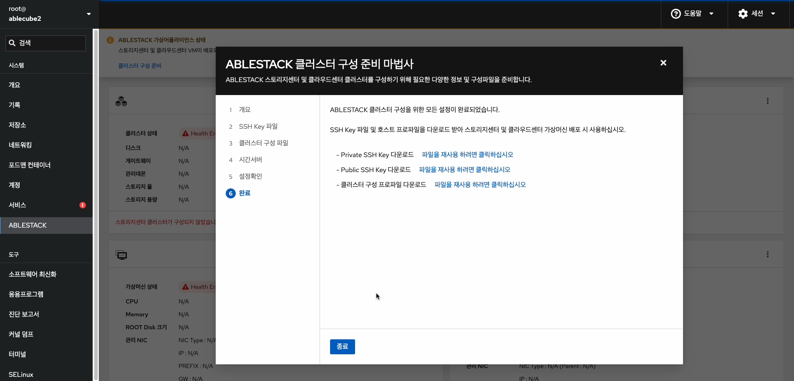{ align=center }

    - 2번 호스트의 사전구성 완료 화면입니다.

    !!! info
        SSH Key 및  클러스터 구성 파일은 1번 호스트에서 다운로드 하셨다면 해당 화면에서 다운로드 하지 않으셔도 됩니다.

## 스토리지센터 가상머신 배포(2번 호스트)
1. 개요
   { align=center }
    - ABLESTACK 스토리지센터 가상머신 배포 마법사 화면입니다.

2. 가상머신 장치 구성 - 컴퓨트
   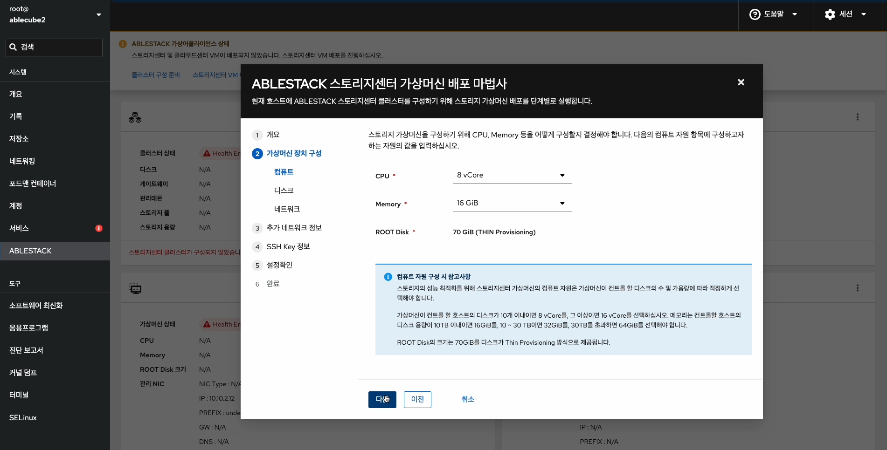{ align=center }
    - 스토리지센터 가상머신 장치 구성의 CPU, Memory 구성 화면입니다.
    - **CPU** 는 **8 vCore** 를 선택 하고, **Memory** 는 **16GiB** 를 선택 하고 **다음** 버튼을 클릭합니다.

    !!! tip
        스토리지의 성능 최적화를 위해 스토리지센터 가상머신의 컴퓨트 자원은 가상머신이 컨트롤 할 디스크의 수 및 가용량에 따라 적정하게 선택해야 합니다.
        CPU 는 컨트롤 할 호스트의 디스크가 **10개** 이내이면, **8 vCore** 를 그이상이면 **16 vCore** 를 선택히시면 됩니다.
        Memory 는 컨트롤 할 호스트의 디스크 용량이 **10 TB** 이내이면, **16 GiB**, **10 ~ 30 TB** 이면 **32 GiB**, **30 TB** 를 초과하면 **64 Gib**
        를 선택하시면 됩니다.
        ROOT 디스크는 **70 Gib** 고정입니다.

3. 가상머신 장치구성 - 디스크
   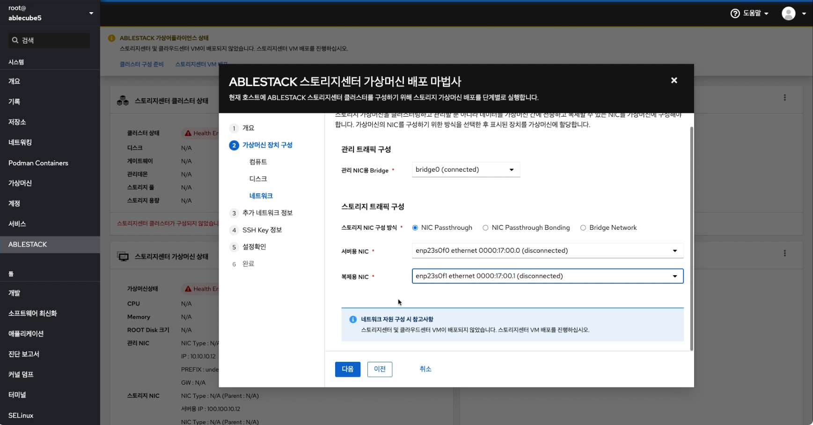{ align=center }
    - 스토리지 센터 가상머신 장치의 디스크 구성 화면입니다.
    - **디스크 구성 방식** 은 **LUN Passthrough** 를 선택하고 **Glue 스토리지로 사용할 디스크** 를 선택하고 **다음** 버튼을 클릭 합니다.

    !!! warning
        가상머신 장치 구성 - 디스크 구성시 파티션이 구성된 디스크의 선택을 하시면 안됩니다.
        만약에 파티션이 구성된 디스크를 선택을 하고 가상 머신을 구성하시면 ABLESTACK Cube 가 삭제가 될 수 있습니다.

4. 가상머신 장치구성 - 네트워크
   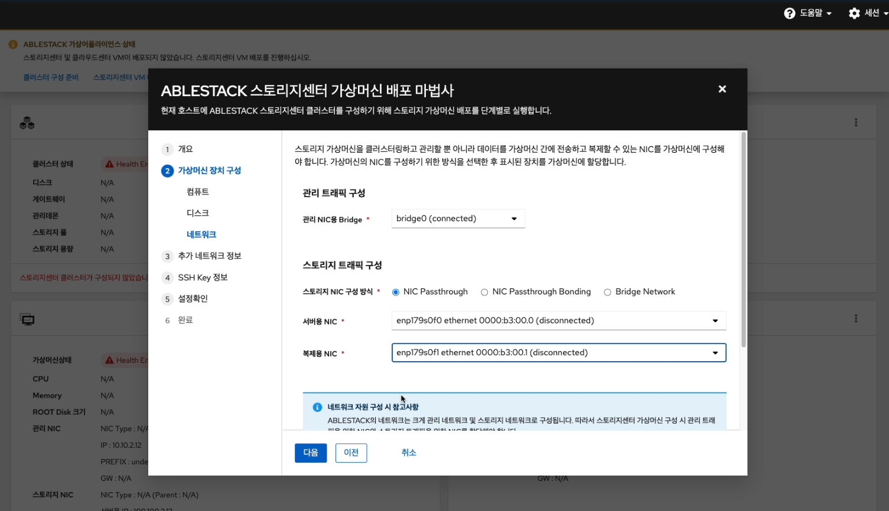{ align=center }
    - 스토리지 센터 가상머신 장치의 네트워크 구성 화면입니다.
    - **관리 NIC 용 Bridge** 선택 박스에서 **관리용 Bridge 네트워크** 를 선택합니다.
    - **스토리지 NIC 구성 방식** 에서 **NIC Passthrough** 를 선택하고 **서버용 NIC** 선택 박스에서는 **서버용으로 사용할 NIC** 를 **복제용 NIC**
    선택 박스에서는 **복제용으로 사용할 NIC** 을 선택하고 **다음** 버튼을 클릭합니다.

5. 추가 네트워크 정보
    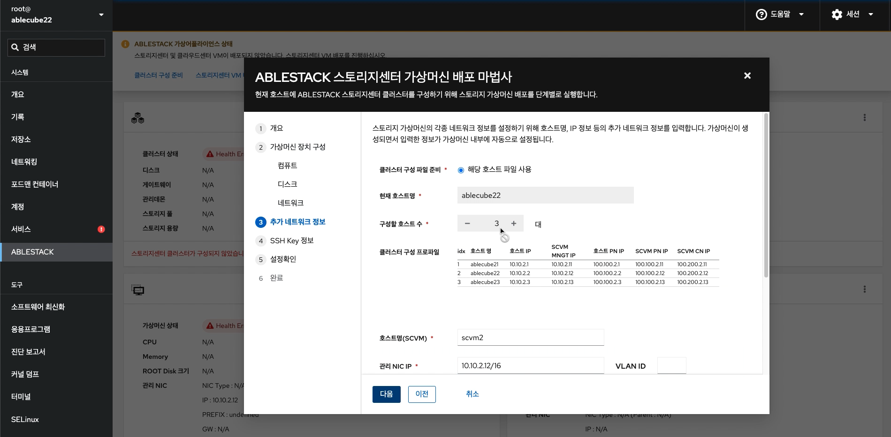{ align=center }
    - **클러스터 구성 파일 준비** 해당 호스트 파일 사용으로 자동 선택되며, ablecube 호스트 설정 정보를 자동으로 읽어와 클러스터 구성 정보 및 네트워크 IP 정보를 세팅합니다.
    - **호스트명(SCVM)** 을 입력 및 확인합니다.
    - **관리 NIC IP** 를 입력 및 확인합니다.

    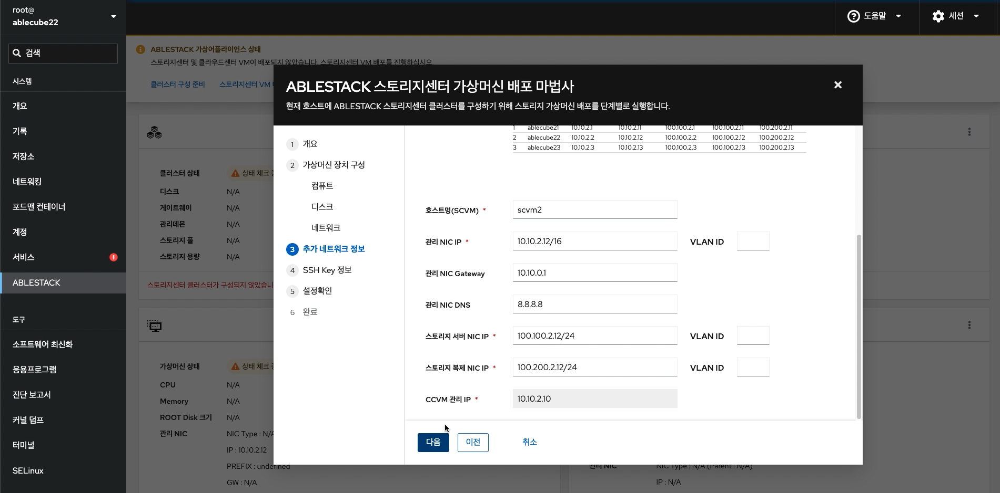{ align=center }

    - **관리 NIC Gateway** 를 입력 및 확인합니다.
    - **관리 NIC DNS** 를 입력 및 확인합니다.
    - **스토리지 서버 NIC IP** 를 입력 및 확인합니다.
    - **스토리지 복제 NIC IP** 를 입력 및 확인합니다.
    - **CCVM 관리 IP** 를 확인합니다.

    !!! info
        스토리지센터 가상머신 배포시 ablecube 호스트에서 설정파일 읽어와 일부 정보를 자동세팅되며 입력 정보를 정확히 확인해야 합니다.
        해당 화면의 IP 정보 는 예제 입니다. IP 정보는 사이트 정보에 맞춰서 수정해야 합니다.

6. SSH Key 정보
    { align=center }
    - SSH Key 정보를 확인하는 화면입니다.
    - 클러스터 구성시 호스트에 등록된 호스트의 키 정보로 자동세팅됩니다.

    !!! info
        SSH 개인 Key 파일 명은 **id_rsa**, SSH 공개 Key 파일명은 **id_rsa.pub** 으로 고정되어 있습니다.
        다운로드한 Key 의 파일 명을 수정할 경우 등록이 불가능 합니다.

7. 설정확인
    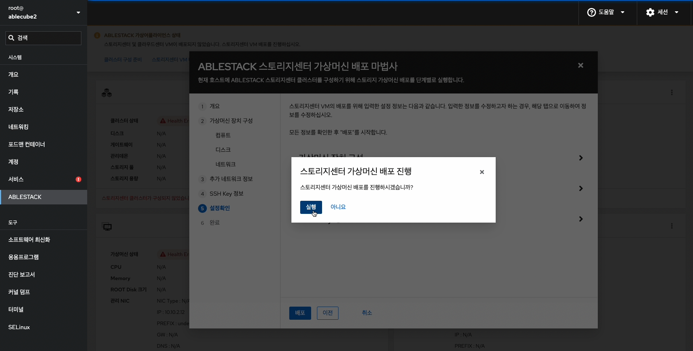{ align=center }
    - 스토리지센터 가상머신 배포를 위한 구성정보 확인하는 화면입니다.
    - **배포** 버튼을 클릭하면 확인창이 보이며 **실행** 버튼을 눌러 스토리지 가상머신을 배포 합니다.

8. 배포
    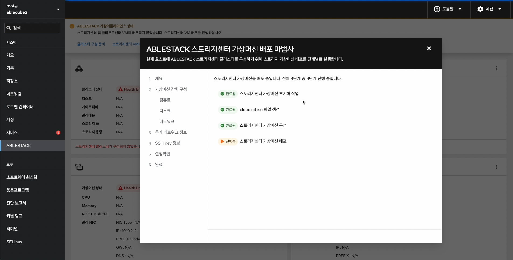{ align=center }
    - 스토리지센터 가상머신 배포 진행상황을 확인 할 수 있는 화면입니다.

9. 완료
    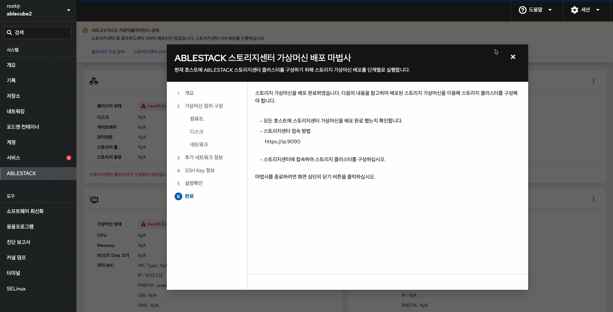{ align=center }
    - 스토리지센터 가상머신 배포 완료 후 화면입니다.

10. 스토리지센터 가상머신 상태 확인
    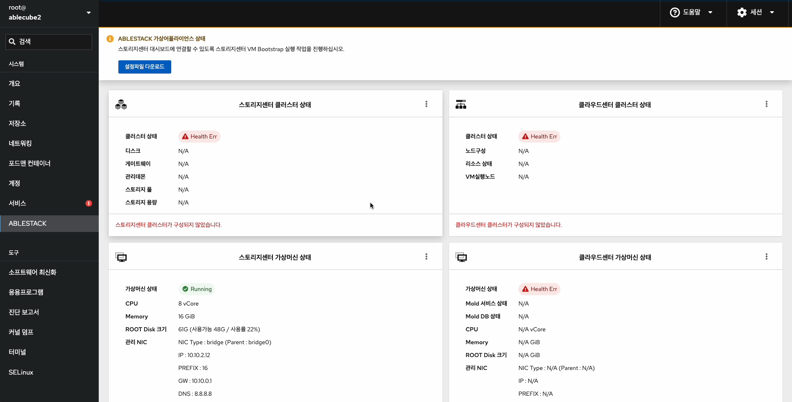{ align=center }
    - 스토리지센터 가상머신 상태 카드에서 가상머신 상태가 **Running** 인지 확인합니다.

## 클러스터 구성 준비(3번  호스트)

!!! info
    3번 호스트 구성 방법 입니다. 3번 호스트 구성방법은 IP 설정 및 호스트 이름 제외하고는 2번 호스트와 동일합니다.

1. 개요
   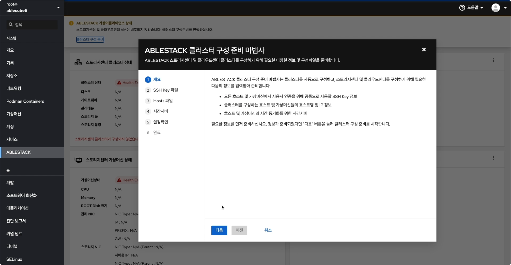{ align=center }
    - 상단 리본의 **클러스터 구성 준비** 링크를 클릭하면 보이는 화면입니다.
    - ABLESTACK 구성을 하는데 필요한 정보를 입력 받아 클러스터 구성을 준비하는 마법사 화면입니다.
    - **다음** 버튼을 눌러 클러스터 구성 준비를 시작합니다.

2. 클러스터 종류
    { align=center }
    - 클러스터 종류를 설정하는 화면입니다.
    - **ABLESTACK-HCI** 를 선택합니다.
    - **다음** 버튼을 클릭하여 클러스터 종류를 선택합니다.

2. SSH Key 파일(기존파일사용)
   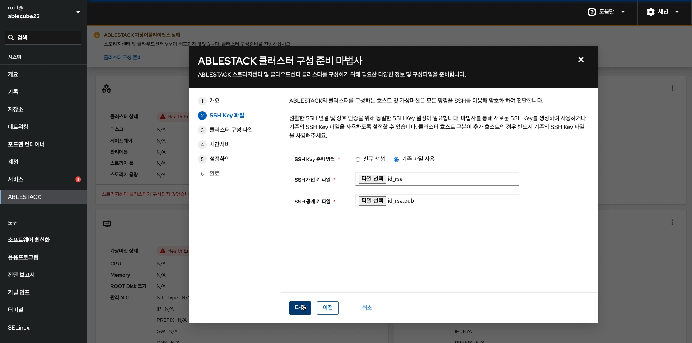{ align=center }
    - 모든 호스트 및 가상 머신은 동일한 SSH Key 를 공유하고 있어야 구성이 가능합니다.
    - **SSH Key 준비 방법** 에서 **기존 파일 사용** 을 선택하고 **SSH 개인 Key** 와 **SSH 공개 Key** 를 **파일 선택** 버튼을 눌러 1번 호스트 클러스터 구성 준비 단계에서
    다운로드한 SSH Key 를 등록합니다.

    !!! info
        SSH 개인 Key 파일 명은 **id_rsa**, SSH 공개 Key 파일명은 **id_rsa.pub** 으로 고정되어 있습니다.
        다운로드한 Key 의 파일 명을 수정할 경우 등록이 불가능 합니다.

3. 클러스터 구성 파일
    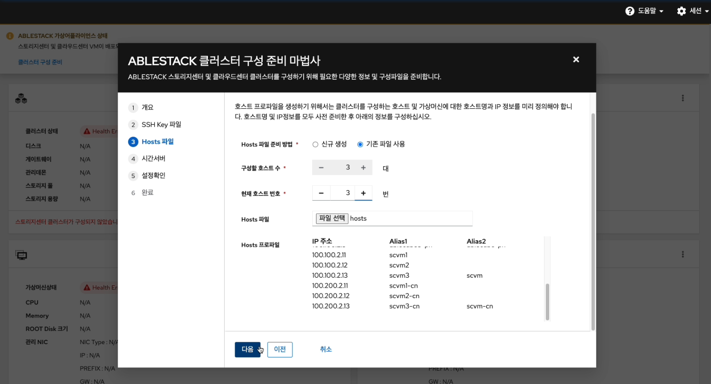{ align=center }
    - 클러스터 구성 설정하는 화면입니다. **클러스터 호스트 구분** 을 **신규 클러스터 호스트** 로 선택한다.
    - **클러스터 구성 파일 준비** 에서 **기존 파일 사용** 을 선택합니다.
    - **클러스터 구성 파일** 에서 cluster.json 파일을 업로드 클러스터 정보를 자동입력 합니다.
    - **현재 호스트명** 은 해당 호스트의 이름을 자동으로 불러옵니다.
    - **구성 호스트 수** 는 기존 파일 사용 선택시 수정 불가능 상태가 됩니다.
    - **클러스터 구성 프로파일** 정보를 확인합니다.
    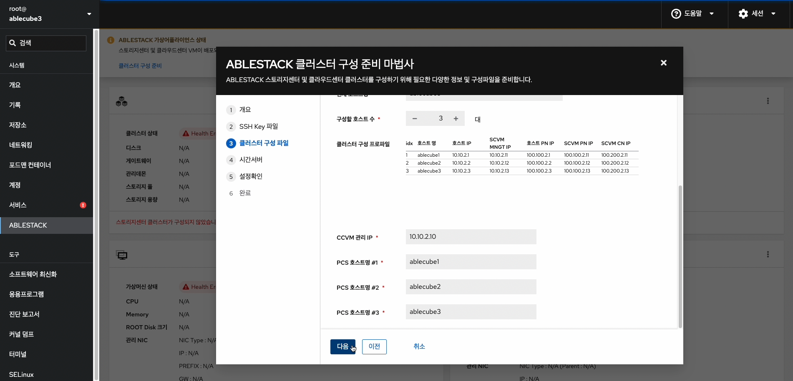{ align=center }
    - **CCVM 관리 IP** 정보를 확인합니다.
    - **관리 NIC CIDR** 정보를 입력 합니다.
    - **관리 NIC Gateway** 정보를 입력 합니다.
    - **관리 NIC DNS** 정보를 입력 합니다.
    - **PCS 호스트명 PN IP #1** 정보를 입력 합니다.
    - **PCS 호스트명 PN IP #2** 정보를 입력 합니다.
    - **PCS 호스트명 PN IP #3** 정보를 입력 합니다.
    - 위 항목을 입력 및 확인 후에 **다음** 버튼을 클릭합니다.

    !!! info
        idx 순서에 맞게 호스트 명과 ip 정보를 입력해야 합니다. 
        현재 호스트명을 자동으로 불러오며, 클러스터 구성 프로파일에 현재 호스트명과 동일한 호스트 명이 존재해야 합니다. 
        호스트 파일을 신규로 구성 호스트 수를 선택하면 하단의 호스트 파일에 호스트 수 만큼의 예제 항목이 생성됩니다. 

    !!! example
        - 호스트 프로파일 예제

        idx | 호스트 명 | 호스트 IP | SCVM MNGT IP | 호스트 PN IP | SCVM PN IP | SCVM CN IP
        :---: | :-------: | :-------: | :-------: | :-------: | :-------: | :-------:
        1 | ablecube1 | 10.10.2.1 | 10.10.2.11 | 100.100.2.1 | 100.100.2.11 | 100.200.2.11
        2 | ablecube2 | 10.10.2.2 | 10.10.2.12 | 100.100.2.2 | 100.100.2.12 | 100.200.2.12
        3 | ablecube3 | 10.10.2.3 | 10.10.2.13 | 100.100.2.3 | 100.100.2.13 | 100.200.2.13

4. 시간서버
   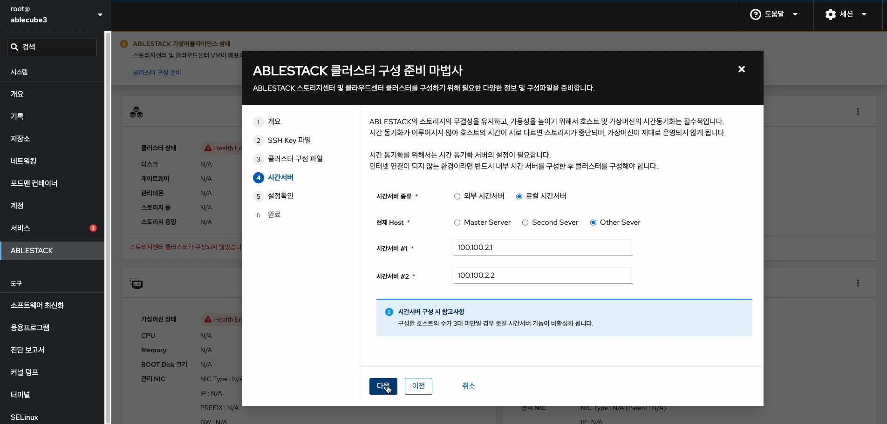{ align=center }
    - 시간 서버 구성하는 화면입니다.
    - 클러스터 구성 정보를 토대로 시간 서버 입력값을 기본 세팅합니다.
    - 기본적으로 idx1 = Master Server, idx2 = Second Server, idx3 이상 = Other Server로 설정 됩니다.
    - 설정된 값을 확인한 후, **다음** 버튼을 클릭합니다.

5. 설정확인
   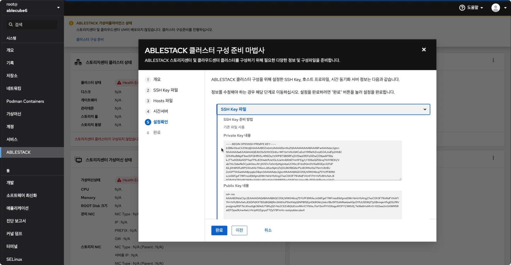{ align=center }
    - 구성 준비에 입력값에 대한 설정을 확인하는 화면입니다.
    - 설정된 값을 확인 후 이상이 없는경우 **완료** 버튼을 클릭합니다.

6. 완료
    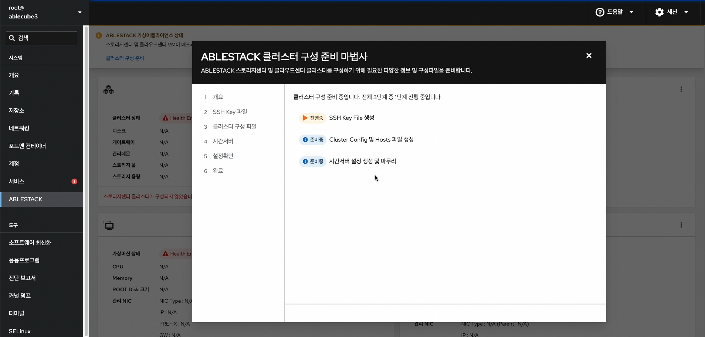{ align=center }
    - 클러스터 구성 준비 3단계 진행상황을 확인합니다.
    - 정상적으로 끝날 경우 완료 화면이 호출 됩니다.

    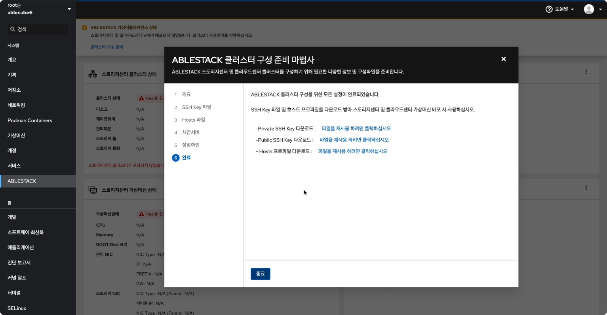{ align=center }

    - 3번 호스트의 사전구성 완료 화면입니다.

    !!! info
        SSH Key 및  클러스터 구성 파일은 1번 호스트에서 다운로드 하셨다면 해당 화면에서 다운로드 하지 않으셔도 됩니다.

## 스토리지센터 가상머신 배포(3번 호스트)
1. 개요
   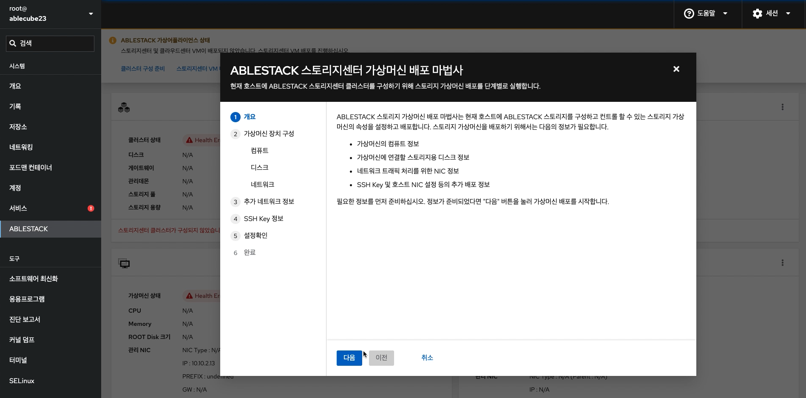{ align=center }
    - ABLESTACK 스토리지센터 가상머신 배포 마법사 화면입니다.

2. 가상머신 장치 구성 - 컴퓨트
   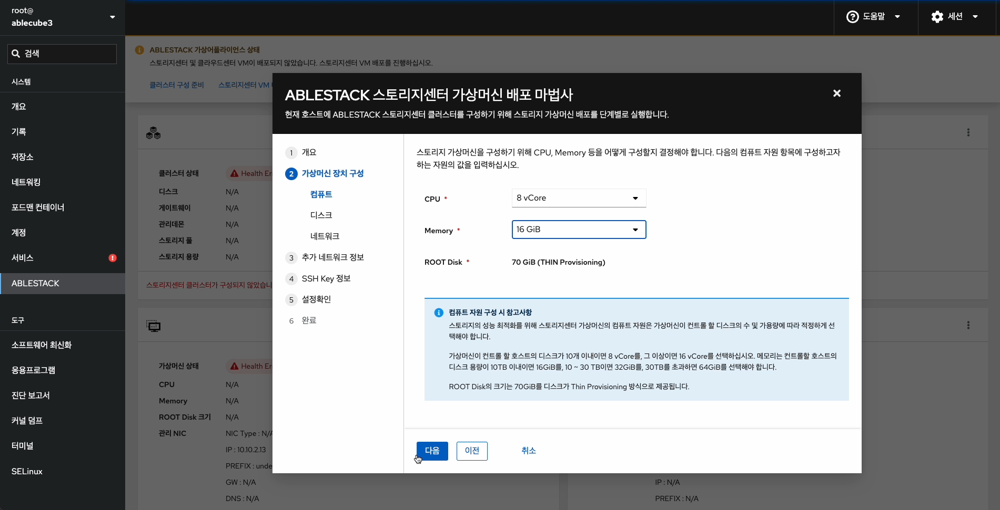{ align=center }
    - 스토리지센터 가상머신 장치 구성의 CPU, Memory 구성 화면입니다.
    - **CPU** 는 **8 vCore** 를 선택 하고, **Memory** 는 **16GiB** 를 선택 하고 **다음** 버튼을 클릭합니다.

    !!! tip
        스토리지의 성능 최적화를 위해 스토리지센터 가상머신의 컴퓨트 자원은 가상머신이 컨트롤 할 디스크의 수 및 가용량에 따라 적정하게 선택해야 합니다.
        CPU 는 컨트롤 할 호스트의 디스크가 **10개** 이내이면, **8 vCore** 를 그이상이면 **16 vCore** 를 선택히시면 됩니다.
        Memory 는 컨트롤 할 호스트의 디스크 용량이 **10 TB** 이내이면, **16 GiB**, **10 ~ 30 TB** 이면 **32 GiB**, **30 TB** 를 초과하면 **64 Gib**
        를 선택하시면 됩니다.
        ROOT 디스크는 **70 Gib** 고정입니다.

3. 가상머신 장치구성 - 디스크
   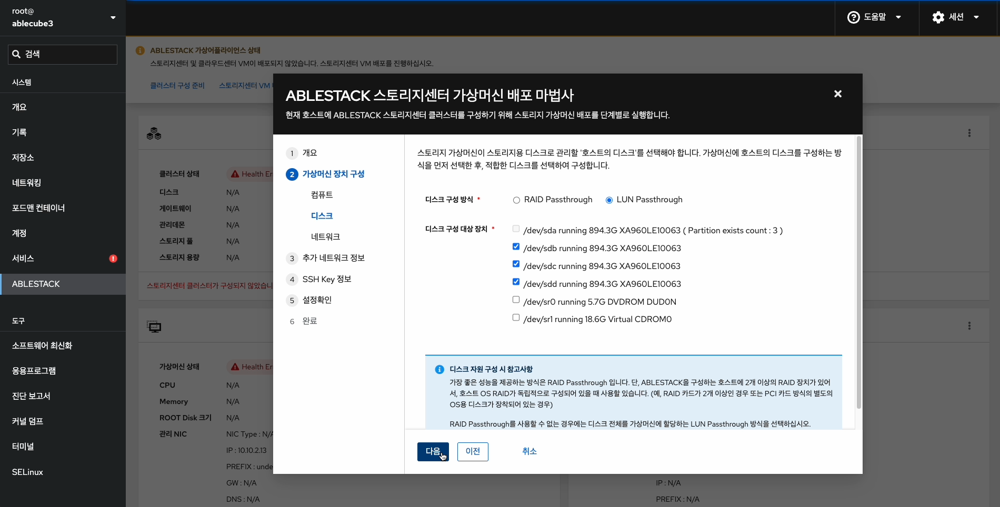{ align=center }
    - 스토리지 센터 가상머신 장치의 디스크 구성 화면입니다.
    - **디스크 구성 방식** 은 **LUN Passthrough** 를 선택하고 **Glue 스토리지로 사용할 디스크** 를 선택하고 **다음** 버튼을 클릭 합니다.

    !!! warning
        가상머신 장치 구성 - 디스크 구성시 파티션이 구성된 디스크의 선택을 하시면 안됩니다.
        만약에 파티션이 구성된 디스크를 선택을 하고 가상 머신을 구성하시면 ABLESTACK Cube 가 삭제가 될 수 있습니다.

4. 가상머신 장치구성 - 네트워크
   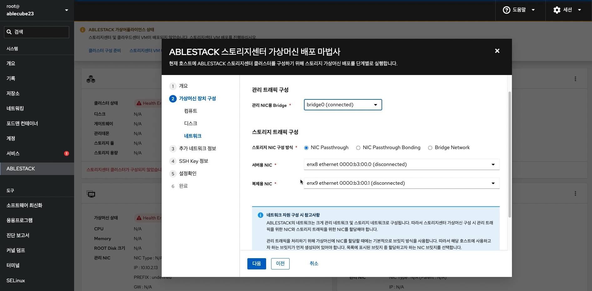{ align=center }
    - 스토리지 센터 가상머신 장치의 네트워크 구성 화면입니다.
    - **관리 NIC 용 Bridge** 선택 박스에서 **관리용 Bridge 네트워크** 를 선택합니다.
    - **스토리지 NIC 구성 방식** 에서 **NIC Passthrough** 를 선택하고 **서버용 NIC** 선택 박스에서는 **서버용으로 사용할 NIC** 를 **복제용 NIC**
    선택 박스에서는 **복제용으로 사용할 NIC** 을 선택하고 **다음** 버튼을 클릭합니다.

5. 추가 네트워크 정보
    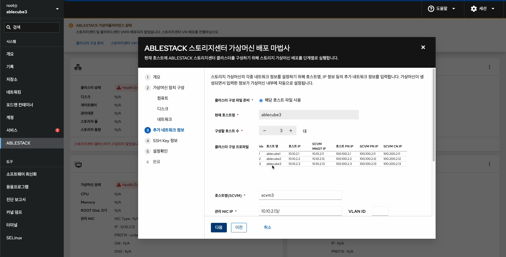{ align=center }
    - **클러스터 구성 파일 준비** 해당 호스트 파일 사용으로 자동 선택되며, ablecube 호스트 설정 정보를 자동으로 읽어와 클러스터 구성 정보 및 네트워크 IP 정보를 세팅합니다.
    - **호스트명(SCVM)** 을 입력 및 확인합니다.
    - **관리 NIC IP** 를 입력 및 확인합니다.

    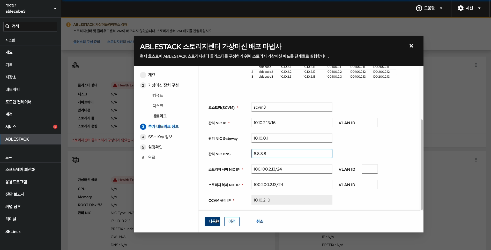{ align=center }

    - **관리 NIC Gateway** 를 입력 및 확인합니다.
    - **관리 NIC DNS** 를 입력 및 확인합니다.
    - **스토리지 서버 NIC IP** 를 입력 및 확인합니다.
    - **스토리지 복제 NIC IP** 를 입력 및 확인합니다.
    - **CCVM 관리 IP** 를 확인합니다.

    !!! info
        스토리지센터 가상머신 배포시 ablecube 호스트에서 설정파일 읽어와 일부 정보를 자동세팅되며 입력 정보를 정확히 확인해야 합니다.
        해당 화면의 IP 정보 는 예제 입니다. IP 정보는 사이트 정보에 맞춰서 수정해야 합니다.

6. SSH Key 정보
    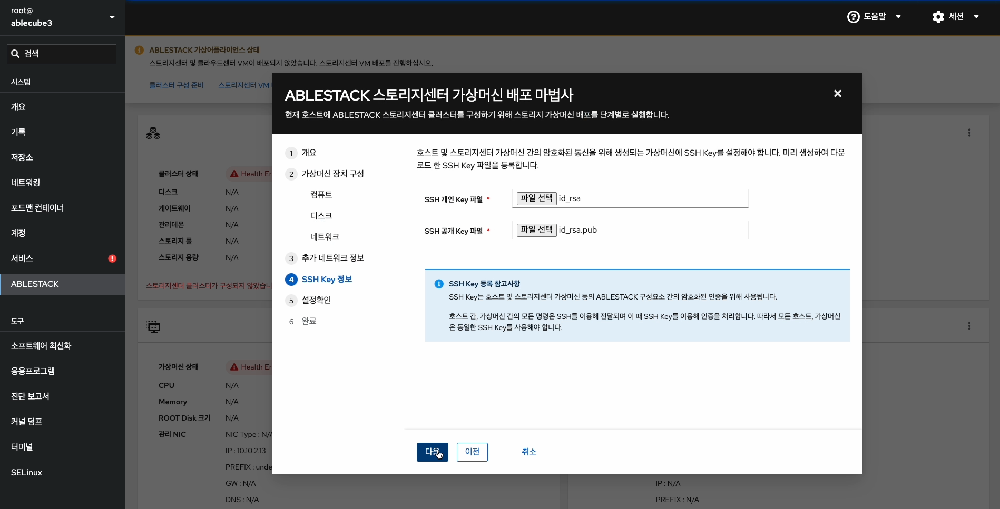{ align=center }
    - SSH Key 정보를 확인하는 화면입니다.
    - 클러스터 구성시 호스트에 등록된 호스트의 키 정보로 자동세팅됩니다.

    !!! info
        SSH 개인 Key 파일 명은 **id_rsa**, SSH 공개 Key 파일명은 **id_rsa.pub** 으로 고정되어 있습니다.
        다운로드한 Key 의 파일 명을 수정할 경우 등록이 불가능 합니다.

7. 설정확인
    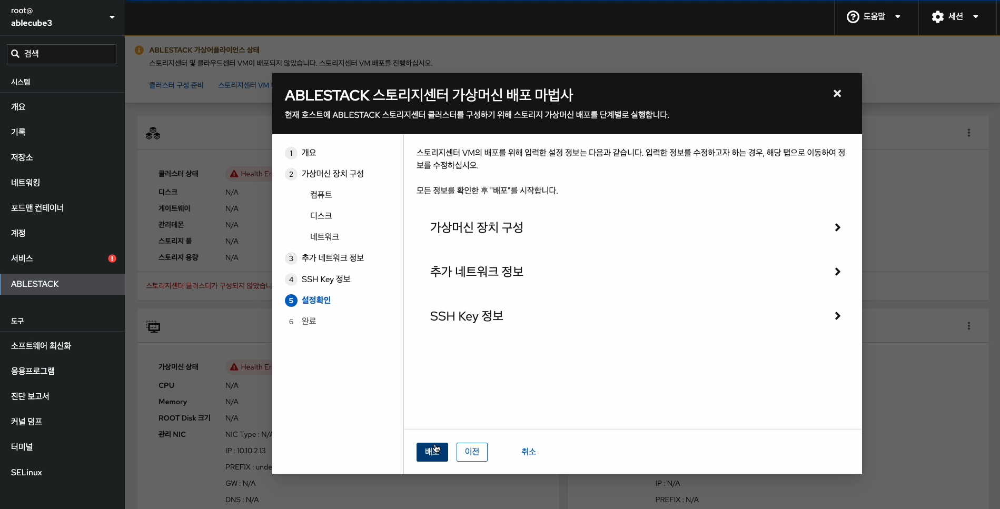{ align=center }
    - 스토리지센터 가상머신 배포를 위한 구성정보 확인하는 화면입니다.
    - **배포** 버튼을 클릭하면 확인창이 보이며 **실행** 버튼을 눌러 스토리지 가상머신을 배포 합니다.

8. 배포
    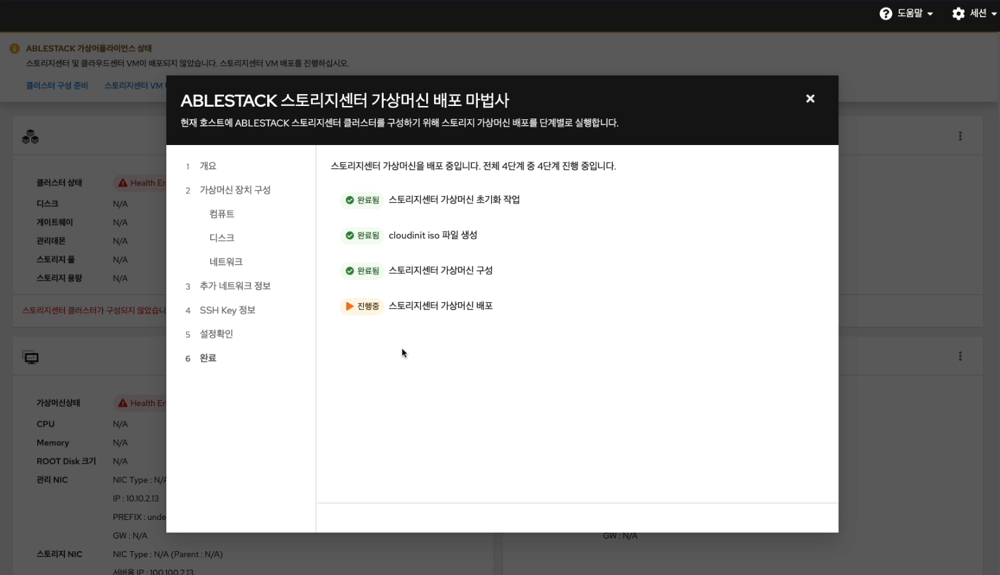{ align=center }
    - 스토리지센터 가상머신 배포 진행상황을 확인 할 수 있는 화면입니다.

9. 완료
    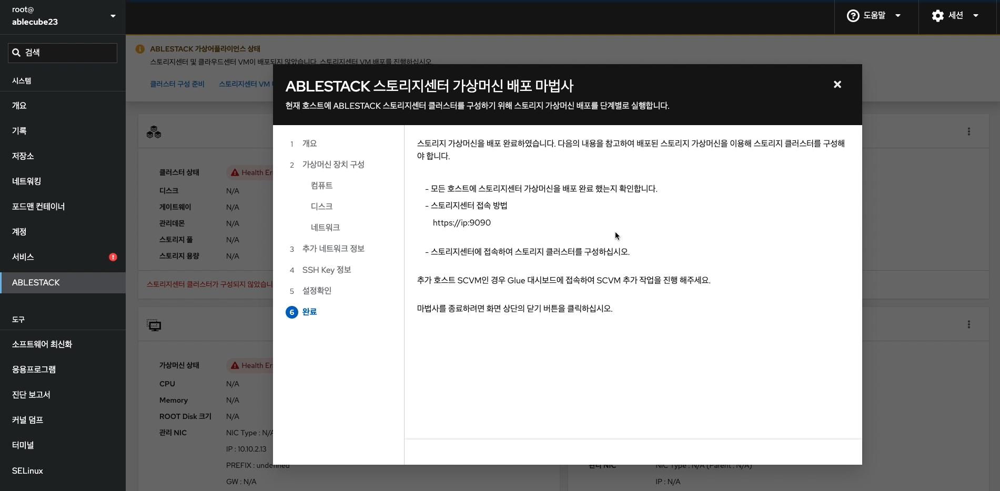{ align=center }
    - 스토리지센터 가상머신 배포 완료 후 화면입니다.

10. 스토리지센터 가상머신 상태 확인
    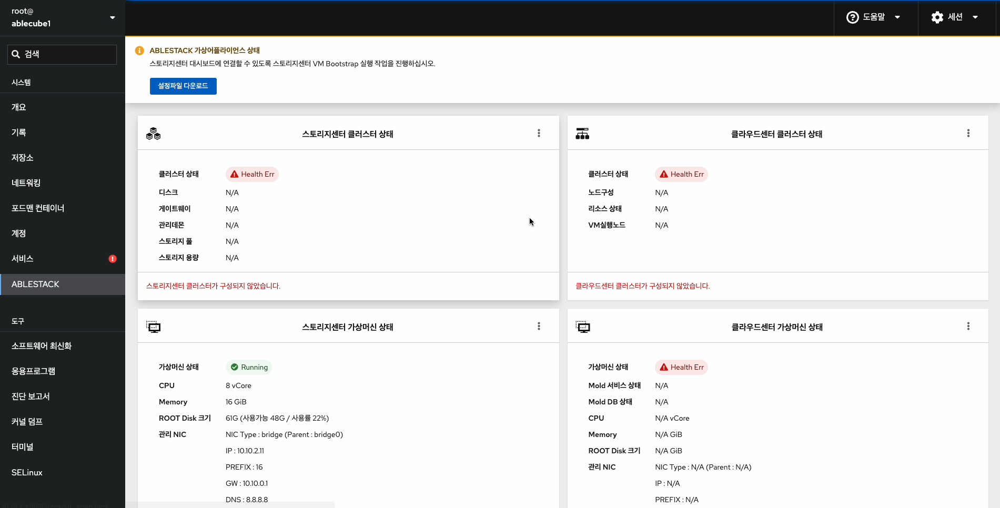{ align=center }
    - 스토리지센터 가상머신 상태 카드에서 가상머신 상태가 **Running** 인지 확인합니다.

!!! info
    1번, 2번, 3번 호스트의 스토리지 센터 가상머신 생성이 마무리 되였습니다. ABLESTACK Glue 대쉬보드 사용을 위한 절차를 진행 후 Glue 대시보를 이용하여 스토리지 센터 클러스터를 구성하시면 됩니다.

!!! check
    모든 스토리지센터 가상머신이 배포가 된 후에는 각 호스트 및 스토리지센터 가상머신간의 네트워크 통신이 정상적으로 되는지 확인이 반드시 필요합니다. 
    관리 네트워크 및 스토리지 네트워크간의 PING 체크를 통하여 정상적으로 통신이 되는지 확인 후 다음 단계를 진행하여야 하며, 통신이 정상적이지 않을 경우에는 네트워크 구간을 체크하여야 합니다. 
    특히 스토리지 네트워크(스토리지 서버 네트워크, 스토리지 복제 네트워크)간에는 일반 PING 과 점보프레임 PING 체크를 해야 합니다. 
    점보프레임 PING 체크는 "ping -M do -s 8972 [IP주소]" 를 통하여 수행 합니다

## 스토리지센터 클러스터 구성
스토리지센터 클러스터 구성은 ABLESTACK Glue 대시보드를 이용하여 구성을 할 수 있습니다.
Glue 대시보드를 실행하기 위해서는 **Bootstrap** 우선 실행해야 하며 **Bootstrap** 실행 및 스토리지센터 클러스터 구성 절차에 대하여 설명하고 있습니다.

!!! caution
    **Bootstrap** 은 한개의 호스트에서 한번의 실행이 되야 합니다. **(1번 ablecube 호스트에서 실행시키는 것을 권장합니다.)**

    사용자의 실수를 방지하기 위하여 **Bootstrap** 이 실행되면 실행된 호스트를 포함하여 다른 호스트에서도 **Bootstrap** 을 실행하지 못하도록 버튼이 사라집니다.

1. Bootstrap 실행
    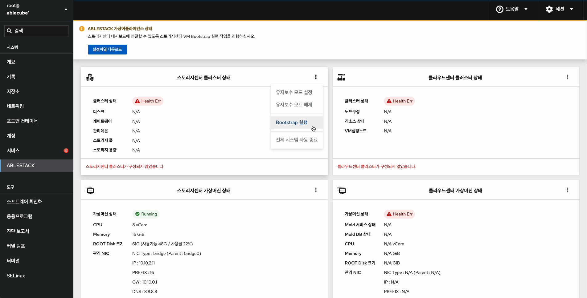{ align=center }
    - 1번 호스트의 ABLESTACK Cube 웹 콘솔로 이동합니다.
    - 스토리지센터 클러스터 상태 카드의 메뉴 버튼을 클릭하여 **Bootstrap 실행** 버튼을 클릭합니다.
    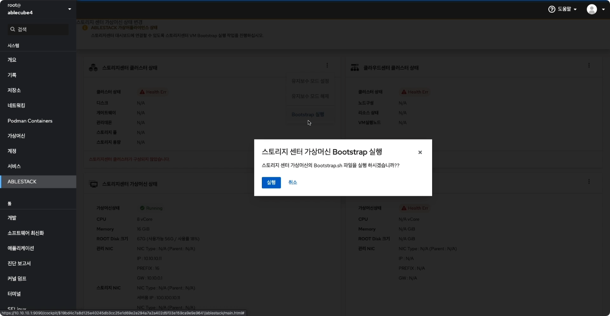{ align=center }
    - **실행** 버튼을 클릭하여 **Bootstrap** 을 실행시킵니다.
    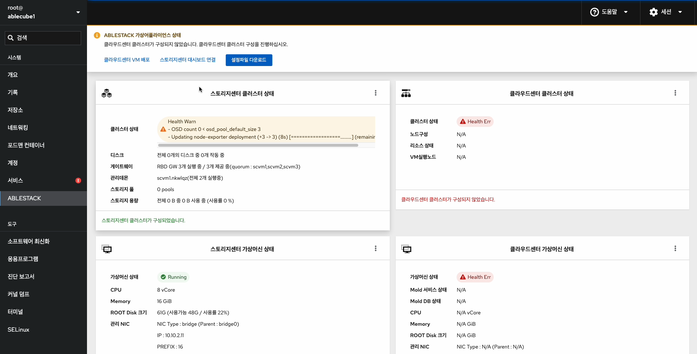{ align=center }
    - **Bootstrap** 이 정상적으로 실행되면 스토리지센터 클러스터 상태 카드에서 클러스터 상태가 **Health Warn** 으로 표시됩니다.
    - 상단 리본에서 **스토리지센터 대시보드 연결** 링크를 클릭하여 ABLESTACK Glue 대시보드여 접속합니다.

    !!! important
        Bootstrap 은 1개의 호스트에서만 실행 됩니다. 1번 호스트에서 실행이 된경우에는 2번, 3번 호스트에서는 **Bootstrap 실행** 버튼이 사라지게 됩니다.

    !!! tip
        크롬을 이용하여 **스토리지센터 대시보드** 접속 할 경우 **연결이 비공개로 설정되어 있지 않습니다.** 문구와 함게 페이지를 열 수 없습니다.
        이 경우에는 해당 화면에서 **thisisunsafe** 입력 후 엔터키를 입력하면 해당 페이지에 접속 할 수 있습니다.

2. Glue 대시보드 접속 및 비밀번호 변경
    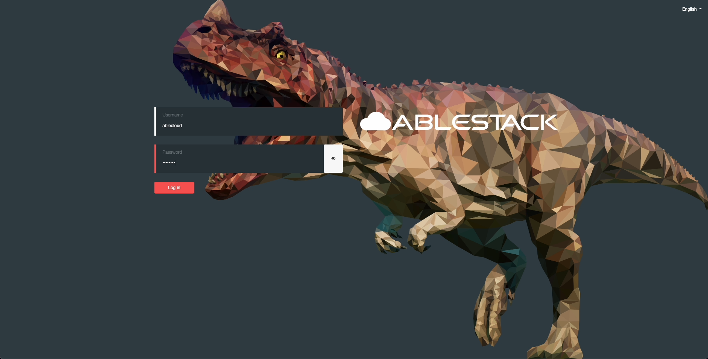{ align=center }
    - Glue 대시보드 로그인 화면입니다.
    - **사용자 이름** 과 **비밀번호** 를 입력하고 **로그인** 버튼을 클릭하여 로그인 합니다.

    !!! info
        ABLESTACK Glue 대시보드 로그인 사용자 이름 은 **admin**, 초기 비밀번호 는 **password** 입니다.
        해당 계정 및 비밀번호로 최초 로그인을 하시면 비밀번호를 무조건 변경 하셔야 합니다.

    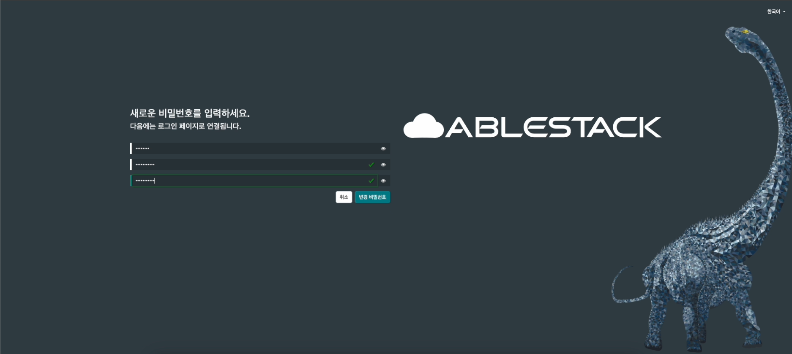{ align=center }
    - 초기 비밀번호 변경하는 화면입니다.
    - **Old password** 입력창에는 기존의 비밀번호를 입력하고 **New password** 와 **Confirm new password** 입력창에 신규 비밀번호를 입력하고 **Change Password** 버튼을 클릭합니다.

    !!! info
        초기 비밀번호를 변경하시고 나면 바뀐 비밀번호로 다시 로그인 하셔야 합니다.

3. 클러스터 구성 정보 준비
    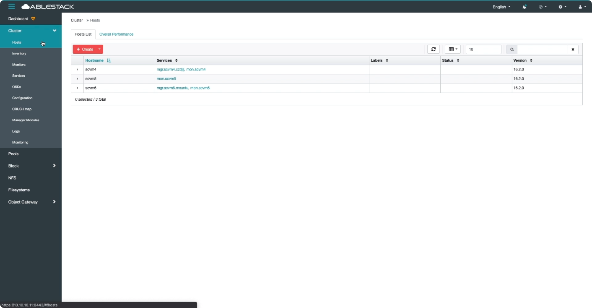{ align=center }
    - 첫 화면에서 보여지는 클러스터 구성 준비 화면입니다.

    !!! check
        Hostname 에 추가된 Host 정보를 확인하셔야 합니다. ABLESTACK Cube 가 설치된 모든 호스트가 정상적으로 추가 되여 있는지 확인하셔야 합니다.
        Services 항목은 이미지와 동일한 순서대로 입력이 안되어 있을 수도 있습니다.

    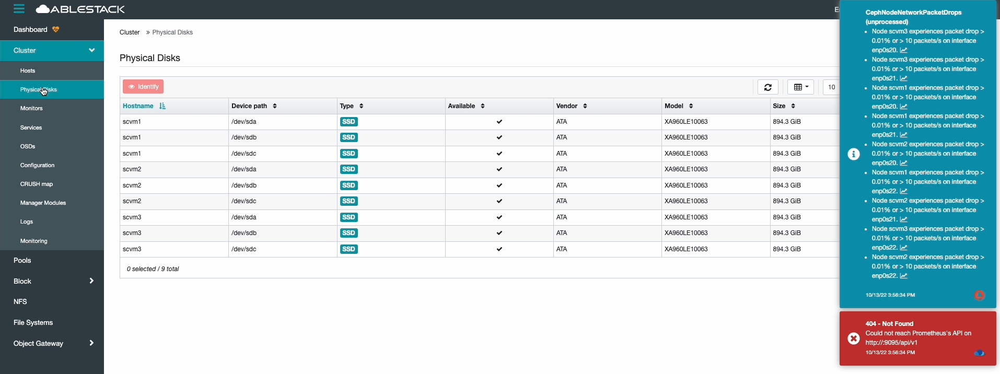{ align=center }
    - **Expend Cluster** 를 클릭하면 보여지는 클러스터 구성될 Host 정보를 확인하는 화면입니다.
    - Bootstrap 실행시 Hosts 파일의 정보를 자동으로 읽어와 호스트에 자동으로 추가가 됩니다.

    !!! check
        스토리기센터 가상머신 배포 마법사에서 선택한 디스크 수량, Type, Size 항목이 정상인지 확인하셔야 합니다.
        또한 Available 항목이 모든 디스크에 체크가 되여 있는지 확인 하셔야 합니다.

4. 스토리지 디바이스 추가
    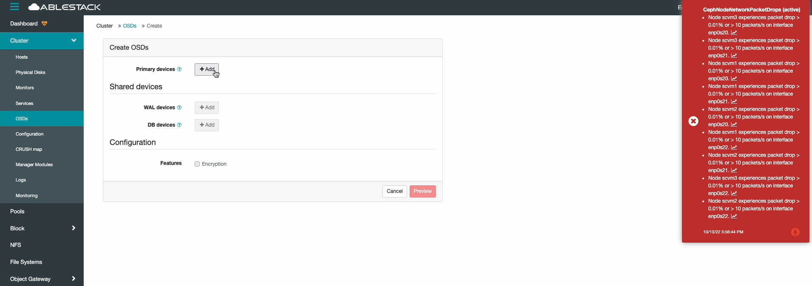{ align=center }
    - 스토리지 디바이스 추가하는 화면입니다. **Primary 장치** 항목의 **추가** 버튼을 클릭합니다.
    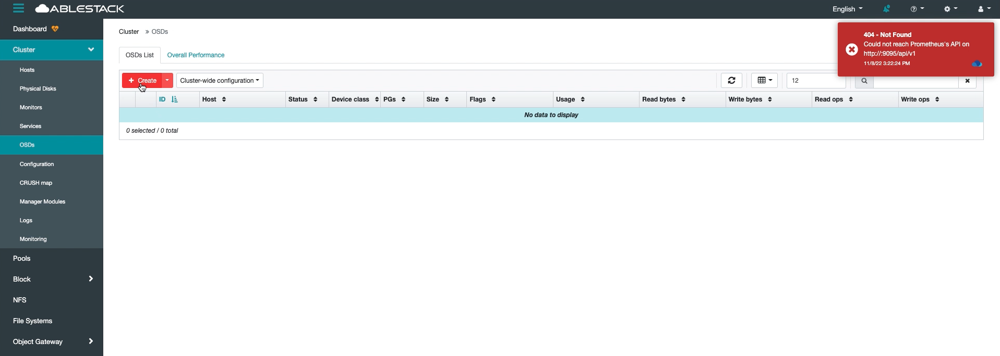{ align=center }
    - 스토리지 디바이스를 선택하는 화면입니다. 오른쪽 상단의 **호스트 이름** 으로 되여있는 Filter 클릭하여 **형태** 으로 변경하고, **Any** 로 되여있는 Filter 를 클릭하여 **ssd** 를 선택합니다.
    - 추가된 스토리지 디바이스의 수량 및 Size 를 확인하고 이상 없는 경우 **추가** 버튼을 클릭합니다.
    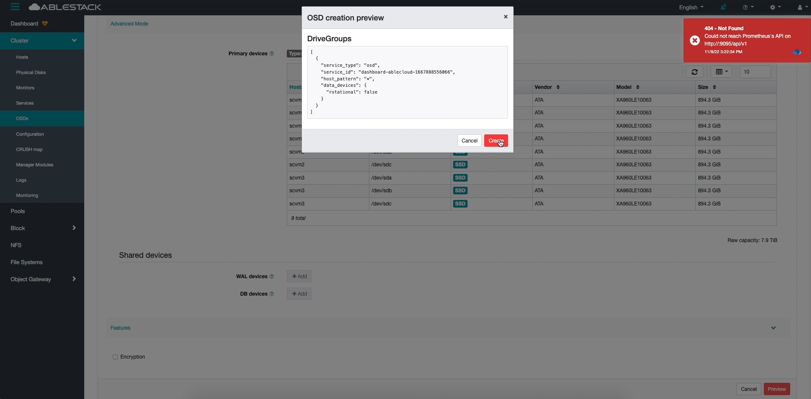{ align=center }
    - 알맞게 들어 갔는지 확인 후, **다음** 버튼을 클릭합니다.

5. 스토리지 서비스 생성
    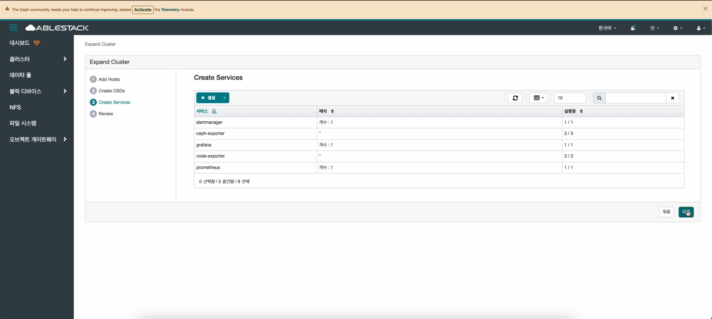{ align=center }
    - Glue를 시작하기에 기본적인 서비스들을 생성하여 시작합니다.
    - 확인 후, **다음** 버튼을 클릭합니다.

6. Glue 확인
    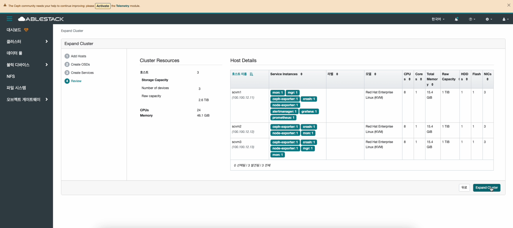{ align=center }
    - 설정 했던 값들이 올바르게 설정이 되었는 지 확인합니다.
    - 확인이 끝났으면 **Expand Cluster** 를 클릭하여 설정합니다.
    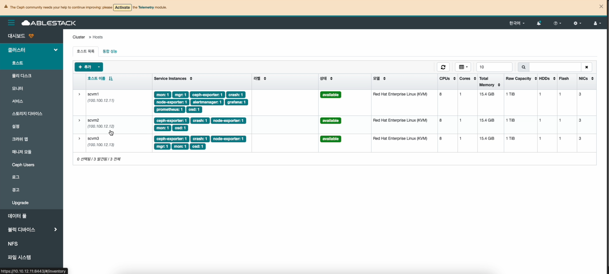{ align=center }
    - 설정한 **호스트** 들이 정확하게 생성 되었는 지 확인합니다.
    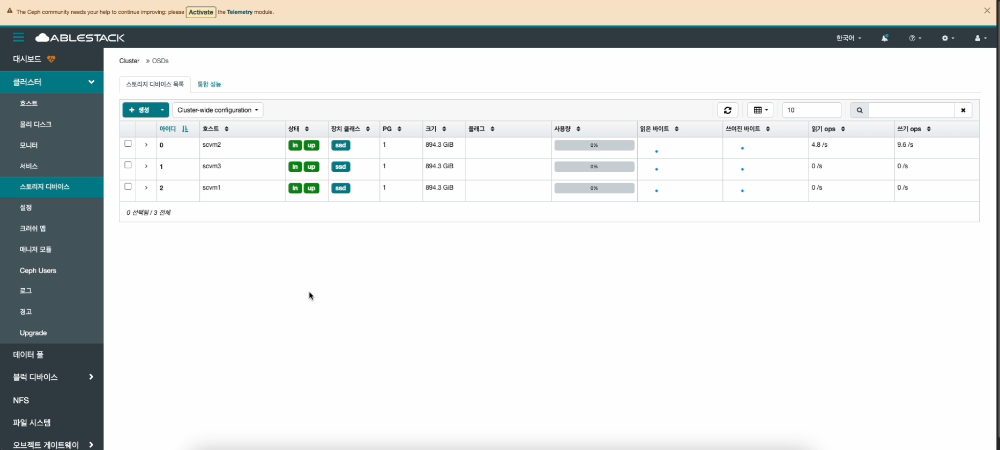{ align=center }
    - 설정한 **스토리지 디바이스** 들이 정상적으로 동작하는 지 상태가 **in , up** 인지 확인합니다.
    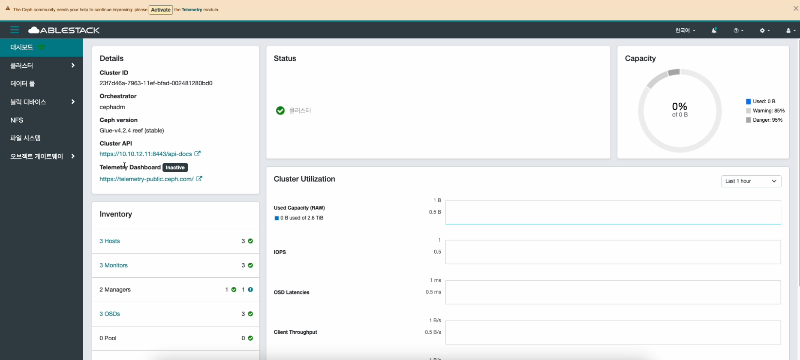{ align=center }
    - 설정한 모든 게 정상적인 상태임을 나타내는 화면입니다.

7. 데이터 풀 생성
    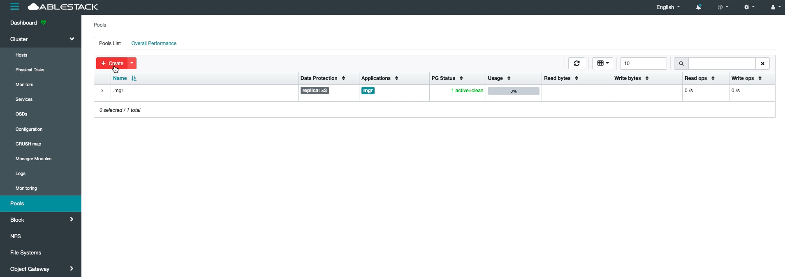{ align=center }
    - **데이터 풀** 메뉴를 클릭하면 보이는 화면입니다. **생성** 버튼을 클릭하여 데이터 풀 생성 화면으로 들어갑니다.
    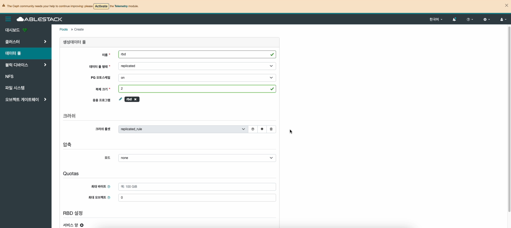{ align=center }
    - **이름** 항목에 **rbd** 입력, **데이터 풀 형태** 선택 박스에서 **replicated** 를 선택, **PG 오토스케일** 선택 박스에서 **on** 을 선택,
    **복제크기** 항목에 **2** 입력, **응용 프로그램** 항목에서 **편집** 버튼을 클릭하여 **rbd** 항목을 선택합니다.

8. ABLESTACK 확인
    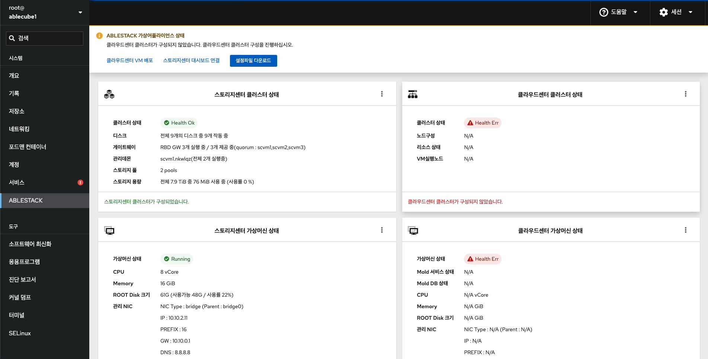{ align=center }
    - ABLESTACK 메인화면에서 스토리지센터 클러스터 상태 카드에서 클러스터가 상태가 **Health OK** 인지 확인합니다.

!!! info
    ABLESTACK Glue 구성이 완료되었습니다.
    ABLESTACK Mold 구성도 ABLESTACK Cube 웹 콘솔을 이용하여 할 수 있습니다.