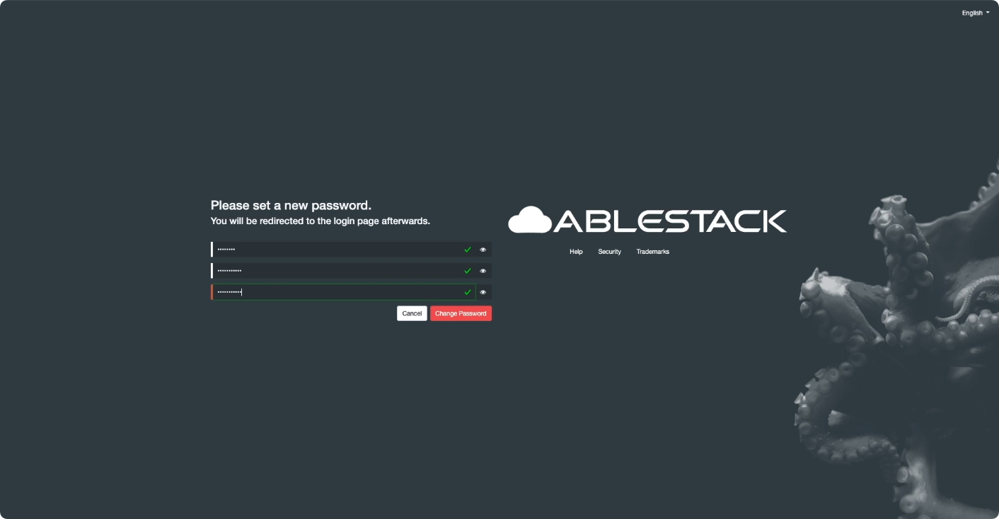
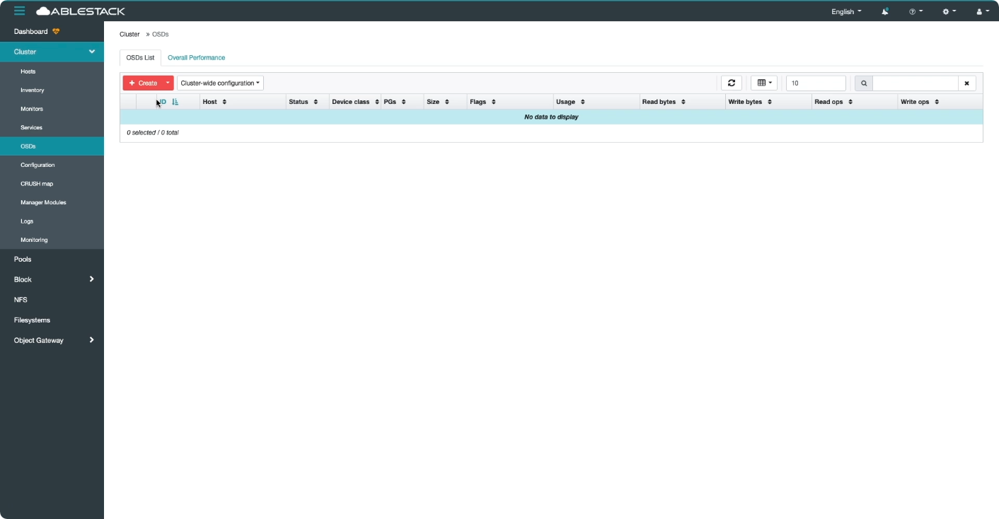
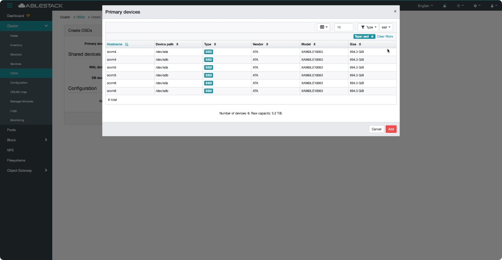
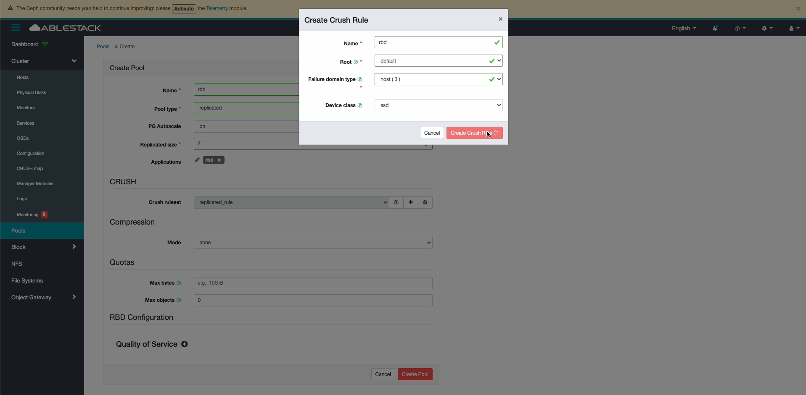
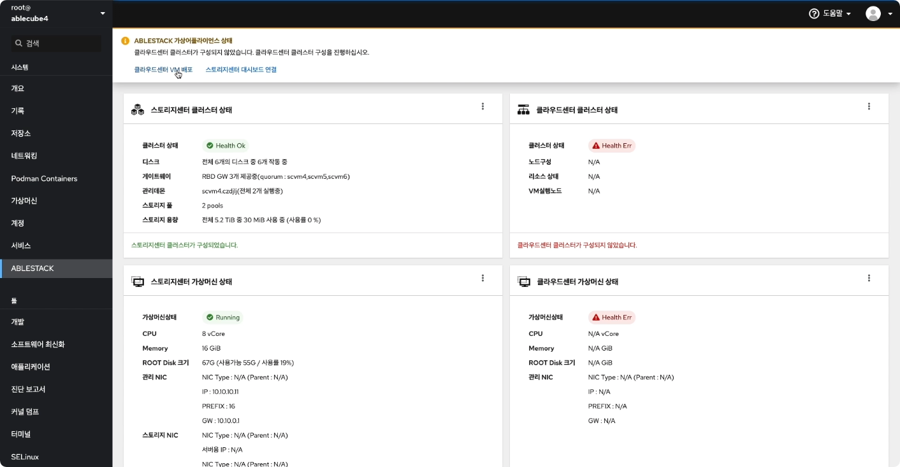

!!! danger 
    이 문서는 기술지원 용도의 문서입니다. 기술지원 엔지니어가 아닌 사용자가 조작할 때 시스템에 문제가 발생할 수 있습니다.

# ABLESTACK Glue 설치진행
ABLESTACK Glue 설치 진행 가이드 입니다.  
이 문서에서는 ABLESTACK Glue 용 가상머신 생성 및 해당 가상머신에서 공용 스토리지 생성절차를 가이드 하고 있습니다.
ABLESTACK Cube 의 웹콘솔과 ABLESTACK Glue 웹콘솔을 이용하여 진행이 되며 웹 접속 IP는 별도의 표시를 하지 않고 진행됩니다.  
기존에 구성된 IP 정보에 맞게 웹콘솔을 접속 하시면 됩니다.

## ABLESTACK 메인 화면  
{ align=center }
- 왼쪽 ABLESTACK 메뉴 클릭시 보이는 화면입니다.
    
## 클러스터 구성 준비(1번 호스트)

!!! info
    1번 호스트 구성 방법 입니다. 

1. 개요
    { align=center }
    - 상단 리본의 **클러스터 구성 준비** 링크를 클릭하면 보이는 화면 입니다.
    - ABLESTACK 구성을 하는데 필요한 정보를 입력 받아 클러스터 구성을 준비하는 마법사 화면입니다.
    - **다음** 버튼을 눌러 클러스터 구성 준비를 시작합니다.
    
2. SSH Key 파일(신규생성)
    { align=center }
    - 모든 호스트 및 가상 머신은 동일한 SSH Key 를 공유하고 있어야 구성이 가능합니다.
    - **SSH Key 준비 방법** 에서 **신규 생성** 을 선택하고 **다음** 버튼을 클릭하여 신규 SSH Key 를 생성합니다.

3. Host 파일
    { align=center }
    - 호스트 파일 설정하는 화면입니다. **구성 호스트 수** 를 지정한 후에 **Hosts 파일 준비 방법** 에서 **신규 생성** 을 선택합니다.
    - **Host 프로파일** 에서 내용을 수정 한 후에 **다음** 버튼을 클릭합니다.  
    
    !!! info
        호스트 프로파일 작성 시 IP 및 Host Name, Alias 구분은 **탭(TAB)** 을 사용해야 합니다.
   
    !!! example
        - 호스트 프로파일 예제  
        10.10.10.10 ccvm-mngt   ccvm  
        10.10.10.1  ablecube4   ablecube  
        10.10.10.2  ablecube5  
        10.10.10.3  ablecube6  
        10.10.10.11 scvm4-mngt  scvm-mngt  
        10.10.10.12 scvm5-mngt  
        10.10.10.13 scvm6-mngt  
        100.100.10.11    scvm4   scvm  
        100.100.10.12    scvm5  
        100.100.10.13    scvm6  
        100.200.10.11    scvm4-cn    scvm-cn  
        100.200.10.12    scvm5-cn  
        100.200.10.13    scvm6-cn  

    !!! important
        호스트 프로파일 작성 시 구성중인 호스트 및 스토리지 VM의 IP 에는 **ablecube**, **scvm**, **scvm**, **scvm-cn** 을 뒤에 꼭 입력하셔야 합니다.  
   
4. 시간서버
    { align=center }
    - 시간 서버 구성하는 화면 입니다.
    - **시간서버 종류** 에서 **로컬 시간서버** 를 선택하고 **현재 Host** 를 **Host1** 을 선택합니다.
    - **시간서버 1** 에는 **100.100.10.1**, **시간서버 2** 에는 **100.100.10.2** **시간서버 3** 에는 **100.100.10.3** 을 
      입력하고 **다음** 버튼을 클릭합니다.
      
5. 설정확인
    { align=center }
    - 구성 준비에 입력값에 대한 설정을 확인하는 화면 입니다.
    - 설정된 값을 확인 후 이상이 없는경우 **완료** 버튼을 클릭합니다.
    
6. 완료
    { align=center }
    - 1번 호스트의 사전구성 완료 화면입니다.
    - **Private SSH Key**, **Public SSH Key**, **Host 프로파일** 을 재사용하기 위하여 링크를 클릭하여 다운로드 합니다.  
    
!!! info
    SSH Key 및 Host 프로파일을 다운로드 한 후에 2번 호스트, 3번 호스트 구성시 다운로드한 파일을 재사용 해야 정상적으로 구성이 됩니다.

## 스토리지센터 가상머신 배포(1번 호스트)
1. 개요
    { align=center }
    - ABLESTACK 스토리지센터 가상머신 배포 마법사 화면 입니다.

2. 가상머신 장치 구성 - 컴퓨트
    { align=center }
    - 스토리지센터 가상머신 장치 구성의 CPU, Memory 구성 화면입니다.
    - **CPU** 는 **8 vCore** 를 선택 하고, **Memory** 는 **16GiB** 를 선택 하고 **다음** 버튼을 클릭합니다.

    !!! tip
        스토리지의 성능 최적화를 위해 스토리지센터 가상머신의 컴퓨트 자원은 가상머신이 컨트롤 할 디스크의 수 및 가용량에 따라 적정하게 선택해야 합니다.  
        CPU 는 컨트롤 할 호스트의 디스크가 **10개** 이내이면, **8 vCore** 를 그이상이면 **16 vCore** 를 선택히시면 됩니다.  
        Memory 는 컨트롤 할 호스트의 디스크 용량이 **10 TB** 이내이면, **16 GiB**, **10 ~ 30 TB** 이면 **32 GiB**, **30 TB** 를 초과하면 **64 Gib** 
        를 선택하시면 됩니다.
        ROOT Disk의 크기는 **70GiB** 를 디스크가 **Thin Provisioning** 방식으로 제공됩니다.

3. 가상머신 장치구성 - 디스크
    { align=center }
    - 스토리지 센터 가상머신 장치의 디스크 구성 화면입니다.
    - **디스크 구성 방식** 은 **LUN Passthrough** 를 선택하고 **공유스토리지로 사용할 디스크** 를 선택하고 **다음** 버튼을 클릭 합니다.
    
    !!! warning
        가상머신 장치션 구성 - 디스크 구성시 파티션이 구성된 디스크의 선택을 하시면 안됩니다.  
        만약에 파티션이 구성된 디스크를 선택을 하고 가상 머신을 구성하시면 ABLESTACK Cube 가 삭제가 될 수 있습니다.

4. 가상머신 장치구성 - 네트워크
    { align=center }
    - 스토리지 센터 가상머신 장치의 네트워크 구성 화면 입니다.
    - **관리 NIC 용 Bridge** 선택 박스에서 **bridge0** 를 선택합니다.
    - **스토리지 NIC 구성 방식** 에서 **NIC Passthrough** 를 선택하고 **서버용 NIC** 선택 박스에서는 **enp23s0f0 ethernet** 를 **복제용 NIC** 
    선택 박스에서는 **enp23s0f1 ethernet** 을 선택하고 **다음** 버튼을 클릭합니다.

5. 추가 네트워크 정보
    { align=center }
    - **정보 입력 소스** 에서 **Hosts 파일 사용** 선택을 하고 **파일 선택** 버튼을 클릭하여 클러스터 구성 준비에서 다운로드한 **hosts** 파일을 업로드 합니다.
    - **호스트명** 에는 **scvm4**, **관리 NIC IP** 에는 **10.10.10.11/16**, **관리 NIC Gateway** 에는 **10.10.0.1**, **스토리지 서버 NIC IP** 에는 **100.100.10.11/24**,
    **스토리지 복제 NIC IP** 에는 **100.200.10.11/24** 입력하고 **다음** 버튼을 클릭합니다.
      
    !!! info
        해당 화면의 IP 정보 는 예제 입니다. IP 정보는 사이트 정보에 맞춰서 수정하셔야 합니다.

    !!! example
        - 호스트 프로파일 예제  
        10.10.10.10 ccvm-mngt   ccvm  
        10.10.10.1  ablecube4   ablecube  
        10.10.10.2  ablecube5  
        10.10.10.3  ablecube6  
        10.10.10.11 scvm4-mngt  scvm-mngt  
        10.10.10.12 scvm5-mngt  
        10.10.10.13 scvm6-mngt  
        100.100.10.11    scvm4   scvm  
        100.100.10.12    scvm5  
        100.100.10.13    scvm6  
        100.200.10.11    scvm4-cn    scvm-cn  
        100.200.10.12    scvm5-cn  
        100.200.10.13    scvm6-cn

6. SSH Key 정보
    { align=center }
    - SSH Key 정보를 등록하는 화면 입니다.
    - 클러스터 구성 준비에서 다운로드한 **SSH 개인 Key** 와 **SSH 공개 Key** 를 **파일 선택** 버튼을 눌러 등록합니다.

    !!! info
        SSH 개인 Key 파일 명은 **id_rsa**, SSH 공개 Key 파일명은 **id_rsa.pub** 으로 고정되여 있습니다.  
        다운로드한 Key 의 파일 명을 수정한 경우 등록이 불가능 합니다.

7. 설정확인
    { align=center }
    - 스토리지센터 가상머신 배포를 위한 구성정보 확인하는 화면입니다.
    - **배포** 버튼을 클릭하면 확인창이 보이며 **실행** 버튼을 눌러 스토리지 가상머신을 배포 합니다.
    
8. 배포
    { align=center }
    - 스토리지센터 가상머시 배포 진행상황을 확인 할 수 있는 화면입니다.
    
9. 완료
    { align=center }
    - 스토리지센터 가상머시 배포 완료 후 화면 입니다.
    - https://<스토리지센터 IP>:8443 에 접속 하여 스토리지 클러스터 구성을 진행하시면 됩니다.
    
10. 스토리지센터 가상머신 상태 확인
    { align=center }
    - 스토리지센터 가상머신 상태 카드에서 가상머신 상태가 **Running** 인지 확인 합니다.

!!! info
    해당 http://<스토리지센터 IP>:8443 으로 접속하기 전에 2번 호스트, 3번 호스트 구성을 마무리 후에 접속을 하셔야 합니다.

## 클러스터 구성 준비(2번  호스트)

!!! info
    2번 호스트 구성 방법 입니다.

1. 개요
   { align=center }
    - 상단 리본의 **클러스터 구성 준비** 링크를 클릭하면 보이는 화면 입니다.
    - ABLESTACK 구성을 하는데 필요한 정보를 입력 받아 클러스터 구성을 준비하는 마법사 화면입니다.
    - **다음** 버튼을 눌러 클러스터 구성 준비를 시작합니다.

2. SSH Key 파일(기존파일사용)
   { align=center }
    - 모든 호스트 및 가상 머신은 동일한 SSH Key 를 공유하고 있어야 구성이 가능합니다.
    - **SSH Key 준비 방법** 에서 **기존 파일 사용** 을 선택하고 **SSH 개인 Key** 와 **SSH 공개 Key** 를 **파일 선택** 버튼을 눌러 1번 호스트 클러스터 구성 준비 단계에서 
    다운로드한 SSH Key 를 등록합니다.

    !!! info
        SSH 개인 Key 파일 명은 **id_rsa**, SSH 공개 Key 파일명은 **id_rsa.pub** 으로 고정되여 있습니다.  
        다운로드한 Key 의 파일 명을 수정한 경우 등록이 불가능 합니다.

3. Host 파일
   { align=center }
    - 호스트 파일 설정하는 화면입니다. **기존 파일 사용** 을 선택한 후에 **Hosts 파일** 에서 **파일 선택** 버튼을 클릭하여 1번호스트에서 다운로드한 
    **Hosts** 파일은 등록한 후에 hosts 프로파일을 수정한후에 **다음** 버튼을 클릭합니다.  

    !!! info
        hosts 프로파일 작성 시 IP 및 Host Name, Alias 구분은 **탭(TAB)** 을 사용해야 합니다.

    !!! example
        - 호스트 프로파일 예제  
        10.10.10.10 ccvm-mngt   ccvm  
        10.10.10.1  ablecube4    
        10.10.10.2  ablecube5    ablecube  
        10.10.10.3  ablecube6  
        10.10.10.11 scvm4-mngt  
        10.10.10.12 scvm5-mngt   scvm-mngt  
        10.10.10.13 scvm6-mngt  
        100.100.10.11    scvm4  
        100.100.10.12    scvm5   scvm  
        100.100.10.13    scvm6  
        100.200.10.11    scvm4-cn  
        100.200.10.12    scvm5-cn    scvm-cn  
        100.200.10.13    scvm6-cn

    !!! important
        호스트 프로파일 작성 시 구성중인 호스트 및 스토리지 VM의 IP 에는 **ablecube**, **scvm**, **scvm**, **scvm-cn** 을 뒤에 꼭 입력하셔야 합니다.

4. 시간서버
   { align=center }
    - 시간 서버 구성하는 화면 입니다.
    - **시간서버 종류** 에서 **로컬 시간서버** 를 선택하고 **현재 Host** 를 **Host2** 을 선택합니다.
    - **시간서버 1** 에는 **100.100.10.1**, **시간서버 2** 에는 **100.100.10.2** **시간서버 3** 에는 **100.100.10.3** 을
      입력하고 **다음** 버튼을 클릭합니다.

5. 설정확인
   { align=center }
    - 구성 준비에 입력값에 대한 설정을 확인하는 화면 입니다.
    - 설정된 값을 확인 후 이상이 없는경우 **완료** 버튼을 클릭합니다.

6. 완료
   { align=center }
    - 2번 호스트의 사전구성 완료 화면입니다.
    - **Private SSH Key**, **Public SSH Key**, **Host 프로파일** 을 재사용하기 위하여 링크를 클릭하여 다운로드 합니다.

    !!! info
        SSH Key 및 Host 프로파일을 1번 호스트에서 다운로드 하셨다면 해당 화면에서 다운로드 하지 않으셔도 됩니다.

## 스토리지센터 가상머신 배포(2번 호스트)
1. 개요
   { align=center }
    - ABLESTACK 스토리지센터 가상머신 배포 마법사 화면 입니다.

2. 가상머신 장치 구성 - 컴퓨트
   { align=center }
    - 스토리지센터 가상머신 장치 구성의 CPU, Memory 구성 화면입니다.
    - **CPU** 는 **8 vCore** 를 선택 하고, **Memory** 는 **16GiB** 를 선택 하고 **다음** 버튼을 클릭합니다.

    !!! tip
        스토리지의 성능 최적화를 위해 스토리지센터 가상머신의 컴퓨트 자원은 가상머신이 컨트롤 할 디스크의 수 및 가용량에 따라 적정하게 선택해야 합니다.  
        CPU 는 컨트롤 할 호스트의 디스크가 **10개** 이내이면, **8 vCore** 를 그이상이면 **16 vCore** 를 선택히시면 됩니다.  
        Memory 는 컨트롤 할 호스트의 디스크 용량이 **10 TB** 이내이면, **16 GiB**, **10 ~ 30 TB** 이면 **32 GiB**, **30 TB** 를 초과하면 **64 Gib**
        를 선택하시면 됩니다.
        ROOT 디스크는 **70 Gib** 고정입니다.

3. 가상머신 장치구성 - 디스크
   { align=center }
    - 스토리지 센터 가상머신 장치의 디스크 구성 화면입니다.
    - **디스크 구성 방식** 은 **LUN Passthrough** 를 선택하고 **공유스토리지로 사용할 디스크** 를 선택하고 **다음** 버튼을 클릭 합니다.

    !!! warning
        가상머신 장치 구성 - 디스크 구성시 파티션이 구성된 디스크의 선택을 하시면 안됩니다.  
        만약에 파티션이 구성된 디스크를 선택을 하고 가상 머신을 구성하시면 ABLESTACK Cube 가 삭제가 될 수 있습니다.

4. 가상머신 장치구성 - 네트워크
   { align=center }
    - 스토리지 센터 가상머신 장치의 네트워크 구성 화면 입니다.
    - **관리 NIC 용 Bridge** 선택 박스에서 **bridge0** 를 선택합니다.
    - **스토리지 NIC 구성 방식** 에서 **NIC Passthrough** 를 선택하고 **서버용 NIC** 선택 박스에서는 **enp23s0f0 ethernet** 를 **복제용 NIC**
      선택 박스에서는 **enp23s0f1 ethernet** 을 선택하고 **다음** 버튼을 클릭합니다.

5. 추가 네트워크 정보
   { align=center }
    - **정보 입력 소스** 에서 **Hosts 파일 사용** 선택을 하고 **파일 선택** 버튼을 클릭하여 클러스터 구성 준비에서 다운로드한 **hosts** 파일을 업로드 합니다.
    - **호스트명** 에는 **scvm5**, **관리 NIC IP** 에는 **10.10.10.12/16**, **관리 NIC Gateway** 에는 **10.10.0.1**, **스토리지 서버 NIC IP** 에는 **100.100.10.12/24**,
      **스토리지 복제 NIC IP** 에는 **100.200.10.12/24** 입력하고 **다음** 버튼을 클릭합니다.

    !!! info
        해당 화면의 IP 정보 는 예제 입니다. IP 정보는 사이트 정보에 맞춰서 수정하셔야 합니다.

    !!! example
        - 호스트 프로파일 예제  
        10.10.10.10 ccvm-mngt   ccvm  
        10.10.10.1  ablecube4    
        10.10.10.2  ablecube5    ablecube  
        10.10.10.3  ablecube6  
        10.10.10.11 scvm4-mngt  
        10.10.10.12 scvm5-mngt   scvm-mngt  
        10.10.10.13 scvm6-mngt  
        100.100.10.11    scvm4  
        100.100.10.12    scvm5   scvm  
        100.100.10.13    scvm6  
        100.200.10.11    scvm4-cn  
        100.200.10.12    scvm5-cn    scvm-cn  
        100.200.10.13    scvm6-cn

6. SSH Key 정보
    { align=center }
    - SSH Key 정보를 등록하는 화면 입니다.
    - 클러스터 구성 준비에서 다운로드한 **SSH 개인 Key** 와 **SSH 공개 Key** 를 **파일 선택** 버튼을 눌러 등록합니다.

    !!! info
        SSH 개인 Key 파일 명은 **id_rsa**, SSH 공개 Key 파일명은 **id_rsa.pub** 으로 고정되여 있습니다.  
        다운로드한 Key 의  파일 명을 수정한 경우 등록이 불가능 합니다.

7. 설정확인
    { align=center }
    - 스토리지센터 가상머신 배포를 위한 구성정보 확인하는 화면입니다.
    - **배포** 버튼을 클릭하면 확인창이 보이며 **실행** 버튼을 눌러 스토리지 가상머신을 배포 합니다.

8. 배포
    { align=center }
    - 스토리지센터 가상머시 배포 진행상황을 확인 할 수 있는 화면입니다.

9. 완료
    { align=center }
    - 스토리지센터 가상머시 배포 완료 후 화면 입니다.
    - https://<스토리지센터 IP>:8443 에 접속 하여 스토리지 클러스터 구성을 진행하시면 됩니다.

    !!! info
        해당 http://<스토리지센터 IP>:8443 으로 접속하기 전에 3번 호스트 구성을 마무리 후에 접속을 하셔야 합니다.

10. 스토리지센터 가상머신 상태 확인
    { align=center }
    - 스토리지센터 가상머신 상태 카드에서 가상머신 상태가 **Running** 인지 확인 합니다.

    !!! info
        해당 http://<스토리지센터 IP>:8443 으로 접속하기 전에 3번 호스트 구성을 마무리 후에 접속을 하셔야 합니다.

## 클러스터 구성 준비(3번  호스트)

!!! info
    3번 호스트 구성 방법 입니다. 3번 호스트 구성방법은 IP 설정 및 호스트 이름 제외하고는 2번 호스트와 동일합니다.

1. 개요
   { align=center }
    - 상단 리본의 **클러스터 구성 준비** 링크를 클릭하면 보이는 화면 입니다.
    - ABLESTACK 구성을 하는데 필요한 정보를 입력 받아 클러스터 구성을 준비하는 마법사 화면입니다.
    - **다음** 버튼을 눌러 클러스터 구성 준비를 시작합니다.

2. SSH Key 파일(기존파일사용)
    { align=center }
    - 모든 호스트 및 가상 머신은 동일한 SSH Key 를 공유하고 있어야 구성이 가능합니다.
    - **SSH Key 준비 방법** 에서 **기존 파일 사용** 을 선택하고 **SSH 개인 Key** 와 **SSH 공개 Key** 를 **파일 선택** 버튼을 눌러 1번 호스트 클러스터 구성 준비 단계에서
    다운로드한 SSH Key 를 등록합니다.

    !!! info
        SSH 개인 Key 파일 명은 **id_rsa**, SSH 공개 Key 파일명은 **id_rsa.pub** 으로 고정되여 있습니다.  
        다운로드한 Key 의 파일 명을 수정한 경우 등록이 불가능 합니다.

3. Host 파일
    { align=center }
    - 호스트 파일 설정하는 화면입니다. **기존 파일 사용** 을 선택한 후에 **Hosts 파일** 에서 **파일 선택** 버튼을 클릭하여 1번호스트에서 다운로드한
    **Hosts** 파일은 등록한 후에 hosts 프로파일을 수정한후에 **다음** 버튼을 클릭합니다.

    !!! info
        hosts 프로파일 작성 시 IP 및 Host Name, Alias 구분은 **탭(TAB)** 을 사용해야 합니다.

    !!! example
        - 호스트 프로파일 예제  
        10.10.10.10 ccvm-mngt   ccvm  
        10.10.10.1  ablecube4  
        10.10.10.2  ablecube5  
        10.10.10.3  ablecube6   ablecube  
        10.10.10.11 scvm4-mngt  
        10.10.10.12 scvm5-mngt  
        10.10.10.13 scvm6-mngt  scvm-mngt  
        100.100.10.11    scvm4  
        100.100.10.12    scvm5  
        100.100.10.13    scvm6  scvm  
        100.200.10.11    scvm4-cn  
        100.200.10.12    scvm5-cn  
        100.200.10.13    scvm6-cn   scvm-cn  

    !!! important
        호스트 프로파일 작성 시 구성중인 호스트 및 스토리지 VM의 IP 에는 **ablecube**, **scvm**, **scvm**, **scvm-cn** 을 뒤에 꼭 입력하셔야 합니다.

4. 시간서버
    { align=center }
    - 시간 서버 구성하는 화면 입니다.
    - **시간서버 종류** 에서 **로컬 시간서버** 를 선택하고 **현재 Host** 를 **Host3** 을 선택합니다.
    - **시간서버 1** 에는 **100.100.10.1**, **시간서버 2** 에는 **100.100.10.2** **시간서버 3** 에는 **100.100.10.3** 을
      입력하고 **다음** 버튼을 클릭합니다.

5. 설정확인
    { align=center }
    - 구성 준비에 입력값에 대한 설정을 확인하는 화면 입니다.
    - 설정된 값을 확인 후 이상이 없는경우 **완료** 버튼을 클릭합니다.

6. 완료
   { align=center }
    - 3번 호스트의 사전구성 완료 화면입니다.
    - **Private SSH Key**, **Public SSH Key**, **Host 프로파일** 을 재사용하기 위하여 링크를 클릭하여 다운로드 합니다.

    !!! info
        SSH Key 및 Host 프로파일을 1번 호스트에서 다운로드 하셨다면 해당 화면에서 다운로드 하지 않으셔도 됩니다.

## 스토리지센터 가상머신 배포(3번 호스트)
1. 개요
    { align=center }
    - ABLESTACK 스토리지센터 가상머신 배포 마법사 화면 입니다.

2. 가상머신 장치 구성 - 컴퓨트
    { align=center }
    - 스토리지센터 가상머신 장치 구성의 CPU, Memory 구성 화면입니다.
    - **CPU** 는 **8 vCore** 를 선택 하고, **Memory** 는 **16GiB** 를 선택 하고 **다음** 버튼을 클릭합니다.

    !!! tip
        스토리지의 성능 최적화를 위해 스토리지센터 가상머신의 컴퓨트 자원은 가상머신이 컨트롤 할 디스크의 수 및 가용량에 따라 적정하게 선택해야 합니다.  
        CPU 는 컨트롤 할 호스트의 디스크가 **10개** 이내이면, **8 vCore** 를 그이상이면 **16 vCore** 를 선택히시면 됩니다.  
        Memory 는 컨트롤 할 호스트의 디스크 용량이 **10 TB** 이내이면, **16 GiB**, **10 ~ 30 TB** 이면 **32 GiB**, **30 TB** 를 초과하면 **64 Gib**
        를 선택하시면 됩니다.
        ROOT 디스크는 **70 Gib** 고정입니다.

3. 가상머신 장치구성 - 디스크
    { align=center }
    - 스토리지 센터 가상머신 장치의 디스크 구성 화면입니다.
    - **디스크 구성 방식** 은 **LUN Passthrough** 를 선택하고 **공유스토리지로 사용할 디스크** 를 선택하고 **다음** 버튼을 클릭 합니다.

    !!! warning
        가상머신 장치 구성 - 디스크 구성시 파티션이 구성된 디스크의 선택을 하시면 안됩니다.  
        만약에 파티션이 구성된 디스크를 선택을 하고 가상 머신을 구성하시면 ABLESTACK Cube 가 삭제가 될 수 있습니다.

4. 가상머신 장치구성 - 네트워크
    { align=center }
    - 스토리지 센터 가상머신 장치의 네트워크 구성 화면 입니다.
    - **관리 NIC 용 Bridge** 선택 박스에서 **bridge0** 를 선택합니다.
    - **스토리지 NIC 구성 방식** 에서 **NIC Passthrough** 를 선택하고 **서버용 NIC** 선택 박스에서는 **enp23s0f0 ethernet** 를 **복제용 NIC**
      선택 박스에서는 **enp23s0f1 ethernet** 을 선택하고 **다음** 버튼을 클릭합니다.

5. 추가 네트워크 정보
    { align=center }
    - **정보 입력 소스** 에서 **Hosts 파일 사용** 선택을 하고 **파일 선택** 버튼을 클릭하여 클러스터 구성 준비에서 다운로드한 **hosts** 파일을 업로드 합니다.
    - **호스트명** 에는 **scvm6**, **관리 NIC IP** 에는 **10.10.10.12/16**, **관리 NIC Gateway** 에는 **10.10.0.1**, **스토리지 서버 NIC IP** 에는 **100.100.10.12/24**,
      **스토리지 복제 NIC IP** 에는 **100.200.10.12/24** 입력하고 **다음** 버튼을 클릭합니다.

    !!! info
        해당 화면의 IP 정보 는 예제 입니다. IP 정보는 사이트 정보에 맞춰서 수정하셔야 합니다.

    !!! example
        - 호스트 프로파일 예제  
        10.10.10.10 ccvm-mngt   ccvm  
        10.10.10.1  ablecube4  
        10.10.10.2  ablecube5  
        10.10.10.3  ablecube6   ablecube  
        10.10.10.11 scvm4-mngt  
        10.10.10.12 scvm5-mngt  
        10.10.10.13 scvm6-mngt  scvm-mngt  
        100.100.10.11    scvm4  
        100.100.10.12    scvm5  
        100.100.10.13    scvm6  scvm  
        100.200.10.11    scvm4-cn  
        100.200.10.12    scvm5-cn  
        100.200.10.13    scvm6-cn   scvm-cn

6. SSH Key 정보
   { align=center }
    - SSH Key 정보를 등록하는 화면 입니다.
    - 클러스터 구성 준비에서 다운로드한 **SSH 개인 Key** 와 **SSH 공개 Key** 를 **파일 선택** 버튼을 눌러 등록합니다.

    !!! info
        SSH 개인 Key 파일 명은 **id_rsa**, SSH 공개 Key 파일명은 **id_rsa.pub** 으로 고정되여 있습니다.  
        다운로드한 Key 의 파일 명을 수정한 경우 등록이 불가능 합니다.

7. 설정확인
    { align=center }
    - 스토리지센터 가상머신 배포를 위한 구성정보 확인하는 화면입니다.
    - **배포** 버튼을 클릭하면 확인창이 보이며 **실행** 버튼을 눌러 스토리지 가상머신을 배포 합니다.

8. 배포
    { align=center }
    - 스토리지센터 가상머시 배포 진행상황을 확인 할 수 있는 화면입니다.

9. 완료
    { align=center }
    - 스토리지센터 가상머시 배포 완료 후 화면 입니다.

10. 스토리지센터 가상머신 상태 확인
    { align=center }
    - 스토리지센터 가상머신 상태 카드에서 가상머신 상태가 **Running** 인지 확인 합니다.

!!! info
    1번, 2번, 3번 호스트의 스토리지 센터 가상머신 생성이 마무리 되였습니다. ABLESTACK Glue 대쉬보드 사용을 위한 절차를 진행 후 Glue 대시보를 이용하여 스토리지 센터 클러스터를 구성하시면 됩니다.

## 스토리지센터 클러스터 구성
스토리지센터 클러스터 구성은 ABLESTACK Glue 대시보드를 이용하여 구성을 할 수 있습니다. 
Glue 대시보드를 실행하기 위해서는 **Bootstrap** 우선 실행해야 하며 **Bootstrap** 실행 및 스토리지센터 클러스터 구성 절차에 대하여 설명하고 있습니다.

!!! caution
    **Bootstrap** 은 한개의 호스트에서 한번의 실행이 되야 합니다.
    사용자의 실수를 방지하기 위하여 **Bootstrap** 이 실행되면 실행된 호스트를 포함하여 다른 호스트에서도 **Bootstrap** 을 실행하지 못하도록 버튼이 사라집니다.

1. Bootstrap 실행
    { align=center }
    - 1번 호스트의 ABLESTACK Cube 웹 콘솔로 이동합니다.
    - 스토리지센터 클러스터 상태 카드의 메뉴 버튼을 클릭하여 **Bootstrap 실행** 버튼을 클릭합니다.
    { align=center }
    - **실행** 버튼을 클릭하여 **Bootstrap** 을 실행시킵니다.
    { align=center }
    - **Bootstrap** 이 정상적으로 실행되면 스토리지센터 클러스터 상태 카드에서 클러스터 상태가 **Health Warn** 으로 표시됩니다.
    - 상단 리본에서 **스토리지센터 대시보드 연결** 링크를 클릭하여 ABLESTACK Glue 대시보드여 접속합니다.
    
    !!! important
        Bootstrap 은 1개의 호스트에서만 실행 됩니다. 1번 호스트에서 실행이 된경우에는 2번, 3번 호스트에서는 **Bootstrap 실행** 버튼이 사라지게 됩니다.
    
    !!! tip
        크롬을 이용하여 **스토리지센터 대시보드** 접속 할 경우 **연결이 비공개로 설정되어 있지 않습니다.** 문구와 함게 페이지를 열 수 없습니다.
        이 경우에는 해당 화면에서 **thisisunsafe** 입력 후 엔터키를 입력하면 해당 페이지에 접속 할 수 있습니다.

2. Glue 대시보드 접속 및 비밀번호 변경
    { align=center }
    - Glue 대시보드 로그인 화면입니다.
    - **Username** 과 **Password** 를 입력하고 **Log in** 버튼을 클릭하여 로그인 합니다.

    !!! info
        ABLESTACK Glue 대시보드 로그인 Username 은 **ablecloud**, 초기 Password 는 **password** 입니다.
        해당 계정 및 비밀번호로 최초 로그인을 하시면 비밀번호를 무조건 변경 하셔야 합니다.

    { align=center }
    - 초기 비밀번호 변경하는 화면입니다.  
    - **Old password** 입력창에는 기존의 비밀번호를 입력하고 **New password** 와 **Confirm new password** 입력창에 신규 비밀번호를 입력하고 **Change Password** 버튼을 클릭합니다.
    
    !!! info
        초기 비밀번호를 변경하시고 나면 바뀐 비밀번호로 다시 로그인 하셔야 합니다.

3. 클러스터 구성 정보 확인
    { align=center }
    - **Cluster > Hosts** 를 클릭하면 보여지는 클러스터 구성될 Host 정보를 확인하는 화면입니다.
    - Bootstrap 실행시 Hosts 파일의 정보를 자동으로 읽어와 호스트에 자동으로 추가가 됩니다.
    
    !!! check
        Hostname 에 추가된 Host 정보를 확인하셔야 합니다. ABLESTACK Cube 가 설치된 모든 호스트가 정상적으로 추가 되여 있는지 확인하셔야 합니다.
        Services 항목은 이미지와 동일한 순서대로 입력이 안되여 있을 수도 있습니다.

    { align=center }
    - **Cluster > Inventory** 를 클릭하면 보여지는 클러스터로 구성될 디스크를 확인하는 화면입니다.

    !!! check
        스토리기센터 가상머신 배포 마법사에서 선택한 디스크 수량, Type, Size 항목이 정상인지 확인하셔야 합니다.  
        또한 Available 항목이 모든 디스크에 체크가 되여 있는지 확인 하셔야 합니다.
   
4. OSDs 추가
    { align=center }
    - **Cluster > OSDs** 클릭하시면 보여지는 OSDs 추가하는 화면입니다.
    - **Create** 버튼을 클릭합니다.

    { align=center }
    - OSDs 추가하는 화면입니다. **Primary devices** 항목의 **Add* 버튼을 클릭합니다.  

    { align=center }
    - OSDs 할 디스크를 선택하는 화면입니다. 오른쪽 상단의 Hostname 으로 되여있는 Filter 클릭하여 **Type** 으로 변경하고, Any 로 되여있는 Filter 를 클릭하여
    **ssd**를 선택합니다.
    - 추가된 OSD 의 수량 및 Size 를 확인하고 이상 없는경우 **Add** 버튼을 클릭합니다.

    { align=center }
    - **Preview** 버튼을 클릭하여 OS creation preview 를 확인하고 **Create** 버튼을 클릭합니다.

    { align=center }
    - 추가된 OSD 수량 및 **Status** 상태가 **`In up`** 상태를 확인해야 합니다.
    
5. Pools 생성
    { align=center }
    - **Pools** 메뉴를 클릭하면 보이는 화면 입니다. **Create** 버튼을 클릭하여 Pool 생성 화면으로 들어갑니다.

    { align=center }
    - **name** 항목에 **rbd** 입력, **Pool type** 선택 박스에서 **replicated** 를 선택, **PG Autoscale** 선택 박스에서 **on** 을 선택, 
    **Replicated size** 항목에 **2** 입력, **Applications** 항목에서 **편집** 버튼을 클릭하여 **rbd** 항목을 선택합니다.

    { align=center }
    - Pool 의 Crush Rule 생성하는 화면입니다.
    - **name** 항목에는 **rbd**, **Root** 선택 박스는 **default** 를 선택하고, **Failure domain type** 선택 박스는 **host (3)** 을 선택하고, 
    **Device class** 선택 박스는 **ssd** 를 선택 하고 **Create Crush Rule** 버튼을 클릭합니다.

    { align=center }
    - **Create Pool** 버튼을 클릭하여 Pool 생성을 완료합니다.

    { align=center }
    - Pool 생성이 정상적으로 완료가 되었는지 확인합니다.
    
6. ABLESTACK 확인
    { align=center }
    - ABLESTACK 메인화면에서 스토리지센터 클러스터 상태 카드에서 클러스터가 상태가 **Health OK** 인지 확인합니다.
    
!!! info
    ABLESTACK Glue 구성까지 마무리 되었습니다.
    ABLESTACK Mold 구성도 마찬가지로 ABLESTACK Cube 웹 콘솔을 이용하여 구성이 가능합니다.