!!! danger
    이 문서는 기술지원 용도의 문서입니다. 기술지원 엔지니어가 아닌 사용자가 조작할 때 시스템에 문제가 발생할 수 있습니다.

# ABLESTACK Mold 설치진행
ABLESTACK Mold 설치 진행 가이드 입니다.  
이 문서에서는 ABLESTACK Mold 용 가상머신 생성 및 Mold 웹콘솔을 이용하여 Zone 구성까지 가이드 하고 있습니다.
ABLESTACK Cube 의 웹콘솔과 ABLESTACK Mold 웹콘솔을 이용하여 진행이 되며 웹 접속 IP는 별도의 표시를 하지 않고 진행됩니다.  
기존에 구성된 IP 정보에 맞게 웹콘솔을 접속 하시면 됩니다.

## 클라우드센터 가상머신 배포
{ align=center }
- 클라우드센터 가상머신을 배포하기 위한 화면입니다. 상단 상태 리본의 클라우드센터 가상머신 배포 링크를 클릭합나다.

1. 개요
    { align=center }
    - 클라우드센터 가상머신 배포 개요 화면입니다. 개요의 내용을 확인 후 **다음** 버튼을 클릭합니다.
    
2. 장애조치 클러스터 설정
    { align=center }
    - 장애조치 클러스터 설정하는 화면 입니다.
    - **클러스터 멤버수** 입력창에는 **3** 을 입력합니다.
    - **호스트 #1정보**, **호스트 #2정보**, **호스트 #3정보** 에는 **ablecube4**, **ablecube5**, **ablecube6** 입력하고 **다음** 버튼을 클릭합니다.
    
    !!! info
        클라우드센터 장애조치 클러스터는 최대 3개의 호스트를 지정할 수 있습니다.
   
3. 클라우드센터 가상머신 설정 - 컴퓨트
    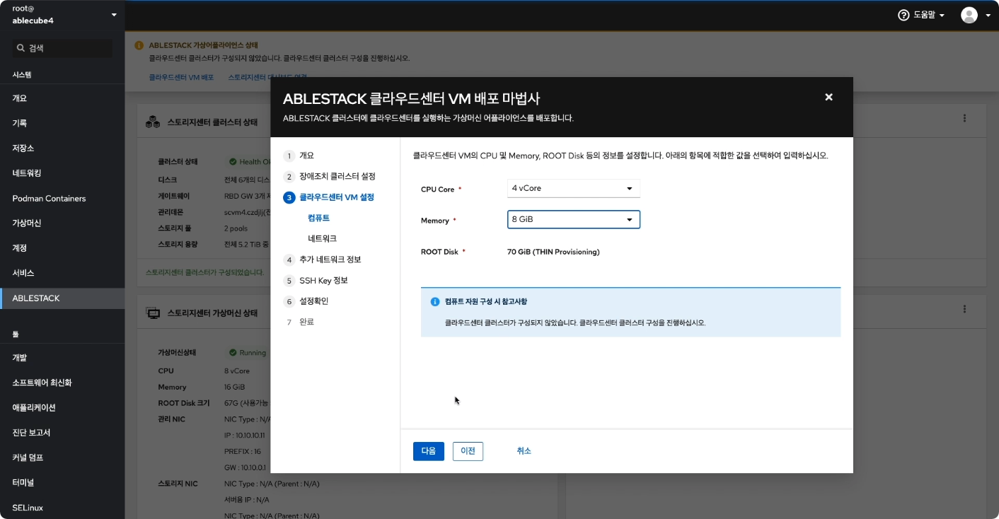{ align=center }
    - 클라우드센터 가상머신의 컴퓨트 설정하는 화면입니다.
    - **CPU Core** 선택 박스는 **4 vCore**, **Memory** 선택 박스는 **8 GiB** 를 선택 하고 **다음** 버튼을 클릭합니다.

    !!! tip
        클라우드센터 가상머신의 Compute 자원은 클라우드센터가 관리해야 할 호스트의 수에 따라 탄력적으로 선택합니다.    
        가상머신이 컨트롤 할 호스트의 수가 **10개 미만** 이면 **4 vCore** 를, **그 이상** 이면 **8 vCore** 를 선택하십시오.  
        메모리는 컨트롤할 호스트의 수가 **10개** 미만이면 **8GiB** 를, **10 ~ 20개** 이면 **16GiB** 를, **21개 이상** 이면 **32GiB** 를 선택해야 합니다.  
        ROOT Disk의 크기는 **70GiB** 를 디스크가 **Thin Provisioning** 방식으로 제공됩니다.
   
4. 클라우드센터 가상머신 설정 - 네트워크
    { align=center }
    - 클라우드센터 가상머신의 네트워크 설정하는 화면입니다.
    - **관리네트워크** 선택 박스에서 **bridge0** 을 선택하고 **다음** 버튼을 클릭합니다.
    
    !!! info
        관리 네트워크와 서비스 네트워크가 분리되여 있는 경우 그리고 외부에서 클라우드센터 웹콘솔에 접근해야 하는경우에는 **네트워크 구성** 항목에서 
        **서비스네트워크** 항목을 체크하신 후에 **서비스네트워크** 선택 박스에서 해당되는 **브릿지** 를 선택하셔야 합니다.
   
5. 추가 네트워크 정보
    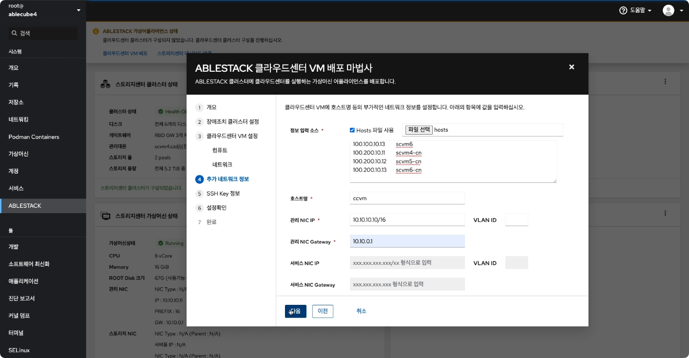{ align=center }
    - 클라우드센터 가상머신 추가 네트워크 정보를 설정하는 화면입니다.
    - **정보 입력 소스** 항목에서 **Hosts 파일 사용** 을 체크하고 **파일 선택** 버튼을 클릭하여 1번 호스트 클러스터 준비에서 다운로드한 **host** 파일을 선택하여 업로드 합니다.
    - **호스트명** 입력창에는 **ccvm**, **관리 NIC IP** 입력창에는 **10.10.10.10/16**, **관리 NIC Gateway** 입력창에는 **10.10.0.1** 을 입력 하고 **다음** 버튼을
    클릭합니다.
    
    !!! info
        - 클라우드센터 가상머신는 호스트 프로파일에는 **ablecube**, **scvm**, **scvm**, **scvm-cn** 항목이 필요 없으므로 삭제하시면 됩니다.
        - 서비스 네트워크 항목은 **클라우드센터 VM 설정 - 네트워크** 화면에서 서비스 네트워크 사용을 체크한 경우 활성화됩니다.
   
    !!! example
        - 호스트 프로파일 예제  
        10.10.10.10 ccvm-mngt   ccvm  
        10.10.10.1  ablecube4    
        10.10.10.2  ablecube5  
        10.10.10.3  ablecube6  
        10.10.10.11 scvm4-mngt    
        10.10.10.12 scvm5-mngt  
        10.10.10.13 scvm6-mngt  
        100.100.10.11    scvm4    
        100.100.10.12    scvm5  신
        100.100.10.13    scvm6  
        100.200.10.11    scvm4-cn    
        100.200.10.12    scvm5-cn  
        100.200.10.13    scvm6-cn  
        
6. SSH Key 정보
    { align=center }
    - 클라우드센터 가상머신의 SSH Key 정보를 설정하는 화면입니다.
    - 1번 호스트 클러스터 준비에서 다운로드한 Key 파일을 **SSH 개인 Key 파일**, **SSH 공개 Key 파일** 에 각각 업로드 후 **다음** 버튼을 클릭합니다.
    
7. 설정확인
    { align=center }
    - 클라우드센터 가상머신 배포전 설정을 확인하는 화면입니다.
    - 설정정보를 확인 후 **배포** 버튼을 클릭 합니다.

8. 배포
    { align=center }
    - 클라우드센터 가상머신 배포 진행상황을 확인 할 수 있는 화면입니다.
    
9. 완료
    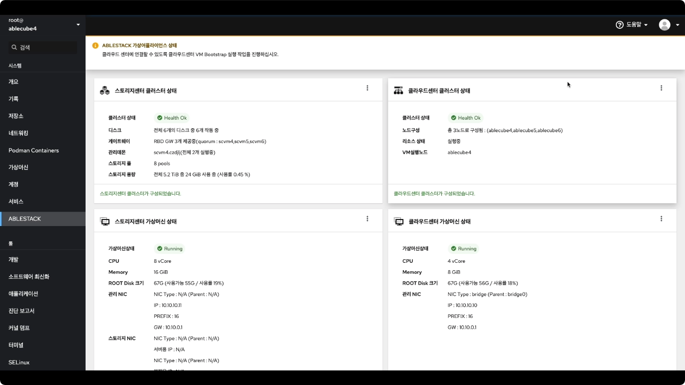{ align=center }
    - 클라우드센터 가상머신 배포가 완료 후 ABLESTACK Cube 웹콘솔에서 클라우드센터 클러스터 상태 카드 항목에서 **클러스터 상태** 가 **Health Ok**, 
      클라우드센터 가상머신 상태 카드에서 **가상머신상태** 가 **Running** 인지 확인하셔야 합니다.
      
## 클라우드센터 가상머신 웹콘솔 구성
클라우드센터 웹콘솔 구성을 하기 위해서는 **Bootstrap** 우선 실행해야 하며 **Bootstrap** 실행 후 클라우드센터 웹콘솔 화면을 이용하여 클라우드센터 구성을 하실수 있습니다.

1. Bootstrap 실행전
    { align=center }
    - Bootstrap 실행전 화면입니다. 상단의 리본 화면에서 **클라우드 센터에 연결할 수 있도록 클라우드센터 VM Bootstrap 실행 작업을 실행하십시오.** 문구가 보인다면
    클라우드센터 Bootstrap을 실행할 수 있습니다.
      
2. Bootstrap 실행
    { align=center }
    - Bootstrap 실행 화면입니다. 클라우드센터 클러스터 상태 카드에서 메뉴버튼을 클릭하여 **Bootstrap 실행** 버튼을 클릭합니다.
    - **실행** 버튼을 클릭하여 Bootstrap을 실행합니다.

    !!! important
        Bootstrap 은 1개의 호스트에서만 실행 됩니다. 1번 호스트에서 실행이 된경우에는 2번, 3번 호스트에서는 **Bootstrap 실행** 버튼이 사라지게 됩니다.
    
3. Bootstrap 완료
    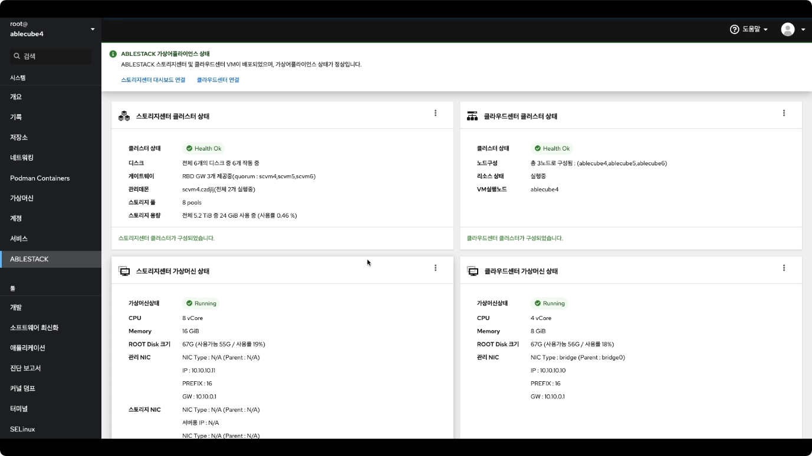{ align=center }
    - Bootstrap 실행 후 완료 화면입니다.
    - 상단 리본 화면에서 **스토리지센터 대시보드 연결** **클라우드센터 연결** 링크가 보인다면 정상적으로 실행된 상태 입니다.
    - **클라우드센터 연결** 링크를 클릭하여 클라우드센터 웹콘솔에 접속 하실 수 있습나다.
    
## 스토리지센터 NFS 구성
클라우드 센터에서는 각종 Template, ISO 파일등록 하여 관리하고 기존에 운영중인 가상머신의 Template 생성 및 스냅샷 생성 및 관리를
위하여 2차 스토리지를 등록 운영해야 합니다.  
외부에 NFS 서버를 별도로 운영하고 있으며 해당 NFS 서버를 클라우드 센터에 연결 가능하다면 **스토리지센터 NFS 구성** 부분은 구성하지 않으셔도 됩니다.  
해당 문서는 외부에 별도의 NFS 스토리지가 없는경우 해당 구성을 통하여 스토리지 센터에 NFS 스토리지를 구성해여 해당 NFS 스토리지를 클라우드센터에서 사용히기 위한 
절차입니다.

!!! info
    스토리지센터 NFS 구성은 스토리지센터 웹콘솔 및 ABLESTACK Cube 웹콘솔을 이용하여 구성합니다.

1. 스토리지센터 웹콘솔
    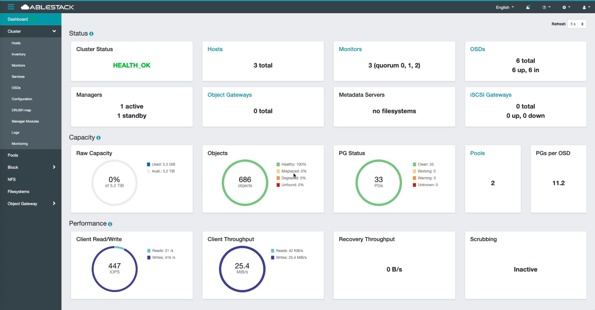
    - NFS를 구성하기 위해서 스토리지센터 웹콘솔에 접속합니다.
    
2. Namespace 생성
    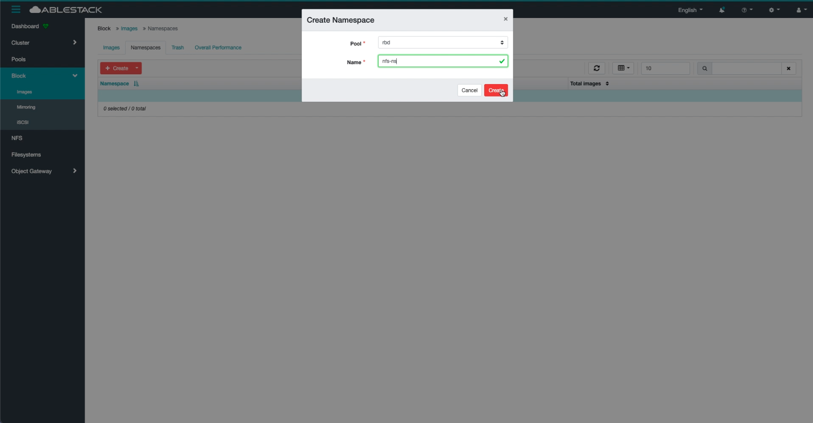
    - Namespace 생성하는 화면입니다. **Block > Images > Namespaces** 화면에서 **Create** 버튼을 클릭 합니다.
    - **Pool** 선택 박스에서 **rbd** 를 선택, **Name** 항목에는 **nfs-ns** 입력하고 **Create** 버튼을 클릭 합니다.

3. Namespace 생성 완료
    
    - Namespace 가 정상적으로 생성 완료 확인하기 위한 화면입니다.
    
4. NFS-ganesha 설정
    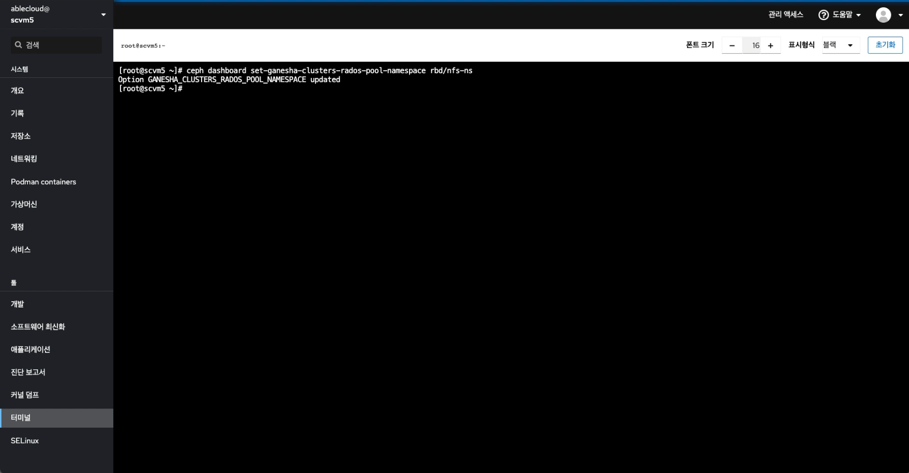
    - ABLESTACK Cube 웹콘솔에서 터미널 메뉴를 클릭한 후에 아래 명령어를 실행하여 NFS-ganesha 설정을 합니다.
    
    ``` bash
    ceph dashboard set-ganesha-clusters-rados-pool-namespace rbd/nfs-ns
    ```
5. RGW 서비스 생성
    
    - 서비스를 확인하는 화면입니다. **Cluster > Services** 화면에서 **Create** 버튼을 클릭 합니다.
    
    - RGW 서비스를 생성하는 화면입니다.  
    - **Type** 선택 박스에서 **rgw** 선택하고 **Id** 항목에는 **ablestack.nfs** 을 입력, **Placement** 선택 박스에는 **Hosts**를 선택,
    **Hosts** 항목에서 편집 버튼을 클릭하여 **scvm4** 을 선택하고 **Create Service** 버튼을 클릭합니다.

6. RGW 서비스 생성 확인
    
    - RGW 서비스 생성 확인하는 화면 입니다. 리스트에서 생성한 서비스가 정상적으로 보이는지 확인하시면 됩니다.
    
7. NFS Pool 생성
    
    - NFS Pool 생성하는 화면입니다. **Pool** 화면에서 **Create** 버튼을 클릭하면 보이는 화면 입니다.
    - **Name** 항목에 **cephfs.nfs.data** 입력, **Pool type** 선택 박스는 **replicated** 를 선택 **PG Autoscale** 선택 박스는 **on** 을 선택, 
    **Replicated size** 항목은 **2** 를 입력하고 **Applications** 항목의 편집 버튼을 클릭하여 **cephfs**를 선택합니다.
    - **Crush ruleset** 선택 박스는 **rbd** 입력하고 **Create Pool** 버튼을 클릭 합니다.
    
8. cephfs 볼륨 생성
    
    - cephfs 볼륨을 생성하는 화면입니다. ABLESTACK Cube 가 설치된 호스트에서 아래 명령어를 실행 하시면 됩니다.
    
    ``` bash
    ceph fs volume create nfs
    mount -t ceph :/ /mnt -o name=admin
    cd /mnt
    mkdir secondary
    mkdir ha
    chmod 777 secondary
    chmod 777 ha
    cd ~
    umount /mnt
    ```

9. NFS Quotas 설정
    
    - NFS Quotas 설정하는 화면입니다. **Filesystems** 메뉴를 클릭하면 보이는 화면입니다.
    - 리스트에서 위에서 생성한 **nfs** 항목을 클릭한 후에 **ha** 디렉토리를 선택하고 **Set** 버튼을 클릭합니다.
    - **Max size** 입력항목에 **100 GiB** 를 입력하고 **Save** 버튼을 클릭합니다.
    - **secondary** 디렉토리도 마찬가지로 선택 후 **Set** 버튼을 클릭하여 **Max size** 입력 항목에 **100 GiB** 를 입력하고 **Save** 버튼을 클릭합니다.

    
    - ha 디렉토리 Quotas 설정 확인   
    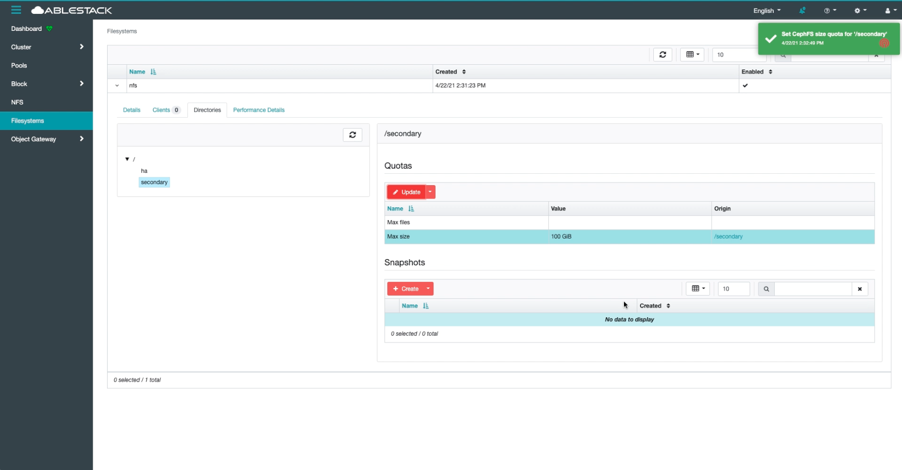
    - ha 디렉토리 Quotas 설정 확인
    
10. NFS 서비스 생성
    
    - NFS 서비스를 생성하는 화면입니다. **Cluster > Services** 화면에서 **Create** 버튼을 클릭합니다.
    - **Type** 선택 박스에서 **nfs** 를 선택하고 **Id** 항목에는 **ablestack** 을 입력합니다.
    - **Placement** 선택 박스에서는 **Hosts** 를 선택하고, **Hosts** 편집 버튼을 클릭하여 **scvm4**, **scvm5**, **scvm6** 을 선택합니다.
    - **Count** 항목에는 **3** 을 입력하고 **Pool** 선택 박스는 **rbd** 를 선택합니다.
    - **Namespace** 항목에는 위에서 생성한 이름 **nfs-ns** 를 입력한 후에 **Create Service** 버튼을 클릭합니다.
    
    - **Services** 메뉴를 클릭하여 생성한 서비스가 정상적인지 리스트에서 확인합니다.

11. NFS Export 설정  
      
    - ha 디렉토리 NFS Export 설정하는 화면입니다.  
    
      
    - secondary 디렉토리 NFS Export 설정하는 화면 입니다.  
      
    - **Cluster** 항목에는 **ablestack** 을 입력합니다.  
    - **Storage Backend** 선택 박스는 **CephFS** 를 선택합니다.  
    - **CephFS User ID** 선택 박스는 **admin** 을 선택합니다.  
    - **CephFS Name** 선택 박스는 **nfs** 를 선택합니다.  
    - **CephFS Path** 항목에는 ha 디렉토리는 **/ha**, secondary 디렉토리는 **/secondary** 를 각각 입력합니다.  
    - **NFS Protocol** 항목은 **NFSv4** 를 선택합니다.  
    - **Pseudo** 항목에는 ha 디렉토리는 **/ha**, secondary 디렉토리는 **/secondary** 를 각각 입력합니다.  
    - **Access Type** 선택 박스는 **RW** 를 선택 합니다.
    - **Squash** 선택 박스는 **no_root_squash** 를 선택 합니다.
    - **Transport Protocol** 항목은 **TCP**를 선택 합니다.
    - **Create NFS export** 버튼을 클릭하여 Export 설정을 마무리 합니다.

12. NFS Export 설정 확인
    
    - NFS Export 설정을 확인 하는 화면 입니다.

## 클라우드센터 System VM 용 Template 등록
클라우드센터를 이용하여 Zone 을 구성하면 1개의 Zone 에서 2개의 System VM을 생성을 해야 합니다. System VM 생성은 클라우드센터에서 자동으로 생성을 하지만
Template 은 수동으로 등록되어야 합니다.

1. 클라우드센터 가상머신 접속
    { align=center }
    - 클라우드센터 가상머신 접속 화면입니다.
    - ABLESTACK Cube 웹콘솔 메뉴에서 터미널 클릭 후 아래 명령어를 입력하여 클라우드센터 가상머신에 접속 합니다.  
    
    ``` bash
    ssh ccvm
    ```

2. NFS 마운트
    { align=center }
    - 기존에 생성한 NFS 스토리지를 아래 명령어를 이용하여 마운트 하는 화면입니다.
    
    ``` bash
    mount -t nfs scvm4-mngt:/secondary /mnt
    ```

3. System VM용 Template 등록
    { align=center }
    - System VM 용 Template 등록하는 화면입니다. 아래 명령어를 이용하여 System VM 용 Template 을 등록하시면 됩니다.
    - 위 화면처럼 완료 메세지가 정상적으로 나오는지 확인하시면 됩니다.
    
    ``` bash
    /usr/share/cloudstack-common/scripts/storage/secondary/cloud-install-sys-tmplt \
    -m /mnt \
    -f /usr/share/ablestack/systemvmtemplate-4.16.0-kvm.qcow2.bz2 \
    -h kvm -F
    ```

## 클라우드센터 Zone 구성
클라우드센터 웹콘솔을 이용한 Zone 구성 진행 절차에 대하여 가이드하고 있습니다.  
해당 문서에서는 Zone 구성까지만 설명을 하고 있으며 Zone 구성 이후의 클라우드센터 웹콘솔 사용방법은 다른 문서를 참고하시기 바랍니다.

{ align=center }
- Bootstrap 실행 완료 후 상단의 리본 창에서 **클라우드센터 연결** 링크를 클릭합니다.

!!! info
    { align=center }
    해당 화면처럼 접속이 실패 할 수도 있습니다. 해당 문구가 보인다면 조금 기다린 후에 다시 접속 하시면 정상적으로 로그인 화면을 볼수 있습니다.

1. 클라우드센터 로그인
    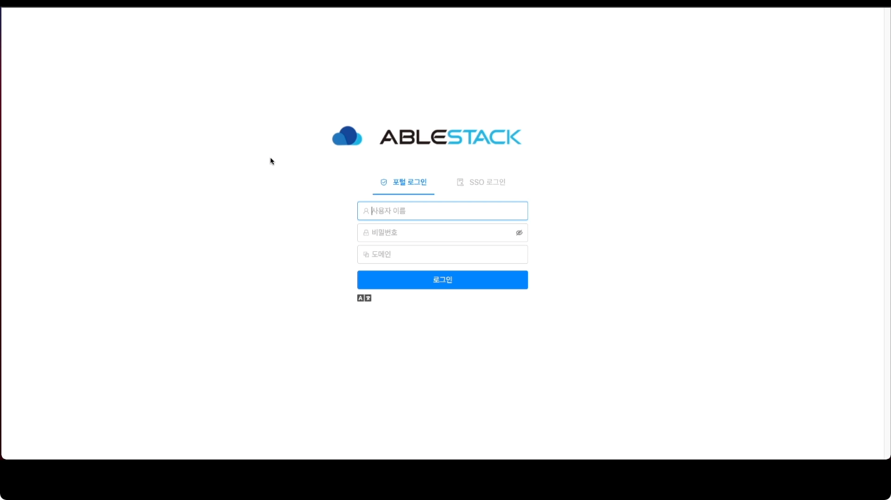{ align=center }
    - 클라우드 센터 로그인 화면입니다.
    - **사용자 이름** 에는 **admin**, **비밀번호** 는 **password** 를 입력하고 **로그인** 버튼을 클릭하면 접속할 수 있습니다.
    
2. 클라우드센터 admin 비밀번호 변경
    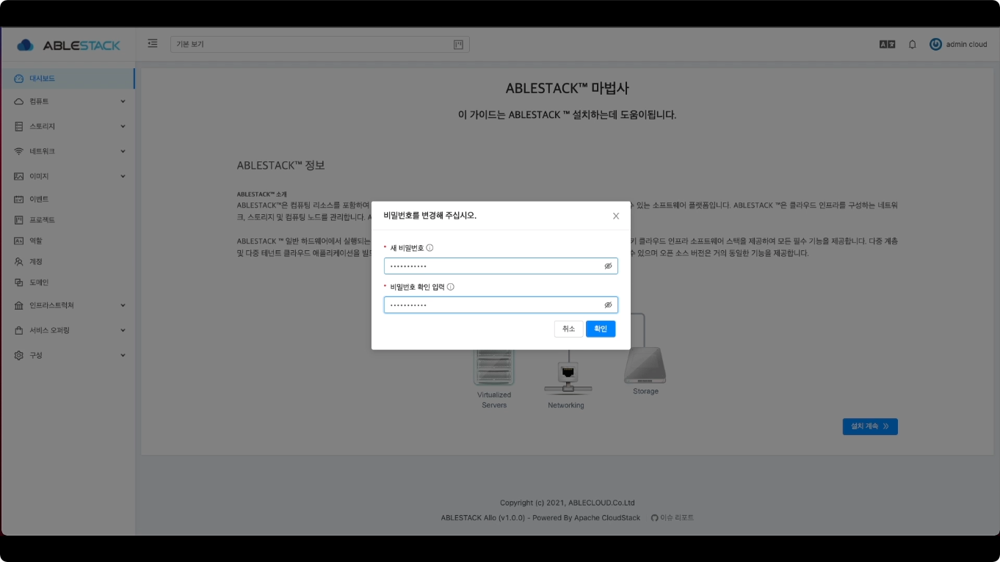{ align=center }
    - 관리자 계정의 비밀번호를 변경하는 화면입니다. **설치 계속** 버튼을 클릭하면 나오는 창이며 **새 비밀번호**, **비밀번호 확인 입력** 에 동일한 비밀번호를 입력 후 **확인**
    버튼을 클릭합니다.

3. 클라우드센터 Zone 유형 선택
    { align=center }
    - Zone 의 유형을 선택하는 화면입니다.
    - **확장** 을 선택한 후에 **다음** 버튼을 클릭합니다．

4. 클라우드센터 Zone 정보
   { align=center }
    - Zone 에 대한 정보를 입력하는 화면 입니다.
    - **이름** 에는 **Zone** 을 입력합니다.
    - **IPv4 DNS1** 에는 **8.8.8.8** 을 입력합니다.
    - **내부 DNS 1** 에는 **8.8.8.8** 을 입력합니다.
    - **하이퍼바이저** 선택 박스는 **KVM** 을 선택합니다.
    - 입력 정보 확인 후에 **다음** 버튼을 클릭 합니다.

5. 클라우드센터 Zone 물리 네트워크
   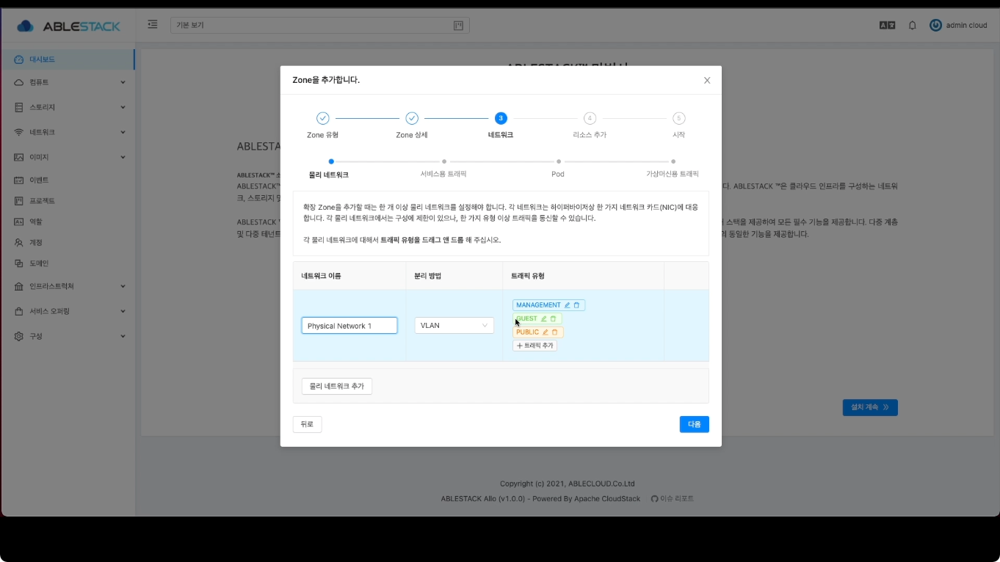{ align=center }
    - Zone 의 네트워크 정보를 입력하는 화면입니다.
        { align=center }
        - **트래픽 유형** 의 **MANAGEMENT**, **GUEST**, **PUBLIC** 각각의 **편집** 버튼을 클릭하여 **트래필 라벨** 항목에 **bridge0** 을 입력합니다.
    - 입력한 정보를 확인 후 **다음** 버튼을 클릭합니다.

6. 클라우드센터 Zone 서비스용 네트워크 정보
    { align=center }
    - Zone 의 서비스용 네트워크 정보를 입력 하는 화면입니다.
    - **케이트웨이** 항목에는 **10.10.0.1**, **넷마스크** 항목에는 **255.255.0.0**, **시작 IP 주소** 항목에는 **10.10.10.101**, 
    **종료 IP 주소** 항목에는 **10.10.10.150**을 입력하고 **추가** 버튼을 클릭합니다.
    - 입력한 정보를 확인 후 **다음** 버튼을 클릭합니다.

7. 클라우드센터 Pod 네트워크 정보
    { align=center }
    - Pod 네트워크 정보를 입력하는 화면 입니다.
    - **Pod 이름** 항목에는 **pod** 를 입력합니다.
    - **예약된 시스템 게이트웨이** 항목에는 **10.10.0.1** 을 입력합니다.
    - **예약된 시스템 넷마스크** 항목에는 **255.255.0.0** 을 입력합니다.
    - **예약된 시스템 시작 IP 주소** 항목에는 **10.10.10.21** 을 입력합니다.
    - **예약된 시스템 종료 IP 주소** 항목에는 **10.10.10.31** 을 입력합니다.
    - 입력한 정보를 확인 후 **다음** 버튼을 클릭합니다.

8. 클라우드센터 가상머신용 네트워크 정보
    { align=center }
    - 가상머신용 네트워크 정보를 입력하는 화면입니다. 
    - **VLAN 범위** 에 **200**, **300** 을 입력합니다.
    - 입력한 정보를 확인 후 **다음** 버튼을 클릭합니다.

9. 클라우드센터 클러스터 정보
   { align=center }
    - 클라우드센터 클러스터 정보를 입력하는 화면입니다.
    - **클러스터 이름** 항목에 **cluster** 를 입력합니다.
    - 입력한 정보를 확인 후 **다음** 버튼을 클릭합니다.

10. 클라우드센터 호스트 추가
    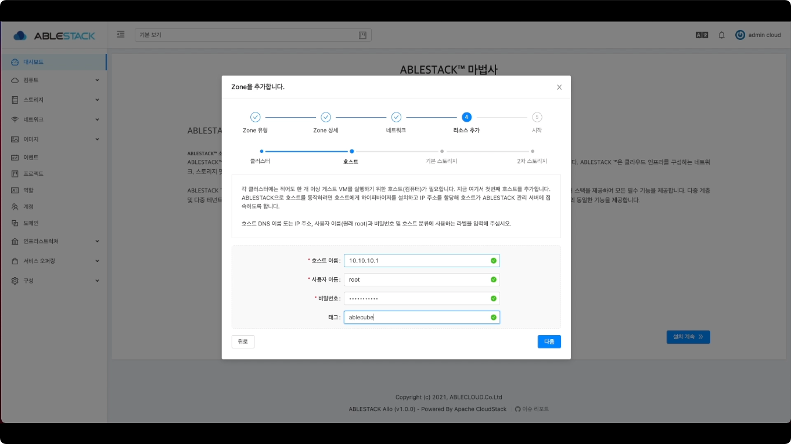{ align=center }
    - 클라우드센터에 호스트를 추가하는 화면 입니다.
    - **호스트 이름** 항목에는 **10.10.10.1** 을 입력합니다.
    - **사용자 이름** 항목에는 **root** 를 입력합니다.
    - **비밀번호** 항목에는 **비밀번호** 를 입력합니다.
    - **태그** 항목에는 **ablecube1** 을 입력합니다.
    - 입력한 정보를 확인 후 **다음** 버튼을 클릭합니다.

    !!! info
        기본 스토리지 추가를 위해서는 Glue 사용자의 이름과 시크릿 키를 확인하셔야 합니다. 확인 방법은 ABLESTACK Cube 호스트나 
        ABLESTACK Mold 가상머신에서 아래 명령어를 통해 확인 가능합니다.
        ``` bash
        ceph auth list
        ```
        위 명령어를 통한 리스트 중에 `client.admin` 의 키값을 복사 하시면 됩니다.
        { align=center }
    
11. 클라우드센터 기본스토리지 추가
    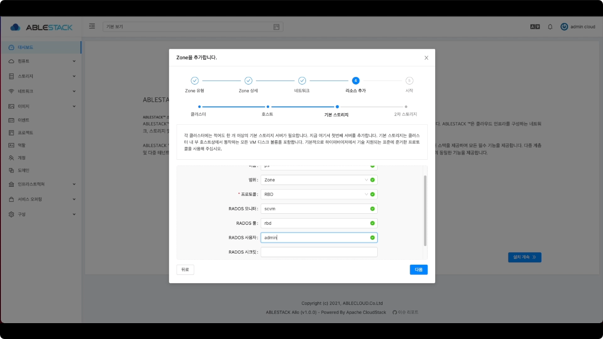{ align=center }
    - 기본 스토리지 추가하는 화면입니다.
    - **이름** 항목에는 **ps** 를 입력합니다.
    - **범위** 선택 박스에는 **zone** 을 선택합니다.
    - **프로토콜** 선택 박스에는 **RBD** 를 선택합니다.
    - **RADOS 풀** 항목에는 **scvm** 을 입력합니다.
    - **RADO 시크릿** 항목에는 **client.admin의 key값** 을 입력합니다.
    - 입력한 정보를 확인 후 **다음** 버튼을 클릭합니다.
    
13. 클라우드센터 2차 스토리지 추가
    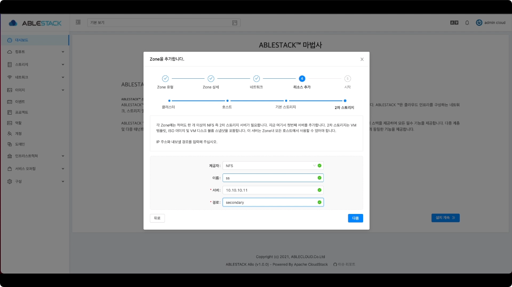{ align=center }
    - 2차 스토리지를 추가하는 화면입니다.
    - **제공자** 선택 박스에서 **NFS** 를 선택 합니다.
    - **이름** 항목에는 **ss** 를 입력합니다.
    - **서버** 항목에는 **10.10.10.11** 를 입력합니다.
    - **경로** 항목에는 **secondary** 를 입력합니다.
    - 입력한 정보를 확인 후 **다음** 버튼을 클릭합니다.

14. 클라우드센터 Zone 추가중
    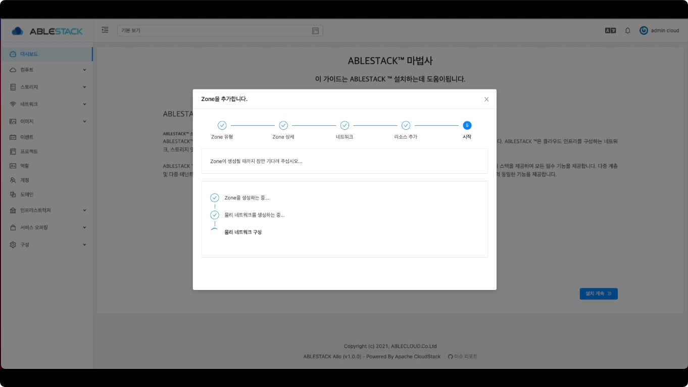{ align=center }
    - zone 추가 중 화면 입니다.