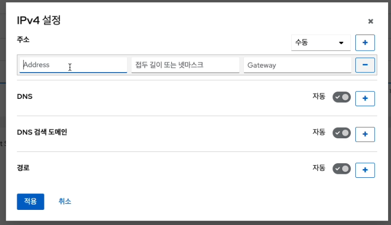
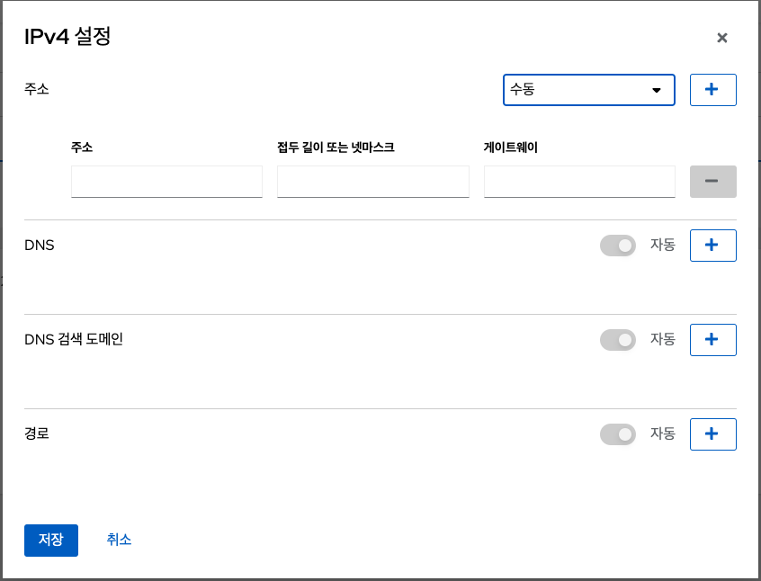
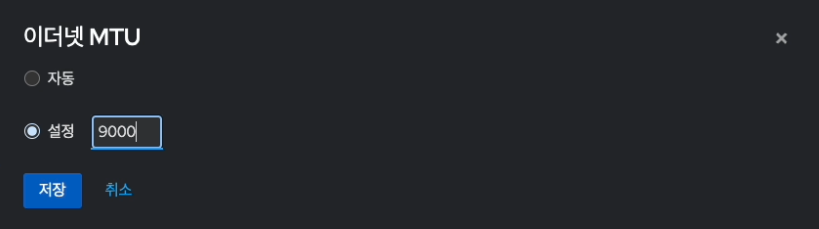
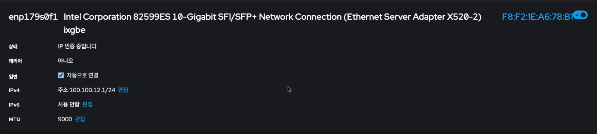

# PowerFlex Cube 설치진행
!!! danger
    이 문서는 기술지원 용도의 문서입니다. 기술지원 엔지니어가 아닌 사용자가 조작할 때 시스템에 문제가 발생할 수 있습니다.

PowerFlex Cube를 설치 진행 가이드 입니다.
해당 가이드는 기본적으로 Linux 계열의 OS 설치 경험이 없어도 설치 할 수 있는 쉬운 사용자 경험을 제공 하나 기본적인 Linux 계열의 OS 이해도를 가지고 있으면 조금더 쉽게 설치가 가능합니다.

!!! info
    - 해당 문서는 사용자의 네트워크 환경 및 설정 정보를 고려하지 않고 작성된 문서 입니다. 이 문서를 기준으로 활용을 하셔야 하며 수정 및 변경 할 부분은 **강조** 표시를 해두었습니다.
    - PowerFlex Cube 설치시 PowerFlex Cell이 동시에 설치가 진행되며, PowerFlex Cell의 설치가이드는 따로 제공 되고 있지 않습니다.
    - PowerFlex 설치는 ABLESTACK ISO에서 패키지 별로 설치 제공합니다.

!!! 사전준비 info
    - ABLESTACK 설치용 ISO 또는 ABLESTACK 설치용 USB
    - PowerFlex용 스토리지 템플릿 이미지 및 PFMP 템플릿 이미지가 들어 있는 USB
    - 호스트의 Manage Network 대역에 접근 가능한 Desktop 또는 Notebook
    - Manage Network IP(PowerFlex은 Manage Network IP를 호스트 1대당 3개의 IP를 필요로 하고 있습니다.)

!!! 사전설정 warning
    - PowerFlex는 Asia/Seoul를 기준으로 시간서버를 설정합니다.
    - 따라서 PowerFlex 설치 전 서버 BIOS 설정에서 해당 서버의 시간을 Asia/Seoul로 설정해야 합니다.

## PowerFlex Cube 설치 진행 가이드

1. ABLESTACK ISO를 이용한 USB 부팅 화면 입니다.
    { align=center }

2. 부팅 완료 후 PowerFlex 설치 메뉴 화면 입니다.
    정상적으로 ISO 또는 USB를 이용하여 정상적으로 부팅되면 아래와 같은 이미지의 화면으로 전환됩니다.
    { align=center }

    !!! Check
        화면에서 **Install ABLESTACK Diplo** 메뉴가 보이는지 확인해야 합니다. 해당 메뉴가 보이면 PowerFlex Cube 정상적으로 설치를 하실 수 있습니다. 
        만약 해당 메뉴가 보이지 않는다면 정상적인 부팅이 되지 않은 경우이므로 부팅매체를 확인하고 재부팅을 해야 합니다. 
        다시 한번 부팅해도 해당 메뉴가 보이지 않는다면 ISO 또는 USB가 손상되었을 수 있습니다.

3. PowerFlex Cube 구성 화면 입니다.
    { align=center }

    !!! info
        PowerFlex Cube는 기본적인 정보는 자동으로 설정이 되어 있습니다.
        **Installation Destination, Network & Host name** 항목에 대해서만 설정하면 됩니다. 
        - Keyboard, Language Support, Installation Source, Software Selection, KDUMP, Security Policy, Root Password 항목은 수정하실 필요가 없습니다.

    !!! Tip
        설정정보 입력시 'Network & Host name' > 'Installation Destination' 순서대로 설정하는 것을 권장합니다.

4. 네트워크 및 호스트 이름 구성변경 화면
    - PowerFlex Cube 구성화면에서 **Network & Host Name** 을 클릭하면 해당 화면으로 이동됩니다.

    1. 호스트 이름 설정
        { align=center }
        * Host name에 hostname을 입력합니다.
        !!! Tip
            일반적으로 호스트명은 "ablecube23"과 같이 ablecube + 넘버링 형태로 지정하면 향후 관리가 용이합니다.
        * 적용 버튼을 클릭하여 Host name을 적용합니다.
        * 적용된 Host name이 정상적으로 현재 호스트 이름에 표시 되는지 확인합니다.

        * 호스트 이름 설정한 후, 해당 하는 NIC를 선택합니다.

    2. 자동 우선 순위 설정
        { align=center }
        - **General** 탭에서 **Connect automatically with priority** 를 선택 하여 기본 값 **0** 으로 설정합니다.

    3. IP 설정
        { align=center }
        - IP 설정을 수동으로 할 시 **Manual** 을 선택합니다.
        - 미리 설정 해둔 **Address** , **Netmask** , **Gateway** , **DNS** 를 입력합니다.

    4. 네트워크 활성화
        { align=center }

        !!! check
            IP 설정을 다 한 후, 꼭 NIC를 활성화 하여야 합니다.

    !!! note
        네트워크의 목록 및 장치명 등은 물리적 네트워크의 구성과 하드웨어 벤더사에 따라 다르게 표기될 수 있습니다.

5. 설치 대상 구성 화면
    - PowerFlex Cube 구성화면에서 **Installation Destination** 을 클릭하면 해당 화면으로 이동됩니다.

    { align=center }

    !!! note
        디스크 장치 목록은 디스크 구성 및 종류,수량에 따라 다르게 표시될 수 있습니다.
    * 디스크 목록 중 PowerFlex Cube OS 가 설치될 디스크를 선택하시고 나머지 디스크는 모두 선택을 해제합니다.

    !!! check
        설치 대상 디스크 이외의 모든 디스크는 반드시 선택 해제를 해야합니다. 
        스토리지 구성단계에서 해당 디스크를 사용할 수 없게 될 수도 있습니다.

    * 저장소 구성항목을 **Custom** 을 선택한 후 Done를 클릭합니다.

    { align=center }

    * **Click here to create them automatically** 을 클릭하면 해당화면으로 이동됩니다

    1. 파티션 구성 화면 1-2
        { align=center }
        * 해당 화면은 파티션을 구성하는 화면입니다.
        * **/home** 파티션 선택 후 아래 **-** 버튼을 클릭하여 home 파티션을 삭제합니다.
    2. 파티션 구성 화면 2-2
        { align=center }
        * **swap 파티션 선택 후 희망 용량** 의 입력 값에 **32GiB(최소 권장)** 을 입력 후 **설정 업데이트** 버튼을 클릭하여 파티션 용량 재설정 합니다.
        !!! info
            **swap** 파티션은 서버 메모리 크기와 같은 크기로 설정하는 것을 권장합니다. 
            디스크의 크기가 여유롭지 못하면 **32GiB 이상** 을 권장합니다.

    3. 파티션 구성 화면 3-2
        { align=center }
        * **/(root파티션)** 파티션 선택 후 **희망 용량** 나머지 전체의 용량을 할당하고 **설정 업데이트** 버튼을 클릭하여 파티션 용량 재설정 합니다.
        * 파티션 구성 완료 후 **Done** 버튼을 클릭하여 파티션 설정을 마무리 합니다.

        !!! Tip
            **/(root파티션)** 파티션의 **희망 용량** 입력시 하단 왼쪽에 나와있는 **사용 가능한 공간** 의 용량을 입력하면 필수 구성 파티션을 제외한 나머지 용량이 **/(root파티션)** 에 할당이 됩니다.

6. Root 초기 암호

!!! check
    Root Password 초기 암호는 **password** 입니다.

7. PowerFlex Cube 구성 마무리
    { align=center }
    - PowerFlex Cube 설정 완료 후 **Begin installation** 버튼을 클릭하여 PowerFlex 설치를 진행 합니다.

    { align=center }

    - 설치가 완료가 되면 자동으로 재부팅 절차가 진행되며 연결되어 있는 ABLESTACK ISO 또는 USB를 제거하여 PowerFlex Cube 설치를 마무리 합니다.

    { align=center }
    - 설치가 정상적으로 완료되면 PowerFlex 콘솔 로그인 화면이 보이게 됩니다.

## PowerFlex Cube Network 셋팅

1. PowerFlex Cube 로그인
    { align=center }
    - PowerFlex Cube 로그인 화면입니다.
    - 접속 URL은 **호스트IP:9090** 입니다
    - 사용자 이름은 **root** 를 암호는 초기 암호를 입력하여, 원하시는 비밀번호로 변경한 후, **로그인** 버튼을 클릭하면 로그인 하실 수 있습니다.

2. PowerFlex Cube 메인 화면
    { align=center }
    - PowerFlex Cube 로그인 후 화면입니다.

3. PowerFlex Cube 네트워킹 구성
    { align=center }
    - PowerFlex Cube 네트워킹 구성 화면입니다.  해당 화면에서 방화벽 설정 및 본드(bond), 브릿지(bridge), VLAN 구성을 진행합니다.

    !!! note
        인터페이스 목록 및 IP주소 등은 물리적 네트워크의 구성과 하드웨어 벤더사 및 초기 설정한 IP주소에 따라 다르게 표기될 수 있습니다.

    !!! info
        해당 문서의 네트워크 구성은 기본적인 네트워크 구성입니다.
        이 문서를 바탕으로 설치 사이트에 맞게 구성을 변경 및 IP 주소를 입력 하셔야 합니다.

        그리고 본드(bond) 구성이 필요한 경우 본드(bond)구성 완료 후 진행하셔야 합니다.
        현재 과정에서는 Management Network에 대한 본드 구성 혹은 Storage Network 구성이 Bridge일 경우에만 본드 구성을 진행하며
        Storage Network가 NIC pass-through 일 경우에는 SCVM 구성완료 후 해당 가상머신에서 본드 구성을 진행합니다.

        **본 설치 가이드는 Storage Network가 NIC pass-through 이며, 본드구성 없이 단일 NIC로 구성된 형태 입니다.**

    1. Management Network 본드 설정
        { align=center }
        - 화면 중간 버튼 그룹 중 **본드 추가** 버튼을 클릭하면 보이는 화면이며, 본드을 설정하는 팝업 화면입니다.
        { align=center }
        - 본드 이름을 **bond0** 을 입력해주고, 연결장치는 **Management NIC** 를 선택하고 **추가** 버튼을 클릭합니다.

    2. Management Network 브릿지 설정
        { align=center }
        - 화면 중간 버튼그룹 중 **브릿지 추가** 버튼을 클릭하면 보이는 화면이며, 브릿지를 설정하는 팝업 화면입니다.
        { align=center }
        - 브릿지 이름을 **bridge0** 을 입력해주고, 연결장치는 **bond 0** 를 선택하고 **저장** 버튼을 클릭합니다.

        !!! info
            해당 과정은 물리적인 Management Network를 SystemVM 및 다른 가상머신에서 사용할 수 있게 브릿지를 하는 과정입니다.

            브릿지의 IP 설정은 PowerFlex Cube 구성하면서 입력된 IP 정보가 상속되여 자동으로 설정됩니다.

    3. Public Storage Network 설정
        { align=center }
        - Public Storage Network 설정하기 위한 절차 입니다. 네트워킹 화면에서 **Public Storage** 로 사용할 NIC를 클릭하여 들어온 화면입니다.

        1. Public Storage Network IP 설정
            { align=center }
            - IPv4 항목의 **편집** 버튼을 눌러 들어온 IPv4 설정 화면입니다.
            - 주소 입력 창의 오른쪽에 있는 **자동(DHCP)** 선택 박스를 눌러 **수동** 으로 변경을 합니다.
            - **Address** 입력창에 **사전에 지정한 IP** 를 입력하고, **접두 길이 또는 넷마스크** 입력창에 **24** 를 입력하고 **적용** 버튼을 클릭합니다.
            !!! info
                Storage Network에서 사용하는 IP는 내부적으로만 통신하기 위한 IP입니다. 
                일반적으로 Public Storage Network IP는 100.100.**A**.**B**/24 대역을 사용합니다. 
                관리상 편의를 위해 A는 Management와 동일한 C클래스를 사용하고 B는 호스트와 동일한 Host IP로 구성합니다. 
                만약 스위치를 혼용해서 사용하고 해당 IP 대역이 기존 내부 네트워크와 겹쳐서 충돌이 발생될 수 있을 경우에는 사용하지 않는 대역으로 변경해야 합니다.

        2. Public Storage Network MTU 설정
            { align=center }
            - MTU 항목의 **편집** 버튼을 눌러 들어온 MTU 설정 화면입니다.
            - 라디오 버튼을 **설정** 으로 선택하고 입력값을 **9000** 으로 입력 후에 **적용** 버튼을 클릭합니다.

        3. Public Storage 자동연결 및 활성화 설정
            { align=center }
            - 입력이 끝난 후 저장 후, **자동으로 연결** 버튼을 클릭하여 활성화 합니다.

            !!! check
                Public Storage Network 설정 할 시, 물리 인터페이스 MTU 설정 값이 같아야 합니다.

                확인 후 다음 단계로 넘어가시길 바랍니다.

!!! info
    현재 버전에서 PowerFlex 클러스터는 3식 호스트로 구성되어야 합니다.
    PowerFlex Cube 설치 진행절차는 2번, 3번 호스트도 동일합니다. 위 설치 절차를 2번, 3번 호스트에도 진행하시기 바랍니다.

!!! check
    PowerFlex Cube 및 PowerFlex Cell의 설치 및 구성이 끝났습니다.
    PowerFlex Glue 및 PowerFlex PFMP 및 PowerFlex Mold는 ABLESTACK 메뉴에서 구성이 가능하며, 다음 설치 가이드를 보고 따라가시면 됩니다.