# PowerFlex Mold 설치진행
!!! danger
    이 문서는 기술지원 용도의 문서입니다. 기술지원 엔지니어가 아닌 사용자가 조작할 때 시스템에 문제가 발생할 수 있습니다.
    해당 설치과정에 사용되는 IP 및 입력 정보는 예시이며, 현장에 맞게 수정하시기 바랍니다.

PowerFlex Mold 설치 진행 가이드 입니다.
이 문서에서는 PowerFlex Mold 용 가상머신 생성 및 Mold 웹콘솔을 이용하여 Zone 구성까지 가이드 하고 있습니다.
PowerFlex Cube 의 웹콘솔과 PowerFlex Mold 웹콘솔을 이용하여 진행이 되며 웹 접속 IP는 별도의 표시를 하지 않고 진행됩니다.
기존에 구성된 IP 정보에 맞게 웹콘솔을 접속 하시면 됩니다.

## 클라우드센터 가상머신 배포
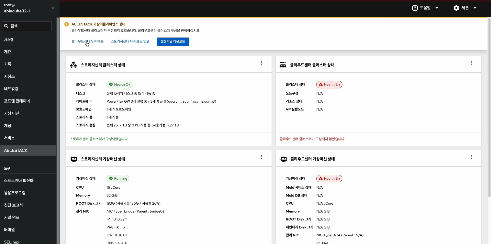{ .imgCenter .imgBorder }
- 클라우드센터 가상머신을 배포하기 위한 화면입니다. 상단 상태 리본의 클라우드센터 가상머신 배포 링크를 클릭합나다.

1. 개요
    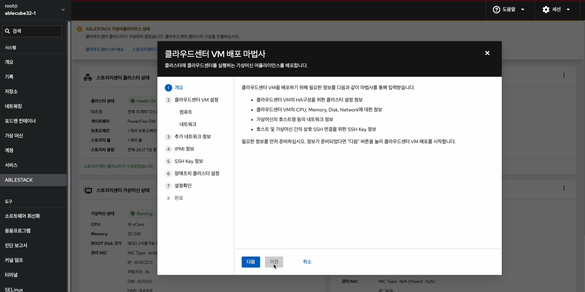{ .imgCenter .imgBorder }
    - 클라우드센터 가상머신 배포 개요 화면입니다. 개요의 내용을 확인 후 **다음** 버튼을 클릭합니다.


2. 클라우드센터 가상머신 설정 - 컴퓨트
    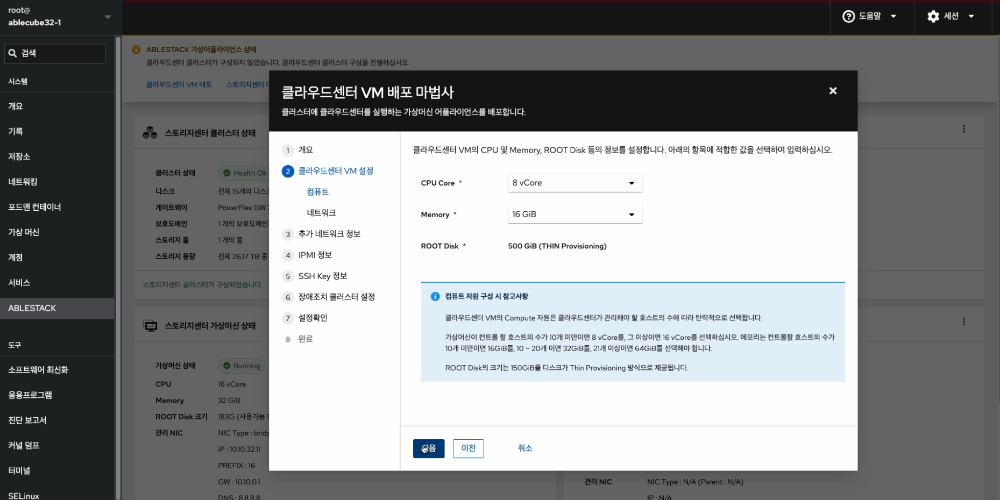{ .imgCenter .imgBorder }
    - 클라우드센터 가상머신의 컴퓨트 설정하는 화면입니다.
    - **CPU Core** 선택 박스는 **8 vCore**, **Memory** 선택 박스는 **16 GiB** 를 선택 하고 **다음** 버튼을 클릭합니다.

    !!! tip
        클라우드센터 가상머신의 Compute 자원은 클라우드센터가 관리해야 할 호스트의 수에 따라 탄력적으로 선택합니다.
        가상머신이 컨트롤 할 호스트의 수가 **10개 미만** 이면 **8 vCore** 를, **그 이상** 이면 **16 vCore** 를 선택하십시오.
        메모리는 컨트롤할 호스트의 수가 **10개** 미만이면 **16GiB** 를, **10 ~ 20개** 이면 **32GiB** 를, **21개 이상** 이면 **64GiB** 를 선택해야 합니다.
        ROOT Disk의 크기는 **500GiB** 를 디스크가 **Thin Provisioning** 방식으로 제공됩니다.

3. 클라우드센터 가상머신 설정 - 네트워크
    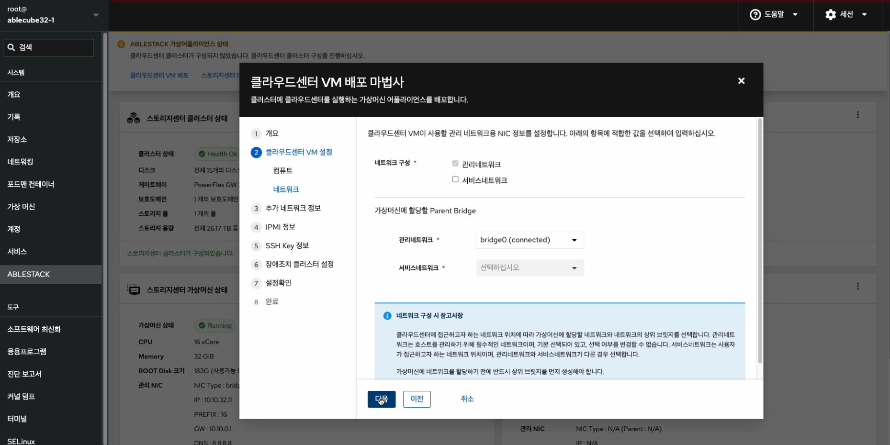{ .imgCenter .imgBorder }
    - 클라우드센터 가상머신의 네트워크 설정하는 화면입니다.
    - **관리네트워크** 선택 박스에서 **bridge0** 을 선택하고 **다음** 버튼을 클릭합니다.

    !!! info
        관리 네트워크와 서비스 네트워크가 분리되여 있는 경우 그리고 외부에서 클라우드센터 웹콘솔에 접근해야 하는경우에는 **네트워크 구성** 항목에서
        **서비스네트워크** 항목을 체크하신 후에 **서비스네트워크** 선택 박스에서 해당되는 **브릿지** 를 선택하셔야 합니다.

4. 추가 네트워크 정보
    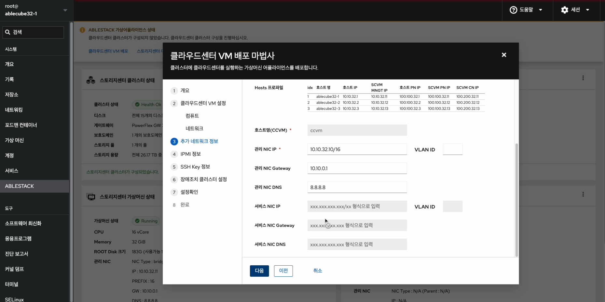{ .imgCenter .imgBorder }
    - 클라우드센터 가상머신 추가 네트워크 정보를 설정하는 화면입니다.
    - **클러스터 구성 파일 준비** 해당 호스트 파일 사용으로 자동 선택되며, ablecube 호스트 설정 정보를 자동으로 읽어와 클러스터 구성 정보 및 네트워크 IP 정보를 세팅합니다.
    - **호스트명(CCVM)** 을 입력 및 확인합니다.
    - **관리 NIC IP** 를 입력 및 확인합니다.
    - **다음** 버튼을 클릭합니다.

    !!! info
        클라우드센터 가상머신 배포시 ablecube 호스트에서 설정파일 읽어와 일부 정보를 자동세팅되며 입력 정보를 정확히 확인해야 합니다.
        해당 화면의 IP 정보 는 예제 입니다. IP 정보는 사이트 정보에 맞춰서 수정해야 합니다.

5. IPMI 정보
    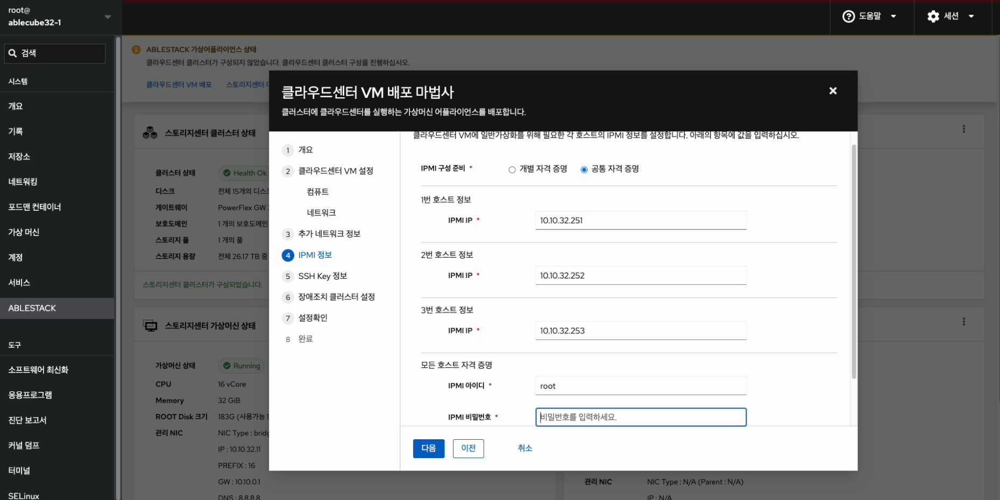{ .imgCenter .imgBorder }
    - **각 IPMI 자격 증명** 에 따라 선택한 후, 해당하는 **IPMI IP** , **아이디** 및 **비밀번호** 를 입력합니다.
    - **다음** 버튼을 클릭합니다.

    !!! Tip
        각 IPMI 자격 증명이 다르면 개별 자격 증명을 선택하고, 똑같다면 공통 자격 증명을 선택합니다.

5. SSH Key 정보
    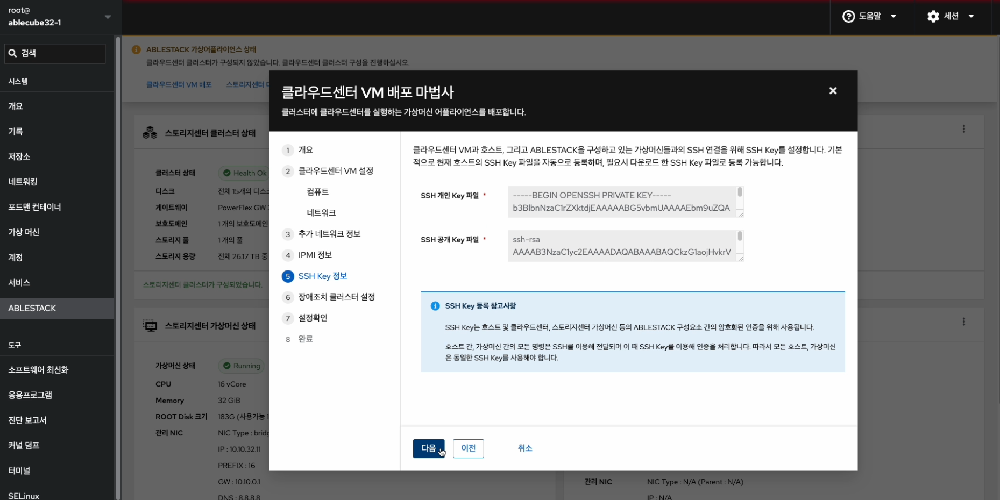{ .imgCenter .imgBorder }
    - SSH Key 정보를 확인하는 화면입니다.
    - 클러스터 구성시 호스트에 등록된 호스트의 키 정보로 자동세팅됩니다.

6. 장애조치 클러스터 설정
    { .imgCenter .imgBorder }
    - 장애조치 클러스터 설정하는 화면 입니다.
    - **호스트 #1정보**, **호스트 #2정보**, **호스트 #3정보** 에는 **호스트 PN IP #1**, **호스트 PN IP #2**, **호스트 PN IP #3** 자동으로 세팅이 되며 입력 정보를 정확히 확인하고 **다음** 버튼을 클릭합니다.

    !!! info
        클라우드센터 장애조치 클러스터는 최대 3개의 호스트를 지정할 수 있습니다.

7. 설정확인
    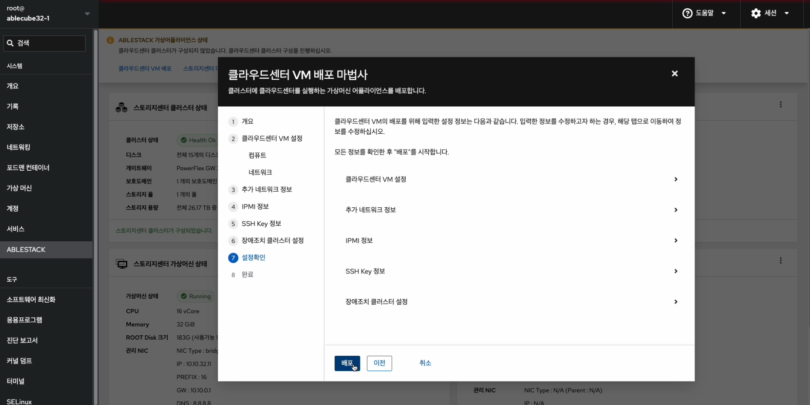{ .imgCenter .imgBorder }
    - 클라우드센터 가상머신 배포전 설정을 확인하는 화면입니다.
    - 설정정보를 확인 후 **배포** 버튼을 클릭 합니다.

8. 배포
    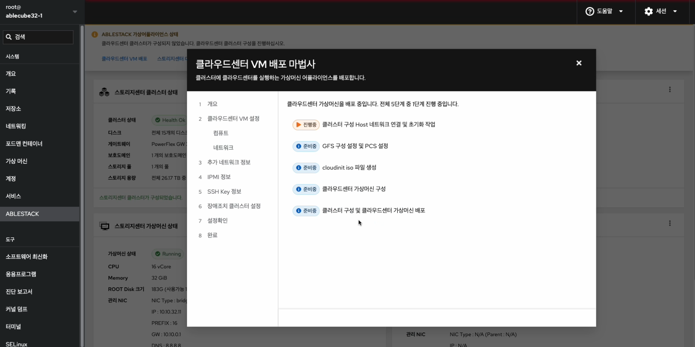{ .imgCenter .imgBorder }
    - 클라우드센터 가상머신 배포 진행상황을 확인 할 수 있는 화면입니다.

9. 완료
    { .imgCenter .imgBorder }
    - 클라우드센터 가상머신 배포가 완료 후 PowerFlex Cube 웹콘솔에서 클라우드센터 클러스터 상태 카드 항목에서 **클러스터 상태** 가 **Health Ok**,
      클라우드센터 가상머신 상태 카드에서 **가상머신상태** 가 **Running** 인지 확인하셔야 합니다.

## 클라우드센터 가상머신 웹콘솔 구성
클라우드센터 웹콘솔 구성을 하기 위해서는 **Bootstrap** 우선 실행해야 하며 **Bootstrap** 실행 후 클라우드센터 웹콘솔 화면을 이용하여 클라우드센터 구성을 하실수 있습니다.

1. Bootstrap 실행전
    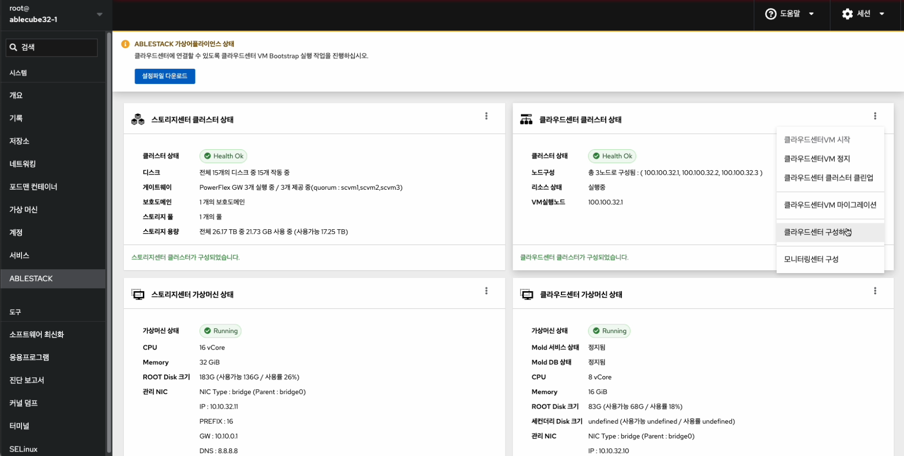{ .imgCenter .imgBorder }
    - Bootstrap 실행전 화면입니다. 상단의 리본 화면에서 **클라우드 센터에 연결할 수 있도록 클라우드센터 VM Bootstrap 실행 작업을 실행하십시오.** 문구가 보인다면
    클라우드센터 Bootstrap을 실행할 수 있습니다.

2. Bootstrap 실행
    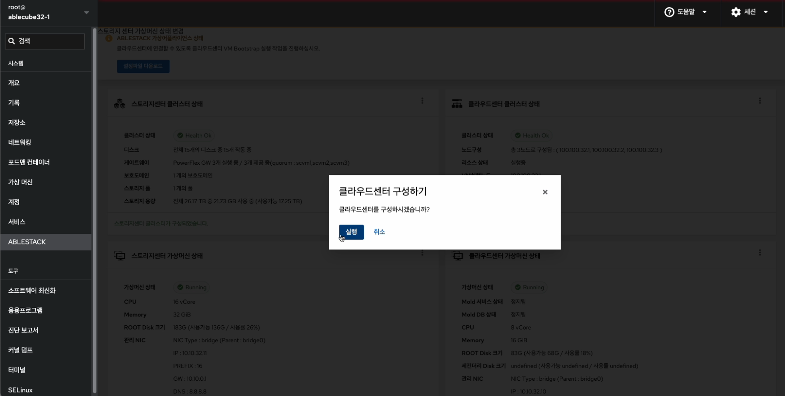{ .imgCenter .imgBorder }
    - Bootstrap 실행 화면입니다. 클라우드센터 클러스터 상태 카드에서 메뉴버튼을 클릭하여 **클라우드센터 구성하기** 버튼을 클릭합니다.
    - **실행** 버튼을 클릭하여 Bootstrap을 실행합니다.

    !!! important
        Bootstrap 은 1개의 호스트에서만 실행 됩니다. 1번 호스트에서 실행이 된경우에는 2번, 3번 호스트에서는 **Bootstrap 실행** 버튼이 사라지게 됩니다.

3. Bootstrap 완료
    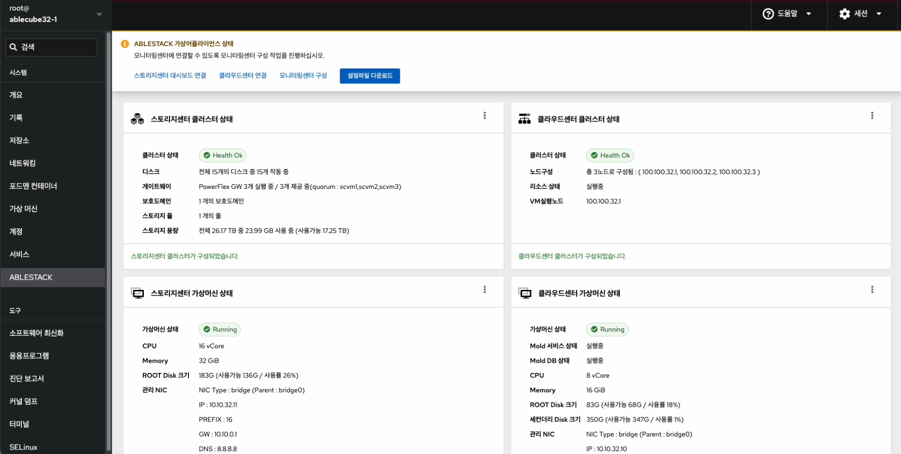{ .imgCenter .imgBorder }
    - Bootstrap 실행 후 완료 화면입니다.
    - 상단 리본 화면에서 **스토리지센터 대시보드 연결**, **클라우드센터 연결**, **모니터링센터 구성** 링크가 보인다면 정상적으로 실행된 상태 입니다.
    - **클라우드센터 연결** 링크를 클릭하여 클라우드센터 웹콘솔에 접속 하실 수 있습나다.

## 클라우드센터 Zone 구성
클라우드센터 웹콘솔을 이용한 Zone 구성 진행 절차에 대하여 가이드하고 있습니다.
해당 문서에서는 Zone 구성까지만 설명을 하고 있으며 Zone 구성 이후의 클라우드센터 웹콘솔 사용방법은 다른 문서를 참고하시기 바랍니다.

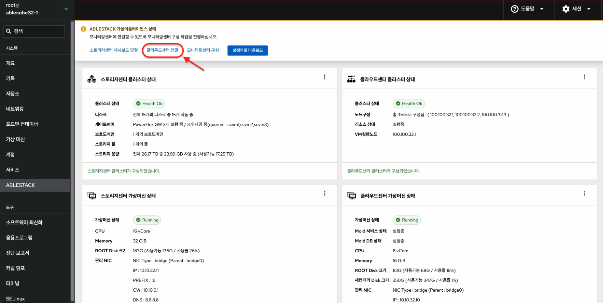{ .imgCenter .imgBorder }
- Bootstrap 실행 완료 후 상단의 리본 창에서 **클라우드센터 연결** 링크를 클릭합니다.

!!! info
    "클라우드센터에 정상적으로 연결되지 않습니다. 클라우드센터 서비스 상태를 확인하거나, 잠시 후에 다시 시도해주십시오." 문구가 나타나면

1. 클라우드센터 로그인
    { .imgCenter .imgBorder }
    - 클라우드 센터 로그인 화면입니다.
    - **사용자 이름** 에는 **admin**, **비밀번호** 는 **password** 를 입력하고 **로그인** 버튼을 클릭하면 접속할 수 있습니다.

2. 클라우드센터 admin 비밀번호 변경
    { .imgCenter .imgBorder }
    - 관리자 계정의 비밀번호를 변경하는 화면입니다. **새 비밀번호**, **비밀번호 확인 입력** 에 동일한 비밀번호를 입력 후 **확인**
    버튼을 클릭합니다.

3. 클라우드센터 Zone 유형 선택
    { .imgCenter .imgBorder }
    - **Zone** 의 유형을 선택하는 화면입니다.
    - **Core** 을 선택한 후에 **다음** 버튼을 클릭합니다.
    { .imgCenter .imgBorder }
    - **Core Zone** 의 유형을 선택하는 화면입니다.
    - **확장** 을 선택한 후에 **다음** 버튼을 클릭합니다．

4. 클라우드센터 Zone 정보
   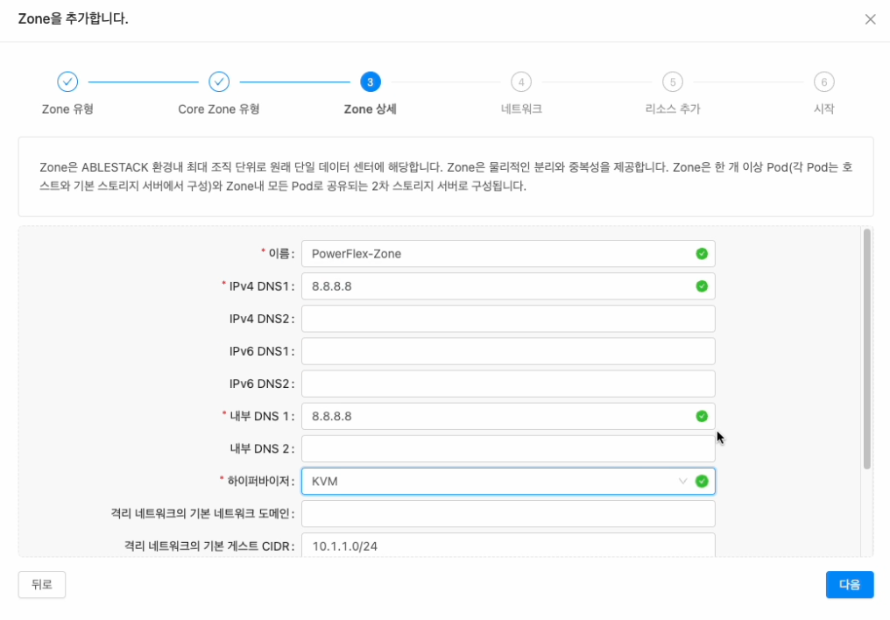{ .imgCenter .imgBorder }
    - Zone 에 대한 정보를 입력하는 화면 입니다.
    - **이름** 에는 **PowerFlex-Zone** 을 입력합니다.
    - **IPv4 DNS1** 에는 **8.8.8.8** 을 입력합니다.
    - **내부 DNS 1** 에는 **8.8.8.8** 을 입력합니다.
    - **하이퍼바이저** 선택 박스는 **KVM** 을 선택합니다.
    - 입력 정보 확인 후에 **다음** 버튼을 클릭 합니다.

5. 클라우드센터 Zone 물리 네트워크
   { .imgCenter .imgBorder }
    - Zone 의 네트워크 정보를 확인하는 화면입니다.
    - 입력된 정보를 확인 후 **다음** 버튼을 클릭합니다.

6. 클라우드센터 Zone 서비스용 네트워크 정보
    { .imgCenter .imgBorder }
    - Zone 의 서비스용 네트워크 정보를 입력 하는 화면입니다.
    - **게이트웨이** 항목에는 **10.10.0.1**, **넷마스크** 항목에는 **255.255.0.0**, **시작 IP 주소** 항목에는 **10.10.32.20**, **10.10.32.106**, **종료 IP 주소** 항목에는 **10.10.32.99** , **10.10.32.249** 을 입력하고 **추가** 버튼을 클릭합니다.
    - 입력한 정보를 확인 후 **다음** 버튼을 클릭합니다.

    !!! check
        해당 IP 대역에 사용되는 쿠버네티스 컨테이너 IP와 IPMI 관리 IP를 제외한 IP 범위를 입력 해야 합니다.

7. 클라우드센터 Pod 네트워크 정보
    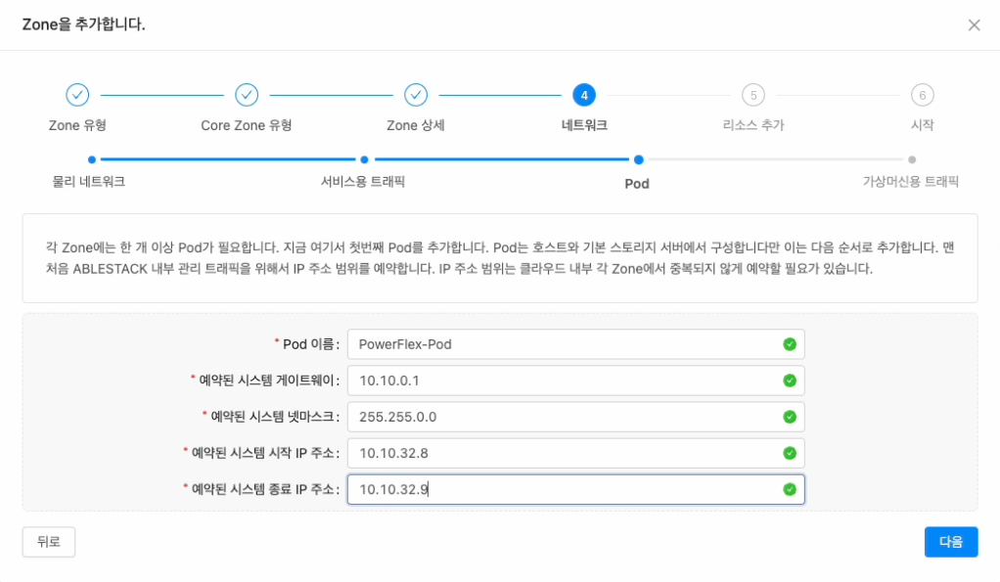{ .imgCenter .imgBorder }
    - Pod 네트워크 정보를 입력하는 화면 입니다.
    - **Pod 이름** 항목에는 **PowerFlex-Pod** 를 입력합니다.
    - **예약된 시스템 게이트웨이** 항목에는 **10.10.0.1** 을 입력합니다.
    - **예약된 시스템 넷마스크** 항목에는 **255.255.0.0** 을 입력합니다.
    - **예약된 시스템 시작 IP 주소** 항목에는 **10.10.32.8** 을 입력합니다.
    - **예약된 시스템 종료 IP 주소** 항목에는 **10.10.32.9** 을 입력합니다.
    - 입력한 정보를 확인 후 **다음** 버튼을 클릭합니다.

8. 클라우드센터 가상머신용 네트워크 정보
    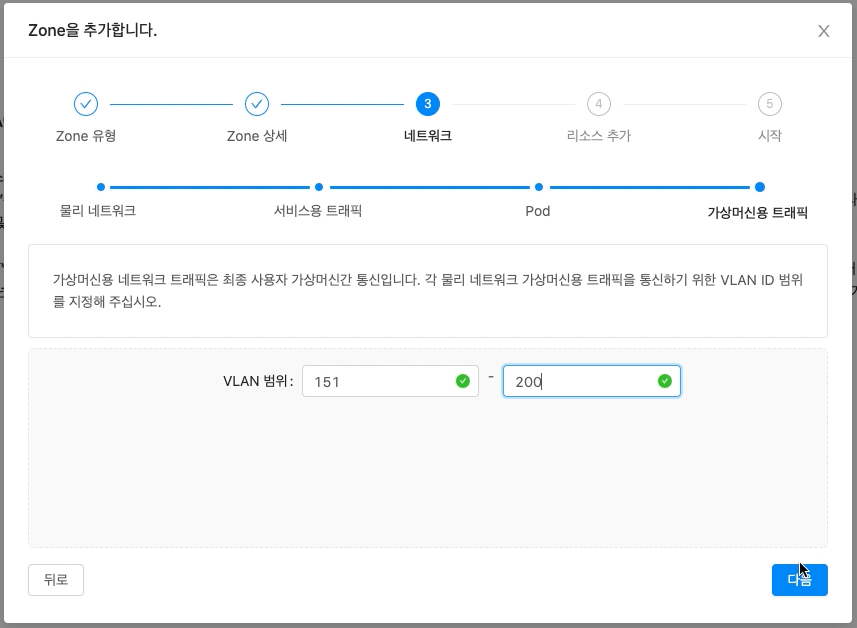{ .imgCenter .imgBorder }
    - 가상머신용 네트워크 정보를 입력하는 화면입니다.
    - **VLAN 범위** 에 **151**, **200** 을 입력합니다.
    - 입력한 정보를 확인 후 **다음** 버튼을 클릭합니다.

9. 클라우드센터 클러스터 정보
   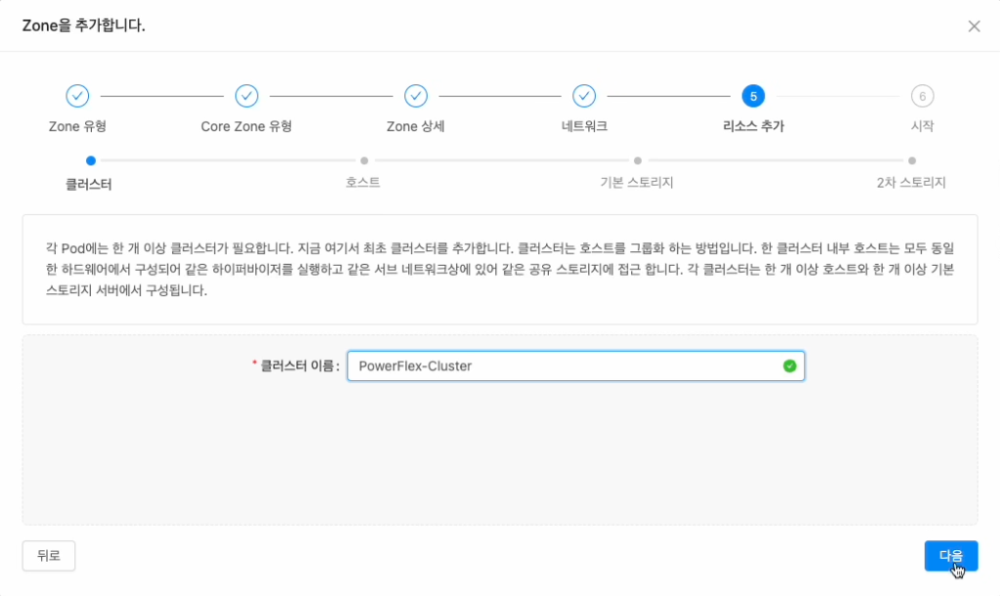{ .imgCenter .imgBorder }
    - 클라우드센터 클러스터 정보를 입력하는 화면입니다.
    - **클러스터 이름** 항목에 **PowerFlex-Cluster** 를 입력합니다.
    - 입력한 정보를 확인 후 **다음** 버튼을 클릭합니다.

10. 클라우드센터 호스트 추가
    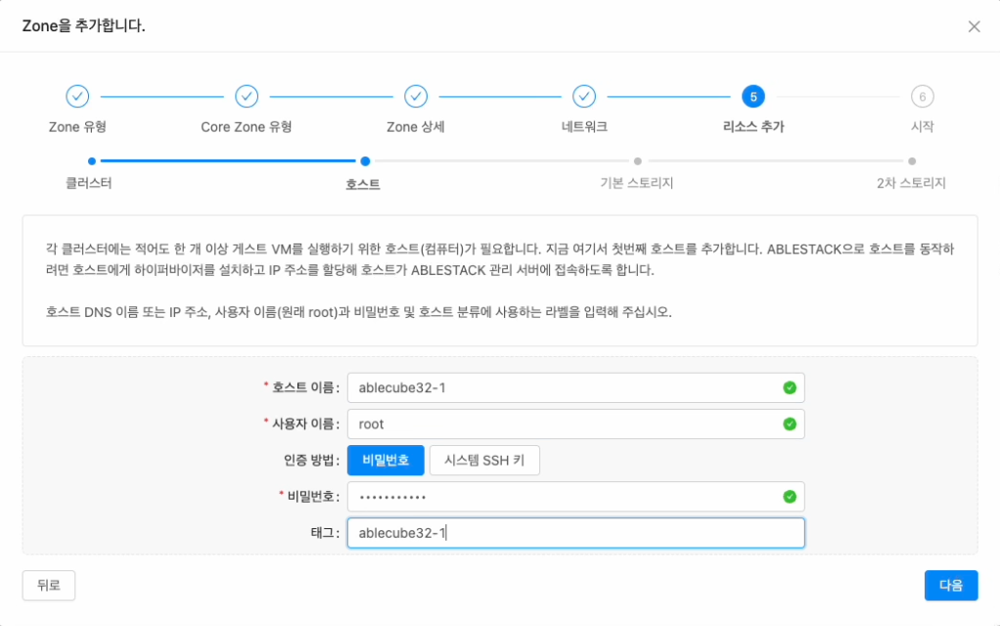{ .imgCenter .imgBorder }
    - 클라우드센터에 호스트를 추가하는 화면 입니다.
    - **호스트 이름** 항목에는 **10.10.32.1** 을 입력합니다.
    - **사용자 이름** 항목에는 **root** 를 입력합니다.
    - **비밀번호** 항목에는 **비밀번호** 를 입력합니다.
    - **태그** 항목에는 **ablecube32-1** 을 입력합니다.
    - 입력한 정보를 확인 후 **다음** 버튼을 클릭합니다.

11. 클라우드센터 기본스토리지 추가
    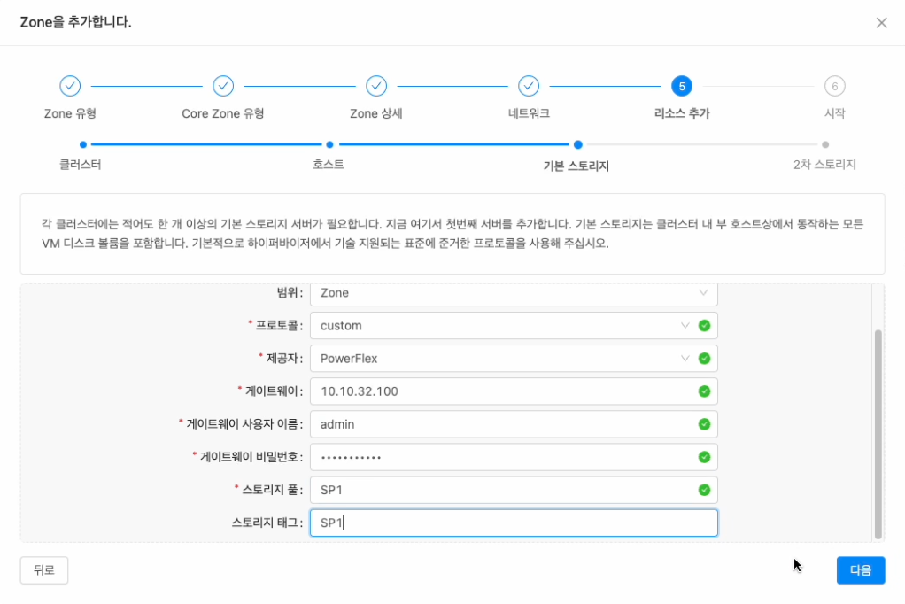{ .imgCenter .imgBorder }
    - 기본 스토리지 추가하는 화면입니다.
    - **이름** 항목에는 **PowerFlex-Primary** 를 입력합니다.
    - **범위** 선택 박스에는 **zone** 을 선택합니다.
    - **프로토콜** 선택 박스에는 **custom** 를 선택합니다.
    - **제공자** 선택 박스에는 **PowerFlex** 를 선택합니다.
    - **게이트웨이** 항목에는 **10.10.32.100** 를 입력합니다.

        !!! info
            기본 스토리지 추가를 위해서는 Glue 사용자의 접속 IP와 이름 및 비밀번호를 확인하셔야 합니다. 확인 방법은 PowerFlex Cube 호스트에서 아래 명령어를 통해 확인 가능합니다.
            ``` bash
            cat /usr/share/cockpit/ablestack/tools/properties/pfmp_config.json | grep "PFMPHostIP"
            ```
            위 명령어에 나온 IP가 PowerFlex의 게이트웨이 IP 입니다.

    - **게이트웨이 사용자 이름** 항목에는 **admin** 을 입력합니다.
    - **게이트웨이 비밀번호** 항목에는 **Glue의 변경된 비밀번호** 을 입력합니다.
    - **스토리지 풀** 항목에는 **SP1** 를 입력합니다.
    - **스토리지 태그** 항목에는 **SP1** 을 입력합니다.
    - 입력한 정보를 확인 후 **다음** 버튼을 클릭합니다.

12. 클라우드센터 2차 스토리지 추가
    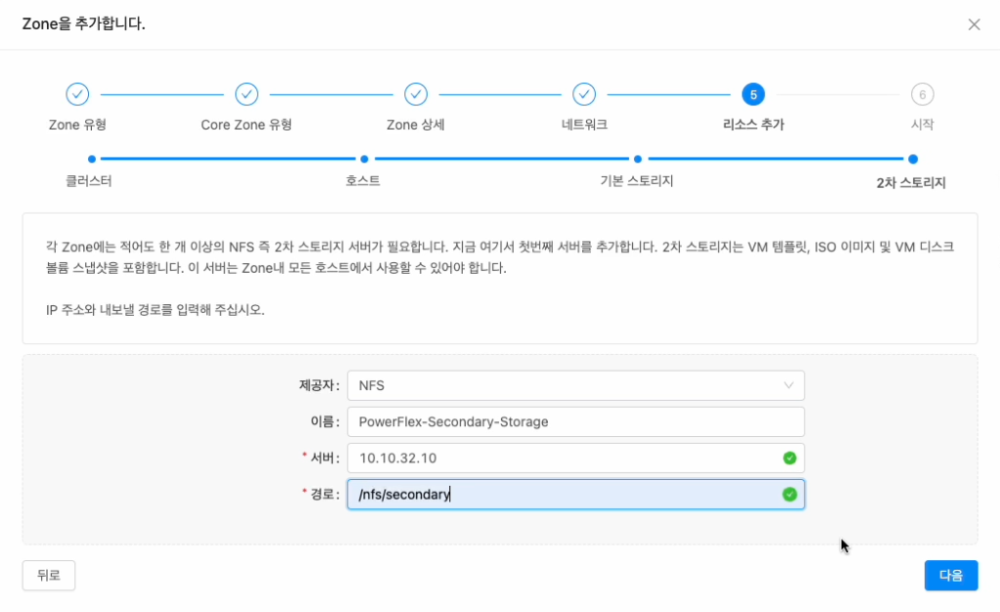{ .imgCenter .imgBorder }
    - 2차 스토리지를 추가하는 화면입니다.
    - **제공자** 선택 박스에서 **NFS** 를 선택 합니다.
    - **이름** 항목에는 **PowerFlex-Secondary-Storage** 를 입력합니다.
    - **서버** 항목에는 **10.10.32.10** (ccvm mngt ip) 를 입력합니다.
    - **경로** 항목에는 **secondary** 를 입력합니다.
    - 입력한 정보를 확인 후 **다음** 버튼을 클릭합니다.

13. 클라우드센터 Zone 추가중
    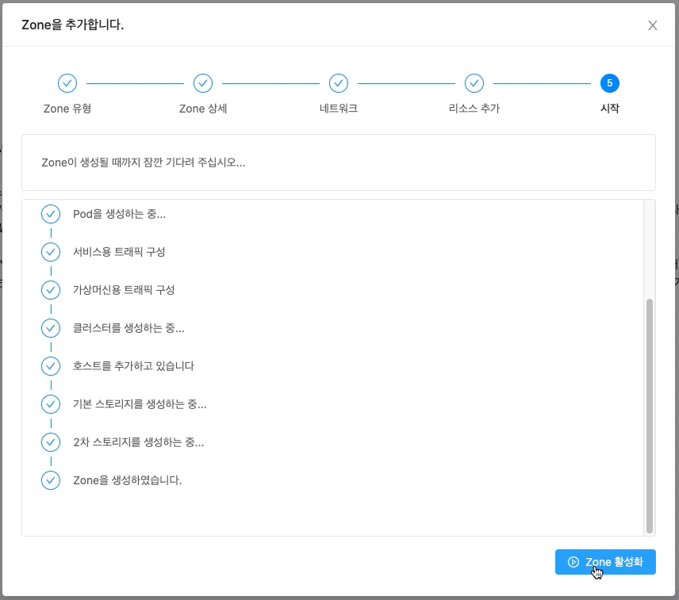{ .imgCenter .imgBorder }
    - zone 추가 중 화면 입니다.

14. ablecube2 호스트 추가
    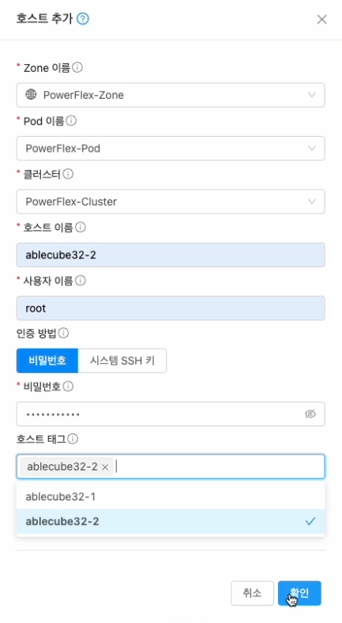{ .imgCenter .imgBorder }
    - 클라우드센터 ablecube32-2 호스트를 추가하는 화면 입니다.
    - **Zone 이름** 항목에는 **Zone** 을 선택합니다.
    - **Pod 이름** 항목에는 **Pod** 을 선택합니다.
    - **클러스터** 항목에는 **Cluster** 를 선택합니다.
    - **호스트 이름** 항목에는 **ablecloud32-2** 를 입력합니다.
    - **사용자 이름** 항목에는 **root** 를 입력합니다.
    - **비밀번호** 항목에는 **비밀번호** 를 입력합니다.
    - **호스트 태그** 항목에는 **ablecube32-2** 를 입력합니다.
    - 입력한 정보를 확인 후 **다음** 버튼을 클릭합니다.

14. ablecube3 호스트 추가
    { .imgCenter .imgBorder }
    - 클라우드센터 ablecube32-3 호스트를 추가하는 화면 입니다.
    - **Zone 이름** 항목에는 **Zone** 을 선택합니다.
    - **Pod 이름** 항목에는 **Pod** 을 선택합니다.
    - **클러스터** 항목에는 **Cluster** 를 선택합니다.
    - **호스트 이름** 항목에는 **ablecloud32-3** 를 입력합니다.
    - **사용자 이름** 항목에는 **root** 를 입력합니다.
    - **비밀번호** 항목에는 **비밀번호** 를 입력합니다.
    - **호스트 태그** 항목에는 **ablecube32-3** 를 입력합니다.
    - 입력한 정보를 확인 후 **다음** 버튼을 클릭합니다.

15. 호스트 라이선스 확인
    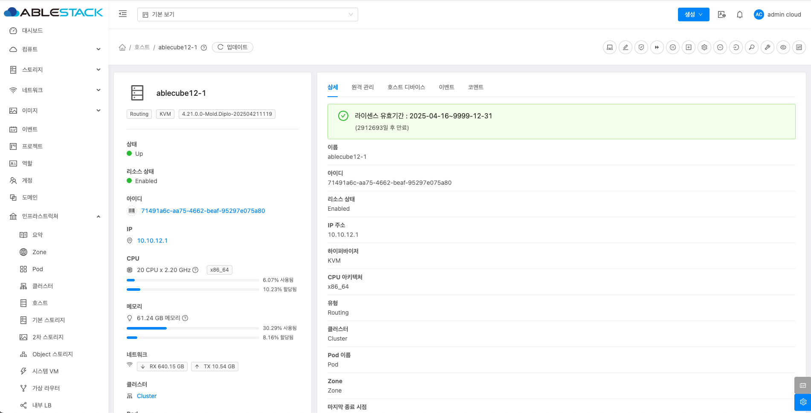{ .imgCenter .imgBorder }
    - 해당 하는 호스트 이름을 클릭하여 라이선스 유효기간을 확인할 수 있습니다.

16. 호스트 고정 메모리 할당

!!! info
    PowerFlex구성 시 필요한 최소 3식의 x86 호스트 서버가 준비되어 있어야 하며, 스토리지센터 가상머신은 각 호스트당 1대씩, 클라우드센터 가상머신은 총 1대입니다.

    스토리지센터 가상머신과 클라우드센터 가상머신의 성능 안정화를 위해 **스토리지센터 가상머신(최소 32GB) + 클라우드센터 가상머신(최소 16GB) + 여유 용량 (A)** 가 필요합니다.

1. 호스트 agent 구성파일
    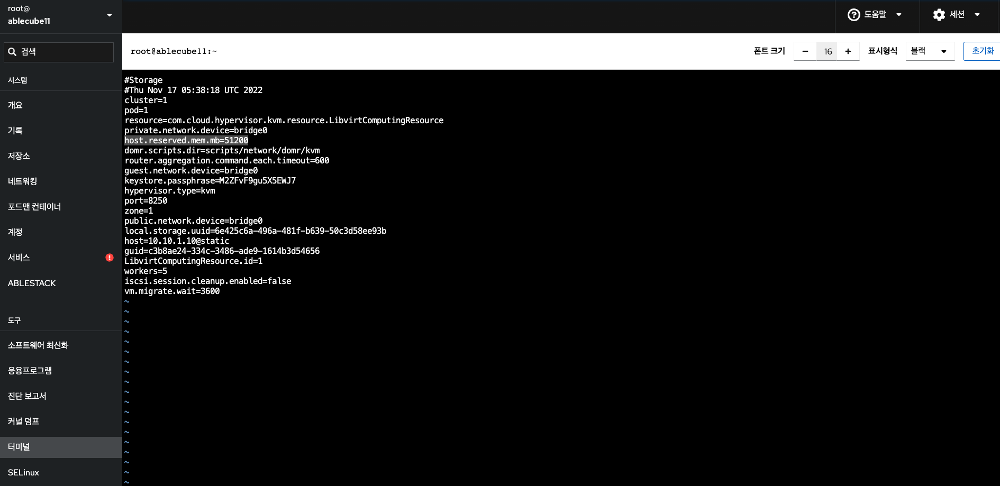{ .imgCenter .imgBorder }
    - 호스트 Cube 터미널 화면입니다.
    - 터미널 명령어 **vi /etc/cloudstack/agent/agent.properties** 입력하고 Enter를 누릅니다.
    - **host.reserved.mem.mb=51200** 라인을 추가하고 **:wq** 명령어로 저장합니다.

    !!! check
        각 호스트에서 명령어를 실행해야 합니다.

2. 호스트 cloudstack-agent 서비스 시작
    { .imgCenter .imgBorder }
    - 터미널 명령어 **systemctl restart cloudstack-agent.service** 를 실행합니다.
