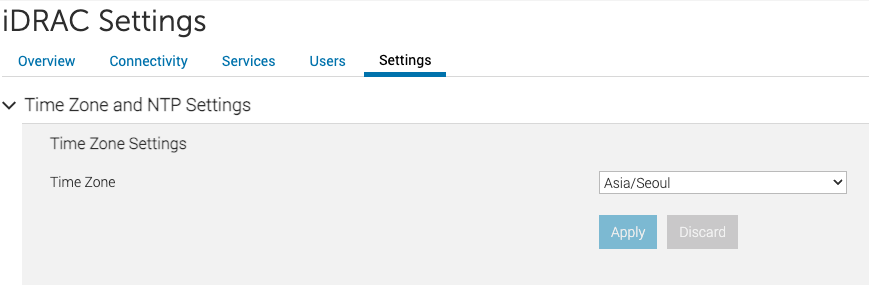

# 시작하기

!!! danger
    이 문서는 관리자용 문서입니다. 관리자가 아닌 사용자가 동작시 문제가 발생할수도 있습니다.

PowerFlex을 설치하기 위해서는 PowerFlex의 아키텍처를 기본적으로 숙지하고 있어야 하며 해당 아키텍처는 다른 문서를 통하여 제공하고 있습니다.

## 사전준비 사항
PowerFlex을 설치하고 구성하기 위해서는 다음과 같은 구성 요소들이 사전에 준비되어 있어야 합니다

- PowerFlex이 설치될 3식의 Intel 또는 AMD x86 64비트 기반의 호스트 서버가 준비 되어 있어야 합니다.
- 서버간 네트워크 연결을 위한 10G 스위치 및 10G 용 케이블이 준비 되어 있어야 합니다.
- ABLESTACK ISO 파일이 들어있는 USB, PowerFlex용 SCVM,PFMP 템플릿 이미지가 들어있는 USB가 준비 되어 있어야 합니다.

!!! info
    PowerFlex용 SCVM, PFMP 템플릿 이미지가 내장 되어있지 않습니다.

## 설치 전 확인 사항
- 호스트와 스위치간의 네트워크 연결이 정상적으로 되어 있어야 합니다.
- 스위치의 MTU 설정은 최소 9000이상으로 셋팅 되어 있어야 합니다.

!!! Warning
    호스트와 스위치 연결한 Port의 램프가 정상적으로 점멸되는지 확인을 해야하며, 호스트에 PowerFlex을 구성하기 전에 스위치의 Glue Network(Cluster, Server, Client) Port는 MTU 9000이상 설정이 되여 있어야 합니다. 
    셋팅이나 설정이 안되여 있는경우 스토리지 클러스터 구성시 정상적으로 구성되지 않을수도 있습니다.

!!! Tip
    PowerFlex 구성시 스위치의 MTU 설정은 9000으로 맞춰서 설정하기보다 스위치에서 허용하는 최대의 MTU 설정하여 구성하도록 권장하고 있습니다.

## 설치 전 준비 사항(사전정의)
!!! note "IPMI"
    - PowerFlex 표준시는 Asia/Seoul입니다.
    - 서버 시작 전, 서버의 초기 시간 설정을 Asia/Seoul로 변경합니다.
    { .imgCenter .imgBorder }
- PowerFlex를 설치 시 호스트 및 시스템 가상머신들에게 할당할 IP가 필요합니다.
- 할당될 IP는 관리(Management)용 네트워크에 할당되며, 상호간의 통신이 가능하여야 합니다
!!! Tip
    관리등을 위하여 일정대역(연속되는 IP범위)를 할당하는게 효율적입니다
- IP 할당 대상은 다음과 같습니다.
     * 호스트 IP: 각 서버에 할당 되는 IP 이며 서버의 대수 많큼 N개 필요
     * Glue 가상머신(SCVM) IP : 호스트 단위로 배포 되기 때문에 서버의 대수 많큼 N개 필요
     * IPMI 관리 IP : IPMI 통신을 위하여 서버의 대수 많큼 N개 필요
     * PFMP 관리 IP : PowerFlex UI 설치를 위해 일시적으로 1개 필요
     * PowerFlex 내부 관리 IP : PowerFlex의 웹 서버, SupportAssist 및 내부 서비스에서 사용되는 5개의 사용되지 않는 IP 연속적인 주소가 필요
     * Mold 가상머신(CCVM) : 클라우드센터 가상머신 이며 1개 필요
     * 웹 콘솔 프록시 가상머신(CPVM) : 가상머신의 웹콘솔 접속관리를 위한 시스템 프록시 가상머신이며 별도의 외부망(Public Network)이 분리가 되어 있으면 외부네트워크 1개, 관리네트워크 1개 각각 필요하며, 별도로 분리가 되어 있지 않으면 관리네트워크 IP 2개 필요
     * 2차스토리지 관리 가상머신(SSVM) : 이미지,템플릿,백업등의 저장공간인 2차 스토리지 관리를 위한 시스템 가상머신 이며 별도의 외부망(Public Network)이 분리가 되어 있으면 외부네트워크 1개, 관리네트워크 1개 각각 필요하며, 별도로 분리가 되어 있지 않으면 관리네트워크 IP 2개 필요
- 기본적으로 상기 숫자 만큼(3식기준으로는 20개)필요하며, 사용자 가상머신에 할당되는 IP는 네트워크 서비스 용도에 따라 추가적으로 필요합니다.
