# PowerFlex PFMP 설치진행
!!! danger
    이 문서는 기술지원 용도의 문서입니다. 기술지원 엔지니어가 아닌 사용자가 조작할 때 시스템에 문제가 발생할 수 있습니다.
    해당 설치과정에 사용되는 IP 및 입력 정보는 예시이며, 현장에 맞게 수정하시기 바랍니다.

!!! check
    PowerFlex용 SCVM 템플릿과 PFMP 템플릿 이미지는 내장 되어있지 않습니다.

    Glue 설치 진행 전, PowerFlex용 SCVM 템플릿 이미지 및 PFMP 템플릿 이미지를 꼭 확인해주시길 바랍니다.

PowerFlex PFMP 설치 진행 가이드 입니다.
이 문서에서는 PowerFlex PFMP 용 가상머신 생성 가이드 하고 있습니다.
PowerFlex Cube 의 웹콘솔을 이용하여 진행이 되며 웹 접속 IP는 별도의 표시를 하지 않고 진행됩니다.
기존에 구성된 IP 정보에 맞게 웹콘솔을 접속 하시면 됩니다.

!!! note
    PFMP 이미지를 가지고 있는 호스트에서 실행해야 합니다.

    이미지가 실행하는 호스트에 존재하는지 확인합니다.

## PowerFlex PFMP 가상머신 배포
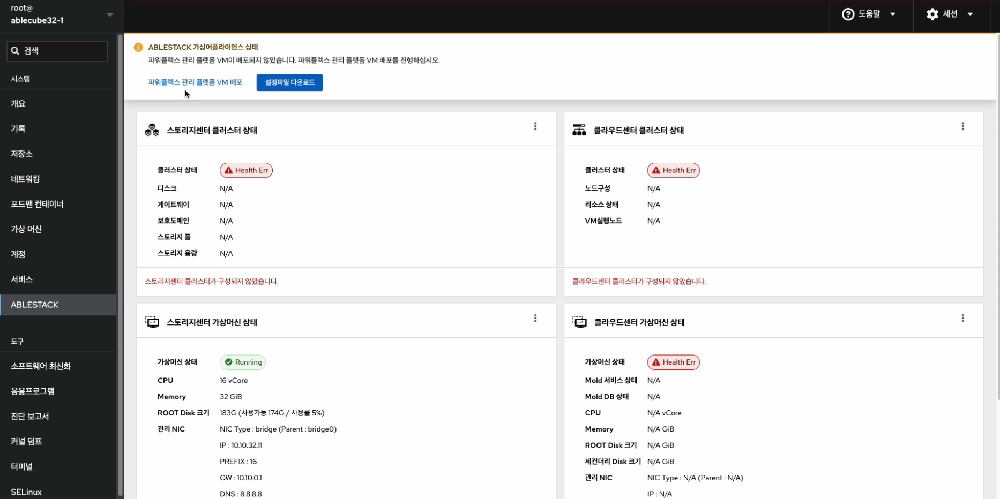{ align=center }
- PFMP 가상머신을 배포하기 위한 화면입니다. 상단 상태 리본의 **파워플렉스 관리 플랫폼 VM 배포** 링크를 클릭합니다.

1. 개요
    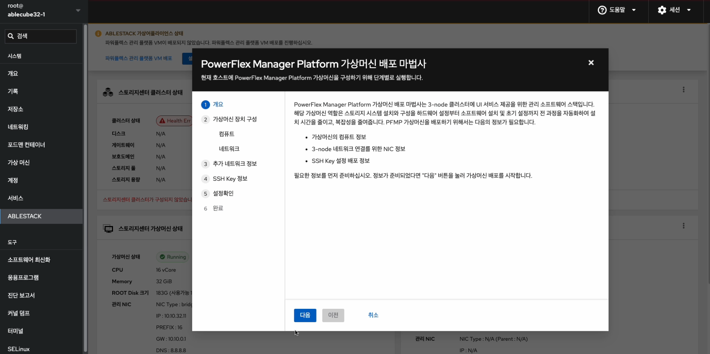{ align=center }
    - PowerFlex PFMP 가상머신 배포 마법사 화면입니다.

2. 가상머신 장치 구성 - 컴퓨트
    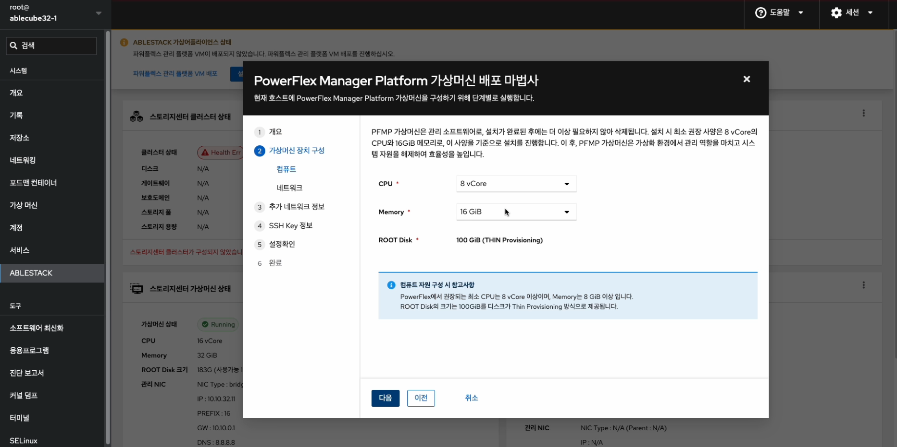{ align=center }
    - PFMP 가상머신 장치 구성의 CPU, Memory 구성 화면입니다.
    - **CPU** 는 **8 vCore** 를 선택 하고, **Memory** 는 **16GiB** 를 선택 하고 **다음** 버튼을 클릭합니다.

    !!! tip
        PFMP 가상머신은 UI, 웹 서비스 및 Support Assistant 패키지를 스토리지 가상머신에 설치하는 역할을 하며, 설치가 완료되면 삭제됩니다.

        최소 권장 사양은 CPU **8 vCore** , 메모리 **16GiB** 입니다.
        ROOT 디스크는 100GiB 크기로, Thin Provisioning 방식으로 제공됩니다.

3. 가상머신 장치구성 - 네트워크
    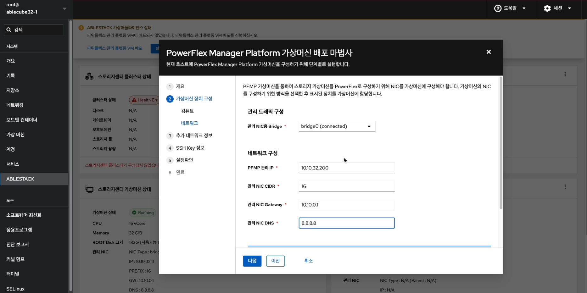{ align=center }
    - PFMP 가상머신 장치의 네트워크 구성 화면입니다.
    - **관리 NIC 용 Bridge** 선택 박스에서 **관리용 Bridge 네트워크** 를 선택합니다.
    - **PFMP 관리 IP** , **관리 NIC CIDR** , **관리 NIC Gateway** , **관리 NIC DNS** 를 입력합니다.

5. 추가 네트워크 정보
    { align=center }
    - **관리 및 모니터링 IP** , **스토리지 서버용 IP** , **스토리지 복제용 IP** 를 입력합니다.

    !!! info
        PFMP 가상머신의 추가 네트워크 정보는 스토리지 가상머신에서 관리 되는 쿠버네티스 컨테이너에 대한 상세 설정입니다.

        시작 IP를 입력하면 시스템이 자동으로 연속된 5개의 IP를 할당합니다.

        예를 들어, 10.10.32.100을 입력하면 10.10.32.100 ~ 10.10.32.104까지의 IP가 자동으로 설정됩니다.

    !!! check
        할당된 5개의 연속 IP가 네트워크 상에서 정상 동작하는 지 확인하세요.

6. SSH Key 정보
    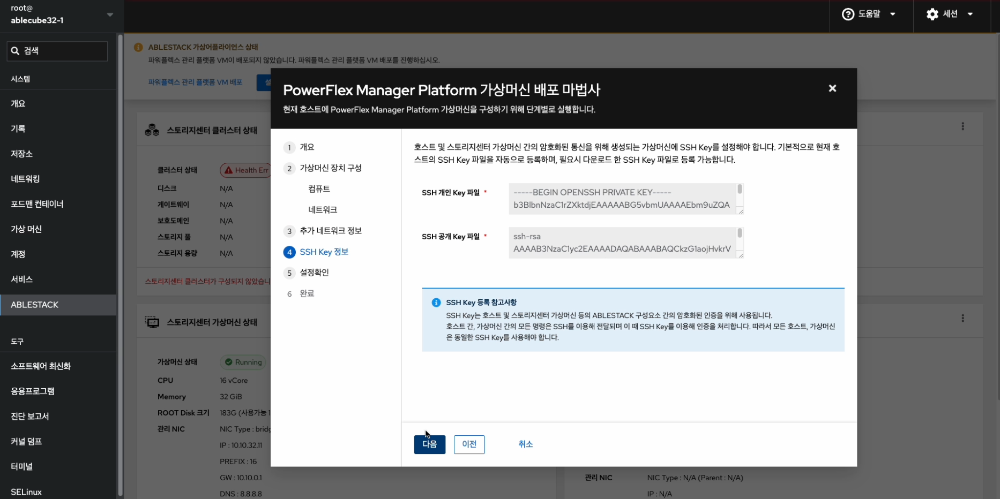{ align=center }
    - SSH Key 정보를 확인하는 화면입니다.
    - PFMP 가상머신 구성시 호스트에 등록된 호스트의 키 정보로 자동세팅됩니다.

    !!! info
        SSH 개인 Key 파일 명은 **id_rsa**, SSH 공개 Key 파일명은 **id_rsa.pub** 으로 고정되어 있습니다.
        키 파일명을 변경할 경우 등록이 불가능 합니다.

7. 설정확인
    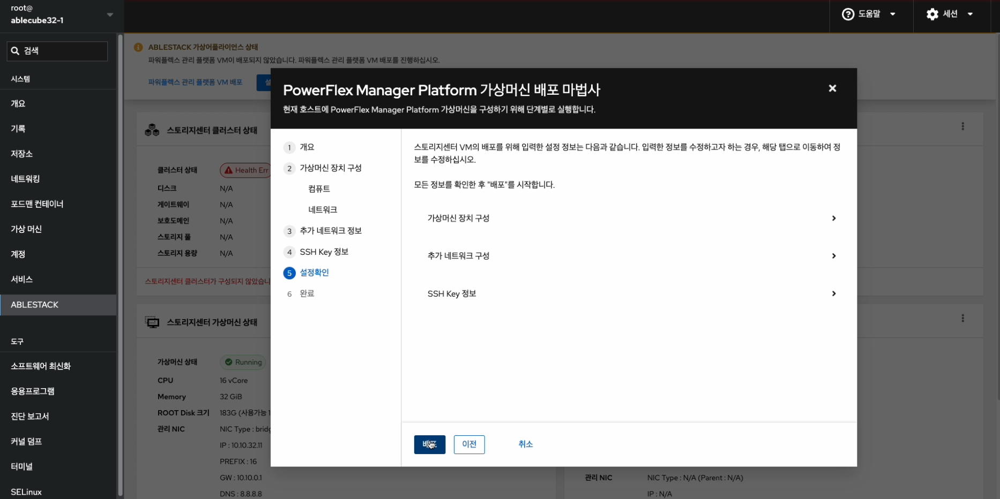{ align=center }
    - PFMP 가상머신 배포를 위한 구성정보 확인하는 화면입니다.
    - **배포** 버튼을 클릭하면 확인창이 보이며 **실행** 버튼을 눌러 스토리지 가상머신을 배포 합니다.

8. 배포
    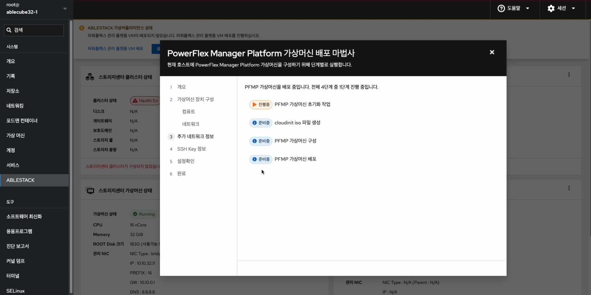{ align=center }
    - PFMP 가상머신 배포 진행상황을 확인 할 수 있는 화면입니다.

9.  완료
    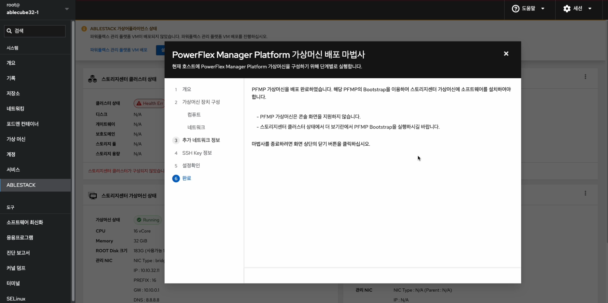{ align=center }
    - PFMP 가상머신 배포 완료 후 화면입니다.

!!! info
    PowerFlex Glue 대시보드 생성하기 위해 설치를 진행합니다.

## PFMP 설치
PFMP 설치는 PowerFlex Glue 대시보드 화면을 생성하기 위한 절차입니다.

!!! note
    PFMP 설치는 총 3단계로 진행되며, 전체 설치에는 약 2시간이 소요됩니다.

    1단계: PFMP 가상머신에서 내장된 쿠버네티스 이미지 및 패키지 등을 로컬에서 설정하고 구성합니다.

    2단계: 모든 스토리지 가상머신에 역할 기반 컨테이너를 설정하고 구성합니다.

    3단계: PFMP 가상머신을 삭제하여 설치 절차를 완료합니다.

1. PFMP 설치 실행
    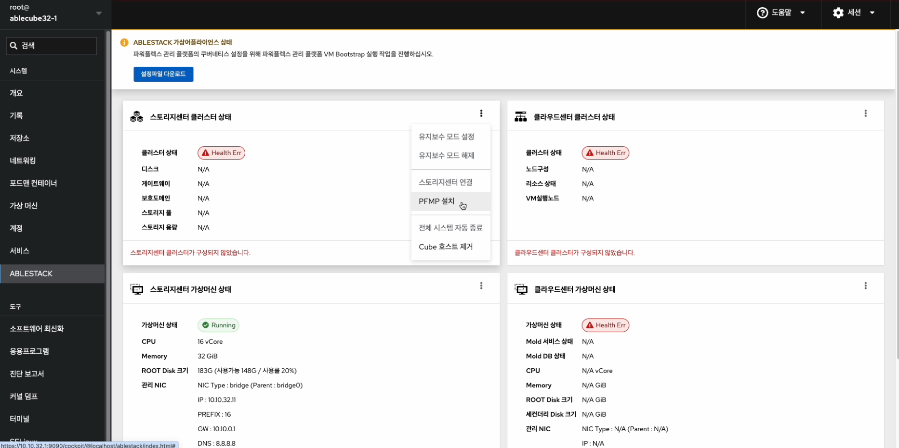{ align=center }
    - PFMP 가상머신이 있는 호스트의 PowerFlex Cube 웹 콘솔로 이동합니다.
    - 스토리지센터 클러스터 상태 카드의 메뉴 버튼을 클릭하여 **PFMP 실행** 버튼을 클릭합니다.
    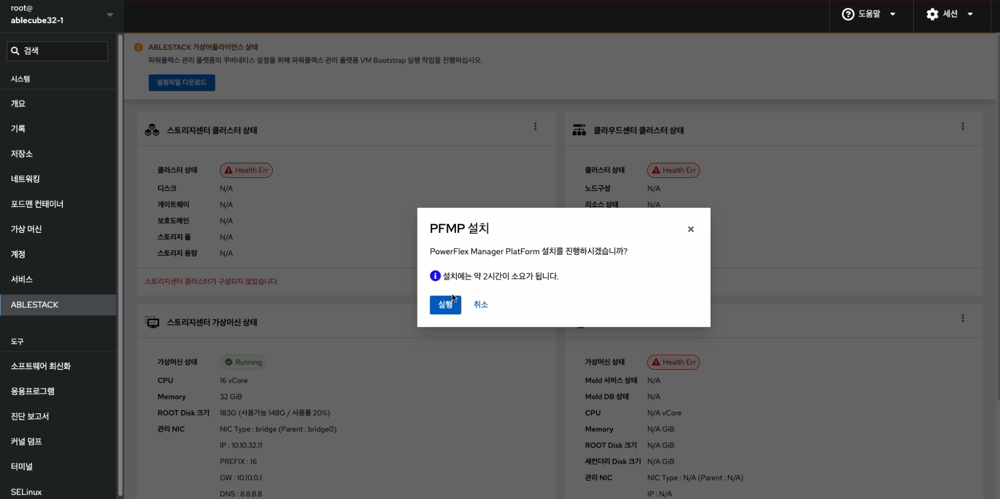{ align=center }
    - **실행** 버튼을 클릭하여 **PFMP 설치** 를 실행시킵니다.
    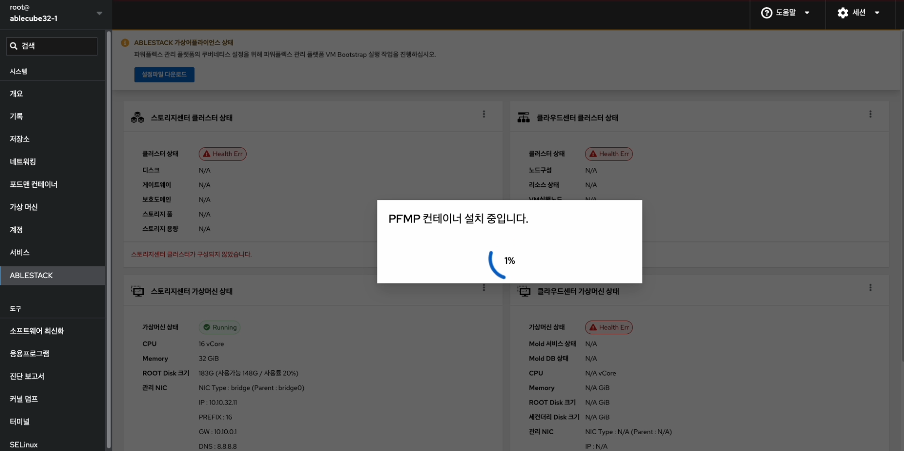{ align=center }
    - 1단계 설치 단계 화면입니다.
    - 설치 진행률을 실시간으로 제공합니다.
    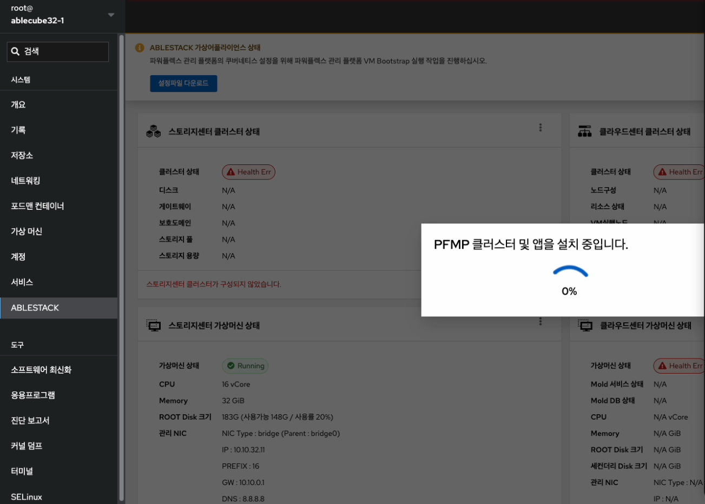{ align=center }
    - 2단계 설치 단계 화면입니다.
    - 설치 진행률을 실시간으로 제공합니다.
    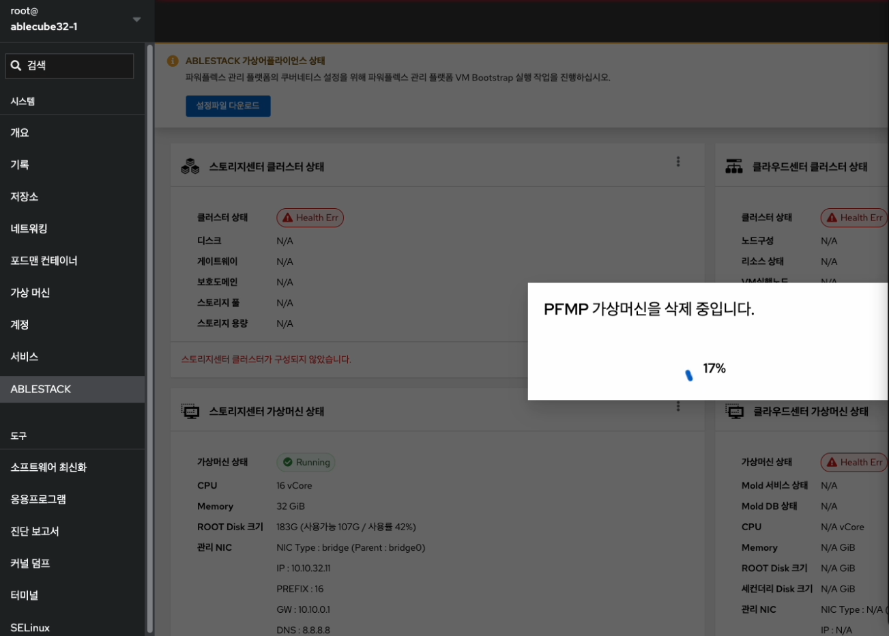{ align=center }
    - 3단계 설치 단계 화면입니다.
    - 설치 진행률을 실시간으로 제공합니다.
    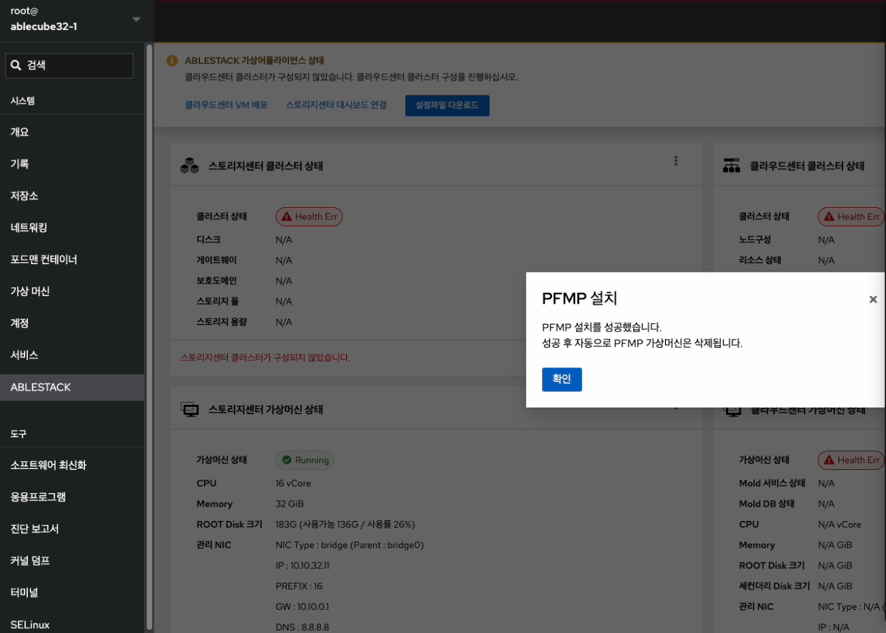{ align=center }
    - 설치가 완료된 화면입니다.
    - **확인** 버튼을 클릭하여 다음 절차를 진행하세요.

    !!! info
        PFMP가 설치되는 로그파일은 따로 제공하지 않습니다.

        설치 세부 정보를 확인하려면, 해당 PFMP 가상머신에 직접 접속하여 확인하시기 바랍니다.

    !!! tip
        크롬을 이용하여 **스토리지센터 대시보드** 접속 할 경우 **연결이 비공개로 설정되어 있지 않습니다.** 문구와 함게 페이지를 열 수 없습니다.
        이 경우에는 해당 화면에서 **thisisunsafe** 입력 후 엔터키를 입력하면 해당 페이지에 접속 할 수 있습니다.

2. Glue 대시보드 접속 및 비밀번호 변경
    1. Glue 대시보드 접속
        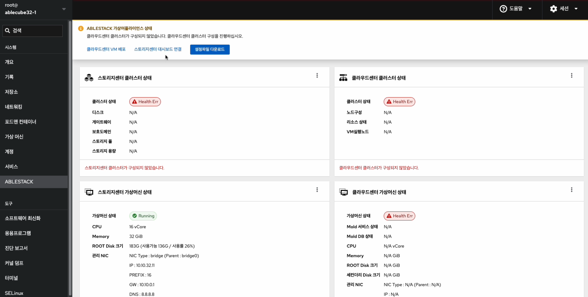{ align=center }
        - **스토리지 대시보드 연결** 링크를 클릭하여 Glue 대시보드를 접속합니다.

    2. Glue 대시보드 로그인 화면
        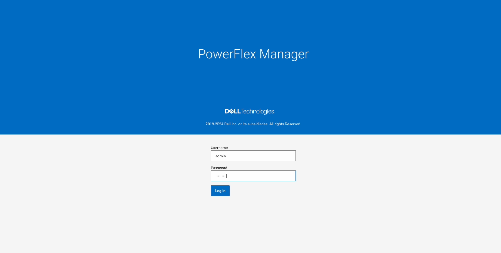{ align=center }
        - Glue 대시보드 로그인 화면입니다.
        - **사용자 이름** 과 **비밀번호** 를 입력하고 **로그인** 버튼을 클릭하여 로그인 합니다.

    !!! info
        PowerFlex Glue 대시보드 로그인 사용자 이름 은 **admin**, 초기 비밀번호 는 **Admin123!** 입니다.
        해당 계정 및 비밀번호로 최초 로그인을 하시면 비밀번호를 무조건 변경 하셔야 합니다.

    3. Glue 대시보드 비밀번호 변경
        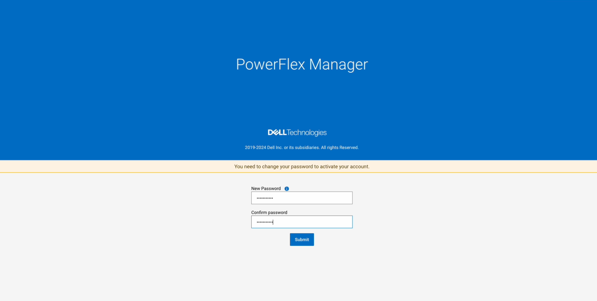{ align=center }
        - 초기 비밀번호 변경하는 화면입니다.
        - **New password** 와 **Confirm password** 입력창에 신규 비밀번호를 입력하고 **Submit** 버튼을 클릭합니다.

## Glue 대시보드 클러스터 및 스토리지 구성
1. Glue 클러스터 및 스토리지 구성
    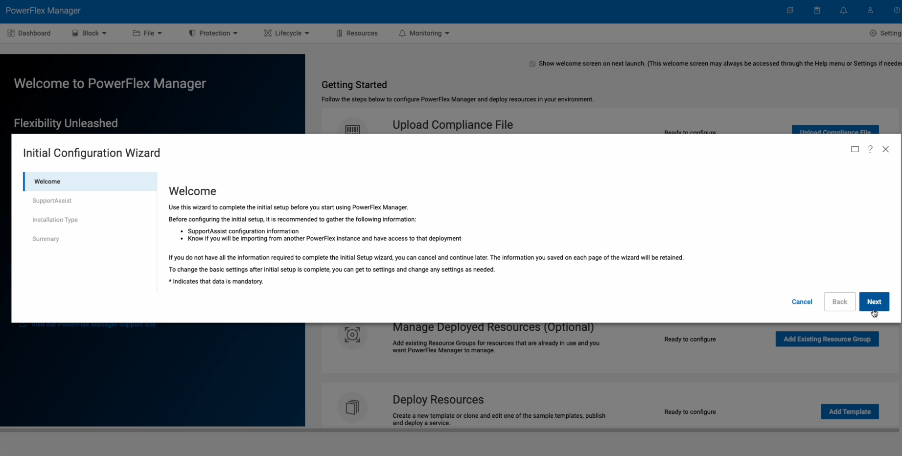{ align=center }
    - 첫 화면에서 보여지는 클러스터 및 스토리지 구성 준비 화면입니다.
    - **Next** 버튼을 클릭하여 다음 절차를 진행합니다.
    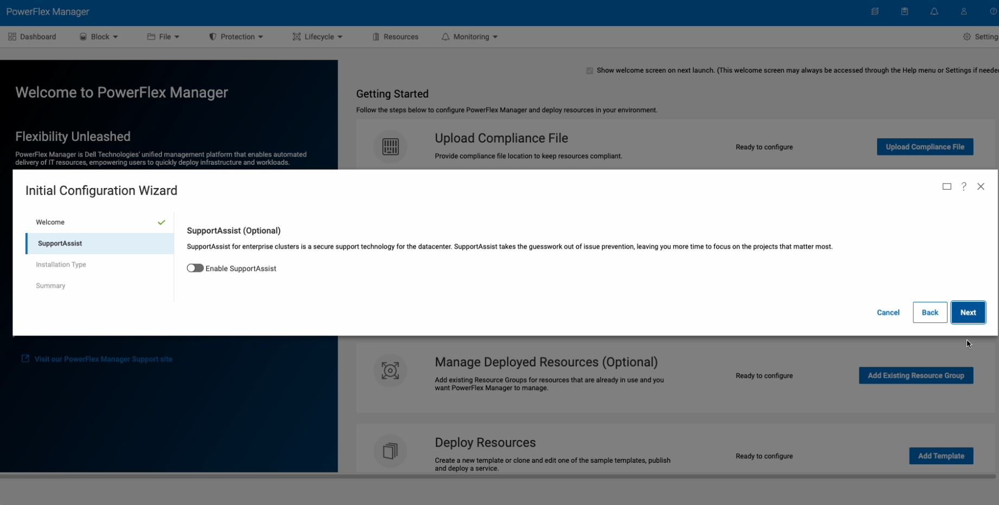{ align=center }
    - **Next** 버튼을 클릭하여 다음 절차를 진행합니다.
    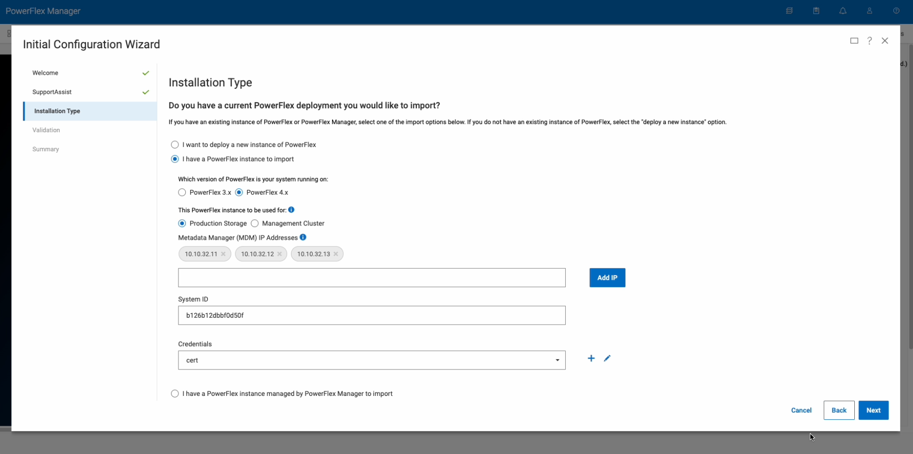{ align=center }
    - **I have a PowerFlex instance to import** 를 클릭하여 **PowerFlex 4.x** 를 클릭합니다.
    - **Metadata Manager (MDM) IP Addresses** 입력란에 모든 **스토리지 가상머신 관리 IP** 를 입력합니다.
    - **System ID** 를 입력합니다.

        !!! check
            System ID를 확인하려면, 스토리지 클러스터 **Bootstrap** 을 실행했던 호스트에서 /var/log/scvm_bootstrap.log 파일을 vi 편집기를 사용하여 열고, **System** 을 검색합니다.
            ```
            vi /var/log/scvm_bootstrap.log
            ```
            해당하는 ID를 복사하여 붙여넣기 합니다.
            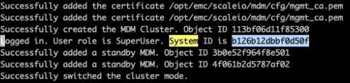{ align=center }

    - **Credentials** 에서 **+** 버튼을 클릭합니다.
    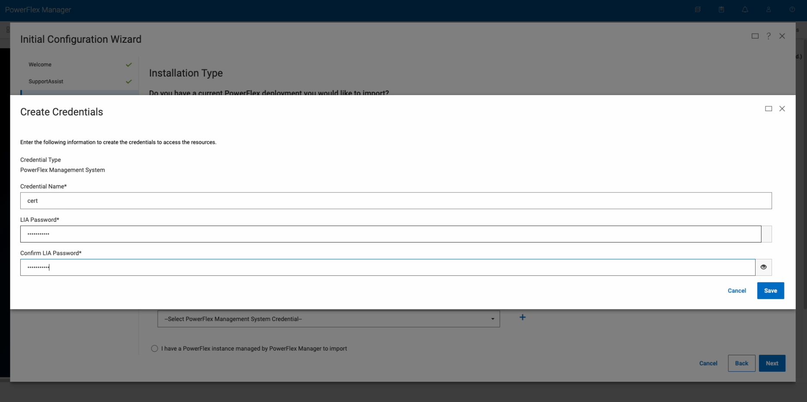{ align=center }
    - **Credentials Name** 을 입력합니다.
    - **LIA Password** 및 **Confirm LIA Password** 를 입력합니다.

        !!! check
            LIA Password는 **Ablecloud1!** 입니다.

    - **Save** 버튼을 클릭하여 다음 절차를 진행합니다.
    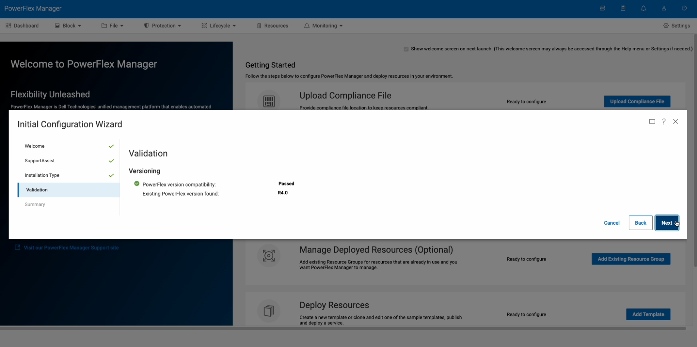{ align=center }
    - **Next** 버튼을 클릭하여 다음 절차를 진행합니다.
    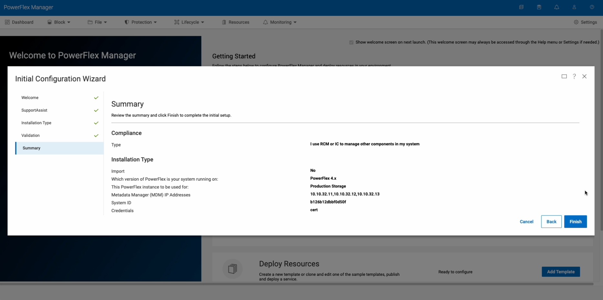{ align=center }
    - 입력한 정보들이 맞는지 확인 후, **Finish** 버튼을 클릭하여 다음 절차를 진행합니다.
    { align=center }
    - 등록이 완료되면, PowerFlex Cube 웹 콘솔에서 스토리지센터 클러스터 상태 카드란에 정보가 나타납니다.
    - 등록 완료된 화면입니다.

    !!! info
        클러스터 및 스토리지 구성이 UI에 등록되기까지 약 5분이 소요됩니다.

!!! info
    PowerFlex Glue 대시보드 구성이 완료되었습니다.
    PowerFlex Mold 구성도 PowerFlex Cube 웹 콘솔을 이용하여 할 수 있습니다.