# ABLESTACK STANDALONE Cube 설치진행

!!! danger
    이 문서는 기술지원 용도의 문서입니다. 기술지원 엔지니어가 아닌 사용자가 조작할 때 시스템에 문제가 발생할 수 있습니다.

ABLESTACK STANDALONE Cube를 설치 진행 가이드 입니다.
해당 가이드는 기본적으로 Linux 계열의 OS 설치 경험이 없어도 설치 할 수 있는 쉬운 사용자 경험을 제공 하나 기본적인 Linux 계열의 OS 이해도를 가지고 있으면 조금더 쉽게 설치가 가능합니다.

!!! info
    - 해당 문서는 사용자의 네트워크 환경 및 설정 정보를 고려하지 않고 작성된 문서 입니다. 이 문서를 기준으로 활용을 하셔야 하며 수정 및 변경 할 부분은 **강조** 표시를 해두었습니다.
    - ABLESTACK STANDALONE Cube 설치시 ABLESTACK Cell이 동시에 설치가 진행되며, ABLESTACK Cell의 설치가이드는 따로 제공 되고 있지 않습니다.

!!! 사전준비 info
    - ABLESTACK 설치용 ISO 또는 ABLESTACK 설치용 USB
    - 호스트의 Manage Network 대역에 접근 가능한 Desktop 또는 Notebook
    - Manage Network IP

!!! 사전설정 warning
    - ABLESTACK Diplo 는 Asia/Seoul를 기준으로 시간서버를 설정합니다.
    - 따라서 ABLESTACK 설치 전 서버 BIOS 설정에서 해당 서버의 시간을 Asia/Seoul로 설정해야 합니다.

## ABLESTACK STANDALONE Cube 설치 진행 가이드

1. ABLESTACK ISO를 이용한 USB 부팅 화면 입니다.
    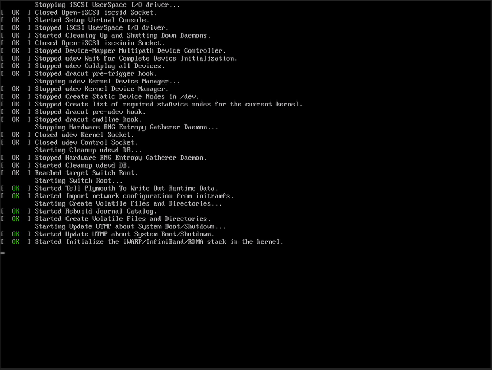{ .imgCenter .imgBorder }

2. 부팅 완료 후 ABLESTACK 설치 메뉴 화면 입니다.
    정상적으로 ISO 또는 USB를 이용하여 정상적으로 부팅되면 아래와 같은 이미지의 화면으로 전환됩니다.
    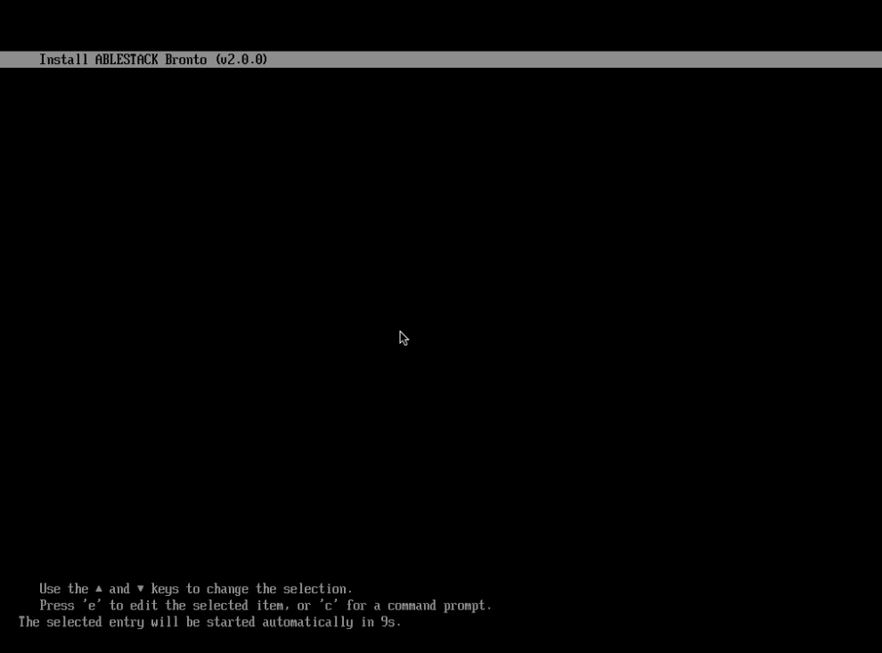{ .imgCenter .imgBorder }

    !!! Check
        화면에서 **Install ABLESTACK Diplo** 메뉴가 보이는지 확인해야 합니다. 해당 메뉴가 보이면 ABLESTACK STANDALONE Cube 정상적으로 설치를 하실 수 있습니다.</br>
        만약 해당 메뉴가 보이지 않는다면 정상적인 부팅이 되지 않은 경우이므로 부팅매체를 확인하고 재부팅을 해야 합니다.</br>
        다시 한번 부팅해도 해당 메뉴가 보이지 않는다면 ISO 또는 USB가 손상되었을 수 있습니다.

3. ABLESTACK STANDALONE Cube 구성 화면 입니다.
    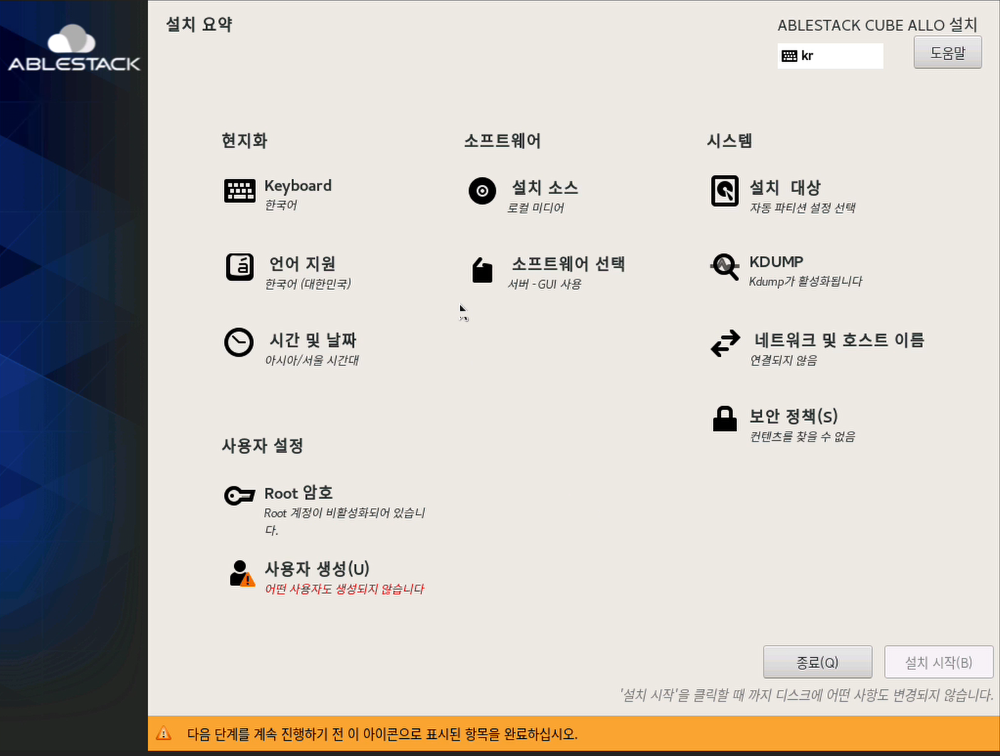{ .imgCenter .imgBorder }

    !!! info
        ABLESTACK STANDALONE Cube는 기본적인 정보는 자동으로 설정이 되어 있습니다.
        **Installation Destination, Network & Host name** 항목에 대해서만 설정하면 됩니다.</br>
        - Keyboard, Language Support, Installation Source, Software Selection, KDUMP, Security Policy, Root Password 항목은 수정하실 필요가 없습니다.

    !!! Tip
        설정정보 입력시 'Network & Host name' > 'Installation Destination' 순서대로 설정하는 것을 권장합니다.

4. 네트워크 및 호스트 이름 구성변경 화면
    - ABLESTACK STANDALONE Cube 구성화면에서 **Network & Host Name** 을 클릭하면 해당 화면으로 이동됩니다.

    1. 호스트 이름 설정
        { .imgCenter .imgBorder }
        * Host name에 hostname을 입력합니다.
        !!! Tip
            일반적으로 호스트명은 "ablecube23"과 같이 ablecube + 넘버링 형태로 지정하면 향후 관리가 용이합니다.
        * 적용 버튼을 클릭하여 Host name을 적용합니다.
        * 적용된 Host name이 정상적으로 현재 호스트 이름에 표시 되는지 확인합니다.

        * 호스트 이름 설정한 후, 해당 하는 NIC를 선택합니다.

    2. 자동 우선 순위 설정
        { .imgCenter .imgBorder }
        - **General** 탭에서 **Connect automatically with priority** 를 선택 하여 기본 값 **0** 으로 설정합니다.

    3. IP 설정
        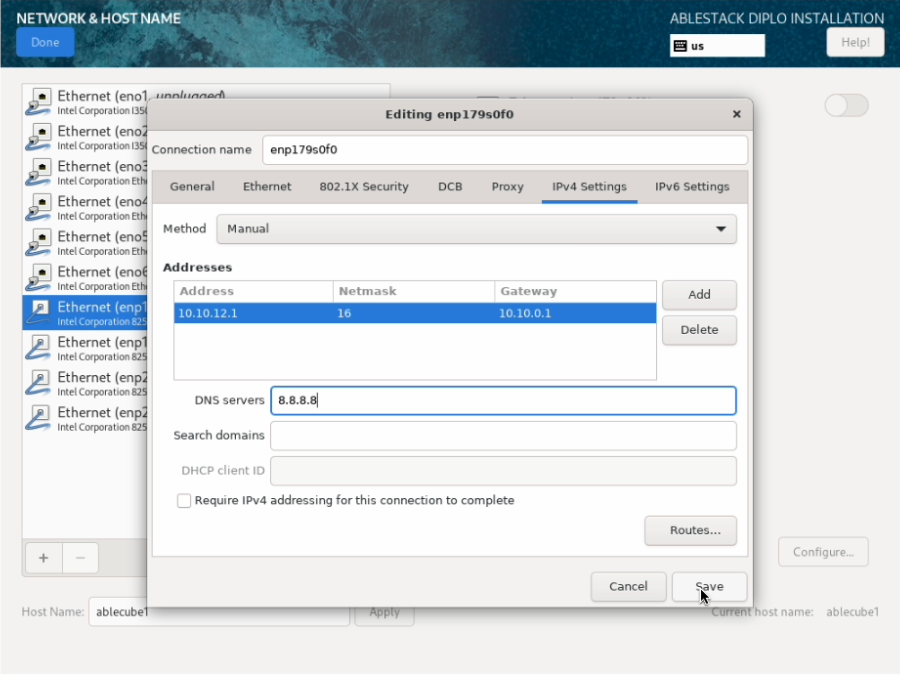{ .imgCenter .imgBorder }
        - IP 설정을 수동으로 할 시 **Manual** 을 선택합니다.
        - 미리 설정 해둔 **Address** , **Netmask** , **Gateway** , **DNS** 를 입력합니다.

    4. 네트워크 활성화
        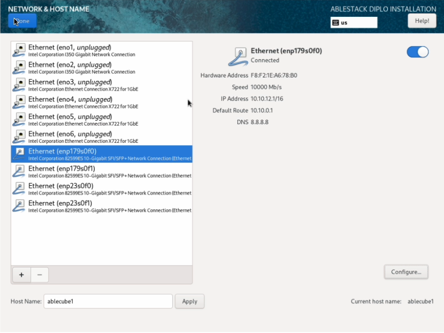{ .imgCenter .imgBorder }

        !!! check
            IP 설정을 다 한 후, 꼭 NIC를 활성화 하여야 합니다.

    !!! note
        네트워크의 목록 및 장치명 등은 물리적 네트워크의 구성과 하드웨어 벤더사에 따라 다르게 표기될 수 있습니다.

5. 설치 대상 구성 화면
    - ABLESTACK STANDALONE Cube 구성화면에서 **Installation Destination** 을 클릭하면 해당 화면으로 이동됩니다.

    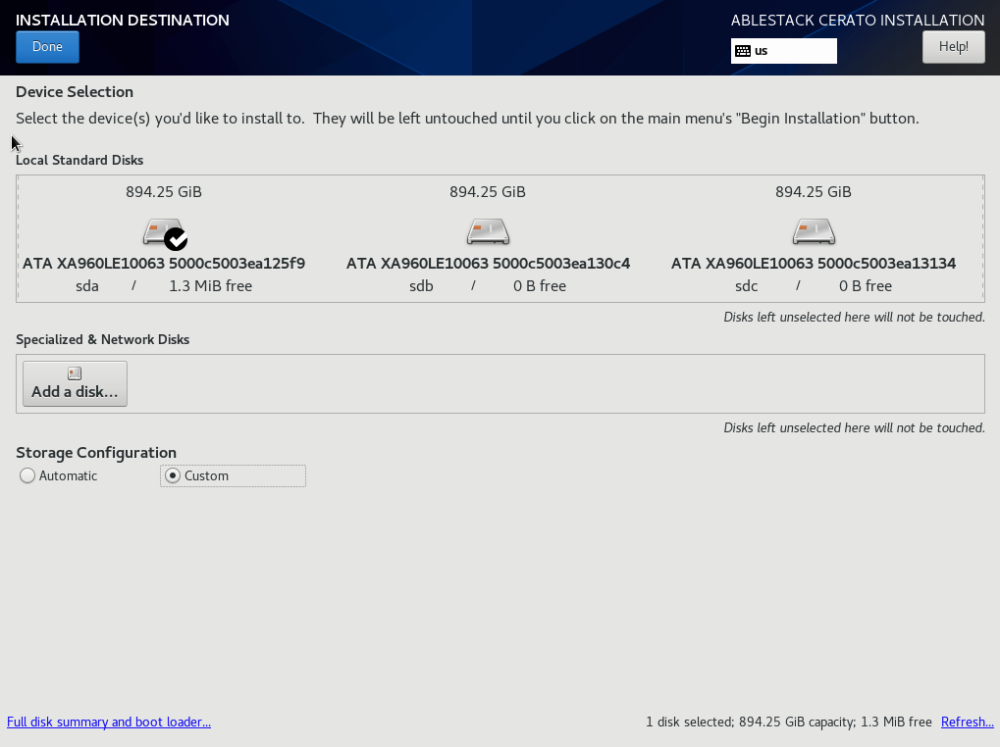{ .imgCenter .imgBorder }

    !!! note
        디스크 장치 목록은 디스크 구성 및 종류,수량에 따라 다르게 표시될 수 있습니다.
    * 디스크 목록 중 ABLSTACK Cube OS 가 설치될 디스크를 선택하시고 나머지 디스크는 모두 선택을 해제합니다.

    !!! check
        설치 대상 디스크 이외의 모든 디스크는 반드시 선택 해제를 해야합니다.</br>
        스토리지 구성단계에서 해당 디스크를 사용할 수 없게 될 수도 있습니다.

    * 저장소 구성항목을 **Custom** 을 선택한 후 Done를 클릭합니다.

    { .imgCenter .imgBorder }

    * **Click here to create them automatically** 을 클릭하면 해당화면으로 이동됩니다

    1. 파티션 구성 화면 1-2
        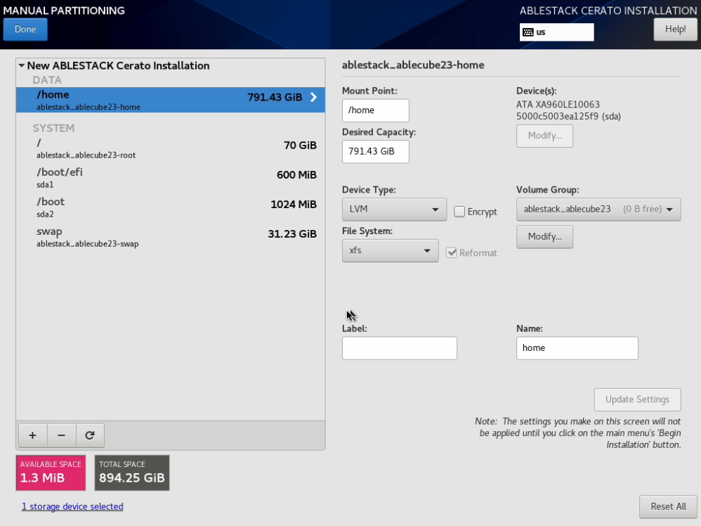{ .imgCenter .imgBorder }
        * 해당 화면은 파티션을 구성하는 화면입니다.
        * **/home** 파티션 선택 후 아래 **-** 버튼을 클릭하여 home 파티션을 삭제합니다.
    2. 파티션 구성 화면 2-2
        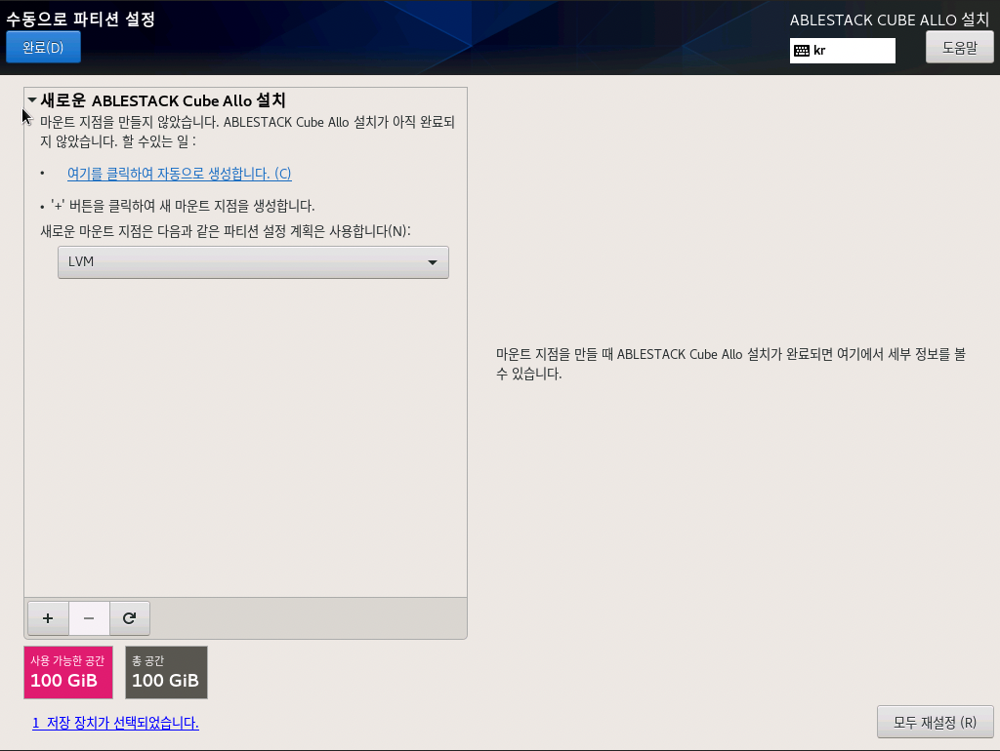{ .imgCenter .imgBorder }
        * **swap 파티션 선택 후 희망 용량** 의 입력 값에 **32GiB(최소 권장)** 을 입력 후 **설정 업데이트** 버튼을 클릭하여 파티션 용량 재설정 합니다.
        !!! info
            **swap** 파티션은 서버 메모리 크기와 같은 크기로 설정하는 것을 권장합니다.</br>
            디스크의 크기가 여유롭지 못하면 **32GiB 이상** 을 권장합니다.

    3. 파티션 구성 화면 3-2
        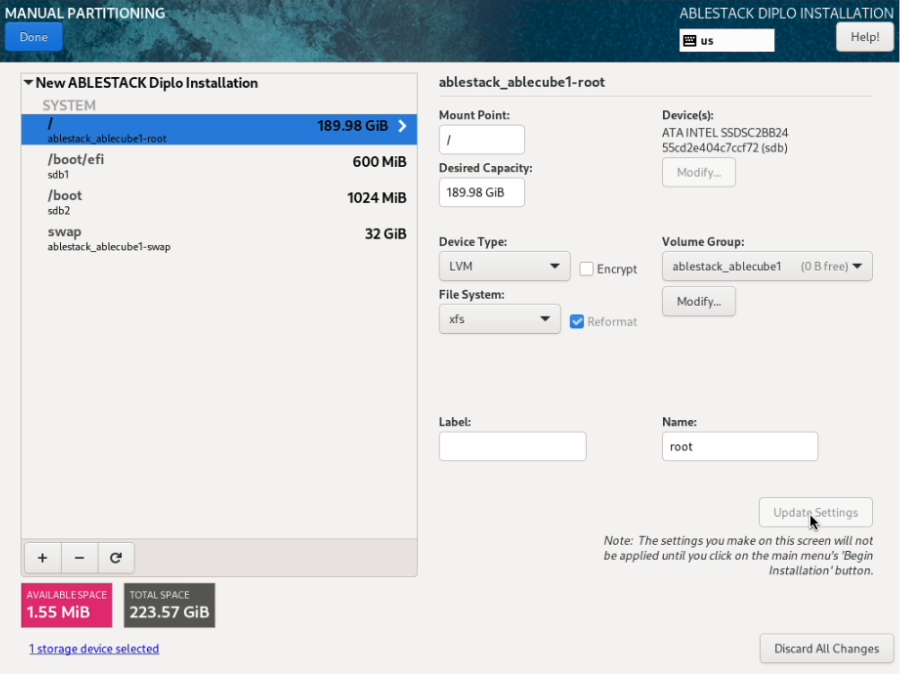{ .imgCenter .imgBorder }
        * **/(root파티션)** 파티션 선택 후 **희망 용량** 나머지 전체의 용량을 할당하고 **설정 업데이트** 버튼을 클릭하여 파티션 용량 재설정 합니다.
        * 파티션 구성 완료 후 **Done** 버튼을 클릭하여 파티션 설정을 마무리 합니다.

        !!! Tip
            **/(root파티션)** 파티션의 **희망 용량** 입력시 하단 왼쪽에 나와있는 **사용 가능한 공간** 의 용량을 입력하면 필수 구성 파티션을 제외한 나머지 용량이 **/(root파티션)** 에 할당이 됩니다.

6. Root 초기 암호

!!! check
    Root Password 초기 암호는 **password** 입니다.


7. ABLESTACK STANDALONE Cube 구성 마무리
    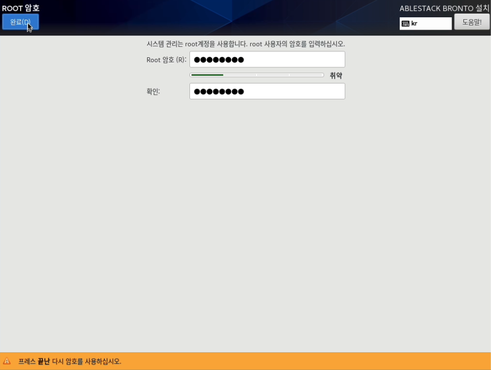{ .imgCenter .imgBorder }
    - ABLESTACK STANDALONE Cube 설정 완료 후 **Begin installation** 버튼을 클릭하여 ABLESTACK 설치를 진행 합니다.

    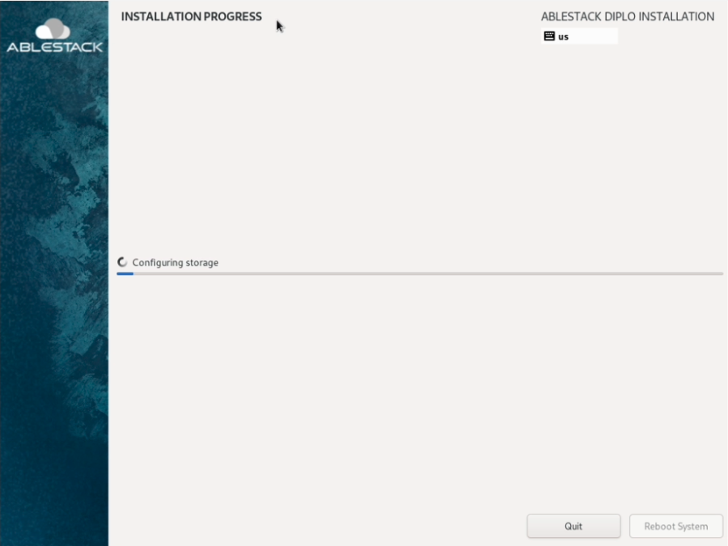{ .imgCenter .imgBorder }

    - 설치가 완료가 되면 자동으로 재부팅 절차가 진행되며 연결되어 있는 ABLESTACK ISO 또는 USB를 제거하여 ABLESTACK STANDALONE Cube 설치를 마무리 합니다.

    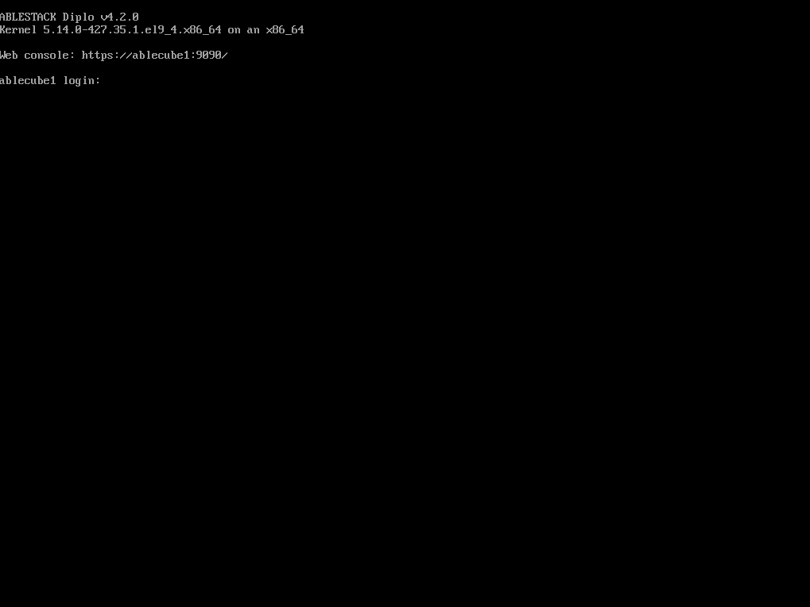{ .imgCenter .imgBorder }
    - 설치가 정상적으로 완료되면 ABLESTACK 콘솔 로그인 화면이 보이게 됩니다.
!!! note
    ABLESTACK Diplo 버전부터는 콘솔화면에 대한 GUI 환경, CLI 환경 둘 중 하나를 선택할 수 있습니다.

## ABLESTACK STANDALONE Cube Network 셋팅

### Intel NIC 일 경우
1. ABLESTACK STANDALONE Cube 로그인
    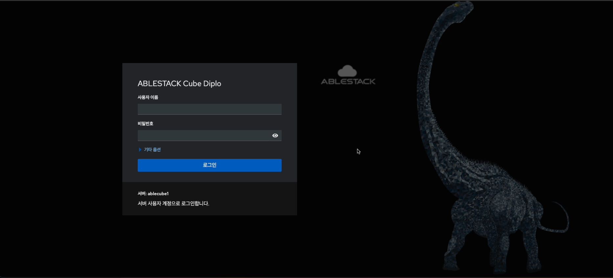{ .imgCenter .imgBorder }
    - ABLESTACK STANDALONE Cube 로그인 화면입니다.
    - 접속 URL은 **호스트IP:9090** 입니다
    - 사용자 이름은 **root** 를 암호는 초기 암호를 입력하여, 원하시는 비밀번호로 변경한 후, **로그인** 버튼을 클릭하면 로그인 하실 수 있습니다.

2. ABLESTACK STANDALONE Cube 메인 화면
    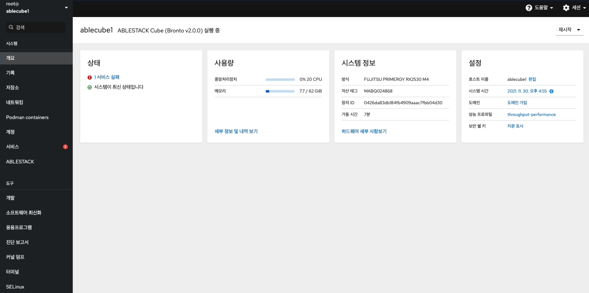{ .imgCenter .imgBorder }
    - ABLESTACK STANDALONE Cube 로그인 후 화면입니다.

3. ABLESTACK STANDALONE Cube 네트워킹 구성
    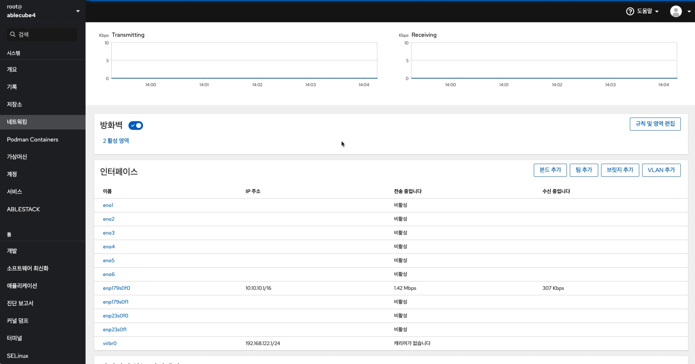{ .imgCenter .imgBorder }
    - ABLESTACK STANDALONE Cube 네트워킹 구성 화면입니다. </br>해당 화면에서 방화벽 설정 및 본드(bond), 브릿지(bridge), VLAN 구성을 진행합니다.

    !!! note
        인터페이스 목록 및 IP주소 등은 물리적 네트워크의 구성과 하드웨어 벤더사 및 초기 설정한 IP주소에 따라 다르게 표기될 수 있습니다.

    !!! info
        해당 문서의 네트워크 구성은 기본적인 네트워크 구성입니다.
        이 문서를 바탕으로 설치 사이트에 맞게 구성을 변경 및 IP 주소를 입력 하셔야 합니다.

        그리고 본드(bond) 구성이 필요한 경우 본드(bond)구성 완료 후 진행하셔야 합니다.

    1. Management Network 본드 설정
        { .imgCenter .imgBorder }
        - 화면 중간 버튼 그룹 중 **본드 추가** 버튼을 클릭하면 보이는 화면이며, 본드을 설정하는 팝업 화면입니다.
        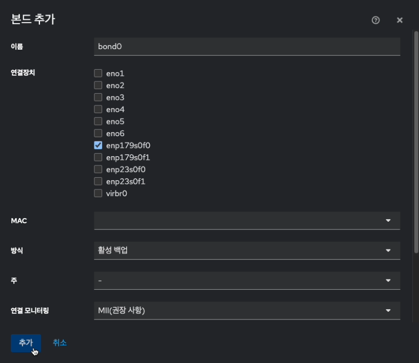{ .imgCenter .imgBorder }
        - 본드 이름을 **bond0** 을 입력해주고, 연결장치는 **Management NIC** 를 선택하고 **추가** 버튼을 클릭합니다.

    2. Management Network 브릿지 설정
        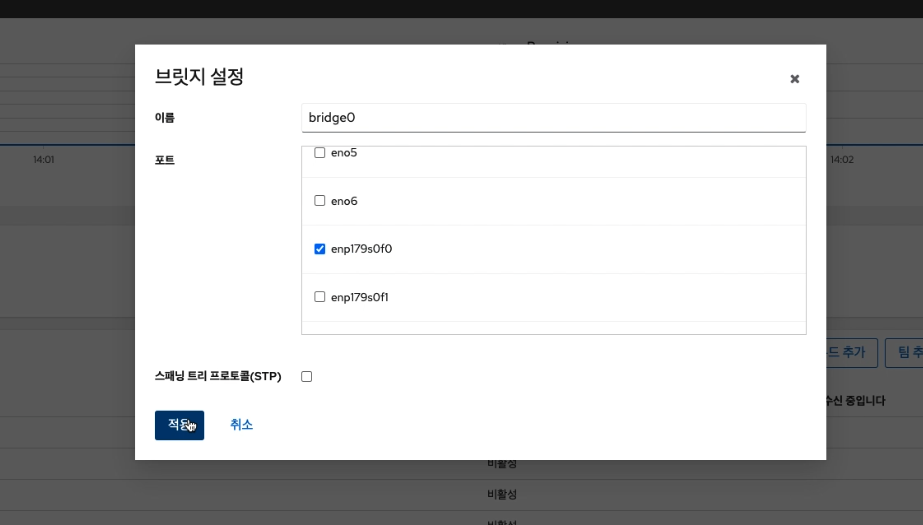{ .imgCenter .imgBorder }
        - 화면 중간 버튼그룹 중 **브릿지 추가** 버튼을 클릭하면 보이는 화면이며, 브릿지를 설정하는 팝업 화면입니다.
        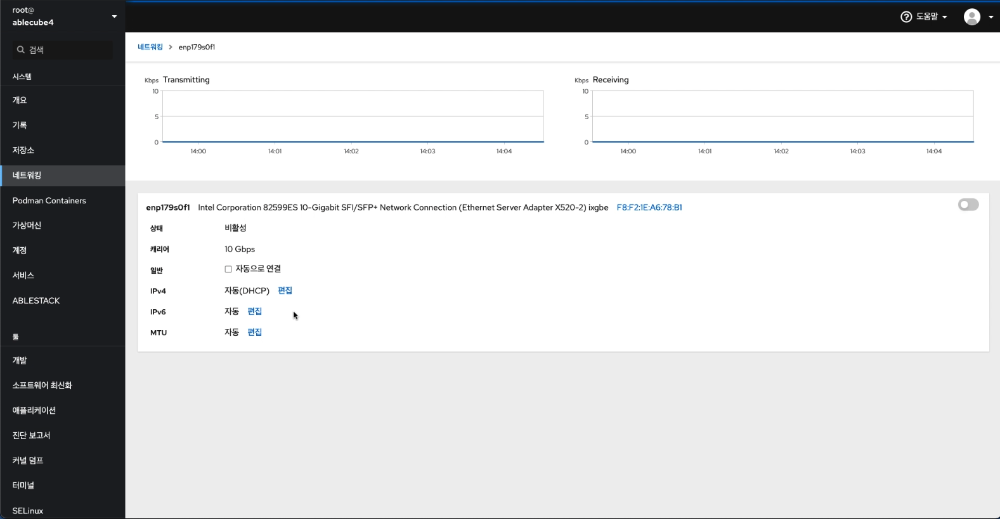{ .imgCenter .imgBorder }
        - 브릿지 이름을 **bridge0** 을 입력해주고, 연결장치는 **bond 0** 를 선택하고 **저장** 버튼을 클릭합니다.

        !!! info
            해당 과정은 물리적인 Management Network를 SystemVM 및 다른 가상머신에서 사용할 수 있게 브릿지를 하는 과정입니다.

            브릿지의 IP 설정은 ABLESTACK STANDALONE Cube 구성하면서 입력된 IP 정보가 상속되여 자동으로 설정됩니다.

### Broadcom NIC 일 경우
!!! check "OpenvSwitch 구성 가이드"
    본 문서는 OpenvSwitch 설치 및 설정 방법을 단계별로 설명합니다.

    또한, 사용자의 이해를 돕기 위해 **프레젠테이션 자료(PPT)** 형식도 함께 제공합니다.

    해당 링크 클릭 시, 다운로드 됩니다.    <span style="font-size:1.5em;">&nbsp;&nbsp;👉 &nbsp;&nbsp; 🔗[OpenvSwitch 구성 가이드](../downloads/OpenvSwitch-Configuration-Guide.pptx)</span>

!!! info
    ABLESTACK 제품에서 Broadcom NIC를 사용할 경우, 드라이버 및 기능 호환성 문제로 인해 OpenvSwtich로 구성하셔야 합니다.

    현재 Broadcom NIC에 대해 별도의 UI 기반 구성 기능은 제공되지 않기 때문에, 모든 설정은 CLI를 통해 직접 수행해야 합니다.

1. ABLESTACK 콘솔 화면
    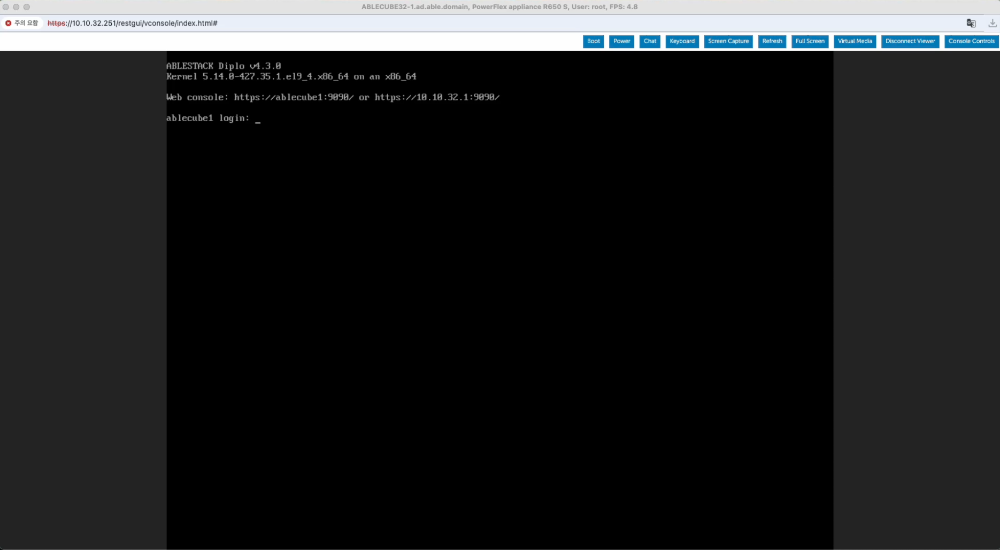{ .imgCenter .imgBorder }
    - 해당 화면은 IPMI 콘솔 화면입니다.

    !!! warning
        OpenvSwitch 구성 작업 시,
        원격(SSH) 접속은 끊길 수 있으며 세션이 복구되지 않습니다.

        IPMI 콘솔 또는 직접 물리 콘솔을 통한 접근을 반드시 확보한 상태에서 진행하십시오.

        예기치 않은 연결 손실로 인해 시스템 제어가 불가능해질 수 있습니다.

    #### OpenvSwitch 설치 및 서비스 설정
    !!! check
        현재 시스템에 OpenvSwitch가 설치되어 있지 않습니다.

        해당 기능을 사용하기 위해서는 OpenvSwitch RPM 패키지를 먼저 설치한 후, 네트워크 구성을 진행해주시기 바랍니다.

    ```
    # 1. OpenvSwitch 관련 RPM 패키지 설치 (전체 호스트 실행)
    dnf install -y /usr/share/ablestack/ovs/*.rpm

    # 2. OpenvSwitch 서비스 활성화 및 KVM 기반 Network 서비스 재시작
    systemctl enable --now openvswitch
    systemctl restart NetworkManager

    ```

    #### 단일 OpenvSwitch NIC 구성
    !!! check
        단일 NIC 구성을 진행할 경우, 사용자 환경에 맞는 물리 NIC 이름, IP 주소, 게이트웨이, DNS 정보를 입력해야 합니다.

        해당 인터페이스(ens1f0np0), IP(10.10.32.1), NETMASK(16), GATEWAY(10.10.0.1), DNS(8.8.8.8)는 예시이며, 실제 환경에 맞는 값으로 변경해야 합니다.

    ```
    # 1. OVS 브릿지를 생성하고, 연결할 포트를 구성합니다.
    nmcli con add type ovs-bridge conn.interface ovsbr0 con-name ovsbr0
    nmcli con add type ovs-port conn.interface ovsbr0 master ovsbr0 con-name ovs-port-ovsbr0
    nmcli con add type ovs-interface slave-type ovs-port conn.interface ovsbr0 master ovs-port-ovsbr0 con-name ovs-if-ovsbr0

    # 2. 물리 NIC ens1f0np0를 브릿지에 연결하기 위해 별도의 OVS 포트를 생성하고, NIC를 포트에 연결합니다.
    nmcli con add type ovs-port conn.interface ovs-port-ens1f0np0 master ovsbr0 con-name ovs-port-ens1f0np0
    nmcli con add type ethernet conn.interface ens1f0np0 master ovs-port-ens1f0np0 con-name ovs-if-ens1f0np0

    # 3. 브릿지 인터페이스(ovs-if-ovsbr0)에 IP 주소, 게이트웨이, DNS 서버를 수동으로 설정합니다.
    nmcli con modify ovs-if-ovsbr0 ipv4.addresses '10.10.32.1/16' ipv4.gateway '10.10.0.1' ipv4.method manual
    nmcli con modify ovs-if-ovsbr0 ipv4.dns '8.8.8.8' +ipv4.dns '1.1.1.1'

    # 4. 기존 물리 NIC 연결을 중지하고, 새로 구성한 포트 및 브릿지 인터페이스를 활성화합니다.
    nmcli con down ens1f0np0
    nmcli con up ovs-if-ens1f0np0
    nmcli con up ovs-if-ovsbr0

    # 5. 기존 ens1f0np0 설정을 삭제하여 네트워크 구성을 깔끔하게 정리합니다.
    nmcli con delete ens1f0np0


    ```

    1. 단일 OpenvSwitch NIC 구성 확인
        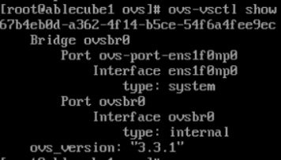{ .imgCenter .imgBorder }
        - nmcli con show 명령어로 확인한 화면입니다.
        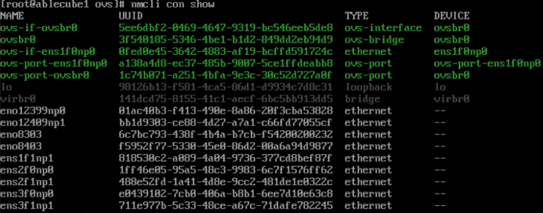{ .imgCenter .imgBorder }
        - ovs-vsctl show 명령어로 확인한 화면입니다.

    2. 시스템 재시작
        - 해당 OpenvSwitch NIC 구성 확인을 하셨으면, 시스템을 재부팅을 하셔야 합니다.
        ```
        # 1. 설정 확인 후, 재부팅(전체 호스트 실행) - 각 호스트마다 설정을 확인하신 후, 재부팅하시길 바랍니다.

        reboot
        ```

    #### 본딩 OpenvSwitch NIC 구성
    !!! check
        본딩 구성을 진행할 경우, 물리 NIC가 2개 이상 필요하며, 사용자 환경에 맞게 물리 NIC 이름, IP 주소, 게이트웨이, DNS 정보를 정확히 입력해야 합니다.

        해당 인터페이스(ens1f0np0,ens1f1np1), IP(10.10.32.1), NETMASK(16), GATEWAY(10.10.0.1), DNS(8.8.8.8)는 예시이며, 실제 환경에 맞는 값으로 변경해야 합니다.

    ```
    # OVS 브리지를 생성하고, 본딩 인터페이스를 구성하여 물리 NIC를 묶고, IP를 설정하는 전체 절차입니다.

    # 1. ovsbr0라는 이름으로 OVS 브리지를 생성합니다.
    nmcli con add type ovs-bridge conn.interface ovsbr0 con-name ovsbr0

    # 2. 브리지를 포트로 연결하여 상위 브리지에 포함되도록 설정합니다.
    nmcli con add type ovs-port conn.interface ovsbr0 master ovsbr0 con-name ovs-port-ovsbr0

    # 3. 브리지에 IP를 할당할 가상 인터페이스(ovs-if-ovsbr0)를 추가합니다.
    nmcli con add type ovs-interface slave-type ovs-port conn.interface ovsbr0 master ovs-port-ovsbr0 con-name ovs-if-ovsbr0

    # 4. 본딩 포트 ovs-bond0를 생성하여 브리지에 연결합니다.
    nmcli con add type ovs-port conn.interface ovs-bond0 master ovsbr0 con-name ovs-bond0

    # 5. 본딩 포트(ovs-bond0)에 active-backup 모드와 기타 세부 본딩 옵션을 설정합니다.
    nmcli con modify ovs-bond0 ovs-port.bond-mode active-backup
    nmcli con modify ovs-bond0 ovs-port.bond-updelay 0
    nmcli con modify ovs-bond0 ovs-port.bond-downdelay 0
    ovs-vsctl set port ovs-bond0 other_config:bond-detect-mode=miimon
    ovs-vsctl set port ovs-bond0 other_config:miimon=100

    # 6. 본딩 설정 확인
    ovs-vsctl get port ovs-bond0 other_config

    # 7. 본딩 그룹에 물리 NIC(ens1f0np0, ens1f1np1)를 추가하여 연결합니다.
    nmcli con add type ethernet conn.interface ens1f0np0 master ovs-bond0 con-name ovs-slave-ens1f0np0
    nmcli con add type ethernet conn.interface ens1f1np1 master ovs-bond0 con-name ovs-slave-ens1f1np1

    # 8. 본딩의 기본(primary) NIC을 ens1f0np0으로 지정합니다.
    ovs-vsctl set port ovs-bond0 other-config:bond-primary=ens1f0np0

    # 9. 브리지 인터페이스(ovs-if-ovsbr0)에 IP 주소, 게이트웨이, DNS를 수동으로 설정합니다.
    nmcli con modify ovs-if-ovsbr0 ipv4.addresses '10.10.32.1/16' ipv4.gateway '10.10.0.1' ipv4.method manual
    nmcli con modify ovs-if-ovsbr0 ipv4.dns '8.8.8.8' +ipv4.dns '1.1.1.1'

    # 10. 기존에 존재하는 ens1f0np0 단일 연결이 있을 경우 삭제하여 충돌을 방지합니다.
    nmcli con delete ens1f0np0

    # 11. 생성한 네트워크 구성들을 순서대로 활성화하여 전체 구성을 완료합니다.
    nmcli con up ovsbr0
    nmcli con up ovs-port-ovsbr0
    nmcli con up ovs-bond0
    nmcli con up ovs-slave-ens1f0np0
    nmcli con up ovs-slave-ens1f1np1
    nmcli con up ovs-if-ovsbr0
    ```

    1. 본딩 OpenvSwitch NIC 구성 확인
        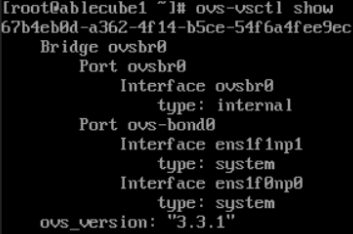{ .imgCenter .imgBorder }
        - nmcli con show 명령어로 확인한 화면입니다.
        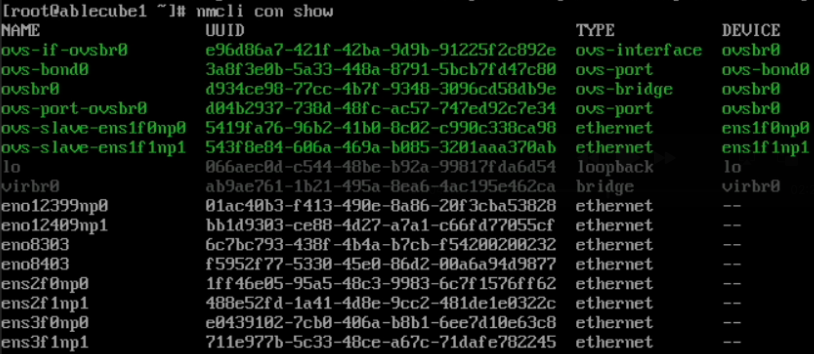{ .imgCenter .imgBorder }
        - ovs-vsctl show 명령어로 확인한 화면입니다.

    2. 시스템 재시작
        - 해당 OpenvSwitch NIC 구성 확인을 하셨으면, 시스템을 재부팅을 하셔야 합니다.
        ```
        # 1. 설정 확인 후, 재부팅(전체 호스트 실행) - 각 호스트마다 설정을 확인하신 후, 재부팅하시길 바랍니다.

        reboot
        ```

!!! info
    ABLESTACK STANDALONE는 1식 호스트로 구성되어야 합니다.

!!! check
    ABLESTACK STANDALONE Cube 및 ABLESTACK Cell의 설치 및 구성이 끝났습니다.

    로컬 스토리지 구성 및 ABLESTACK Mold는 ABLESTACK 메뉴에서 구성이 가능하며, 다음 설치 가이드를 보고 따라가시면 됩니다.
