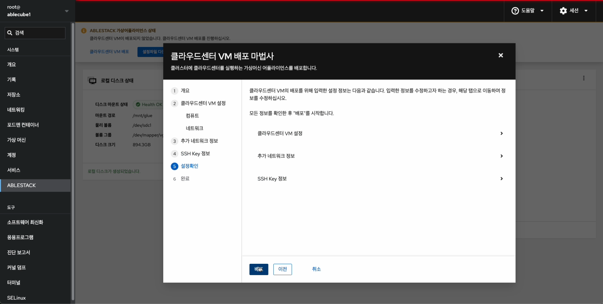
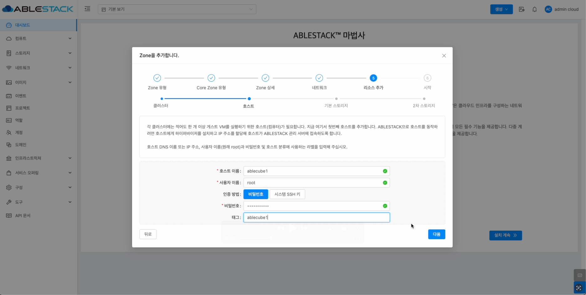

# ABLESTACK STANDALONE Mold 설치진행

!!! danger
    이 문서는 기술지원 용도의 문서입니다. 기술지원 엔지니어가 아닌 사용자가 조작할 때 시스템에 문제가 발생할 수 있습니다.
    해당 설치과정에 사용되는 IP 및 입력 정보는 예시이며, 현장에 맞게 수정하시기 바랍니다.

ABLESTACK STANDALONE Mold 설치 진행 가이드 입니다.
이 문서에서는 ABLESTACK STANDALONE Mold 용 가상머신 생성 및 Mold 웹콘솔을 이용하여 Zone 구성까지 가이드 하고 있습니다.
ABLESTACK STANDALONE Cube 의 웹콘솔과 ABLESTACK STANDALONE Mold 웹콘솔을 이용하여 진행이 되며 웹 접속 IP는 별도의 표시를 하지 않고 진행됩니다.
기존에 구성된 IP 정보에 맞게 웹콘솔을 접속 하시면 됩니다.

## ABLESTACK 메인 화면
{ .imgCenter .imgBorder }
- 왼쪽 ABLESTACK 메뉴 클릭시 보이는 화면입니다.

!!! note
    ABLESTACK STANDALONE는 1식 호스트로 구성되어야 합니다.

## 라이선스 관리(1번 호스트)
!!! check
    라이선스를 등록하기 위해서는 ABLECLOUD로부터 발급된 라이선스 파일이 필요합니다.
    라이선스 관련 문의 사항은 ABLECLOUD 고객 지원 번호 및 이메일로 문의해 주시기 바랍니다.

1. 라이선스 등록
    { .imgCenter .imgBorder }
    - 시스템 구축 전, 발급받은 **트라이얼 또는 정식 라이선스 파일** 을 등록해주시기 바랍니다.

2. 라이선스 확인
    { .imgCenter .imgBorder }
    - 등록된 라이선스 정보를 확인할 수 있는 화면입니다.

## 클러스터 구성 준비(1번 호스트)

1. 개요
    { .imgCenter .imgBorder }
    - 상단 리본의 **클러스터 구성 준비** 링크를 클릭하면 보이는 화면입니다.
    - ABLESTACK STANDALONE를 구성을 하는데 필요한 정보를 입력 받아 클러스터 구성을 준비하는 마법사 화면입니다.
    - **다음** 버튼을 눌러 클러스터 구성 준비를 시작합니다.

2. 클러스터 종류
    { .imgCenter .imgBorder }
    - 클러스터 종류를 설정하는 화면입니다.
    - **ABLESTACK-STANDALONE** 를 선택합니다.
    - **다음** 버튼을 클릭하여 클러스터 종류를 선택합니다.

3. SSH Key 파일(신규생성)
    { .imgCenter .imgBorder }
    - 모든 호스트 및 가상 머신은 동일한 SSH Key 를 공유하고 있어야 구성이 가능합니다.
    - **SSH Key 준비 방법** 에서 **신규 생성** 을 선택하고 **다음** 버튼을 클릭하여 신규 SSH Key 를 생성합니다.

4. 클러스터 구성 파일
    { .imgCenter .imgBorder }
    - 클러스터 구성 설정하는 화면입니다. **클러스터 호스트 구분** 을 **신규 클러스터 호스트** 로 선택한다.
    - **클러스터 구성 파일 준비** 에서 **신규 생성** 을 선택합니다.
    - **현재 호스트명** 은 해당 호스트의 이름을 자동으로 불러옵니다.
    - **클러스터 구성 프로파일** 호스트 명 및 IP 정보를 한번 더 확인합니다.
    { .imgCenter .imgBorder }
    - **CCVM 관리 IP** 정보를 입력 합니다.
    - **관리 NIC CIDR** 정보를 입력 합니다.
    - **관리 NIC Gateway** 정보를 입력 합니다.
    - **관리 NIC DNS** 정보를 입력 합니다.
    - 위 항목을 입력 및 확인 후에 **다음** 버튼을 클릭합니다.

    !!! info
        ABLESTACK STANDALONE의 경우 클러스터 구성 파일의 호스트명과 호스트 IP는 자동으로 입력됩니다.

        호스트명 및 호스트 IP를 한 번 더 확인해 주시기 바랍니다.

    !!! example
        - 호스트 프로파일 예제

        idx | 호스트 명 | 호스트 IP |
        :---: | :-------: | :-------:
        1 | ablecube1 | 10.10.12.1

5. 시간서버

    !!! info
        ABLESTACK STANDALONE 시간서버는 매우 중요한 역할을 합니다.  
        시간동기화가 맞지 않으면 스토리지 데이터들의 무결성 확보에 치명적일 수 있습니다. 
        따라서 시간서버는 반드시 구성해야합니다. 
        인터넷등 외부 통신이 가능한 환경이어서 외부 공인된 시간서버(NTP)에 접속이 가능하거나 내부에 별도의 시간서버(NTP)가 존재하는 경우에는 "외부 시간 서버"를 입력하여 진행하고, 없으시면 "다음" 으로 넘어가시면 됩니다. 
        폐쇄적인 네트워크 환경으로 외부 공인된 시간서버와 통신이 불가하고 내부에 별도의 시간서버가 없을 경우에는 ABLESTACK STANDALONE애서 자체적으로 시간서버를 구성합니다.

    { .imgCenter .imgBorder }

    - 시간 서버 구성하는 화면입니다.
    - 클러스터 구성 정보를 토대로 시간 서버 입력값을 기본 세팅합니다.
    - 기본적으로 idx1 = Master Server, idx2 = Second Server, idx3 이상 = Other Server로 설정 됩니다.
    - **외부 시간서버** 가 존재하는 경우에는 입력 하고, 존재하지 않을 경우에는 빈칸으로 남겨두고 넘어 갑니다.

6. 설정확인
    { .imgCenter .imgBorder }
    - 구성 준비에 입력값에 대한 설정을 확인하는 화면입니다.
    - 설정된 값을 확인 후 이상이 없는 경우 **완료** 버튼을 클릭합니다.

7. 완료
    { .imgCenter .imgBorder }
    - 클러스터 구성 준비 3단계 진행상황을 확인합니다.
    - 정상적으로 끝날 경우 완료 화면이 호출 됩니다.

    { .imgCenter .imgBorder }
    - 1번 호스트의 사전구성 완료 화면입니다.

## 로컬 스토리지 구성
!!! warning
    로컬 스토리지 구성을 진행하기 전에, 해당 서버의 BIOS에서 사전에 협의된 RAID 정책으로 디스크가 구성되어 있어야 합니다.

{ .imgCenter .imgBorder }
- 로컬 스토리지를 구성하기 위한 화면입니다. 상단 상태 리본의 로컬 스토리지 구성 링크를 클릭합나다.

1. 개요
    { .imgCenter .imgBorder }
    - 로컬 스토리지 구성 개요 화면입니다. 개요의 내용을 확인 후 **다음** 버튼을 클릭합니다.

2. 로컬 디스크 구성
    { .imgCenter .imgBorder }
    - 로컬 디스크를 구성하는 화면입니다.
    - **로컬용 디스크 구성 대상 장치** 체크 박스에서 해당 하는 디스크를 선택한 후, **다음** 버튼을 클릭합니다.

    !!! tip
        디스크 이름, 디스크 상태, 디스크 종류, 용량, 디스크 정보, 디스크 wwn 으로 구분 되어 있습니다.

3. 설정확인
    { .imgCenter .imgBorder }
    - 로컬 스토리지 구성전 설정을 확인하는 화면입니다.
    - 설정정보를 확인 후 **배포** 버튼을 클릭 합니다.

4. 구성
    { .imgCenter .imgBorder }
    - 로컬 스토리지 구성 진행상황을 확인 할 수 있는 화면입니다.

5. 완료
    { .imgCenter .imgBorder }
    - 로컬 디스크 구성이 완료 후 Cube 웹콘솔에서 로컬 디스크 상태 카드 항목에서 **디스크 마운트 상태** 가 **Health Ok**, **마운트 경로, 물리볼륨, 볼륨 그룹, 디스크 크기** 를 확인한 후, 다음 단계로 진행하시길 바랍니다.

## 클라우드센터 가상머신 배포
{ .imgCenter .imgBorder }
- 클라우드센터 가상머신을 배포하기 위한 화면입니다. 상단 상태 리본의 클라우드센터 가상머신 배포 링크를 클릭합나다.

1. 개요
    { .imgCenter .imgBorder }
    - 클라우드센터 가상머신 배포 개요 화면입니다. 개요의 내용을 확인 후 **다음** 버튼을 클릭합니다.

2. 클라우드센터 가상머신 설정 - 컴퓨트
    { .imgCenter .imgBorder }
    - 클라우드센터 가상머신의 컴퓨트 설정하는 화면입니다.
    - **CPU Core** 선택 박스는 **8 vCore**, **Memory** 선택 박스는 **16 GiB** 를 선택 하고 **다음** 버튼을 클릭합니다.

    !!! tip
        클라우드센터 가상머신의 Compute 자원은 클라우드센터가 관리해야 할 호스트의 수에 따라 탄력적으로 선택합니다.
        가상머신이 컨트롤 할 호스트의 수가 **10개 미만** 이면 **8 vCore** 를, **그 이상** 이면 **16 vCore** 를 선택하십시오.
        메모리는 컨트롤할 호스트의 수가 **10개** 미만이면 **16GiB** 를, **10 ~ 20개** 이면 **32GiB** 를, **21개 이상** 이면 **64GiB** 를 선택해야 합니다.
        ROOT Disk의 크기는 **500GiB** 를 디스크가 **Thin Provisioning** 방식으로 제공됩니다.

3. 클라우드센터 가상머신 설정 - 네트워크

    ### Intel NIC 사용 시
    1. Intel NIC 사용 시
        { .imgCenter .imgBorder }
        - 클라우드센터 가상머신의 네트워크 설정하는 화면입니다.
        - **관리네트워크** 선택 박스에서 **bridge0** 을 선택하고 **다음** 버튼을 클릭합니다.

    ### Broadcom NIC 사용 시
    1. Broadcom NIC 사용 시
        OpenvSwitch로 네트워크를 구성하는 경우, 생성한 OpenvSwitch 브리지를 네트워크 인터페이스로 지정해야 합니다.
        
        - 클라우드센터 가상머신의 네트워크 설정하는 화면입니다.
        - **관리네트워크** 선택 박스에서 **ovsbr0** 을 선택합니다.

    !!! info
        해당 탭이 별도로 표시되는 경우에만 해당 항목만 설정해주시면 됩니다.
        만약 탭이 표시되지 않으면, 이후 설치 과정은 동일한 방식으로 진행하시면 되며
        별도의 추가 설정 없이 다음 단계로 넘어가셔도 됩니다.

    !!! info
        관리 네트워크와 서비스 네트워크가 분리되여 있는 경우 그리고 외부에서 클라우드센터 웹콘솔에 접근해야 하는경우에는 **네트워크 구성** 항목에서
        **서비스네트워크** 항목을 체크하신 후에 **서비스네트워크** 선택 박스에서 해당되는 **브릿지** 를 선택하셔야 합니다.

4. 추가 네트워크 정보
    { .imgCenter .imgBorder }
    - 클라우드센터 가상머신 추가 네트워크 정보를 설정하는 화면입니다.
    - **클러스터 구성 파일 준비** 해당 호스트 파일 사용으로 자동 선택되며, ablecube 호스트 설정 정보를 자동으로 읽어와 클러스터 구성 정보 및 네트워크 IP 정보를 세팅합니다.
    - **호스트명(CCVM)** 을 입력 및 확인합니다.
    - **관리 NIC IP** 를 입력 및 확인합니다.
    - **다음** 버튼을 클릭합니다.

    !!! info
        클라우드센터 가상머신 배포시 ablecube 호스트에서 설정파일 읽어와 일부 정보를 자동세팅되며 입력 정보를 정확히 확인해야 합니다.
        해당 화면의 IP 정보 는 예제 입니다. IP 정보는 사이트 정보에 맞춰서 수정해야 합니다.

5. SSH Key 정보
    { .imgCenter .imgBorder }
    - SSH Key 정보를 확인하는 화면입니다.
    - 클러스터 구성시 호스트에 등록된 호스트의 키 정보로 자동세팅됩니다.

6. 설정확인
    { .imgCenter .imgBorder }
    - 클라우드센터 가상머신 배포전 설정을 확인하는 화면입니다.
    - 설정정보를 확인 후 **배포** 버튼을 클릭 합니다.

7. 배포
    { .imgCenter .imgBorder }
    - 클라우드센터 가상머신 배포 진행상황을 확인 할 수 있는 화면입니다.

8. 완료
    { .imgCenter .imgBorder }
    - 클라우드센터 가상머신 배포가 완료 후 ABLESTACK STANDALONE Cube 웹콘솔에서 클라우드센터 클러스터 상태 카드 항목에서 **클러스터 상태** 가 **Health Ok**,
      클라우드센터 가상머신 상태 카드에서 **가상머신상태** 가 **Running** 인지 확인하셔야 합니다.

## 클라우드센터 가상머신 웹콘솔 구성
클라우드센터 웹콘솔 구성을 하기 위해서는 **Bootstrap** 우선 실행해야 하며 **Bootstrap** 실행 후 클라우드센터 웹콘솔 화면을 이용하여 클라우드센터 구성을 하실수 있습니다.

1. Bootstrap 실행전
    { .imgCenter .imgBorder }
    - Bootstrap 실행전 화면입니다. 상단의 리본 화면에서 **클라우드 센터에 연결할 수 있도록 클라우드센터 구성하기 작업을 실행하십시오.** 문구가 보인다면
    클라우드센터 Bootstrap을 실행할 수 있습니다.

2. Bootstrap 실행
    { .imgCenter .imgBorder }
    - Bootstrap 실행 화면입니다. 클라우드센터 클러스터 상태 카드에서 메뉴버튼을 클릭하여 **클라우드센터 구성하기** 버튼을 클릭합니다.
    - **실행** 버튼을 클릭하여 Bootstrap을 실행합니다.

3. Bootstrap 완료
    { .imgCenter .imgBorder }
    - Bootstrap 실행 후 완료 화면입니다.
    - 상단 리본 화면에서 **클라우드센터 연결**, **모니터링센터 구성** 링크가 보인다면 정상적으로 실행된 상태 입니다.
    - **클라우드센터 연결** 링크를 클릭하여 클라우드센터 웹콘솔에 접속 하실 수 있습나다.

## 클라우드센터 Zone 구성
클라우드센터 웹콘솔을 이용한 Zone 구성 진행 절차에 대하여 가이드하고 있습니다.
해당 문서에서는 Zone 구성까지만 설명을 하고 있으며 Zone 구성 이후의 클라우드센터 웹콘솔 사용방법은 다른 문서를 참고하시기 바랍니다.

{ .imgCenter .imgBorder }
- Bootstrap 실행 완료 후 상단의 리본 창에서 **클라우드센터 연결** 링크를 클릭합니다.

!!! info
    Bootstrap을 실행 후, 약 2분 내외로 서비스가 올라오기 때문에 "클라우드센터에 정상적으로 연결되지 않습니다. 클라우드센터 서비스 상태를 확인하거나, 잠시 후에 다시 시도해주십시오." 문구가 나타나면 잠시 대기 했다가 재접속 하시길 바랍니다.

1. 클라우드센터 로그인
    { .imgCenter .imgBorder }
    - 클라우드 센터 로그인 화면입니다.
    - **사용자 이름** 에는 **admin**, **비밀번호** 는 **password** 를 입력하고 **로그인** 버튼을 클릭하면 접속할 수 있습니다.

2. 클라우드센터 admin 비밀번호 변경
    { .imgCenter .imgBorder }
    - 관리자 계정의 비밀번호를 변경하는 화면입니다. **새 비밀번호**, **비밀번호 확인 입력** 에 동일한 비밀번호를 입력 후 **확인**
    버튼을 클릭합니다.

3. 클라우드센터 Zone 유형 선택
    { .imgCenter .imgBorder }
    - **Zone** 의 유형을 선택하는 화면입니다.
    - **Core** 을 선택한 후에 **다음** 버튼을 클릭합니다.
    { .imgCenter .imgBorder }
    - **Core Zone** 의 유형을 선택하는 화면입니다.
    - **확장** 을 선택한 후에 **다음** 버튼을 클릭합니다．

4. 클라우드센터 Zone 정보
   { .imgCenter .imgBorder }
    - Zone 에 대한 정보를 입력하는 화면 입니다.
    - **이름** 에는 **Zone** 을 입력합니다.
    - **IPv4 DNS1** 에는 **8.8.8.8** 을 입력합니다.
    - **내부 DNS 1** 에는 **8.8.8.8** 을 입력합니다.
    - 입력 정보 확인 후에 **다음** 버튼을 클릭 합니다.

5. 클라우드센터 Zone 물리 네트워크

    ### Intel NIC 사용 시
    1. Intel NIC 사용 시
        { .imgCenter .imgBorder }
        - Zone 의 네트워크 정보를 확인하는 화면입니다.
        - 입력된 정보를 확인 후 **다음** 버튼을 클릭합니다.

    ### Broadcom NIC 사용 시
    1. Broadcom NIC 사용 시
        OpenvSwitch로 네트워크를 구성하는 경우, 생성한 OpenvSwitch 브리지를 네트워크 인터페이스로 지정해야 합니다.
        { .imgCenter .imgBorder }

        - **Isolation 메소드** 선택 박스에서 **GRE** 를 선택합니다.
        - **트래픽 유형** 에서 **bridge0** 를 OpenvSwitch로 구성한 브릿지 네트워크인 **ovsbr0** 로 수정합니다.

    !!! info
        해당 탭이 별도로 표시되는 경우에만 해당 항목만 설정해주시면 됩니다.
        만약 탭이 표시되지 않으면, 이후 설치 과정은 동일한 방식으로 진행하시면 되며
        별도의 추가 설정 없이 다음 단계로 넘어가셔도 됩니다.

6. 클라우드센터 Zone 서비스용 네트워크 정보
    { .imgCenter .imgBorder }
    - Zone 의 서비스용 네트워크 정보를 입력 하는 화면입니다.
    - **게이트웨이** 항목에는 **10.10.0.1**, **넷마스크** 항목에는 **255.255.0.0**, **시작 IP 주소** 항목에는 **10.10.12.5** **종료 IP 주소** 항목에는 **10.10.12.6** 을 입력하고 **추가** 버튼을 클릭합니다.
    - 입력한 정보를 확인 후 **다음** 버튼을 클릭합니다.

    !!! check
        여기서 시작, 종료 IP 주소는 Mold의 System VM의 필요한 2개 외부 IP 입니다.

        사용자에 맞게 남은 2개의 IP를 입력하시길 바랍니다.

7. 클라우드센터 Pod 네트워크 정보
    { .imgCenter .imgBorder }
    - Pod 네트워크 정보를 입력하는 화면 입니다.
    - **Pod 이름** 항목에는 **Pod** 를 입력합니다.
    - **예약된 시스템 게이트웨이** 항목에는 **10.10.0.1** 을 입력합니다.
    - **예약된 시스템 넷마스크** 항목에는 **255.255.0.0** 을 입력합니다.
    - **예약된 시스템 시작 IP 주소** 항목에는 **10.10.12.7** 을 입력합니다.
    - **예약된 시스템 종료 IP 주소** 항목에는 **10.10.12.8** 을 입력합니다.
    - 입력한 정보를 확인 후 **다음** 버튼을 클릭합니다.

8. 클라우드센터 가상머신용 네트워크 정보
    { .imgCenter .imgBorder }
    - 가상머신용 네트워크 정보를 입력하는 화면입니다.
    - **VLAN 범위** 에 **101**, **300** 을 입력합니다.
    - 입력한 정보를 확인 후 **다음** 버튼을 클릭합니다.

    !!! tip
        해당 VLAN 범위는 예시입니다. 환경에 맞게 설정하시길 바랍니다.

        VLAN을 사용 하지 않는다면, 범위에 1 - 1 을 넣으셔도 무방합니다.

9. 클라우드센터 클러스터 정보
   { .imgCenter .imgBorder }
    - 클라우드센터 클러스터 정보를 입력하는 화면입니다.
    - **클러스터 이름** 항목에 **Cluster** 를 입력합니다.
    - **CPU 아키텍처** 란에 **AMD 64 bits (x84_64)** 서버 사양에 맞게 선택합니다.
    - 입력한 정보를 확인 후 **다음** 버튼을 클릭합니다.

10. 클라우드센터 호스트 추가
    { .imgCenter .imgBorder }
    - 클라우드센터에 호스트를 추가하는 화면 입니다.
    - **호스트 이름** 항목에는 **10.10.12.1** 을 입력합니다.
    - **사용자 이름** 항목에는 **root** 를 입력합니다.
    - **비밀번호** 항목에는 **비밀번호** 를 입력합니다.
    - **태그** 항목에는 **ablecube1** 을 입력합니다.
    - 입력한 정보를 확인 후 **다음** 버튼을 클릭합니다.

11. 클라우드센터 기본스토리지 추가
    { .imgCenter .imgBorder }
    - 기본 스토리지 추가하는 화면입니다.
    - **이름** 항목에는 **Primary** 를 입력합니다.
    - **범위** 선택 박스에는 **cluster** 을 선택합니다.
    - **제공자** 선택 박스에는 **DefaultPrimary** 를 선택합니다.
    - **프로토콜** 선택 박스에는 **SharedMountPoint** 를 선택합니다.
    - **경로** 항목에는 **/mnt/glue** 를 입력합니다.
    - **스토리지 태그** 항목에는 **glue** 를 입력합니다.

    !!! tip
        경로 항목을 확인 할려면 ABLESTACK STANDALONE Cube 대시보드 화면에서 로컬 디스크 상태에서 마운트 경로를 확인하시면 됩니다.
        { .imgCenter .imgBorder }

12. 클라우드센터 2차 스토리지 추가
    { .imgCenter .imgBorder }
    - 2차 스토리지를 추가하는 화면입니다.
    - **제공자** 선택 박스에서 **NFS** 를 선택 합니다.
    - **이름** 항목에는 **Secondary** 를 입력합니다.
    - **서버** 항목에는 **10.10.12.10** (ccvm mngt ip) 를 입력합니다.
    - **경로** 항목에는 **/nfs/secondary** 를 입력합니다.
    - 입력한 정보를 확인 후 **다음** 버튼을 클릭합니다.

13. 클라우드센터 Zone 추가중
    { .imgCenter .imgBorder }
    - zone 추가 중 화면 입니다.

15. 호스트 라이선스 확인
    { .imgCenter .imgBorder }
    - 해당 하는 호스트 이름을 클릭하여 라이선스 유효기간을 확인할 수 있습니다.

## 호스트 agent 파일 수정
### Broadcom NIC 사용 시
1. 호스트 agent 구성파일
    { .imgCenter .imgBorder }
    - 호스트 Cube 터미널 화면입니다.
    - 터미널 명령어 **vi /etc/cloudstack/agent/agent.properties** 입력하고 Enter를 누릅니다.
    - **libvirt.vif.driver=com.cloud.hypervisor.kvm.resource.OvsVifDriver** , **network.bridge.type=openvswitch** 라인을 추가하고 **:wq** 명령어로 저장합니다.

2. 호스트 cloudstack-agent 서비스 시작
    { .imgCenter .imgBorder }
    - 터미널 명령어 **systemctl restart cloudstack-agent.service** 를 실행합니다.