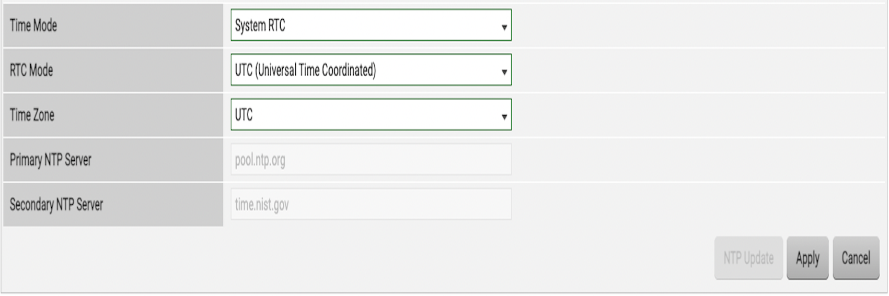

# 시작하기
!!! danger
    이 문서는 기술지원 용도의 문서입니다. 기술지원 엔지니어가 아닌 사용자가 조작할 때 시스템에 문제가 발생할 수 있습니다.

ABLESTACK STANDALONE을 설치하기 위해서는 ABLESTACK STANDALONE의 아키텍처를 기본적으로 숙지하고 있어야 하며 해당 아키텍처는 다른 문서를 통하여 제공하고 있습니다.

## 사전준비 사항
ABLESTACK STANDALONE을 설치하고 구성하기 위해서는 다음과 같은 구성 요소들이 사전에 준비되어 있어야 합니다

- ABLESTACK STANDALONE이 설치될 1식의 x86 기반의 호스트 서버가 준비 되어 있어야 합니다.
- 서버간 네트워크 연결을 위한 10G 스위치 및 10G 용 케이블이 준비 되어 있어야 합니다.
- 물리 디스크 용량은 설치 및 운영(이미지, 로그, VM 데이터 등)을 고려하여 충분히 확보되어 있어야 합니다.
- 서버에 장착된 디스크의 RAID 레벨 및 구성 방안은 사전에 협의되어 있어야 합니다.

## 설치 전 확인 사항

!!! Warning
    물리 디스크의 총 용량과 개수를 확인한 뒤, 서버 BIOS/UEFI에서 사전에 협의된 방안에 따라 RAID 정책을 구성합니다.

## 설치 전 준비 사항(사전정의)
!!! note "IPMI"
    - ABLESTACK STANDALONE의 표준시는 Asia/Seoul입니다.
    - 서버 시작 전, 서버의 초기 시간 설정을 Asia/Seoul로 변경합니다.
    { .imgCenter .imgBorder }
- ABLESTACK STANDALONE을 설치 시 호스트 및 시스템 가상머신들에게 할당할 IP가 필요합니다.
- 할당될 IP는 관리(Management)용 네트워크에 할당되며, 상호간의 통신이 가능하여야 합니다
!!! Tip
    관리등을 위하여 일정대역(연속되는 IP범위)를 할당하는게 효율적입니다
- IP 할당 대상은 다음과 같습니다.
     * 호스트 IP: 각 서버에 할당 되는 IP 1개 필요
     * Mold 가상머신(CCVM) : 클라우드센터 가상머신 이며 1개 필요
     * 웹 콘솔 프록시 가상머신(CPVM) : 가상머신의 웹콘솔 접속관리를 위한 시스템 프록시 가상머신이며 별도의 외부망(Public Network)이 분리가 되어 있으면 외부네트워크 1개, 관리네트워크 1개 각각 필요하며, 별도로 분리가 되어 있지 않으면 관리네트워크 IP 2개 필요
     * 2차스토리지 관리 가상머신(SSVM) : 이미지,템플릿,백업등의 저장공간인 2차 스토리지 관리를 위한 시스템 가상머신 이며 별도의 외부망(Public Network)이 분리가 되어 있으면 외부네트워크 1개, 관리네트워크 1개 각각 필요하며, 별도로 분리가 되어 있지 않으면 관리네트워크 IP 2개 필요
- 기본적으로 상기 숫자 만큼(1식기준으로는 6개)필요합니다.
