# ABLESTACK Wall 구성진행
!!! danger
    이 문서는 기술지원 용도의 문서입니다. 기술지원 엔지니어가 아닌 사용자가 조작할 때 시스템에 문제가 발생할 수 있습니다.
    해당 설치과정에 사용되는 IP 및 입력 정보는 예시이며, 현장에 맞게 수정하시기 바랍니다.

ABLESTACK Wall 설치 진행 가이드 입니다.
ABLESTACK Cube 의 웹콘솔을 이용하여 진행이 되며 웹 접속 IP는 별도의 표시를 하지 않고 진행됩니다.
기존에 구성된 IP 정보에 맞게 웹콘솔을 접속 하시면 됩니다.

## Wall 모니터링 구성
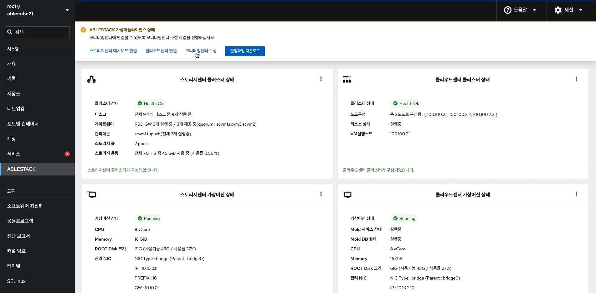{ align=center }
- 모니터링센터를 구성하기 위한 화면입니다. 상단 상태 리본의 모니터링센터 구성 링크를 클릭합나다.

1. 개요
    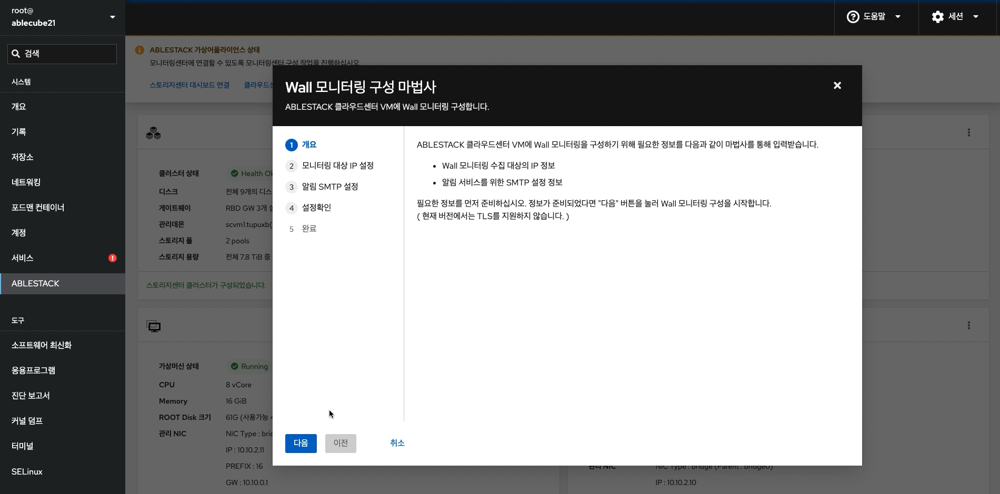{ align=center }
    - 모니터링센터 구성 개요 화면입니다. 개요의 내용을 확인 후 **다음** 버튼을 클릭합니다.

2. 모니터링 대상 IP 설정
    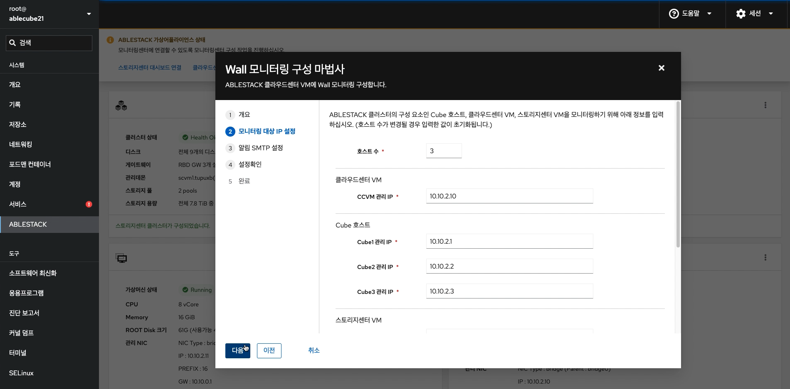{ align=center }

    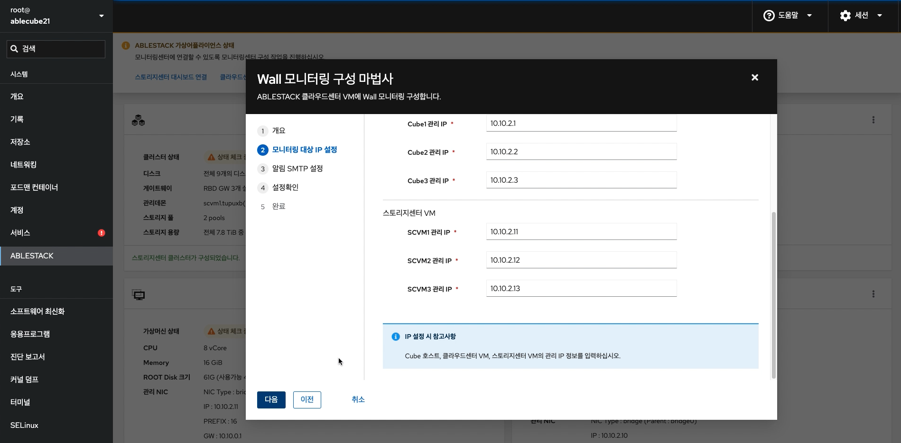{ align=center }

    - 모니터링 대상 IP를 설정하는 화면입니다.
    - **호스트 수** 입력창에는 모니터링할 호스트 수를 입력합니다. 입력 값에 따라 입력창이 자동 생성됩니다.
    - **클라우드센터 VM** 입력창에는 클라우드센터 가상머신(CCVM) 관리 IP 를 입력합니다.
    - **Cube 호스트** 입력창에는 Cube 호스트 관리 IP 를 입력합니다.
    - **스토리지센터 VM** 입력창에는 스토리지센터 가상머신(SCVM) 관리 IP 를 입력합니다.
    - 모니터링 대상 IP 설정 내용을 입력 후 **다음** 버튼을 클릭합니다.

3. 알림 SMTP 설정
    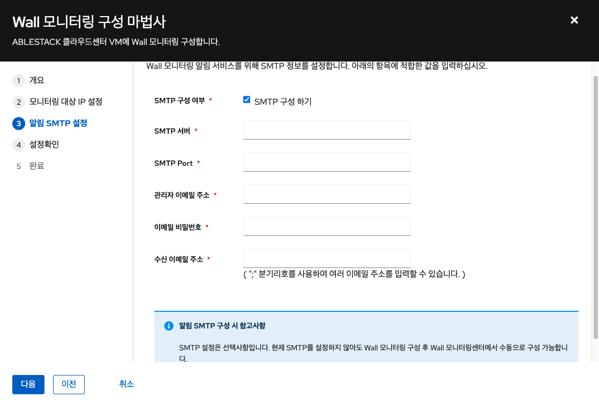{ align=center }
    - 모니터링 알림 SMTP 설정 및 알림 메일 송수신 이메일 정보를 설정하는 화면입니다.
    - **SMTP 구성 여부** SMTP 구성을 진행에 대한 여부를 체크합니다.
    - **SMTP 서버** SMTP 서버의 IP 또는 도메인을 입력합니다.
    - **SMTP Port** SMTP 서버의 Port 정보를 입력합니다.
    - **관리자 이메일 주소** 송신 이메일 주소를 입력합니다.
    - **이메일 비밀번호** 송신 이메일 주소의 비밀번호를 입력합니다.
    - **수신 이메일 주소** 수신할 이메일 정보를 입력합니다. ( ; 으로 구분하여 여러개의 이메일을 입력가능합니다.)
    - 알림 SMTP 설정 내용을 입력 후 **다음** 버튼을 클릭합니다.

    !!! info
        알림 SMTP 설정은 필수 사항이 아니며, Wall 모니터링센터를 구성 후 Wall 웹 콘솔 화면에서 진행이 가능합니다.

4. 설정확인
    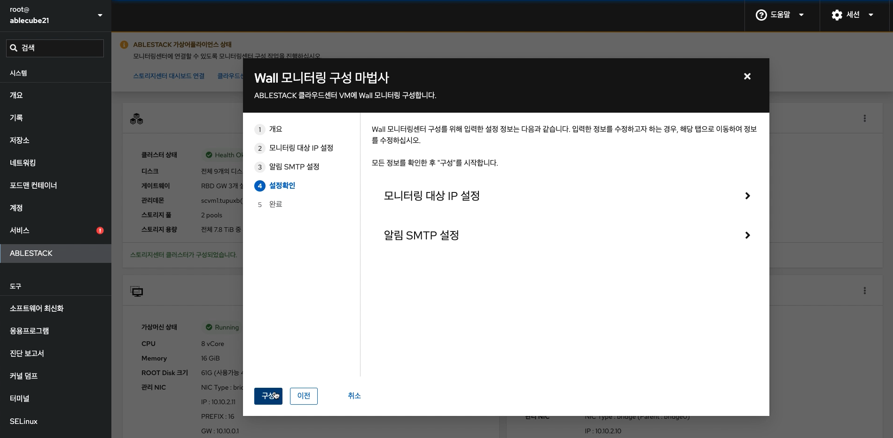{ align=center }
    - 모니터링 대상 IP 설정 및 알림 SMTP 설정정보를 확인하는 화면입니다.
    - 설정정보를 확인 후 **구성** 버튼을 클릭합니다.

5. 모니터링센터 대시보드 구성 진행
    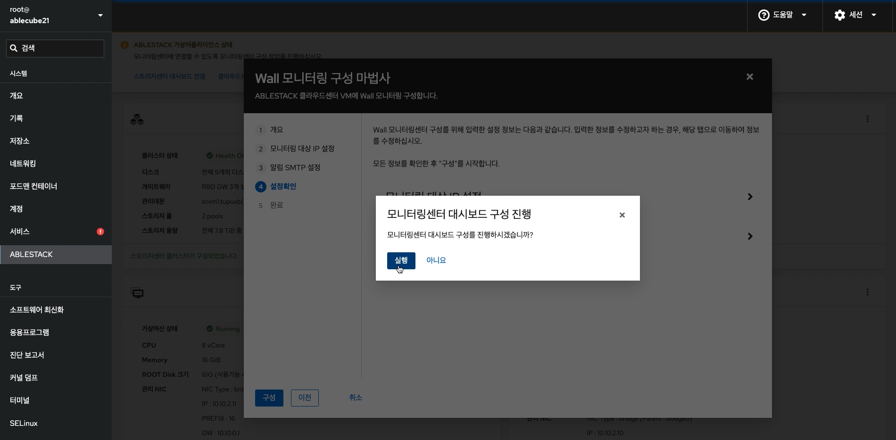{ align=center }
    - 모니터링센터 대시보드 구성을 진행하는 화면입니다.
    - **실행** 버튼을 클릭하여 모니터링센터 구성을 진행합니다.

6. 모니터링센터 구성 진행 단계 확인
    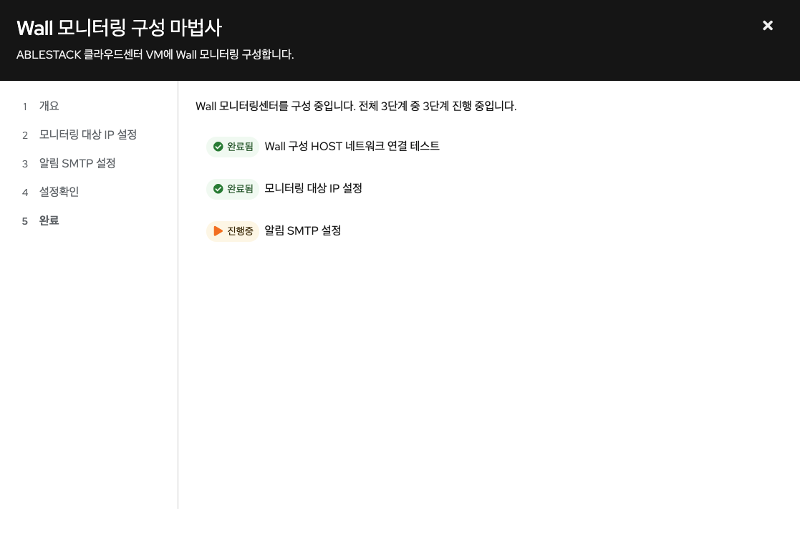{ align=center }
    - 모니터링센터 대시보드 구성 진행 현황을 확인하는 화면입니다.

    !!!info
        구성 진행 중 실패할 경우 X 버튼을 클릭하여 모니터링센터 구성 마법사를 닫으신 후, 상단 상태 리본의 모니터링센터 구성 링크를 클릭하여 처음부터 다시 진행가능 합니다.

7. 모니터링센터 구성 진행 완료
    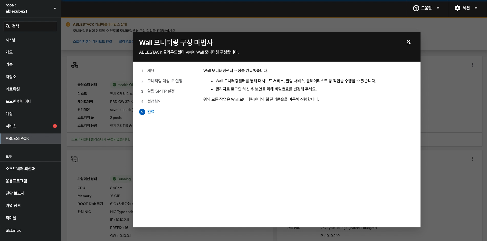{ align=center }
    - 모니터링센터 대시보드 구성 완료 화면입니다.

8. 모니터링센터 구성 완료
    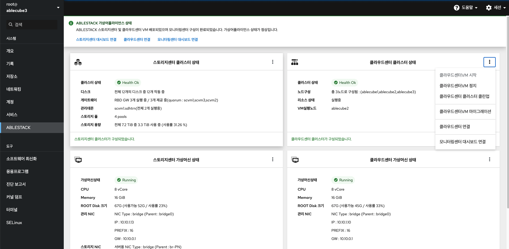{ align=center }
    - 모니터링센터 구성 진행 완료 후 화면입니다.
    - **모니터링센터 대시보드 연결** 버튼을 클릭하여 모니터링센터 대시보드 Wall 웹콘솔로 접근 가능합니다.

9. Wall 웹 콘솔 접속
    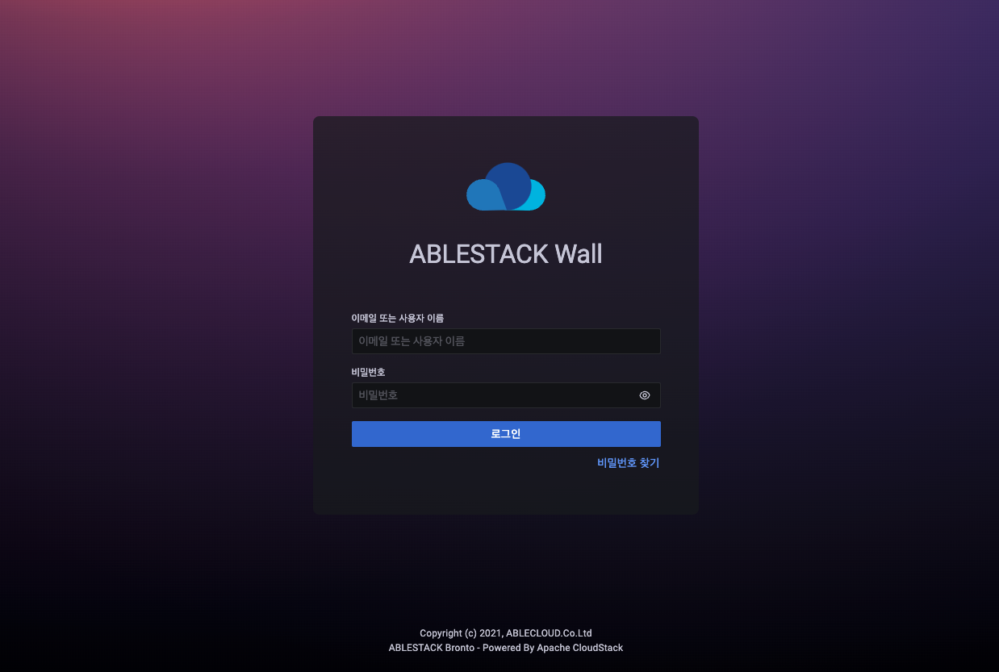{ align=center }
    - wall_mngt_ip:3000/login 으로 접속하시면 로그인 페이지를 확인할 수 있습니다.

10. Wall 메인 대시보드
    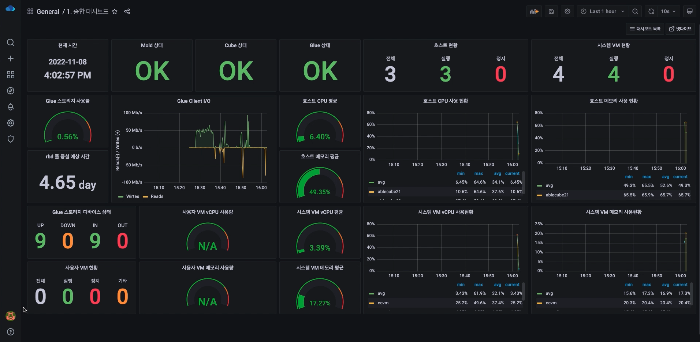{ align=center }
    - 로그인 완료 후에 메인 대시보드 화면이 나타납니다.
    - Wall 모니터링센터 구성이 완료되면, 해당 화면이 출력 됩니다.
