!!! danger
    이 문서는 기술지원 용도의 문서입니다. 기술지원 엔지니어가 아닌 사용자가 조작할 때 시스템에 문제가 발생할 수 있습니다.

# ABLESTACK Works 구성진행

ABLESTACK Works 설치 진행 가이드 입니다.  
ABLESTACK Mold 의 **데스크톱 서비스** 를 이용하여 진행이 되며 **데스크톱 서비스** 메뉴는 **Mold > 구성 > 글로벌 설정** 에서 **cloud.desktop.service.enabled** 항목을 
**true** 로 값을 변경 하고 ABLESTACK Mold 를 재시작 하면 **데스크톱 서비스** 메뉴가 활성화 됩니다. 

## Mold 에서의 데스크톱 서비스 배포

### Mold 글로벌 설정 변경  

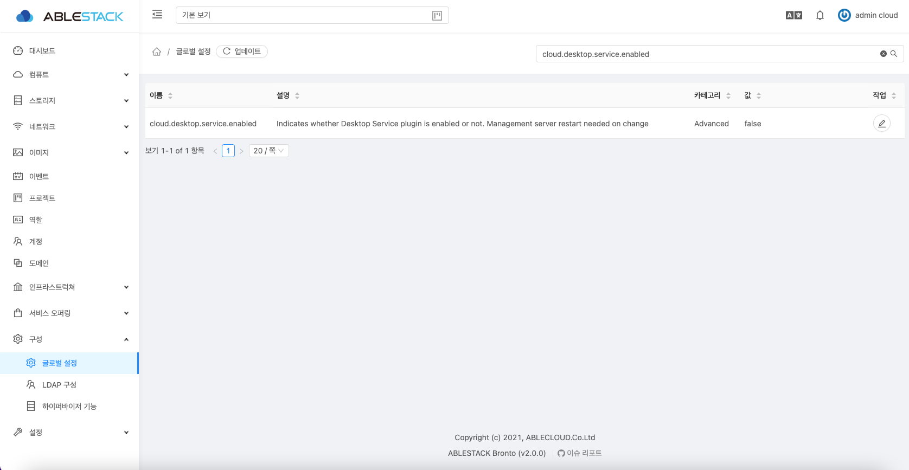{ align=center }  

- 구성 > 글로벌 설정 화면에서 **cloud.desktop.service.enabled** 검색하여나오는 항복의 값을 false 에서 true 로 변경
- ABLECLOUD Mold 재기동 진행  

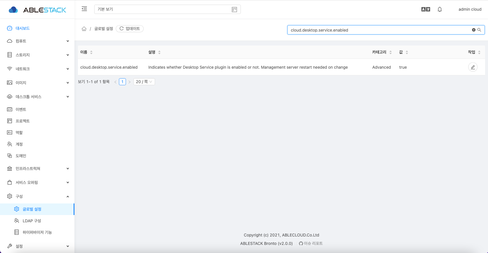{ align=center }

- 데스크톱 서비스 메뉴 활성화 화면

### 컨트롤러 템플릿 생성

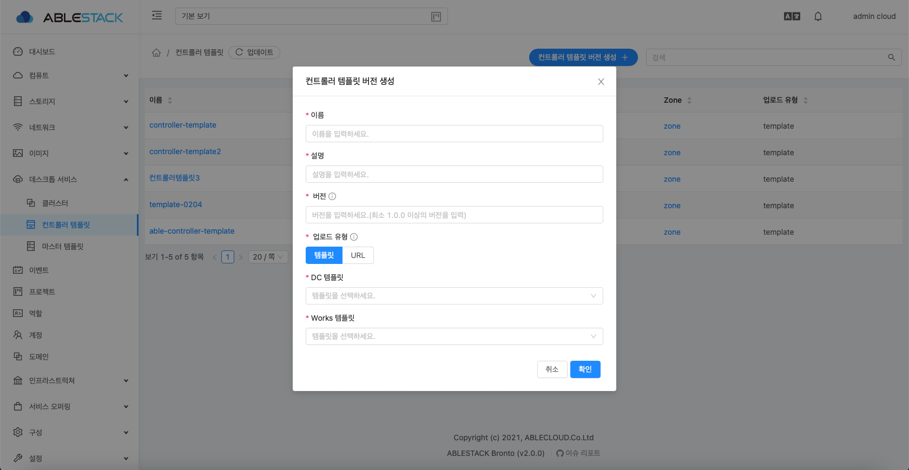{ align=center }  

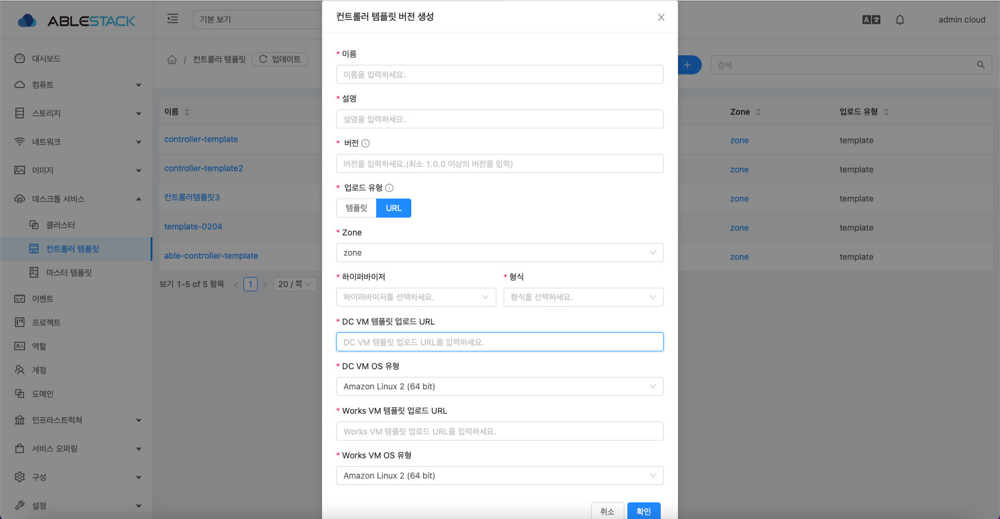{ align=center }

- **이름** 입력창에는 컨트롤러 템플릿 이름을 입력 합니다.
- **설명** 입력창에는 컨트롤러 템플릿 설명을 입력 합니다.
- **버전** 입력창에는 컨트롤러 템플릿 버전을 입력 합니다.
- **업로드 유형** 선택창에서는 템플릿 또는 URL 을 선택 합니다.
    - **템플릿** 선택은 기존에 Mold 에 등록된 템플릿에서 컨트롤러 템플릿을 선택 할 수 있습니다.
        - **DC 템플릿** 선택창에서는 Mold 에서 등록된 DC 용 템플릿을 선택 할 수 있습니다.
        - **Works 템플릿** 선택창에서는 Mold 에서 등록된 Works 용 템플릿을 선택 할 수 있습니다.
    - **URL** 선택은 웹에서 컨트롤러 템플릿을 다운로드 하여 등록 할 수 있습니다.
        - **Zone** 선택은 Mold 인프라스트럭쳐에서 구성된 Zone 을 선택 할 수 있습니다.
        - **하이퍼바이저** 선택은 Mold 인프라스트럭쳐에서 구성된 Zone 의 하이퍼 바이저를 선택 할 수 있습니다.
        - **형식** 등록 하는 템플릿의 형식을 선택 할 수 있습니다.
        - **DC VM 템플릿 업로드 URL** 입력창에는 DC 용 템플릿 다운로드 URL 을 입력 할 수 있습니다.
        - **DC VM OS 유형** 선택창은 DC 용 템플릿의 OS 타입을 선택 할 수 있습니다.
        - **Works VM 템플릿 업로드 URL** 입력창에는 Works 용 템플릿 다운로드 URL 을 입력 할 수 있습니다.
        - **Works VM OS 유형** 선택창은 Works 용 템플릿의 OS 타입을 선택 할 수 있습니다.
- 입력 및 선택 항목을 확인 후 에 **다음** 버튼을 클릭하여 컨트롤러 템플릿을 등록 합니다.

### 마스터 템플릿 생성

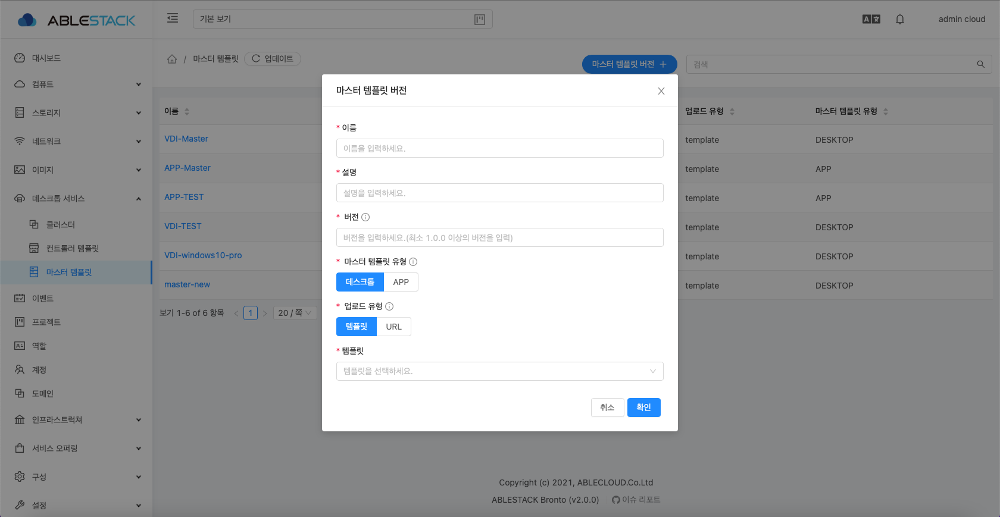{ align=center }

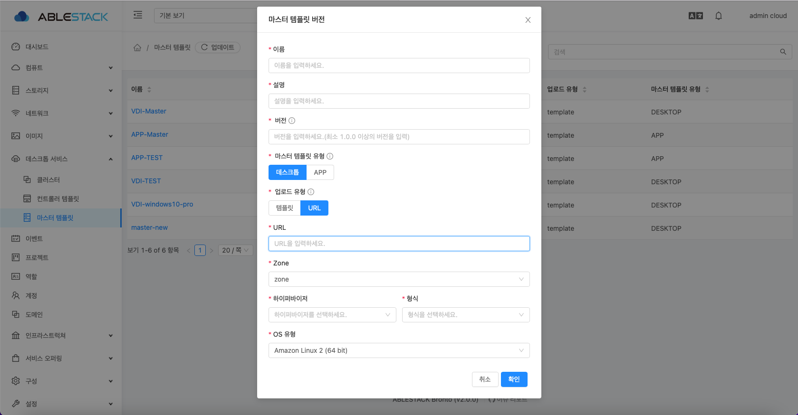{ align=center }

- **이름** 마스터 템플릿 이름을 입력 합니다.
- **설명** 마스터 템플릿 설명을 입력 합니다.
- **버전** 마스터 템플릿 버전을 입력 합니다.
!!! info
    버전 입력 양식은 **숫자** 와 **점(.)** 으로 입력 가능하며, 최소 **1.0.0** 이상의 버전을 입력 하여야 합니다.
- **마스터 템플릿 유형** 데스크톱 또는 APP 을 선택 할 수 있습니다.
- **업로드 유형** 선택창에서는 템플릿 또는 URL 을 선택 합니다.
    - **템플릿** 선택은 기존에 Mold 에 등록된 템플릿에서 컨트롤러 템플릿을 선택 할 수 있습니다.
        - **템플릿** 선택창에서는 Mold 에서 등록된 Desktop 용 템플릿을 선택 할 수 있습니다.
    - **URL** 선택창에서는 웹에에서 다운로드 가능한 Desktop 용 템플릿을 등록 할 수 있습니다.
        - **URL** 입력창에는 웹에서 Desktop 템플릿을 다운로드 주소를 입력 합니다.
        - **Zone** 선택창에는은 Mold 인프라스트럭쳐에서 구성된 Zone 을 선택 합니다.
        - **하이퍼바이저** 선택창에는 Mold 인프라스트럭쳐에서 구성된 Zone 의 하이퍼 바이저를 선택 합니다.
        - **형식** 입력창에는 등록 하는 템플릿의 형식을 선택 합니다.
        - **OS 유형** 선택창은 Desktop 용 템플릿의 OS 타입을 선택 할 수 있습니다.
- 입력 및 선택 항목을 확인 후 에 **다음** 버튼을 클릭하여 컨트롤러 템플릿을 등록 합니다.
    
### 데스크톱 클러스터 배포
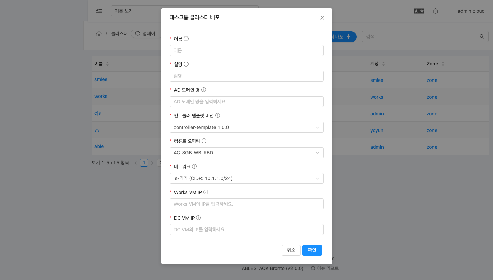{ align=center }

- **이름** 입력창에는 배포할 데스크톱 클러스터의 이름을 입력 합니다.
- **설명** 입력창에는 배포할 데스크톱 클러스터의 설명을 입력 합니다.
- **AD 도메인명** 입력창에는 배포할 데스크톱 클러스터의 Activity Domain 명을 입력 합니다.
- **컨트롤러 템플릿 버전** 선택창에는 컨트롤러 템플릿 메뉴에서 등록한 템플릿을 선택 합니다.
- **컴퓨트 오퍼링** 선택창에는 배포할 클러스터의 오퍼링을 선택 합니다.
- **네트워크** 선택창에는 클러스터를 배포할 네트워크를 선택 합니다.
!!! info
    데스크톱 클러스터는 **isolated** 네트워크에서만 배포가 가능하며, 1개의 네트워크에는 1개의 데스크톱 클러스터만 배포 할 수 있습니다.
- **Works VM IP** 입력창에는 Works VM의 IP를 입력 합니다.
- **DC VM IP** 입력창에는 DC VM의 IP를 입력 합니다.
!!! info
    Works VM, DC VM 의 IP 는 위에서 선택한 네트워크 선택창에서 선택한 네트워크의 CIDR 의 범위안에 IP 를 입력 해야합니다.
- 입력 및 선택 항목을 확인 후에 **다음** 버튼을 클릭하여 데스크톱 클러스터 배포를 진행 합니다.

### 마스터 템플릿 생성
Mold 에서 메뉴 **컴퓨트 > 가상머신** 페이지로 이동하여 **가상머신 추가 +** 버튼을 클릭하여 가상머신 생성 화면으로 이동합니다.  

#### Windows 10 가상머신 생성

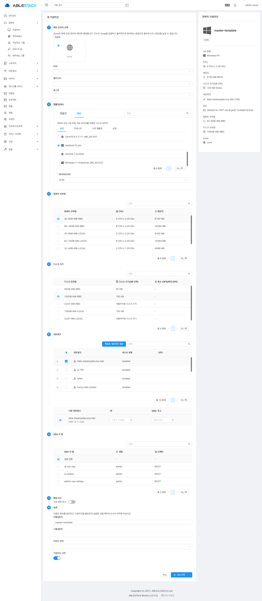{ align=center }  

1. **배포 인프라 선택** : Mold 에서 구성된 **Zone** 을 선택 합니다.  

    !!! info
        - Pod, 클러스터, 호스트는 옵션 입력창 입니다. 별도의 값을 입력 하지 않아도 가상머신 생성하는데 문제가 되지 않습니다.
        - 특정 Pod, 클러스터, 호스트를 선택 하지 않을 경우 임의의 Pod, 클러스터, 호스트에 가상머신이 생성됩니다.

2. **템플릿/ISO** : ISO 탭 선택 후 마스터 템플릿으로 설치할 ISO 를 선택 하고, Zone 에서 구성된 **하이퍼바이저** 를 선택 합니다.

4. **컴퓨트 오퍼링** : 가상머신의 오퍼링을 선택 합니다.  

    !!! info
        - 현재 선택한 가상머신의 오퍼링은 Works 에서 생성되는 데스크탑 가상머신의 오퍼링과 연관이 없습니다.
        - Windows 관련하여 최소한의 CPU 와 Memory 만 할당 후에 생성해도 상관없습니다.

5. **디스크 크기** : 가상머신에 할당할 디스크 크기를 선택 합니다.  

    !!! info
        - 선택된 디스크는 Windows OS 설치 단계에서 파티션을 통하여 구성이 가능하나 **C:** 드라이브의 크기는 선택한 디스크 크기를 넘어갈수는 없습니다.
        - 추후에 Works 에서 생성될 데스크탑 가상머신은 선택한 디스크 크기와 동일한 크기로 생성이 되며 변경이 불가능 합니다.
        - 데이터 디스크는 추후에 Works 에서 데스크탑 가상머신 생성 후에 인프라 관리자에게 문의를 통하여 추할 수 있습니다.

6. **네트워크** : 가상머신을 생성할 네트워크를 선택 합니다.  

7. **SSH 키 쌍** : Windows 와는 상관없는 옵션으로 **설정 안함** 을 선택 합니다.  

8. **확장 모드** : 가상머신 생성시 필요한 정보를 수정하면됩니다.  

    !!! info
        - 마스터 템플릿 생성시 기존 설정값으로 설정해도 상관이 없으며 **확장 모드** 에서 별도의 옵션을 선택할 필요는 없습니다.

9. **상세** : 이름, 그룹, 키보드 언어의 입력값을 입력하고, 가상머신 시작 라디오 버튼을 확인합니다.  

    !!! info
        - **이름** : 이름은 옵션입니다. 입력 값이 없는경우 Mold 에서 임이의 이름 으로 생성이 됩니다.
        - **그룹** : 그룹은 옵셥입니다. 가상머신 그룹에서 생성된 그룹명을 입력합니다. 
        - **키보드 언어** : 키보드 언어는 옵션입니다. 키보드 언어를 변경할 경우 값을 입력합니다.
        - **가상머신 시작** : 가상머신 시작을 선택하고 가상머신을 생성하면 생성과 동시가 가상머신이 시작됩니다.

10. **VM 시작** : 가상머신 생성과 관련된 선택 값 및 입력 값을 확인 후에 **VM 시작** 버튼을 클릭 합니다.  

#### Windows 10 OS 설치 (1/2)

1. Mold 에서 생성된 Master Template 용 가상머신 상세 정보화면에서 **콘솔 보기** 버튼을 클릭하여, 해당 가상머신의 콘솔 화면으로 이동합니다.

    { align=center }

    { align=center }

2. Windows 10 설치 초기 화면입니다.

    { align=center }

    1. **설치할 언어** : Windows 10 OS 설치 언어를 선택 합니다.
    2. **시간 및 통화 형식** : Windows 10 OS 시간 설정 및 통화 형식을 선택 합니다.
    3. **키보드 또는 입력 방법** : Windows 10 OS 키보드 또는 입력 방법을 선택 합니다.
    4. **키보드 종류** : Windows 10 OS 키보드 종류를 선택 합니다.
    5. 선택 사항을 확인 후에 **다음** 버튼을 클릭 합니다.
    !!! info
        OS 설정 사항을 잘못 선택 할 경우 OS 설치가 완료 후에 변경 가능하나 초기 선택을 신중하게 선택하셔야 합니다.

3. Windows 10 설치 진행

    { align=center }

    1. **지금 설치** 버튼을 클릭 하여 Windows 10 OS 설치를 진행 합니다.
   
    { align=center }

4. Windows 10 정품 인증

    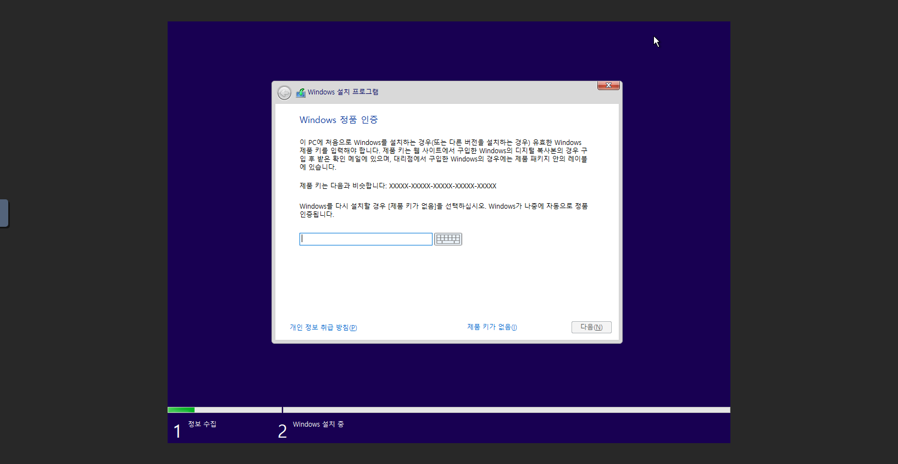{ align=center }

    윈도우 정품 인증을 위한 시디키 입력을 하는 화면입니다.
    1. Windows 10 정품키가 없는 경우 **제품 키가 없음** 버튼을 클릭합니다.
    !!! info
        마스터 템플릿 용 가상머신이므로 Windows 정품을 지금 진행 하지 않으셔도 됩니다.  
        정품인증은 추후에 Works 에서 데스크탑용 가상머신 생성시 진행하거나 윈도우 라이센스 적용을 위한 라이센스 서버를 구성해야 합니다.

5. Windows 10 설치할 운영 체제 선택

    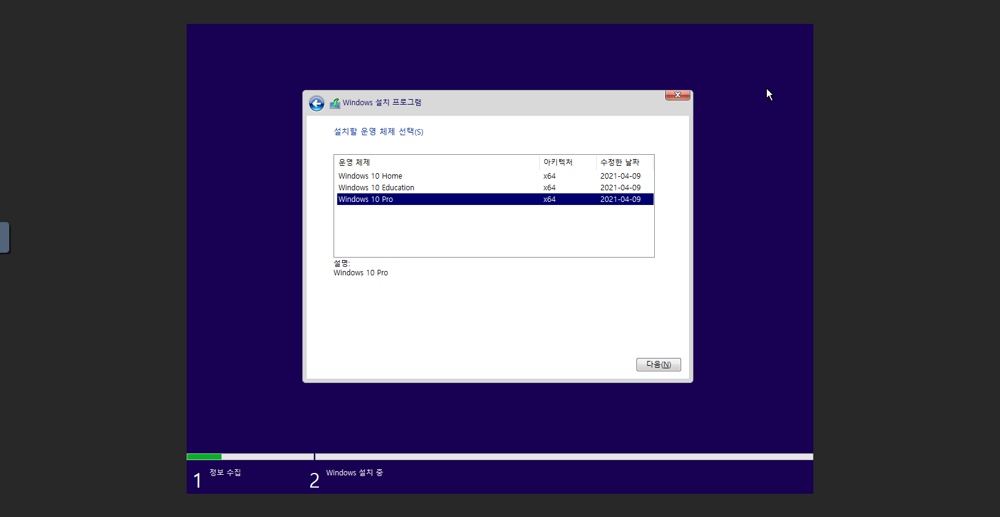{ align=center }

    1. Windows 10 운영 체제를 선택 하고, **다음** 다음 버튼을 클릭 합니다.

6. Windows 10 관련 통지 및 사용 조건

    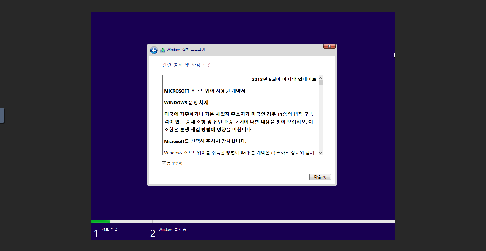{ align=center }

    1. MICROSOFT 소프트웨어 사용권 계약서 내용 확인후 **동의함** 선택을 체크 한 후에 **다음** 버튼을 클릭 합니다.

7. Windows 10 설치 유형

    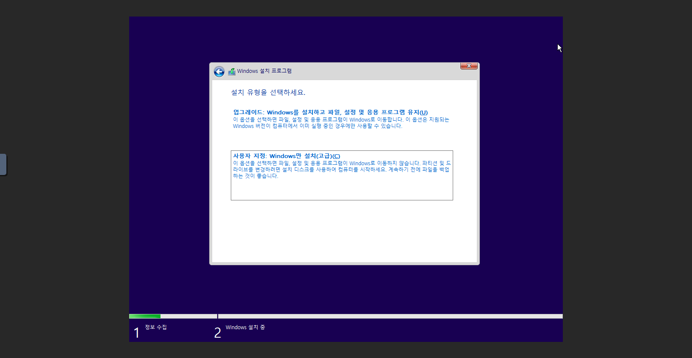{ align=center }

    Windows 10 설치 유형을 선택 하는 화면 입니다.
    1. **사용자 지정: Windows만 설치(고급)** 을 선택 하여 다음 화면으로 이동합니다.

8. Windows 를 설치할 위치를 지정하세요.

    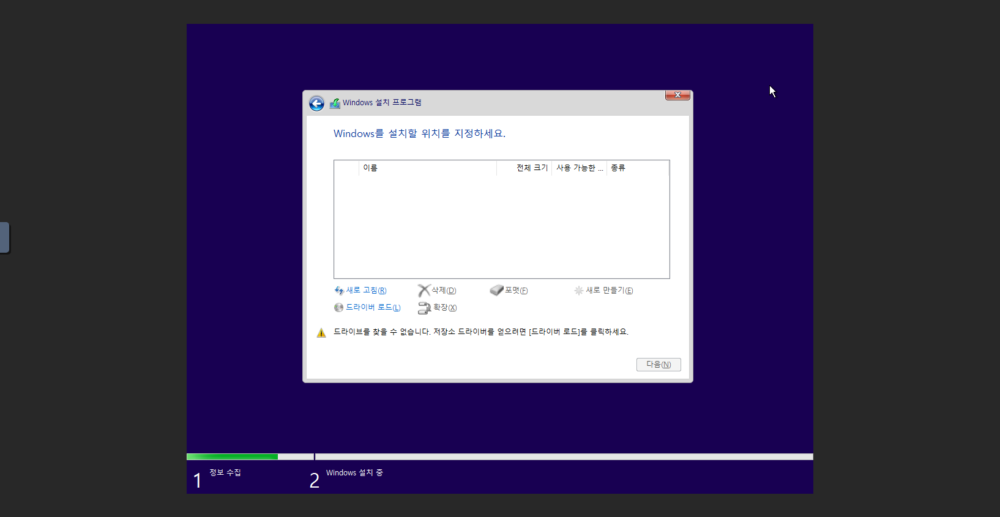{ align=center }

    !!! info
        ABLECLOUD 의 Mold 에서 Windows 계열의 OS 를 설치할 경우 디스크 정보가 정상적으로 보이지 않습니다.  
        그 이유는 디스크와 관련된 Agent 가 정상적으로 설치가 안되여서 디스크 정보를 정상적으로 읽을 수 없는 상황입니다.
        디스크 Agent 소프트웨어를 설치하면 정상적으로 디스크 정보를 확인 할 수 있으며, Windows OS 를 정상적으로 설치 진행이 가능합니다.

#### VirtIOStor 설치 진행
!!! info
    Virt IO Stor 설치 진행에 대하여 설명하는 부분 입니다. Windows OS 종류와 상관없이 동일한 절차로 진행이 되며, OS 버전 선택 부분을 제외한 나머지 부분은 동일합니다.
    현재 부분에서는 디스크와 관련된 Agent 만 설치 진행되며 디바이스 관련 Agent 는 OS 설치 완료 후 진행 됩니다.

1. Windows 설치용 ISO 연결 해제

    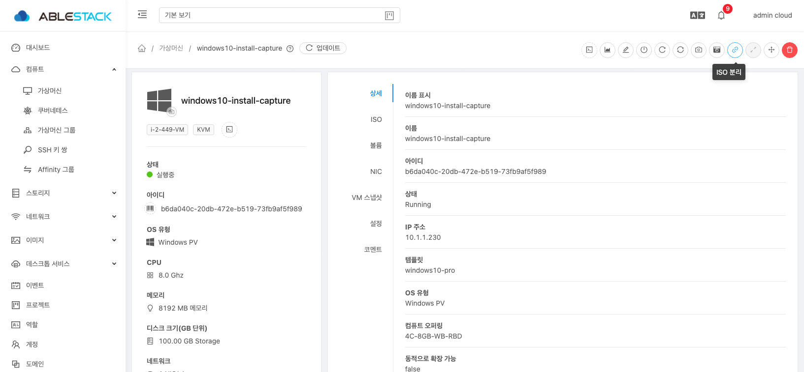{ align=center }

    1. Windows 10 설치 중인 가상머신에서 **ISO 분리** 버튼을 클릭합니다.
    2. ISO 분리 확인 창에서 **확인** 버튼을 클릭하여 ISO 를 분리 합니다.

    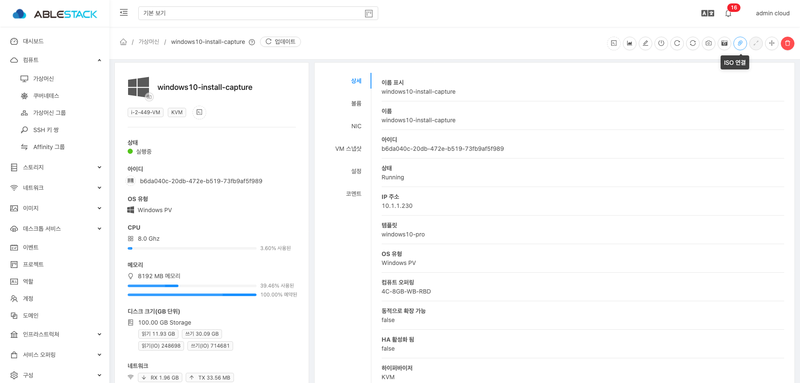{ align=center }
   
2. VirtIO-win ISO 연결
    
    { align=center }
     
    1. Windows 10 설치 중인 가상머신에서 **ISO 연결** 버튼을 클릭합니다.
    
    2. 선택 박스에서 **virtio-win-0.1.208** ISO 선택 하고 **확인** 버튼을 클릭 합니다.
   
    !!! info
        virt-io 설치용 ISO 명은 상황에 따라 다를수가 있습니다. 위에 명시된 이름은 참고용 입니다.

    { align=center }
   
    3. **드라이버 로드** 버튼을 클릭 합니다.
       
    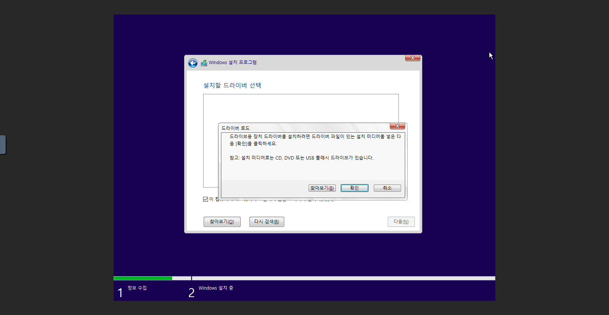{ align=center }

    4. **찾아보기** 버튼을 클릭 합니다.
   
    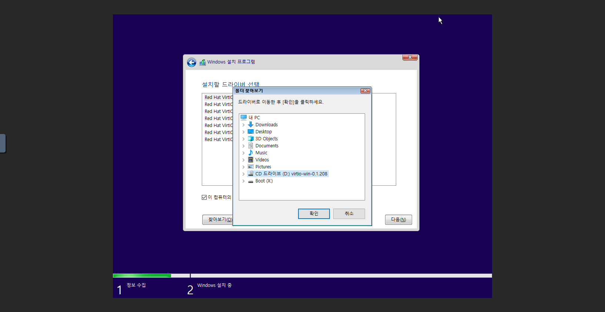{ align=center }

    5. **CD 드라이브 (D:): virtio-win-0.1.208** 을 선택 합니다.

    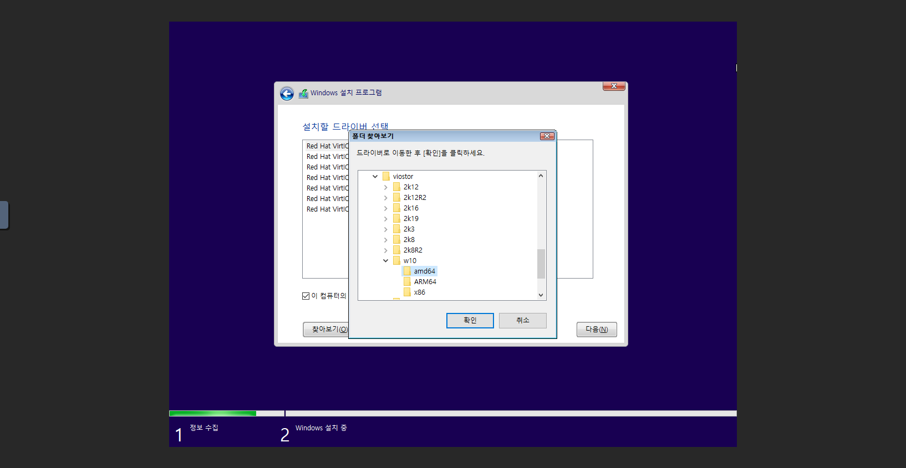{ align=center }
   
    6. **viostor > w10 > amd64** 위치로 이동한 후 **확인** 버튼을 클릭 합니다.

    !!! info
        폴더별 설명  
        - **viostor** : 디스크와 관련된 Agent 설치 폴더 입니다.  
        - **w10** : Windows OS 버전별로 나누어져 있는 폴더 입니다. 설치 OS 버전에 맞는 폴더를 선택 하시면 됩니다.  
        - **amd64** : CPU 타입별로 나누어져 있는 폴더 입니다. 설치중인 서버의 CPU 타입에 맞는 폴더를 선택 하시면 됩니다.  

    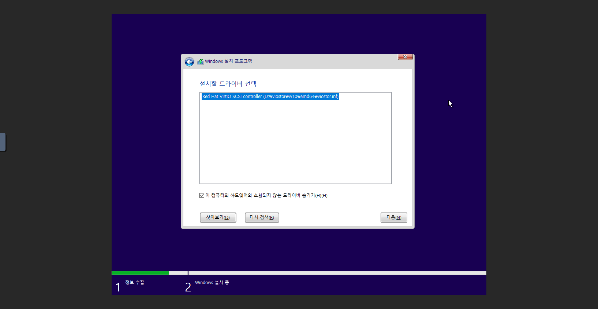{ align=center }

    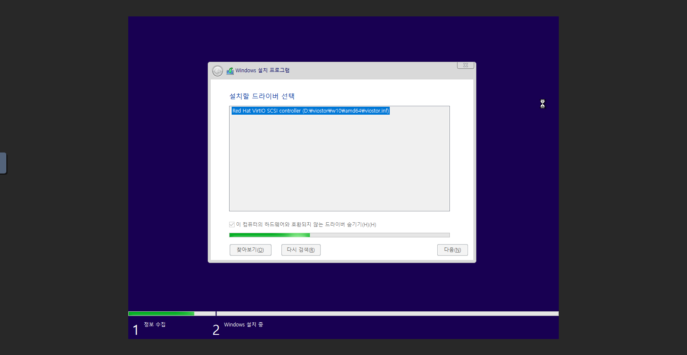{ align=center }

    7. **Red Hat VirtIO SCSI controller** 를 선택 한 후에 **다음** 버튼을 클릭 합니다.

    8. VirtIOStor 설치가 마무리 되면 **virtio-win-0.1.208** ISO 를 분리하고 Windows 설치 ISO 를 다시 연결 한 후 Windows 10 OS 설치를 이어서 진행 합니다.

#### Windows 10 OS 설치 (2/2)

1. Windows 를 설치할 위치를 지정하세요.

    { align=center }

    1. 할당되지 않은 공간을 선택 하고 **새로 만들기** 버튼을 클릭합니다.

    { align=center }

    2. **적용** 버튼을 클릭하여 새로운 공간을 생성합니다.

    !!! info
        디스크의 파티션을 구성할경우 현재 단계에서 적용을 해야 합니다.

    { align=center }

    3. **확인** 버튼을 클릭하여 새로운 공간을 포맷을 진행합니다.

    { align=center }

    4. **드라이브 0 파티션 2** 를 선택하고 **다음** 버튼을 클릭 합니다.

    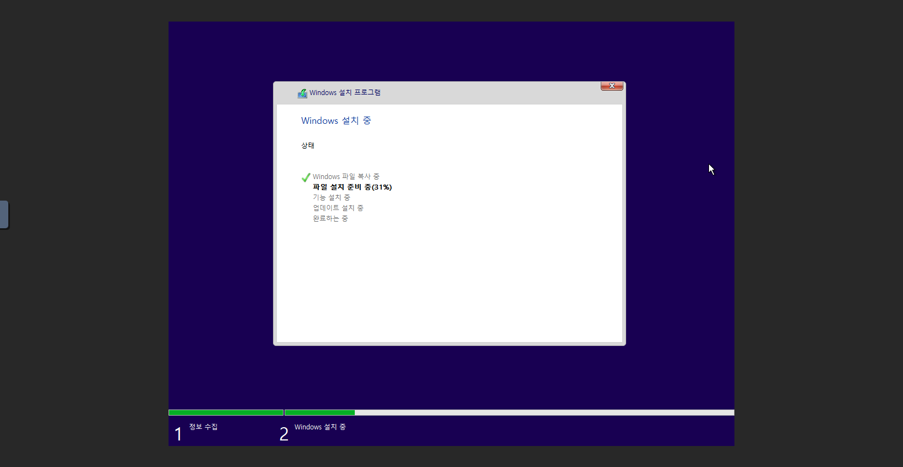{ align=center }

    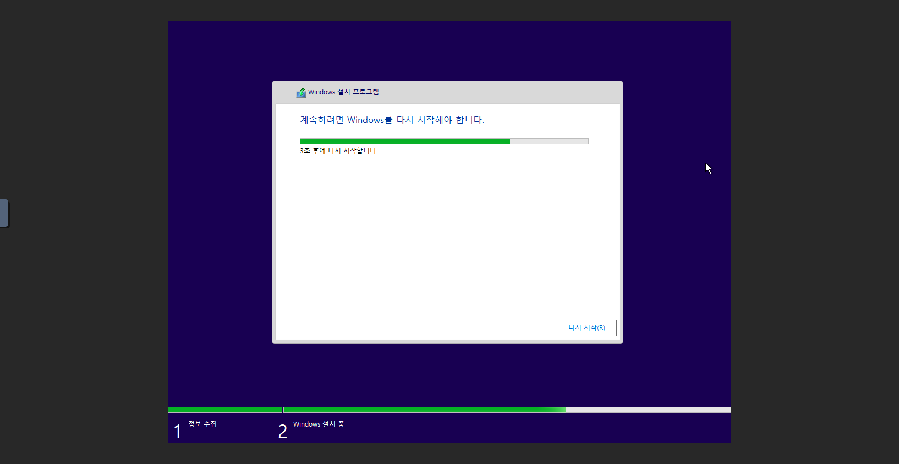{ align=center }

2. Windows OS 설치 마무리 후 재부팅을 진행 합니다.  

#### Windows 10 OS 설치 후 설정

Windows 10 OS 설치 완료 설정 Windows 설정 진행 절차 입니다.  

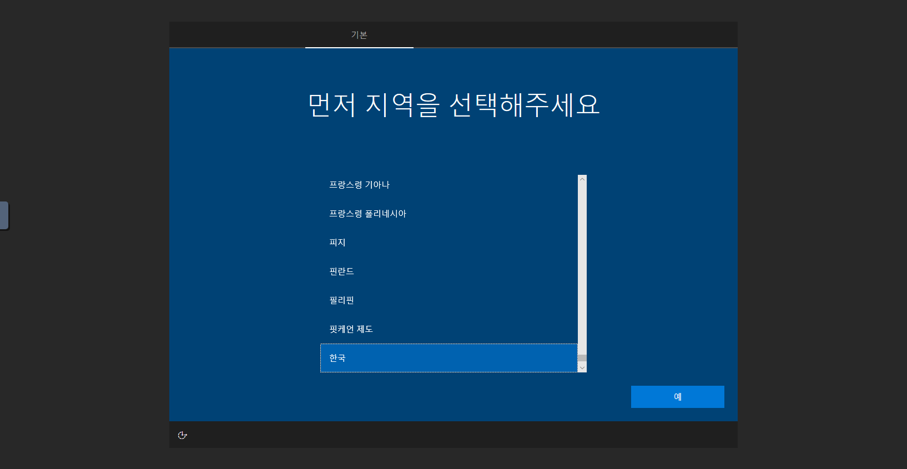{ align=center }
1. **한국** 을 선택 후 **예** 버튼을 클릭 합니다.

{ align=center }
2. **자판배열** 확인 후 **예** 버튼을 클릭 합니다.

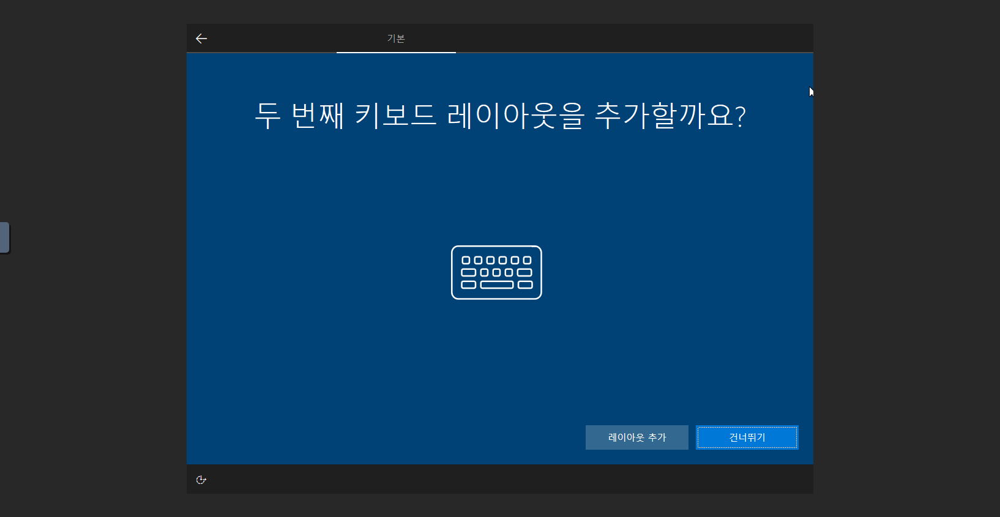{ align=center }
3. **건너뛰기** 버튼을 클릭 합니다.

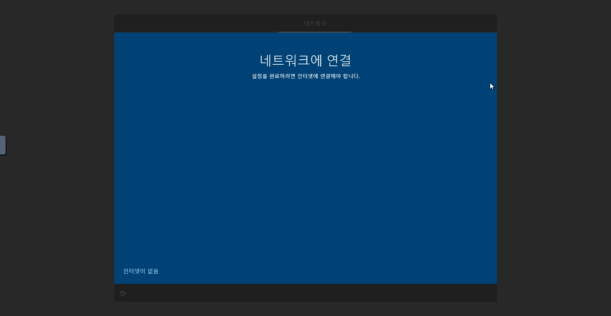{ align=center }
4. **인터넷이 없음** 버튼을 클릭 합니다.

!!! info
    네트워크 설정은 Agent 설치를 먼저 진행해야 해서 지금 단계에서는 건너뜁니다.

{ align=center }
5. **제한된 설치로 계속** 버튼을 클릭 합니다.

{ align=center }
6. **PC 이름** 을 입력 합니다.

!!! info
    Works 에서 데스크탑 가상머신 생성시 PC 이름은 재설정 됩니다.

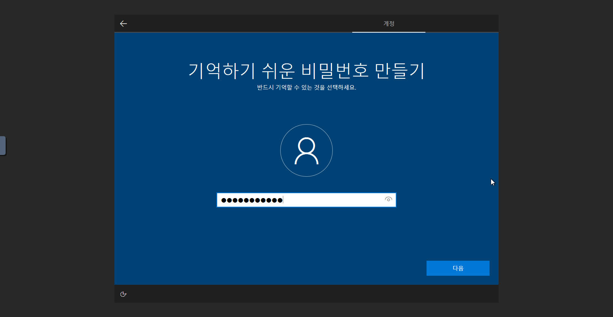{ align=center }
7. **비밀번호** 를 설정한 후에 **다음** 버튼을 클릭 합니다.

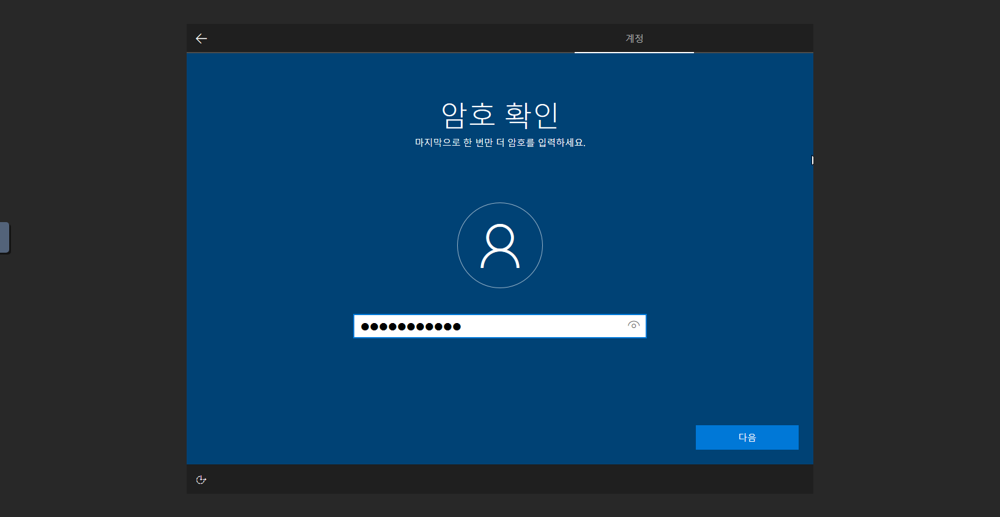{ align=center }
8. **비밀번호** 를 한번더 입력 후 **다음** 버튼을 클릭 합니다.

{ align=center }
9. **보안 질문 작성** 3단계를 진행 합니다.

{ align=center }
{ align=center }
{ align=center }
{ align=center }
{ align=center }
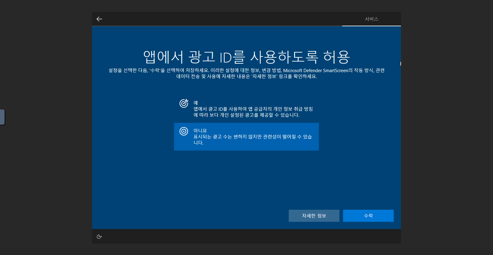{ align=center }
10. **기타 설정** 진행을 진행 합니다.

!!! info
    Works 의 데스크탑 가상머신은 Activity Domain Service 를 이용하여 중앙 통제를 합니다. 위 설정값은 추후에 변경이 될수도 있습니다.

{ align=center }
{ align=center }
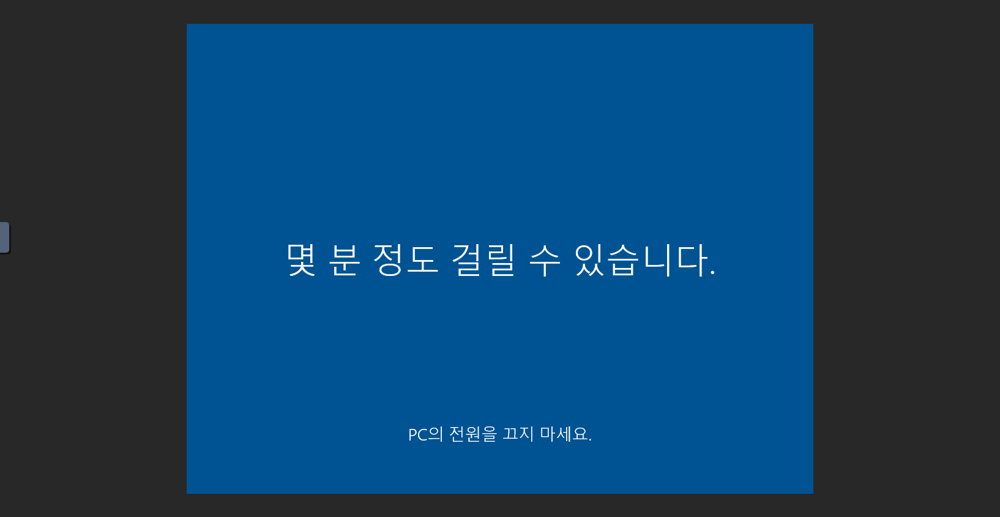{ align=center }
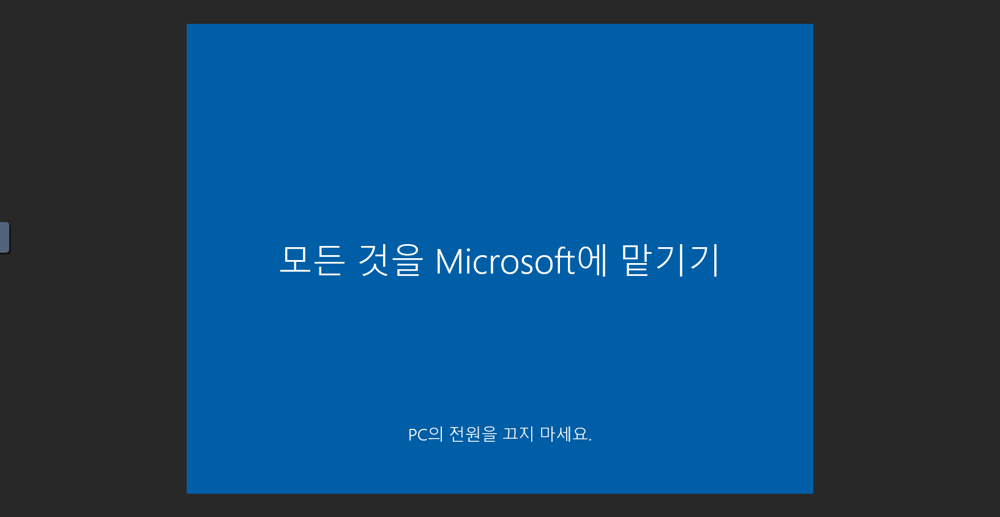{ align=center }
{ align=center }
{ align=center }
11. **Windows 10 설정** 완료.

#### Windows 10 디바이스 설정을 위한 Agent 설치

Windows 10 OS 설치 완료 후 디바이스의 설정을 위해 Agent 설치를 진행합니다.

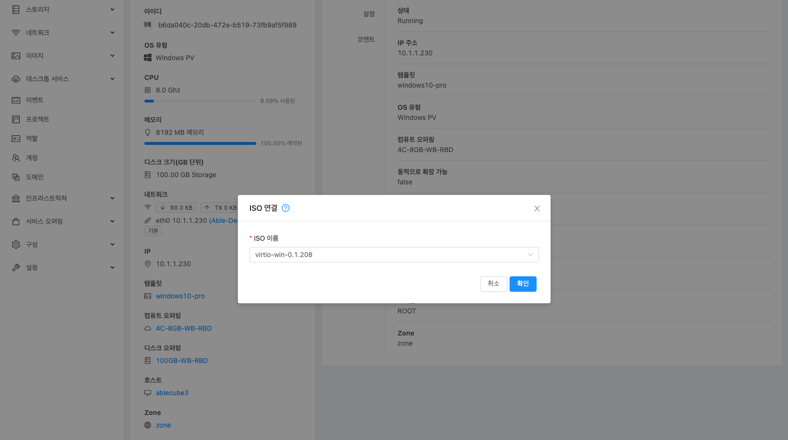{ align=center }
1. Windows 10 설치 ISO 분리 후 **virtio-win-0.1.208** ISO 연결

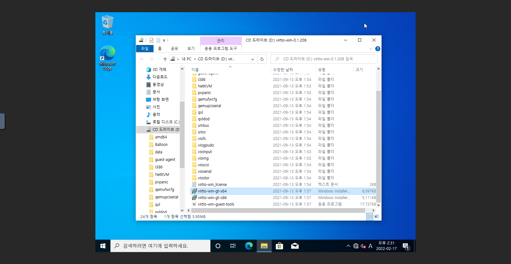{ align=center }
2. **D:** 드라이브 폴더로 이동 후 **virtio-win-gt-x64** 실행 파일을 실행 합니다.

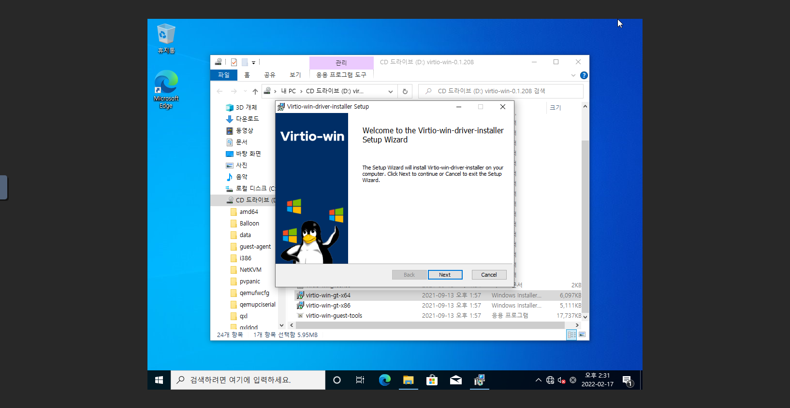{ align=center }
3. **Next** 버튼을 클릭 합니다.

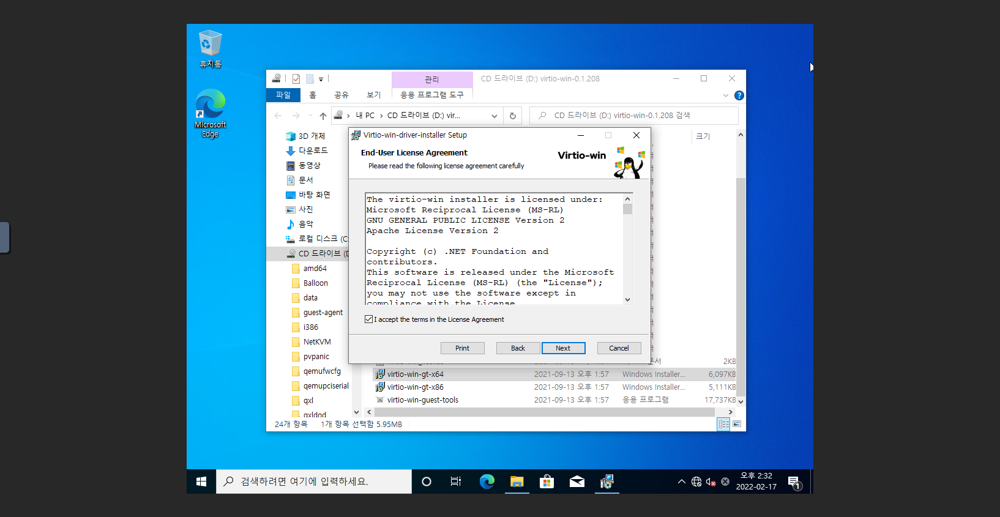{ align=center }
4. Virtio-win-driver-installer 라이센스 정보 확인 후 **I accept the terms in the License Agreement** 체크 후 **Next** 버튼을 클릭 합니다.

{ align=center }
5. 설치 리스트를 확인 후에 **Next** 버튼을 클릭 합니다.

{ align=center }
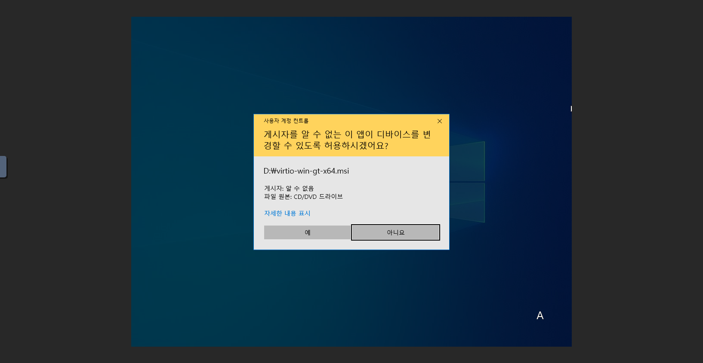{ align=center }
{ align=center }
6. **Install** 버튼을 클릭 후 설치 확인창에서 **예** 버튼을 클릭하여 Agent 를 설치합니다.

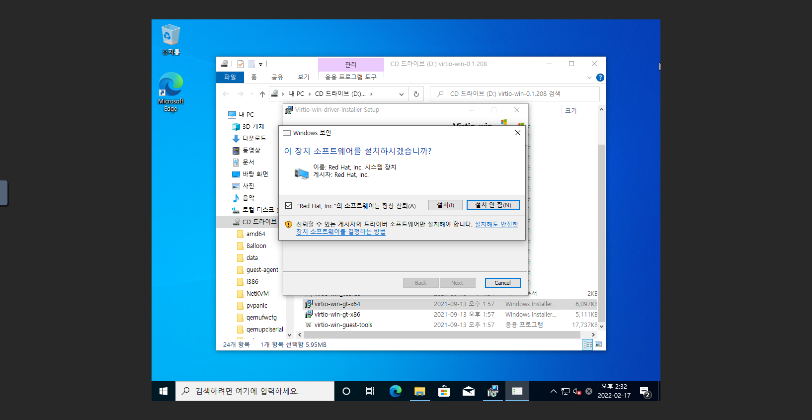{ align=center }
7. 설치 중 나오는 소프트웨어 신뢰하는 확인 창에서는 **설치** 버튼을 클릭 합니다.

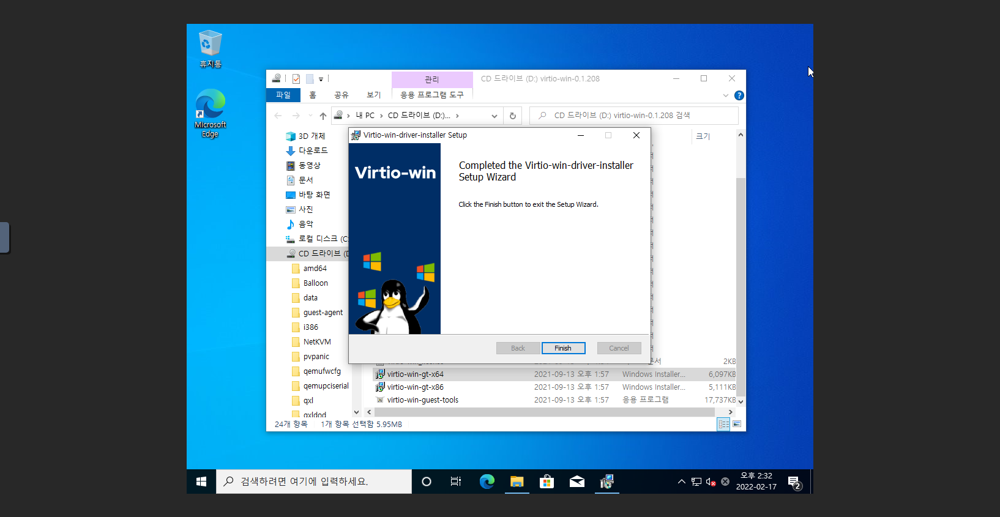{ align=center }
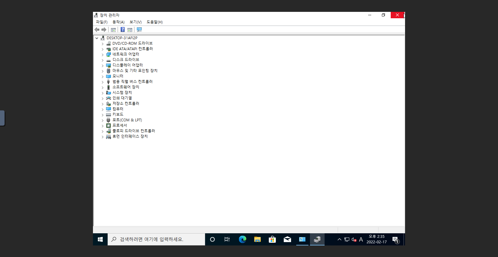{ align=center }
8. **Virtio 설치** 완료 및 **제어판 > 하드웨어 및 소리 > 장치관리자** 에서 설치 결과를 확인 합니다.

!!! info
    Agent 가 정상적으로 설치 완료되면 위 그림과 같이 모든 디바이스의 상태값이 정상적으로 보입니다.

#### Works Agent 설치

Works에서 데스크탑 가상머신을 생성하기 위해서는 **Works Agent** 를 설치해야 하며 그 절차에 대하여 설명하고 있습니다.

!!! info
    - 데스크탑 가상머신에 동일 프로그램을 설치해야할 필요가 있으면 현재 단계 진행 전에 설치를 진행 하셔야 합니다.
    - 윈도우 업데이트 진행 역시 Works Agent 설치 전에 진행 하셔야 합니다.

{ align=center }
1. **Works Agent** ISO 연결

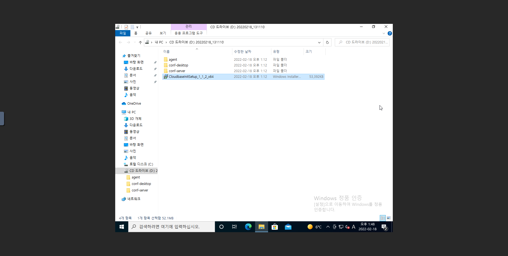{ align=center }
2. **D:** 에 있는 설치파일  **CloudbaseInitSetup_1_1_2_x64** 파일을 더블 클릭하여 **Cloudbase-Init** 을 설치 진행합니다.

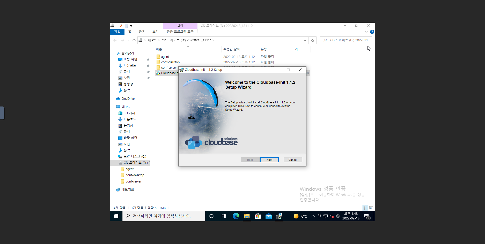{ align=center }
3. **Next** 버튼을 클릭합니다.

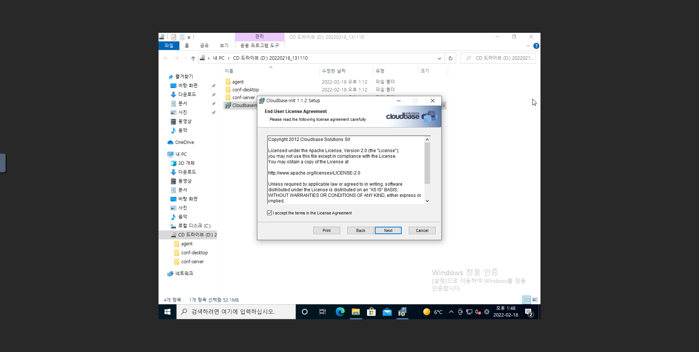{ align=center }
4. Cloudbase-Init 라이센스 정보를 확인 후 **I accept the terms in the License Agreement** 체크 후 **Next** 버튼을 클릭 합니다.

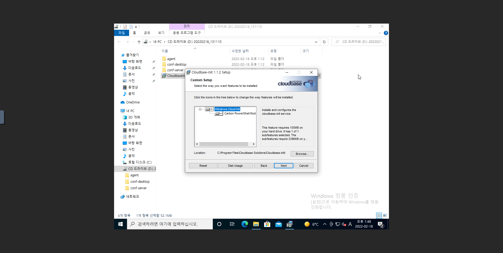{ align=center }
5. 설치 경로 및 설치 프로그램 확인 후 **Next** 버튼을 클릭 합니다.

{ align=center }
6. 입력정보 확인 후 **Next** 버튼을 클릭 합니다.

{ align=center }
7. **Install** 버튼을 클릭하여 설치를 진행 합니다.

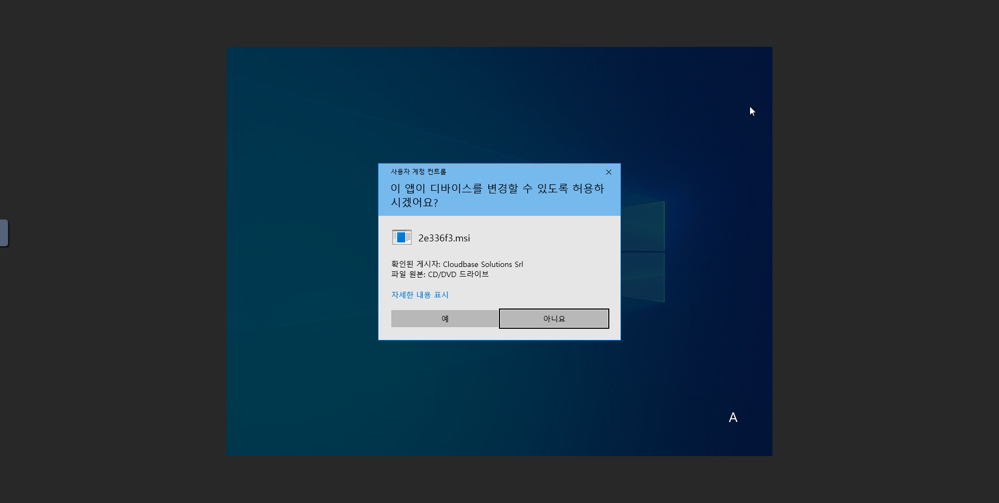{ align=center }
8. 디바이스 변경 확인 창에서 **예** 버튼을 클릭 합니다.

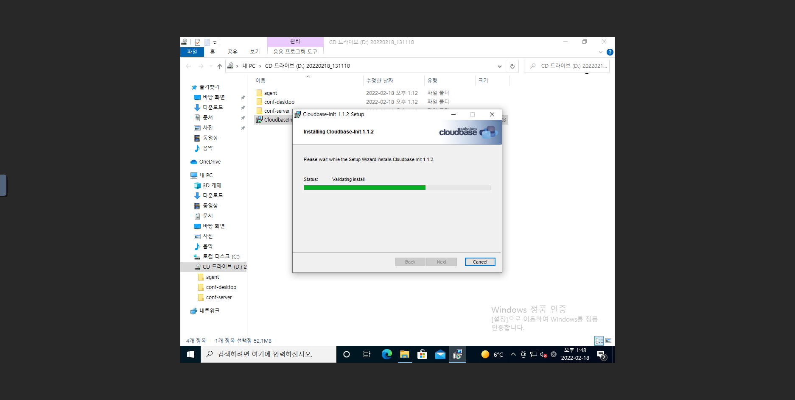{ align=center }
9. 설치 진행

{ align=center }
10. 다른 체크박스는 체크 하지 않고 **Finish** 버튼을 클릭 합니다.
!!! warning
    체크박스를 체크하고 완료를 하면 Agent 가 정상적으로 설치가 완료 되지 않습니다.

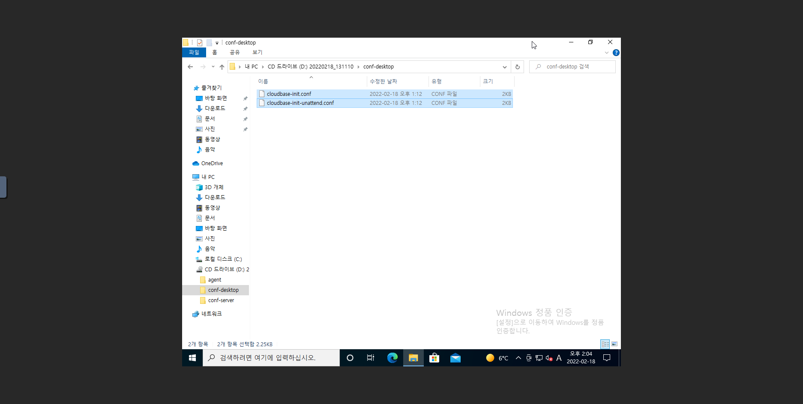{ align=center }
{ align=center }
{ align=center }
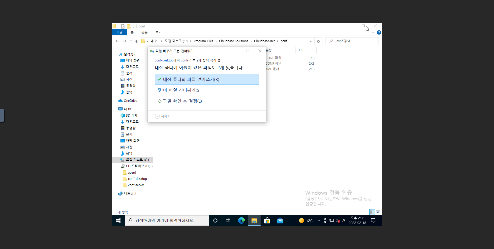{ align=center }
{ align=center }
11. **D:\conf-server** 위치에 있는 **cloudbase-init.conf, cloudbase-init-unattend.conf** 2개의 파일을
**C:\Program Files\Cloudbase Solutions\Cloudbase-Init\conf** 위치에 복사 합니다.

{ align=center }
{ align=center }
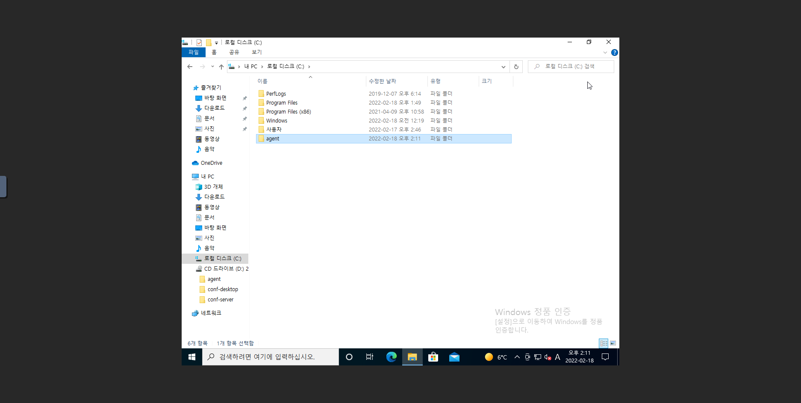{ align=center }
12. **D:** 에 있는 **agent** 폴더를 복사하여 **C:** 에 붙여넣기를 진행 합니다.

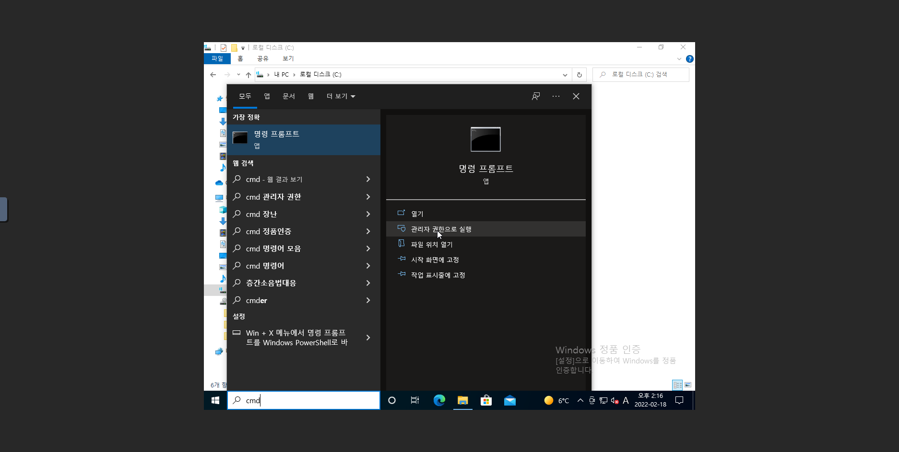{ align=center }
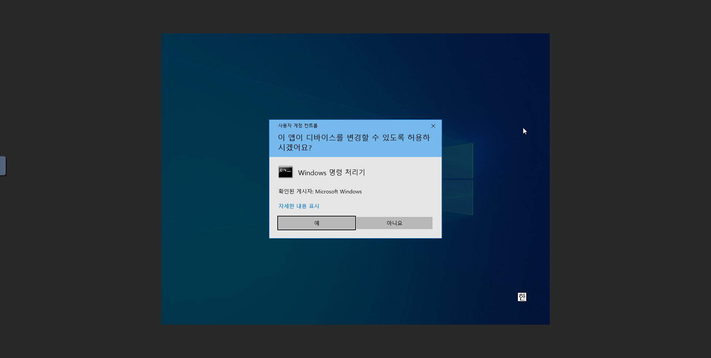{ align=center }
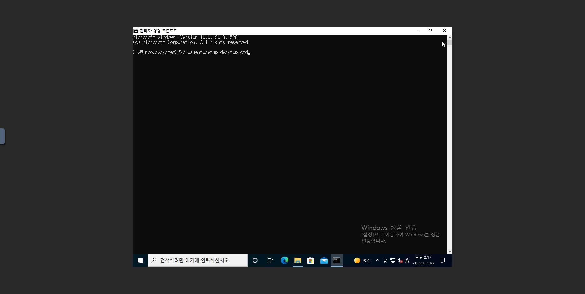{ align=center }
{ align=center }
13. **명령 프롬프트** 를 **관리자 권한으로 실행** 한 후에, **C:\agent\setup_desktop.cmd** 명령어를 실행 시키면 가상머신이 Sysprep 진행후 가상머신이 정지 됩니다.

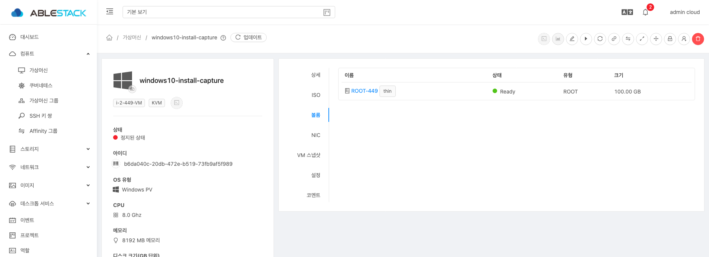{ align=center }
{ align=center }
14. 정지된 가상머신의 Disk를 선택하여 상세화면으로 이동하여 템플릿 생성 화면으로 이동합니다.

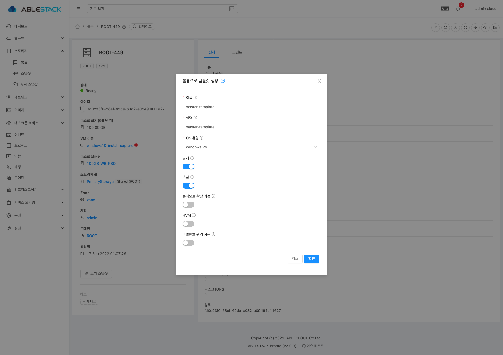{ align=center }
15. **볼륨으로 템플릿 생성** 을 진행 합니다.  

    - **이름** : 템플릿 이름을 입력 합니다.  
    - **설명** : 템플릿 설명을 입력 합니다.  
    - **OS 유형** : 템플릿 OS 유형을 선택합니다. 해당 부분에서는 **Windows PV** 를 선택 합니다.  
    - **공개** : 공개를 선택을 합니다.  
    - **추천** : 추천을 선택을 합니다.  
    - **동적으로 확장 가능** : 동적으로 확장 가능 선택을 하지 않습니다.  
    - **HVM** : HVM 을 선택 하지 않습니다.  
    - **비밀번호 관리 사용** : 비밀번호 관리 사용을 선택 하지 않습니다.  
    - 입력 및 선택 상황을 확인 후에 **다음** 버튼을 클릭 합니다.  
16. 템플릿 생성이 완료가 되면 Works Admin Portal 에서 워크스페이스 생성을 진행하시면 됩니다.  