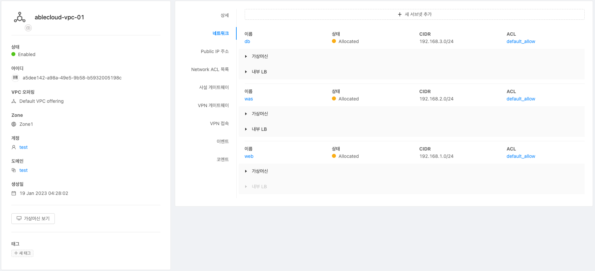

ABLESTACK Mold를 이용한 **이중화를 통한 고가용성 기능을 제공하는 리눅스 기반의 3계층 구조** 의 [구성 단계](../3tiers-linux-guide-prepare#_4){:target="_blank"} 중, 첫 번째 단계인 네트워크 구성에 대한 문서입니다.

논리적으로 분리된 가상 네트워크 환경에서 **이중화를 통한 고가용성 기능을 제공하는 리눅스 기반의 3계층 구조** 의를 구성하기 위해ABLESTACK Mold를 활용하여 VPC와 서브넷을 생성합니다.

### VPC 생성
VPC (Virtual Private Cloud)는 Mold 사용자의 전용 가상 네트워크이며 Mold에서 다른 가상 네트워크와 논리적으로 분리되어있는 공간입니다. 기존의 물리적 네트워크와 유사하게 사용자가 IP 주소 범위와 VPC 범위를 설정하여 구성합니다.
VPC를 생성하기 위해 VPC 오퍼링을 생성한 후, **네트워크 >  VPC** 화면으로 이동하여 **VPC 추가** 버튼을 클릭하여 추가합니다.

!!! info "VPC 생성 방법"
    VPC 생성에 대한 정보는 [가상 사설 클라우드 추가](../../../../administration/mold/network&traffic-mngt-guide#_30){:target="_blank"} 문서를 참고하십시오.

VPC 추가 대화상자에서의 입력 예시는 다음과 같습니다.

  - 이름: **ablecloud-vpc-01**
  - 설명: **3tiers-linux 구성을 위한 VPC입니다.**
  - Zone: **Zone1**
  - CIDR: **192.168.0.0/16**
  - 네트워크 도메인 : **cs5cloud.internal**
  - VPC 오퍼링 : **Default Vpc offering**

### 서브넷 추가

서브넷(Subnet)은 VPC를 더 작은 단위로 나누는 과정입니다. 서브넷은 VPC보다 더 작은 단위이기때문에 넷마스크가 더 높게되고 아이피범위가 더 작은 값을 갖게됩니다.
서브넷을 추가하기 위해 **네트워크 >  VPC** 화면으로 이동하여 윗 단계에서 생성한 VPC를 선택하고 **새 서브넷 추가** 버튼을 클릭하여 추가합니다.

!!! info "서브넷 추가 방법"
    서브넷 추가에 대한 정보는 [서브넷 추가](../../../../administration/mold/network&traffic-mngt-guide#_31){:target="_blank"} 문서를 참고하십시오.

서브넷 추가 대화상자에서의 입력 예시는 다음과 같습니다.

#### DB 서브넷 추가
애플리케이션이 처리하는 정보가 저장 및 관리되는 데이터 계층의 서브넷을 추가합니다.

- 이름 : **db**
- 네트워크 오퍼링 : **VPC 네트워크에 대한 기본 격리 네트워크오퍼링(내부 LB)**
- 게이트웨이 : **192.168.3.1**
- 넷 마스크 : **255.255.255.0**
- 외부 아이디:  * 디폴트 값으로 생성합니다
- ACL : **default_allow**

#### WAS 서브넷 추가
비즈니스 논리를 처리하는 애플리케이션 계층의 서브넷을 추가합니다.

  - 이름 : **was**
  - 네트워크 오퍼링 : **VPC 네트워크에 대한 기본 격리 네트워크오퍼링(내부 LB)**
  - 게이트웨이 : **192.168.2.1**
  - 넷 마스크 : **255.255.255.0**
  - 외부 아이디: * 디폴트 값으로 생성합니다.
  - ACL : **default_allow**

#### WEB 서브넷 추가
일반 사용자가 직접 액세스 할 수 있는 프레젠테이션 계층의 서브넷을 추가합니다.

  - 이름 : **web**
  - 네트워크 오퍼링 : **VPC 네트워크에 대한 기본 격리 네트워크오퍼링**
  - 게이트웨이 : **192.168.1.1**
  - 넷 마스크 : **255.255.255.0**
  - 외부 아이디: * 디폴트 값으로 생성합니다.
  - ACL : **default_allow**

위 예시대로 생성된 **네트워크** 탭의 정보는 다음 그림과 같습니다.
{: .center }
