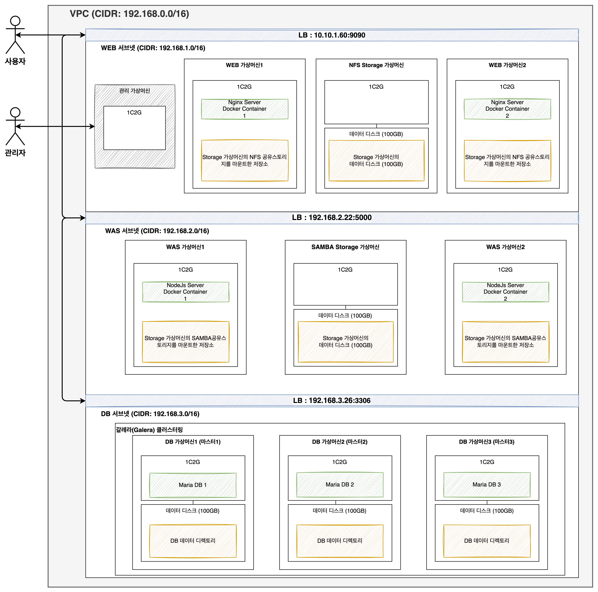

ABLESTACK Mold를 이용해 **이중화를 통한 고가용성 기능을 제공하는 리눅스 기반의 3계층 구조** 의를 구성하는 방법에 대해 설명합니다. 
이를 위해 독립된 네트워크 공간인 VPC에 3개의 Subnet를 구성하고 생성된 각 Subnet에 WEB, WAS, DB 구성에 필요한 가상머신을 생성한 다음 로드 밸런서(부하 분산)를 적용해아합니다.

## 아키텍처
다음 그림은 앞으로 구성할 리눅스 기반의 3계층 구조 전체를 보여줍니다. 관리자는 WEB Subnet에 구성된 관리용 가상머신의 Public IP를 통해 다른 가상머신에 접속할 수 있으며 사용자는 WEB Subnet에 생성된 외부 로드 밸런서(LB)를 통해 WEB Server에 접근할 수 있습니다.
아래 예시를 적용한 아키텍처 구성도를 참고하여 구성합니다.

{: .center }

## 네트워크 구성 정보
아키텍처에서 보여지는 **이중화를 통한 고가용성 기능을 제공하는 리눅스 기반의 3계층 구조** 의를 구성하는 데 필요한 네트워크 정보 예시는 다음과 같으며 구성 방법은 [Linux 기반 3 Tier Architecture 네트워크 구성](../3tiers-linux-guide-network){:target="_blank"} 문서에서 확인할 수 있습니다.

- VPC
    - CIDR: 192.168.0.0/16
- Subnet
    - DB
        - CIDR: 192.168.3.0/16
        - 게이트웨이: 192.168.3.1
    - WAS
        - CIDR: 192.168.2.0/16
        - 게이트웨이: 192.168.2.1
    - WEB
        - CIDR: 192.168.1.0/16
        - 게이트웨이: 192.168.1.1
- LB
    - 내부 LB
        - DB
            - Source IP 주소: 192.168.3.26:3306
        - WAS
            - Source IP: 192.168.2.26:5000
    - 외부 LB
        - WEB
            - Public IP: 10.10.1.199:6060
- 관리용 네트워크
    - Public IP: 10.10.1.90:3306

???+ note
    관리용 가상머신의 네트워크는 외부로부터의 통신이 가능하도록 **WEB Subnet** 에 생성합니다.

## 가상머신 구성 정보
아키텍처에서 보여지는 **이중화를 통한 고가용성 기능을 제공하는 리눅스 기반의 3계층 구조** 를 구성하는 데 필요한 가상머신 정보 예시는 다음과 같습니다.

|             |                       | IP                | Offering  | Data Disk      | Public IP     |
| :----------:| ----------------------| ------------------| ----------| :-------------:| :------------:|
| **DB**      | DB 가상머신 1 ~ 3       | 192.168.3.11 ~ 13 | 1Core 2GB | 100GB DataDisk | - |
| **WAS**     | WAS 가상머신 1          | 192.168.2.11      | 1Core 2GB |       -        | - |
|             | WAS 가상머신 2          | 192.168.2.12      | 1Core 2GB |       -        | - |
|             | SAMBA 스토리지 가상머신 3 | 192.168.2.13      | 1Core 2GB | 100GB DataDisk | - |
| **WEB**     | WEB 가상머신 1          | 192.168.1.11      | 1Core 2GB |       -        | - |
|             | WEB 가상머신 2          | 192.168.1.12      | 1Core 2GB |       -        | - |
|             | NFS 스토리지 가상머신 3   | 192.168.1.13      | 1Core 2GB | 100GB DataDisk | - |
| **관리용 가상머신**| 관리용 가상머신       | 192.168.1.142     | 1Core 2GB |       -        | 10.10.1.200 |

## 구성 단계
**이중화를 통한 고가용성 기능을 제공하는 리눅스 기반의 3계층 구조** 의를 구성하는 단계는 다음과 같습니다.

- 네트워크 구성: VPC(Virtual Private Cloud)를 생성하고 서브넷(Subnet)을 생성합니다.
- 관리 가상머신 생성: VPC에 속한 WEB, WAS, DB를 구성하기 위한 관리자용 가상머신으로 내부 네트워크에 SSH 접근하기 위한 가상머신을 생성합니다.
- DB 구성: 갈레라 클러스터(Galera Cluster)를 활용하여 동기 방식의 복제구조를 사용하는 멀티마스터 DB를 구성합니다.
- WAS 구성: NodeJS 도커 컨테이너와 Samba 스토리지를 활용한 WAS를 구성합니다.
- WEB Server 구성: Nginx 도커 컨테이너와 NFS 스토리지를 활용한 WEB Server를 구성합니다.
