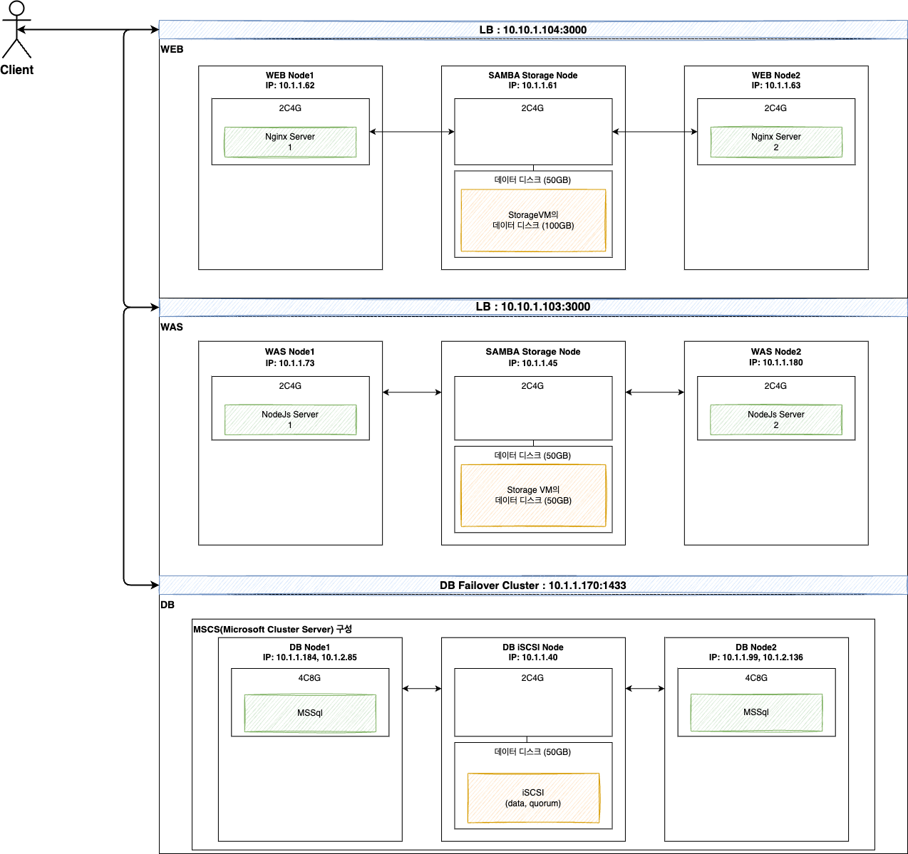

ABLESTACK Mold를 이용해 "이중화를 통한 고가용성 기능을 제공하는 윈도우 기반의 3계층 구조"를 구성하는 방법에 대해 설명합니다. 이를 위해 Isolated 네트워크를 구성하고 WEB, WAS, DB 구성에 필요한 가상머신을 생성한 후 부하분산(LB)를 적용해아합니다.

## 아키텍처

다음 그림은 앞으로 구성할 윈도우 기반의 3계층 구조 전체를 보여줍니다. 아래 예시를 적용한 아키텍처 구성도를 참고하여 구성합니다.

{ width="600" }

## 네트워크 구성 정보

구성에 필요한 네트워크 구성 정보 예시는 다음과 같습니다.

- Isolated 네트워크 : 격리된 네트워크로 단일 계정의 가상머신에서만 액세스할 수 있습니다. 가상머신은 최소 하나의 Isolated 네트워크로 구성되며, DB 가상머신은 통신용과 하트비트용으로 두개의 네트워크가 필요합니다.
    - 네트워크 1
        - CIDR : 10.1.1.0/24
    - 네트워크 2(DB 가상머신 하트비트용)
        - CIDR : 10.1.2.0/24

## 가상머신 구성 정보

가상머신 정보 예시는 다음과 같습니다.

|

|
가상머신
|
IP
|
Offering
|
|:---|:---|:---|:---|
|DB|iSCSI Node|10.1.1.40|2Core 4GB|
||Node1|10.1.1.184, 10.1.2.85|4Core 8GB|
||Node2|10.1.1.99, 10.1.2.136|4Core 8GB|
|WAS|SAMBA Node|10.1.1.45|2Core 4GB|
||Node1|10.1.1.73|2Core 4GB|
||Node2|10.1.1.180|2Core 4GB|
|WEB|SAMBA Node|10.1.1.61|2Core 4GB|
||Node1|10.1.1.62|2Core 4GB|
||Node2|10.1.1.63|2Core 4GB|

## 구성 단계

"이중화를 통한 고가용성 기능을 제공하는 윈도우 기반의 3계층 구조"를 구성하는 단계는 다음과 같습니다.

- 네트워크 구성: Isolated 네트워크를 생성합니다.
- DB 구성: DB 서버의 이중화 구성은 MSCS(Microsoft Cluster Service)를 활용한 Failover Cluster 방식으로 구성합니다.
- WAS 구성: NodeJS와 SAMBA 스토리지를 활용한 WAS 서버를 구성합니다.
- WEB 구성: Nginx와 SAMBA 스토리지를 활용한 WEB 서버를 구성합니다.
