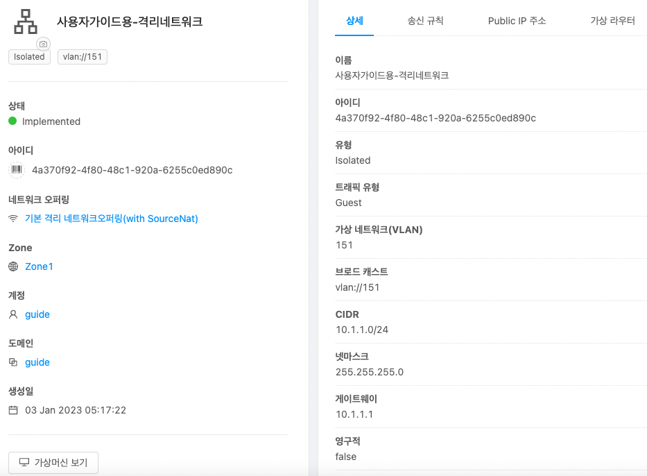

ABLESTACK Mold를 이용한 "이중화를 통한 고가용성 기능을 제공하는 3계층 구조" 구성 단계 중, 첫 번째 단계인 네트워크 구성에 대한 문서입니다.

격리된 가상 네트워크 환경에서 "이중화를 통한 고가용성 기능을 제공하는 윈도우 기반의 3계층 구조"를 구성하기 위해 ABLESTACK Mold를 활용하여 Isolated 네트워크를 생성합니다.

## Isolated 네트워크 생성

Isolated 네트워크는 격리된 네트워크로 단일 계정의 가상 머신에서만 액세스할 수 있습니다. Isolated 네트워크를 생성하기 위해 **네트워크 > 가상머신용 네트워크** 화면으로 이동하여 **네트워크 추가** 버튼을 클릭하여 네트워크를 추가합니다.

네트워크 추가 대화상자에서의 입력 예시는 다음과 같습니다.

- 네트워크 1
    - 이름: **사용자가이드용-격리네트워크**
    - 설명: **사용자가이드용-격리네트워크**
    - Zone: **Zone1**
    - 네트워크 오퍼링: **기본 격리 네트워크오퍼링**
    - 게이트웨이: **10.1.1.1**
    - 넷마스크: **255.255.255.0**

- 네트워크 2(DB 가상머신 하트비트용)
    - 이름: **사용자가이드용-격리네트워크2**
    - 설명: **사용자가이드용-격리네트워크2**
    - Zone: **Zone1**
    - 네트워크 오퍼링: **기본 격리 네트워크오퍼링**
    - 게이트웨이: **10.1.2.1**
    - 넷마스크: **255.255.255.0**

위 예시대로 생성된 네트워크의 정보는 다음과 같습니다.

- 네트워크 1

{ width="600" }

- 네트워크 2(DB 가상머신 하트비트용)

{ width="600" }

