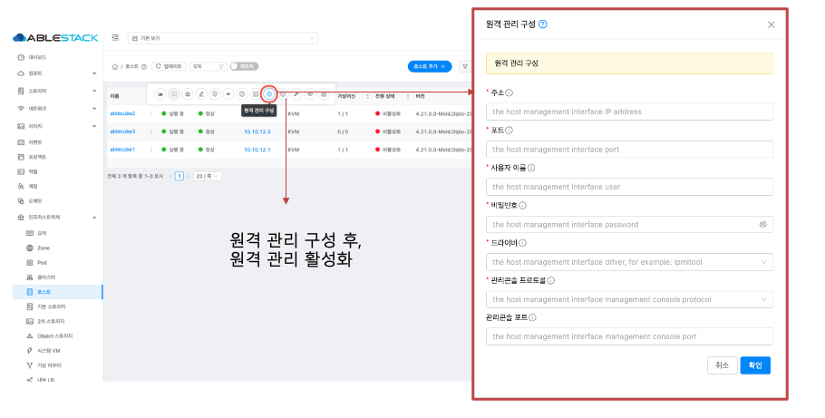

이 문서는 ABLESTACK VM 운영체제 전반에서 관리(Management), 서비스(Service), 게스트(Guest) 등 네트워크의 IP를 체계적으로 변경하는 방법을 안내합니다.

변경 전에는 대상 IP, 서브넷, 게이트웨이, DNS 확정과 영향 서비스 파악, 스냅샷 및 백업 확보, 점검 항목 정의 및 변경 창 예약을 완료합니다.
적용은 관리 노드 -> 서비스 노드 -> 게스트 순으로 NIC 설정, 라우팅 및 방화벽 규칙을 일관되게 갱신하고 필요한 서비스를 안전하게 재기동합니다.

검증 단계에서는 관리 콘솔 접속, 주요 포트 응답, 내부 및 외부 통신 상태(ping, curl), 로그 오류 유무, 모니터링 지표 정상화를 확인합니다.

!!! warning "IP 변경 전 반드시 수행해야 할 주의사항 체크리스트"
    1. HA 비활성화 : 계획된 다운타임 동안 자동 복구나 재시작이 발생하지 않도록 HA를 일시 중지합니다.
    2. 모든 가상머신 정지 : 사용자 VM을 우선 안전 종료합니다.
    3. Zone 비활성화 : 신규 VM 배치와 스케줄러 동작을 막기 위해 대상 Zone을 일시 비활성화합니다.
    4. 시스템 VM 파기 및 정리 : 콘솔, 라우터, 보조 스토리지 등 IP 변경 적용을 위해 시스템 VM을 제거합니다.
    5. 호스트 유지보수 모드 진입 : 각 하이퍼바이저 호스트를 유지보수 모드로 전환해 스케줄링과 마이그레이션을 차단합니다.
    6. CCVM Root 계정 비밀번호 설정/확인 : CCVM 콘솔에서 passwd 명령으로 root 비밀번호를 설정 검증하고 변경 내역을 안전하게 보관합니다. 추후 CCVM에 ssh접속하여 IP 변경을 위한 작업입니다.

    위 절차를 모두 완료한 후, 다음 단계를 진행해 주십시오.

## 클러스터 정지 및 CCVM 정지
!!! warning
    이 작업은 **IP 변경 전 반드시 수행해야 할 주의사항 체크리스트** 를 반드시 완료한 뒤 진행합니다.

1. 펜스 장치 유지보수 설정
    { .imgCenter .imgBorder }
    - Cube 대시보드에서 **펜스 장치 유지보수 설정** 을 클릭하고, 펜스 장치 상태가 **Stopped** 상태인지 확인합니다.

2. 클라우드센터VM 정지
    { .imgCenter .imgBorder }
    - Cube 대시보드에서 **클라우드센터 VM 정지** 를 클릭한 뒤, VM 상태와 클러스터 상태가 정지로 표시되는지 확인합니다.

3. 클러스터 정지
    { .imgCenter .imgBorder }
    - 마스터 호스트 웹 콘솔에서 왼쪽 하단의 **터미널** 을 클릭하여 열고 `pcs cluster stop --all` 명령를 실행합니다.

4. 클러스터 확인
    { .imgCenter .imgBorder }
    - 터미널에서 `pcs status` 를 실행해 위 화면과 동일한 출력이 표시되는지 확인합니다. 동일하면 클러스터 정지가 정상적으로 완료된 것입니다.


## IPMI 및 호스트 IP 변경
!!! check
    모든 호스트의 IPMI(BMC) 관리 IP 및 호스트 관리 IP를 빠짐없이 변경해야 합니다. 작업 중 일시적으로 원격 콘솔이 끊길 수 있으니 새 IP, 서브넷, 게이트웨이, DNS 정보를 사전에 확정한 뒤 진행합니다.

1. IPMI IP 변경
    { .imgCenter .imgBorder }
    - 각 호스트의 IPMI(BMC)에 접속하여 네트워크 설정 화면으로 이동합니다.
    - IP, Subnet Mask, Gateway, DNS 값을 새 정보로 입력하고 저장합니다.
    - 상기 이미지는 예시이며, 제조사 및 펌웨어에 따라 화면 구성과 용어가 다를 수 있습니다.

2. 호스트 IP 변경
    { .imgCenter .imgBorder }
    - IPMI(BMC) 원격 콘솔로 해당 호스트에 접속한 뒤 쉘에 로그인합니다.
    - `nmtui`를 실행하고 **Edit a connect** 에서 관리 NIC(예: "bond0", "bridge0")를 선택합니다.
    - **IPv4 Configuration** 을 **Manual** 로 설정하고 새 **IP/Prefix, Gateway, DNS** 값을 입력 후 저장합니다.
    - **Activate a connection** 메뉴에서 해당 프로파일을 **Deactivate -> Activate** 순서로 적용합니다.
    - 적용 여부를 확인합니다.
    ``` bash
    ip addr show <NIC명>
    ip route
    ping -c 3 <Gateway IP>
    ```

## 클러스터 재설정
!!! check
    IP 및 Fence 장치명은 예시이며, 실제 환경에 맞게 변경합니다. 본 절차는 **마스터 호스트** 에서만 실행합니다.

1. 클러스터 노드 인증
    - 각 노드와의 인증을 설정합니다.
    ``` bash
    # 형식 : pcs host auth {호스트 관리 IP} -u {PCS ID} -p {PCS PW}
    # 해당 PCS ID, PCS PW는 예시에 있는 해당 값이므로 그대로 입력하시면 됩니다.

    pcs host auth 10.10.12.1 -u hacluster -p password
    pcs host auth 10.10.12.2 -u hacluster -p password
    pcs host auth 10.10.12.3 -u hacluster -p password
    ```

2. Corosync 설정(IP 갱신)
    { .imgCenter .imgBorder }
    - `vi /etc/corosync/corosync.conf`를 실행하여 'nodelist'의 'node'의 'rin0_addr' 및 'name' 값을 **새 IP** 로 수정하여 저장합니다.
    - 저장 후 문법 및 오탈자를 재확인하고, 재시작과 검증은 다음 단계에서 수행합니다.

3. 클러스터 검증 및 시작
    - 변경된 노드 IP로 적용되었는지 검증
    ``` bash
    1. pcs cluster sync             # 변경 사항 동기화
    2. pcs cluster start --all      # 클러스터 시작
    3. pcs cluster reload corosync  # Corosync 설정 재적용
    ```
    { .imgCenter .imgBorder }
    - 각 펜스 장치명안의 IP, pcmk_host_list가 변경된 값으로 올바르게 수정되었는지 확인합니다.

4. 펜스 장치 변경
    - 펜스 장치 대수에 맞게 모두 변경하셔야 합니다.
    ``` bash
    # 형식 : pcs stonith update fence-{펜스 장치명} ip={IPMI IP} pcmk_host_list={호스트 관리 IP}

    pcs stonith update fence-ablecube1 ip=10.10.12.251 pcmk_host_list=10.10.12.1
    pcs stonith update fence-ablecube2 ip=10.10.12.252 pcmk_host_list=10.10.12.2
    pcs stonith update fence-ablecube3 ip=10.10.12.253 pcmk_host_list=10.10.12.3

    pcs stonith config      # 전체 STONITH 설정 요약 확인

    pcs resource cleanup    # 클러스터 리소스 상태를 다시 감지합니다.
    ```
    { .imgCenter .imgBorder }
    - 위와 동일한 형태의 출력이 표시되면 정상 동작입니다.

## 클라우드센터VM(CCVM) IP 변경
!!! check
    예시 IP는 실제 환경에 맞게 변경합니다. **CCVM이 실행 중인 호스트에서만** 수행합니다.

1. CCVM 위치 확인 및 콘솔 접속
```
virsh list --all | grep ccvm    # CCVM이 있는 호스트에서 확인
virsh console ccvm              # CCVM 콘솔 접속 ( 종료: Ctrl + ] )
```

2. 루트 로그인
    - **IP 변경 전 반드신 수행해야 할 주의사항 체크리스트** 에서 설정한 CCVM Root 계정으로 로그인합니다.

3. IP 변경
```
nmtui

# Edit a connection -> 관리 NIC 선택
# IPv4 Configuration: Manual -> 새 IP/Prefix, Gateway, DNS 입력 -> Save
# Activate a connection -> 해당 프로파일 Deactivate -> Activate
```

4. 적용 및 검증
```bash
ip addr show
ip route
ping -c 3 <게이트웨이 IP>
```
    - 새 IP로 SSH 접속이 가능한지 확인합니다.

## 호스트 및 클라우드센터VM(CCVM) 파일 변경
!!! check
    예시 IP는 실제 환경에 맞게 변경합니다. 호스트 파일 변경은 모든 호스트 포함입니다.

1. 호스트 파일 변경
```
vi /etc/hosts 파일 변경     # 변경된 IP로 수정
```
```
vi /usr/share/cockpit/ablestack/tools/properties/cluster.json 파일 변경     # 변경된 IP로 수정
1. ccvm ip 변경
2. mngtNic 변경
3. pcsCluster 변경  # 호스트 IP로 변경
4. hosts 변경
5. extenal_timeserver 변경
```

2. CCVM 파일 변경
```
vi /etc/hosts 파일 변경     # 변경된 IP로 수정
```
```
vi /etc/cluster.json 파일 변경     # 변경된 IP로 수정
1. ccvm ip 변경
2. mngtNic 변경
3. pcsCluster 변경  # 호스트 IP로 변경
4. hosts 변경
5. extenal_timeserver 변경
```

## Mold 설정
!!! check
    변경된 IP로 {변경된 CCVM 관리 IP}:8080로 접속합니다.

!!! check
    시스템 VM이 미리 삭제되어 있어야 네트워크 수정이 가능합니다.

!!! warning
    이미지들의 IP는 예시이며, 실제 환경에 맞게 수정하시길 바랍니다.

1. 기존 호스트 삭제
    { .imgCenter .imgBorder }
    - 기존 IP로 존재하던 모든 호스트를 삭제합니다.

2. IP가 변경된 호스트 추가
    { .imgCenter .imgBorder }
    - IP가 변경된 모든 호스트를 다시 추가합니다.

3. 원격 관리 재구성
    { .imgCenter .imgBorder }
    - 모든 호스트 IPMI(BMC)를 변경된 IP로 재구성합니다.

4. Public 네트워크 수정
    1. 웹(Mold) 작업
        { .imgCenter .imgBorder }
        - Zone 메뉴 -> 해당 Zone 클릭 -> 물리 네트워크 탭 -> 해당 물리네트워크 클릭 -> Public 탭 클릭
        - 변경할 IP로 변경 작업 진행합니다.
        - 상기 이미지의 IP는 예시입니다. 실제 환경에 맞게 수정하세요.

    2. 터미널 작업
        ```
        1. ssh ccvm                                     # CCVM SSH 접속
        2. mysql -u root -p cloud     PW:Ablecloud1!    # CCVM DB 접속
        3. Zone의 물리 네트워크의 Management 탭 변경
            1. select * from host_pod_ref;              # 변경할 ID 값 조회
            2. update host_pod_ref set gateway='10.10.0.1' where id=1;  # 변경할 게이트웨이 입력
            3. update host_pod_ref set cidr_size=16 where id=1;         # 변경할 서브넷마스크 입력
            4. update host_pod_ref description='10.10.12.7-10.10.12.8-0-untagged' where id=1;   # 변경할 Pod 사설 IP 주소 입력
            5. update image_store set url='nfs://10.10.12.10/nfs/secondary' where id=1;         # 변경할 CCVM 관리 IP 입력
        ```

5. 글로벌 설정 수정
    1. CCVM Management CIDR 수정
        { .imgCenter .imgBorder }
        - 구성 메뉴 -> 글로벌 설정 메뉴
        - 오른쪽 상단에서 Management.network 입력하여 변경된 CCVM Management CIDR 값으로 변경
    2. CCVM Management IP 수정
        { .imgCenter .imgBorder }
        - 구성 메뉴 -> 글로벌 설정 메뉴
        - 오른쪽 상단에서 Host 입력하여 변경된 CCVM Management IP 값으로 변경

## CCVM DB 파일 수정
!!! warning
    이미지의 IP는 예시이며, 실제 환경에 맞게 수정하시길 바랍니다.

1. CCVM DB 파일 수정
    { .imgCenter .imgBorder }
    ```
    1. ssh ccvm    # CCVM SSH 접속
    2. vi /etc/cloudstack/management/db.properties          # DB 파일 수정
    3. cluster.node.IP -> 변경된 CCVM Management IP 로 변경     # 변경된 CCVM Management IP로 변경
    ```

## 서비스 재시작
1. Mold 서비스 재시작
!!! check
    CCVM에서만 실행하시면 됩니다.
```
1. ssh ccvm     # CCVM SSH 접속
2. systemctl restart mold.service   # Mold 서비스 재시작
```

2. Mold Agent 서비스 재시작
!!! check
    Mold 서비스 재시작 후, Mold 웹이 정상 상태에서 모든 호스트에서 실행하시면 됩니다.
```
1. 호스트 터미널 접속
2. systemctl restart mold-agent.service
```

## 모니터링 재배포
1. 모니터링센터 구성 버튼 활성화
    { .imgCenter .imgBorder }
    ```
    1. vi /usr/share/cockpit/ablestack/tools/properties/ablestack.json
    2. monitoring.wall : true -> false 로 변경
    ```

2. 모니터링센터 구성 - 1
    { .imgCenter .imgBorder }
    - 값을 변경하고 30초 내외로 **모니터링센터 구성** 의 버튼이 활성화 됩니다.
    - 만약 모니터링센터 구성 버튼이 활성화가 안된다면, 웹을 새로고침 해보시길 바랍니다.

3. 모니터링센터 구성 - 2
    { .imgCenter .imgBorder }
    - 변경된 IP 값이 맞는지 확인 후, 다음 버튼으로 구성합니다.

4. 모니터링센터 확인
    - **모니터링센터 대시보드 연결** 버튼을 클릭하여 전반적인 호스트 및 가상머신 클라우드센터 정보를 확인합니다.

!!! success "후속 조치 체크리스트"
    1. 네트워크 검증 : Management, Service, Guest 네트워크에서 게이트웨이, DNS, NTP 통신(ping, nslookup, curl 등)과 라우팅/방화벽 규칙을 확인합니다.
    2. 호스트 복귀 : 각 호스트를 삭제한 후, IP가 변경된 호스트를 추가하여 호스트들의 전반적인 상태를 확인합니다.
    3. Zone 활성화 : 비활성화했던 Zone을 활성화하고, 스케줄러/용량 표기가 정상인지 확인합니다.
    4. 사용자 VM 순차 기동 : 시스템 VM의 상태를 확인한 후, 핵심 인프라(DB -> 미들웨어 -> 웹) 순으로 기동하고 애플리케이션 헬스체크와 외부 접근을 검증합니다.
    5. 모니터링 대시보드 확인 : 경보/지표가 정상 수집되는지 확인합니다.
    6. HA 활성화 : 모든 인프라 및 호스트 등 정상 확인이 되었는지 확인 후, HA를 활성화 합니다.
