!!! info
    ABLESTACK HCI 에서 제공하는 압축/중복제거 볼륨 기능입니다.
    해당기능은 하이퍼바이저가 CELL 또는 KVM 이면서 기본스토리지가 Glue Block 인 경우에 사용가능합니다.
!!! warning
    압축/중복제거 기능은 사용할 경우 이미지의 압축/중복제거를 처리하기 위해  호스트의 CPU 부하가 발생할 수 있습니다.

# 압축/중복제거 볼륨 개요
ABLESTACK Mold를 통해 가상머신을 생성할 때, 선택적으로 압축/중복제거 기능이 활성화된 Root, Data 볼륨을 가상머신의 디스크로 사용할 수 있는 기능을 제공합니다.
압축/중복제거 기능은 스토리지에 대한 인라인 블록 수준 중복 제거, 압축 및 씬 프로비저닝을 제공합니다.

## 압축/중복제거 볼륨 주요 특징

1. 데이터 압축 (Compression)
    - 데이터를 압축하여 더 적은 공간을 차지하게 합니다. 이를 통해 기존의 데이터 크기를 줄여 더 많은 데이터를 저장할 수 있도록 합니다
2. 중복 제거 (Deduplication)
    - 저장된 데이터에서 중복된 데이터를 찾아서 제거합니다. 동일한 데이터를 여러 번 저장하지 않고, 하나의 데이터만 실제로 저장하며 나머지는 참조를 통해 접근하도록 하여 저장 공간을 절약합니다.
3. 씬 프로비저닝 (Thin Provisioning)
    - 씬 프로비저닝을 사용하면, 초기 할당된 스토리지 용량이 실제로 사용되는 용량보다 적게 설정됩니다. 실제 데이터가 기록될 때만 스토리지를 할당하므로, 효율적인 스토리지 관리를 할 수 있습니다.
4. 커널 모드에서 실행
    - 커널 모드에서 실행되므로, 높은 성능을 유지하면서 실시간으로 데이터를 처리할 수 있습니다. 이는 VDO가 커널과 밀접하게 통합되어 있어, 사용자 공간에서의 추가적인 오버헤드 없이 최적화를 실시간으로 처리할 수 있다는 뜻입니다.
5. 효율적인 디스크 공간 사용
    - 디스크 공간을 효율적으로 관리하고, 중복된 데이터를 제거하여 실제로 저장하는 데이터 양을 줄이는 방식으로 시스템의 저장 용량을 확장할 수 있습니다.

압축/중복제거 기능을 사용하기 위해서는 디스크 오퍼링 및 서비스 오퍼링에 압축/중복제거 옵션이 적용되어 있어야 사용할 수 있습니다.

## 압축/중복제거 컴퓨트 오퍼링 생성 방법
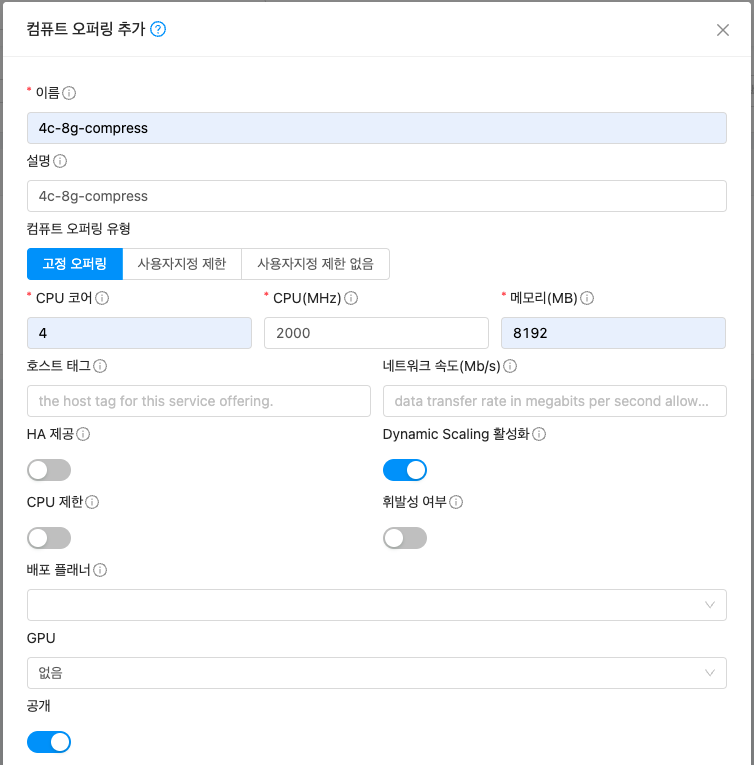{ .imgCenter .imgBorder }
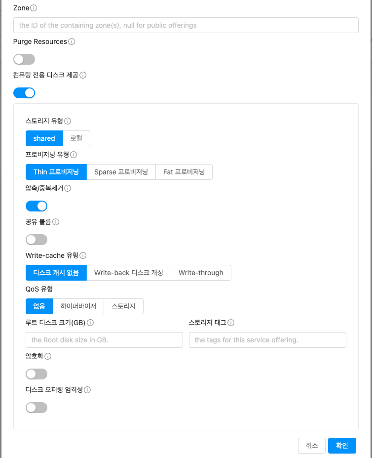{ .imgCenter .imgBorder }

- 서비스 오퍼링 > 컴퓨트 오퍼링 메뉴에서 **컴퓨트 오퍼링 추가** 버튼을 클릭하여 서비스 오퍼링 생성 화면을 볼러온다.
- 오퍼링 생성 방식에 따라 값을 입력한다.
- **압축/중복제거** 옵션을 클릭하여 전용 디스크에 압축/중복제거 기능을 적용한다.
- 확인 버튼을 클릭하여 컴퓨트 오퍼링을 생성한다.

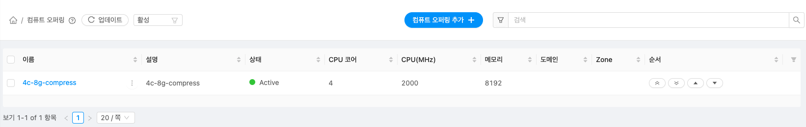{ .imgCenter .imgBorder }

- 생성된 컴퓨트 오퍼링을 확인한다.

## 압축/중복제거 디스크 오퍼링 생성 방법
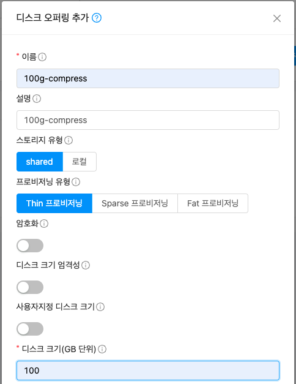{ .imgCenter .imgBorder }
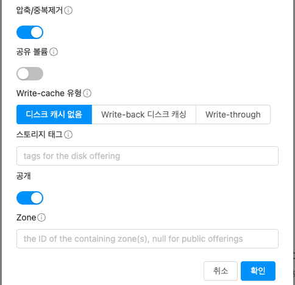{ .imgCenter .imgBorder }

- 서비스 오퍼링 > 디스크 오퍼링 메뉴에서 **디스크 오퍼링 추가** 버튼을 클릭하여 디스크 오퍼링 생성 화면을 볼러온다.
- 오퍼링 생성 방식에 따라 값을 입력한다.
- **압축/중복제거** 옵션을 클릭하여 전용 디스크에 압축/중복제거 기능을 적용한다.
- 확인 버튼을 클릭하여 디스크 오퍼링을 생성한다.

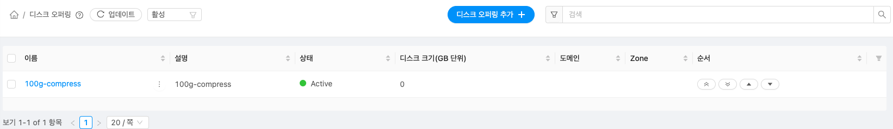{ .imgCenter .imgBorder }

- 생성된 디스크 오퍼링을 확인한다.

## ISO를 통한 압축/중복제거 ROOT 디스크 가상머신 생성
ISO를 이용하여 가상머신을 만들때 압축/중복제거가 적용된 디스크 오퍼링으로 ROOT 디스크를 생성하여 가상머신을 만드는 방법을 확인할 수 있습니다.

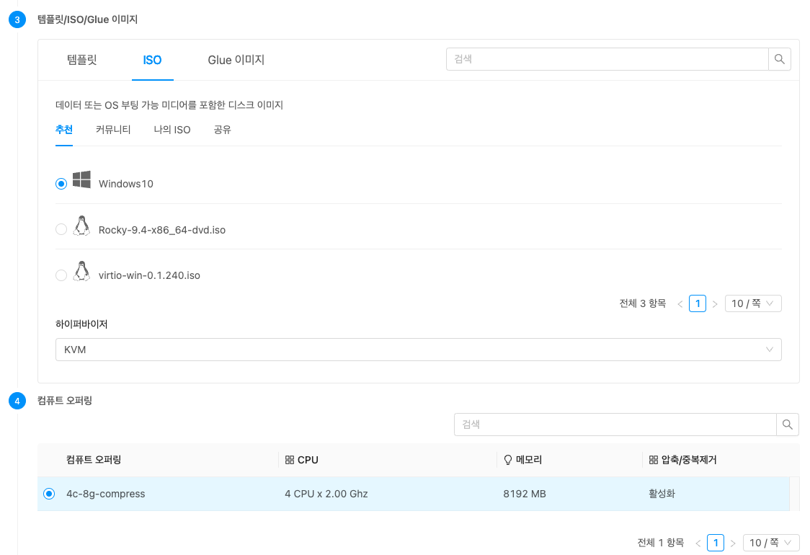{ .imgCenter .imgBorder }
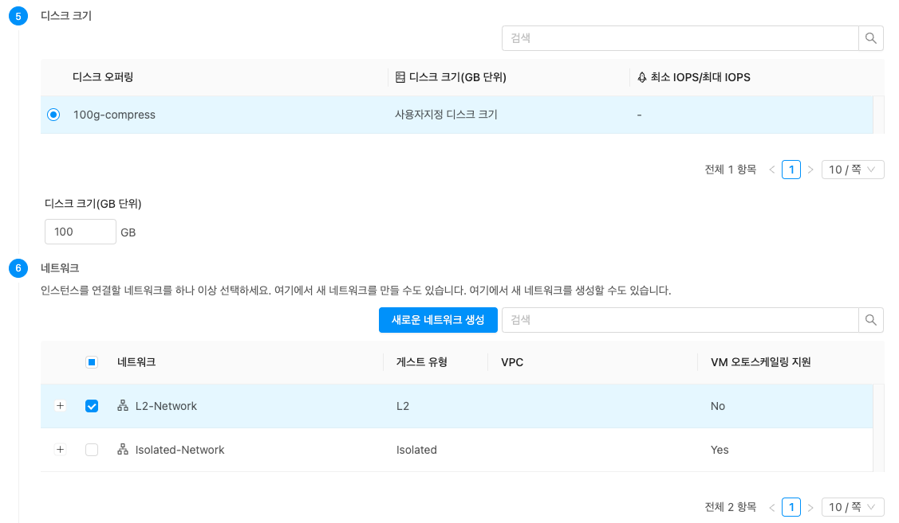{ .imgCenter .imgBorder }
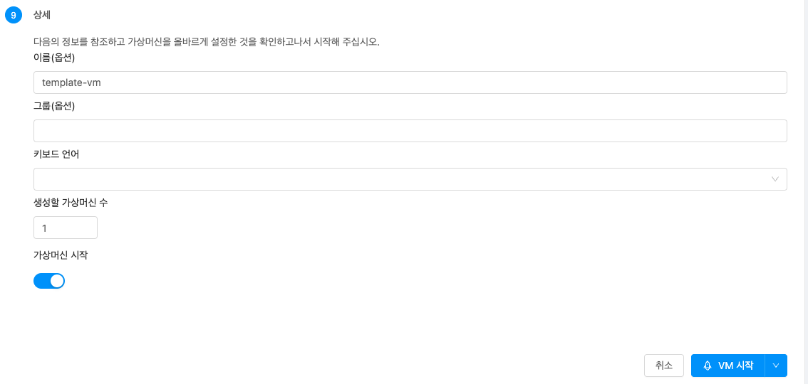{ .imgCenter .imgBorder }

- 컴퓨트 > 가상머신 메뉴에서 **가상머신 추가** 버튼을 클릭하여 가상머신 생성 화면을 볼러온다.
- 가상머신 생성에 따라 필요 값을 입력한다.
- 3 템플릿/ISO/Glue 이미지 탭에서 **ISO** 를 선택한다.
- 설치하고자 하는 ISO를 선택한다.
- 5 디스크 크기 항목에서 압축/중복제거가 적용된 디스크 오퍼링을 선택한다.
- **압축/중복제거** 옵션을 클릭하여 전용 디스크에 압축/중복제거 기능을 적용한다.
- **VM 시작** 버튼을 클릭하여 가상머신을 생성한다.

## 압축/중복제거 VM 템플릿 생성
!!! tip
    ISO를 이용하여 가상머신 만들면 가상머신의 볼륨에 따라 자동적으로 압축/중복제거가 적용된 템플릿으로 생성됩니다.

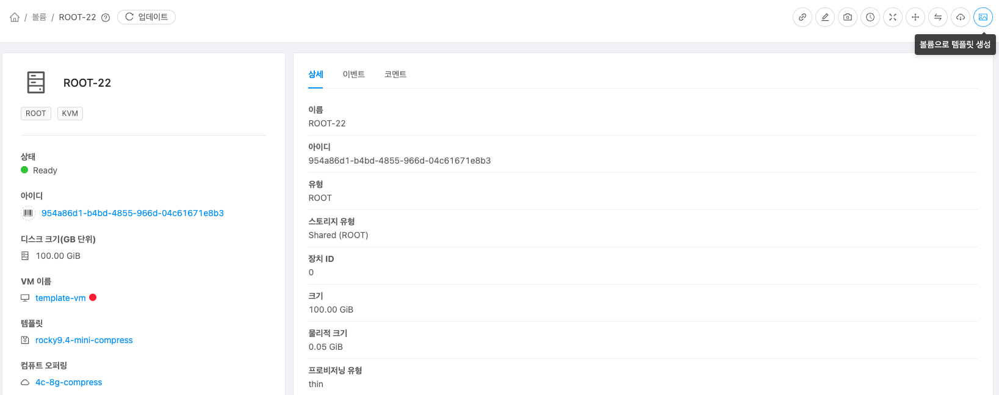{ .imgCenter .imgBorder }

- 스토리지 > 볼륨 메뉴에서 템플릿 생성할 ROOT 디스크를 선택하여 상세 화면으로 이동한다.
- **볼륨으로 템플릿 생성** 버튼을 클릭한다.

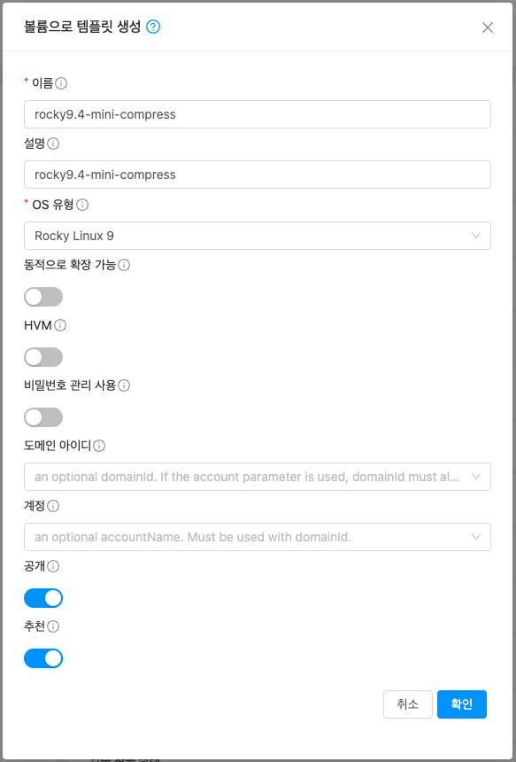{ .imgCenter .imgBorder }

- **이름** 정보를 입력 합니다.
- **설명** 정보를 입력 합니다.
- **OS 유형** 정보를 입력 합니다.
- 템플릿 생성에 따라 필요 값을 입력한다.
- **확인** 버튼을 클릭하여 템플릿을 생성한다.

!!! note
    압축/중복제거가 적용된 볼륨을 템플릿으로 만들면 이미지 파일을 세컨더리에 복제후, ccvm에서 qcow2 또는 raw 타입의 디스크 파일을 qemu-nbd로 마운트하여 pv uuid, vg uuid, vg name 등을 변경한다.

## 템플릿을 통한 압축/중복제거 ROOT 디스크 가상머신 생성
템플릿을 이용하여 가상머신을 만들때 압축/중복제거가 적용된 디스크 오퍼링으로 ROOT 디스크를 생성하여 가상머신을 만드는 방법을 확인할 수 있습니다.

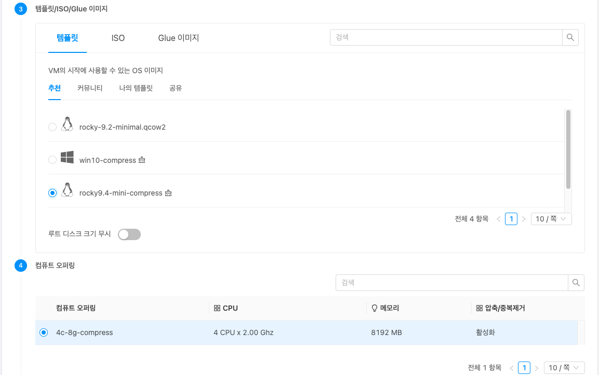{ .imgCenter .imgBorder }

- 컴퓨트 > 가상머신 메뉴에서 **가상머신 추가** 버튼을 클릭하여 가상머신 생성 화면을 볼러온다.
- 가상머신 생성에 따라 필요 값을 입력한다.
- 3 템플릿/ISO/Glue 이미지 탭에서 **템플릿** 를 선택한다.
- 설치하고자 하는 템플릿을 선택한다. ( 압축/중복제거가 설정된 템플릿에는  이미지가 활성화 되어있음. )
- 4 컴퓨트 오퍼링 항목에서 압축/중복제거가 적용된 컴퓨트 오퍼링을 선택한다.
- **VM 시작** 버튼을 클릭하여 가상머신을 생성한다.

## 압축/중복제거 DATA 볼륨 생성
압축/중복제거 적용된 디스크 오퍼링으로 DATA 디스크를 생성할 수 있는 기능을 제공합니다.
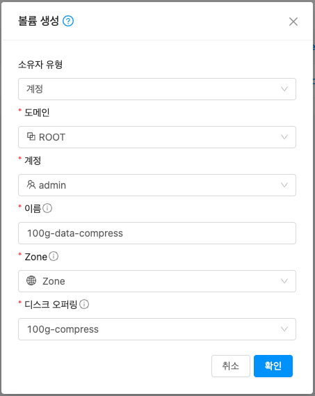{ .imgCenter .imgBorder }

- **이름** 정보를 입력 합니다.
- **디스크 오퍼링** 정보를 압축/중복제거가 적용된 디스크 오퍼링을 입력 합니다.
- **확인** 버튼을 클릭하여 DATA 디스크를 생성한다.

## 압축/중복제거 DATA 볼륨 연결
압축/중복제거 적용된 디스크 오퍼링으로 DATA 디스크를 연결할 수 있는 기능을 제공합니다.
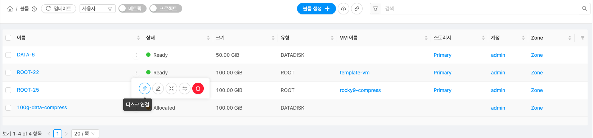{ .imgCenter .imgBorder }

- 스토리지 > 볼륨 메뉴화면에서 연결할 디스크 액션버튼 중 디스크 연결 버튼을 클릭한다.

{ .imgCenter .imgBorder }

- **VM ID** 정보를 입력 합니다.
- 확인 버튼을 클릭하여 디스크를 연결 한다.

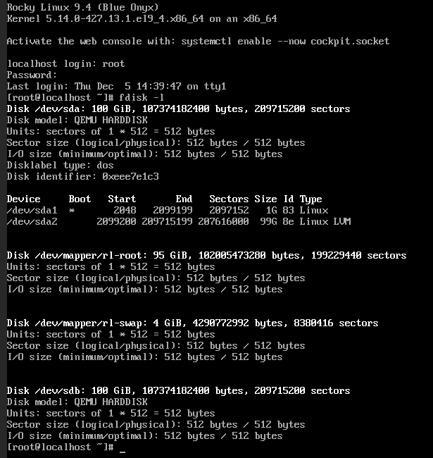{ .imgCenter .imgBorder }

- 압축/중복제거가 적용된 /dev/sdb 100GiB가 적용된 것을 확인할 수 있다.

## 압축/중복제거 DATA 볼륨 해제
압축/중복제거 적용된 디스크 오퍼링으로 DATA 디스크를 해제할 수 있는 기능을 제공합니다.
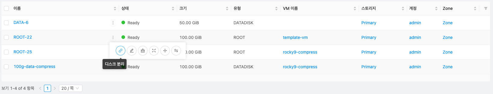{ .imgCenter .imgBorder }

- 스토리지 > 볼륨 메뉴화면에서 해제할 디스크 액션버튼 중 디스크 연결 버튼을 클릭한다.

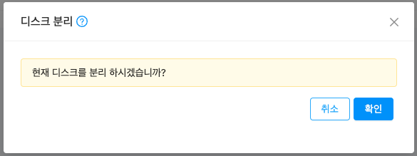{ .imgCenter .imgBorder }

- 확인 버튼을 클릭하여 디스크를 해제 한다.

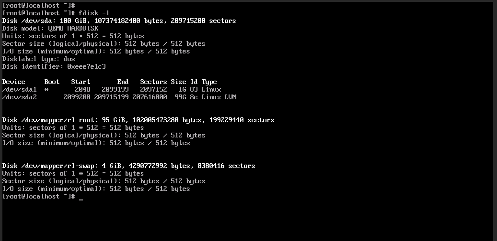{ .imgCenter .imgBorder }

- 압축/중복제거가 적용된 /dev/sdb 100GiB가 해제된 것을 확인할 수 있다.

## 압축/중복제거 볼륨 정보 Mold 확인
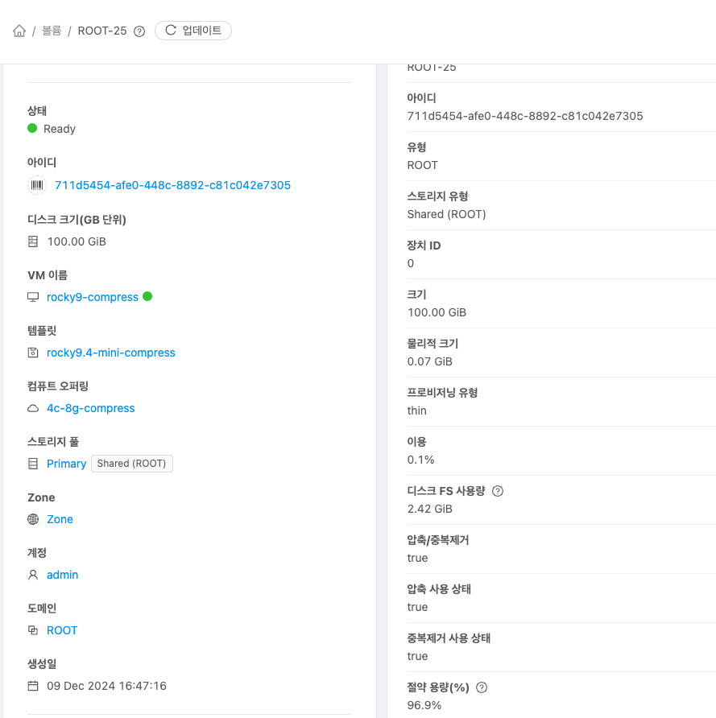{ .imgCenter .imgBorder }

- 스토리지 > 볼륨 메뉴화면에서 정보를 확인할 디스크 이름을 클릭 상세정보를 확인한다.
- **크기** 는 할당한 디스크 크기 입니다.
- **물리적 크기** 는 이미지가 사용중인 크기 입니다.
- **이용** 는 (물리적크기/크기*100) 으로 계산된 이용량 % 입니다.
- **디스크 FS 사용량** 는 가상머신 내부에서 사용중인 파일 시스템 크기 입니다.
- **절약 용량(%)** 는 thin 프로비저닝 또는 압축/중복제거 등으로 절약된 디스크 사용량(%) 입니다.

## 압축/중복제거 볼륨 정보 CLI 확인
ABLECUBE 호스트에서 실행하여 확인 가능합니다.
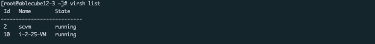{ .imgCenter .imgBorder }

- virsh list로 실행중인 가상머신 확인

{ .imgCenter .imgBorder }

- virsh edit <가상머신 ID> 명령으로 xml 확인

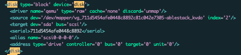{ .imgCenter .imgBorder }

- disk > block > source에 vg_...ablestack_kvdo 확인하여 압축/중복제거 적용된 이미지 여부 확인 가능

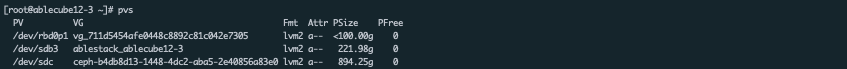{ .imgCenter .imgBorder }

- pvs 목록에 vg_... 로 이름으로 적용된 pv가 있는지 확인

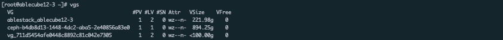{ .imgCenter .imgBorder }

- vgs 목록에 vg_... 이름으로 생성된 vg가 있는지 확인

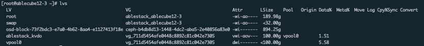{ .imgCenter .imgBorder }

- lvs 목록에 vg_... 이름으로 된 lv가 있는지 확인
