!!! note
    ABLESTACK Glue Service는 호스트가 아닌 Storage Center Virtual Machine(SCVM)에서 제공되고 있습니다.

    접속할 경로는 기존에 구성된 Storage Center Virtual Machine(SCVM) IP로 접속 하시면 됩니다.

# Glue FS 관리
ABLESTACK Glue Service 에서의 Glue FS 관리 하는 가이드 입니다.
이 문서에서는 ABLESTACK Glue File System Service 관리 및 제공되는 기능절차를 가이드 하고 있습니다.
ABLESTACK Cube의 웹콘솔로 진행되며, 웹 접속 IP는 별도의 표시를 하지 않고 진행됩니다.
기존에 구성된 IP 정보에 맞게 웹콘솔을 접속 하시면 됩니다.

## Glue FS 기능 설명
Glue 파일 시스템( GlueFS )은 Glue의 분산 객체 저장소인 RADOS 위에 구축된 POSIX 호환 파일 시스템입니다.
Glue FS는 공유 홈 디렉터리, HPC 스크래치 공간, 분산 워크플로 공유 스토리지와 같은 다양한 애플리케이션을 위한 다용도 고가용성 고성능 파일 저장소를 제공합니다.
Glue File System 마운트는 CUBE HOST 및 SCVM에서만 가능하며 외부 HOST 및 가상머신은 NFS 및 SMB를 이용하여 마운트할 수 있습니다.

GlueFS(Glue File System) Subvolume Group 을 생성, 조회, 절대 경로 가져오기 및 제거할 수 있습니다.
Glue FS의 하위 그룹을 생성하여 효율적으로 GlueFS의 그룹 및 경로(/volumes/볼륨 그룹)를 관리할 수 있습니다.

## Glue FS 메인 화면
{ align=center }
- ABLESTACK 메인 화면에서 상단 GLUE FS 메뉴를 클릭한 화면입니다.

!!! note
    서비스 생성, 수정, 삭제 시에는 약간의 지연이 발생할 수 있으며, 상태 및 최신 정보를 확인하려면 새로고침 버튼을 클릭해 주세요.

## Glue FS 생성

!!! warning
    ABLESTACK Glue File System 서비스는 한 번에 여러 서비스를 사용하는 것보다 하나의 서비스를 선호합니다.

1. Glue FS 구성
    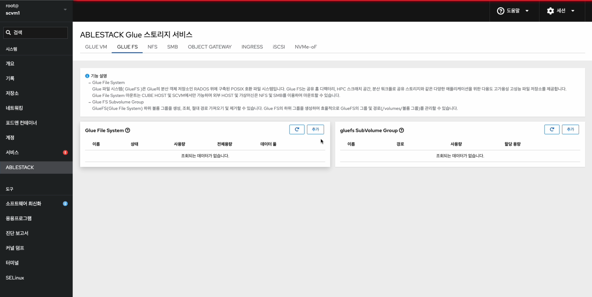{ align=center }
    - Glue File System 카드란에 **추가** 버튼을 클릭합니다.
    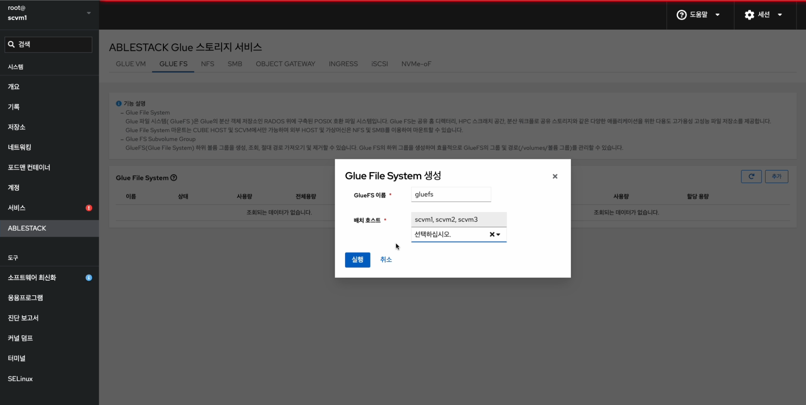{ align=center }
    - **GlueFS 이름** 정보를 입력 합니다.
    - **배치 호스트** 정보를 선택 합니다.
    - 위 항목을 입력 및 확인 후에 **실행** 버튼을 클릭합니다.
    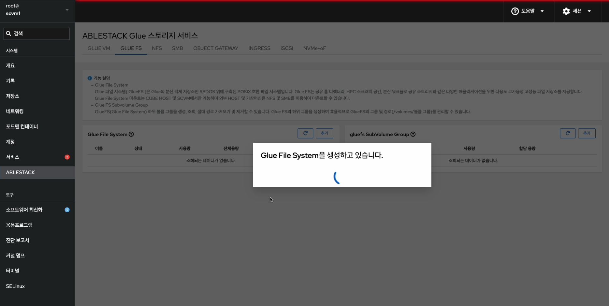{ align=center }
    - Glue FS 서비스가 구성된 화면입니다.

    !!! info
        스토리지 서비스에 등록된 호스트만 배치가 가능합니다.

## Glue FS 삭제

!!! danger
    Glue FS 삭제할 시, 저장 되어 있던 데이터들도 모두 유실됩니다.

    한번 더 확인하시고 삭제하시길 바랍니다.

!!! info
    Glue FS를 삭제하기 전에 먼저 모든 Subvolume Group을 삭제해야 Glue FS도 함께 삭제됩니다.

1. Glue FS 삭제
    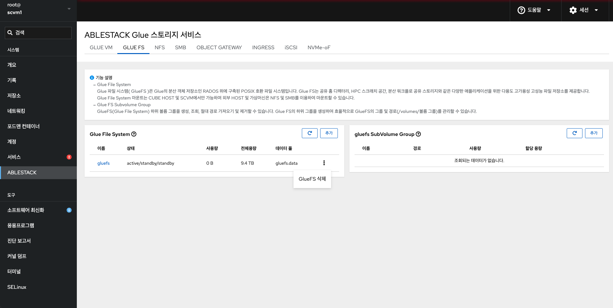{ align=center }
    - Glue File System 각 정보의 더보기란을 클릭하면 보이는 화면입니다.
    - **GlueFS 삭제** 버튼을 클릭 합니다.
    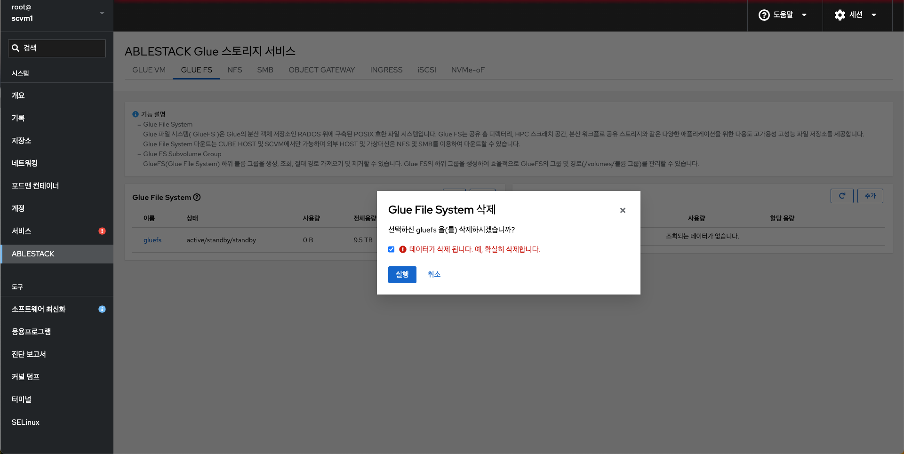{ align=center }
    - **데이터가 삭제됩니다. 예, 확실히 삭제합니다.** 란에 체크를 활성화 합니다.
    - 위 항목들을 입력 및 확인 후에 **실행** 버튼을 클릭합니다.
    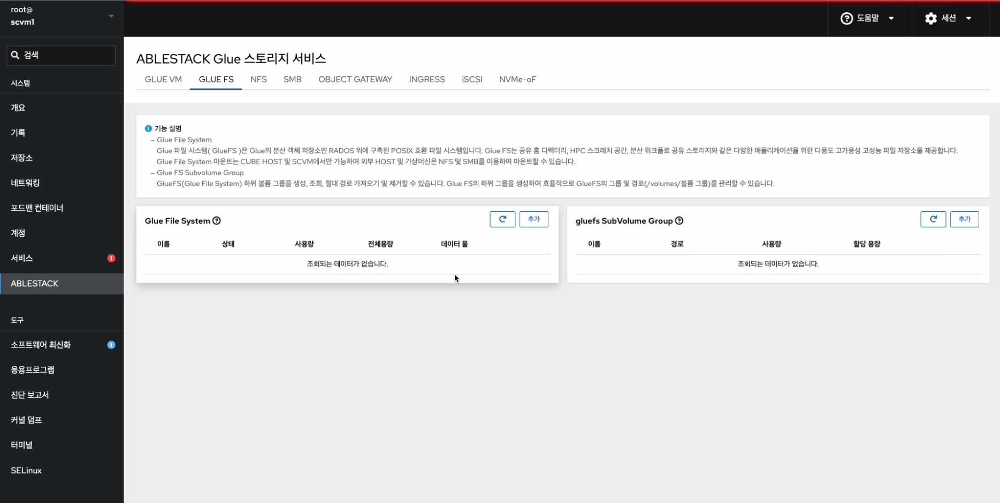{ align=center }
    - 삭제가 된 화면입니다.

## Glue FS Subvolume Group 생성

!!! info
    사용하기 전, Glue FS Service가 사전에 생성되어 있고, active 상태여야 합니다.

1. Glue FS Subvolume Group 생성
    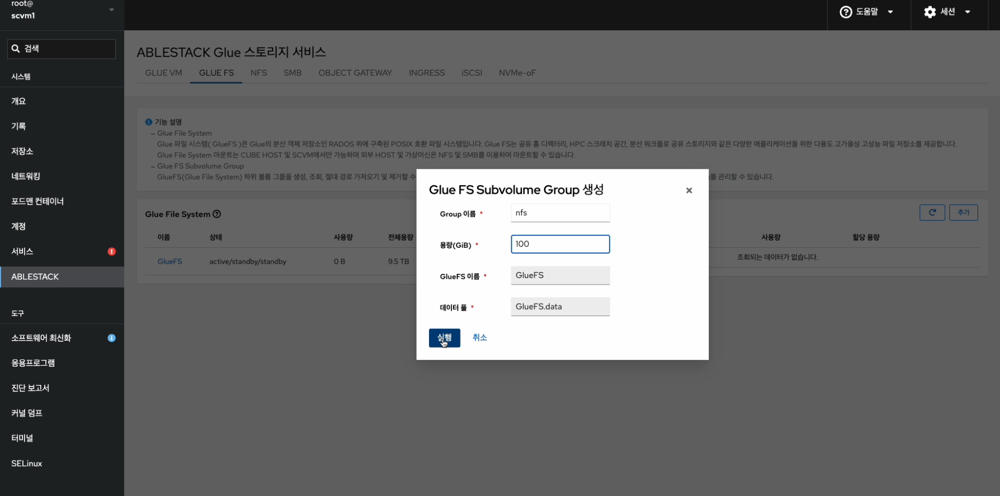{ align=center }
    - **추가** 버튼을 눌러 Subvolume Group 구성 준비를 시작합니다.
    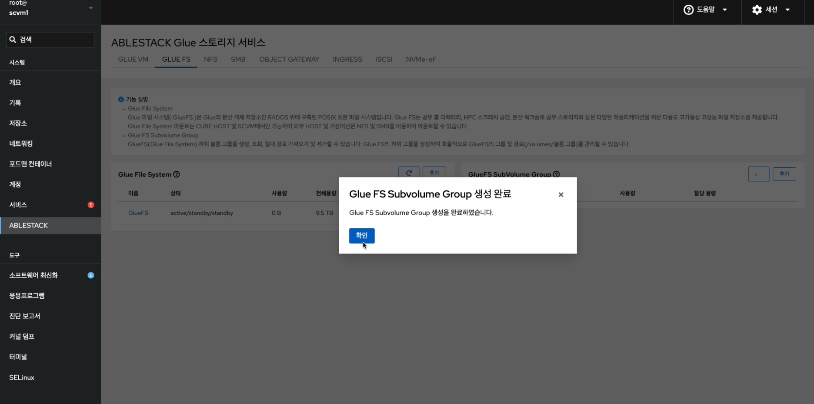{ align=center }
    - **Group 이름** 을 입력합니다.
    - **용량(GiB)** 를 입력합니다.
    - **GlueFS 이름 및 데이터 풀** 을 확인합니다.
    - 위 항목들을 입력 및 확인 후에 **실행** 버튼을 클릭합니다.
    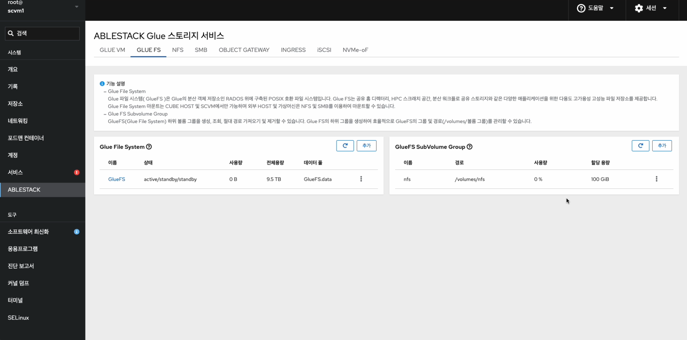{ align=center }
    - Subvolume Group이 생성된 화면입니다.

## Glue FS Subvolume Group 수정

1. Glue FS Subvolume Group 수정
    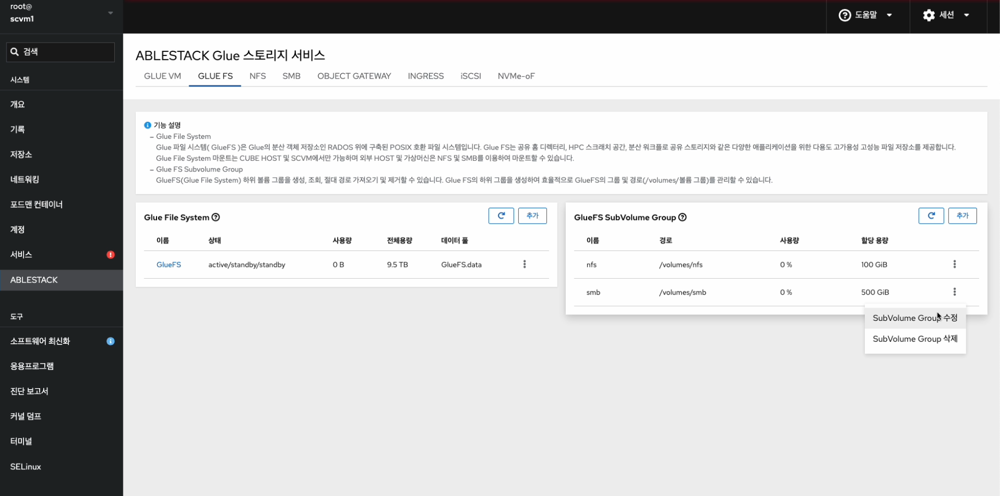{ align=center }
    - Subvolume Group 각 정보의 더보기란을 클릭하면 보이는 화면입니다.
    - **Subvolume Group 수정** 버튼을 눌러 수정 준비를 시작합니다.
    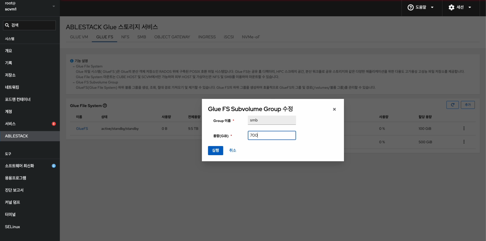{ align=center }
    - **Group 이름** 을 확인합니다.
    - 변경될 **용량(GiB)** 을 입력합니다.
    - 위 항목들을 입력 및 확인 후에 **실행** 버튼을 클릭합니다.
    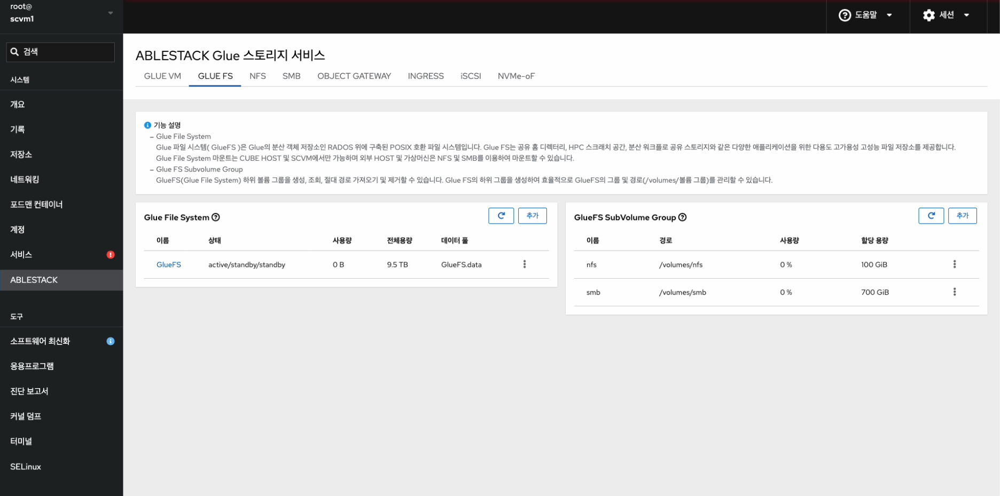{ align=center }
    - Subvolume Group 수정한 화면입니다.

## Glue FS Subvolume Group 삭제

!!! warning
    Subvolume Group을 삭제하면 그 안에 있던 모든 파일과 폴더가 함께 삭제됩니다. 중요한 데이터가 있다면 삭제 전에 반드시 백업해 두세요.

1. Glue FS Subvolume Group 삭제
    { align=center }
    - Subvolume Group 각 정보의 더보기란을 클릭하면 보이는 화면입니다.
    - **Subvolume Group 삭제** 버튼을 눌러 삭제를 시작합니다.
    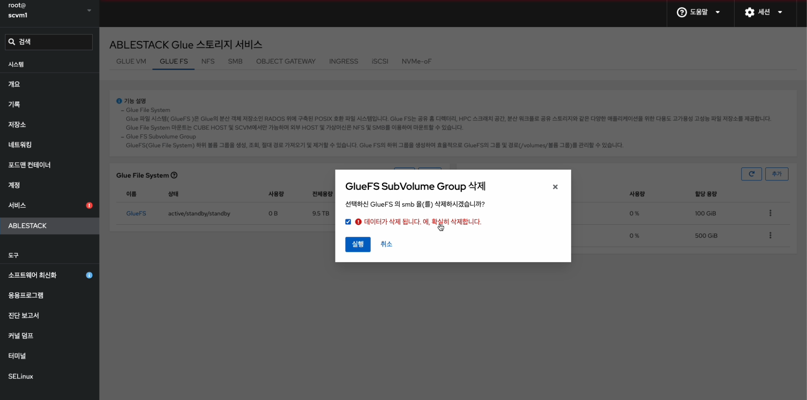{ align=center }
    - **데이터가 삭제됩니다. 예, 확실히 삭제합니다.** 란에 체크를 활성화 합니다.
    - 위 항목들을 입력 및 확인 후에 **실행** 버튼을 클릭합니다.
    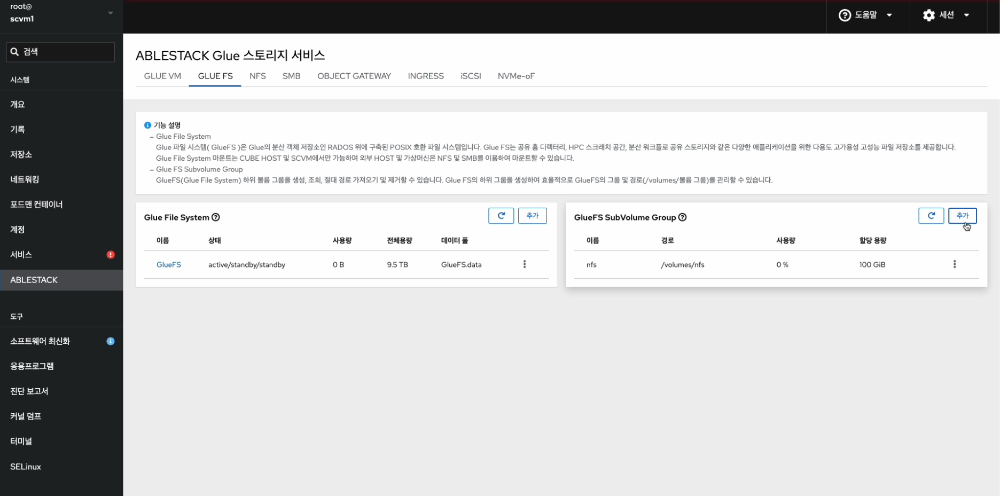{ align=center }
    - 삭제가 완료된 화면입니다.

## Glue FS 실사용 방법

!!! info
    GlueFS Service의 경우 PN으로 통신하는 가상머신만 가능하므로 PN 네트워크를 확인하시고, 작업하시길 바랍니다.

### Glue FS Service 확인 및 Glue FS용 Subvolume Group 확인
1. Glue FS Service 확인 및 Glue FS용 Subvolume Group 확인
    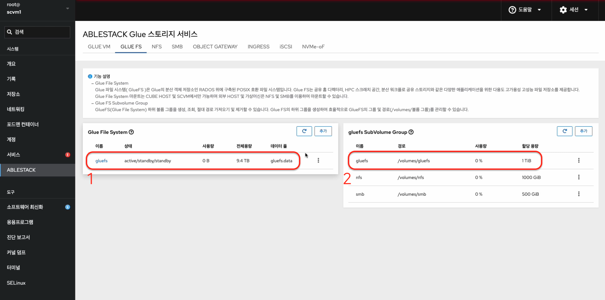{ align=center }
    - Glue FS Service 및 Glue FS Subvolume Group을 확인하는 화면입니다.
    - Glue FS 용 **이름** , **경로** , **할당 용량** 정보를 확인 합니다.

### Storage Center 가상머신 작업
2. Storage Center 가상머신 작업</br></br>
    GlueFS를 사용할 Storage Center 가상머신에 마운트를 위해 아래 절차를 수행합니다.

    gluefs에 마운트를 하기 위한 공유폴더를 생성하고, 적절한 권한을 부여합니다.
    gluefs 공유 폴더 경로 예시는 `/mnt/shared_folder` 입니다.
    ```shell title="공유 폴더 생성 및 적절한 권한 부여"
    mkdir -p /mnt/shared_folder
    chmod -R 777 /mnt/shared_folder
    ```

    gluefs 공유 폴더를 생성한 경로에 마운트를 합니다.
    ```shell title="공유 폴더에 gluefs 마운트 작업"
    mount -t ceph admin@.gluefs=/volumes/gluefs /mnt/gluefs
    ```
    ```shell title="마운트 확인"
    mount | grep /mnt/gluefs
    또는
    df -h | grep /mnt/gluefs
    ```
    fsid = `cat /etc/ceph/ceph.conf`로 확인 가능하며, secret key = `cat /etc/ceph/ceph.client.admin.keyring` 으로 확인 할 수 있습니다.
    ```shell title="재부팅 후 마운트 자동 설정"
    vi /etc/fstab

    admin@{fsid}.gluefs=/volumes/gluefs /mnt/gluefs ceph name=admin,secret={secret key},rw,relatime,seclabel,defaults 0 0
    ```