# 게이트웨이 가상머신 관리 및 기능
ABLESTACK Glue Service 에서의 게이트웨이 가상머신 관리 하는 가이드 입니다.
이 문서에서는 ABLESTACK Glue Gateway 용 가상머신 생성 및 해당 가상머신에서 제공되는 기능절차를 가이드 하고 있습니다.
ABLESTACK Cube의 웹콘솔로 진행되며, 웹 접속 IP는 별도의 표시를 하지 않고 진행됩니다.
기존에 구성된 IP 정보에 맞게 웹콘솔을 접속 하시면 됩니다.

!!! note
    ABLESTACK Glue Service는 호스트가 아닌 Storage Center Virtual Machine(SCVM)에서 제공되고 있습니다.

    접속할 경로는 기존에 구성된 Storage Center Virtual Machine(SCVM) IP로 접속 하시면 됩니다.

## Storage Center VM ABLESTACK 기능 설명
스토리지 서비스 게이트웨이 전용 가상머신이며, 선택적으로 해당 가상머신을 구성하여 사용할 수 있습니다

## Storage Center VM ABLESTACK 메인 화면
{ .imgCenter .imgBorder }
- 왼쪽 ABLESTACK 메뉴 클릭시 보이는 화면입니다.

## 게이트웨이 가상머신 생성

1. 개요
    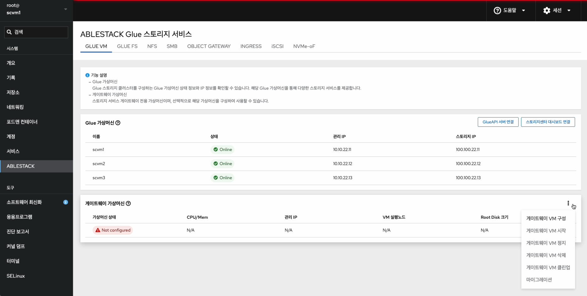{ .imgCenter .imgBorder }
    - 하단 게이트웨이 가상머신의 더보기란을 클릭하면 보이는 화면입니다.
    - **게이트웨이 VM 구성** 버튼을 눌러 게이트웨이 가상머신 구성 준비를 시작합니다.

2. 게이트웨이 가상머신 구성
    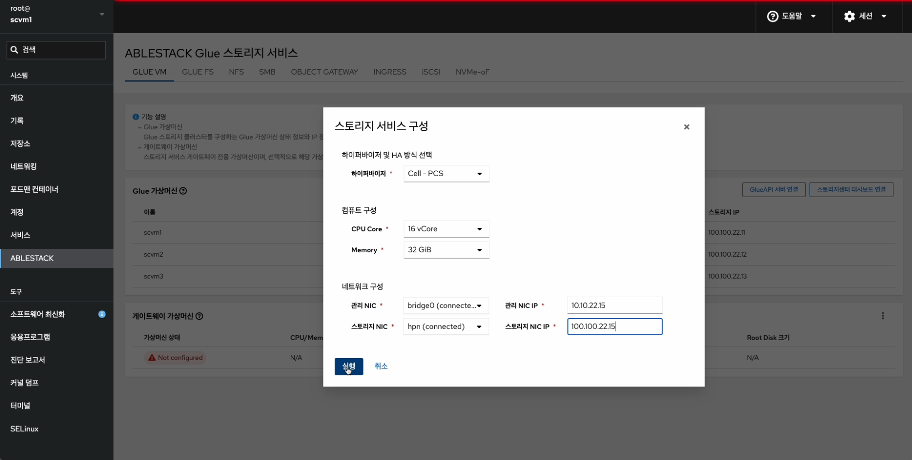{ .imgCenter .imgBorder }
    - **하이퍼바이저** 정보를 선택 합니다.
    - **CPU Core** 정보를 선택 합니다.
    - **Memory** 정보를 선택 합니다.
    - **관리 NIC** 정보를 선택 합니다.
    - **관리 NIC IP** 정보를 입력 합니다.
    - **스토리지 NIC** 정보를 선택 합니다.
    - **스토리지 NIC IP** 정보를 입력 합니다.
    - 위 항목을 입력 및 확인 후에 **실행** 버튼을 클릭 합니다.

    !!! info
        현재 버전에서 하이퍼바이저는 KVM만 지원합니다.

3. 게이트웨이 가상머신 구성 진행
    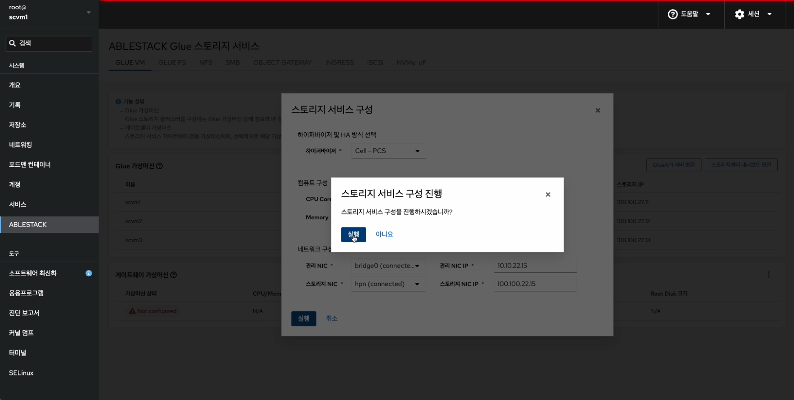{ .imgCenter .imgBorder }
    - 위 항목들을 입력 및 확인 후에 **실행** 버튼을 클릭 합니다.
    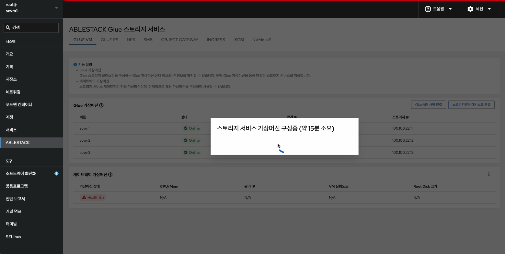{ .imgCenter .imgBorder }
    - 진행 중인 화면입니다.

4. 게이트웨이 가상머신 구성 완료
    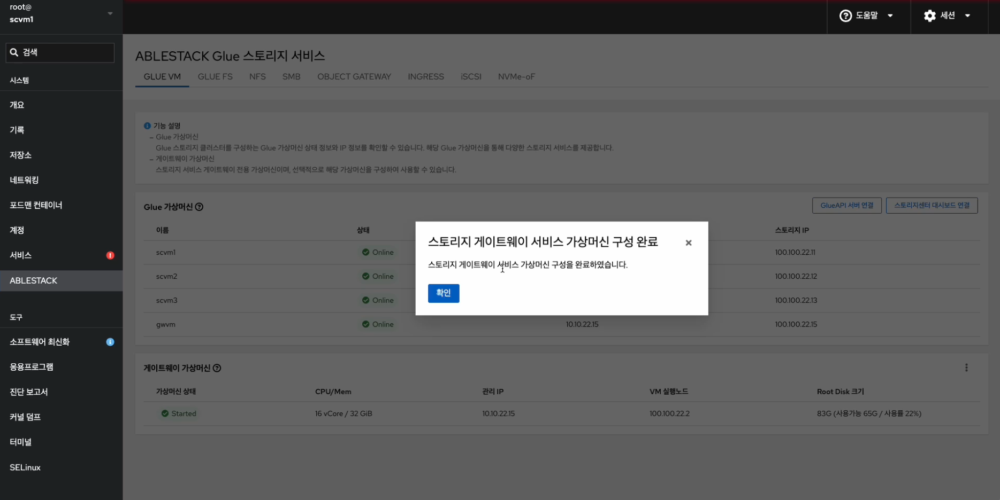{ .imgCenter .imgBorder }
    - **확인** 버튼을 클릭합니다.
     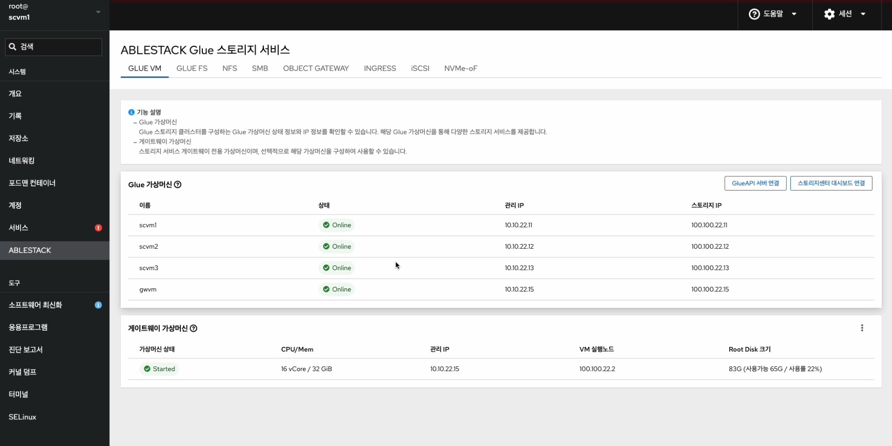{ .imgCenter .imgBorder }
    - 게이트웨이 가상머신이 구성된 화면입니다.

## 게이트웨이 가상머신 삭제

1. 게이트웨이 가상머신 정지
    { .imgCenter .imgBorder }
    - 하단 게이트웨이 가상머신의 더보기란을 클릭하면 보이는 화면입니다.
    - **게이트웨이 VM 정지** 버튼을 눌러 게이트웨이 가상머신을 정지합니다.
    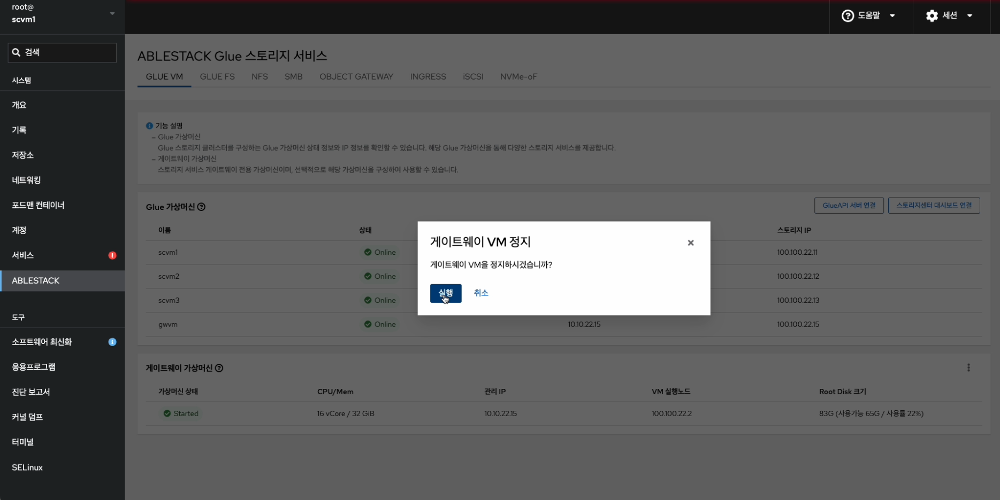{ .imgCenter .imgBorder }
    - 위 항목들을 입력 및 확인 후에 **실행** 버튼을 클릭합니다.
    { .imgCenter .imgBorder }
    - 게이트웨이 가상머신이 정지된 화면입니다.

2. 게이트웨이 가상머신 삭제
    { .imgCenter .imgBorder }
    - 하단 게이트웨이 가상머신의 더보기란을 클릭하면 보이는 화면입니다.
    - **게이트웨이 VM 삭제** 버튼을 눌러 게이트웨이 가상머신을 삭제합니다.
    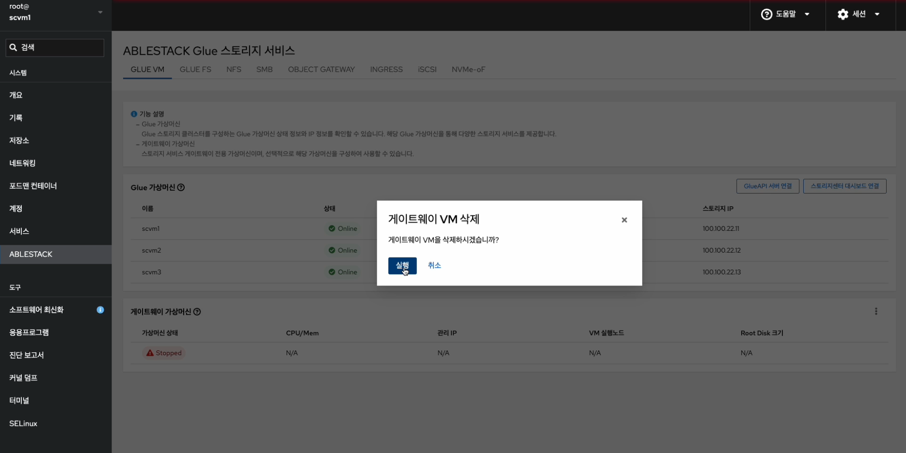{ .imgCenter .imgBorder }
    - 위 항목들을 입력 및 확인 후에 **실행** 버튼을 클릭합니다.

3. 게이트웨이 가상머신 삭제 완료
    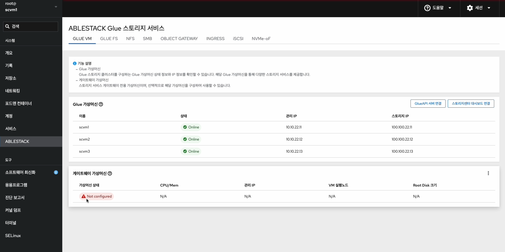{ .imgCenter .imgBorder }
   - 게이트웨이 가상머신이 구성된 화면입니다.

## 게이트웨이 가상머신 마이그레이션

!!! info
    클라우드 센터 가상머신과 동일한 마이그레이션 기능을 게이트웨이 가상머신에서도 제공합니다.

1. 게이트웨이 가상머신 마이그레이션
    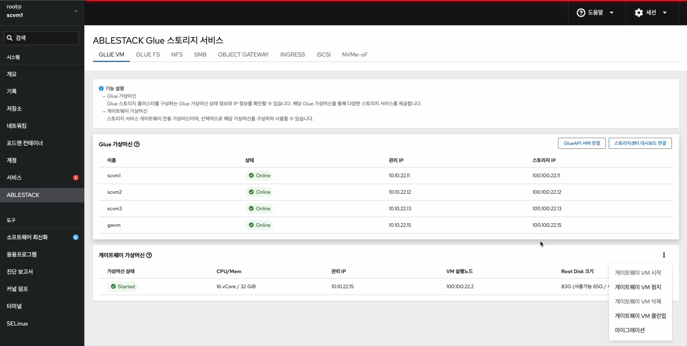{ .imgCenter .imgBorder }
    - 하단 게이트웨이 가상머신의 더보기란을 클릭하면 보이는 화면입니다.
    - **마이그레이션** 버튼을 눌러 마이그레이션 구성 준비를 시작합니다.
    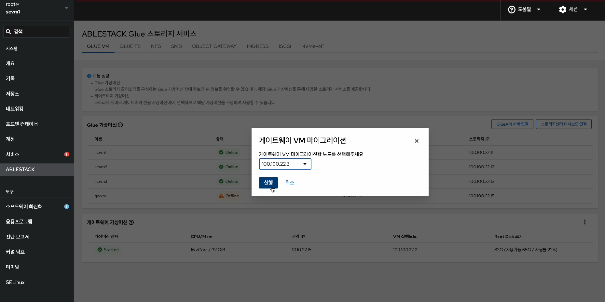{ .imgCenter .imgBorder }
    - 게이트웨이 가상머신을 마이그레이션 할 노드를 선택합니다.
    - 위 항목들을 입력 및 확인 후에 **실행** 버튼을 클릭합니다.
    { .imgCenter .imgBorder }
    - 게이트웨이 가상머신이 마이그레이션 된 화면입니다.

## 게이트웨이 가상머신 클린업

!!! info
    클라우드 센터 가상머신과 동일한 클린업 기능을 게이트웨이 가상머신에서도 제공합니다.

1. 게이트웨이 가상머신 클린업
    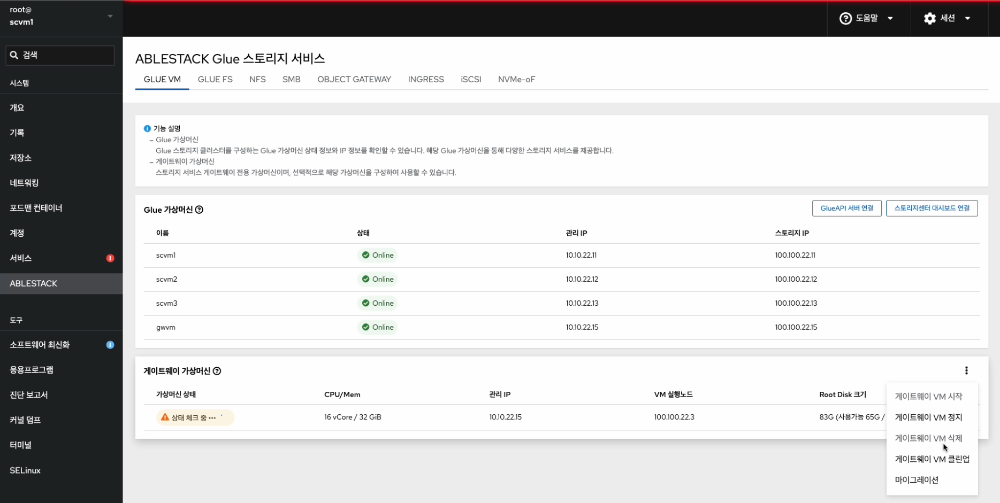{ .imgCenter .imgBorder }
    - 하단 게이트웨이 가상머신의 더보기란을 클릭하면 보이는 화면입니다.
    - **게이트웨이 VM 클린업** 버튼을 눌러 클린업 준비를 시작합니다.
    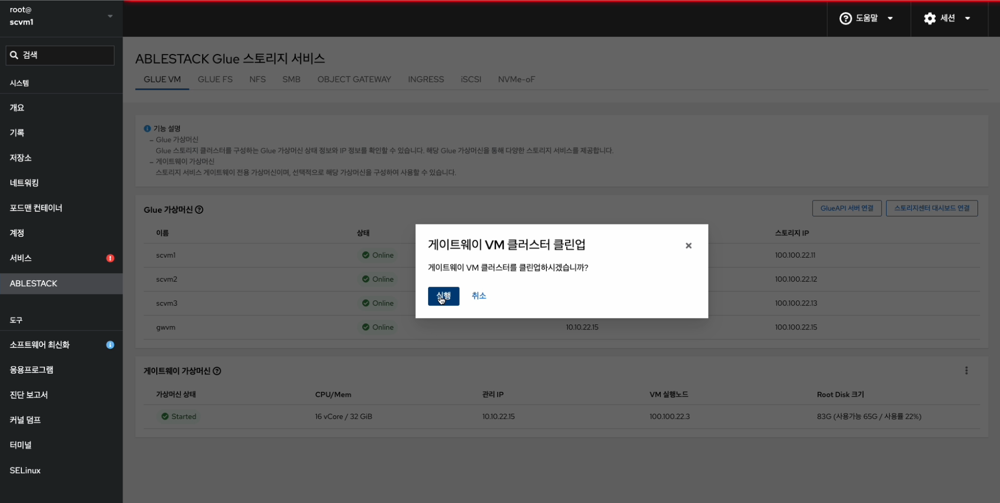{ .imgCenter .imgBorder }
    - 위 항목들을 입력 및 확인 후에 **실행** 버튼을 클릭합니다.
