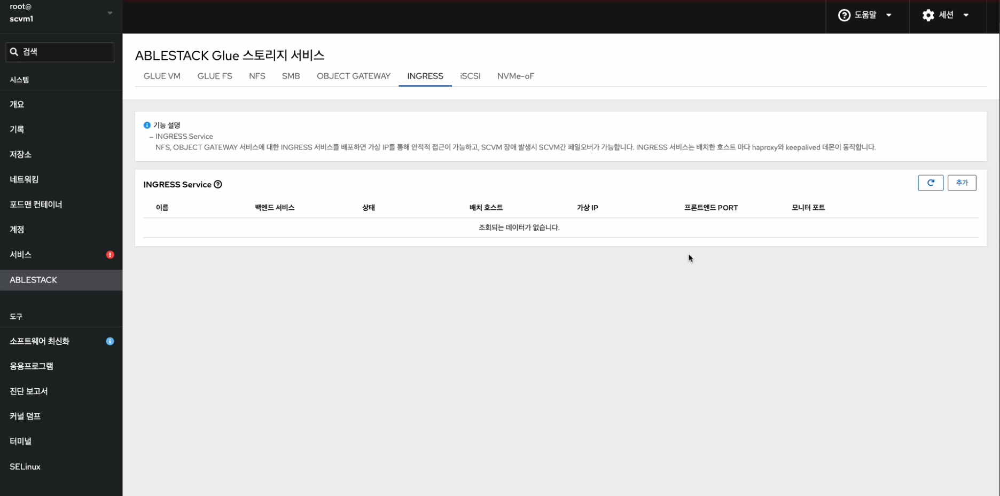
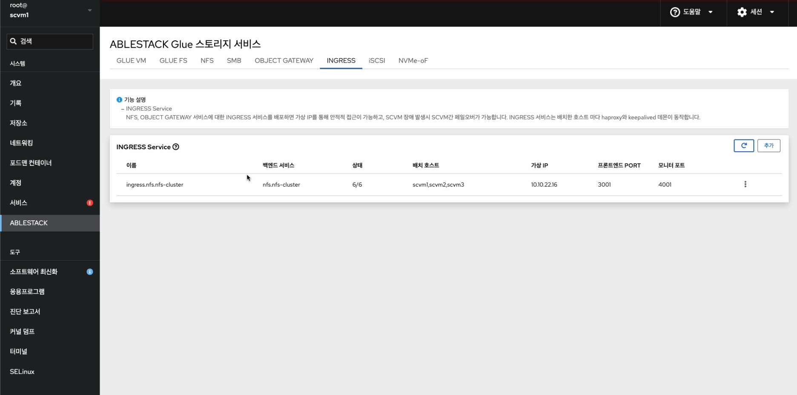
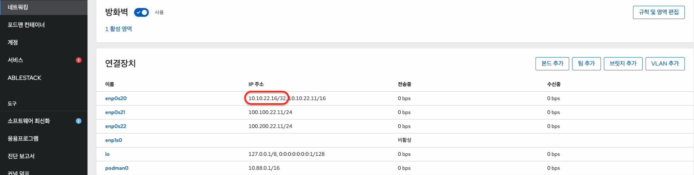
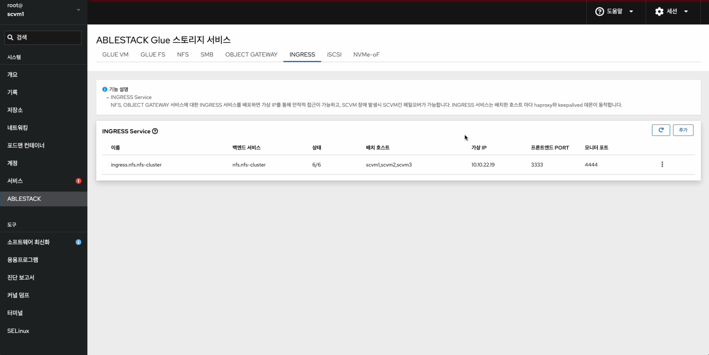
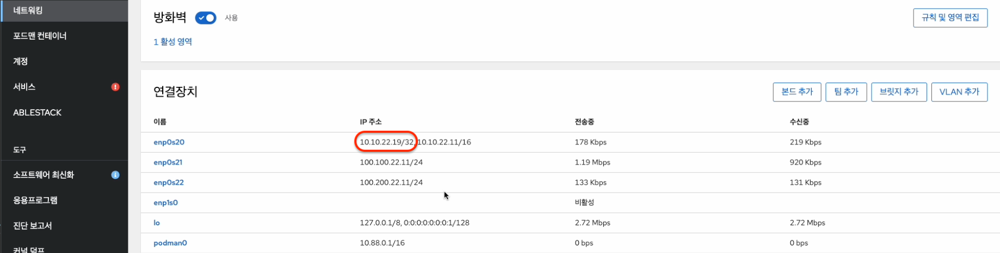
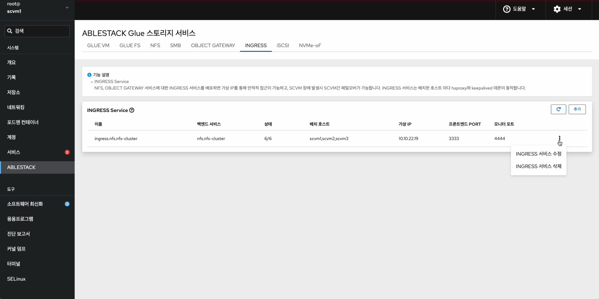
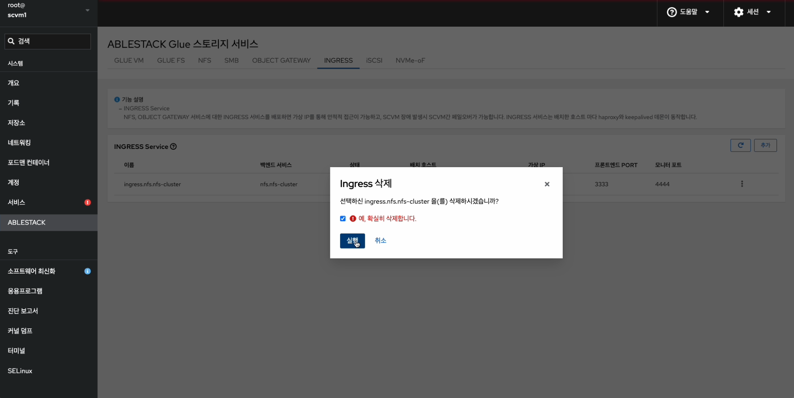
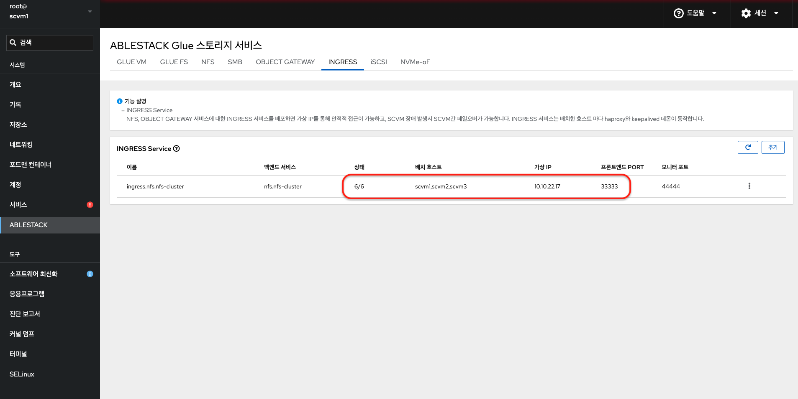
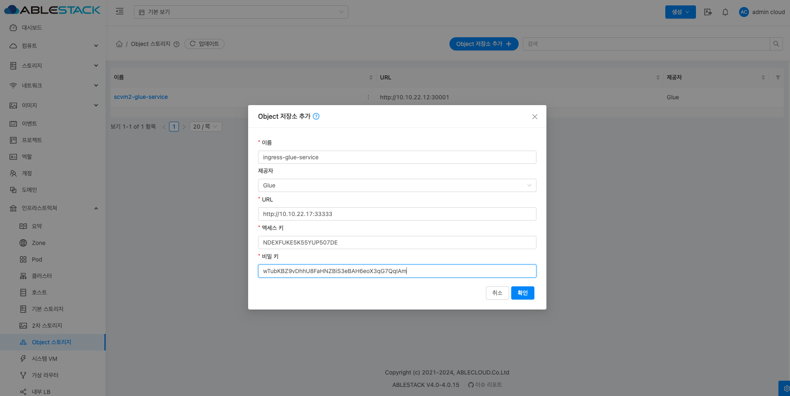
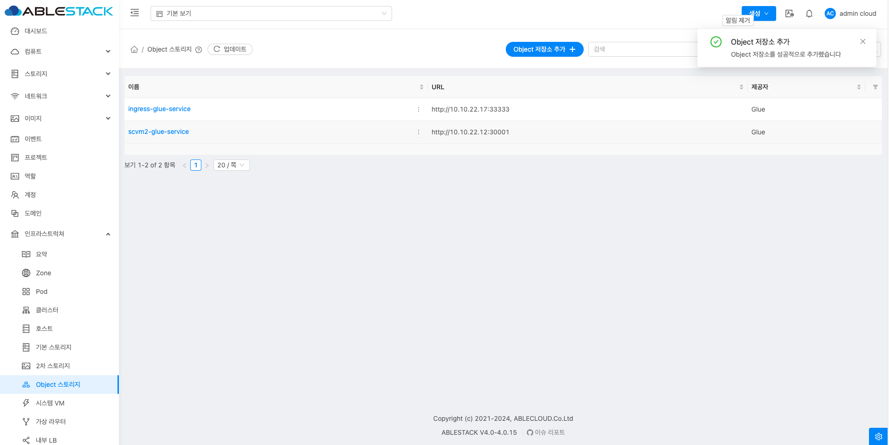

!!! note
    ABLESTACK Glue Service는 호스트가 아닌 Storage Center Virtual Machine(SCVM)에서 제공되고 있습니다.

    접속할 경로는 기존에 구성된 Storage Center Virtual Machine(SCVM) IP로 접속 하시면 됩니다.

# Glue Ingress 관리
ABLESTACK Glue Service 에서의 Glue Ingress를 관리 하는 가이드 입니다.
이 문서에서는 ABLESTACK Glue Ingress 관리 및 제공되는 기능절차를 가이드 하고 있습니다.
ABLESTACK Cube의 웹콘솔로 진행되며, 웹 접속 IP는 별도의 표시를 하지 않고 진행됩니다.
기존에 구성된 IP 정보에 맞게 웹콘솔을 접속 하시면 됩니다.

## Glue Ingress 기능 설명
NFS, OBJECT GATEWAY 서비스에 대한 INGRESS 서비스를 배포하면 가상 IP를 통해 안정적 접근이 가능하고, SCVM 장애 발생시 SCVM간 페일오버가 가능합니다. INGRESS 서비스는 배치한 호스트 마다 haproxy와 keepalived 데몬이 동작합니다.

## Glue Ingress 서비스 메인 화면
{ align=center }
- ABLESTACK 메인 화면에서 상단 Ingress 메뉴를 클릭한 화면입니다.

!!! note
    서비스 생성, 수정, 삭제 시에는 약간의 지연이 발생할 수 있으며, 상태 및 최신 정보를 확인하려면 새로고침 버튼을 클릭해 주세요.

## Glue Ingress 서비스 생성

!!! warning
    ABLESTACK Glue Ingress 서비스는 한 번에 여러 서비스를 사용하는 것보다 하나의 서비스를 선호합니다.

!!! info
    ABLESTACK Glue Ingress 서비스를 사용하려면 먼저 NFS 및 Object Gateway 서비스를 생성해야 합니다. NFS와 Object Gateway 서비스를 생성한 후, Ingress 서비스를 생성할 수 있습니다.

!!! note
    ABELSTACK Glue Ingress 서비스 생성 시, 배치 호스트는 최소 2개의 가상머신이 필요합니다.

1. Glue Ingress 서비스 생성
    { align=center }
    - Glue Ingress 서비스 카드란에 **추가** 버튼을 클릭합니다.
    { align=center }
    - **백엔드 이름** 정보를 선택 합니다.
    - **배치 호스트** 정보를 선택 합니다.
    - **가상 IP** 정보를 입력 합니다.
    - **프론트엔드 PORT** 정보를 입력 합니다.
    - **모니터 PORT** 정보를 입력합니다.
    - 위 항목을 입력 및 확인 후에 **실행** 버튼을 클릭 합니다.
    { align=center }
    - Glue Ingress 서비스가 구성된 화면입니다.
    { align=center }
    - 전체 왼쪽 메뉴에서 **네트워킹** 탭을 클릭 합니다.
    - Glue Ingress 입력한 **가상 IP** 를 확인 합니다.
    !!! info
        스토리지 서비스에 등록된 호스트만 배치가 가능합니다.

## Glue Ingress 서비스 수정

1. Glue Ingress 서비스 수정
    { align=center }
    - Glue Ingress 각 정보의 더보기란을 클릭하면 보이는 화면입니다.
    - **Ingress 서비스 수정** 버튼을 클릭합니다.
    { align=center }
    - **백엔드 이름** 정보를 확인 합니다.
    - 변경될 **배치 호스트** 정보를 선택 합니다.
    - 변경될 **가상 IP** 정보를 입력 합니다.
    - 변경될 **프론트엔드 PORT** 정보를 입력 합니다.
    - 변경될 **모니터 PORT** 정보를 입력 합니다.
    - 위 항목을 입력 및 확인 후에 **실행** 버튼을 클릭 합니다.
    { align=center }
    - 수정된 화면입니다.
    { align=center }
    - 변경된 **가상 IP** 를 확인 합니다.

## Glue Ingress 서비스 삭제

1. Glue Ingress 서비스 삭제
    { align=center }
    - Glue Ingress 각 정보의 더보기란을 클릭하면 보이는 화면입니다.
    - **Ingress 서비스 삭제** 버튼을 클릭 합니다.
    { align=center }
    - **예, 확실히 삭제합니다.** 체크를 활성화 합니다.
    - 위 항목들을 입력 및 확인 후에 **실행** 버튼을 클릭합니다.
    { align=center }
    - 삭제가 된 화면입니다.

## Glue Ingress 실사용 방법

### Glue Ingress Service 확인
1. Glue Ingress Service 확인
    { align=center }
    - Glue Ingress Service을 확인하는 화면입니다.
    - Glue Ingress **상태** , **가상 IP** , **프론트엔드 PORT** 정보를 확인 합니다.

### Glue NFS Service 사용 시, 가상머신 작업
2. Glue NFS Service 사용 시, 가상머신 작업</br>
    - 선행 작업으로 [Glue NFS 실사용 방법](./nfs-manage-feature.md/#glue-nfs_3) 한 후 마지막 마운트 부분에서 아래 부분을 적용해 주세요.
    ```shell title="Ingress 서비스를 이용한 마운트 작업"
    해당 IP는 Ingress Service의 가상 IP 입니다.

    mount -t nfs 10.10.22.17=/export /mnt/nfs

    PORT가 변경 될 시

    mount -t nfs -o port=33333 10.10.22.17=/export /mnt/nfs

    ```

### Glue Object Gateway Service 사용 시, ABLESTACK Mold 작업
3. Glue Object Gateway Service 사용 시, ABLESTACK Mold 작업</br>
    { align=center }
    - **이름** : 스토리지 저장소를 사용하기 위한 이름 입력 합니다.
    - **제공자** : **Glue** 제공자를 선택 합니다.
    - **URL** : Glue Ingress Service IP명과 프론트엔드 PORT를 확인한 것을 입력 합니다.
    - **엑세스 키** : Glue Object Service에서 사용할 사용자의 S3키를 조회하여 액세스 키를 복사하여 입력 합니다. ([사용자 S3 키 조회 방법](./rgw-manage-feature.md/#glue-object-gateway-user-s3))
    - **비밀 키** : Glue Object Service에서 사용할 사용자의 S3키를 조회하여 비밀 키를 복사하여 입력 합니다.
    - 위 항목들을 입력 및 확인 후에 **확인** 버튼을 클릭합니다.
    { align=center }
    - Ingress를 이용한 스토리지 저장소를 생성한 화면입니다.
    - 그 후 생성하는 방법 [ABLESTACK Mold 작업](./rgw-manage-feature.md/#ablestack-mold) 클릭 합니다.
