!!! note
    ABLESTACK Glue Service는 호스트가 아닌 Storage Center Virtual Machine(SCVM)에서 제공되고 있습니다.

    접속할 경로는 기존에 구성된 Storage Center Virtual Machine(SCVM) IP로 접속 하시면 됩니다.

# Glue iSCSI 관리
ABLESTACK Glue Service 에서의 Glue iSCSI 관리 하는 가이드 입니다.
이 문서에서는 ABLESTACK Glue iSCSI 관리 및 제공되는 기능절차를 가이드 하고 있습니다.
ABLESTACK Cube의 웹콘솔로 진행되며, 웹 접속 IP는 별도의 표시를 하지 않고 진행됩니다.
기존에 구성된 IP 정보에 맞게 웹콘솔을 접속 하시면 됩니다.

## Glue iSCSI 기능 설명
iSCSI 게이트웨이 서비스는 RBD(RADOS 블록 장치) 이미지를 SCSI 디스크로 내보내는 HA(고가용성) iSCSI Target을 제공합니다.
iSCSI 프로토콜을 사용하면 클라이언트(이니시에이터)가 TCP/IP 네트워크를 통해 스토리지 장치(대상)에 SCSI 명령을 보낼 수 있으므로 클라이언트가 Glue 블록 스토리지에 액세스할 수 있습니다.
iSCSI Target을 생성하고 관리할 수 있습니다.

## Glue iSCSI 메인 화면
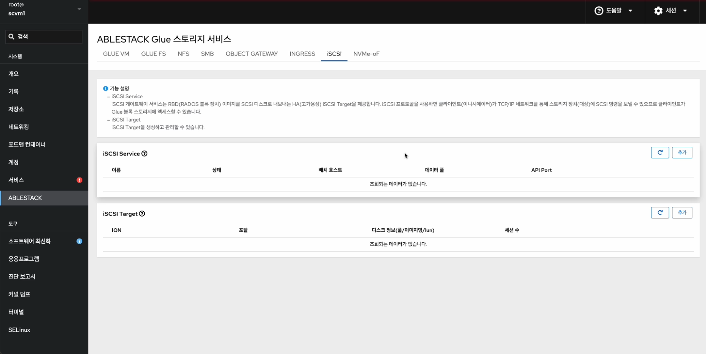{ align=center }
- ABLESTACK 메인 화면에서 상단 iSCSI 메뉴를 클릭한 화면입니다.

!!! note
    서비스 생성, 수정, 삭제 시에는 약간의 지연이 발생할 수 있으며, 상태 및 최신 정보를 확인하려면 새로고침 버튼을 클릭해 주세요.

## Glue iSCSI 서비스 생성

!!! warning
    ABLESTACK Glue iSCSI 서비스는 한 번에 여러 서비스를 사용하는 것보다 하나의 서비스를 선호합니다.

1. Glue iSCSI 서비스 생성
    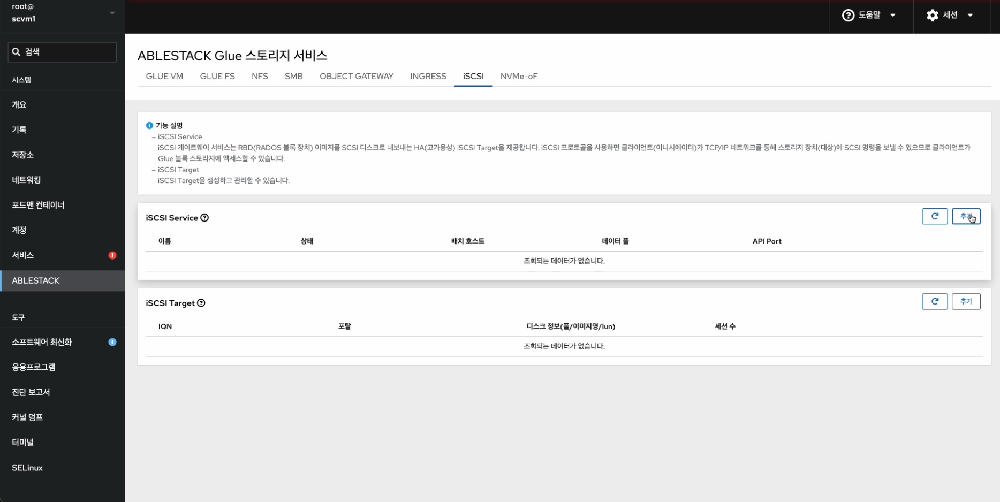{ align=center }
    - Glue iSCSI 서비스 카드란에 **추가** 버튼을 클릭합니다.
    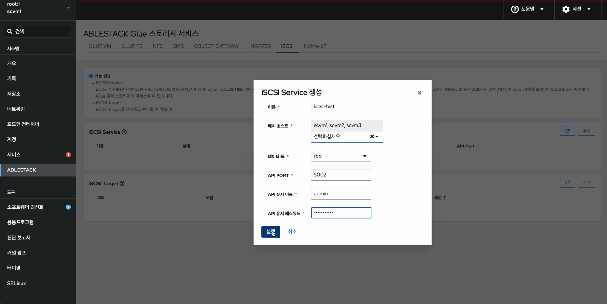{ align=center }
    - **이름** 정보를 입력 합니다.
    - **배치 호스트** 정보를 선택 합니다.
    - **데이터 풀** 정보를 선택 합니다.
    - **API PORT** 정보를 입력 합니다.
    - **API 유저 이름** 정보를 입력 합니다.
    - **API 유저 패스워드** 정보를 입력 합니다.
    - 위 항목을 입력 및 확인 후에 **실행** 버튼을 클릭 합니다.
    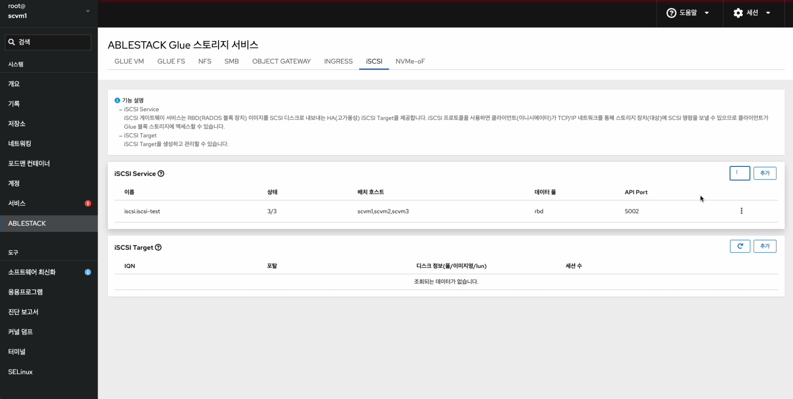{ align=center }
    - Glue iscsi 서비스가 구성된 화면입니다.
    !!! info
        스토리지 서비스에 등록된 호스트만 배치가 가능합니다.

## Glue iSCSI 서비스 수정

!!! warning
    ABLESTACK Glue iSCSI 서비스를 수정 할 시, 서비스가 정상 동작을 하지 않을 수도 있습니다.

    iSCSI 서비스는 수정보다는 삭제 후, 생성하여 사용하시는 걸 선호합니다.

1. Glue iSCSI 서비스 수정
    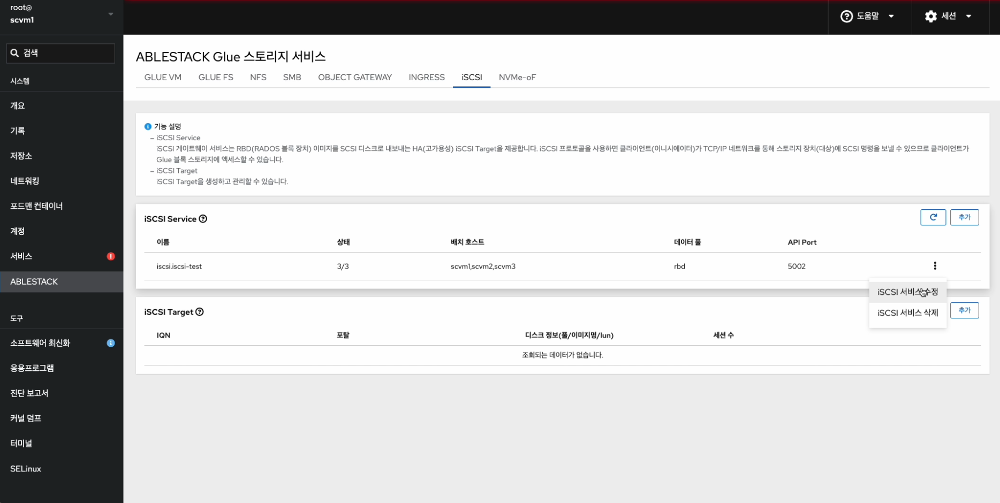{ align=center }
    - Glue iSCSI 각 정보의 더보기란을 클릭하면 보이는 화면입니다.
    - **iSCSI 서비스 수정** 버튼을 클릭합니다.
    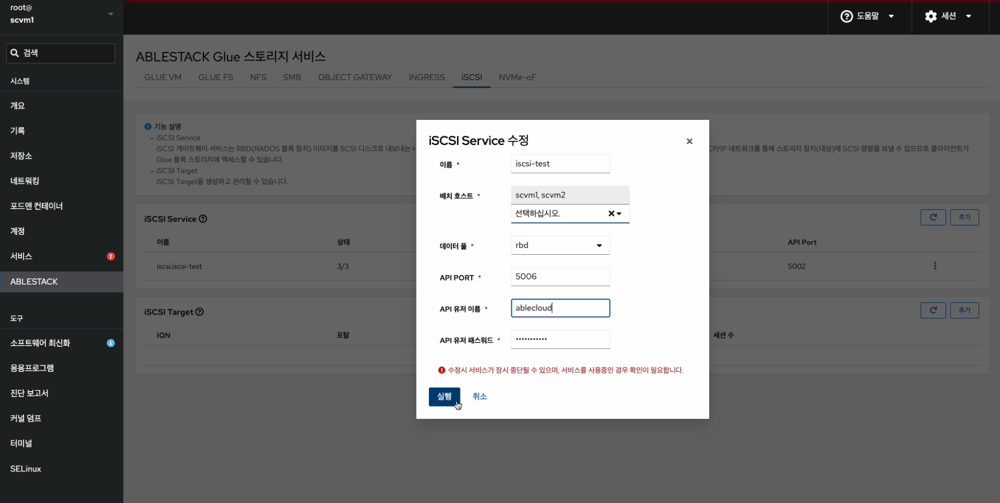{ align=center }
    - 변경될 **이름** 정보를 입력 합니다.
    - 변경될 **배치 호스트** 정보를 선택 합니다.
    - 변경될 **데이터 풀** 정보를 선택 합니다.
    - 변경될 **API PORT** 정보를 입력 합니다.
    - 변경될 **API 유저 이름** 정보를 입력 합니다.
    - 변경될 **API 유저 패스워드** 정보를 입력 합니다.
    - 위 항목을 입력 및 확인 후에 **실행** 버튼을 클릭 합니다.
    { align=center }
    - 수정된 화면입니다.

## Glue iSCSI 서비스 삭제

3. Glue iSCSI 서비스 삭제
    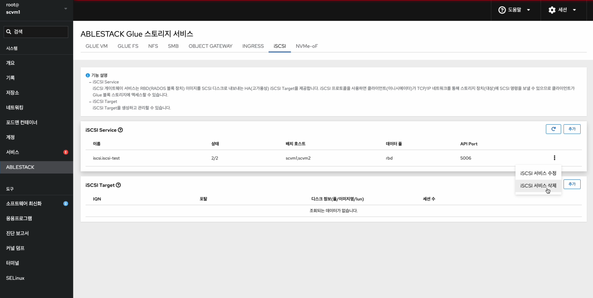{ align=center }
    - Glue iSCSI 각 정보의 더보기란을 클릭하면 보이는 화면입니다.
    - **iSCSI 서비스 삭제** 버튼을 클릭 합니다.
    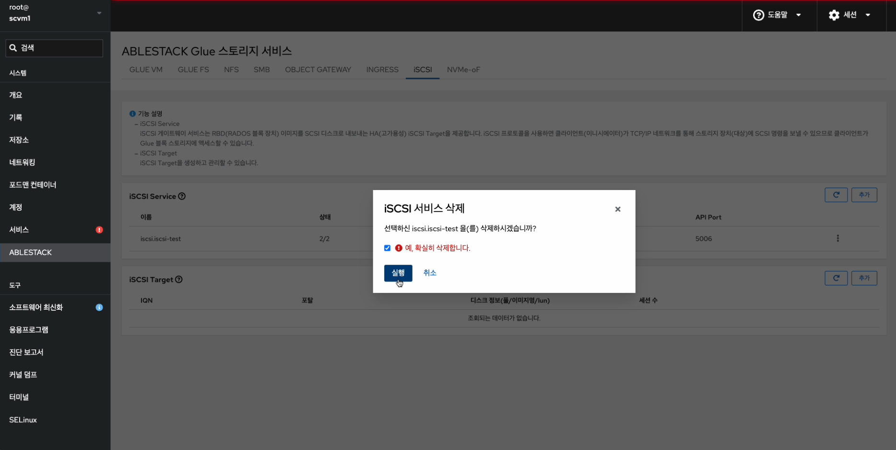{ align=center }
    - **예, 확실히 삭제합니다.** 체크를 활성화 합니다.
    - 위 항목들을 입력 및 확인 후에 **실행** 버튼을 클릭합니다.
    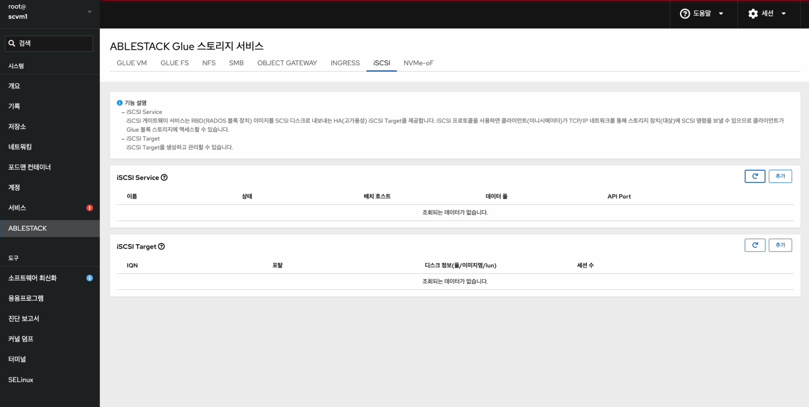{ align=center }
    - 삭제가 된 화면입니다.

## Glue iSCSI Target 생성

!!! info
    Glue iSCSI Target 생성 시, iSCSI 서비스 상태가 정상 상태로 실행이 된 후, 타겟 생성하시길 바랍니다.

!!! note
    IQN 및 이미지명은 형식에 맞게 임의로 생성됩니다.

    커스터마이징이 필요할 시, IQN은 {iqn.yyyy-mm.naming-authority:unique}의 규칙을 따라야합니다. 이미지명은 무관합니다.

1. Glue iSCSI Target 생성
    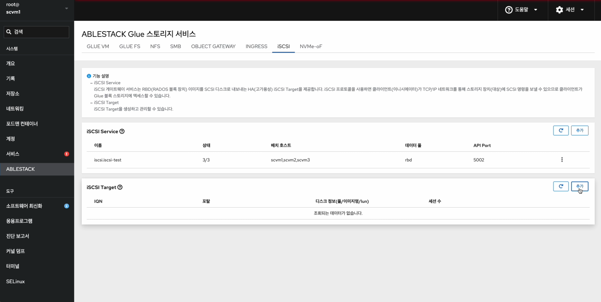{ align=center }
    - Glue iSCSI 카드란에 **추가** 버튼을 클릭합니다.
    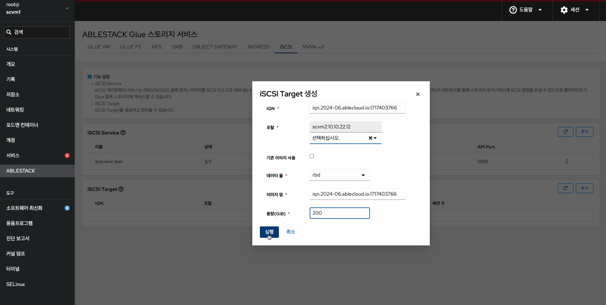{ align=center }
    - **IQN** 정보를 입력 합니다.
    - **포탈** 정보를 선택 합니다.
    - **기존 이미지 사용** 시 정보를 체크 합니다.
    - **데이터 풀** 정보를 선택 합니다.
    - **이미지 명** 정보를 입력 합니다.
    - **용량(GiB)** 정보를 입력 합니다.
    - 위 항목을 입력 및 확인 후에 **실행** 버튼을 클릭 합니다.
    { align=center }
    - Glue iSCSI 서비스가 구성된 화면입니다.
    !!! info
        Glue iSCSI 서비스에 등록된 호스트만 포탈 이용이 가능합니다.

        기존 이미지 사용 할 경우, 체크하여 사용하시면 됩니다. 아닐 경우 이미지가 생성됩니다.

## Glue iSCSI Target 수정

1. Glue iSCSI Target 수정
    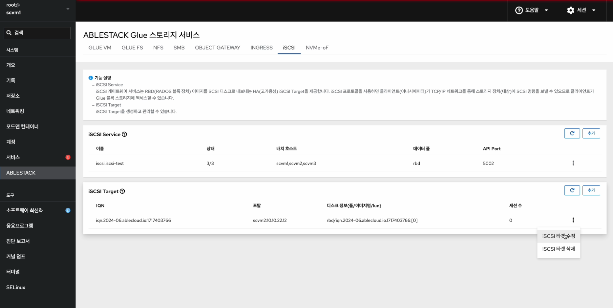{ align=center }
    - Glue iSCSI 각 정보의 더보기란을 클릭하면 보이는 화면입니다.
    - **iSCSI 서비스 수정** 버튼을 클릭합니다.
    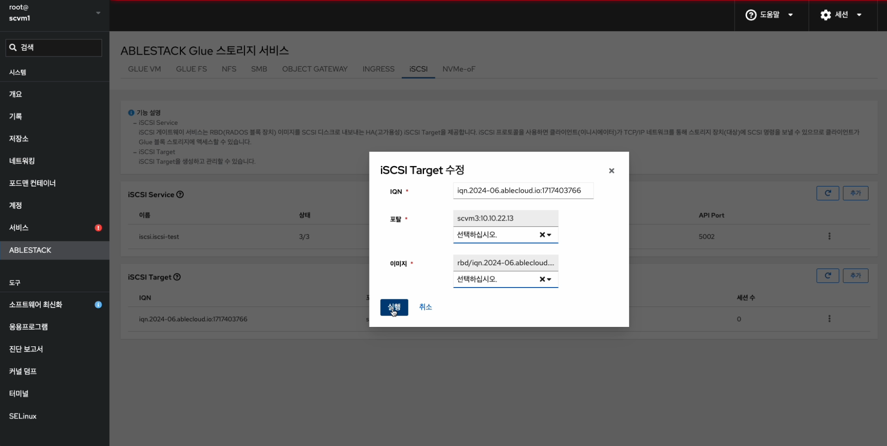{ align=center }
    - 변경될 **IQN** 정보를 입력 합니다.
    - 변경될 **포탈** 정보를 선택 합니다.
    - 변경될 **이미지** 정보를 선택 합니다.
    - 위 항목을 입력 및 확인 후에 **실행** 버튼을 클릭 합니다.
    { align=center }
    - 수정된 화면입니다.

## Glue iSCSI Target 삭제

!!! note
    ABLESTACK Glue iSCSI Target의 데이터는 이미지형태로 남아 있기에 서비스를 삭제하셔도 데이터는 존재합니다.

1. Glue iSCSI Target 삭제
    { align=center }
    - Glue iSCSI 각 정보의 더보기란을 클릭하면 보이는 화면입니다.
    - **iSCSI 서비스 삭제** 버튼을 클릭 합니다.
    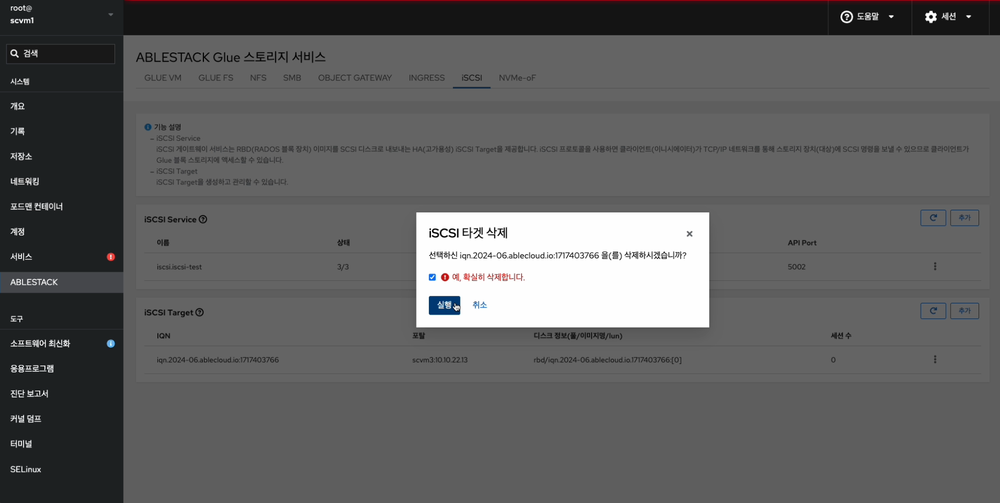{ align=center }
    - **예, 확실히 삭제합니다.** 체크를 활성화 합니다.
    - 위 항목들을 입력 및 확인 후에 **실행** 버튼을 클릭합니다.
    { align=center }
    - 삭제가 된 화면입니다.

## Glue iSCSI 실사용 방법

### Glue iSCSI Service 확인 및 iSCSI Target 확인
1. Glue iSCSI Service 확인 및 iSCSI Target 확인
    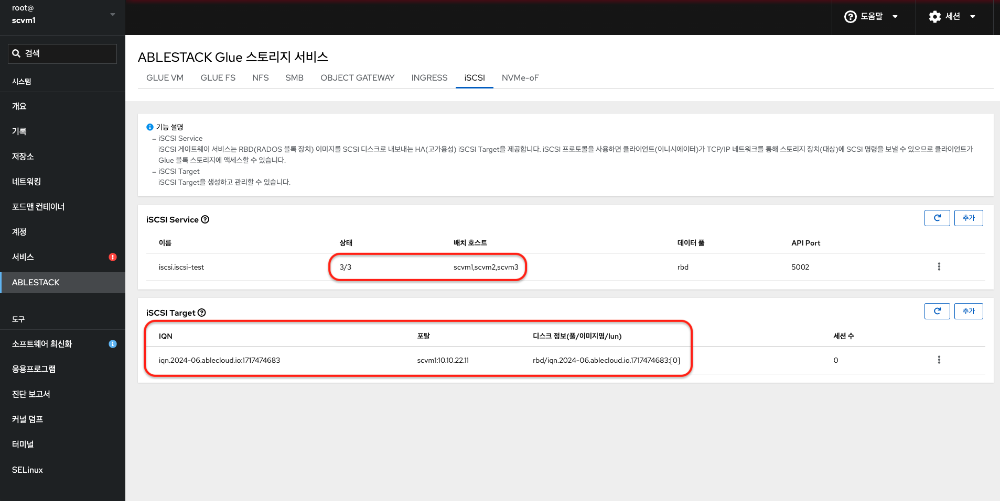{ align=center }
    - Glue iSCSI Service 및 iSCSI Target을 확인하는 화면입니다.
    - Glue iSCSI Service **상태** , **배치 호스트** 정보를 확인 합니다.
    - Glue iSCSI Target의 **IQN** , **포탈** , **디스크 정보** 를 확인 합니다.

### 리눅스 가상머신 작업
2. 리눅스 가상머신 작업</br></br>
    iSCSI를 사용할 가상머신에 마운트를 위해 아래 절차를 수행합니다.

    먼저 가상머신에 iscsi-initiator-utils 패키지가 존재해야 합니다.
    iscsi-initiator-utils 패키지가 없다면, 설치를 진행합니다.
    ```shell title="패키지 설치"
    dnf install -y iscsi-initiator-utils
    ```

    포탈은 Glue iSCSI Target에서 확인한 IQN에 대한 포탈입니다.
    ```shell title="포탈에 대한 IQN 검색"
    iscsiadm -m discovery -t st -p 10.10.22.11
    ```
    iqn은 해당 포탈에서 생성한 iqn 아이디 입니다.
    ```shell title="IQN 로그인"
    iscsiadm -m node -T iqn.2024-06.ablecloud.io:1717474683 -l
    ```
    ```shell title="iSCSI 디스크 볼륨 확인"
    fdisk -l
    (해당 IQN에서 만들어진 이미지 용량과 TCMU device가 존재합니다.)
    ```
    ```shell title="iSCSI 디스크 볼륨 파티션 작업(선택사항)"
    (현재 "/dev/sdf"로 iSCSI 디스크 볼륨이 잡혀 있습니다. 해당 사항에 맞게 진행해주시면 됩니다.)
    parted /dev/sdf

    (parted)mklabel gpt
    (parted)yes
    (parted)mkpart primary 0% 100%
    (parted)unit GB (용량에 맞게 적용하시면 됩니다.)
    (parted)print (로 확인 하시길 바랍니다.)
    (parted)quit

    새 파티션 데이터로 커널 업데이트
    partprobe /dev/sdf
    커널을 업데이트하면 어플라이언스를 다시 시작하라는 메시지가 표시될 수 있습니다.
    이 메시지가 표시되면 어플라이언스를 다시 시작하십시오.

    파티션 확인
    cat /proc/partitions
    ```
    ```shell title="iSCSI 디스크 볼륨 파일시스템으로 변경"
    mkfs.ext4 /dev/sdf (사용 하실 파일 시스템의 종류에 맞게 생성하시면 됩니다.)

    마운트할 경로를 생성한 후 진행해주시길 바랍니다.
    mount /dev/sdf /mnt/test
    ```

    마운트가 정상적으로 잘 되었는지 확인 합니다.
    ```shell title="마운트 확인"
    mount | grep /mnt/test
    또는
    df -h | grep /mnt/test
    ```
    ```shell title="IQN 로그아웃"
    iscsiadm -m node -T iqn.2024-06.ablecloud.io:1717474683 -u
    ```

### 윈도우 가상머신 작업
3. 윈도우 가상머신 작업
    { align=center }
    - Glue iSCSI Service 및 iSCSI Target을 확인하는 화면입니다.
    - Glue iSCSI Service **상태** , **배치 호스트** 정보를 확인 합니다.
    - Glue iSCSI Target의 **IQN** , **포탈** , **디스크 정보** 를 확인 합니다.
    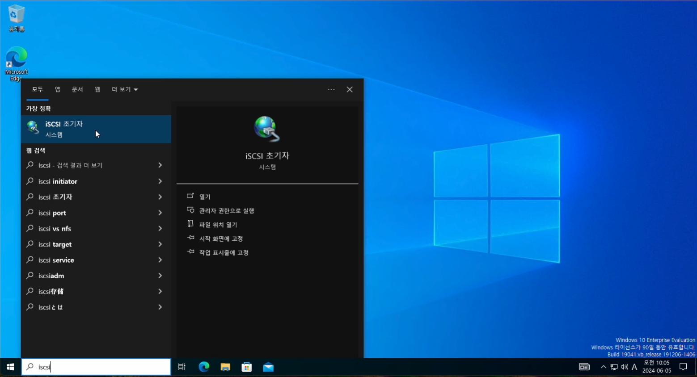{ align=center }
    - 사용하실 윈도우 가상머신 접속 화면 입니다.
    - 왼쪽 하단에 **iscsi 초기자** 를 입력 합니다.
    - **iscsi 초기자** 를 클릭 합니다.
    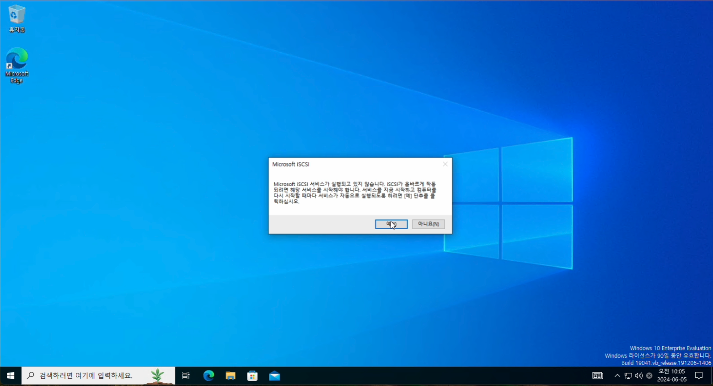{ align=center }
    - **예** 를 클릭 합니다.
    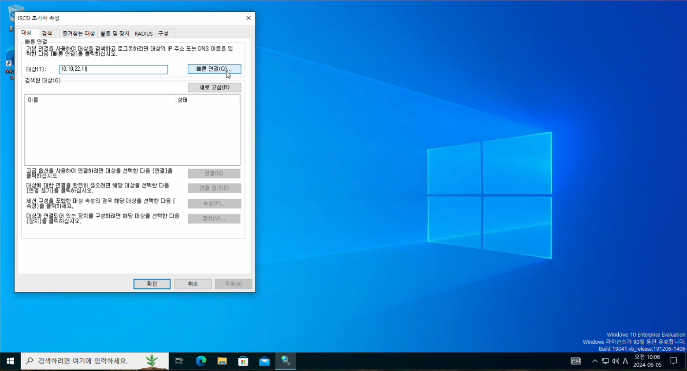{ align=center }
    - **iSCSI 초기자 속성** 에서 **대상** 부분에 Glue iSCSI Service에서 확인한 **포탈** 을 입력 합니다.
    - 위 항목들을 입력 및 확인 후에 **빠른 연결** 버튼을 클릭합니다.
    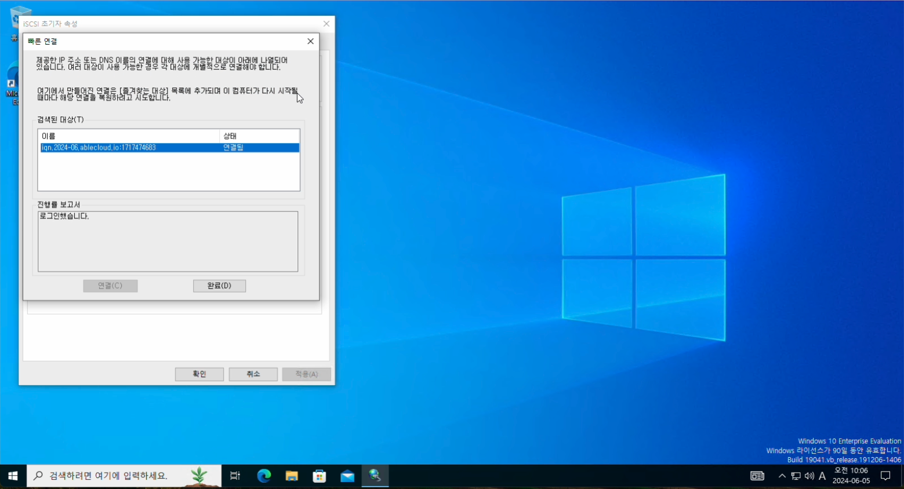{ align=center }
    - 검색된 대상을 확인한 후, **완료** 버튼을 클릭 합니다.
    { align=center }
    - 연결된 화면입니다.
    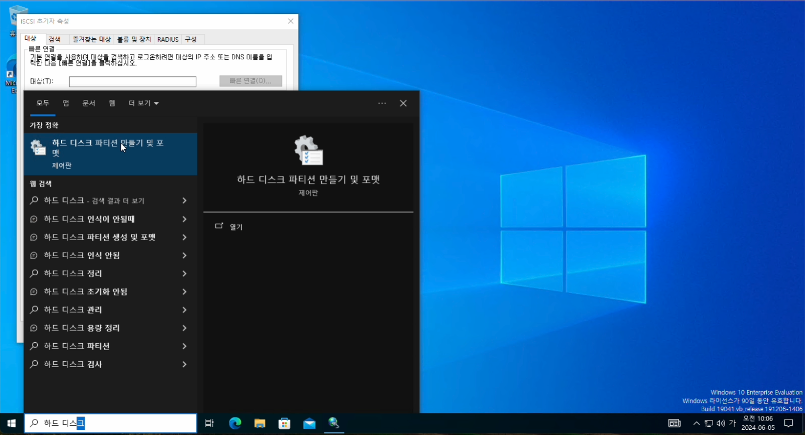{ align=center }
    - 왼쪽 하단에 **하드 디스크 파티션 만들기 및 포맷** 을 검색하여 클릭 합니다.
    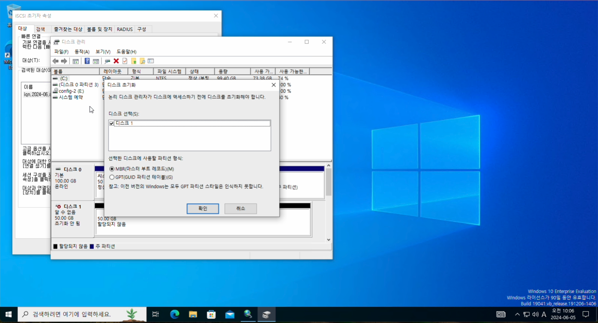{ align=center }
    - 붙은 **iSCSI 디스크 볼륨** 을 먼저 초기화를 진행 합니다.
    - **파티션 형식** 을 체크 합니다.
    - **확인** 버튼을 클릭 합니다.
    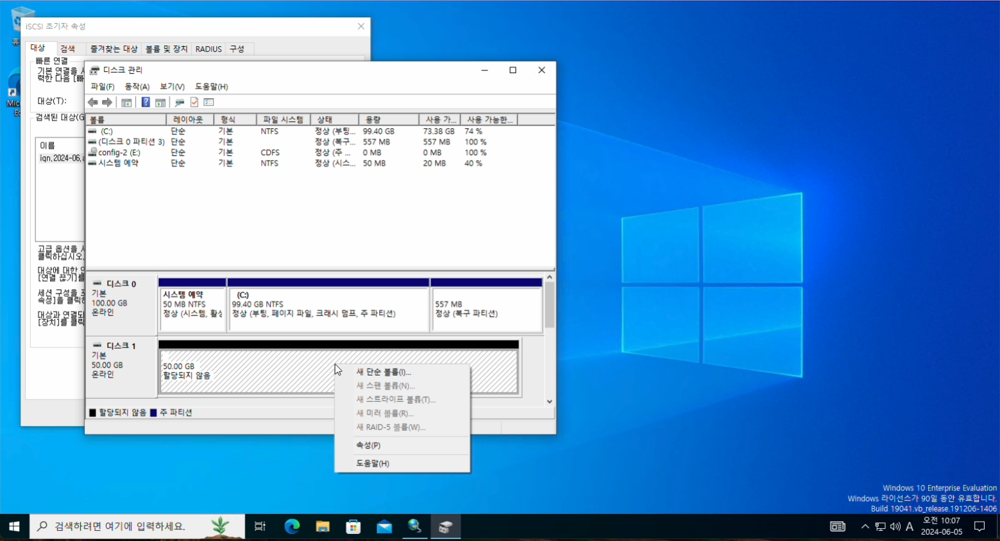{ align=center }
    - 붙은 **iSCSI 디스크 볼륨** 을 할당하기 위해 **새 단순 볼륨** 버튼을 클릭 합니다.
    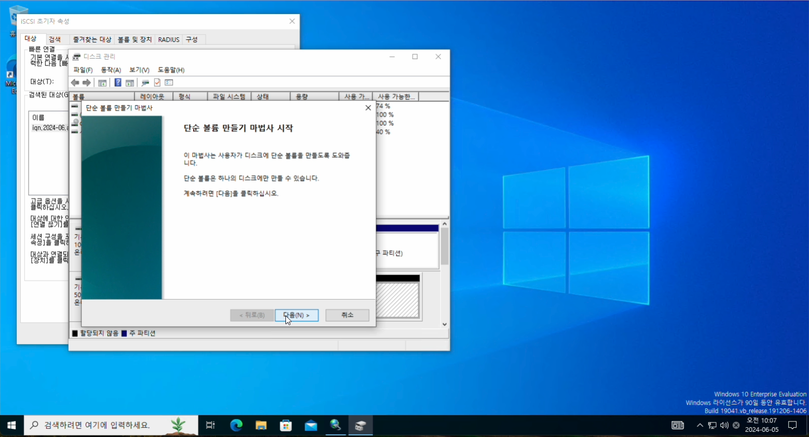{ align=center }
    - **다음** 버튼을 클릭 합니다.
    { align=center }
    - **단순 볼륨 크기** 를 설정한 후, **다음** 버튼을 클릭 합니다.
    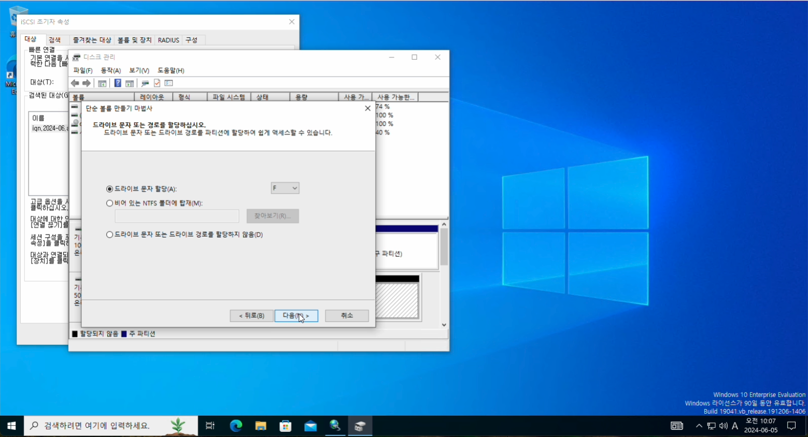{ align=center }
    - 사용자에게 맞게 해당하는 사항을 체크 한 후, **다음** 버튼을 클릭 합니다.
    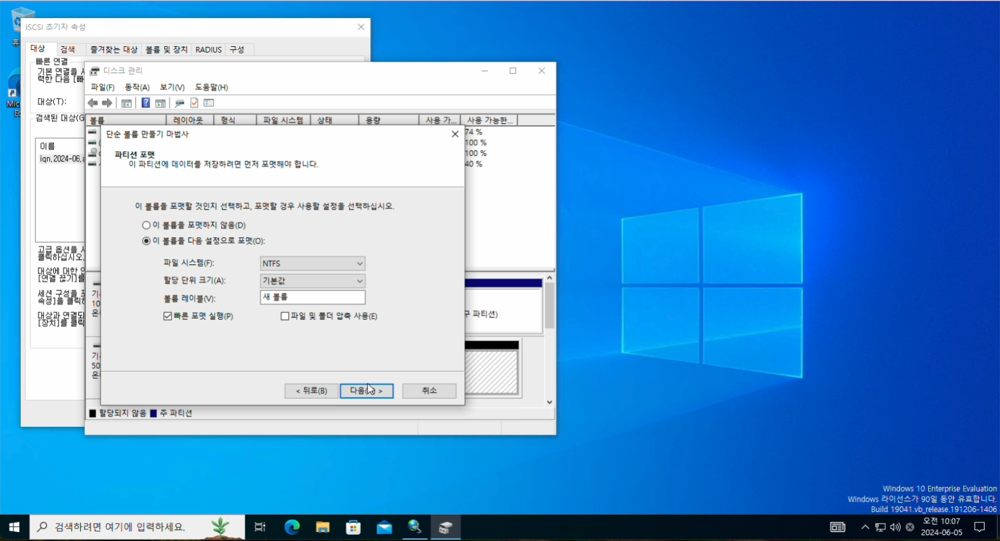{ align=center }
    - 사용자에게 맞게 해당하는 사항을 체크 및 입력 한 후, **다음** 버튼을 클릭 합니다.
    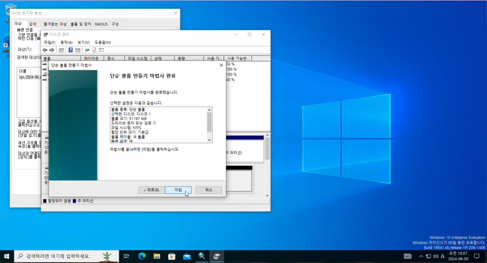{ align=center }
    - 모든 구성이 완료 되었습니다. **마침** 버튼을 클릭 합니다.
    { align=center }
    - **내 PC** 로 이동하여, **iSCSI 디스크 볼륨** 이 **용량 및 드라이브 문자 할당** 이 정상적으로 되었는 지 확인 합니다.
    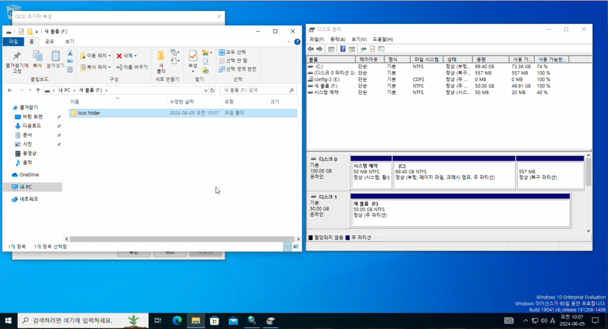{ align=center }
    - 사용자에게 맞게 사용하시면 됩니다.