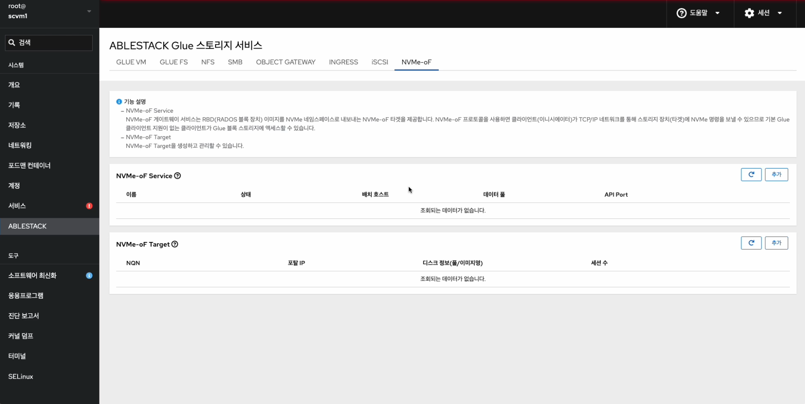
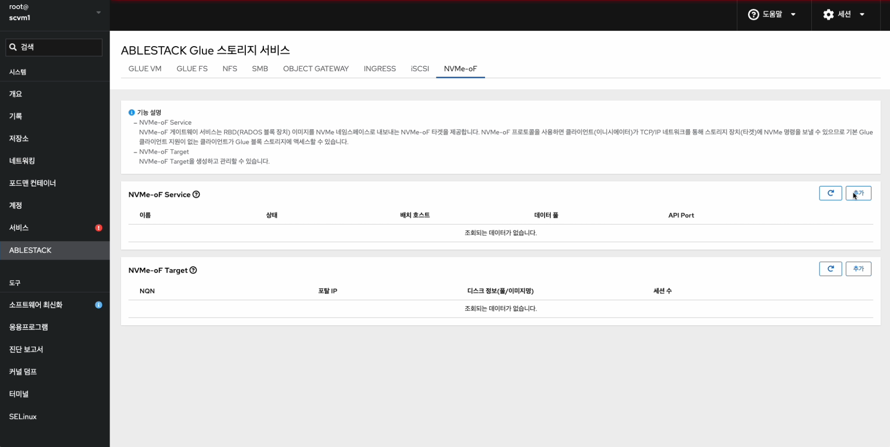
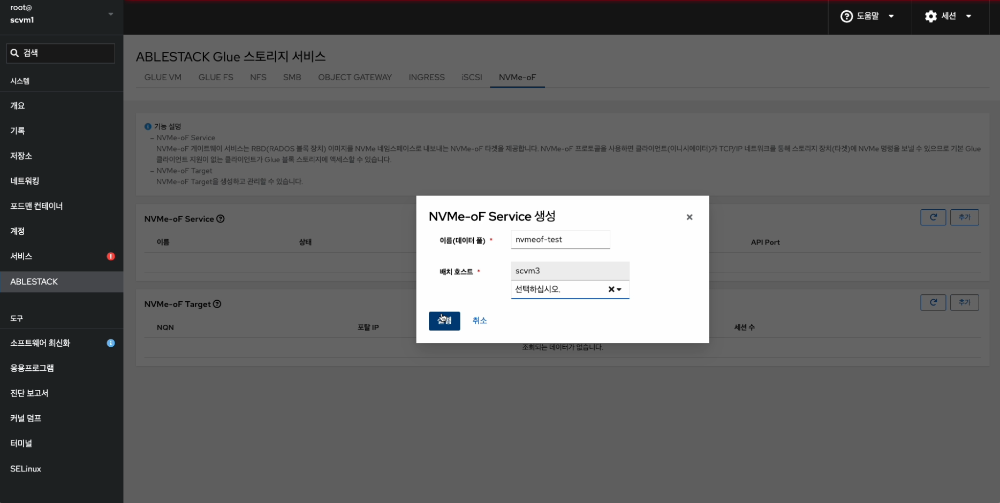
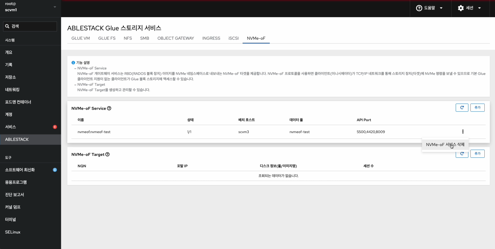
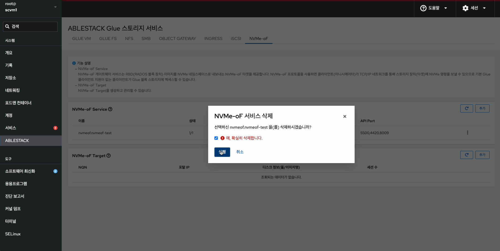
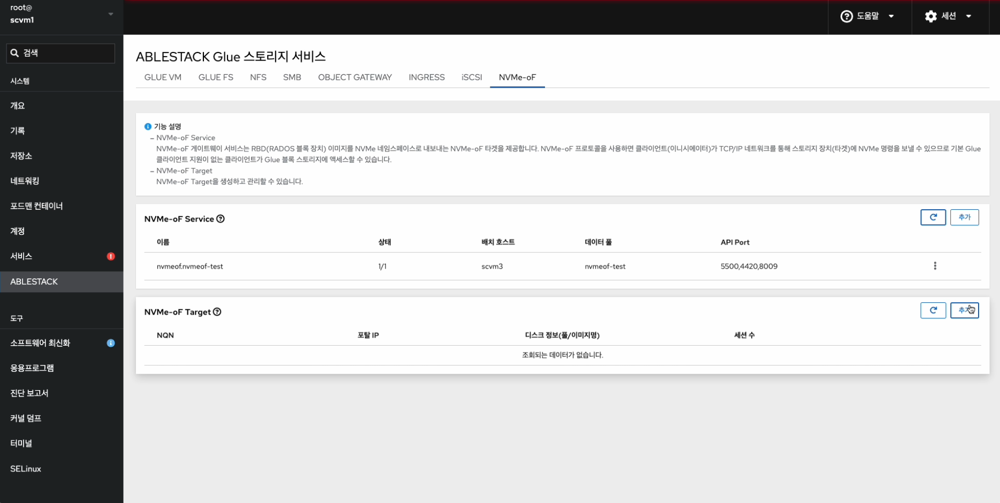
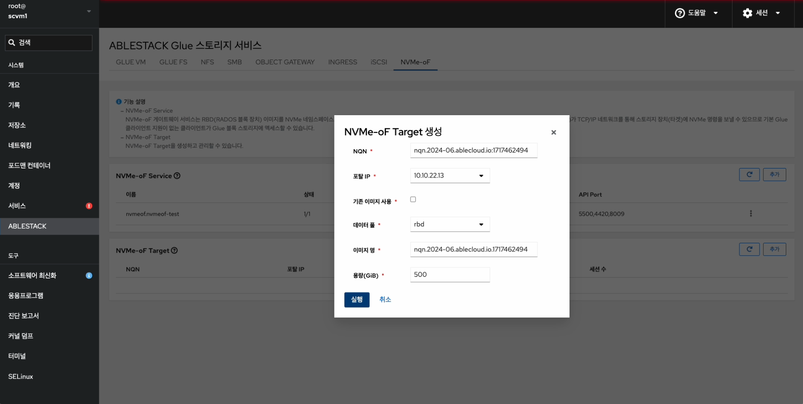
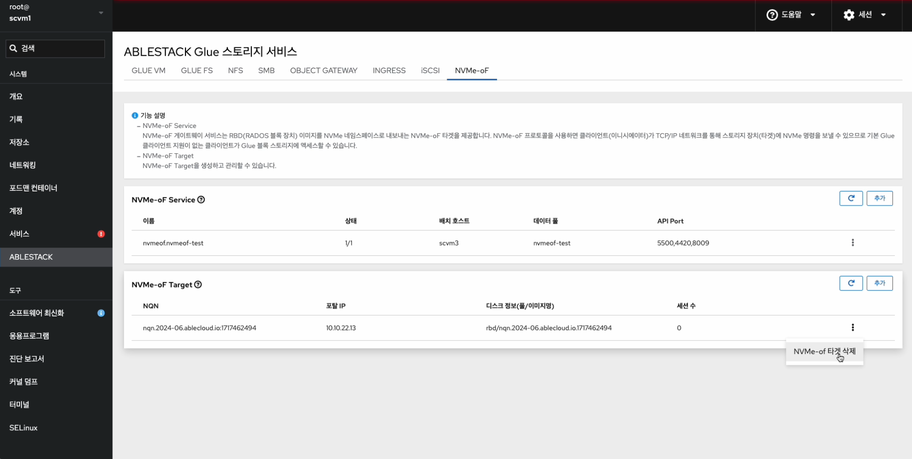
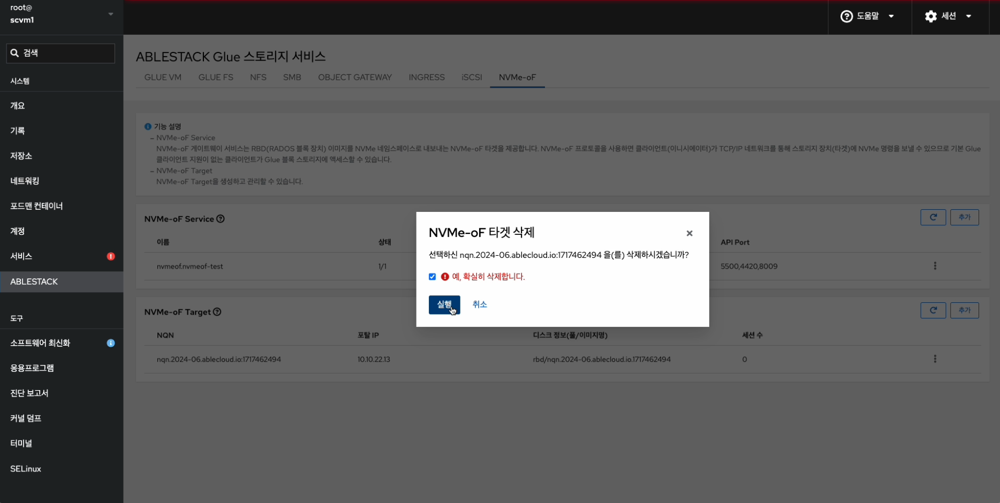
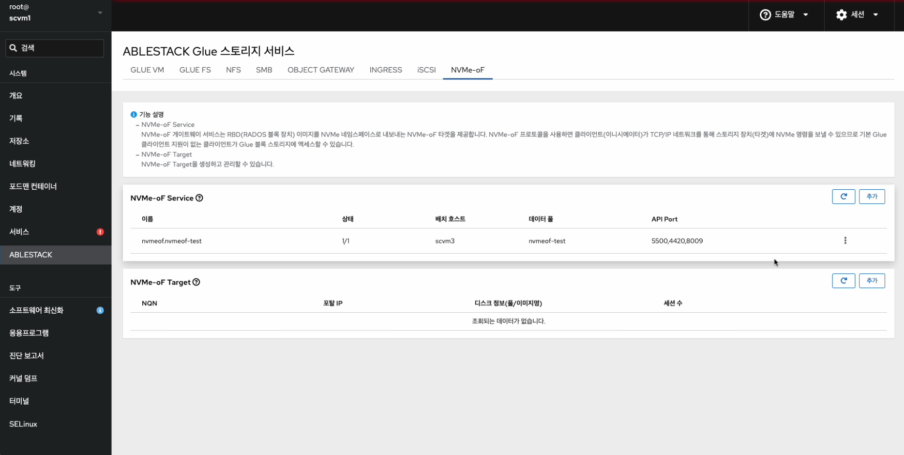

!!! note
    ABLESTACK Glue Service는 호스트가 아닌 Storage Center Virtual Machine(SCVM)에서 제공되고 있습니다.

    접속할 경로는 기존에 구성된 Storage Center Virtual Machine(SCVM) IP로 접속 하시면 됩니다.

# Glue NVMe-oF 관리
ABLESTACK Glue Service 에서의 Glue NVMe-oF 관리 하는 가이드 입니다.
이 문서에서는 ABLESTACK Glue NVMe-oF 관리 및 제공되는 기능절차를 가이드 하고 있습니다.
ABLESTACK Cube의 웹콘솔로 진행되며, 웹 접속 IP는 별도의 표시를 하지 않고 진행됩니다.
기존에 구성된 IP 정보에 맞게 웹콘솔을 접속 하시면 됩니다.

## Glue NVMe-oF 기능 설명
NVMe-oF 게이트웨이 서비스는 RBD(RADOS 블록 장치) 이미지를 NVMe 네임스페이스로 내보내는 NVMe-oF 타겟을 제공합니다.
NVMe-oF 프로토콜을 사용하면 클라이언트(이니시에이터)가 TCP/IP 네트워크를 통해 스토리지 장치(타겟)에 NVMe 명령을 보낼 수 있으므로 기본 Glue 클라이언트 지원이 없는 클라이언트가 Glue 블록 스토리지에 액세스할 수 있습니다.
NVMe-oF Target을 생성하고 관리할 수 있습니다.

## Glue NVMe-oF 메인 화면
{ align=center }
- ABLESTACK 메인 화면에서 상단 NVMe-oF 메뉴를 클릭한 화면입니다.

!!! warning
    ABLESTACK Glue NVMe-oF 서비스는 한 번에 여러 서비스를 사용하는 것보다 하나의 서비스를 선호합니다.

!!! note
    서비스 생성, 수정, 삭제 시에는 약간의 지연이 발생할 수 있으며, 상태 및 최신 정보를 확인하려면 새로고침 버튼을 클릭해 주세요.

## Glue NVMe-oF 서비스 생성

!!! info
    현재 버전에선 ABLESTACK Glue NVMe-oF 서비스의 배치 호스트는 하나의 호스트만을 제공합니다.

    ABLESTACK Glue NVMe-oF 서비스는 CPU를 8Core를 고정적으로 사용하기 때문에 부하가 적은 호스트를 사용하시길 바랍니다.

!!! note
    이름(데이터풀)을 원하시는 명을 적으시면 풀이 생성되면서 NVMe-oF 서비스를 사용합니다.

    기존 데이터풀을 사용하실려면 이름(데이터풀)에서 사용하시면 됩니다.

1. Glue NVMe-oF 서비스 생성
    { align=center }
    - Glue NVMe-oF 서비스 카드란에 **추가** 버튼을 클릭합니다.
    { align=center }
    - **이름(데이터풀)** 정보를 입력 합니다.
    - **배치 호스트** 정보를 선택 합니다.
    - 위 항목을 입력 및 확인 후에 **실행** 버튼을 클릭 합니다.
    { align=center }
    - Glue NVMe-oF 서비스가 구성된 화면입니다.
    !!! info
        스토리지 서비스에 등록된 호스트만 배치가 가능합니다.

!!! info
    Glue NVMe-oF 서비스 및 타겟에는 수정을 제공하지 않습니다.

## Glue NVMe-oF 서비스 삭제

!!! note
    ABLESTACK Glue NVMe-oF Target의 데이터는 이미지형태로 남아 있기에 서비스를 삭제하셔도 데이터는 존재합니다.

1. Glue NVMe-oF 서비스 삭제
    { align=center }
    - Glue NVMe-oF 각 정보의 더보기란을 클릭하면 보이는 화면입니다.
    - **NVMe-oF 서비스 삭제** 버튼을 클릭 합니다.
    { align=center }
    - **예, 확실히 삭제합니다.** 체크를 활성화 합니다.
    - 위 항목들을 입력 및 확인 후에 **실행** 버튼을 클릭합니다.
    { align=center }
    - 삭제가 된 화면입니다.

## Glue NVMe-oF Target 생성

!!! info
    Glue NVMe-oF Target 생성 시, NVMe-oF 서비스 상태가 정상 상태로 실행이 된 후, 타겟 생성하시길 바랍니다.

!!! note
    NQN 및 이미지명은 형식에 맞게 임의로 생성됩니다.

    커스터마이징이 필요할 시, NQN은 {nqn.yyyy-mm.naming-authority:unique}의 규칙을 따라야합니다. 이미지명은 무관합니다.

1. Glue NVMe-oF Target 생성
    { align=center }
    - Glue NVMe-oF 카드란에 **추가** 버튼을 클릭합니다.
    { align=center }
    - **IQN** 정보를 입력 합니다.
    - **포탈** 정보를 선택 합니다.
    - **기존 이미지 사용** 시 정보를 체크 합니다.
    - **데이터 풀** 정보를 선택 합니다.
    - **이미지 명** 정보를 입력 합니다.
    - **용량(GiB)** 정보를 입력 합니다.
    - 위 항목을 입력 및 확인 후에 **실행** 버튼을 클릭 합니다.
    { align=center }
    - Glue NVMe-oF 서비스가 구성된 화면입니다.
    !!! info
        Glue NVMe-oF 서비스에 등록된 호스트만 포탈 이용이 가능합니다.

        기존 이미지 사용 할 경우, 체크하여 사용하시면 됩니다. 아닐 경우 이미지가 생성됩니다.

## Glue NVMe-oF Target 삭제

!!! note
    ABLESTACK Glue NVMe-oF Target의 데이터는 이미지형태로 남아 있기에 서비스를 삭제하셔도 데이터는 존재합니다.

1. Glue NVMe-oF Target 삭제
    { align=center }
    - Glue NVMe-oF 각 정보의 더보기란을 클릭하면 보이는 화면입니다.
    - **NVMe-oF 서비스 삭제** 버튼을 클릭 합니다.
    { align=center }
    - **예, 확실히 삭제합니다.** 체크를 활성화 합니다.
    - 위 항목들을 입력 및 확인 후에 **실행** 버튼을 클릭합니다.
    { align=center }
    - 삭제가 된 화면입니다.

## Glue NVMe-oF 실사용 방법

### Glue NVMe-oF Service 확인 및 NVMe-oF Target 확인
1. Glue NVMe-oF Service 확인 및 NVMe-oF Target 확인
    { align=center }
    - Glue NVMe-oF Service 및 NVMe-oF Target을 확인하는 화면입니다.
    - Glue NVMe-oF Service **상태** , **배치 호스트** , **데이터 풀** , **API PORT** 정보를 확인 합니다.
    - Glue NVMe-oF Target의 **NQN** , **포탈** , **디스크 정보** 를 확인 합니다.</br>

### 리눅스 가상머신 작업
2. 리눅스 가상머신 작업</br></br>
    NVMe-oF 사용할 가상머신에 마운트를 위해 아래 절차를 수행합니다.

    먼저 가상머신에 nvme-cli 패키지가 존재해야 합니다.
    nvme-cli 패키지가 없다면, 설치를 진행합니다.
    ```shell title="패키지 설치"
    dnf install -y nvme-cli
    ```
    ```shell title="새로운 모듈 로드"
    modprobe nvme-fabrics
    ```
    해당 IP는 Glue NVMe-oF Target에서 확인한 NQN에 대한 포탈입니다.
    ```shell title="NVMe 대상에서 사용 가능한 하위 시스템 검색"
    nvme discover -t tcp -a 10.10.22.13
    ```
    NQN은 해당 포탈에서 생성한 NQN 아이디 입니다.
    ```shell title="검색된 하위 시스템 연결"
    nvme connect -t tcp -a 10.10.22.13 -n nqn.2024-06.ablecloud.io:1717474811
    ```
    ```shell title="연결 확인"
    nvme list
    ```

    ```shell title="NVMe-oF LVM 설정 및 파일 시스템 생성"
    vi /etc/lvm/lmv.conf
    (use_devicesfile=1 -> use_devicesfile=0 으로 교체)

    pvcreate /dev/nvme0n1
    vgcreate vg_nvme /dev/nvme0n1
    lvcreate -l100%FREE -n lv.data vg_nvme

    (/dev/nvme0n1은 연결된 디바이스 이름입니다. 이름에 맞게 입력해주세요.)
    (vg_nvme, lv.data는 임의의 이름입니다. 설정된 이름에 맞게 입력해주세요.)

    mkfs.ext4 /dev/mapper/vg_nvme-lv.data
    (사용 하실 파일 시스템의 종류에 맞게 생성하시면 됩니다.)

    마운트할 경로를 생성한 후 진행해주시길 바랍니다.
    mount /dev/mapper/vg_nvme-lv.data /mnt/test
    ```

    마운트가 정상적으로 잘 되었는지 확인 합니다.
    ```shell title="마운트 확인"
    mount | grep /mnt/test
    또는
    df -h | grep /mnt/test
    ```

