!!! note
    ABLESTACK Glue Service는 호스트가 아닌 Storage Center Virtual Machine(SCVM)에서 제공되고 있습니다.

    접속할 경로는 기존에 구성된 Storage Center Virtual Machine(SCVM) IP로 접속 하시면 됩니다.

# Glue Object Gateway 관리
ABLESTACK Glue Service 에서의 Glue Object Gateway 관리 하는 가이드 입니다.
이 문서에서는 ABLESTACK Glue Object Gateway Service 관리 및 제공되는 기능절차를 가이드 하고 있습니다.
ABLESTACK Cube의 웹콘솔로 진행되며, 웹 접속 IP는 별도의 표시를 하지 않고 진행됩니다.
기존에 구성된 IP 정보에 맞게 웹콘솔을 접속 하시면 됩니다.

## Glue Object Gateway 기능 설명
Object Gateway는 Glue 위에 구축된 객체 스토리지 인터페이스입니다. 애플리케이션과 Glue Storage Cluster 사이에 RESTful 게이트웨이를 제공합니다. Glue Object Storage는 S3과 Swift 두 가지 RESTful API와 호환되는 인터페이스로 객체 스토리지 기능을 제공합니다.
Object Gateway User는 객체 스토리지 사용자정보를 관리하는 기능으로서 엑세스 정보와 사용량 제한 등 관리기능을 제공합니다. Object Gateway Admin User 생성 기능을 통해 관리자 권한의 사용자를 생성할 수 있습니다.
Object Gateway Bucket은 연관된 오브젝트(파일)를 그룹핑한 최상위 디렉토리이며, 사용자별 여러개의 버킷을 생성하여 사용할 수 있습니다.

## Glue Object Gateway 메인 화면
{ align=center }
- ABLESTACK 메인 화면에서 상단 Object Gateway 메뉴를 클릭한 화면입니다.

!!! info
    ABLESTACK Glue Object Gateway는 현재 버전에서 다중 인스턴스를 지원하지 않기 때문에 단일 Object Gateway만 구성할 수 있습니다.

!!! note
    서비스 생성, 수정, 삭제 시에는 약간의 지연이 발생할 수 있으며, 상태 및 최신 정보를 확인하려면 새로고침 버튼을 클릭해 주세요.

## Glue Object Gateway Service 생성

!!! warning
    ABLESTACK Glue Object Gateway 서비스는 한 번에 여러 서비스를 사용하는 것보다 하나의 서비스를 선호합니다.

1. Glue Object Gateway 구성
    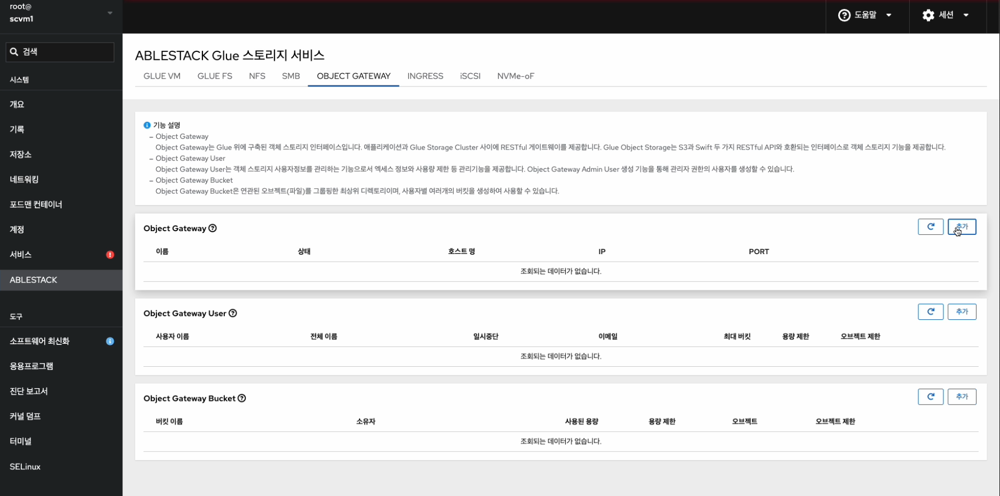{ align=center }
    - **Object Gateway** 카드란에 **추가** 버튼을 클릭합니다.
    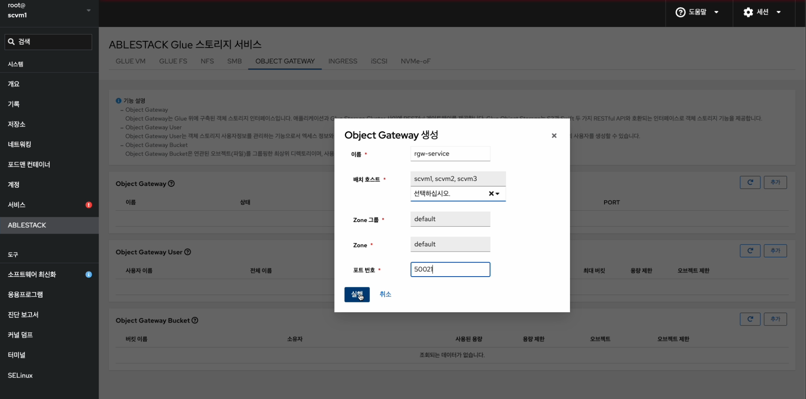{ align=center }
    - **이름** 정보를 입력 합니다.
    - **배치 호스트** 정보를 선택 합니다.
    - **포트 번호** 정보를 입력 합니다.
    - 위 항목들을 입력 및 확인 후에 **실행** 버튼을 클릭합니다.
    { align=center }
    - Object Gateway 서비스가 구성된 화면입니다.

    !!! info
        스토리지 서비스에 등록된 호스트만 배치가 가능합니다.

## Glue Object Gateway Service 수정

1. Glue Object Gateway Service 수정
    { align=center }
    - Object Gateway 각 정보의 더보기란을 클릭하면 보이는 화면입니다.
    - **Object Gateway 수정** 버튼을 클릭합니다.
    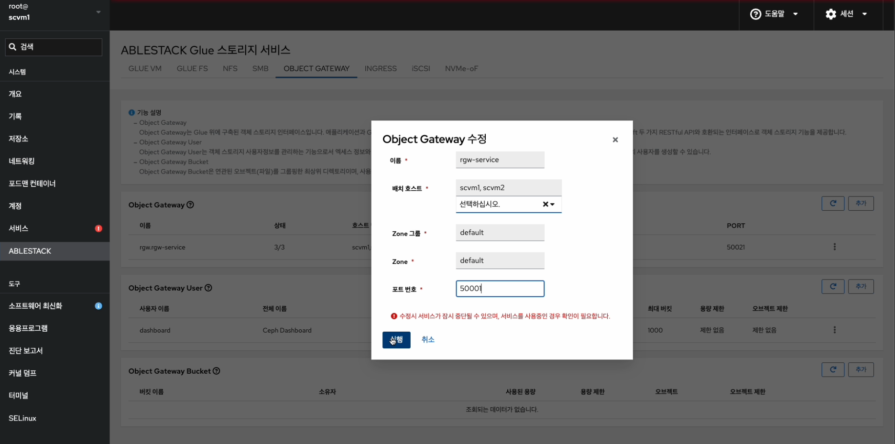{ align=center }
    - 변경될 **배치 호스트** 정보를 선택합니다.
    - 변경될 **포트 번호** 정보를 입력합니다.
    - 위 항목들을 입력 및 확인 후에 **실행** 버튼을 클릭합니다.
    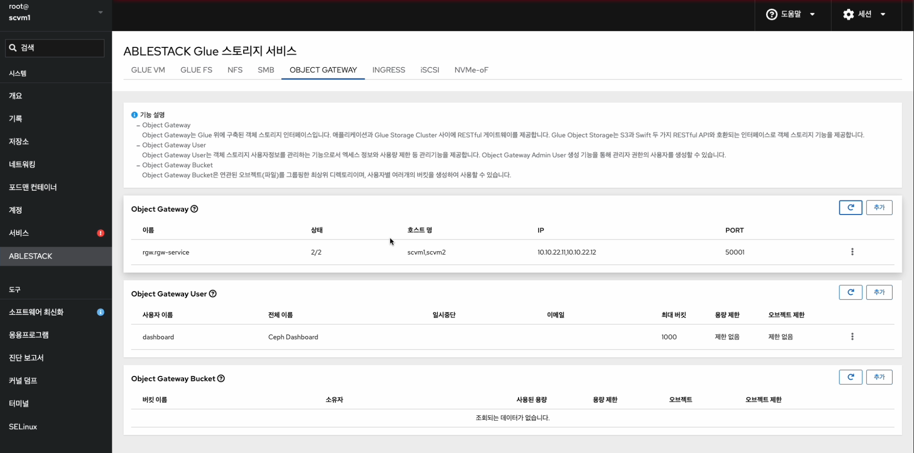{ align=center }
    - 수정된 화면입니다.

## Glue Object Gateway Service 삭제

!!! info
    Glue Object Gateway Service를 삭제해도 기존에 있던 유저 및 버킷의 데이터들은 남아 있습니다.

1. Glue Object Gateway Service 삭제
    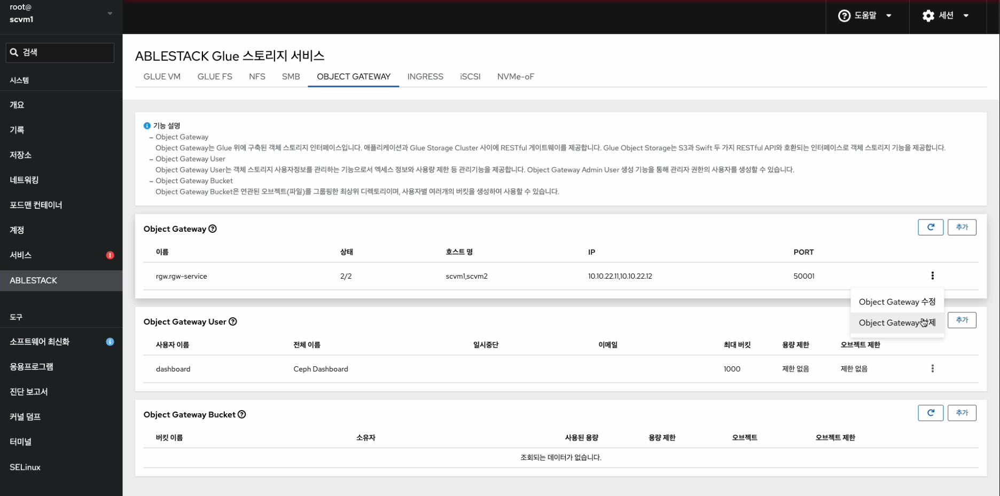{ align=center }
    - Object Gateway 각 정보의 더보기란을 클릭하면 보이는 화면입니다.
    - **Object Gateway 삭제** 버튼을 클릭합니다.
    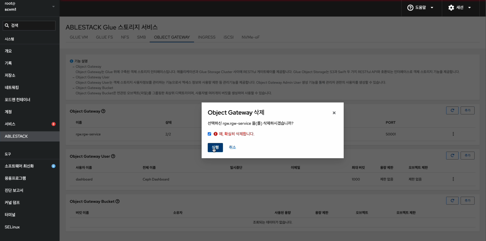{ align=center }
    - **예, 확실히 삭제합니다.** 체크를 활성화 합니다.
    - 위 항목들을 입력 및 확인 후에 **실행** 버튼을 클릭합니다.
    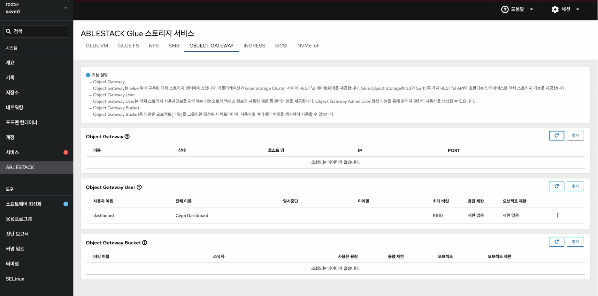{ align=center }
    - 삭제가 된 화면입니다.

## Glue Object Gateway User 생성

!!! info
    Glue Object Gateway Service의 상태가 모두 정상으로 실행 되는지 확인 후, 작업 하시길 바랍니다.

!!! note
    Glue Object Gateway Service를 생성하면, 기본적으로 시스템 권한을 가진 DashBoard 유저가 자동으로 생성됩니다.

1. Glue Object Gateway User 생성
    { align=center }
    - Object Gateway User 카드란에 **추가** 버튼을 클릭합니다.
    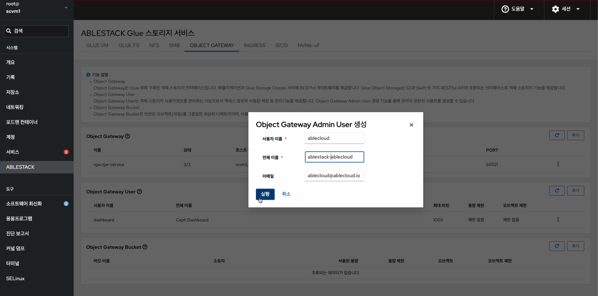{ align=center }
    - **사용자 이름** 정보를 입력합니다.
    - **전체 이름** 정보를 입력합니다.
    - **이메일** 정보를 입력합니다.
    - 위 항목들을 입력 및 확인 후에 **실행** 버튼을 클릭합니다.
    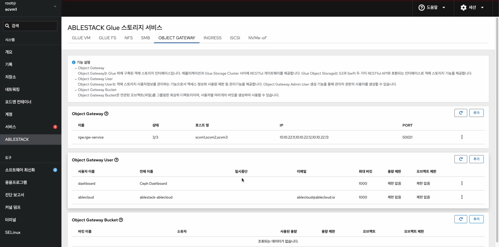{ align=center }
    - 생성된 화면입니다.

## Glue Object Gateway User 수정

1. Glue Object Gateway User 수정
    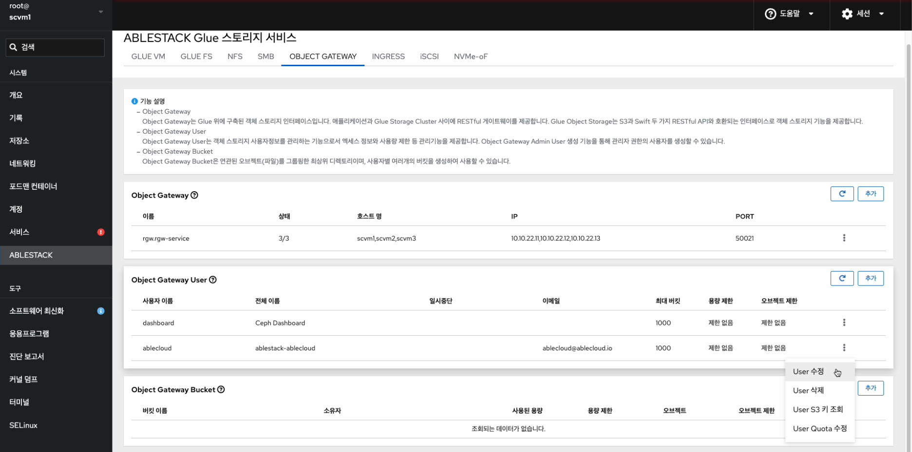{ align=center }
    - Object Gateway User 각 정보의 더보기란을 클릭하면 보이는 화면입니다.
    - **User 수정** 버튼을 클릭합니다.
    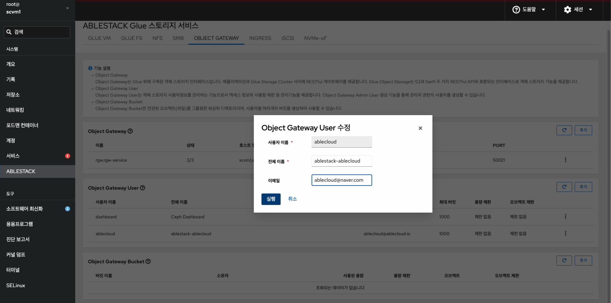{ align=center }
    - 변경될 **전체 이름** 정보를 입력합니다.
    - 변경될 **이메일** 정보를 선택합니다.
    - 위 항목들을 입력 및 확인 후에 **실행** 버튼을 클릭합니다.
    { align=center }
    - 변경된 화면입니다.

## Glue Object Gateway User 삭제

1. Glue Object Gateway User 삭제
    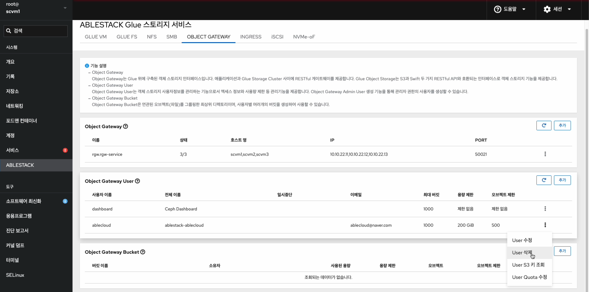{ align=center }
    - Object Gateway User 각 정보의 더보기란을 클릭하면 보이는 화면입니다.
    - **User 삭제** 버튼을 클릭합니다.
    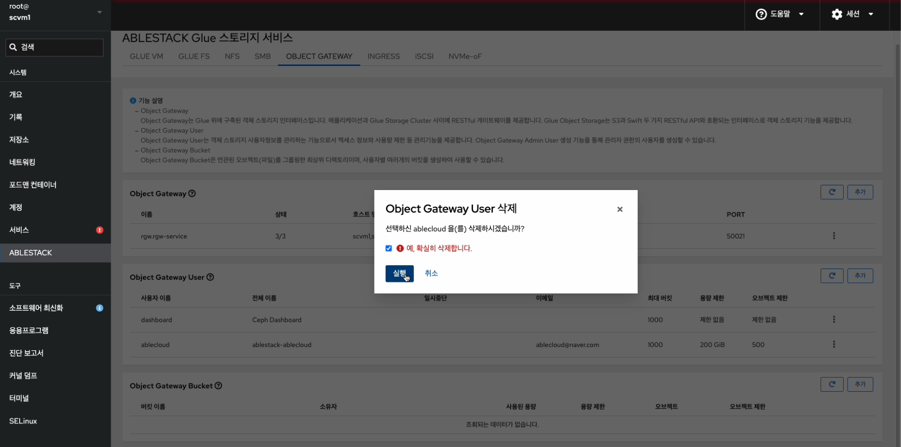{ align=center }
    - **예, 확실히 삭제합니다.** 란에 체크를 활성화 합니다.
    - 위 항목들을 입력 및 확인 후에 **실행** 버튼을 클릭합니다.
    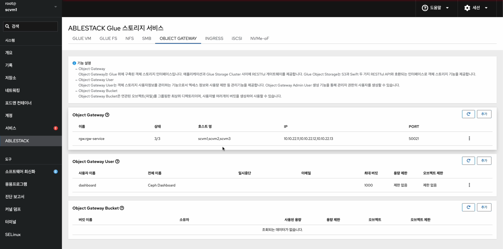{ align=center }
    - 삭제된 화면입니다.

## Glue Object Gateway User S3 키 조회

1. Glue Object Gateway User S3 키 조회
    { align=center }
    - Object Gateway User 각 정보의 더보기란을 클릭하면 보이는 화면입니다.
    - **User S3 키 조회** 버튼을 클릭합니다.
    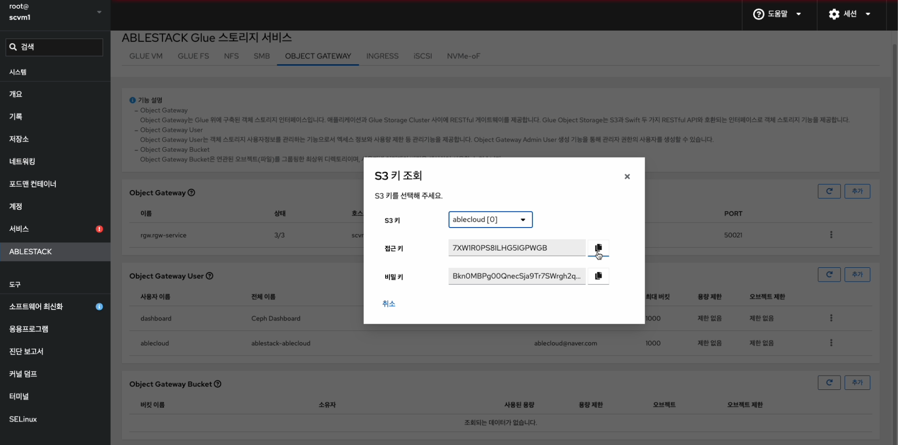{ align=center }
    - **S3 키** 를 선택합니다.
    - **접근키** 를 복사 버튼을 클릭합니다.
    - **비밀키** 를 복사 버튼을 클릭합니다.
    - 위 항목들을 사용 후 **취소** 를 클릭합니다.

## Glue Object Gateway User Quata 수정

!!! info
    Glue Object Gateway User Quata는 기본적으로 **제한 없음** 으로 값이 설정됩니다.

1. Glue Object Gateway User Quata 수정
    { align=center }
    - Object Gateway User 각 정보의 더보기란을 클릭하면 보이는 화면입니다.
    - **User Quata 수정** 버튼을 클릭합니다.
    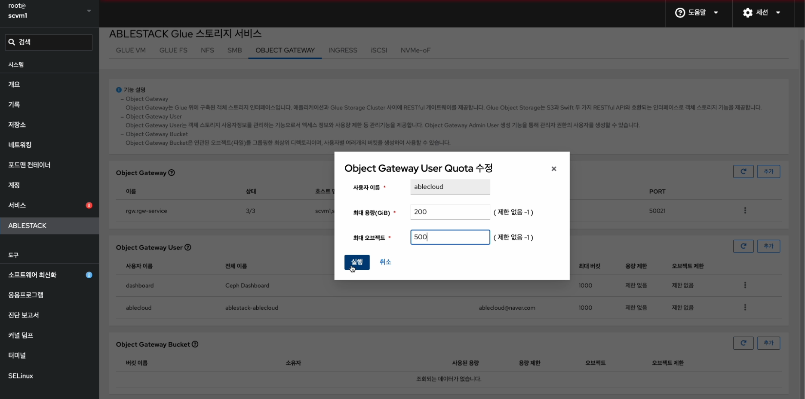{ align=center }
    - **사용자 이름** 정보를 확인합니다.
    - 변경될 **최대 용량(GiB)** 정보를 입력합니다.
    - 변경될 **최대 오브젝트** 정보를 입력합니다.
    - 위 항목들을 입력 및 확인 후에 **실행** 버튼을 클릭합니다.
    { align=center }
    - 변경된 화면입니다.

## Glue Object Gateway Bucket 생성

!!! info
    Glue Object Gateway Service의 상태가 모두 정상으로 실행 되는지 확인 후, 작업 하시길 바랍니다.

1. Glue Object Gateway Bucket 생성
    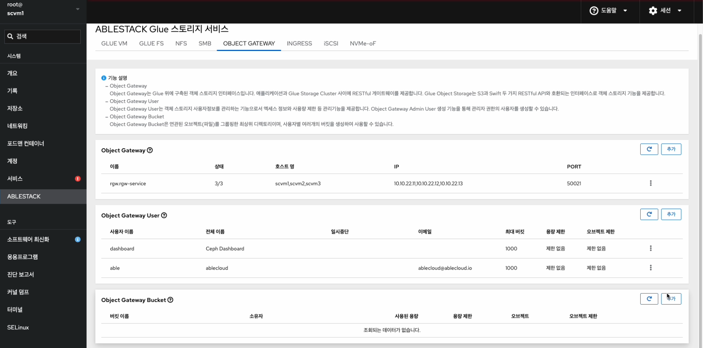{ align=center }
    - Object Gateway Bucket 카드란에 **추가** 버튼을 클릭합니다.
    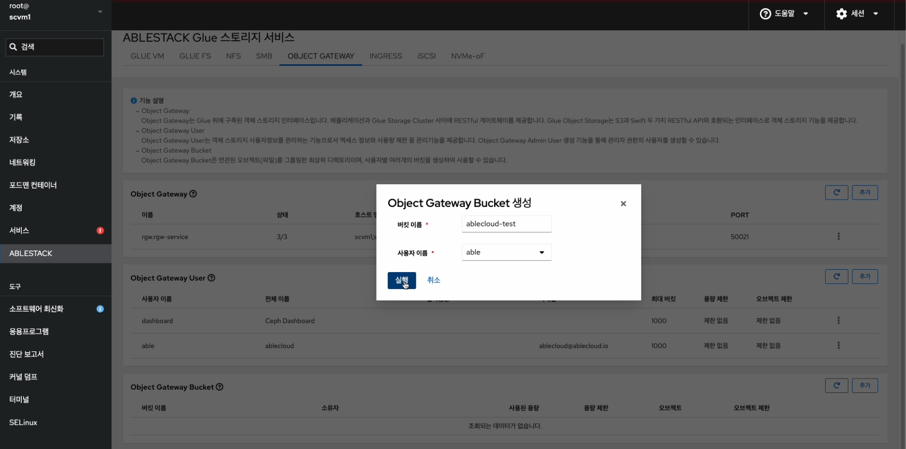{ align=center }
    - **버킷 이름** 정보를 입력합니다.
    - **사용자 이름** 정보를 입력합니다.
    - 위 항목들을 입력 및 확인 후에 **실행** 버튼을 클릭합니다.
    { align=center }
    - 생성된 화면입니다.

## Glue Object Gateway Bucket 수정

1. Glue Object Gateway Bucket 수정
    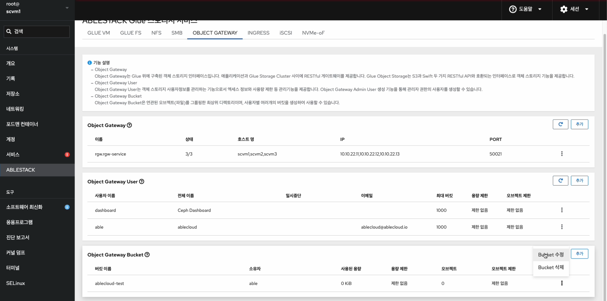{ align=center }
    - Object Gateway User 각 정보의 더보기란을 클릭하면 보이는 화면입니다.
    - **Bucket 수정** 버튼을 클릭합니다.
    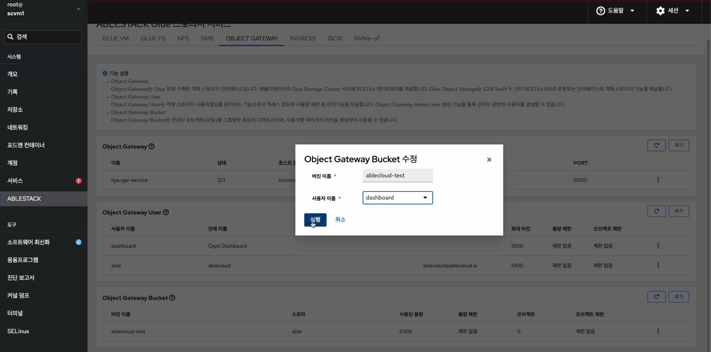{ align=center }
    - **버킷 이름** 정보를 확인합니다.
    - 변경될 **사용자 이름** 정보를 입력합니다.
    - 위 항목들을 입력 및 확인 후에 **실행** 버튼을 클릭합니다.
    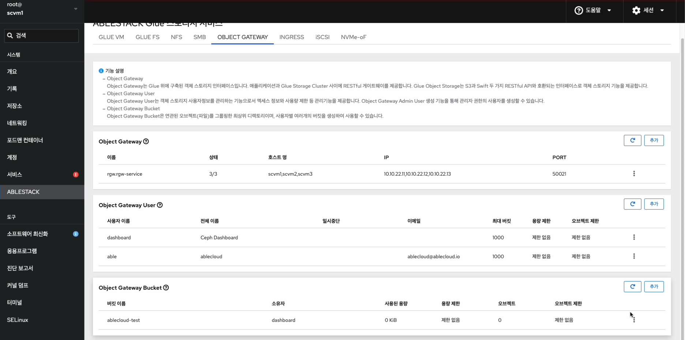{ align=center }
    - 수정된 화면입니다.

## Glue Object Gateway Bucket 삭제

1. Glue Object Gateway Bucket 삭제
    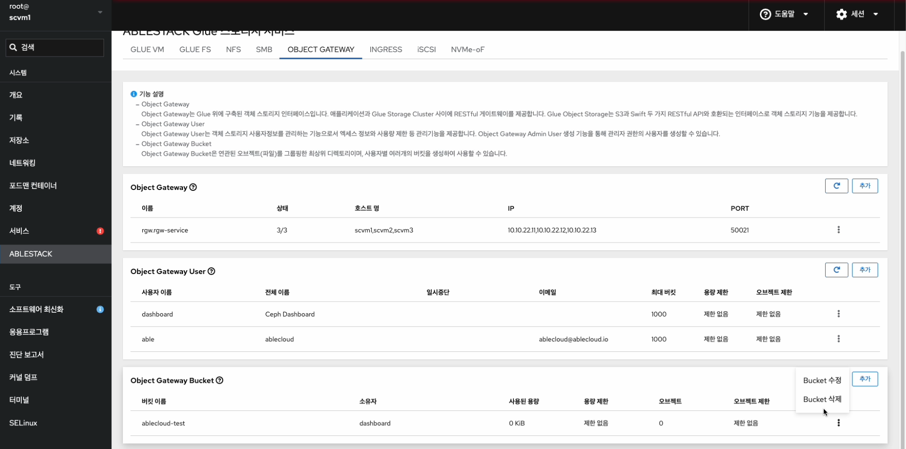{ align=center }
    - Object Gateway User 각 정보의 더보기란을 클릭하면 보이는 화면입니다.
    - **Bucket 삭제** 버튼을 클릭합니다.
    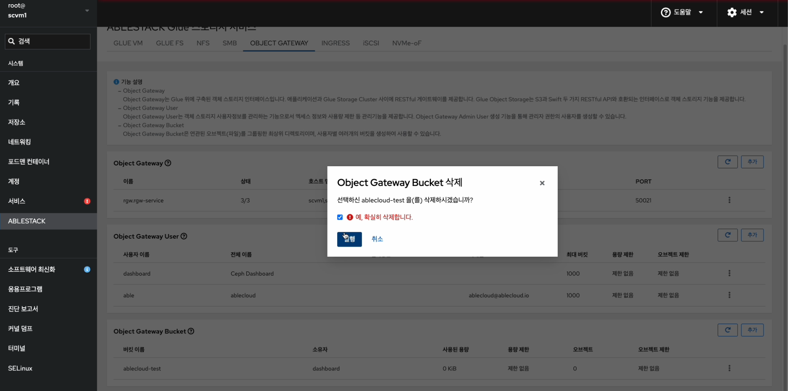{ align=center }
    - **예, 확실히 삭제합니다.** 란에 체크를 활성화 합니다.
    - 위 항목들을 입력 및 확인 후에 **실행** 버튼을 클릭합니다.
    { align=center }
    - 삭제된 화면입니다.

## Glue Object Storage 실사용 방법

!!! info
    현재 Glue Service 버전에서는 Object Storage Export 기능을 제공하지 않으므로 저희 ABLESTACK Mold 제품에서 Object Storage Service를 이용하실 수 있습니다.

### Glue Object Gateway Service 확인
1. Glue Object Gateway Service 확인
    { align=center }
    - Glue Object Gateway Service 을 확인하는 화면입니다.
    - Glue Object Gateway Service **상태** , **호스트명 및 IP** , **PORT** 정보를 확인 합니다.
    - Glue Object Gateway Service 사용할 **사용자** 정보를 확인 합니다.

!!! warning
    ABLESTACK Mold에서 작업한 스토리지 저장소 및 버킷은 Mold에서 삭제를 진행해주셔야 데이터가 남아 있지 않은 상태로 지워집니다.

### ABLESTACK Mold 작업
2. ABLESTACK Mold 작업
    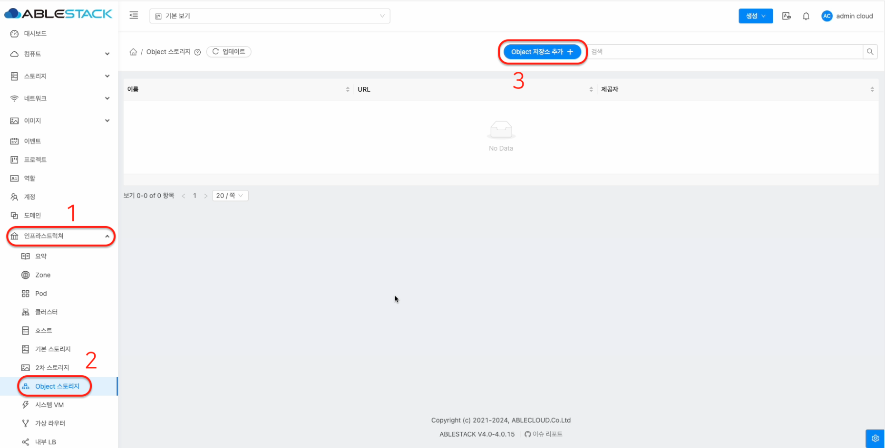{ align=center }
    - ABLESTACK Mold 로그인을 한 화면입니다.
    - 왼쪽 하단에서 **인프라스트럭쳐** -> **Object 스토리지** 경로로 클릭 합니다.
    - 가운데 상단에 **Object 저장소 추가** 버튼을 클릭 합니다.
    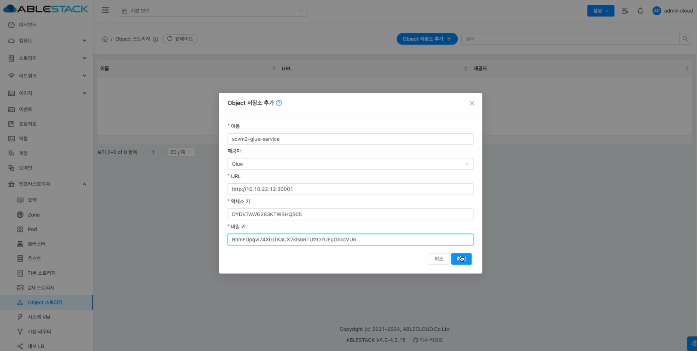{ align=center }
    - **이름** : 스토리지 저장소를 사용하기 위한 이름 입력 합니다.
    - **제공자** : **Glue** 제공자를 선택 합니다.
    - **URL** : Glue Object Service가 실행 되고 있는 **IP** 명과 **PORT** 를 확인한 것을 입력 합니다.
    - **엑세스 키** : Glue Object Service에서 사용할 사용자의 S3키를 조회하여 액세스 키를 복사하여 입력 합니다. ([사용자 S3 키 조회 방법](./rgw-manage-feature.md/#glue-object-gateway-user-s3))
    - **비밀 키** : Glue Object Service에서 사용할 사용자의 S3키를 조회하여 비밀 키를 복사하여 입력 합니다.
    - 위 항목들을 입력 및 확인 후에 **확인** 버튼을 클릭합니다.
    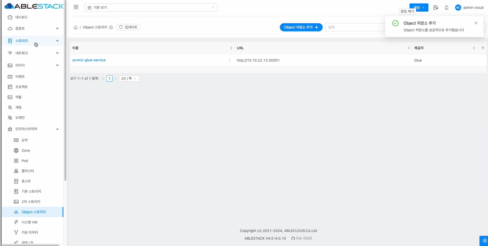{ align=center }
    - Object Storage 저장소가 생성된 화면입니다.
    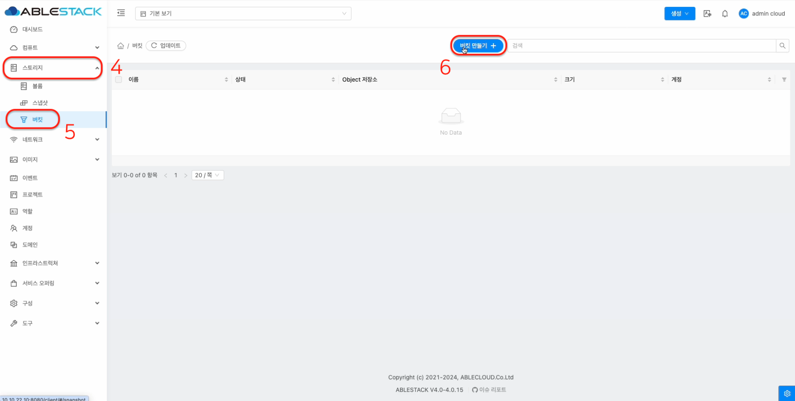{ align=center }
    - 왼쪽 상단에서 **스토리지** -> **버킷** 경로로 클릭 합니다.
    - 가운데 상단에 **버킷 만들기** 버튼을 클릭 합니다.
    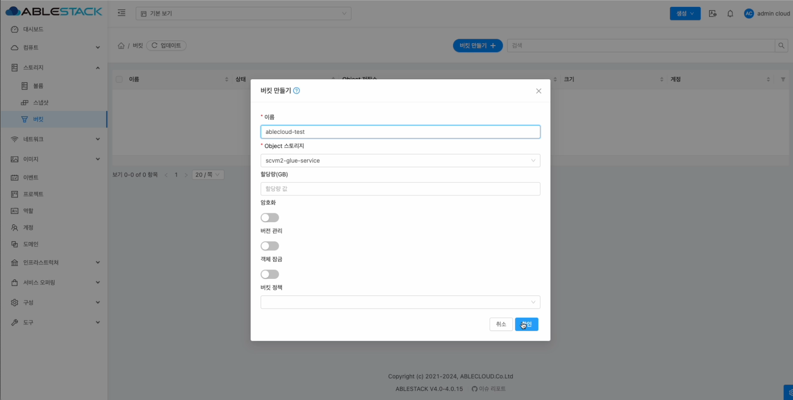{ align=center }
    - **이름** : 유일한 이름 입력 합니다.
    - **Object 스토리지** : 스토리지 저장소를 선택 합니다.
    - 위 항목들을 입력 및 확인 후에 **확인** 버튼을 클릭합니다.
    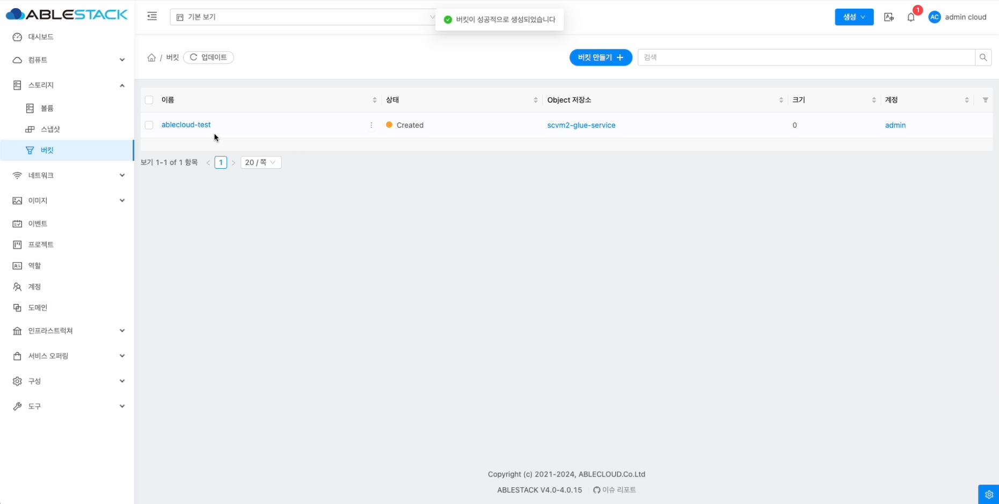{ align=center }
    - 버킷이 생성된 화면입니다.
    - 해당 **버킷 이름** 을 클릭 합니다.
    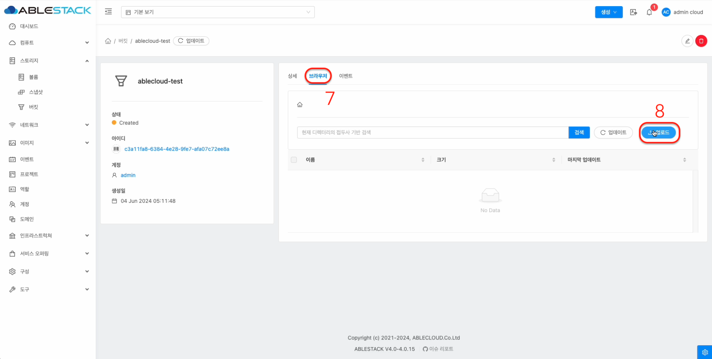{ align=center }
    - **브라우저** 탭을 클릭합니다.
    - **업로드** 버튼을 클릭 합니다.
    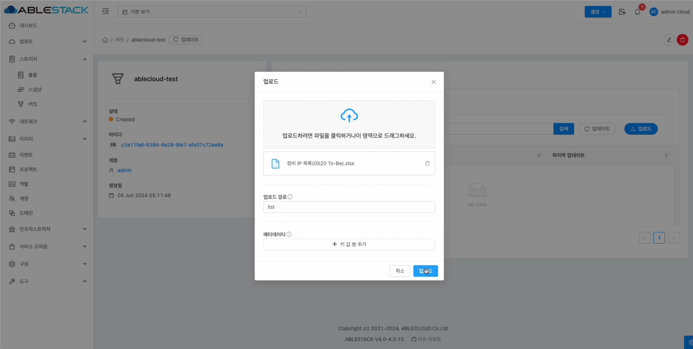{ align=center }
    - **업로드** 할 파일을 선택 합니다.
    - 업로드 할 **경로** 를 입력 합니다.
    - 위 항목들을 입력 및 확인 후에 **업로드** 버튼을 클릭합니다.
    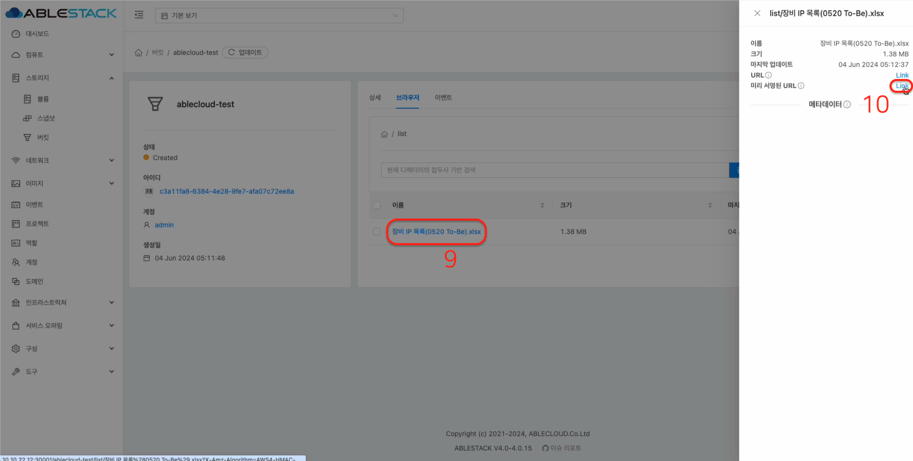{ align=center }
    - 해당 파일을 다운로드 하는 과정입니다.
    - 생성된 **폴더** 를 클릭 합니다.
    - 업로드된 **파일** 을 클릭 합니다.
    - 미리 서명된 URL 오른쪽에 **Link** 를 클릭 합니다.

### Glue Object Gateway 사용량 확인
3.  Glue Object Gateway 사용량 확인
    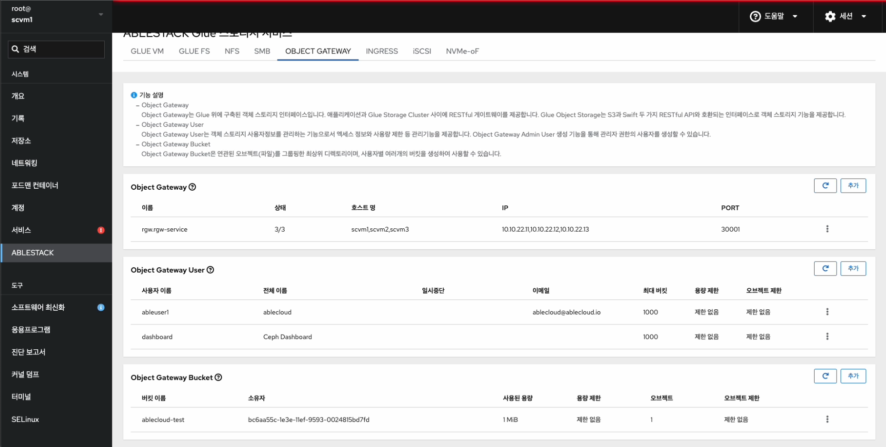{ align=center }
    - 사용되었던 버킷의 **사용량 및 오브젝트 갯수** 를 확인하실 수 있습니다.