## 개요
이 가이드는 ABLESTACK Mold 환경에서 호스트 GPU를 가상머신(VM)에 PCI Passthrough 방식으로 할당하는 방법에 대해 상세히 설명합니다. 사용자는 본 가이드를 통해 가상머신에 물리 GPU를 직접 연결(Passthrough)하여 고성능 연산이 필요한 워크로드를 처리할 수 있으며, GPU 자원의 할당 및 회수, 상태 확인, 가상머신 간 자원 재배치 등 다양한 관리 기능을 효과적으로 수행할 수 있습니다.

## 호스트 디바이스 연결

1. GPU를 할당할 호스트 목록을 확인
    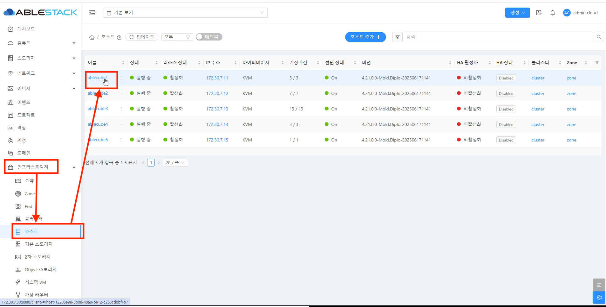{ align=center }

    * 왼쪽 사이드 메뉴중 **인프라스트럭쳐 > 호스트** 을 클릭합니다.
    * **비밀번호 :** 비밀번호를 입력합니다.
    * GPU를 할당할 호스트를 클릭하여 호스트 상세화면으로 이동합니다.

2. 호스트 디바이스탭 이동
    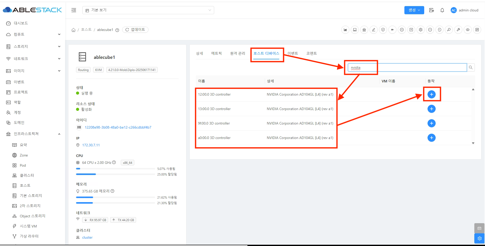{ align=center }

    * **호스트 디바이스 탭** 을 선택합니다.
    * **검색** 창에 nvidia를 검색하여 GPU 목록을 조회합니다.
    * **+** 버튼을 클릭하여 호스트 디바이스 이관 화면을 호출합니다.

3. 호스트 디바이스 이관할 가상머신 선택 이동

    !!! warnning
        호스트 디바이스를 가상머신에 할당(Passthrough)하기 위해서는 대상 가상머신이 반드시 **실행 중**인 상태여야 합니다.

    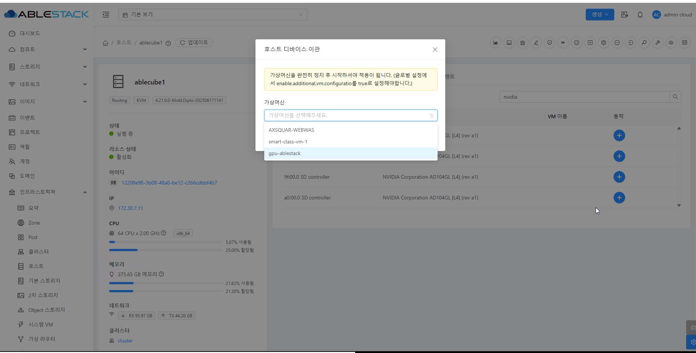{ align=center }

    * **가상머신** 을 선택합니다.

    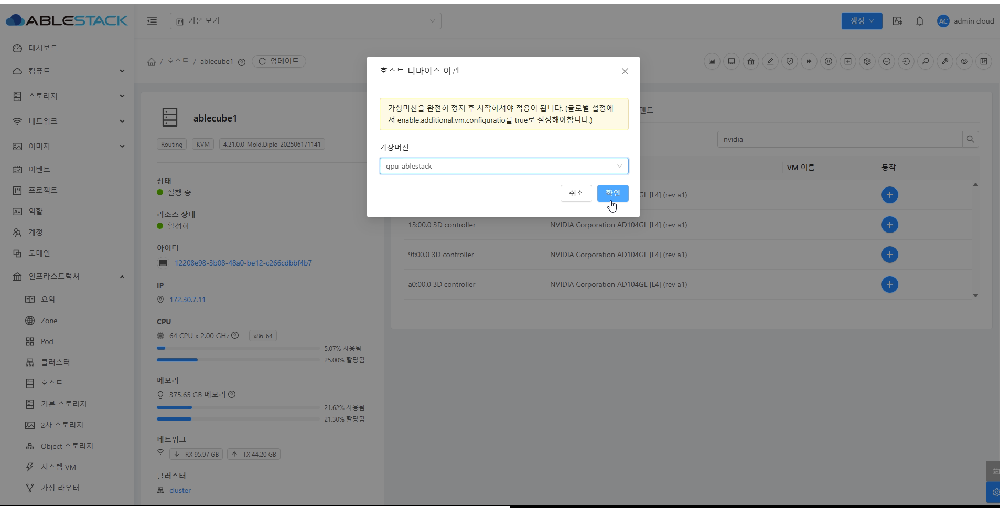{ align=center }

    * **확인** 버튼을 클릭하여 호스트 디바이스를 가상머신에 연결합니다.

4. GPU 연결된 가상머신을 확인합니다.

    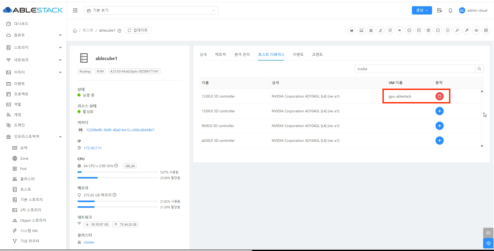{ align=center }

5. GPU가 적용된 가상머신 정지
    !!! warnning
        호스트 디바이스를 가상머신에 인식 시키기 위해서는 반드시 가상머신 **정지** 후 **시작** 을 해야합니다.

    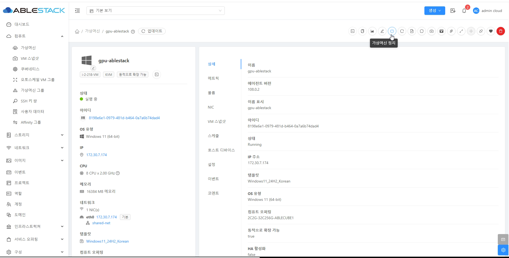{ align=center }

    * **가상머신 정지** 버튼을 클릭하여 가상머신 정지 화면을 호출합니다.

    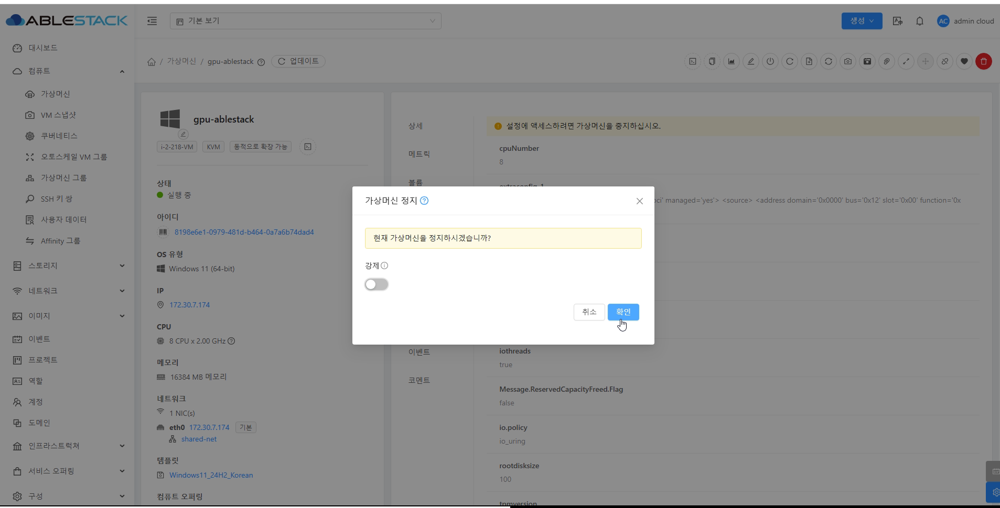{ align=center }

    * **확인** 버튼을 클릭하여 GPU 인식시킬 가상머신을 정지시킵니다.

6. GPU가 적용된 가상머신 시작
    !!! warnning
        호스트 디바이스를 가상머신에 인식 시키기 위해서는 반드시 가상머신 **정지** 후 **시작** 을 해야합니다.

    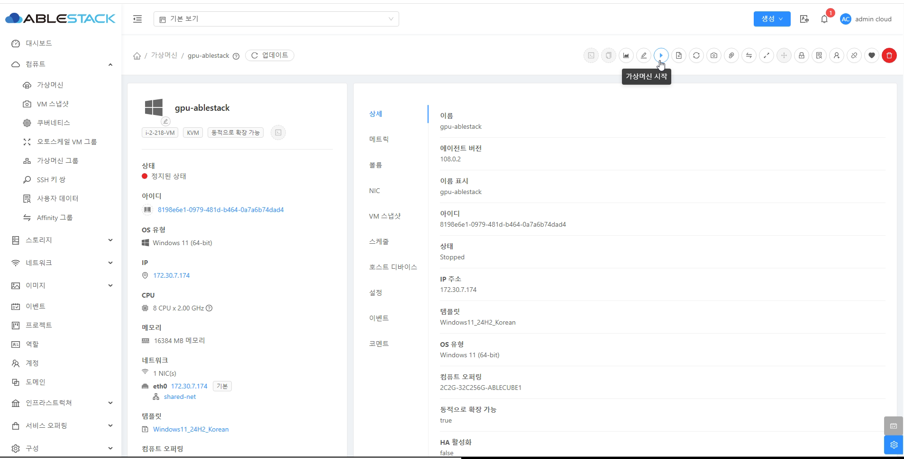{ align=center }

    * **가상머신 시작** 버튼을 클릭하여 가상머신 시작 화면을 호출합니다.

    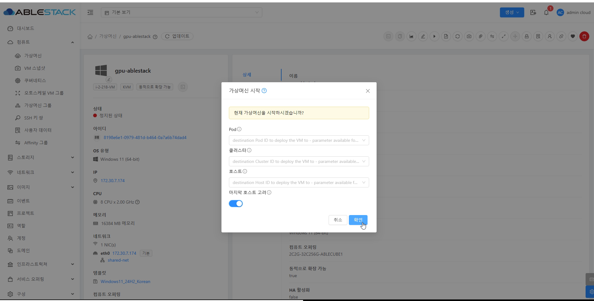{ align=center }

    * **확인** 버튼을 클릭하여 GPU 인식시킬 가상머신을 시작시킵니다.

7. GPU 적용 확인

    !!! info
        windows 가상머신 기준 확인 방법 입니다.

    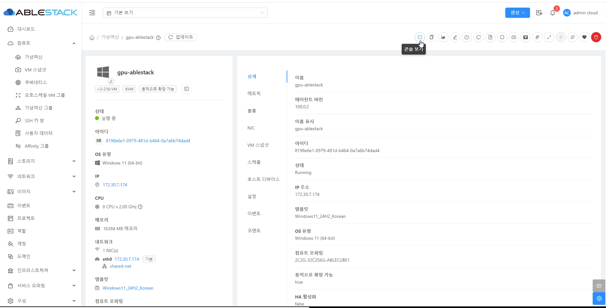{ align=center }

    * **콘솔 보기** 버튼을 가상머신 콘솔 화면을 호출합니다.

    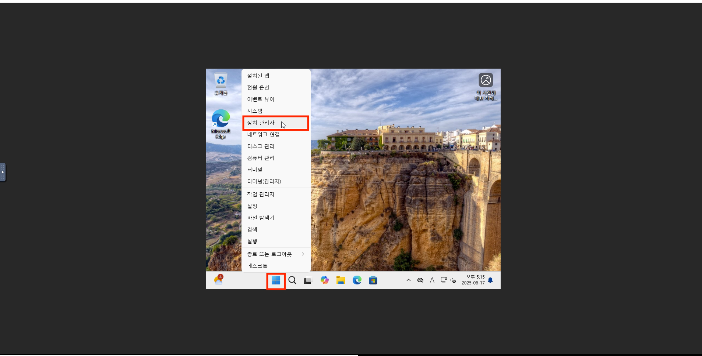{ align=center }

    * **장치 관리자** 버튼을 장지 관리자 팝업을 호출합니다.

    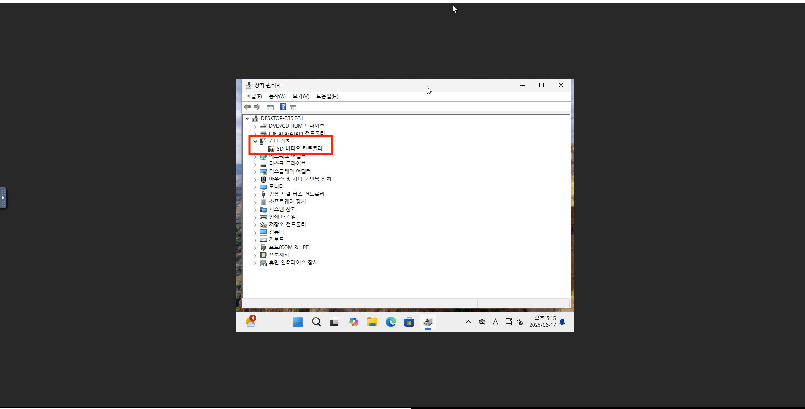{ align=center }

    * 3D 비디오 컨트롤러가 추가 되어있는지 확인합니다.

## 호스트 디바이스 제거

1. 가상머신에 있는 디바이스를 제거

    !!! warnning
        호스트 디바이스를 가상머신에 할당(Passthrough) 해제하기 위해서는 대상 가상머신이 반드시 **정지**인 상태여야 합니다.

    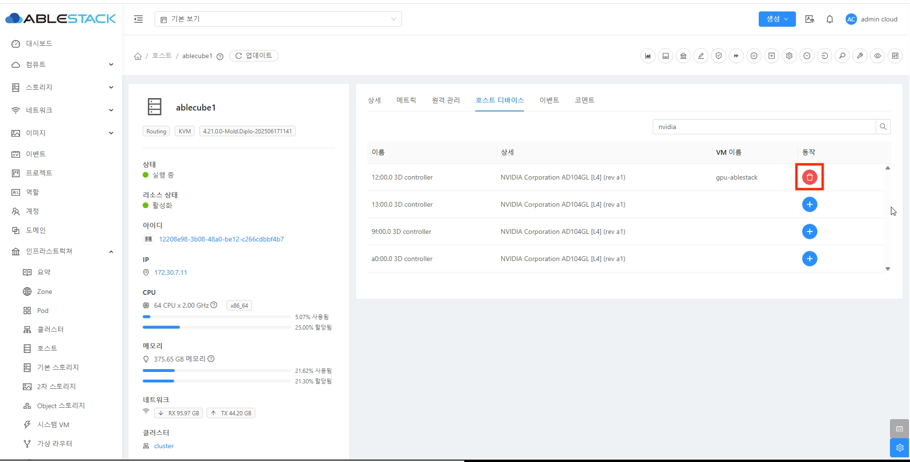{ align=center }

    * 제거할 디바이스의 **휴지통** 버튼을 클릭하여 팝업을 호출합니다.

    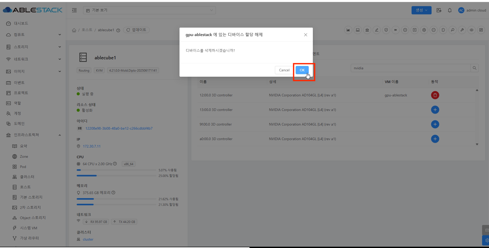{ align=center }

    * **OK** 버튼을 클릭하여 호스트 디바이스를 가상머신에 할당 해제합니다.

2. GPU 해제를 확인합니다.

    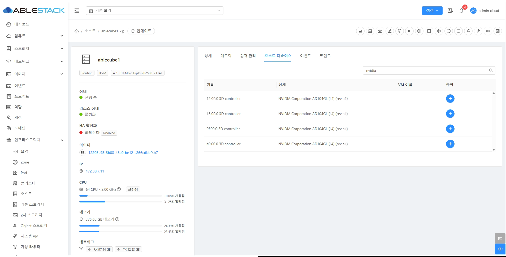{ align=center }
