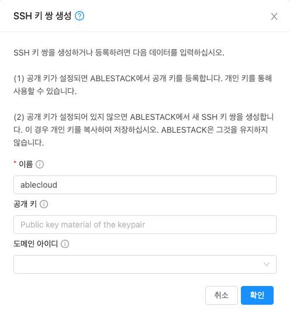

# Kubernetes Cluster 생성
ABLESTACK Mold 에서의 Kubernetes Cluster 생성 하는 가이드 입니다. 

## SSH 키 쌍 생성
Mold 에서 생성된 Kubernetes Cluster Node 에는 계정과 비밀번호를 이용한 SSH 접속은 제한을 하고 있습니다.
Node에 직접 접속 하기 위해서는 SSH 키를 이용하여 접속해야 하며, 기존의 SSH 키를 생성된 상태이면 해당 과정을 생략해도 됩니다.

1. **컴퓨트 > SSH 키 쌍** 으로 이동 후 **SSH 키 쌍 생성** 버튼을 클릭하여 SSH 키 생성 화면으로 이동합니다.

2. 입력 항목을 입력 후 **확인** 버튼을 클릭 합니다.

    {: .center }

    - 이름 : SSH 생성 이름을 입력 합니다.
    - 공개 키 : 보유 중인 공개 키를 등록 합니다. 보유 중인 키가 없는 경우 입력을 안해도 상관없습니다.
    - 도메인 아이디 : 도메인을 지정 할 경우 선택 합니다.

3. **다운로드** 버튼을 클릭하여 생성된 키를 다운로드 합니다.

    !!! warning
        Mold 에서 생성된 SSH 키는 해당 화면에서만 클립보드 복사 또는 다운로드 기능을 제공 합니다. 
        닫기 버튼을 클릭 후에는 다시 클립보드에 복사 또는 다운로드 기능을 제공하지 않습니다.
        또한 클립보드에 복사 또는 다운로드한 키를 분실한경우 가상머신 또는 Node에 접속이 제한될수 있습니다.

   {: .center }

## 쿠버네테스 클러스터 생성

1. **컴퓨트 > 쿠버네테스** 으로 이동 후 **쿠버네테스 클러스터 생성** 버튼을 클릭하여 쿠버네테스 클러스터 생성 화면으로 이동합니다.

2. 클러스터 생성 화면에서 입력 항목을 입력 후 **확인** 버튼을 클릭 합니다.

    {: .center }

    - 이름 : Kubernetes 이름을 입력 합니다.
    - 설명 : Kubernetes 설명을 입력 합니다.
    - Zone : Zone을 선택 합니다.
    - 쿠버네테스 버전 : Kubernetes ISO에서 등록한 ISO 버전을 선택 합니다.
    - 컴퓨트 오퍼링 : Kubernetes Node의 컴퓨트 오퍼링을 선택 합니다.
    - 노드 루트 디스크 크리(GB) : 각 노드의 루트 디스크 크기를 입력 합니다.
    - 네트워크 : Kubernetes 용 생성한 네트워크를 선택 합니다.
    - HA 활성화 됨 : 마스터 노드를 2개 이상 생성 할 경우 선택 합니다.
    - 마스터 노드 : HA 를 활성화 할 경우 보이는 입력창 입니다. 마스터 노드 수를 입력 합니다.
    - 외부 로드 밸런서 IP 주소 : 외부 로드 밸런서 IP 주소를 입력 합니다.
    - 클러스터 크기 : Worker Node 수를 입력합니다.
    - SSH 키 쌍 : 생성된 SSH 키를 선택 합니다.
    - 사설 레지스트리 : 사설 레지스트리를 보유 중인 상태이면 선택 후 값을 입력 합니다.

    !!! note "컴퓨트 오퍼링"
        Kubernetes의 각 노드는 생성 후 개별적으로 오퍼링이 변경이 가능합니다.

    !!! note "사설 레지스트리"
        Kubernetes는 기본적으로 외부와 통신이 가능한 환경에서만 구성이 됩니다.
        외부와 통신이 안되는 경우 사설 레지스트리를 먼저 구성 후 Kubernetes Cluster를 생성 해야 합니다.