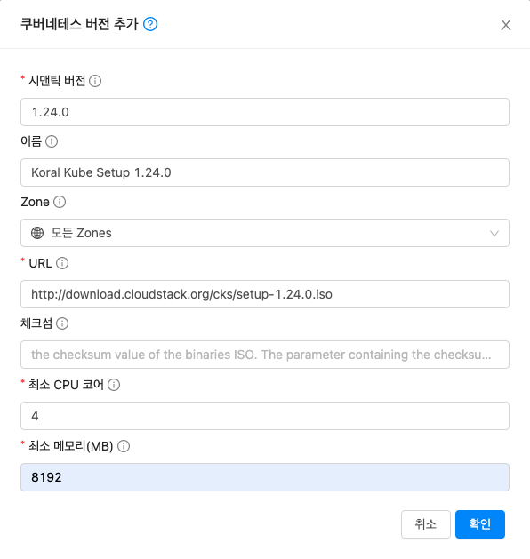

# Kubernetes ISO 등록
ABLESTACK Mold 에서 사용할 Kubernetes ISO를 등록하는 방법을 설명합니다.

## ISO 등록
ABLESTACK Mold 에서 사용되는 ISO는 Kubernetes Engin과 Mold의 API 통신을 위한 재빌드가 된 ISO 입니다.
해당 링크의 ISO를 사용해야 정상적인 Kubernetes 서비스를 사용할 수 있습니다.

[ISO 다운로드 사이트 이동](https://images.ablecloud.io/Koral/){:target='_blank'}

!!! Warning
    Kubernetes ISO 등록 버전은 예시 입니다. 해당 사이트에 접속하여 Kubernetes ISO 버전을 확인하고 등록 후 사용가능 하며,
    해당 사이트에서 제공하는 ISO 이외의 kubernetes 버전은 사용 할 수 없습니다.

**이미지 > 쿠버네테스 ISOs** 화면으로 이동 후 **쿠버네테스 버전추가** 버튼을 클릭 합니다.

입력 항목을 입력 후 **확인** 버튼을 클릭 합니다.

{:class="imgCenter imgBorder"}

   - 시맨틱 버전 : 시맨틱 버전 항목은 등록 할려는 ISO 의 버전을 입력 합니다.
   - 이름 : 등록 ISO 의 이름을 입력 합니다.
   - URL : ISO 등록 URL 을 입력 합니다. URL은 위 사이트에서 URL을 복제후 해당 값을 입력 합니다.
   - 체크섬 : 등록 ISO 의 체크섬 값을 입력 합니다.
   - 최소 CPU 코어 : 최소 CPU 코어 값을 입력 합니다.
   - 최소 메모리(MB) : 최소 메모리 값을 입력 합니다.