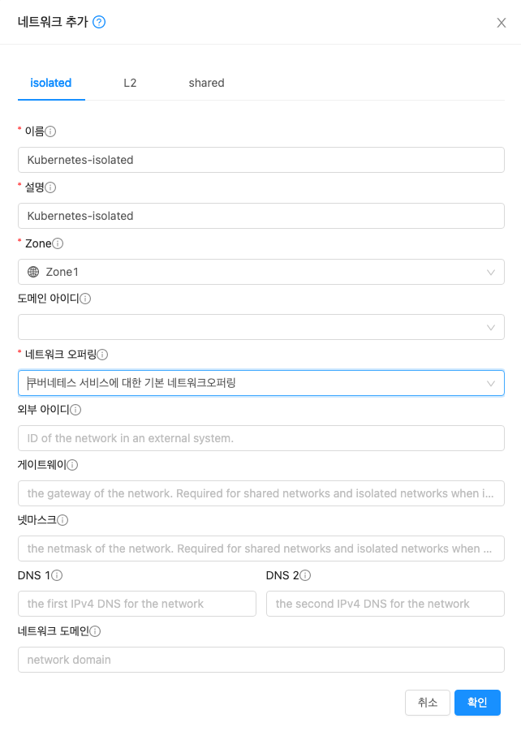

# 네트워크 생성
ABLESTACK Mold 에서 Kubernetes Cluster 배포를 하기 위해서는 **isolated** 네트워크를 사용하여 배포가 되어야 합니다.

## isolated 네트워크 생성
ABLESTACK Mold 화면에서 **네트워크 > 가상머신용 네트워크** 화면에서 **네트워크 추가** 버튼을 클릭하여 네트워크 생성 화면으로 이동합니다.

!!! info
    해당 입력 값은 예시 입니다.

{:class="imgCenter"}

- 이름 : 네트워크 이름을 입력 합니다.
- 설명 : 네트워크 설명을 입력 합니다.
- Zone : Zone을 선택 합니다.
- 도메인 아이디 : ABLESTACK Mold 의 도메인을 선택 합니다. 선택 하지 않을 경우 admin 소유로 생성 됩니다.
- 네트워크 오퍼링 : **쿠버네테스 서비스에 대한 기본 네트워크오퍼링** 을 선택 합니다. Kubernetes는 해당 오퍼링을 필수로 선택 해야 합니다.
- 외부 아이디 : 외부 시스템의 네트워크 ID를 입력 합니다.
- 게이트웨이 : 게이트웨이를 입력 합니다. 미 입력시 **10.1.1.1** 게이트웨이로 네트워크가 생성 됩니다.
- 넷마스크 : 넷마스크를 입력 합니다. 미 입력시 **255.255.255.0** 넷마스크로 네트워크가 생성 됩니다.
- DNS1, DNS2 : DNS 정보를 입력 합니다. 미 입력시 Zone 생성시 입력된 DNS 정보로 생성됩니다.
- 네트워크 도메인 : 네트워크 도메인을 입력 합니다. 미 입력시 **cs2bcloud.internal** 도메인으로 생성 됩니다.
