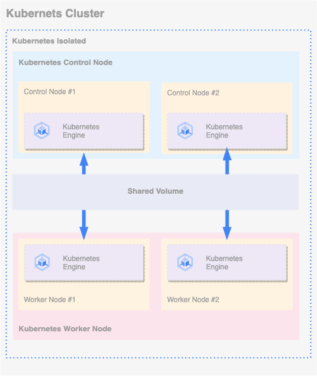

# 구성 개요
Kubernetes는 컨테이너화된 애플리케이션의 배포, 확장 및 관리를 자동화하기 위한 오픈 소스 시스템이며, 
본 문서에서는 Mold의 시스템을 이용한 Kubernetes 배포 및 서비스 배포까지 기술하고 있습니다.

!!! warning
    본 문서의 Kubernetes 버전은 1.24.0 기준으로 작성되어 있습니다.

!!! info
    본 문서에서 서비스는 Budibase 를 기준으로 작성 되여 있습니다.

## 아키텍처
Kubernetes Control Node 및 Worker Node 는 이중화를 위해서 2개씩 Mold를 통하여 배포 하며,
각 Node 의 공유 볼륨은 별도의 가상 머신을 생성하여 해당 가상머신에서 NFS 서비스를 이용하여 공유 볼륨을 설정합니다.

!!! info
    공유 볼륨용 가상머신은 Ubuntu Desktop 을 활용하여 진행 합니다.

{: .center }

## 사전 필요 사항

### ABLESTACK Mold 글로벌 설정 변경
Mold 화면에서 **구성 > 글로벌 설정** 화면으로 이동 후 검색 창에 아래 항목을 검색합니다.
```
cloud.kubernetes.service.enabled
```
해당 설정 값을 **false** 에서 **true** 로 변경 후 Mold에 접속 하여 아래 명령어를 이용하여 Mold 서비스를 재기동 합니다.
```
systemctl restart cloudstack-management
```
서비스 재기동 후 Mold 메뉴에서 **컴퓨트 > 쿠버네테스** 메뉴를 확인 합니다.

### kubectl 설치
Kubernetes 구성 후 kubernetes engin을 설정하기 위해서는 kubectl 서비스가 사용자 PC에 설치되어 있어야 합니다.
사용자 PC의 OS 별 kubectl 설치 가이드는 해당
**[링크](https://kubernetes.io/docs/tasks/tools/){:target='_blank'}** 의 **Install Tolls** 의 **kubectl** 부분을 참고하시기 바랍니다.

### helm 설치
helm 은 Kubernetes 용 패키기 관리자 입니다. Budibase 설치는 helm을 이용하여 설치가 되며, helm 설치는 해당
**[링크](https://helm.sh/docs/intro/install/){:target='_blank'}** 를 참고하시기 바랍니다.