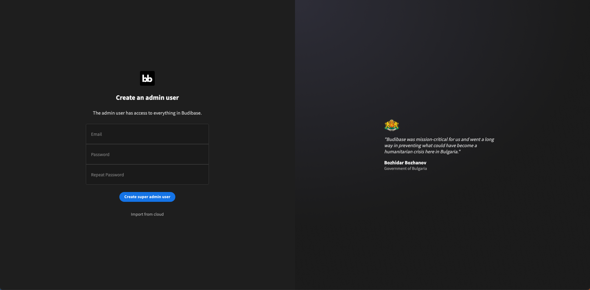

# 서비스 배포

Kubernetes 에서 운영이 가능한 Budibase 배포에 대하여 설명하고 있습니다.

## Budibase 배포

!!! Info
     Budibase 배포는 ABLESTACK Mold에서 Kubernetes 사용법을 설명하기 위해 작성 되어 있습니다. 각 서비스 별로 Kubernets 환경에 맞는 서비스를 배포하시면 됩니다.
!!! Info
     Budibase 에 대한 정보는 해당 [링크](https://docs.budibase.com/docs/kubernetes-k8s/){:target='\_blank'} 에서 확인 하실수 있습니다.
     해당 절차에서는 helm 패키지 서비스를 이용하여 배포 합니다.

### Budibase 배포
   
```shell
helm repo update
helm repo add budibase https://budibase.github.io/budibase/
helm install --create-namespace --namespace budibase budibase budibase/budibase
```

### 배포 확인

POD 배포 확인
```shell
kubectl get pods -n budibase
```

```shell title="POD 배포 현황"
NAME                                                 READY   STATUS    RESTARTS   AGE
app-service-99b5ff8bd-hchhm                          1/1     Running   0          3d18h
app-service-99b5ff8bd-rrjhg                          1/1     Running   0          3d19h
budibase-couchdb-0                                   2/2     Running   0          3d19h
budibase-couchdb-1                                   2/2     Running   0          3d19h
budibase-couchdb-2                                   2/2     Running   0          3d19h
budibase-ingress-nginx-controller-5b8cc54fc7-pfz6f   1/1     Running   0          3d19h
minio-service-8675dcb8cb-gm9xm                       1/1     Running   0          3d19h
proxy-service-5c49f9dc6b-ggfxj                       1/1     Running   0          3d19h
redis-service-9db9b578b-85ds7                        1/1     Running   0          3d19h
worker-service-998457b54-sq9fn                       1/1     Running   0          3d19h
```

service 배포 확인
```shell
kubectl get svc -n budibase
```

```shell title="service 배포 현황"
NAME                                          TYPE           CLUSTER-IP       EXTERNAL-IP   PORT(S)                      AGE
app-service                                   ClusterIP      10.101.252.137   <none>        4002/TCP                     3d19h
budibase-budibase                             ClusterIP      10.96.108.133    <none>        10000/TCP                    3d19h
budibase-couchdb                              ClusterIP      None             <none>        5984/TCP                     3d19h
budibase-ingress-nginx-controller             LoadBalancer   10.101.103.97    10.10.1.62    80:32097/TCP,443:30356/TCP   3d19h
budibase-ingress-nginx-controller-admission   ClusterIP      10.107.203.189   <none>        443/TCP                      3d19h
budibase-svc-couchdb                          ClusterIP      10.108.107.1     <none>        5984/TCP                     3d19h
minio-service                                 ClusterIP      10.105.144.216   <none>        9000/TCP                     3d19h
proxy-service                                 ClusterIP      10.99.154.165    <none>        10000/TCP                    3d19h
redis-service                                 ClusterIP      10.111.230.48    <none>        6379/TCP                     3d19h
worker-service                                ClusterIP      10.102.76.21     <none>        4003/TCP                     3d19h
```

### Budibase 접속
```shell
kubectl get ingress -n budibase
```

```shell title="해당 아이피와 포트를 이용하여 접속"
NAME                CLASS    HOSTS   ADDRESS      PORTS   AGE
budibase-budibase   <none>   *       10.10.1.62   80      3d19h
```

해당 명령어를 이용하여 외부 아이피를 확인 후 Budibase에 접속 하실수 있습니다.
{:class="imgCenter"}
