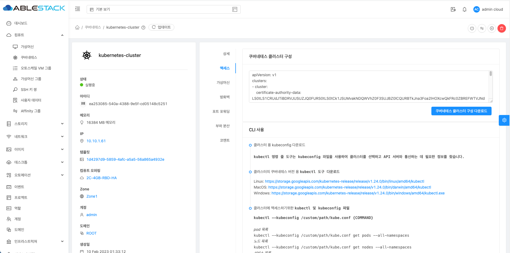

# Kubernetes Cluster 설정

Kubernetes Cluster의 Dashboard 설정 및 kubectl 명령어를 이용한 서비스 확인

## Kubernetes Dashboard 배포

Kubernetes 정보를 웹에서 확인 가능한 Dashboard를 배포하는 절차를 설명합니다.

!!! Info
    최신 Dashboard YAML 파일을 다운로드 하기 위해
    [Kubernetes 도움말](https://kubernetes.io/ko/docs/tasks/access-application-cluster/web-ui-dashboard/){:target='\_blank'} 을
    확인 하세요.

  1. Dashboard 배포용 YAML 파일 다운로드
       ```bash
       wget https://raw.githubusercontent.com/kubernetes/dashboard/v2.5.0/aio/deploy/recommended.yaml
       ```

  2. Dashboard 배포
      ```bash
      kubectl apply -f dashboard.yaml
      ```

## admin-user 사용자 생성

Dashboard 접속을 위한 사용자를 생성하는 절차를 설명합니다.

  1. dashboard-user.yaml 생성
      ```yaml
      apiVersion: v1
      kind: ServiceAccount
      metadata:
      name: admin-user
      namespace: kubernetes-dashboard
      ---
      apiVersion: rbac.authorization.k8s.io/v1
      kind: ClusterRoleBinding
      metadata:
      name: admin-user
      roleRef:
      apiGroup: rbac.authorization.k8s.io
      kind: ClusterRole
      name: cluster-admin
      subjects:
      - kind: ServiceAccount
        name: admin-user
      namespace: kubernetes-dashboard
      ---
      apiVersion: v1
      kind: Secret
      metadata:
      name: admin-user-secret
      namespace: kubernetes-dashboard
      annotations:
      kubernetes.io/service-account.name: admin-user
      type: kubernetes.io/service-account-token
      ```

  2. 사용자 배포
    ```bash
    kubectl create -f dashboard-user.yaml
    ```
  3. 사용자 토큰 획득
    ```bash
    kubectl --kubeconfig kube.conf -n kubernetes-dashboard describe secret admin-user | grep token: | awk '{print $2}'
    ```

    해당 명령어를 입력하여 생성된 토근을 이용하여 Dashboard 에 접속할 수 있습니다.

## Dashboard 외부 접속 수정

Dashboard 를 외에 접속 할 수 있도록 수정하는

  1. dashboard 설정 파일 열기
    ```shell
    kubectl edit svc -n kubernetes-dashboard
    ```

  2. Dashboard 정보 수정
     ```yaml
     spec:
     clusterIP: 10.108.28.45
     clusterIPs:
       - 10.108.28.45
     externalTrafficPolicy: Cluster
     internalTrafficPolicy: Cluster
     ipFamilies:
       - IPv4
     ipFamilyPolicy: SingleStack
     ports:
       - nodePort: 32444
     port: 443
     protocol: TCP
     targetPort: 8443
     selector:
     k8s-app: kubernetes-dashboard
     sessionAffinity: None
     type: NodePort
     status:
     loadBalancer: {}
     ```
  3. **네트워크 > 가상머신용 네트워크** 리스트 화면에서 네트워크 선택 후 **Public IP 주소** 탭에서 **새 IP 주소 가져오기** 버튼을 클릭 후 IP 선택 후 **확인** 버튼을 클릭 하여 새 IP 할당
     {: .center }
  4. **네트워크 > 가상머신용 네트워크** 리스트 화면에서 네트워크 선택 후 **Public IP 주소** 탭에서 새 IP 주소를 클릭 후 **부하 분산** 탭을 선택 합니다.
    **이름**, **Public 포트**, **사설포트** 및 가상머신을 추가 후 **확인** 버튼을 클릭 합니다.