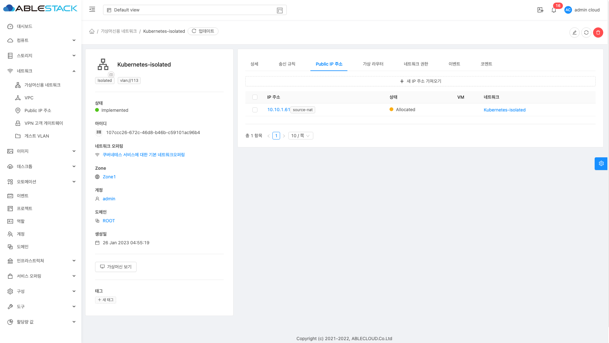
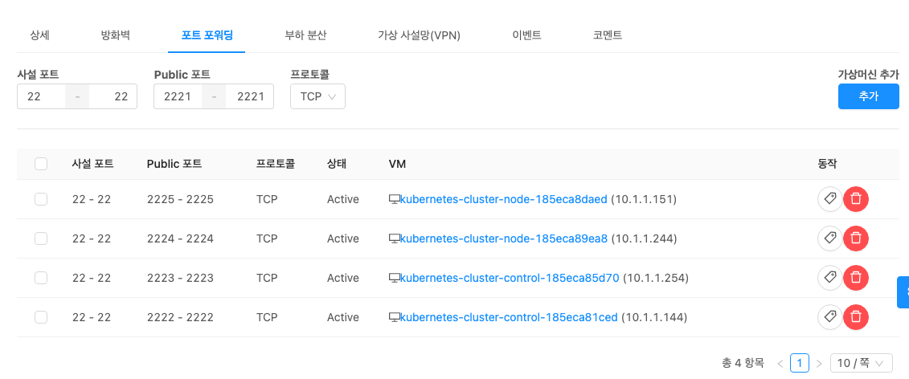
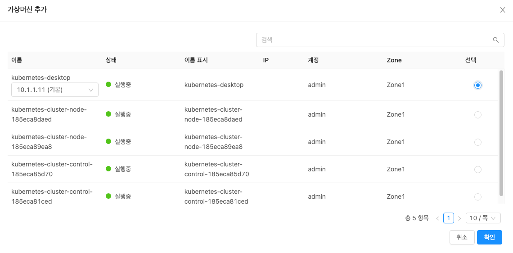

# 공유 볼륨 설정

Kubernetes Node에서 사용할 공유 볼륨 설정을 설명합니다. 볼륨 공유는 NFS Protocol을 이용하여 공유하며, Ubuntu Desktop을
이용하여 공유 설정을 진행 합니다.

## Ubuntu Desktop SSH 설정

!!! Info
      Ubuntu OS 설치 가이드는 다른 [문서]()로 대체하며 해당 문서에서는 제공하지 않습니다.

Ubuntu Desktop Console 에서 아래 명령어를 이용하여 SSH Server 를 설치 합니다.
   ```shell
   sudo apt-get install openssh-server
   ```
ssh 방화벽 설정을 위해 아래 명령어를 입력 합니다.
   ```shell
   sudo ufw allow ssh
   ```
Mold에서 **네트워크 > 가상머신용 네트워크** 화면에서 Kubernetes용 네트워크를 선택 후 **Public IP 주소** 탭 화면으로 이동하여 **IP 주소** 를 클릭하여 설정 화면으로 이동합니다.

{:class="imgCenter imgBorder"}

**포트 포워딩** 탭에서 **사설 포트**, **Public 포트** 각각 입력란에 **22**, **2221** 입력 후 **추가** 버튼을 클릭 하여 Ubuntu Desktop 을 선택 후 **확인** 버튼을 클릭 합니다.
   
{:class="imgCenter imgBorder"}

{:class="imgCenter imgBorder"}

아래 명령어를 이용하여 SSH 접속을 합니다.

```shell
ssh -p 2221 kubernetes@10.10.1.61
```

!!! info
     해당 아이피 및 포트는 예시 입니다.

## Ubuntu Desktop NFS 서비스 설치 및 설정

### NFS Server 및 portmap 서비스 설치

```shell
sudo apt-get -y install nfs-kernel-server portmap
```

### 공유 폴더 생성

```shell
mkdir kubernetes
```

### 공유 폴더 권한 설정

exports 파일 오픈 후 아래 설정을 추가 합니다.

```shell title="sudo vi /etc/exports" linenums="1"
/kubernetes *(rw,no_root_squash)
```

## Kubernetes 공유 볼륨 설정

!!! Info
     본문에서는 Kubernetes Node에 NFS 볼륨 마운트 진행을 한번만 진행 하지만 각 Node 수만큼 반복하여 진행 해야 합니다.

!!! Info
     Node 접속 정보는 Mold의 **컴퓨트 > 쿠버네테스** 화면에서 **가상머신** 탭에서 확인이 가능합니다.

### Node SSH 접속

!!! Info
    ABLESTACK Mold에서 생성된 Kubernetes의 각 Node에는 직접적인 아이디와 패스워드를 이용한 SSH 접속은 할 수 없습니다.
    기존에 생성한 SSH Key를 이용하여 접속해야 합니다.

```shell
ssh -i [SSH Key 파일명] cloud@[public IP] -p [SSH 포트]
```

- SSH key 파일명 : SSH key 생성된 파일명
- public IP : 네트워크에서 생성된 public IP
- SSH 포트 : 각 Node별로 포트포워딩된 포트. 위 이미지 기준으로 **SSH 포트**

{:class="imgCenter imgBorder"}

```shell
ssh -i ablecloud.key cloud@10.10.1.61 -p 2222
```

###  Node 에 NFS 마운트

SSH 접속 후 Node 에 fstab 정보를 아래와 같이 추가 합니다.

```shell title="sudo vi /etc/exports" linenums="1"
10.1.1.11:/kubernetes	/home/cloud/nfs	nfs	defaults	0	0
```

fstab 의 정보로 마운트 진행

```shell
sudo mount -a
```

### Kubernetes 퍼시스턴트 볼륨 설정

각 Node의 퍼시스턴트 볼륨을 사용하도록 yaml 파일 생성 후 배포합니다.

!!! Info
    Budibase 서비스 배포는 2개의 퍼시스턴트 볼륨 클래임이 생성됩니다. 각 클래임은 별도의 퍼시스턴트 볼륨으로 구성되어야 합니다.

```yaml title="pv-volume.yaml 생성" linenums="1"
apiVersion: v1
kind: PersistentVolume
metadata:
    name: redis-pv
spec:
    capacity: #용량
        storage: 300Gi # PersistentVolume(PV) 사이즈를 지정한다.
    accessModes:
        - ReadWriteMany #여러 클라이언트를 위한 읽기 쓰기 마운트
    nfs:
        server: 10.1.1.11 # nfs서버의 ip주소
        path: /kubernetes #nfs서버에서 공유한 디렉토리명
---
apiVersion: v1
kind: PersistentVolume
metadata:
    name: minos-pv
spec:
    capacity: #용량
        storage: 300Gi # PersistentVolume(PV) 사이즈를 지정한다.
    accessModes:
        - ReadWriteMany #여러 클라이언트를 위한 읽기 쓰기 마운트
    nfs:
        server: 10.1.1.11 # nfs서버의 ip주소
        path: /kubernetes #nfs서버에서 공유한 디렉토리명
```

```shell title="퍼시스턴트 볼륨 배포"
kubectl apply -f pv-volume.yaml
```

``` shell
kubectl get pv task-pv-volume
```

확인 결과 **STATUS** 가 **Available** 상태이며 이는 아직 퍼시스턴트 볼륨 클레임이 바인딩 되지 않았다는 것을 의미합니다.

```shell title="퍼시스턴트 볼륨 확인"
NAME             CAPACITY   ACCESSMODES   RECLAIMPOLICY   STATUS      CLAIM     STORAGECLASS   REASON    AGE
redis-pv         300Gi      RWO           Retain          Available             manual                   4s
minos-pv         300Gi      RWO           Retain          Available             manual                   4s
```