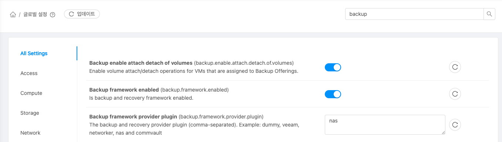
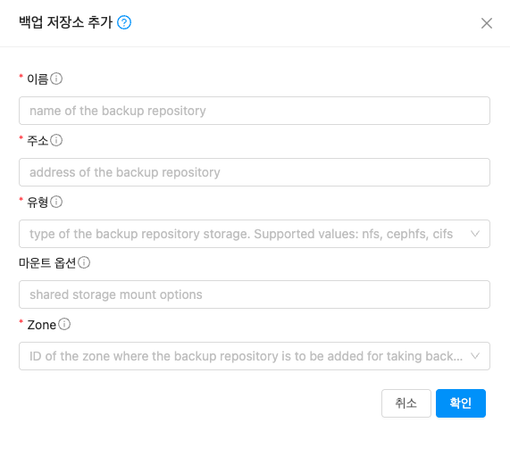
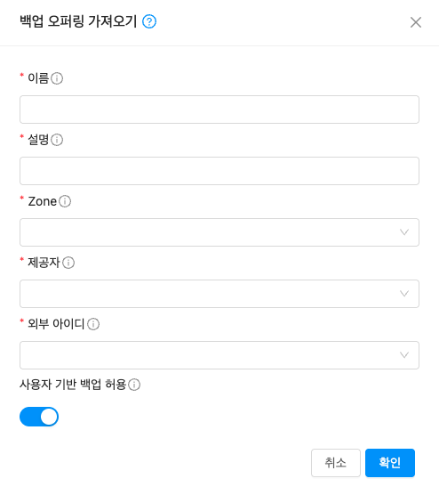
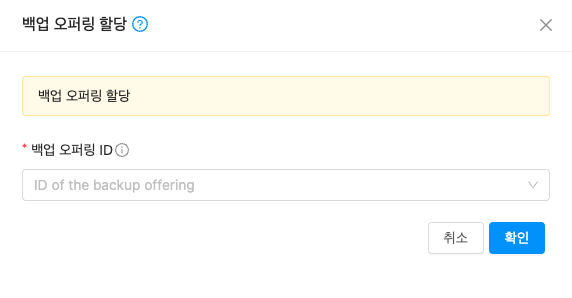
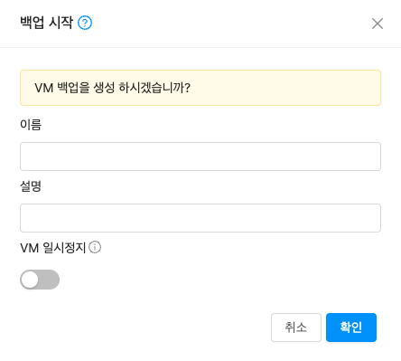
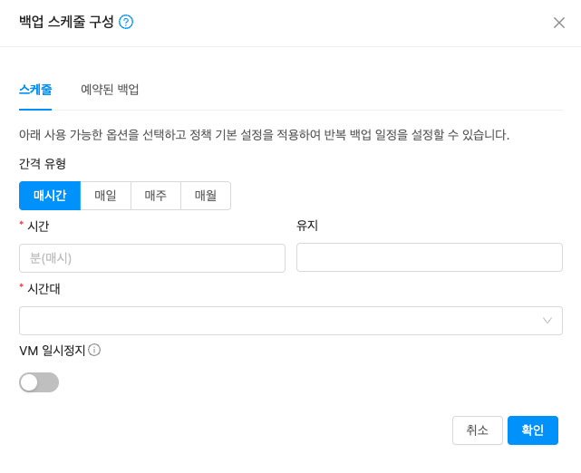

# NAS 백업 구성 개요
ABLESTACK 은 Mold UI를 이용해 NAS 백업 저장소와 연동하여 가상머신의 데이터를 비주기적 또는 주기적으로 안전하게 백업하고, 복원할 수 있는 기능을 제공합니다.

NAS 백업 저장소를 연동하여 백업 기능을 사용하기 위해서는 글로벌 설정, 백업 저장소 추가, 백업 오퍼링 가져오기, 가상머신에 백업 오퍼링 할당 작업이 필요합니다.

## 글로벌 설정
{ .imgCenter .imgBorder }

- 구성 > 글로벌 설정 메뉴에서 우측 상단에 backup 을 검색합니다.
- **backup.framework.enabled** 항목을 활성화합니다.
- **backup.enable.attach.detach.of.volumes** 항목을 활성화합니다.
- **backup.framework.provider.plugin** 항목에 nas 를 입력하여 편집합니다.
- 설정을 변경한 후 mold 서비스를 재시작하여 백업 관련 메뉴가 활성화 되었음을 확인합니다.

## 백업 저장소 추가
{ .imgCenter .imgBorder }

- 구성 > 백업 저장소 메뉴에서 **백업 저장소 추가** 버튼을 클릭하여 백업 저장소 추가 화면을 볼러옵니다.
- **이름** 정보를 입력합니다.
- **주소** 정보는 <서버 IP>:/경로 형태로 입력합니다.
- **유형** 정보는 nfs 를 선택합니다.
- **마운트 옵션** 정보는 호스트에 마운트 할 때 전달해야하는 마운트 옵션을 입력합니다.
- **Zone** 정보는 백업 저장소를 설정할 Zone 을 선택합니다.
- **확인** 버튼을 클릭하여 백업 저장소를 추가합니다.

## 백업 오퍼링 가져오기
백업 오퍼링을 가상머신에 할당하기 위해 백업 저장소와 연동할 백업 오퍼링을 등록합니다.

{ .imgCenter .imgBorder }

- 서비스 오퍼링 > 백업 오퍼링 메뉴에서 **백업 오퍼링 가져오기** 버튼을 클릭하여 백업 오퍼링 가져오기 화면을 볼러옵니다.
- **이름** 정보를 입력합니다.
- **설명** 정보를 입력합니다.
- **Zone** 정보를 선택합니다.
- **제공자** 정보는 nas 를 선택합니다.
- **외부 아이디** 정보는 생성한 백업 저장소를 선택합니다.
- **사용자 기반 백업 허용** 정보는 기본값으로 활성화합니다.
- **확인** 버튼을 클릭하여 백업 오퍼링을 가져옵니다.

## 가상머신에 백업 오퍼링 할당
!!! info
    가상머신에 KVM FILE BASED STORAGE 기반 VM 스냅샷이 존재하는 경우 백업 오퍼링을 할당할 수 없습니다.
!!! warning
    가상머신에 백업 오퍼링을 할당한 시점에 대한 디스크 기준으로 백업 및 복원 작업이 가능하며, 가상머신에 디스크를 추가 및 분리하는 경우 백업 오퍼링을 제거한 후 다시 할당해야 복원 작업이 정상적으로 실행될 수 있습니다.

{ .imgCenter .imgBorder }

- 컴퓨트 > 가상머신 메뉴에서 백업 오퍼링을 할당할 가상머신을 확인합니다.
- **백업 오퍼링 할당** 작업 버튼을 클릭합니다.
- **백업 오퍼링ID** 정보는 생성한 백업 오퍼링을 선택합니다.
- **확인** 버튼을 클릭하여 가상머신에 백업 오퍼링을 할당합니다.

## 백업
NAS 백업은 백업 저장소 정보를 바탕으로 공유 스토리지를 KVM 호스트에 임시로 마운트하여 디스크 백업 작업을 수행합니다. libvirt 기반 FULL 백업으로 qcow2 형식으로 백업 저장소로 내보냅니다.

!!! info
    가상머신에 백업오퍼링이 할당된 경우 백업 시작, 백업 스케줄 구성, 백업 오퍼링 제거 작업 버튼이 활성화됩니다.

{ .imgCenter .imgBorder }

- 컴퓨트 > 가상머신 메뉴에서 **백업 시작** 버튼을 클릭하여 백업 시작 화면을 볼러옵니다.
- **이름** 정보를 입력합니다. 이름을 입력하지 않은 경우 가상머신이름-날짜 형식으로 다음과 같이 생성됩니다. vm1-2026-05-11T16:24:58+0000
- **설명** 정보를 입력합니다.
- **VM 일시정지** 정보를 선택합니다.
- **확인** 버튼을 클릭하여 백업을 생성합니다.
- 가상머신의 상세화면에서 백업 Tab 또는 스토리지 > 백업 메뉴에서 생성된 백업을 확인합니다.

## 백업 스케줄 구성
가상머신을 주기적으로 백업할 수 있는 기능을 제공하며, 다음은 가상머신 메뉴에서 백업 스케줄 구성하는 방법을 설명합니다.

{ .imgCenter .imgBorder }

- 컴퓨트 > 가상머신 메뉴에서 **백업 스케줄 구성** 버튼을 클릭하여 백업 스케줄 구성 화면을 볼러옵니다.
- **간격유형** 정보를 선택하고, 간격 유형에 따라 시간/요일/일자를 입력합니다.
- **유지** 정보는 보관할 최대 백업 수를 입력합니다.
- **시간대** 정보는 Asia/Seoul [Korea Standard Time] 을 선택합니다.
- **VM 일시정지** 정보를 선택합니다.
- **확인** 버튼을 클릭하여 백업 스케줄을 생성합니다.
- 컴퓨트 > 가상머신 메뉴에서 **백업 스케줄 구성** 버튼을 클릭하여 백업 스케줄 구성 화면에서 예약된 백업 Tab 또는 스토리지 > 백업 일정 메뉴에서 생성된 백업 스케줄을 확인합니다.
- 스토리지 > 백업 일정 메뉴에서도 백업 일정 생성이 가능합니다.